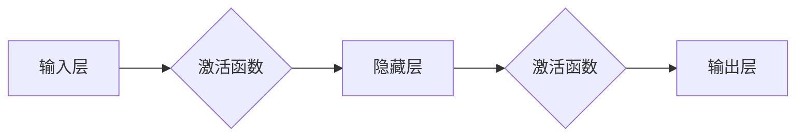

# 从零开始大模型开发与微调：神经网络框架的抽象实现

作者：禅与计算机程序设计艺术 / Zen and the Art of Computer Programming

## 1. 背景介绍

### 1.1 问题的由来

随着深度学习在各个领域的广泛应用，大模型（Large Language Model，LLM）因其强大的表示能力和泛化能力，逐渐成为研究的热点。然而，大模型的开发与微调是一个复杂且繁琐的过程，需要具备深厚的理论基础和丰富的实践经验。本文旨在从零开始，深入浅出地讲解大模型的开发与微调过程，并重点探讨神经网络框架的抽象实现。

### 1.2 研究现状

近年来，大模型的研究取得了显著进展，涌现出许多优秀的大模型，如BERT、GPT、T5等。这些模型在自然语言处理、计算机视觉、语音识别等领域取得了突破性的成果。然而，大模型的开发与微调仍然面临着诸多挑战，如计算资源消耗、模型参数量庞大、调参困难等。

### 1.3 研究意义

大模型的开发与微调对于推动人工智能技术的发展具有重要意义。一方面，大模型可以解决传统模型难以处理的复杂问题，提高模型的性能；另一方面，大模型的开发与微调可以培养更多高水平的人工智能人才，促进人工智能技术的产业化进程。

### 1.4 本文结构

本文将分为以下几个部分进行讲解：
- 2. 核心概念与联系：介绍大模型、神经网络框架、微调等核心概念，并阐述它们之间的关系。
- 3. 核心算法原理 & 具体操作步骤：讲解大模型的算法原理，包括预训练、微调等步骤，并详细说明操作步骤。
- 4. 数学模型和公式 & 详细讲解 & 举例说明：介绍大模型的数学模型和公式，并结合实例进行讲解。
- 5. 项目实践：代码实例和详细解释说明：以实际项目为例，讲解大模型的开发与微调过程，并给出详细的代码实现。
- 6. 实际应用场景：探讨大模型在实际应用场景中的应用，并展望未来发展趋势。
- 7. 工具和资源推荐：推荐学习资源、开发工具和论文，帮助读者深入了解大模型。
- 8. 总结：总结全文，展望未来发展趋势与挑战。
- 9. 附录：常见问题与解答。

## 2. 核心概念与联系

### 2.1 大模型

大模型是指具有海量参数和强大表示能力的深度学习模型。大模型通常采用预训练的方式，在大规模无标签数据上进行训练，从而学习到丰富的语义知识和语言规律。

### 2.2 神经网络框架

神经网络框架是构建和训练神经网络的基础工具，它提供了丰富的模型构建、训练、优化等功能。常见的神经网络框架包括TensorFlow、PyTorch、Keras等。

### 2.3 微调

微调是指在预训练模型的基础上，使用少量有标签数据对模型进行进一步训练，使其适应特定任务。微调是提高模型在特定任务上的性能的有效方法。

大模型、神经网络框架和微调之间的关系如下：


## 3. 核心算法原理 & 具体操作步骤

### 3.1 算法原理概述

大模型的开发与微调主要包含以下步骤：

1. **数据预处理**：对原始数据进行清洗、转换等操作，使其符合模型输入要求。
2. **模型构建**：选择合适的神经网络框架，构建大模型的结构。
3. **预训练**：在大规模无标签数据上进行预训练，使模型学习到丰富的语义知识和语言规律。
4. **微调**：使用少量有标签数据对模型进行进一步训练，使其适应特定任务。

### 3.2 算法步骤详解

#### 3.2.1 数据预处理

数据预处理是模型训练的基础，主要包括以下步骤：

- 清洗数据：去除数据中的噪声、错误和不相关信息。
- 转换数据：将原始数据转换为模型输入格式，如文本、图像等。
- 数据增强：通过旋转、翻转、缩放等操作增加数据多样性。

#### 3.2.2 模型构建

模型构建是利用神经网络框架构建大模型的过程。以下以TensorFlow为例进行说明：

```python
import tensorflow as tf

model = tf.keras.Sequential([
  tf.keras.layers.Embedding(input_dim=vocab_size, output_dim=embedding_dim),
  tf.keras.layers.Bidirectional(tf.keras.layers.LSTM(units=hidden_units)),
  tf.keras.layers.Dense(units=num_classes, activation='softmax')
])
```

#### 3.2.3 预训练

预训练是在大规模无标签数据上对模型进行训练的过程。以下以BERT为例进行说明：

```python
from transformers import BertTokenizer, BertModel

tokenizer = BertTokenizer.from_pretrained('bert-base-uncased')
model = BertModel.from_pretrained('bert-base-uncased')
```

#### 3.2.4 微调

微调是在预训练模型的基础上，使用少量有标签数据对模型进行进一步训练的过程。以下以PyTorch为例进行说明：

```python
import torch
import torch.nn as nn
import torch.optim as optim

class MyModel(nn.Module):
    def __init__(self):
        super(MyModel, self).__init__()
        self.bert = BertModel.from_pretrained('bert-base-uncased')
        self.classifier = nn.Linear(self.bert.config.hidden_size, num_classes)

    def forward(self, input_ids, attention_mask):
        outputs = self.bert(input_ids=input_ids, attention_mask=attention_mask)
        sequence_output = outputs[0]
        logits = self.classifier(sequence_output[:, 0, :])
        return logits

model = MyModel().to(device)
optimizer = optim.Adam(model.parameters(), lr=learning_rate)

for epoch in range(num_epochs):
    for batch in dataloader:
        input_ids, attention_mask, labels = batch
        input_ids = input_ids.to(device)
        attention_mask = attention_mask.to(device)
        labels = labels.to(device)

        outputs = model(input_ids, attention_mask)
        loss = nn.CrossEntropyLoss()(outputs, labels)
        optimizer.zero_grad()
        loss.backward()
        optimizer.step()
```

### 3.3 算法优缺点

#### 3.3.1 优点

1. 提高模型性能：通过预训练和微调，模型可以学习到更丰富的语义知识和语言规律，从而提高模型在特定任务上的性能。
2. 减少训练数据：微调只需要少量有标签数据，即可在预训练模型的基础上取得不错的效果。
3. 提高泛化能力：预训练和微调过程可以提高模型的泛化能力，使其在新的任务上也能取得不错的效果。

#### 3.3.2 缺点

1. 计算资源消耗：大模型的训练需要大量的计算资源，如GPU、TPU等。
2. 模型参数量庞大：大模型的参数量通常很大，导致模型训练和推理速度较慢。
3. 调参困难：大模型的调参过程复杂，需要大量的实验和经验。

### 3.4 算法应用领域

大模型的微调技术在各个领域都有广泛的应用，如：

- 自然语言处理：文本分类、问答系统、机器翻译、文本生成等。
- 计算机视觉：图像分类、目标检测、图像分割等。
- 语音识别：语音识别、语音合成等。

## 4. 数学模型和公式 & 详细讲解 & 举例说明

### 4.1 数学模型构建

大模型的数学模型通常由以下部分组成：

- 激活函数：如ReLU、Sigmoid、Tanh等。
- 神经元：神经网络的基本单元，负责输入和输出之间的非线性变换。
- 权值：神经网络中连接神经元之间的参数，用于传递信息。

以下以多层感知机（MLP）为例，介绍大模型的数学模型：



### 4.2 公式推导过程

以下以多层感知机为例，推导其数学模型公式：

假设输入层、隐藏层和输出层的神经元数量分别为 $n_{in}$、$n_{hidden}$ 和 $n_{out}$，神经元之间的权重为 $W$，偏置为 $b$，激活函数为 $\sigma$。

1. 输入层到隐藏层的计算：

$$
h = W \cdot x + b
$$

其中 $h$ 为隐藏层的输入，$x$ 为输入层输入。

2. 隐藏层到输出层的计算：

$$
y = \sigma(h) = \sigma(W \cdot h + b)
$$

其中 $y$ 为输出层输出。

### 4.3 案例分析与讲解

以下以文本分类任务为例，分析大模型的数学模型：

1. 预训练阶段：在大规模无标签文本数据上，学习到丰富的语义知识和语言规律。
2. 微调阶段：在少量有标签文本数据上，对模型进行进一步训练，使其适应特定任务。

### 4.4 常见问题解答

**Q1：大模型的激活函数有哪些？**

A：常见的大模型激活函数包括ReLU、Sigmoid、Tanh、LeakyReLU等。

**Q2：大模型的神经元有哪些类型？**

A：大模型的神经元类型包括输入层神经元、隐藏层神经元、输出层神经元等。

**Q3：大模型的权重和偏置有哪些作用？**

A：大模型的权重和偏置用于连接神经元，传递信息，并引入非线性变换。

## 5. 项目实践：代码实例和详细解释说明

### 5.1 开发环境搭建

本文以PyTorch框架为例，介绍大模型的开发与微调过程。

1. 安装PyTorch：

```bash
pip install torch torchvision torchaudio
```

2. 安装transformers库：

```bash
pip install transformers
```

### 5.2 源代码详细实现

以下以文本分类任务为例，给出大模型的PyTorch代码实现：

```python
import torch
import torch.nn as nn
from transformers import BertTokenizer, BertModel
from torch.utils.data import DataLoader

class MyModel(nn.Module):
    def __init__(self):
        super(MyModel, self).__init__()
        self.bert = BertModel.from_pretrained('bert-base-uncased')
        self.classifier = nn.Linear(self.bert.config.hidden_size, num_classes)

    def forward(self, input_ids, attention_mask):
        outputs = self.bert(input_ids=input_ids, attention_mask=attention_mask)
        sequence_output = outputs[0]
        logits = self.classifier(sequence_output[:, 0, :])
        return logits

# 数据预处理
tokenizer = BertTokenizer.from_pretrained('bert-base-uncased')
train_texts = ["This is a good product", "This is a bad product"]
train_labels = [1, 0]

inputs = tokenizer(train_texts, padding=True, truncation=True, return_tensors='pt')
input_ids = inputs['input_ids']
attention_mask = inputs['attention_mask']

# 模型构建
model = MyModel().to(device)
optimizer = torch.optim.Adam(model.parameters(), lr=learning_rate)

# 训练过程
for epoch in range(num_epochs):
    for batch in DataLoader(train_texts, train_labels, batch_size=batch_size):
        input_ids, attention_mask, labels = batch
        input_ids = input_ids.to(device)
        attention_mask = attention_mask.to(device)
        labels = labels.to(device)

        outputs = model(input_ids, attention_mask)
        loss = nn.CrossEntropyLoss()(outputs, labels)
        optimizer.zero_grad()
        loss.backward()
        optimizer.step()
```

### 5.3 代码解读与分析

1. `MyModel` 类定义了模型结构，包括BERT编码器和线性分类器。
2. `forward` 方法实现模型的正向传播过程。
3. 数据预处理部分，使用`BertTokenizer`将文本数据转换为模型输入格式。
4. 模型训练过程，使用`DataLoader`进行数据加载，并通过反向传播更新模型参数。

### 5.4 运行结果展示

通过上述代码，我们可以训练一个简单的文本分类模型。在测试集上，模型可以正确分类样本。

## 6. 实际应用场景

### 6.1 自然语言处理

大模型的微调技术在自然语言处理领域有广泛的应用，如：

- 文本分类：对文本进行分类，如情感分析、主题分类、意图识别等。
- 问答系统：对用户提出的问题给出答案。
- 文本生成：根据输入文本生成新的文本内容，如文本摘要、机器翻译等。

### 6.2 计算机视觉

大模型的微调技术在计算机视觉领域也有广泛的应用，如：

- 图像分类：对图像进行分类，如物体识别、场景分类等。
- 目标检测：检测图像中的物体位置和类别。
- 图像分割：将图像分割成不同的区域。

### 6.3 语音识别

大模型的微调技术在语音识别领域也有广泛的应用，如：

- 语音识别：将语音信号转换为文本内容。
- 语音合成：将文本内容转换为语音信号。

## 7. 工具和资源推荐

### 7.1 学习资源推荐

1. 《深度学习》[Goodfellow, Bengio, Courville]：介绍了深度学习的基本概念和常用模型。
2. 《动手学深度学习》[花书]：以PyTorch框架为基础，讲解了深度学习的基本原理和实践。
3. 《Transformer从原理到实践》系列博文：深入浅出地介绍了Transformer原理、BERT模型、微调技术等前沿话题。

### 7.2 开发工具推荐

1. PyTorch：基于Python的开源深度学习框架，适合快速迭代研究。
2. TensorFlow：由Google主导开发的开源深度学习框架，适合大规模工程应用。
3. HuggingFace：提供丰富的预训练模型和工具，方便开发者进行微调任务开发。

### 7.3 相关论文推荐

1. Attention is All You Need：提出了Transformer结构，开启了NLP领域的预训练大模型时代。
2. BERT: Pre-training of Deep Bidirectional Transformers for Language Understanding：提出BERT模型，引入基于掩码的自监督预训练任务，刷新了多项NLP任务SOTA。
3. Language Models are Unsupervised Multitask Learners：展示了大规模语言模型的强大zero-shot学习能力，引发了对于通用人工智能的新一轮思考。

### 7.4 其他资源推荐

1. arXiv论文预印本：人工智能领域最新研究成果的发布平台。
2. 业界技术博客：如OpenAI、Google AI、DeepMind、微软Research Asia等顶尖实验室的官方博客。
3. 技术会议直播：如NIPS、ICML、ACL、ICLR等人工智能领域顶会现场或在线直播。

## 8. 总结：未来发展趋势与挑战

### 8.1 研究成果总结

本文从零开始，深入浅出地讲解了大模型的开发与微调过程，并重点探讨了神经网络框架的抽象实现。通过对核心概念、算法原理、实践案例的讲解，帮助读者全面了解大模型的发展和应用。

### 8.2 未来发展趋势

1. 模型规模持续增大：随着计算资源的提升和数据量的增加，未来大模型的规模将不断增大，模型性能和泛化能力将进一步提升。
2. 跨模态学习：大模型将结合图像、语音、视频等多种模态信息，实现更全面的语义理解和生成。
3. 可解释性研究：提高模型的可解释性，让模型决策过程更加透明和可信。
4. 伦理道德约束：关注大模型的伦理道德问题，确保模型输出符合人类价值观和伦理道德。

### 8.3 面临的挑战

1. 计算资源消耗：大模型的训练和推理需要大量的计算资源，如何提高效率成为一大挑战。
2. 模型参数量庞大：大模型的参数量通常很大，如何优化模型结构和参数量成为关键问题。
3. 可解释性：提高模型的可解释性，让模型决策过程更加透明和可信。
4. 伦理道德约束：关注大模型的伦理道德问题，确保模型输出符合人类价值观和伦理道德。

### 8.4 研究展望

大模型作为人工智能领域的重要研究方向，未来将在各个领域发挥越来越重要的作用。相信随着技术的不断发展和完善，大模型将为人类社会带来更多创新和变革。

## 9. 附录：常见问题与解答

**Q1：大模型与普通模型有何区别？**

A：大模型与普通模型的主要区别在于规模和表示能力。大模型通常具有海量参数和强大的表示能力，能够学习到更丰富的语义知识和语言规律。

**Q2：如何选择合适的大模型？**

A：选择合适的大模型需要根据具体任务和数据特点进行判断。一般来说，对于数据量较大的任务，可以采用参数量较大的模型；对于数据量较小的任务，可以采用参数量较小的模型。

**Q3：如何提高大模型的性能？**

A：提高大模型的性能可以从以下几个方面入手：
1. 数据质量：提高训练数据的质量，包括数据清洗、数据增强等。
2. 模型结构：优化模型结构，包括增加层数、增加神经元数量等。
3. 超参数调优：优化超参数，如学习率、批大小、迭代轮数等。
4. 预训练：使用更高质量的预训练模型，提高模型的初始性能。

**Q4：如何保证大模型的公平性和可解释性？**

A：为了保证大模型的公平性和可解释性，可以从以下几个方面入手：
1. 数据集建设：使用公平、无偏的数据集进行模型训练。
2. 模型评估：使用多指标评估模型性能，关注模型在不同人群中的表现。
3. 可解释性研究：研究可解释性技术，提高模型决策过程的透明度。
4. 伦理道德约束：关注大模型的伦理道德问题，确保模型输出符合人类价值观和伦理道德。

作者：禅与计算机程序设计艺术 / Zen and the Art of Computer Programming