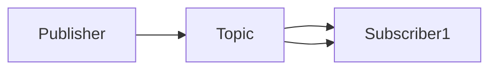

# 发布订阅 原理与代码实例讲解

作者：禅与计算机程序设计艺术 / Zen and the Art of Computer Programming

## 1. 背景介绍

### 1.1 问题的由来

随着软件系统的复杂性日益增加，传统的点对点通信模式已经难以满足分布式系统的需求。发布订阅模式作为一种消息传递机制，因其高效率和灵活性，在许多分布式系统中得到了广泛应用。

### 1.2 研究现状

发布订阅模式的研究始于20世纪80年代，经过多年的发展，已经形成了多种实现方式，如拉模型（Pull Model）和推模型（Push Model）。近年来，随着云计算和大数据技术的兴起，发布订阅模式在微服务架构、物联网、消息队列等领域得到了广泛应用。

### 1.3 研究意义

发布订阅模式在分布式系统中具有以下意义：

- **松耦合**：发布者和订阅者之间解耦，降低系统耦合度，提高系统可扩展性和可维护性。
- **灵活性和可扩展性**：支持动态添加、删除和修改订阅者，适应系统变化。
- **异步通信**：实现消息的异步传递，降低系统延迟和负载。

### 1.4 本文结构

本文将围绕发布订阅模式展开，首先介绍其核心概念和联系，然后讲解核心算法原理和具体操作步骤，接着通过数学模型和公式进行详细讲解和举例说明，最后通过项目实践和代码实例进行详细解释说明，并探讨实际应用场景和未来发展趋势。

## 2. 核心概念与联系

发布订阅模式由三个核心角色组成：发布者（Publisher）、主题（Topic）和订阅者（Subscriber）。

### 2.1 发布者（Publisher）

发布者负责发布消息，将消息发送到主题。发布者不需要知道具体的订阅者信息，只需将消息发送到主题即可。

### 2.2 主题（Topic）

主题作为消息的传递媒介，负责存储和转发消息。发布者将消息发送到主题，订阅者从主题中订阅感兴趣的消息。

### 2.3 订阅者（Subscriber）

订阅者负责订阅感兴趣的消息，并从主题中获取消息。订阅者可以订阅多个主题，也可以同时订阅多个主题中的消息。

发布者、主题和订阅者之间的关系可以用以下Mermaid流程图表示：



## 3. 核心算法原理 & 具体操作步骤

### 3.1 算法原理概述

发布订阅模式的核心算法原理是消息传递。发布者将消息发送到主题，主题负责将消息转发给所有订阅该主题的订阅者。

### 3.2 算法步骤详解

发布订阅模式的基本步骤如下：

1. 订阅者连接到主题，并订阅感兴趣的消息。
2. 发布者连接到主题，并将消息发送到主题。
3. 主题将消息转发给所有订阅该消息的订阅者。
4. 订阅者接收到消息后进行处理。

### 3.3 算法优缺点

#### 优点：

- 松耦合：发布者和订阅者之间解耦，降低系统耦合度。
- 灵活性：支持动态添加、删除和修改订阅者。
- 可扩展性：适应系统变化，支持动态扩展。

#### 缺点：

- 竞态条件：在高并发场景下，可能存在消息丢失、重复或顺序错误的问题。
- 难以控制消息传递顺序：订阅者无法控制消息的传递顺序。

### 3.4 算法应用领域

发布订阅模式在以下领域得到了广泛应用：

- 消息队列：如RabbitMQ、Kafka等。
- 微服务架构：如Spring Cloud Stream、Service Mesh等。
- 物联网：如MQTT协议。
- 分布式数据库：如Apache Pulsar。

## 4. 数学模型和公式 & 详细讲解 & 举例说明

### 4.1 数学模型构建

发布订阅模式可以建模为一个消息传递系统。假设有$n$个发布者、$m$个订阅者和$k$个主题，我们可以用以下数学模型表示：

- $P_i$表示第$i$个发布者。
- $S_j$表示第$j$个订阅者。
- $T_l$表示第$l$个主题。
- $M$表示所有消息的集合。

消息传递过程可以表示为以下公式：

$$M = \{M_{ij}\}_{i=1}^{n}, \{M_{jl}\}_{j=1}^{m}, \{M_{lk}\}_{l=1}^{k}$$

其中，

- $M_{ij}$表示第$i$个发布者发布的第$j$个消息。
- $M_{jl}$表示第$l$个主题的第$j$个消息。
- $M_{lk}$表示第$l$个主题的第$k$个消息。

### 4.2 公式推导过程

假设第$i$个发布者发布了一个消息$M_{ij}$，主题$T_l$需要将这个消息转发给所有订阅该主题的订阅者。我们可以用以下公式表示：

$$F(M_{ij}) = \{S_j | S_j \in S, T_l \in T, (S_j, T_l) \in S_{订阅}\}$$

其中，

- $S$表示所有订阅者的集合。
- $T$表示所有主题的集合。
- $S_{订阅}$表示订阅关系集合，表示订阅者订阅的主题。

### 4.3 案例分析与讲解

假设有3个发布者、2个订阅者和2个主题：

- 发布者1订阅主题1和主题2。
- 发布者2订阅主题1。
- 发布者3订阅主题2。
- 订阅者1订阅主题1。
- 订阅者2订阅主题2。

当发布者1发布消息"Hello, Topic 1!"时，主题1将消息转发给订阅者1和订阅者2。当发布者2发布消息"Hello, Topic 1!"时，主题1将消息转发给订阅者2。

### 4.4 常见问题解答

**问题1：发布订阅模式与点对点通信模式的区别是什么？**

发布订阅模式与点对点通信模式的主要区别在于消息传递方式。发布订阅模式支持发布者和订阅者之间解耦，而点对点通信模式要求发布者和订阅者之间建立直接的连接。

**问题2：如何保证发布订阅模式的可靠性？**

为了保证发布订阅模式的可靠性，可以采用以下方法：

- 采用消息队列中间件，如RabbitMQ、Kafka等，实现消息的持久化和可靠性保证。
- 使用分布式事务，确保消息的发送和接收过程的一致性。
- 实现消息的顺序保证和去重机制。

## 5. 项目实践：代码实例和详细解释说明

### 5.1 开发环境搭建

1. 安装Python环境。
2. 安装RabbitMQ。

### 5.2 源代码详细实现

以下是一个使用RabbitMQ实现发布订阅模式的Python代码实例：

```python
import pika

# 连接到RabbitMQ服务器
connection = pika.BlockingConnection(pika.ConnectionParameters('localhost'))
channel = connection.channel()

# 创建主题
channel.exchange_declare(exchange='topic_exchange', exchange_type='topic')

# 发布消息
def publish_message(exchange, routing_key, message):
    channel.basic_publish(exchange=exchange, routing_key=routing_key, body=message)

# 订阅消息
def consume_message(queue_name, exchange, routing_key):
    channel.queue_declare(queue=queue_name, durable=True)
    channel.basic_consume(queue=queue_name, on_message_callback=lambda ch, method, properties, body: print(f"Received {body}"))

# 发布者
def publisher():
    publish_message('topic_exchange', 'topic1', 'Hello, Topic 1!')
    publish_message('topic_exchange', 'topic2', 'Hello, Topic 2!')

# 订阅者1
def subscriber1():
    consume_message('queue1', 'topic_exchange', 'topic1')

# 订阅者2
def subscriber2():
    consume_message('queue2', 'topic_exchange', 'topic2')

if __name__ == '__main__':
    publisher()
    subscriber1()
    subscriber2()

    # 等待用户输入
    input('Press [Enter] to exit')
    connection.close()
```

### 5.3 代码解读与分析

1. 连接到RabbitMQ服务器，创建通道。
2. 创建主题`topic_exchange`。
3. 发布者调用`publish_message`函数发布消息。
4. 订阅者调用`consume_message`函数订阅消息。
5. 主函数中创建发布者和订阅者线程，并启动它们。
6. 等待用户输入，关闭连接。

### 5.4 运行结果展示

运行代码后，发布者将消息发送到主题`topic1`和`topic2`，订阅者1接收主题`topic1`的消息，订阅者2接收主题`topic2`的消息。

## 6. 实际应用场景

发布订阅模式在实际应用中具有广泛的应用场景，以下是一些典型的应用场景：

- **消息队列**：如RabbitMQ、Kafka等，用于实现异步消息传递和系统解耦。
- **微服务架构**：如Spring Cloud Stream，用于实现服务之间的通信和协作。
- **物联网**：如MQTT协议，用于实现设备之间的消息传递和通信。
- **分布式数据库**：如Apache Pulsar，用于实现分布式数据存储和查询。

## 7. 工具和资源推荐

### 7.1 学习资源推荐

- **RabbitMQ官方文档**：[https://www.rabbitmq.com/documentation.html](https://www.rabbitmq.com/documentation.html)
- **Kafka官方文档**：[https://kafka.apache.org/documentation.html](https://kafka.apache.org/documentation.html)
- **Spring Cloud Stream官方文档**：[https://docs.spring.io/spring-cloud-stream/docs/current/reference/htmlsingle/](https://docs.spring.io/spring-cloud-stream/docs/current/reference/htmlsingle/)

### 7.2 开发工具推荐

- **RabbitMQ管理界面**：[https://www.rabbitmq.com/demo.html](https://www.rabbitmq.com/demo.html)
- **Kafka可视化工具**：如Kafka Manager、Kafka Monitor等
- **Spring Cloud Stream可视化工具**：如Spring Cloud Stream Dashboard

### 7.3 相关论文推荐

- **《An Overview of Messaging Systems》**：介绍了消息队列和发布订阅模式的基本概念和技术。
- **《Message Passing in Distributed Systems》**：详细讨论了消息传递在分布式系统中的应用和挑战。

### 7.4 其他资源推荐

- **《大型网站技术架构》**：介绍了发布订阅模式在大型网站中的应用和优化。
- **《分布式系统原理与范型》**：深入探讨了分布式系统中的消息传递和发布订阅模式。

## 8. 总结：未来发展趋势与挑战

发布订阅模式作为分布式系统中重要的消息传递机制，在未来的发展中将面临以下趋势和挑战：

### 8.1 趋势

- **高性能和低延迟**：随着云计算和边缘计算的发展，发布订阅系统将追求更高的性能和更低的延迟。
- **多协议支持**：发布订阅系统将支持更多协议，如AMQP、MQTT等，满足不同场景的需求。
- **跨平台和跨语言**：发布订阅系统将实现跨平台和跨语言的互操作性，方便开发者使用。

### 8.2 挑战

- **安全性**：在分布式环境中，保证消息传递的安全性是一个重要挑战。
- **可扩展性**：如何保证发布订阅系统的可扩展性，以满足大规模系统的需求。
- **容错性**：如何保证发布订阅系统的容错性，在系统故障的情况下保持正常运行。

发布订阅模式作为分布式系统中重要的消息传递机制，将在未来发挥越来越重要的作用。通过不断的技术创新和优化，发布订阅系统将更好地满足分布式系统的需求，推动分布式技术的不断发展。

## 9. 附录：常见问题与解答

### 9.1 发布订阅模式与观察者模式有何区别？

发布订阅模式与观察者模式在概念上有一定的相似性，但它们的应用场景和实现方式有所不同。

- **观察者模式**：是一种设计模式，用于实现对象间的观察者-被观察者关系。当一个对象的状态发生变化时，所有注册的观察者都会得到通知。
- **发布订阅模式**：是一种消息传递机制，用于实现发布者和订阅者之间的解耦。发布者不需要知道具体的订阅者信息，只需将消息发送到主题即可。

### 9.2 如何保证发布订阅模式的可靠性？

为了保证发布订阅模式的可靠性，可以采用以下方法：

- 采用消息队列中间件，如RabbitMQ、Kafka等，实现消息的持久化和可靠性保证。
- 使用分布式事务，确保消息的发送和接收过程的一致性。
- 实现消息的顺序保证和去重机制。

### 9.3 如何提高发布订阅系统的性能？

以下是一些提高发布订阅系统性能的方法：

- 使用高性能的消息队列中间件，如RabbitMQ、Kafka等。
- 采用分布式部署，提高系统并发处理能力。
- 优化消息处理流程，减少消息处理时间。

### 9.4 如何保证发布订阅系统的安全性？

为了保证发布订阅系统的安全性，可以采用以下方法：

- 对消息进行加密，防止消息泄露。
- 实施访问控制，限制对发布订阅系统的访问。
- 定期审计系统日志，及时发现和解决安全问题。