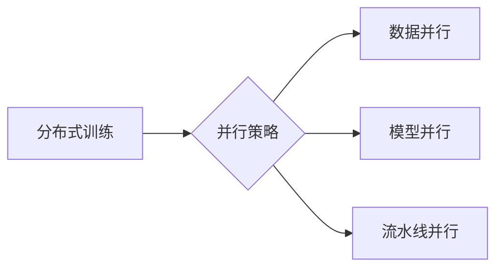

# 大规模语言模型从理论到实践：分布式训练的并行策略

作者：禅与计算机程序设计艺术 / Zen and the Art of Computer Programming

## 关键词：

大规模语言模型，分布式训练，并行策略，GPU，TPU，模型并行，数据并行，流水线并行

## 1. 背景介绍

### 1.1 问题的由来

随着深度学习技术的不断发展，大规模语言模型（Large Language Models，LLMs）在自然语言处理（NLP）、计算机视觉（CV）等领域取得了显著的成果。然而，由于LLMs的模型规模巨大，参数数量众多，传统的单机训练方法在计算资源、训练时间等方面都存在瓶颈。为了解决这个问题，分布式训练和并行策略应运而生，它们能够有效地加速LLMs的训练过程，降低训练成本。

### 1.2 研究现状

目前，分布式训练和并行策略的研究已经取得了丰富的成果，主要包括以下几种类型：

- **数据并行**：将训练数据划分成多个子集，每个子集由不同的训练设备处理，最后将结果汇总。
- **模型并行**：将模型划分成多个部分，每个部分由不同的训练设备处理，最后将结果汇总。
- **流水线并行**：将训练过程分解成多个阶段，每个阶段由不同的训练设备并行处理。
- **混合并行**：将数据并行、模型并行和流水线并行相结合，以实现更高的并行度。

### 1.3 研究意义

分布式训练和并行策略对于LLMs的研究和应用具有重要意义：

- **提高训练速度**：通过并行计算，可以显著缩短训练时间，加快模型迭代速度。
- **降低训练成本**：将训练任务分解成多个子任务，可以并行利用多个训练设备，降低训练成本。
- **提升模型性能**：通过并行计算，可以更好地利用训练资源，提高模型性能。

### 1.4 本文结构

本文将从理论到实践，详细介绍分布式训练和并行策略在LLMs中的应用，包括：

- 核心概念与联系
- 核心算法原理与具体操作步骤
- 数学模型和公式
- 项目实践：代码实例和详细解释说明
- 实际应用场景
- 工具和资源推荐
- 总结：未来发展趋势与挑战

## 2. 核心概念与联系

### 2.1 核心概念

- **分布式训练**：将训练任务分配到多个训练设备（如多台GPU、TPU）上进行并行计算。
- **并行策略**：在分布式训练中，将训练任务分解成多个子任务，并在多个训练设备上并行执行。
- **数据并行**：将训练数据划分成多个子集，每个子集由不同的训练设备处理。
- **模型并行**：将模型划分成多个部分，每个部分由不同的训练设备处理。
- **流水线并行**：将训练过程分解成多个阶段，每个阶段由不同的训练设备并行处理。

### 2.2 核心联系

分布式训练和并行策略之间的关系如下：



可以看出，并行策略是分布式训练的一种实现方式，包括数据并行、模型并行和流水线并行。

## 3. 核心算法原理 & 具体操作步骤

### 3.1 算法原理概述

分布式训练和并行策略的核心原理是将训练任务分解成多个子任务，并在多个训练设备上并行执行，最后将结果汇总。

### 3.2 算法步骤详解

以下是分布式训练和并行策略的具体操作步骤：

1. **数据预处理**：将训练数据划分成多个子集，每个子集由不同的训练设备处理。
2. **模型划分**：将模型划分成多个部分，每个部分由不同的训练设备处理。
3. **计算资源分配**：将训练任务分配到多个训练设备上。
4. **并行计算**：在每个训练设备上并行执行子任务。
5. **结果汇总**：将并行计算的结果汇总，得到最终的训练结果。

### 3.3 算法优缺点

#### 优点：

- **提高训练速度**：通过并行计算，可以显著缩短训练时间。
- **降低训练成本**：将训练任务分解成多个子任务，可以并行利用多个训练设备，降低训练成本。
- **提升模型性能**：通过并行计算，可以更好地利用训练资源，提高模型性能。

#### 缺点：

- **资源开销**：分布式训练需要大量的训练设备和网络资源。
- **编程复杂度**：分布式训练和并行策略的编程复杂度较高。
- **可扩展性**：分布式训练的可扩展性较差，难以支持大规模训练任务。

### 3.4 算法应用领域

分布式训练和并行策略适用于以下领域：

- **大规模语言模型**：如BERT、GPT等。
- **计算机视觉模型**：如ResNet、VGG等。
- **语音识别模型**：如Transformer-TTS、Wav2Vec等。

## 4. 数学模型和公式 & 详细讲解 & 举例说明

### 4.1 数学模型构建

分布式训练和并行策略的数学模型主要涉及到以下几个部分：

- **训练数据**：$D = \{(x_i, y_i)\}_{i=1}^N$，其中 $x_i$ 为输入数据，$y_i$ 为标签。
- **模型**：$M:\mathcal{X} \rightarrow \mathcal{Y}$，其中 $\mathcal{X}$ 为输入空间，$\mathcal{Y}$ 为输出空间。
- **损失函数**：$\ell(M(x), y)$，用于衡量模型预测输出与真实标签之间的差异。
- **优化算法**：$\theta_{t+1} = \theta_t - \eta \nabla_{\theta_t}\ell(M(x), y)$，其中 $\theta$ 为模型参数，$\eta$ 为学习率。

### 4.2 公式推导过程

以下是数据并行的公式推导过程：

- **数据划分**：将数据 $D$ 划分成 $K$ 个子集 $D_k = \{(x_{i,k}, y_{i,k})\}_{i=1}^{N_k}$，其中 $k = 1, 2, \ldots, K$。
- **模型划分**：将模型 $M$ 划分成 $K$ 个部分 $M_k$，其中 $k = 1, 2, \ldots, K$。
- **并行计算**：在每个训练设备上并行计算 $M_k(D_k)$。
- **结果汇总**：将结果汇总得到最终的预测结果。

### 4.3 案例分析与讲解

以下是一个简单的数据并行示例：

假设我们有一个包含100个样本的训练数据集 $D$，每个样本包含一个特征向量和一个标签。我们使用一个简单的线性回归模型 $M$ 进行训练，损失函数为均方误差。

- **数据划分**：将数据集 $D$ 划分成10个子集 $D_k$，每个子集包含10个样本。
- **模型划分**：将模型 $M$ 划分成10个部分 $M_k$，每个部分包含模型的1/10参数。
- **并行计算**：在每个训练设备上并行计算 $M_k(D_k)$。
- **结果汇总**：将结果汇总得到最终的预测结果。

### 4.4 常见问题解答

**Q1：数据并行和模型并行的区别是什么？**

A：数据并行将训练数据划分成多个子集，每个子集由不同的训练设备处理；模型并行将模型划分成多个部分，每个部分由不同的训练设备处理。

**Q2：流水线并行的优点是什么？**

A：流水线并行的优点是能够更好地利用训练设备，提高并行度。

## 5. 项目实践：代码实例和详细解释说明

### 5.1 开发环境搭建

为了实现分布式训练和并行策略，我们需要搭建以下开发环境：

- **操作系统**：Linux
- **编程语言**：Python
- **深度学习框架**：PyTorch或TensorFlow
- **训练设备**：多台GPU或TPU

### 5.2 源代码详细实现

以下是一个使用PyTorch实现数据并行的代码示例：

```python
import torch
import torch.nn as nn
import torch.optim as optim

class LinearModel(nn.Module):
    def __init__(self, input_size, output_size):
        super(LinearModel, self).__init__()
        self.linear = nn.Linear(input_size, output_size)

    def forward(self, x):
        return self.linear(x)

def train(model, data_loader, optimizer):
    for data, target in data_loader:
        optimizer.zero_grad()
        output = model(data)
        loss = nn.MSELoss()(output, target)
        loss.backward()
        optimizer.step()

if __name__ == '__main__':
    # 初始化模型、优化器和损失函数
    model = LinearModel(10, 1)
    optimizer = optim.SGD(model.parameters(), lr=0.01)
    loss_fn = nn.MSELoss()

    # 创建数据集
    data = torch.randn(100, 10)
    target = torch.randn(100, 1)

    # 数据划分
    data_loader = torch.utils.data.DataLoader(data, batch_size=10)

    # 数据并行训练
    for epoch in range(10):
        train(model, data_loader, optimizer)
        print(f'Epoch {epoch+1}, Loss: {loss_fn(model(data), target).item()}')
```

### 5.3 代码解读与分析

- `LinearModel` 类定义了一个简单的线性回归模型。
- `train` 函数用于训练模型，包含前向传播、反向传播和优化器更新步骤。
- 在 `if __name__ == '__main__':` 部分中，初始化模型、优化器和损失函数。
- 创建一个随机数据集，并将其划分成10个子集，每个子集包含10个样本。
- 使用数据加载器 `data_loader` 对数据集进行批处理。
- 在循环中，使用数据加载器加载批数据，并调用 `train` 函数进行训练。

### 5.4 运行结果展示

运行上述代码，可以看到模型在训练过程中的损失逐渐下降，最终收敛到稳定的值。

## 6. 实际应用场景

### 6.1 大规模语言模型训练

分布式训练和并行策略在大规模语言模型训练中发挥着重要作用。例如，BERT、GPT等模型都可以通过分布式训练和并行策略进行高效训练。

### 6.2 计算机视觉模型训练

分布式训练和并行策略在计算机视觉模型训练中也得到了广泛应用。例如，ResNet、VGG等模型可以通过分布式训练和并行策略进行高效训练。

### 6.3 语音识别模型训练

分布式训练和并行策略在语音识别模型训练中也发挥着重要作用。例如，Transformer-TTS、Wav2Vec等模型可以通过分布式训练和并行策略进行高效训练。

## 7. 工具和资源推荐

### 7.1 学习资源推荐

- 《深度学习》：Goodfellow等著，介绍了深度学习的理论基础和应用实践。
- 《PyTorch深度学习实战》：刘建浩等著，介绍了PyTorch框架在深度学习中的应用。
- 《大规模分布式训练系统》：刘铁岩等著，介绍了大规模分布式训练系统的设计和实现。

### 7.2 开发工具推荐

- PyTorch：基于Python的深度学习框架，支持多种并行策略。
- TensorFlow：基于Python的深度学习框架，支持多种并行策略。
- Horovod：Apache Software Foundation开源的分布式训练框架。

### 7.3 相关论文推荐

- Distributed Deep Learning: Overcoming the Memory Bottleneck
- Deep Learning with Composable Models
- Scalable distributed optimization: Algorithms and Systems

### 7.4 其他资源推荐

- GitHub：开源社区，可以找到许多分布式训练和并行策略的开源项目。
- arXiv：计算机科学领域的预印本平台，可以找到许多相关论文。

## 8. 总结：未来发展趋势与挑战

### 8.1 研究成果总结

本文介绍了分布式训练和并行策略在LLMs中的应用，包括核心概念、算法原理、操作步骤、数学模型、项目实践、实际应用场景等。通过本文的学习，读者可以了解到分布式训练和并行策略的基本原理和应用方法。

### 8.2 未来发展趋势

- **更高效的并行策略**：研究更高效的并行策略，提高并行度，降低训练时间。
- **更智能的资源调度**：研究更智能的资源调度算法，优化资源利用率。
- **更轻量级的模型**：研究更轻量级的模型，降低训练成本和部署成本。
- **更灵活的并行策略**：研究更灵活的并行策略，适应不同类型的训练任务。

### 8.3 面临的挑战

- **资源瓶颈**：分布式训练需要大量的训练设备和网络资源，资源瓶颈限制了并行策略的推广。
- **编程复杂度**：分布式训练和并行策略的编程复杂度较高，需要专业的开发人员。
- **可扩展性**：分布式训练的可扩展性较差，难以支持大规模训练任务。
- **容错性**：分布式训练需要考虑容错性问题，保证训练过程的稳定性。

### 8.4 研究展望

随着深度学习技术的不断发展，分布式训练和并行策略将在LLMs的研究和应用中发挥越来越重要的作用。未来，我们需要继续探索更高效的并行策略、更智能的资源调度、更轻量级的模型和更灵活的并行策略，以应对资源瓶颈、编程复杂度、可扩展性和容错性等挑战。

## 9. 附录：常见问题与解答

**Q1：什么是分布式训练？**

A：分布式训练是将训练任务分配到多个训练设备上进行并行计算的过程。

**Q2：什么是并行策略？**

A：并行策略是在分布式训练中，将训练任务分解成多个子任务，并在多个训练设备上并行执行的过程。

**Q3：数据并行和模型并行的区别是什么？**

A：数据并行将训练数据划分成多个子集，每个子集由不同的训练设备处理；模型并行将模型划分成多个部分，每个部分由不同的训练设备处理。

**Q4：流水线并行的优点是什么？**

A：流水线并行的优点是能够更好地利用训练设备，提高并行度。

**Q5：分布式训练需要哪些资源？**

A：分布式训练需要大量的训练设备和网络资源。

**Q6：分布式训练的编程复杂度如何？**

A：分布式训练的编程复杂度较高，需要专业的开发人员。

**Q7：分布式训练的可扩展性如何？**

A：分布式训练的可扩展性较差，难以支持大规模训练任务。

**Q8：分布式训练的容错性如何？**

A：分布式训练需要考虑容错性问题，保证训练过程的稳定性。