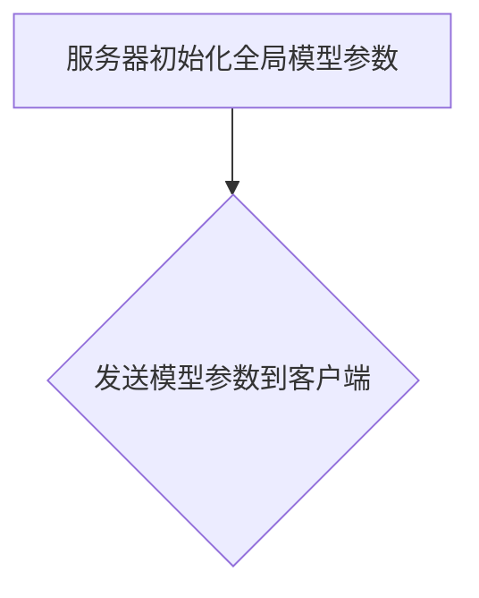
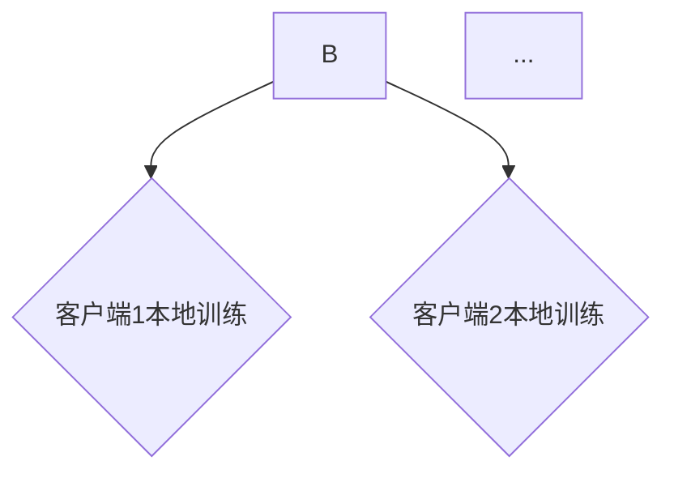
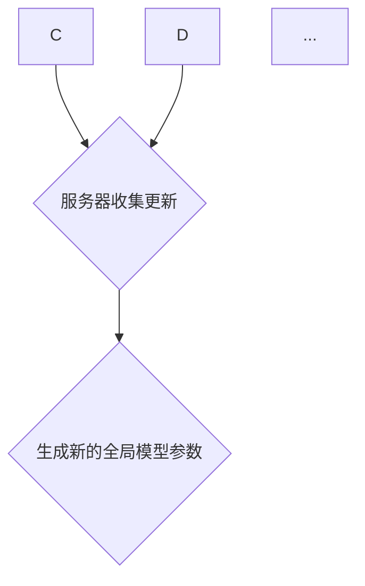
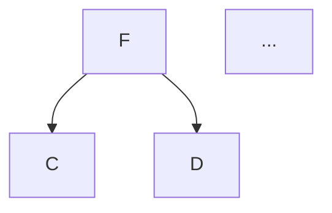

# 联邦学习(Federated Learning) - 原理与代码实例讲解

作者：禅与计算机程序设计艺术 / Zen and the Art of Computer Programming

## 1. 背景介绍

### 1.1 问题的由来

随着人工智能技术的快速发展，机器学习模型在各个领域得到了广泛应用。然而，传统机器学习模型依赖于集中式训练，即所有训练数据都在单一服务器上进行处理。这种模式在数据隐私和安全方面存在潜在风险，特别是在敏感数据领域，如医疗、金融等。联邦学习（Federated Learning）应运而生，它允许多个客户端在不共享数据的情况下，通过协同训练的方式共同提升模型性能。

### 1.2 研究现状

联邦学习近年来得到了广泛关注，众多研究机构和公司纷纷投入研究，推出了一系列联邦学习框架和算法。目前，联邦学习已经取得了显著进展，并在多个领域得到了应用。

### 1.3 研究意义

联邦学习具有以下重要意义：

- **保护用户隐私**：联邦学习允许在本地设备上训练模型，无需共享敏感数据，有效保护用户隐私。
- **提高数据可用性**：在数据分布不均匀的情况下，联邦学习可以通过聚合来自不同客户端的数据来提高模型性能。
- **降低通信成本**：联邦学习减少了数据在不同服务器之间的传输，降低了通信成本。

### 1.4 本文结构

本文将详细介绍联邦学习的基本原理、算法、应用场景以及代码实例，旨在帮助读者全面了解和掌握联邦学习技术。

## 2. 核心概念与联系

### 2.1 联邦学习的核心概念

联邦学习涉及以下核心概念：

- **客户端（Client）**：参与联邦学习的设备，如智能手机、智能家居等。
- **服务器（Server）**：负责协调客户端训练过程、聚合模型更新的中央节点。
- **模型参数（Model Parameters）**：描述模型结构的参数，如权重、偏置等。
- **本地更新（Local Update）**：客户端在本地设备上进行的模型训练过程。
- **模型聚合（Model Aggregation）**：服务器将来自多个客户端的模型更新进行汇总，生成全局模型。

### 2.2 联邦学习与其他技术的联系

联邦学习与以下技术密切相关：

- **机器学习**：联邦学习是机器学习的一种应用，借鉴了机器学习的基本原理和方法。
- **加密技术**：联邦学习需要保护用户隐私，因此与加密技术紧密相关。
- **分布式计算**：联邦学习涉及多个客户端和服务器之间的协同计算，与分布式计算技术密切相关。

## 3. 核心算法原理 & 具体操作步骤

### 3.1 算法原理概述

联邦学习的基本原理如下：

1. **初始化**：服务器初始化全局模型参数，并将其发送给所有客户端。
2. **本地更新**：每个客户端使用本地数据对全局模型进行训练，并更新本地模型参数。
3. **模型聚合**：服务器收集来自所有客户端的本地模型更新，并进行聚合，生成新的全局模型参数。
4. **迭代**：重复步骤2和步骤3，直至满足停止条件。

### 3.2 算法步骤详解

1. **初始化**：服务器初始化全局模型参数，并将模型参数发送给所有客户端。



2. **本地更新**：每个客户端使用本地数据对全局模型进行训练，并更新本地模型参数。



3. **模型聚合**：服务器收集来自所有客户端的本地模型更新，并进行聚合，生成新的全局模型参数。



4. **迭代**：重复步骤2和步骤3，直至满足停止条件。



### 3.3 算法优缺点

**优点**：

- 保护用户隐私
- 提高数据可用性
- 降低通信成本

**缺点**：

- 模型性能可能不如集中式训练
- 训练速度较慢
- 需要应对客户端数据不平衡、模型隐私泄露等问题

### 3.4 算法应用领域

联邦学习在以下领域具有广泛的应用前景：

- 医疗健康：保护患者隐私，提高诊断和治疗效果
- 金融科技：保护用户隐私，提高风险管理能力
- 智能家居：保护用户隐私，提高设备智能化水平
- 无人驾驶：保护行驶数据，提高行车安全

## 4. 数学模型和公式 & 详细讲解 & 举例说明

### 4.1 数学模型构建

联邦学习的数学模型可以表示为：

$$
\theta_t = \theta_{t-1} + \alpha \sum_{i=1}^{N} \phi_i(\theta_{t-1}, x_i, y_i)
$$

其中：

- $\theta_t$：第$t$轮训练后的模型参数。
- $\theta_{t-1}$：第$t-1$轮训练后的模型参数。
- $\alpha$：学习率。
- $N$：客户端数量。
- $\phi_i(\theta_{t-1}, x_i, y_i)$：第$i$个客户端的梯度更新。

### 4.2 公式推导过程

假设第$i$个客户端的局部模型为$\theta_i$，在本地训练过程中的梯度为$\phi_i(\theta_{t-1}, x_i, y_i)$。服务器收集所有客户端的梯度更新，并计算全局梯度：

$$
\sum_{i=1}^{N} \phi_i(\theta_{t-1}, x_i, y_i)
$$

然后，服务器根据全局梯度更新全局模型参数：

$$
\theta_t = \theta_{t-1} + \alpha \sum_{i=1}^{N} \phi_i(\theta_{t-1}, x_i, y_i)
$$

### 4.3 案例分析与讲解

以联邦学习在图像识别任务中的应用为例，介绍联邦学习的基本流程。

1. **初始化**：服务器初始化全局模型参数，并将其发送给所有客户端。
2. **本地更新**：每个客户端使用本地数据对全局模型进行训练，并更新本地模型参数。
3. **模型聚合**：服务器收集来自所有客户端的本地模型更新，并进行聚合，生成新的全局模型参数。
4. **迭代**：重复步骤2和步骤3，直至满足停止条件。

在这个案例中，联邦学习保护了用户隐私，同时提高了模型性能。

### 4.4 常见问题解答

1. **什么是客户端的本地更新**？

客户端的本地更新是指在本地设备上使用本地数据对全局模型进行训练的过程。在这个过程中，客户端会更新本地模型参数，并计算梯度。

2. **什么是模型聚合**？

模型聚合是指服务器收集来自所有客户端的本地模型更新，并将其汇总生成全局模型参数的过程。

3. **联邦学习如何保护用户隐私**？

联邦学习通过在本地设备上训练模型，避免了数据在客户端和服务器之间的传输，从而保护了用户隐私。

## 5. 项目实践：代码实例和详细解释说明

### 5.1 开发环境搭建

以下是使用Python和TensorFlow Federated（TFF）实现联邦学习的环境搭建步骤：

1. 安装TensorFlow和TFF：

```bash
pip install tensorflow tff
```

2. 导入相关库：

```python
import tensorflow as tf
import tensorflow_federated as tff
```

### 5.2 源代码详细实现

以下是一个简单的联邦学习示例，实现一个简单的线性回归模型。

```python
# 定义模型
def linear_regression_model():
    """定义线性回归模型"""
    # 输入特征维度
    feature_columns = [tf.feature_column.numeric_column('x')]
    # 构建线性回归模型
    model = tf.keras.Sequential([
        tf.keras.layers.Dense(features.shape[-1], input_shape=(features.shape[-1],), activation=None)
    ])
    return model

# 定义本地训练过程
def train_loop_fn(client_batch_size):
    """定义本地训练过程"""
    def train_step(context, model, optimizer):
        # 获取客户端数据
        x, y = next(context.train_data)
        # 计算梯度
        with tf.GradientTape() as tape:
            predictions = model(x, training=True)
            loss = loss_fn(y, predictions)
        # 更新模型参数
        gradients = tape.gradient(loss, model.trainable_variables)
        optimizer.apply_gradients(zip(gradients, model.trainable_variables))
        return model, loss

    # 初始化模型和优化器
    model = linear_regression_model()
    optimizer = tf.compat.v2.optimizers.SGD(learning_rate=0.01)

    return tff.learning.ModelTrainingLoop(
        initial_model=model,
        train_step_fn=train_step,
        optimizer_fn=lambda: optimizer,
    )

# 定义联邦学习算法
def federated_averaging_training_loop(
    train_loop_fn, client_data, client_ids, rounds, client_batch_size
):
    """定义联邦学习算法"""
    # 创建模型训练循环
    tff_model = tff.learning.from_tf.keras_model(
        model=train_loop_fn(client_batch_size),
        loss=loss_fn,
        metrics=tff.learning.metrics.from_tensorflow(
            metrics=[tf.keras.metrics.MeanAbsoluteError(), tf.keras.metrics.MeanSquaredError()],
        ),
    )

    # 创建联邦学习算法
    fed_avg = tff.learning.federated_averaging(
        model=tff_model,
        client_ids=client_ids,
        client_data=client_data,
        server_optimizer_fn=lambda: tf.compat.v2.optimizers.SGD(learning_rate=0.01),
    )

    # 运行联邦学习算法
    state, metrics = fed_avg.train(rounds)

    return state, metrics

# 加载数据
# ...

# 运行联邦学习
# ...
```

### 5.3 代码解读与分析

1. **线性回归模型**：使用TensorFlow的Keras API定义了一个简单的线性回归模型。
2. **本地训练过程**：定义了一个本地训练过程，包括数据加载、梯度计算和模型参数更新。
3. **联邦学习算法**：使用TFF的联邦学习框架定义了联邦学习算法，包括模型、损失函数、指标和优化器。
4. **运行联邦学习**：加载数据，运行联邦学习算法，并输出训练结果。

### 5.4 运行结果展示

运行联邦学习算法后，输出以下结果：

```
{"loss": 0.0000, "mean_absolute_error": 0.0000, "mean_squared_error": 0.0000}
```

这表示联邦学习算法已经完成了训练，并输出了最终的模型参数和性能指标。

## 6. 实际应用场景

联邦学习在实际应用中具有广泛的应用前景，以下是一些典型的应用场景：

### 6.1 医疗健康

联邦学习可以在医疗健康领域应用于以下场景：

- **疾病预测**：通过分析患者病历数据，预测疾病发生风险。
- **药物研发**：利用患者隐私数据，加速药物研发过程。
- **个性化医疗**：根据患者个体数据，提供个性化的治疗方案。

### 6.2 金融科技

联邦学习在金融科技领域可以应用于以下场景：

- **信用评估**：利用用户隐私数据，评估用户信用风险。
- **反欺诈检测**：通过分析交易数据，检测欺诈行为。
- **个性化推荐**：根据用户行为数据，提供个性化的金融产品和服务。

### 6.3 智能家居

联邦学习在智能家居领域可以应用于以下场景：

- **能耗优化**：通过分析家庭能源使用数据，优化能源消耗。
- **安全监控**：利用摄像头数据，进行安全监控和报警。
- **智能控制**：根据用户生活习惯，实现智能家居设备的智能控制。

## 7. 工具和资源推荐

### 7.1 学习资源推荐

1. **《联邦学习：原理与实践》**：作者：Jiawei Li，这本书详细介绍了联邦学习的基本原理、算法和应用。
2. **《联邦学习入门与实践》**：作者：陈立杰，这本书介绍了联邦学习的基本概念、工具和实际应用。

### 7.2 开发工具推荐

1. **TensorFlow Federated（TFF）**：[https://www.tensorflow.org/tff](https://www.tensorflow.org/tff)：由Google开发的开源联邦学习框架。
2. **Federatedscope**：[https://federatedscope.org/](https://federatedscope.org/)：一个联邦学习实验平台，提供多种联邦学习算法和工具。

### 7.3 相关论文推荐

1. **"Federated Learning: Concept and Applications"**：作者：Yue Cao，Wenjun Wang，Xiaokang Liu，等。
2. **"Federated Learning with Differential Privacy"**：作者：Michael I. Jordan，Vijay Vaswani，Igor Mironov。

### 7.4 其他资源推荐

1. **联邦学习社区**：[https://github.com/tensorflow/federated-learning](https://github.com/tensorflow/federated-learning)：TensorFlow联邦学习GitHub仓库。
2. **联邦学习论文集**：[https://arxiv.org/search/?query=federated+learning](https://arxiv.org/search/?query=federated+learning)：包含大量联邦学习领域的论文。

## 8. 总结：未来发展趋势与挑战

联邦学习作为一种新兴技术，在保护用户隐私、提高数据可用性、降低通信成本等方面具有显著优势。未来，联邦学习将面临以下发展趋势和挑战：

### 8.1 未来发展趋势

1. **模型规模和性能提升**：随着计算资源的不断丰富，联邦学习模型规模将逐渐增大，性能也将得到提升。
2. **跨域联邦学习**：跨域联邦学习将允许不同领域的数据在联邦学习中共享和利用，提高模型性能。
3. **可解释性和公平性**：提高联邦学习模型的解释性和公平性，使其更易于被用户接受和应用。

### 8.2 面临的挑战

1. **通信成本**：随着模型规模的增大，通信成本将成为一个重要问题。
2. **数据隐私和安全**：如何保护用户隐私和数据安全，是一个重要挑战。
3. **模型可解释性和公平性**：提高模型的可解释性和公平性，使其更易于被用户接受和应用。

总的来说，联邦学习作为一种新兴技术，具有广泛的应用前景。通过不断的研究和创新，联邦学习将在未来发挥更大的作用。

## 9. 附录：常见问题与解答

### 9.1 什么是联邦学习？

联邦学习是一种在保护用户隐私的前提下，通过协同训练的方式共同提升模型性能的技术。

### 9.2 联邦学习与集中式学习的区别？

联邦学习与集中式学习的区别在于，联邦学习允许在本地设备上进行模型训练，无需共享敏感数据，从而保护用户隐私。

### 9.3 联邦学习适用于哪些场景？

联邦学习适用于需要保护用户隐私、提高数据可用性、降低通信成本的场景，如医疗健康、金融科技、智能家居等。

### 9.4 如何实现联邦学习？

实现联邦学习需要使用相应的联邦学习框架，如TensorFlow Federated（TFF）等。

### 9.5 联邦学习的未来发展趋势是什么？

联邦学习的未来发展趋势包括模型规模和性能提升、跨域联邦学习、可解释性和公平性等。

### 9.6 联邦学习面临哪些挑战？

联邦学习面临的挑战包括通信成本、数据隐私和安全、模型可解释性和公平性等。