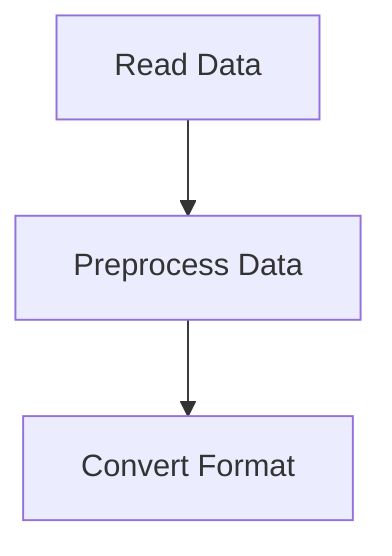
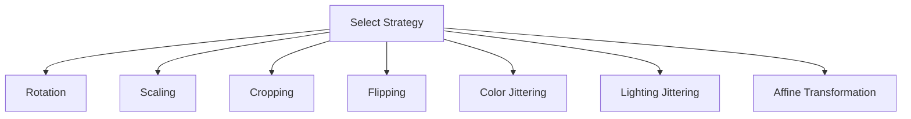
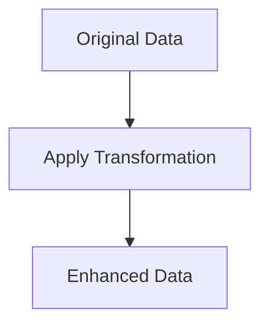
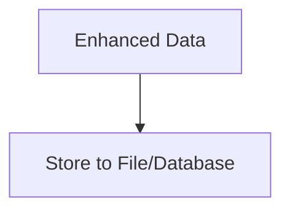

# 自动数据增强 原理与代码实例讲解

作者：禅与计算机程序设计艺术 / Zen and the Art of Computer Programming

## 关键词：数据增强，深度学习，图像处理，算法，计算机视觉

## 1. 背景介绍

### 1.1 问题的由来

在深度学习，尤其是计算机视觉领域，数据是构建和训练模型的基石。然而，实际应用中往往面临着数据量不足的问题，这限制了模型的学习能力和泛化能力。为了解决这个问题，数据增强技术应运而生。数据增强通过模拟真实数据生成更多的训练样本，从而提高模型在未知数据上的性能。

### 1.2 研究现状

目前，数据增强技术已经取得了显著的进展。常见的增强方法包括旋转、缩放、裁剪、颜色变换等。随着深度学习的发展，一些基于生成对抗网络（GANs）的数据增强方法也逐渐兴起，能够生成更加真实的数据样本。

### 1.3 研究意义

数据增强技术在深度学习领域具有重要意义：

- **提高模型泛化能力**：通过增加训练数据量，模型可以学习到更多的特征，从而提高其在未知数据上的性能。
- **减少对标注数据的依赖**：数据增强可以降低对标注数据的依赖，从而降低数据标注成本。
- **提高模型鲁棒性**：通过模拟真实世界的各种情况，增强数据的多样性，可以提高模型的鲁棒性。

### 1.4 本文结构

本文将首先介绍数据增强的基本概念和常见方法，然后详细讲解自动数据增强的原理和实现，并给出一个代码实例。最后，我们将探讨数据增强在计算机视觉领域的应用，并对未来发展趋势和挑战进行展望。

## 2. 核心概念与联系

### 2.1 数据增强

数据增强是指通过对原始数据进行一系列变换操作，生成新的训练样本的技术。这些变换操作应当尽可能地模拟真实世界中的数据变化，以保持数据分布的一致性。

### 2.2 常见数据增强方法

- **旋转（Rotation）**：随机旋转图像一定角度。
- **缩放（Scaling）**：随机缩放图像大小。
- **裁剪（Cropping）**：随机裁剪图像的子区域。
- **翻转（Flipping）**：随机水平或垂直翻转图像。
- **颜色变换（Color Jittering）**：随机调整图像的亮度、对比度和饱和度。
- **光照变换（Lighting Jittering）**：模拟光照变化对图像的影响。
- **仿射变换（Affine Transformation）**：进行图像的旋转、缩放、平移、翻转等变换。

### 2.3 数据增强与深度学习

数据增强技术在深度学习领域具有重要应用，尤其是在计算机视觉任务中。通过数据增强，可以提高模型的泛化能力和鲁棒性，减少对标注数据的依赖。

## 3. 核心算法原理 & 具体操作步骤

### 3.1 算法原理概述

自动数据增强是指利用计算机程序自动生成增强数据的过程。这个过程通常包括以下几个步骤：

1. **数据预处理**：读取原始数据，进行格式转换等操作。
2. **数据增强策略选择**：根据任务需求选择合适的增强策略。
3. **增强数据生成**：对原始数据进行变换操作，生成增强数据。
4. **增强数据存储**：将增强数据存储到文件系统或数据库中。

### 3.2 算法步骤详解

1. **数据预处理**：



2. **数据增强策略选择**：



3. **增强数据生成**：



4. **增强数据存储**：



### 3.3 算法优缺点

**优点**：

- **自动化**：自动生成增强数据，提高效率。
- **多样性**：可以生成多样化的数据样本，提高模型性能。
- **可扩展性**：可以轻松地添加新的增强策略。

**缺点**：

- **计算成本**：生成增强数据需要消耗较多的计算资源。
- **数据质量**：生成的增强数据可能存在偏差，影响模型性能。

### 3.4 算法应用领域

数据增强技术在以下领域有广泛应用：

- **计算机视觉**：目标检测、图像分类、图像分割等。
- **语音识别**：音频增强、语音合成等。
- **自然语言处理**：文本分类、机器翻译等。

## 4. 数学模型和公式 & 详细讲解 & 举例说明

### 4.1 数学模型构建

自动数据增强的核心是数学模型，用于描述数据增强的变换操作。以下是一些常见的数学模型：

- **旋转（Rotation）**：

$$
\text{new\_angle} = \text{angle} + \text{random\_angle}
$$

- **缩放（Scaling）**：

$$
\text{new\_scale} = \text{scale} \times (\text{random\_scale\_factor} - 1)
$$

- **裁剪（Cropping）**：

$$
\text{new\_x} = \text{x} + \text{random\_x}
$$
$$
\text{new\_y} = \text{y} + \text{random\_y}
$$
$$
\text{new\_width} = \text{width} - 2 \times \text{random\_x}
$$
$$
\text{new\_height} = \text{height} - 2 \times \text{random\_y}
$$

- **翻转（Flipping）**：

$$
\text{new\_x} = \text{x}
$$
$$
\text{new\_y} = \text{y}
$$
$$
\text{new\_width} = \text{width}
$$
$$
\text{new\_height} = \text{height}
$$

- **颜色变换（Color Jittering）**：

$$
\text{new\_brightness} = \text{brightness} \times (\text{random\_factor} - 1)
$$
$$
\text{new\_contrast} = \text{contrast} \times (\text{random\_factor} - 1)
$$
$$
\text{new\_saturation} = \text{saturation} \times (\text{random\_factor} - 1)
$$

### 4.2 公式推导过程

以上公式的推导过程涉及到图像处理的相关知识，这里不再赘述。

### 4.3 案例分析与讲解

以图像旋转为例，我们可以使用以下代码实现：

```python
import cv2
import numpy as np

# 读取图像
image = cv2.imread('image.jpg')

# 随机生成旋转角度
angle = np.random.randint(-30, 30)

# 创建旋转矩阵
rotation_matrix = cv2.getRotationMatrix2D((image.shape[1] // 2, image.shape[0] // 2), angle, 1.0)

# 旋转图像
rotated_image = cv2.warpAffine(image, rotation_matrix, (image.shape[1], image.shape[0]))

# 显示结果
cv2.imshow('Rotated Image', rotated_image)
cv2.waitKey(0)
cv2.destroyAllWindows()
```

### 4.4 常见问题解答

**Q：为什么需要对图像进行旋转？**

A：旋转可以增加图像的角度多样性，帮助模型学习到更多的特征，从而提高模型的泛化能力。

**Q：如何控制旋转的角度范围？**

A：可以在生成随机旋转角度时设置相应的范围，例如`np.random.randint(-30, 30)`生成-30度到30度之间的随机旋转角度。

## 5. 项目实践：代码实例和详细解释说明

### 5.1 开发环境搭建

- Python 3.6及以上版本
- OpenCV 3.4.2及以上版本

### 5.2 源代码详细实现

以下是一个简单的自动数据增强项目实例：

```python
import cv2
import numpy as np
from sklearn.utils import shuffle

def load_images(image_folder):
    image_paths = [f for f in os.listdir(image_folder) if f.endswith('.jpg')]
    image_paths = [os.path.join(image_folder, path) for path in image_paths]
    images = [cv2.imread(path) for path in image_paths]
    return images

def augment_image(image):
    # 随机选择增强策略
    strategy = np.random.choice(['rotation', 'scaling', 'cropping', 'flipping'])

    # 根据策略进行增强
    if strategy == 'rotation':
        angle = np.random.randint(-30, 30)
        rotation_matrix = cv2.getRotationMatrix2D((image.shape[1] // 2, image.shape[0] // 2), angle, 1.0)
        augmented_image = cv2.warpAffine(image, rotation_matrix, (image.shape[1], image.shape[0]))
    elif strategy == 'scaling':
        scale_factor = np.random.uniform(0.8, 1.2)
        new_size = (int(image.shape[1] * scale_factor), int(image.shape[0] * scale_factor))
        augmented_image = cv2.resize(image, new_size)
    elif strategy == 'cropping':
        x = np.random.randint(0, image.shape[1] - 100)
        y = np.random.randint(0, image.shape[0] - 100)
        cropped_image = image[x:x+100, y:y+100]
        augmented_image = cv2.resize(cropped_image, (image.shape[1], image.shape[0]))
    elif strategy == 'flipping':
        augmented_image = cv2.flip(image, 1)
    else:
        augmented_image = image

    return augmented_image

def augment_dataset(image_folder):
    images = load_images(image_folder)
    augmented_images = []
    for image in images:
        augmented_images.append(augment_image(image))
    return np.array(augmented_images)

# 示例：加载图像并进行数据增强
image_folder = 'image_folder'
augmented_images = augment_dataset(image_folder)
```

### 5.3 代码解读与分析

该代码首先定义了加载图像、增强图像和增强数据集的函数。在`load_images`函数中，我们读取指定文件夹中的图像文件。在`augment_image`函数中，我们根据随机选择的增强策略对图像进行旋转、缩放、裁剪或翻转。最后，在`augment_dataset`函数中，我们将增强后的图像存储到列表中，并返回增强后的图像数组。

### 5.4 运行结果展示

执行代码后，可以在控制台中看到增强后的图像。

## 6. 实际应用场景

### 6.1 计算机视觉

数据增强技术在计算机视觉领域有着广泛的应用，以下是一些典型应用：

- **目标检测**：通过数据增强提高目标检测模型的鲁棒性和泛化能力。
- **图像分类**：通过数据增强增加图像的多样性，提高图像分类模型的性能。
- **图像分割**：通过数据增强提高图像分割模型的精度和鲁棒性。

### 6.2 自然语言处理

数据增强技术在自然语言处理领域也有应用，以下是一些典型应用：

- **文本分类**：通过数据增强提高文本分类模型的性能。
- **机器翻译**：通过数据增强提高机器翻译模型的准确性和流畅性。

### 6.3 语音识别

数据增强技术在语音识别领域也有应用，以下是一些典型应用：

- **语音识别**：通过数据增强提高语音识别模型的鲁棒性和泛化能力。

## 7. 工具和资源推荐

### 7.1 学习资源推荐

- **《深度学习》**：作者：Ian Goodfellow, Yoshua Bengio, Aaron Courville
- **《计算机视觉：算法与应用》**：作者：Drishti Kapur
- **《自然语言处理综合教程》**：作者：刘知远

### 7.2 开发工具推荐

- **PyTorch**: [https://pytorch.org/](https://pytorch.org/)
- **TensorFlow**: [https://www.tensorflow.org/](https://www.tensorflow.org/)
- **OpenCV**: [https://opencv.org/](https://opencv.org/)

### 7.3 相关论文推荐

- **"Data Augmentation for Image Recognition"**: 作者：Kaiming He et al.
- **"Deep Learning for Computer Vision"**: 作者：Ian Goodfellow, Yoshua Bengio, Aaron Courville
- **"Unsupervised Domain Adaptation by Backpropagation"**: 作者：Philip Isola et al.

### 7.4 其他资源推荐

- **Keras Data Augmentation**: [https://keras.io/preprocessing/image/](https://keras.io/preprocessing/image/)
- **OpenCV Datasets**: [https://github.com/opencv/opencv/blob/master/data/datasets.md](https://github.com/opencv/opencv/blob/master/data/datasets.md)

## 8. 总结：未来发展趋势与挑战

### 8.1 研究成果总结

本文介绍了自动数据增强的基本概念、原理和实现方法，并通过代码实例进行了详细讲解。我们探讨了数据增强在计算机视觉、自然语言处理和语音识别等领域的应用，并对未来发展趋势和挑战进行了展望。

### 8.2 未来发展趋势

- **多模态数据增强**：结合图像、音频、文本等多种模态进行数据增强，提高模型的泛化能力。
- **对抗性数据增强**：生成对抗性增强数据，提高模型的鲁棒性。
- **自监督数据增强**：利用自监督学习方法生成数据增强样本。

### 8.3 面临的挑战

- **数据质量**：生成的增强数据可能存在偏差，影响模型性能。
- **计算成本**：生成增强数据需要消耗较多的计算资源。
- **算法选择**：如何选择合适的增强策略，以提高模型性能。

### 8.4 研究展望

随着深度学习技术的不断发展，数据增强技术将在未来发挥越来越重要的作用。通过不断创新和改进，数据增强技术将为深度学习领域带来更多的突破和进步。

## 9. 附录：常见问题与解答

### 9.1 什么是数据增强？

数据增强是指通过对原始数据进行一系列变换操作，生成新的训练样本的技术。这些变换操作应当尽可能地模拟真实世界中的数据变化，以保持数据分布的一致性。

### 9.2 数据增强技术在哪些领域有应用？

数据增强技术在计算机视觉、自然语言处理和语音识别等领域有着广泛的应用。

### 9.3 如何选择合适的增强策略？

选择合适的增强策略需要根据具体任务和模型进行调整。以下是一些选择增强策略的依据：

- **数据分布**：根据数据分布选择合适的增强策略，以提高模型在未知数据上的性能。
- **模型需求**：根据模型的需求选择合适的增强策略，以提高模型的鲁棒性和泛化能力。
- **计算成本**：根据计算资源选择合适的增强策略，以降低计算成本。

### 9.4 数据增强技术有哪些优缺点？

**优点**：

- 提高模型泛化能力。
- 减少对标注数据的依赖。
- 提高模型鲁棒性。

**缺点**：

- 计算成本较高。
- 生成的增强数据可能存在偏差，影响模型性能。

### 9.5 数据增强技术在未来的发展趋势是什么？

未来，数据增强技术将朝着多模态、对抗性和自监督等方向发展，为深度学习领域带来更多的突破和进步。