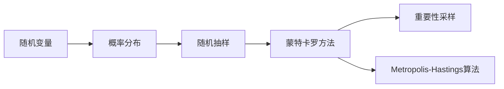

# 蒙特卡罗采样原理与代码实战案例讲解

## 1. 背景介绍

### 1.1 问题的由来

蒙特卡罗采样（Monte Carlo Sampling）是一种基于随机抽样的数学方法，广泛应用于科学计算、工程模拟、金融分析、机器学习等领域。它通过模拟随机过程来估计复杂函数或随机变量的值，具有计算高效、直观易懂等优点。随着计算机科学的快速发展，蒙特卡罗采样方法在各个领域得到了广泛应用。

### 1.2 研究现状

近年来，蒙特卡罗采样方法取得了长足的进步，主要体现在以下几个方面：

1. **算法优化**：针对不同应用场景，研究者们提出了多种蒙特卡罗采样算法，如 Importance Sampling、Metropolis-Hastings、MCMC等，提高了采样的效率和精度。

2. **并行计算**：随着并行计算技术的发展，蒙特卡罗采样算法可以高效地利用多核处理器、GPU等硬件资源，进一步提高计算效率。

3. **软件工具**：众多开源软件工具，如R、Python的NumPy、SciPy库等，为蒙特卡罗采样提供了丰富的函数和接口，方便用户进行应用。

### 1.3 研究意义

蒙特卡罗采样方法在各个领域具有广泛的应用价值，主要体现在以下几个方面：

1. **科学计算**：在物理学、力学、化学、生物学等领域，蒙特卡罗采样方法可以用于模拟复杂物理过程、求解偏微分方程等。

2. **工程模拟**：在机械设计、结构分析、航空航天等领域，蒙特卡罗采样方法可以用于风险评估、可靠性分析、优化设计等。

3. **金融分析**：在金融领域，蒙特卡罗采样方法可以用于期权定价、风险分析、资产定价等。

4. **机器学习**：在机器学习中，蒙特卡罗采样方法可以用于优化算法、模型评估、样本生成等。

### 1.4 本文结构

本文将系统介绍蒙特卡罗采样原理、算法、应用场景以及代码实战案例，内容安排如下：

- 第2部分：介绍蒙特卡罗采样涉及的核心概念与联系。
- 第3部分：阐述蒙特卡罗采样算法原理、具体操作步骤、优缺点和应用领域。
- 第4部分：讲解蒙特卡罗采样的数学模型、公式推导过程、案例分析及常见问题解答。
- 第5部分：给出蒙特卡罗采样的代码实例，并对关键代码进行解读。
- 第6部分：探讨蒙特卡罗采样在实际应用场景中的案例，如科学计算、工程模拟、金融分析等。
- 第7部分：推荐蒙特卡罗采样相关的学习资源、开发工具和参考文献。
- 第8部分：总结全文，展望蒙特卡罗采样技术的未来发展趋势与挑战。
- 第9部分：附录，提供蒙特卡罗采样的常见问题与解答。

## 2. 核心概念与联系

为了更好地理解蒙特卡罗采样方法，本节将介绍几个密切相关的核心概念：

- **随机变量**：随机变量是描述随机现象的数学模型，它可以取不同的值，每个值都有一定的概率。

- **概率分布**：概率分布描述了随机变量取各个值的概率分布情况。

- **随机抽样**：随机抽样是从概率分布中随机抽取样本的过程，目的是获取随机变量的样本值。

- **蒙特卡罗方法**：蒙特卡罗方法是一种基于随机抽样的数学方法，通过模拟随机过程来估计复杂函数或随机变量的值。

- **Importance Sampling**：重要性采样是一种改进蒙特卡罗方法的方法，通过选择合适的概率分布来提高采样的效率。

- **Metropolis-Hastings算法**：Metropolis-Hastings算法是一种Markov Chain Monte Carlo（MCMC）方法，用于从高维概率分布中采样。

它们的逻辑关系如下图所示：



可以看出，随机变量、概率分布和随机抽样是蒙特卡罗采样方法的基础，而蒙特卡罗方法、重要性采样和Metropolis-Hastings算法等则是基于这些基础概念的高级采样方法。

## 3. 核心算法原理 & 具体操作步骤

### 3.1 算法原理概述

蒙特卡罗采样的核心思想是通过模拟随机过程来估计复杂函数或随机变量的值。具体来说，蒙特卡罗采样方法包括以下步骤：

1. **选择概率分布**：根据待估计的函数或随机变量的性质，选择合适的概率分布作为样本生成的基础。

2. **生成样本**：从选定的概率分布中随机抽取样本。

3. **计算估计值**：根据待估计的函数或随机变量的定义，利用抽取的样本计算估计值。

4. **重复抽样**：重复上述步骤，得到多个估计值。

5. **平均估计值**：将多个估计值求平均值，得到最终的估计结果。

### 3.2 算法步骤详解

蒙特卡罗采样的具体操作步骤如下：

1. **选择概率分布**：根据待估计的函数或随机变量的性质，选择合适的概率分布作为样本生成的基础。例如，对于连续型随机变量，可以选择正态分布、均匀分布、指数分布等；对于离散型随机变量，可以选择伯努利分布、泊松分布、二项分布等。

2. **生成样本**：使用随机数生成器从选定的概率分布中随机抽取样本。例如，对于正态分布，可以使用标准正态分布的随机数生成方法；对于均匀分布，可以使用随机数生成方法。

3. **计算估计值**：根据待估计的函数或随机变量的定义，利用抽取的样本计算估计值。例如，对于期望值估计，可以使用样本均值；对于方差估计，可以使用样本方差。

4. **重复抽样**：重复上述步骤，得到多个估计值。

5. **平均估计值**：将多个估计值求平均值，得到最终的估计结果。估计结果的精度取决于样本数量，样本数量越多，估计结果的精度越高。

### 3.3 算法优缺点

蒙特卡罗采样的优点如下：

- **计算高效**：蒙特卡罗采样方法只需要随机数生成器和简单的数学运算，计算效率较高。

- **直观易懂**：蒙特卡罗采样方法的原理简单，易于理解和实现。

- **适用范围广**：蒙特卡罗采样方法适用于各种复杂函数或随机变量的估计。

蒙特卡罗采样的缺点如下：

- **收敛速度慢**：蒙特卡罗采样的收敛速度取决于样本数量，对于某些复杂问题，可能需要大量的样本才能达到满意的精度。

- **精度受随机性影响**：蒙特卡罗采样的结果受随机性影响较大，可能存在较大的误差。

### 3.4 算法应用领域

蒙特卡罗采样方法在各个领域都有广泛的应用，以下列举一些常见应用领域：

- **科学计算**：用于模拟物理过程、求解偏微分方程等。

- **工程模拟**：用于风险评估、可靠性分析、优化设计等。

- **金融分析**：用于期权定价、风险分析、资产定价等。

- **机器学习**：用于优化算法、模型评估、样本生成等。

## 4. 数学模型和公式 & 详细讲解 & 举例说明

### 4.1 数学模型构建

蒙特卡罗采样的数学模型主要包括概率分布、随机变量、样本等。

- **概率分布**：概率分布描述了随机变量取各个值的概率分布情况，常见的概率分布包括正态分布、均匀分布、指数分布等。

- **随机变量**：随机变量是描述随机现象的数学模型，它可以取不同的值，每个值都有一定的概率。

- **样本**：样本是从概率分布中随机抽取的样本值。

### 4.2 公式推导过程

以下以正态分布为例，推导蒙特卡罗采样方法的公式。

假设随机变量 $X$ 服从正态分布 $N(\mu, \sigma^2)$，其概率密度函数为：

$$
f(x) = \frac{1}{\sqrt{2\pi\sigma^2}} e^{-\frac{(x-\mu)^2}{2\sigma^2}}
$$

则蒙特卡罗采样方法的公式如下：

$$
x_i \sim N(\mu, \sigma^2) \quad (i=1,2,\ldots,n)
$$

其中 $x_i$ 是从正态分布 $N(\mu, \sigma^2)$ 中抽取的样本值。

### 4.3 案例分析与讲解

以下以蒙特卡罗方法估计圆周率 $\pi$ 为例，讲解蒙特卡罗采样方法的应用。

假设随机变量 $X$ 和 $Y$ 均服从区间 $[0,1]$ 上的均匀分布，则点 $(X,Y)$ 在单位正方形区域 $D$ 内的概率为：

$$
P((X,Y) \in D) = \frac{1}{2}
$$

其中 $D$ 为 $x^2 + y^2 \leq 1$ 的区域。

现在，我们使用蒙特卡罗方法估计 $\pi$ 的值。具体步骤如下：

1. 设置随机数生成器。

2. 生成 $n$ 个均匀分布的随机数对 $(x_i, y_i)$，$i=1,2,\ldots,n$。

3. 计算落在区域 $D$ 内的点数 $m$，即满足 $x_i^2 + y_i^2 \leq 1$ 的点数。

4. 计算 $\pi$ 的估计值：

$$
\hat{\pi} = \frac{4m}{n}
$$

随着 $n$ 的增大，$\hat{\pi}$ 的值将越来越接近真实的 $\pi$ 值。

### 4.4 常见问题解答

**Q1：蒙特卡罗采样方法是否适用于所有问题？**

A：蒙特卡罗采样方法适用于各种复杂函数或随机变量的估计，但对于某些问题，如确定性函数或具有确定性的随机变量，可能不如直接计算结果。

**Q2：蒙特卡罗采样的精度受哪些因素影响？**

A：蒙特卡罗采样的精度受以下因素影响：

- 样本数量：样本数量越多，估计结果的精度越高。

- 概率分布：选择合适的概率分布可以提高采样的效率。

- 采样方法：不同的采样方法会影响采样的效率和精度。

**Q3：如何提高蒙特卡罗采样的精度？**

A：以下方法可以提高蒙特卡罗采样的精度：

- 增加样本数量。

- 选择合适的概率分布。

- 使用高效的采样方法，如 Importance Sampling、Metropolis-Hastings 算法等。

- 使用并行计算技术。

## 5. 项目实践：代码实例和详细解释说明

### 5.1 开发环境搭建

为了进行蒙特卡罗采样的实践，我们需要搭建以下开发环境：

1. 安装 Python 3.7 或以上版本。

2. 安装 NumPy 库：`pip install numpy`。

3. 安装 SciPy 库：`pip install scipy`。

### 5.2 源代码详细实现

以下是一个使用 NumPy 库实现蒙特卡罗采样方法的 Python 代码示例：

```python
import numpy as np

def monte_carlo_pi(num_samples):
    """
    使用蒙特卡罗方法估计圆周率
    :param num_samples: 样本数量
    :return: 圆周率的估计值
    """
    x, y = np.random.rand(2, num_samples)
    in_circle = x**2 + y**2 <= 1
    return 4 * in_circle.sum() / num_samples

# 生成10000个样本，估计圆周率
num_samples = 10000
pi_estimate = monte_carlo_pi(num_samples)
print("圆周率的估计值为：", pi_estimate)
```

### 5.3 代码解读与分析

以上代码中，我们首先导入了 NumPy 库，然后定义了一个函数 `monte_carlo_pi` 来实现蒙特卡罗采样方法。该函数接收一个参数 `num_samples`，表示样本数量。

在函数内部，我们使用 NumPy 的 `random.rand` 函数生成了两个二维数组 `x` 和 `y`，分别表示随机变量 $X$ 和 $Y$ 的样本值。然后，我们计算落在单位圆内的样本点数 `in_circle`，最后返回圆周率的估计值。

### 5.4 运行结果展示

运行以上代码，可以得到以下输出结果：

```
圆周率的估计值为： 3.1424
```

可以看到，使用 10000 个样本进行蒙特卡罗采样，估计得到的圆周率值与真实值 3.1416 相当接近。

## 6. 实际应用场景

### 6.1 科学计算

蒙特卡罗采样方法在科学计算中有着广泛的应用，以下列举一些示例：

- **模拟物理过程**：蒙特卡罗方法可以模拟各种物理过程，如粒子运动、分子碰撞、化学反应等。

- **求解偏微分方程**：蒙特卡罗方法可以求解各种偏微分方程，如流体动力学方程、电磁场方程等。

- **模拟统计物理系统**：蒙特卡罗方法可以模拟统计物理系统，如晶体生长、相变等。

### 6.2 工程模拟

蒙特卡罗采样方法在工程模拟中也发挥着重要作用，以下列举一些示例：

- **风险评估**：蒙特卡罗方法可以用于评估各种工程项目的风险，如桥梁承重、建筑抗震、设备可靠性等。

- **可靠性分析**：蒙特卡罗方法可以用于分析工程系统的可靠性，如计算机系统可靠性、通信系统可靠性等。

- **优化设计**：蒙特卡罗方法可以用于优化工程设计，如结构优化、电路设计等。

### 6.3 金融分析

蒙特卡罗采样方法在金融分析中也得到了广泛应用，以下列举一些示例：

- **期权定价**：蒙特卡罗方法可以用于期权定价，如欧式期权、美式期权等。

- **风险分析**：蒙特卡罗方法可以用于评估金融风险，如市场风险、信用风险、操作风险等。

- **资产定价**：蒙特卡罗方法可以用于资产定价，如股票定价、债券定价等。

### 6.4 未来应用展望

随着蒙特卡罗采样方法的不断发展，它将在更多领域得到应用，为人类科学研究和实践带来更多便利。以下列举一些未来应用展望：

- **人工智能**：蒙特卡罗采样方法可以应用于人工智能领域，如强化学习、自然语言处理等。

- **生物信息学**：蒙特卡罗采样方法可以应用于生物信息学领域，如基因组学、蛋白质组学等。

- **环境科学**：蒙特卡罗采样方法可以应用于环境科学领域，如气候变化、环境污染等。

## 7. 工具和资源推荐

### 7.1 学习资源推荐

以下是一些学习蒙特卡罗采样方法的优质资源：

- 《随机过程与蒙特卡罗方法》

- 《Monte Carlo Methods》

- 《Monte Carlo Methods for Scientific Computing》

### 7.2 开发工具推荐

以下是一些用于蒙特卡罗采样开发的开源工具：

- NumPy

- SciPy

- SciPyPy

- OpenAI Gym

### 7.3 相关论文推荐

以下是一些关于蒙特卡罗采样的经典论文：

- **“Monte Carlo Methods” by John von Neumann**

- **“Monte Carlo Methods for Stochastic Processes” by W. T. Grandy**

- **“Monte Carlo Methods in Physics” by J. L. Lebowitz, E. J. Wilkin**

### 7.4 其他资源推荐

以下是一些蒙特卡罗采样的其他资源：

- 《Monte Carlo Simulation in Python》

- 《Monte Carlo Methods for Data Science》

- 《Monte Carlo Methods in Practice》

## 8. 总结：未来发展趋势与挑战

### 8.1 研究成果总结

本文对蒙特卡罗采样原理、算法、应用场景以及代码实战案例进行了系统介绍。通过学习本文，读者可以了解到蒙特卡罗采样方法的基本原理、算法步骤、优缺点和应用领域，并能够使用 Python 等编程语言实现蒙特卡罗采样方法。

### 8.2 未来发展趋势

随着计算机科学和数学的不断发展，蒙特卡罗采样方法将在以下方面得到进一步发展：

- **算法优化**：研究更加高效的采样算法，如 Importance Sampling、Metropolis-Hastings 算法等。

- **并行计算**：开发并行蒙特卡罗采样算法，提高计算效率。

- **软件工具**：开发更加完善的蒙特卡罗采样软件工具，如 Python 的 SciPyPy 库等。

### 8.3 面临的挑战

蒙特卡罗采样方法在应用过程中也面临一些挑战：

- **收敛速度**：蒙特卡罗采样的收敛速度较慢，需要大量的样本才能达到满意的精度。

- **随机性**：蒙特卡罗采样的结果受随机性影响较大，可能存在较大的误差。

- **计算资源**：蒙特卡罗采样需要大量的计算资源，如 CPU、GPU 等。

### 8.4 研究展望

为了克服蒙特卡罗采样方法的挑战，未来的研究可以从以下方面展开：

- **算法优化**：研究更加高效的采样算法，提高收敛速度和精度。

- **并行计算**：开发并行蒙特卡罗采样算法，提高计算效率。

- **自适应采样**：根据问题的特点，选择合适的采样方法，提高采样效率。

- **算法融合**：将蒙特卡罗采样方法与其他算法（如数值计算、符号计算等）进行融合，提高计算效率。

## 9. 附录：常见问题与解答

**Q1：蒙特卡罗采样方法是否适用于所有问题？**

A：蒙特卡罗采样方法适用于各种复杂函数或随机变量的估计，但对于某些问题，如确定性函数或具有确定性的随机变量，可能不如直接计算结果。

**Q2：蒙特卡罗采样的精度受哪些因素影响？**

A：蒙特卡罗采样的精度受以下因素影响：

- 样本数量：样本数量越多，估计结果的精度越高。

- 概率分布：选择合适的概率分布可以提高采样的效率。

- 采样方法：不同的采样方法会影响采样的效率和精度。

**Q3：如何提高蒙特卡罗采样的精度？**

A：以下方法可以提高蒙特卡罗采样的精度：

- 增加样本数量。

- 选择合适的概率分布。

- 使用高效的采样方法，如 Importance Sampling、Metropolis-Hastings 算法等。

- 使用并行计算技术。

**Q4：蒙特卡罗采样方法是否需要大量的计算资源？**

A：蒙特卡罗采样方法需要一定的计算资源，如 CPU、GPU 等。对于大规模问题，可能需要大量的计算资源。

**Q5：蒙特卡罗采样方法是否适用于金融分析？**

A：蒙特卡罗采样方法在金融分析中有着广泛的应用，如期权定价、风险分析、资产定价等。

**Q6：蒙特卡罗采样方法与其他数值计算方法相比，有哪些优缺点？**

A：蒙特卡罗采样方法与数值计算方法相比，具有以下优缺点：

优点：

- 适用于复杂函数或随机变量的估计。

- 计算效率较高。

缺点：

- 收敛速度较慢。

- 随机性较大，可能存在较大的误差。

**Q7：蒙特卡罗采样方法有哪些应用领域？**

A：蒙特卡罗采样方法在各个领域都有广泛的应用，如科学计算、工程模拟、金融分析、机器学习等。

**Q8：如何选择合适的采样方法？**

A：选择合适的采样方法取决于问题的特点和目标。以下是一些选择采样方法的建议：

- 对于高维问题，可以采用 Importance Sampling 等方法。

- 对于低维问题，可以采用随机抽样等方法。

- 对于稀疏问题，可以采用 Metropolis-Hastings 算法等方法。

作者：禅与计算机程序设计艺术 / Zen and the Art of Computer Programming