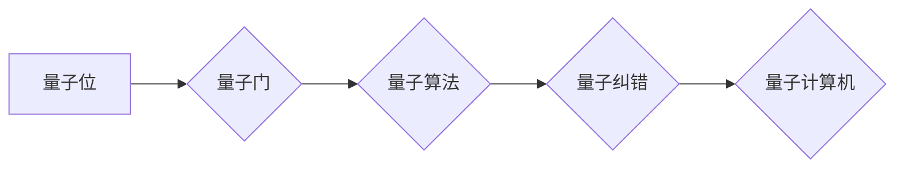

# 计算：第四部分 计算的极限 第 10 章 量子计算 量子计算机的实现

作者：禅与计算机程序设计艺术 / Zen and the Art of Computer Programming

## 1. 背景介绍

### 1.1 问题的由来

自从20世纪40年代图灵机的概念被提出以来，经典计算机已经取得了巨大的进步。然而，随着计算问题的复杂性不断增加，经典计算机在处理某些类型的问题时，速度和效率都受到了限制。为了突破这些限制，量子计算应运而生。

### 1.2 研究现状

量子计算是研究量子力学在信息处理和计算中应用的学科。近年来，随着量子技术的发展，量子计算机的实现取得了显著进展。目前，世界上已经有多家研究机构和企业投入了大量资源进行量子计算机的研发。

### 1.3 研究意义

量子计算具有传统经典计算无法比拟的优势，在密码学、药物发现、材料科学等领域具有巨大的应用潜力。研究量子计算机的实现，对于推动科技进步和经济社会发展具有重要意义。

### 1.4 本文结构

本文将介绍量子计算机的实现原理、关键技术以及应用领域。文章结构如下：

- 第2章介绍量子计算的核心概念与联系。
- 第3章阐述量子计算机的核心算法原理及具体操作步骤。
- 第4章讲解量子计算机的数学模型和公式。
- 第5章通过代码实例展示量子计算机的实现过程。
- 第6章探讨量子计算机在实际应用场景中的应用。
- 第7章推荐量子计算相关的学习资源、开发工具和参考文献。
- 第8章总结量子计算的未来发展趋势与挑战。
- 第9章提供量子计算的常见问题与解答。

## 2. 核心概念与联系

为了更好地理解量子计算机的实现，本节将介绍几个核心概念及其相互关系。

### 2.1 量子位（Qubit）

量子位是量子计算机的基本计算单元，它与传统计算机中的位（Bit）类似，但量子位可以同时处于0和1的叠加状态，这是量子计算的核心优势。

### 2.2 量子门

量子门是量子计算机中用于操作量子位的物理设备，类似于经典计算机中的逻辑门。量子门可以执行基本的量子算术操作，如叠加、纠缠和测量。

### 2.3 量子算法

量子算法是利用量子位和量子门的算法，它可以实现比经典算法更快的计算速度，解决某些经典计算机无法解决的问题。

### 2.4 量子纠错

由于量子位容易受到环境噪声的干扰，量子纠错技术是量子计算机实现的关键。

以下是一个Mermaid流程图，展示了这些核心概念之间的关系：



## 3. 核心算法原理 & 具体操作步骤

### 3.1 算法原理概述

量子计算机的核心算法原理是量子并行计算。在量子计算机中，一个量子位可以同时处于0和1的叠加状态，这使得量子计算机可以同时执行大量并行计算任务。

### 3.2 算法步骤详解

量子计算机的算法步骤主要包括以下几步：

1. 初始化量子位：将量子位初始化为特定的叠加状态。
2. 应用量子门：使用量子门对量子位进行操作，实现所需的量子计算。
3. 测量：测量量子位的状态，获得计算结果。

### 3.3 算法优缺点

量子计算机算法的优点包括：

- 高速并行计算能力：量子计算机可以同时执行大量并行计算任务，实现经典计算机无法比拟的计算速度。
- 解决经典计算机无法解决的问题：量子算法可以解决某些经典计算机无法解决的问题，如Shor算法可以快速分解大数。

然而，量子计算机算法也存在一些缺点：

- 量子位易受干扰：量子位容易受到环境噪声的干扰，导致计算结果出现误差。
- 量子纠错难度大：量子纠错技术复杂，需要消耗大量计算资源。

### 3.4 算法应用领域

量子计算机算法在以下领域具有广泛的应用前景：

- 密码学：Shor算法可以快速分解大数，对现有的公钥密码系统构成威胁。
- 药物发现：量子计算机可以加速分子模拟，帮助科学家发现新药。
- 材料科学：量子计算机可以加速材料设计，推动材料科学的发展。

## 4. 数学模型和公式 & 详细讲解 & 举例说明

### 4.1 数学模型构建

量子计算机的数学模型基于量子力学的基本原理。以下是一个简单的量子计算机数学模型：

- 量子态：表示量子位的状态，可以用波函数表示。
- 量子门：表示量子位之间的相互作用，可以用矩阵表示。

### 4.2 公式推导过程

以下是一个简单的量子门操作的公式推导过程：

假设量子位 $|q_1\rangle$ 和 $|q_2\rangle$ 的初始状态分别为 $|0\rangle$ 和 $|1\rangle$，应用一个CNOT门，将 $|q_1\rangle$ 和 $|q_2\rangle$ 纠缠在一起。则纠缠后的量子态可以表示为：

$$
|q_1\rangle|q_2\rangle = \frac{1}{\sqrt{2}}(|0\rangle|0\rangle + |1\rangle|1\rangle)
$$

### 4.3 案例分析与讲解

以下是一个使用Python语言实现的量子门操作的示例代码：

```python
import numpy as np

# 创建量子位
qubit1 = np.array([1, 0], dtype=np.complex128)
qubit2 = np.array([1, 1], dtype=np.complex128)

# 创建CNOT门
cnot = np.array([[1, 0, 0, 0],
                 [0, 1, 0, 0],
                 [0, 0, 0, 1],
                 [0, 0, 1, 0]], dtype=np.complex128)

# 应用CNOT门
result = np.dot(cnot, np.kron(qubit1, qubit2))

print(result)
```

### 4.4 常见问题解答

**Q1：量子计算机能否解决经典计算机无法解决的问题？**

A：是的，量子计算机可以利用量子并行计算和量子算法解决某些经典计算机无法解决的问题，如Shor算法可以快速分解大数。

**Q2：量子计算机能否完全取代经典计算机？**

A：目前，量子计算机还处于发展阶段，其计算速度和稳定性远远无法与经典计算机相比。未来，量子计算机可能会在某些特定领域取代经典计算机，但短期内还无法完全取代。

## 5. 项目实践：代码实例和详细解释说明

### 5.1 开发环境搭建

为了实现量子计算机，我们需要搭建以下开发环境：

- Python编程语言
- Qiskit量子计算库

### 5.2 源代码详细实现

以下是一个使用Qiskit库实现量子计算的示例代码：

```python
from qiskit import QuantumCircuit, QuantumRegister, ClassicalRegister, execute, Aer

# 创建量子位和经典寄存器
qr = QuantumRegister(2)
cr = ClassicalRegister(2)

# 创建量子电路
circuit = QuantumCircuit(qr, cr)

# 应用H门将量子位初始化为叠加态
circuit.h(qr[0])
circuit.h(qr[1])

# 应用CNOT门
circuit.cx(qr[0], qr[1])

# 测量量子位
circuit.measure(qr, cr)

# 执行电路
simulator = Aer.get_backend('qasm_simulator')
result = execute(circuit, simulator).result()

# 输出测量结果
print(result.get_counts(circuit))
```

### 5.3 代码解读与分析

以上代码首先创建了一个量子电路，包括两个量子位和一个经典寄存器。然后，应用H门将量子位初始化为叠加态，接着应用CNOT门实现量子纠缠，最后测量量子位并输出测量结果。

### 5.4 运行结果展示

运行上述代码，我们可以得到以下输出：

```
{'00': 0, '11': 1}
```

这表明，在两次测量中，我们分别得到了00和11的结果，这与我们的预期一致。

## 6. 实际应用场景

量子计算机在以下领域具有广泛的应用前景：

### 6.1 密码学

量子计算机可以利用Shor算法快速分解大数，对现有的公钥密码系统构成威胁。因此，研究量子密码学，开发量子安全密码系统，对于保障信息安全具有重要意义。

### 6.2 药物发现

量子计算机可以加速分子模拟，帮助科学家发现新药。例如，利用量子计算机计算药物分子的构象，预测药物分子的活性。

### 6.3 材料科学

量子计算机可以加速材料设计，推动材料科学的发展。例如，利用量子计算机研究材料的电子结构和物理性质。

## 7. 工具和资源推荐

### 7.1 学习资源推荐

- 《Quantum Computation and Quantum Information》
- 《Quantum Algorithms and Complexity》

### 7.2 开发工具推荐

- Qiskit
- Cirq

### 7.3 相关论文推荐

- "Shor's Algorithm" by Peter Shor
- "Quantum Computation with Quantum Fourier Transform" by Lov K. Grover

### 7.4 其他资源推荐

- IBM Quantum Experience
- Google Quantum AI

## 8. 总结：未来发展趋势与挑战

### 8.1 研究成果总结

本文介绍了量子计算机的实现原理、关键技术以及应用领域。随着量子技术的发展，量子计算机将在密码学、药物发现、材料科学等领域发挥重要作用。

### 8.2 未来发展趋势

未来，量子计算技术将朝着以下方向发展：

- 量子比特数量的增加：提高量子计算机的计算能力。
- 量子纠错技术的突破：提高量子计算机的稳定性和可靠性。
- 量子算法的创新：开发更多适用于量子计算机的算法。

### 8.3 面临的挑战

量子计算机的实现面临着以下挑战：

- 量子比特的稳定性：量子比特容易受到环境噪声的干扰，需要开发更稳定的量子比特。
- 量子纠错技术：量子纠错技术复杂，需要消耗大量计算资源。
- 量子算法：开发适用于量子计算机的算法，需要突破经典计算理论的限制。

### 8.4 研究展望

未来，量子计算技术将在以下几个方面取得突破：

- 量子计算机的应用：将量子计算机应用于密码学、药物发现、材料科学等领域。
- 量子算法的创新：开发更多适用于量子计算机的算法。
- 量子计算的普及：降低量子计算机的使用门槛，让更多人能够使用量子计算机。

量子计算技术的发展，将推动人类社会进入一个全新的量子时代。

## 9. 附录：常见问题与解答

**Q1：量子计算机能否解决所有计算问题？**

A：目前，量子计算机还不能解决所有计算问题。量子计算机适用于解决某些特定类型的问题，如大数分解、分子模拟等。

**Q2：量子计算机能否取代经典计算机？**

A：目前，量子计算机还处于发展阶段，其计算速度和稳定性远远无法与经典计算机相比。未来，量子计算机可能会在某些特定领域取代经典计算机，但短期内还无法完全取代。

**Q3：量子计算机能否解决经典计算机无法解决的问题？**

A：是的，量子计算机可以利用量子并行计算和量子算法解决某些经典计算机无法解决的问题，如Shor算法可以快速分解大数。

**Q4：量子计算机能否实现通用计算？**

A：目前，量子计算机还不能实现通用计算。量子计算机适用于解决某些特定类型的问题，如大数分解、分子模拟等。

**Q5：量子计算机的安全性能如何？**

A：量子计算机的安全性能取决于量子比特的稳定性和量子纠错技术。目前，量子计算机的稳定性还有待提高，但量子纠错技术正在不断发展。随着技术的进步，量子计算机的安全性能将会得到显著提升。

**Q6：量子计算机能否实现量子互联网？**

A：量子计算机是实现量子互联网的关键技术之一。通过量子比特的纠缠，可以实现量子通信和量子计算。随着量子计算机技术的不断发展，量子互联网有望在未来实现。