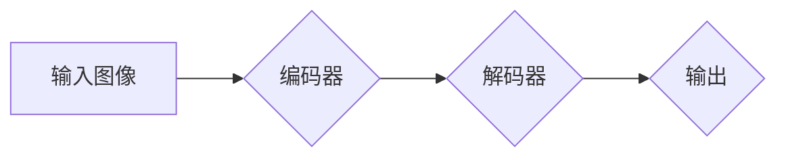
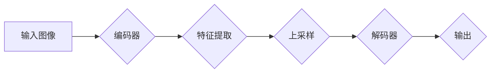

# 语义分割(Semantic Segmentation)原理与代码实战案例讲解

作者：禅与计算机程序设计艺术 / Zen and the Art of Computer Programming

## 1. 背景介绍

### 1.1 问题的由来

随着计算机视觉技术的发展，图像分析在各个领域得到了广泛应用。其中，语义分割是计算机视觉领域中的一项重要任务，旨在对图像中的每个像素进行分类，从而实现对图像内容的细致理解。从医学图像分析到自动驾驶，从卫星图像处理到工业检测，语义分割技术都发挥着至关重要的作用。

### 1.2 研究现状

近年来，随着深度学习技术的飞速发展，语义分割领域取得了显著的成果。从早期的基于传统机器学习方法到现在的深度学习模型，语义分割算法的性能不断提升。当前主流的语义分割算法主要包括：

- 基于传统机器学习方法：如支持向量机(SVM)、随机森林(Random Forest)等。
- 基于深度学习方法：如全卷积网络(Fully Convolutional Network, FCN)、U-Net、DeepLab等。

### 1.3 研究意义

语义分割技术在多个领域具有广泛的应用，如：

- **医学图像分析**：辅助医生进行病变区域的检测和诊断。
- **自动驾驶**：实现对道路、行人、车辆等目标的识别和定位。
- **卫星图像处理**：用于土地覆盖分类、灾害评估等。
- **工业检测**：用于缺陷检测、产品质量控制等。

### 1.4 本文结构

本文将首先介绍语义分割的基本概念和核心算法，然后通过一个实际案例讲解如何使用深度学习框架进行语义分割任务的实现，并分析其优缺点和适用场景。最后，本文将对语义分割技术的未来发展趋势和挑战进行展望。

## 2. 核心概念与联系

### 2.1 图像分割

图像分割是计算机视觉领域中的一项基础任务，它将图像划分为多个区域或对象。根据分割层次的不同，图像分割可以分为以下几个层次：

- **像素级分割**：对图像中的每个像素进行分类，如语义分割。
- **区域级分割**：将图像划分为若干个连通区域，如区域生长算法。
- **对象级分割**：识别图像中的各个对象，并给出它们的位置和尺寸。

### 2.2 语义分割

语义分割是像素级分割的一种，其目标是对图像中的每个像素进行分类，赋予每个像素一个语义标签，如“人”、“车”、“道路”等。语义分割是计算机视觉领域中的一项重要任务，它为图像理解和内容理解提供了基础。

### 2.3 关联概念

- **卷积神经网络(Convolutional Neural Network, CNN)**：一种深度学习模型，在图像分割任务中取得了显著的成果。
- **深度学习(Deep Learning)**：一种基于人工神经网络的学习方法，包括深度神经网络、卷积神经网络和循环神经网络等。
- **损失函数(Loss Function)**：用于评估模型预测结果与真实值之间的差距，是训练深度学习模型的重要指标。

## 3. 核心算法原理 & 具体操作步骤

### 3.1 算法原理概述

语义分割的核心算法主要基于深度学习，其中卷积神经网络(CNN)是常用的网络架构。下面介绍两种经典的语义分割算法：U-Net和DeepLab。

#### 3.1.1 U-Net

U-Net是一种用于医学图像分割的卷积神经网络。其核心思想是将编码器和解码器进行对称设计，通过跳跃连接实现特征图的跨层融合。U-Net的架构如图1所示。



图1 U-Net架构

#### 3.1.2 DeepLab

DeepLab是一种基于编码器-解码器结构的语义分割算法，它通过条件随机场(Conditional Random Field, CRF)来提升分割精度。DeepLab的架构如图2所示。



图2 DeepLab架构

### 3.2 算法步骤详解

以下是U-Net算法的具体操作步骤：

1. **数据预处理**：对输入图像进行归一化、缩放等预处理操作。
2. **编码器**：对输入图像进行下采样，提取图像特征。
3. **跳跃连接**：将编码器和解码器对应层的特征图进行拼接，实现特征图的跨层融合。
4. **解码器**：对特征图进行上采样，恢复图像分辨率。
5. **分类器**：对上采样后的特征图进行分类，得到每个像素的语义标签。
6. **损失函数**：使用交叉熵损失函数计算模型预测结果与真实标签之间的差距。
7. **模型训练**：通过反向传播算法优化模型参数。

### 3.3 算法优缺点

#### 3.3.1 优点

- **效果好**：U-Net和DeepLab算法在多个语义分割数据集上取得了较好的性能。
- **速度快**：深度学习模型具有较高的计算效率，能够快速处理图像数据。

#### 3.3.2 缺点

- **计算量大**：深度学习模型的训练过程需要大量的计算资源和时间。
- **模型复杂度高**：深度学习模型的复杂度高，难以解释和调试。

### 3.4 算法应用领域

U-Net和DeepLab算法在多个领域得到了广泛应用，如：

- **医学图像分割**：用于病变区域检测、器官分割等。
- **自动驾驶**：用于道路、行人、车辆等目标的识别和定位。
- **卫星图像处理**：用于土地覆盖分类、灾害评估等。
- **工业检测**：用于缺陷检测、产品质量控制等。

## 4. 数学模型和公式 & 详细讲解 & 举例说明

### 4.1 数学模型构建

以下是U-Net算法中的数学模型构建过程：

- **编码器**：采用卷积层和最大池化层进行下采样，提取图像特征。
- **跳跃连接**：将编码器和解码器对应层的特征图进行拼接，实现特征图的跨层融合。
- **解码器**：采用上采样层和卷积层进行上采样，恢复图像分辨率。
- **分类器**：采用全连接层对上采样后的特征图进行分类。

### 4.2 公式推导过程

以下是U-Net算法中的公式推导过程：

- **编码器**：

  - 卷积层公式：$f_{\text{conv}}(x, w) = \sigma(W^T x + b)$

  - 最大池化层公式：$f_{\text{max-pool}}(x) = \max_{i \in \Omega} x(i)$

- **跳跃连接**：

  - 特征图拼接公式：$C = [C_{\text{enc}}; C_{\text{dec}}]$

- **解码器**：

  - 上采样层公式：$U(x) = \text{upsample}(x)$

- **分类器**：

  - 全连接层公式：$f_{\text{fc}}(x) = W^T x + b$

### 4.3 案例分析与讲解

以下是一个U-Net算法的案例，使用PyTorch框架进行实现。

```python
import torch
import torch.nn as nn

class UNet(nn.Module):
    def __init__(self):
        super(UNet, self).__init__()
        # 编码器
        self.enc1 = nn.Sequential(
            nn.Conv2d(3, 64, kernel_size=3, padding=1),
            nn.ReLU(),
            nn.Conv2d(64, 64, kernel_size=3, padding=1),
            nn.ReLU(),
            nn.MaxPool2d(2)
        )
        # 解码器
        self.dec1 = nn.Sequential(
            nn.ConvTranspose2d(128, 64, kernel_size=2, stride=2),
            nn.ReLU(),
            nn.Conv2d(64, 64, kernel_size=3, padding=1),
            nn.ReLU(),
            nn.Conv2d(64, 1, kernel_size=3, padding=1)
        )

    def forward(self, x):
        # 编码器
        x1 = self.enc1(x)
        # 跳跃连接
        x2 = self.dec1(x1)
        return x2

# 初始化模型
model = UNet()
# 输入数据
input_tensor = torch.randn(1, 3, 256, 256)
# 前向传播
output = model(input_tensor)
print(output.shape)
```

在上面的代码中，我们定义了一个U-Net模型，并对其进行了前向传播。输出结果为每个像素的语义标签。

### 4.4 常见问题解答

1. **Q：如何选择合适的卷积核大小和步长？**

   A：卷积核大小和步长需要根据具体任务和数据集进行调整。一般来说，较大的卷积核可以提取更丰富的特征，但会增加计算量；较小的卷积核计算量小，但特征提取能力有限。

2. **Q：如何处理过拟合问题？**

   A：过拟合问题可以通过以下方法进行缓解：

   - 数据增强：通过旋转、缩放、裁剪等方式增加训练数据的多样性。
   - 正则化：如L1、L2正则化等。
   - 减少模型复杂度：减少网络层数或降低网络参数数量。

## 5. 项目实践：代码实例和详细解释说明

### 5.1 开发环境搭建

1. 安装PyTorch库：

   ```bash
   pip install torch torchvision
   ```

2. 安装OpenCV库：

   ```bash
   pip install opencv-python
   ```

### 5.2 源代码详细实现

以下是一个使用PyTorch实现的U-Net模型：

```python
import torch
import torch.nn as nn

class UNet(nn.Module):
    def __init__(self):
        super(UNet, self).__init__()
        # 编码器
        self.enc1 = nn.Sequential(
            nn.Conv2d(3, 64, kernel_size=3, padding=1),
            nn.ReLU(),
            nn.Conv2d(64, 64, kernel_size=3, padding=1),
            nn.ReLU(),
            nn.MaxPool2d(2)
        )
        # 解码器
        self.dec1 = nn.Sequential(
            nn.ConvTranspose2d(128, 64, kernel_size=2, stride=2),
            nn.ReLU(),
            nn.Conv2d(64, 64, kernel_size=3, padding=1),
            nn.ReLU(),
            nn.Conv2d(64, 1, kernel_size=3, padding=1)
        )

    def forward(self, x):
        # 编码器
        x1 = self.enc1(x)
        # 跳跃连接
        x2 = self.dec1(x1)
        return x2

# 初始化模型
model = UNet()

# 数据加载
train_loader = torch.utils.data.DataLoader(
    dataset=YourDataset(),
    batch_size=4,
    shuffle=True
)

# 损失函数和优化器
criterion = nn.CrossEntropyLoss()
optimizer = torch.optim.Adam(model.parameters(), lr=0.001)

# 训练过程
for epoch in range(10):
    for data in train_loader:
        inputs, labels = data
        outputs = model(inputs)
        loss = criterion(outputs, labels)
        optimizer.zero_grad()
        loss.backward()
        optimizer.step()

# 保存模型
torch.save(model.state_dict(), 'unet.pth')

# 加载模型
model.load_state_dict(torch.load('unet.pth'))
```

### 5.3 代码解读与分析

1. **UNet类**：定义了一个U-Net模型，包含编码器和解码器。
2. **初始化模型**：使用`nn.Sequential`将卷积层、激活层和池化层串联起来。
3. **前向传播**：对输入图像进行编码、跳跃连接和解码。
4. **数据加载**：使用`DataLoader`类加载数据集。
5. **损失函数和优化器**：使用交叉熵损失函数和Adam优化器。
6. **训练过程**：遍历数据集，计算损失函数，更新模型参数。
7. **保存模型**：将模型参数保存到本地文件。
8. **加载模型**：从本地文件加载模型参数。

### 5.4 运行结果展示

运行上述代码，训练U-Net模型。训练完成后，可以使用以下代码进行测试：

```python
import cv2
import torch

# 加载模型
model = UNet()
model.load_state_dict(torch.load('unet.pth'))

# 加载测试数据
test_img = cv2.imread('test_image.jpg')
test_img = cv2.cvtColor(test_img, cv2.COLOR_BGR2RGB)
test_img = cv2.resize(test_img, (256, 256))
test_img = torch.tensor(test_img).permute(2, 0, 1).unsqueeze(0)

# 前向传播
outputs = model(test_img)
outputs = torch.argmax(outputs, dim=1).squeeze(0).numpy()

# 可视化结果
result_img = cv2.resize(outputs.astype(np.uint8), (test_img.shape[1], test_img.shape[0]))
cv2.imshow('Semantic Segmentation', result_img)
cv2.waitKey(0)
cv2.destroyAllWindows()
```

运行上述代码，展示测试图像的语义分割结果。

## 6. 实际应用场景

语义分割技术在多个领域得到了广泛应用，以下是一些典型的应用场景：

### 6.1 医学图像分析

语义分割在医学图像分析中有着广泛的应用，如：

- **病变区域检测**：用于检测肿瘤、血管、器官等病变区域。
- **器官分割**：用于分割肺、心脏、肝脏等器官，为临床诊断提供依据。
- **病理图像分析**：用于分析病理切片，辅助医生进行疾病诊断。

### 6.2 自动驾驶

语义分割在自动驾驶领域发挥着重要作用，如：

- **道路分割**：用于识别道路、车道线、交通标志等，为自动驾驶车辆提供导航信息。
- **行人检测**：用于检测和跟踪行人，保障行车安全。
- **车辆检测**：用于检测和跟踪车辆，辅助驾驶决策。

### 6.3 卫星图像处理

语义分割在卫星图像处理中具有以下应用：

- **土地覆盖分类**：用于分析土地利用类型，如森林、农田、水域等。
- **灾害评估**：用于评估自然灾害（如洪水、地震、火灾等）的影响范围和程度。
- **环境监测**：用于监测环境变化，如大气污染、植被覆盖变化等。

### 6.4 工业检测

语义分割在工业检测领域具有以下应用：

- **缺陷检测**：用于检测产品表面的缺陷，如划痕、孔洞等。
- **产品质量控制**：用于评估产品质量，如尺寸、形状等。
- **设备故障检测**：用于检测设备故障，如磨损、泄漏等。

## 7. 工具和资源推荐

### 7.1 学习资源推荐

1. **《深度学习》**: 作者：Ian Goodfellow, Yoshua Bengio, Aaron Courville
2. **《计算机视觉：算法与应用》**: 作者：Richard Szeliski

### 7.2 开发工具推荐

1. **PyTorch**: [https://pytorch.org/](https://pytorch.org/)
2. **TensorFlow**: [https://www.tensorflow.org/](https://www.tensorflow.org/)
3. **OpenCV**: [https://opencv.org/](https://opencv.org/)

### 7.3 相关论文推荐

1. **U-Net: Convolutional Networks for Biomedical Image Segmentation**: https://arxiv.org/abs/1505.04597
2. **DeepLab: Semantic Image Segmentation with Deep Convolutional Nets, Atrous Convolution, and Fully Connected CRFs**: https://arxiv.org/abs/1605.07633

### 7.4 其他资源推荐

1. **GitHub**: [https://github.com/](https://github.com/)
2. **arXiv**: [https://arxiv.org/](https://arxiv.org/)

## 8. 总结：未来发展趋势与挑战

语义分割技术在图像分割领域取得了显著的成果，但仍面临一些挑战和未来的发展趋势：

### 8.1 研究成果总结

- **算法性能提升**：深度学习模型在语义分割任务中取得了显著的成果，但仍有提升空间。
- **模型轻量化**：针对移动设备和嵌入式设备，研究轻量化深度学习模型，降低计算量和功耗。
- **模型可解释性**：提高模型的可解释性，使模型的决策过程更加透明。

### 8.2 未来发展趋势

- **多模态学习**：结合文本、音频等多模态信息，实现更全面的图像理解。
- **自监督学习**：利用无标注数据，降低标注成本，提高模型性能。
- **跨领域语义分割**：研究适用于不同领域的语义分割模型，提高模型泛化能力。

### 8.3 面临的挑战

- **计算资源**：深度学习模型的训练和推理需要大量的计算资源，如何降低计算量是一个重要挑战。
- **数据标注**：高质量标注数据对于模型训练至关重要，但标注成本较高。
- **模型泛化能力**：提高模型在未知领域的泛化能力，使其能够适应各种复杂场景。

### 8.4 研究展望

语义分割技术在图像分割领域具有广泛的应用前景，随着深度学习技术的不断发展，相信未来会取得更多突破性成果。

## 9. 附录：常见问题与解答

### 9.1 什么是语义分割？

语义分割是图像分割的一种，旨在对图像中的每个像素进行分类，赋予每个像素一个语义标签，如“人”、“车”、“道路”等。

### 9.2 U-Net和DeepLab算法的区别是什么？

U-Net和DeepLab算法都是用于语义分割的深度学习模型。U-Net是一种基于编码器-解码器结构的网络，通过跳跃连接实现特征图的跨层融合；DeepLab算法通过条件随机场(Conditional Random Field, CRF)提升分割精度。

### 9.3 如何选择合适的模型？

选择合适的模型需要根据具体任务和数据集进行。一般来说，U-Net算法在医学图像分割中表现较好；DeepLab算法在通用图像分割任务中具有较好的性能。

### 9.4 如何处理过拟合问题？

过拟合问题可以通过以下方法进行缓解：

- 数据增强：通过旋转、缩放、裁剪等方式增加训练数据的多样性。
- 正则化：如L1、L2正则化等。
- 减少模型复杂度：减少网络层数或降低网络参数数量。

### 9.5 如何评估模型性能？

评估模型性能通常使用以下指标：

- **精确率(Precision)**：模型预测为正的样本中，实际为正的比例。
- **召回率(Recall)**：模型预测为正的样本中，实际为正的比例。
- **F1值(F1 Score)**：精确率和召回率的调和平均值。
- ** Intersection over Union (IoU)**：预测结果与真实标签之间的重叠程度。

希望本文能够帮助您更好地理解语义分割技术，并为您的实际应用提供参考。