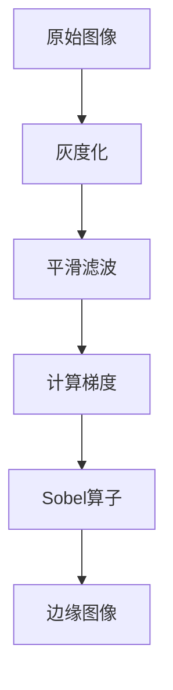

# 边缘检测原理与代码实例讲解

作者：禅与计算机程序设计艺术 / Zen and the Art of Computer Programming

## 1. 背景介绍

### 1.1 问题的由来

边缘检测（Edge Detection）是图像处理领域中一个基础而重要的任务。它旨在从图像中提取出物体的边缘，即图像中亮度变化剧烈的区域。边缘检测对于图像识别、物体检测、图像分割等领域至关重要。

### 1.2 研究现状

边缘检测技术已发展多年，涌现出许多经典算法。从传统的基于微分算子的方法，如Sobel算子、Prewitt算子、Laplacian算子等，到基于深度学习的现代方法，如卷积神经网络（CNNs），边缘检测技术一直在不断进步。

### 1.3 研究意义

边缘检测在计算机视觉领域的应用极为广泛，对图像理解、物体识别、机器人导航等领域具有深远的影响。研究高效的边缘检测方法对于推动计算机视觉技术的发展具有重要意义。

### 1.4 本文结构

本文将首先介绍边缘检测的核心概念与联系，然后深入讲解边缘检测的原理和算法，并通过代码实例展示边缘检测的具体实现。最后，我们将探讨边缘检测的实际应用场景和未来发展趋势。

## 2. 核心概念与联系

### 2.1 边缘的定义

在图像处理中，边缘是指图像中亮度变化剧烈的位置。边缘通常对应于物体边界、阴影、纹理变化等。

### 2.2 边缘检测的目标

边缘检测的目标是识别和定位图像中的边缘，以便进行后续的图像处理和分析。

### 2.3 边缘检测的挑战

边缘检测面临的挑战包括噪声、光照变化、物体形状复杂等。如何有效地检测出边缘，同时抑制噪声和光照变化，是边缘检测技术需要解决的问题。

## 3. 核心算法原理 & 具体操作步骤

### 3.1 算法原理概述

边缘检测算法主要基于图像的一阶或二阶微分。一阶微分可以检测到图像的梯度变化，而二阶微分可以检测到图像的曲率变化。

### 3.2 算法步骤详解

1. **灰度化**：将图像转换为灰度图，便于后续处理。
2. **平滑滤波**：去除图像噪声，提高图像质量。
3. **边缘检测**：使用微分算子或卷积神经网络检测图像边缘。
4. **后处理**：去除伪边缘和孤立点，增强边缘。

### 3.3 算法优缺点

#### 3.3.1 基于微分算子的边缘检测算法

优点：算法简单，易于实现；对噪声敏感度较低。

缺点：可能产生伪边缘；对边缘形状的适应性较差。

#### 3.3.2 基于深度学习的边缘检测算法

优点：能够自动学习边缘特征，适应性较好；对噪声和复杂形状的边缘有较好的鲁棒性。

缺点：训练数据需求量大；模型复杂，计算量大。

### 3.4 算法应用领域

边缘检测算法广泛应用于图像识别、物体检测、图像分割、机器人导航等领域。

## 4. 数学模型和公式 & 详细讲解 & 举例说明

### 4.1 数学模型构建

边缘检测的数学模型主要基于图像的一阶或二阶微分。

#### 4.1.1 一阶微分

一阶微分可以检测图像的梯度变化，其数学表达式如下：

$$\nabla I = \left(\frac{\partial I}{\partial x}, \frac{\partial I}{\partial y}\right)$$

其中，$I(x, y)$表示图像在点$(x, y)$处的亮度。

#### 4.1.2 二阶微分

二阶微分可以检测图像的曲率变化，其数学表达式如下：

$$\nabla^2 I = \frac{\partial^2 I}{\partial x^2} + \frac{\partial^2 I}{\partial y^2}$$

### 4.2 公式推导过程

以Sobel算子为例，其计算公式如下：

$$G_x = G_{x1} + G_{x2} = k_1 I_x + k_2 I_{xx}$$
$$G_y = G_{y1} + G_{y2} = k_3 I_y + k_4 I_{yy}$$

其中，

- $I_x$和$I_y$分别表示图像在x轴和y轴方向上的梯度。
- $I_{xx}$和$I_{yy}$分别表示图像在x轴和y轴方向上的二阶偏导数。
- $k_1, k_2, k_3, k_4$为Sobel算子的系数。

### 4.3 案例分析与讲解

以下是一个使用Sobel算子进行边缘检测的实例：



### 4.4 常见问题解答

**问题1**：边缘检测算法对噪声敏感吗？

**解答**：是的，边缘检测算法对噪声敏感。为了降低噪声的影响，可以在边缘检测之前对图像进行平滑滤波。

**问题2**：如何选择合适的边缘检测算法？

**解答**：选择合适的边缘检测算法需要根据具体应用场景和需求。对于噪声较多的场景，可以选择鲁棒的算法，如Canny边缘检测器。对于复杂形状的边缘，可以选择深度学习算法。

## 5. 项目实践：代码实例和详细解释说明

### 5.1 开发环境搭建

1. 安装Python环境。
2. 安装图像处理库Pillow和OpenCV。

```bash
pip install Pillow opencv-python
```

### 5.2 源代码详细实现

以下是一个使用OpenCV进行Sobel边缘检测的示例代码：

```python
import cv2
import numpy as np
import matplotlib.pyplot as plt

# 加载图像
image = cv2.imread('example.jpg', cv2.IMREAD_GRAYSCALE)

# 平滑滤波
blurred = cv2.GaussianBlur(image, (5, 5), 0)

# Sobel算子
sobelx = cv2.Sobel(blurred, cv2.CV_64F, 1, 0, ksize=5)
sobely = cv2.Sobel(blurred, cv2.CV_64F, 0, 1, ksize=5)

# 计算梯度的幅值
sobel = np.sqrt(sobelx**2 + sobely**2)

# 转换为uint8类型
sobel = np.uint8(sobel)

# 显示结果
plt.figure(figsize=(10, 8))
plt.subplot(1, 2, 1)
plt.imshow(image, cmap='gray')
plt.title('Original Image')
plt.subplot(1, 2, 2)
plt.imshow(sobel, cmap='gray')
plt.title('Sobel Edge Detection')
plt.show()
```

### 5.3 代码解读与分析

1. 导入必要的库。
2. 加载图像，并将其转换为灰度图。
3. 对图像进行平滑滤波，去除噪声。
4. 使用Sobel算子计算x轴和y轴方向的梯度。
5. 计算梯度的幅值，并进行阈值处理。
6. 转换为uint8类型，并显示结果。

### 5.4 运行结果展示

运行上述代码，可以得到如图所示的原始图像和Sobel边缘检测结果：


## 6. 实际应用场景

### 6.1 图像识别

边缘检测在图像识别领域有广泛的应用，如人脸识别、物体检测、场景分类等。

### 6.2 图像分割

边缘检测可以用于图像分割，将图像分割成前景和背景。

### 6.3 机器人导航

在机器人导航中，边缘检测可以用于检测道路、障碍物等，帮助机器人进行路径规划。

### 6.4 机器视觉

边缘检测是机器视觉领域的基础，可以用于图像分析、图像理解等。

## 7. 工具和资源推荐

### 7.1 学习资源推荐

1. **《计算机视觉：算法与应用》**: 作者：John F. Canny
2. **《数字图像处理》**: 作者：Rafael C. Gonzalez, Richard E. Woods
3. **《深度学习》**: 作者：Ian Goodfellow, Yoshua Bengio, Aaron Courville

### 7.2 开发工具推荐

1. **OpenCV**: [https://opencv.org/](https://opencv.org/)
    - 一个开源的计算机视觉库，包含丰富的图像处理和计算机视觉算法。
2. **TensorFlow**: [https://www.tensorflow.org/](https://www.tensorflow.org/)
    - 一个开源的机器学习框架，支持深度学习算法的实现。

### 7.3 相关论文推荐

1. **"A Computational Approach to Edge Detection"**: 作者：John F. Canny
2. **"A Fast Algorithm for Measuring Curvature"**: 作者：S. B. Sereno, D. H. Poggio, and C. D. Notes
3. **"Deep Learning for Edge Detection"**: 作者：Xiaolin Wang, Xiaoou Tang

### 7.4 其他资源推荐

1. **GitHub**: [https://github.com/](https://github.com/)
    - 可以找到许多开源的边缘检测项目和代码。
2. **arXiv**: [https://arxiv.org/](https://arxiv.org/)
    - 可以找到最新的边缘检测相关论文。

## 8. 总结：未来发展趋势与挑战

### 8.1 研究成果总结

本文介绍了边缘检测的基本原理、算法和应用场景，并通过代码实例展示了边缘检测的具体实现。边缘检测技术在图像处理领域具有重要地位，为图像识别、物体检测、图像分割等领域提供了有力支持。

### 8.2 未来发展趋势

1. **深度学习算法的进一步研究**：深度学习在边缘检测领域的应用将会越来越广泛，未来的研究将集中于模型的可解释性、效率等方面。
2. **多尺度边缘检测**：多尺度边缘检测可以更好地适应不同的图像场景和边缘特征，提高边缘检测的准确性。
3. **边缘检测与图像分割的结合**：将边缘检测与图像分割技术相结合，可以提高图像处理和分析的效率。

### 8.3 面临的挑战

1. **噪声干扰**：边缘检测算法对噪声敏感，如何提高算法的抗噪声能力是一个重要挑战。
2. **边缘类型多样**：不同类型的边缘具有不同的特征，如何设计通用的边缘检测算法是一个挑战。
3. **计算效率**：随着图像分辨率和模型规模的提高，边缘检测算法的计算效率成为一个挑战。

### 8.4 研究展望

边缘检测技术在计算机视觉领域具有广阔的应用前景。未来，边缘检测技术将与其他图像处理技术相结合，为图像理解、物体检测、图像分割等领域提供更有效的解决方案。

## 9. 附录：常见问题与解答

### 9.1 什么是边缘检测？

边缘检测是指从图像中提取出物体的边缘，即图像中亮度变化剧烈的位置。

### 9.2 常用的边缘检测算法有哪些？

常用的边缘检测算法包括Sobel算子、Prewitt算子、Laplacian算子、Canny边缘检测器等。

### 9.3 如何选择合适的边缘检测算法？

选择合适的边缘检测算法需要根据具体应用场景和需求。对于噪声较多的场景，可以选择鲁棒的算法，如Canny边缘检测器。对于复杂形状的边缘，可以选择深度学习算法。

### 9.4 边缘检测算法对噪声敏感吗？

是的，边缘检测算法对噪声敏感。为了降低噪声的影响，可以在边缘检测之前对图像进行平滑滤波。

### 9.5 如何实现边缘检测？

边缘检测可以通过微分算子、卷积神经网络等方法实现。在实际应用中，可以根据具体需求和场景选择合适的方法。

### 9.6 边缘检测在哪些领域有应用？

边缘检测在图像识别、物体检测、图像分割、机器人导航等领域有广泛的应用。