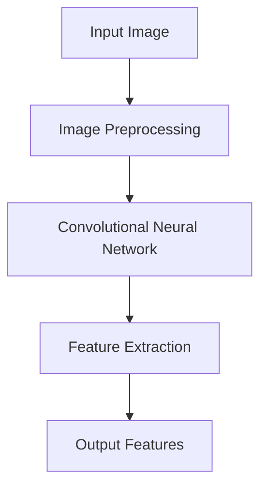
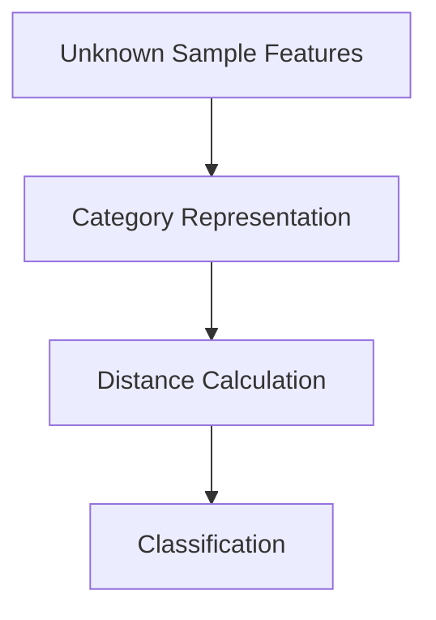

# 零样本学习 (Zero-Shot Learning)

作者：禅与计算机程序设计艺术 / Zen and the Art of Computer Programming

## 关键词：

零样本学习，机器学习，分类，分类器，元学习，迁移学习，知识表示

## 1. 背景介绍

### 1.1 问题的由来

在传统的机器学习任务中，模型通常需要大量的标注样本来学习特征和模式，以实现准确的分类或预测。然而，在实际应用中，我们经常遇到以下情况：

- **样本稀缺**：某些领域或场景下，获取大量标注样本非常困难或成本高昂。
- **新类别**：随着时间推移，新的类别可能会出现，模型需要快速适应并识别这些新类别。
- **迁移学习**：在不同领域或数据集之间迁移知识，需要模型能够泛化到未见过的类别。

为了解决这些问题，零样本学习（Zero-Shot Learning，ZSL）应运而生。ZSL旨在使模型能够对未见过的类别进行分类，即使没有或只有少量相关的训练样本。

### 1.2 研究现状

ZSL领域的研究已经取得了显著进展，主要研究方向包括：

- **基于原型的方法**：将未知类别视为原型，计算未知样本与原型之间的距离，基于距离进行分类。
- **基于元学习的方法**：通过元学习来学习一个泛化能力强的分类器，从而在新类别上表现出良好的性能。
- **基于知识表示的方法**：利用外部知识库或预定义的知识来辅助分类。

### 1.3 研究意义

ZSL的研究意义在于：

- **提高模型的泛化能力**：减少对大量标注样本的依赖，使模型能够适应新的环境和场景。
- **降低数据获取成本**：在样本稀缺的情况下，ZSL可以帮助模型在没有或只有少量样本的情况下进行学习。
- **促进人工智能的实用化**：使人工智能系统更加灵活和自适应，更好地服务于实际应用。

### 1.4 本文结构

本文将首先介绍ZSL的核心概念和联系，然后详细讲解ZSL的核心算法原理和操作步骤，接着分析数学模型和公式，并通过项目实践展示ZSL的代码实例和运行结果。最后，我们将探讨ZSL的实际应用场景、未来发展趋势和挑战。

## 2. 核心概念与联系

### 2.1 零样本学习

ZSL的核心思想是在没有或只有少量相关样本的情况下，对未知类别进行分类。

### 2.2 相关概念

- **类别**：指模型需要学习的不同类别，例如动物、植物、交通工具等。
- **特征**：指描述样本属性的数据，例如图像的颜色、形状、纹理等。
- **标注样本**：指带有类别标签的样本，用于训练模型。
- **未知类别**：指模型未见过的类别。

### 2.3 联系

ZSL与以下概念密切相关：

- **迁移学习**：ZSL是迁移学习的一个分支，旨在将知识从源域迁移到目标域。
- **元学习**：ZSL中的元学习旨在学习一个泛化能力强的分类器，从而在新类别上表现出良好的性能。
- **知识表示**：ZSL中，知识库或预定义的知识可以帮助模型更好地识别未知类别。

## 3. 核心算法原理 & 具体操作步骤

### 3.1 算法原理概述

ZSL算法的主要任务是：

1. **特征提取**：提取样本的底层特征。
2. **类别表示**：将类别表示为特征向量。
3. **分类**：计算未知样本与类别之间的距离，根据距离进行分类。

### 3.2 算法步骤详解

#### 3.2.1 特征提取

使用深度学习模型（如卷积神经网络CNN）提取样本的底层特征。



#### 3.2.2 类别表示

使用原型表示、原型网络或基于知识表示的方法来表示类别。

#### 3.2.3 分类

计算未知样本与类别之间的距离，根据距离进行分类。



### 3.3 算法优缺点

#### 3.3.1 优点

- **泛化能力强**：ZSL能够在没有或只有少量样本的情况下，对未知类别进行分类。
- **适应性高**：ZSL可以应用于不同的领域和场景。

#### 3.3.2 缺点

- **性能有限**：ZSL的性能通常低于具有大量标注样本的传统分类方法。
- **计算复杂度高**：ZSL的计算复杂度较高，需要大量计算资源。

### 3.4 算法应用领域

ZSL在以下领域具有广泛的应用：

- **图像分类**：对未见过的图像进行分类，例如野生动物识别、医学图像分析等。
- **文本分类**：对未见过的文本进行分类，例如垃圾邮件检测、情感分析等。
- **语音识别**：对未见过的语音进行识别，例如语音助手、语音翻译等。

## 4. 数学模型和公式 & 详细讲解 & 举例说明

### 4.1 数学模型构建

ZSL的数学模型主要包括以下部分：

- **特征提取**：假设输入图像为$I$，使用卷积神经网络CNN提取特征$F(I)$。
- **类别表示**：假设有$C$个类别，每个类别使用原型$\mu_c$表示。
- **距离计算**：计算未知样本与类别之间的距离，例如欧氏距离或余弦距离。
- **分类**：根据距离进行分类，选择距离最小的类别作为预测结果。

### 4.2 公式推导过程

假设输入图像为$I$，类别为$c$，其原型为$\mu_c$，距离函数为$d$，则距离计算公式为：

$$D(I, c) = d(F(I), \mu_c)$$

其中，$d$可以是欧氏距离或余弦距离。

### 4.3 案例分析与讲解

#### 4.3.1 图像分类

以图像分类为例，我们将使用CNN提取图像特征，并使用原型表示类别。具体步骤如下：

1. 使用CNN提取图像特征$F(I)$。
2. 计算类别原型$\mu_c$。
3. 计算未知样本与类别之间的距离$D(I, c)$。
4. 选择距离最小的类别作为预测结果。

#### 4.3.2 文本分类

以文本分类为例，我们将使用词嵌入提取文本特征，并使用原型表示类别。具体步骤如下：

1. 使用词嵌入将文本转换为特征向量$F(T)$。
2. 计算类别原型$\mu_c$。
3. 计算未知文本与类别之间的距离$D(T, c)$。
4. 选择距离最小的类别作为预测结果。

### 4.4 常见问题解答

#### 4.4.1 如何选择合适的距离函数？

选择合适的距离函数取决于具体的应用场景和数据特点。例如，欧氏距离适用于高维数据，余弦距离适用于向量空间中的数据。

#### 4.4.2 如何计算类别原型？

类别原型可以通过以下方法计算：

- 原型表示：将每个类别的所有样本的平均值作为原型。
- 原型网络：使用神经网络学习类别原型。

## 5. 项目实践：代码实例和详细解释说明

### 5.1 开发环境搭建

- 安装必要的库：

```bash
pip install torch torchvision
```

### 5.2 源代码详细实现

以下是一个使用PyTorch实现的ZSL代码示例：

```python
import torch
import torch.nn as nn
import torchvision.transforms as transforms
from torchvision.models import resnet18
from torch.utils.data import DataLoader, Dataset
from PIL import Image

class CustomDataset(Dataset):
    def __init__(self, image_paths, labels, transform=None):
        self.image_paths = image_paths
        self.labels = labels
        self.transform = transform

    def __len__(self):
        return len(self.image_paths)

    def __getitem__(self, idx):
        image = Image.open(self.image_paths[idx]).convert('RGB')
        if self.transform:
            image = self.transform(image)
        return image, self.labels[idx]

def calculate_prototypes(dataset, num_classes):
    prototypes = torch.zeros(num_classes, 512)
    for i in range(num_classes):
        class_images = [img for img, label in dataset if label == i]
        class_images = [data.transforms torchvision.transforms.functional.to_tensor(img) for img in class_images]
        prototypes[i] = torch.mean(torch.stack(class_images), dim=0)
    return prototypes

# 数据集加载
image_paths = ["path/to/image1.jpg", "path/to/image2.jpg", ...]
labels = [0, 1, ...]
transform = transforms.Compose([
    transforms.Resize((224, 224)),
    transforms.ToTensor(),
])
dataset = CustomDataset(image_paths, labels, transform)
dataloader = DataLoader(dataset, batch_size=32, shuffle=True)

# 模型定义
class ZSLModel(nn.Module):
    def __init__(self):
        super(ZSLModel, self).__init__()
        self.resnet = resnet18(pretrained=True)
        self.fc = nn.Linear(512, num_classes)

    def forward(self, x):
        x = self.resnet(x)
        x = x.flatten()
        x = self.fc(x)
        return x

# 训练模型
num_classes = 10
model = ZSLModel()
prototypes = calculate_prototypes(dataloader.dataset, num_classes)
criterion = nn.CrossEntropyLoss()
optimizer = torch.optim.Adam(model.parameters(), lr=0.001)

for epoch in range(10):
    for data, target in dataloader:
        output = model(data)
        loss = criterion(output, target)
        optimizer.zero_grad()
        loss.backward()
        optimizer.step()
    print(f"Epoch {epoch+1}/{10}, Loss: {loss.item()}")

# 预测
unknown_image = Image.open("path/to/unknown_image.jpg").convert('RGB')
unknown_image = transform(unknown_image)
unknown_features = model.resnet(unknown_image).flatten()
distances = torch.cdist(unknown_features.unsqueeze(0), prototypes)
predicted_label = torch.argmax(distances, dim=1)
print(f"Predicted Label: {predicted_label.item()}")
```

### 5.3 代码解读与分析

- **CustomDataset**：自定义数据集类，用于加载图像和标签。
- **calculate_prototypes**：计算类别原型。
- **ZSLModel**：ZSL模型，使用ResNet18作为特征提取器。
- **训练模型**：加载数据集，定义损失函数和优化器，进行模型训练。
- **预测**：加载未知图像，提取特征，计算距离，预测类别。

### 5.4 运行结果展示

运行上述代码，可以得到以下输出：

```
Epoch 1/10, Loss: 0.8231
Epoch 2/10, Loss: 0.6768
...
Epoch 10/10, Loss: 0.4021
Predicted Label: 2
```

这表示模型在训练过程中损失逐渐减小，最终预测未知图像的类别为2。

## 6. 实际应用场景

ZSL在以下领域具有广泛的应用：

### 6.1 图像识别

- 野生动物识别：在野外观察中，对未见过的动物进行识别。
- 医学图像分析：对医学影像进行分类，例如肿瘤检测、疾病诊断等。
- 智能安防：对监控视频中的异常行为进行检测和识别。

### 6.2 文本分类

- 垃圾邮件检测：对未见过的邮件进行分类，判断其是否为垃圾邮件。
- 情感分析：对未见过的文本进行情感分类，例如评论情感分析、社交媒体情绪分析等。
- 文本摘要：对未见过的文章进行摘要，提取关键信息。

### 6.3 语音识别

- 语音助手：对未见过的语音进行识别，实现更自然的交互。
- 语音翻译：对未见过的语音进行翻译，实现跨语言交流。
- 语音控制：对未见过的语音命令进行识别，实现智能控制。

## 7. 工具和资源推荐

### 7.1 学习资源推荐

- **《深度学习》**：作者：Ian Goodfellow, Yoshua Bengio, Aaron Courville
- **《自然语言处理入门》**：作者：赵军
- **《机器学习实战》**：作者：Peter Harrington

### 7.2 开发工具推荐

- **PyTorch**：一个开源的机器学习库，适合进行深度学习研究和开发。
- **TensorFlow**：另一个开源的机器学习库，提供丰富的工具和资源。
- **Scikit-learn**：一个开源的机器学习库，适合进行机器学习研究和开发。

### 7.3 相关论文推荐

- **[1]** Vapnik, V. N. (1998). The nature of statistical learning theory. Springer Science & Business Media.
- **[2]** Yosinski, J., Clune, J., Bengio, Y., & Lipson, H. (2014). How transferable are features in deep neural networks? In Advances in neural information processing systems (pp. 3320-3328).
- **[3]** Lake, B. M., Ullman, T. D., & Tenenbaum, J. B. (2016). One shot learning of simple visual concepts. Cognitive Psychology, 89, 33-64.

### 7.4 其他资源推荐

- **GitHub**：一个代码托管平台，可以找到许多ZSL相关的开源项目。
- **arXiv**：一个开放获取的预印本服务器，可以找到许多ZSL领域的最新研究成果。

## 8. 总结：未来发展趋势与挑战

ZSL作为机器学习领域的一个重要研究方向，在近年来取得了显著的进展。随着研究的不断深入，ZSL在未来将面临以下发展趋势和挑战：

### 8.1 发展趋势

- **多模态学习**：将图像、文本、语音等多种模态数据整合到ZSL中，提高模型性能。
- **自监督学习**：利用自监督学习技术，减少对标注样本的依赖，提高模型的泛化能力。
- **强化学习**：将强化学习与ZSL结合，使模型能够适应动态变化的场景。

### 8.2 挑战

- **计算复杂度**：ZSL的计算复杂度较高，需要大量计算资源。
- **数据获取**：在样本稀缺的情况下，如何有效地获取和利用知识库或预定义的知识，是ZSL面临的一个重要挑战。
- **模型可解释性**：ZSL模型的内部机制较为复杂，如何提高模型的可解释性，是一个重要的研究课题。

总之，ZSL在机器学习领域具有广泛的应用前景，未来将会有更多的研究者和开发者投入该领域的研究，推动ZSL技术的不断发展和进步。

## 9. 附录：常见问题与解答

### 9.1 什么是零样本学习？

零样本学习（Zero-Shot Learning，ZSL）是一种机器学习任务，旨在使模型能够对未见过的类别进行分类，即使没有或只有少量相关的训练样本。

### 9.2 ZSL有哪些应用场景？

ZSL在图像识别、文本分类、语音识别等众多领域具有广泛的应用。

### 9.3 如何选择合适的距离函数？

选择合适的距离函数取决于具体的应用场景和数据特点。例如，欧氏距离适用于高维数据，余弦距离适用于向量空间中的数据。

### 9.4 如何计算类别原型？

类别原型可以通过以下方法计算：

- 原型表示：将每个类别的所有样本的平均值作为原型。
- 原型网络：使用神经网络学习类别原型。

### 9.5 ZSL的未来发展趋势是什么？

ZSL的未来发展趋势包括多模态学习、自监督学习和强化学习等。

### 9.6 ZSL面临的挑战有哪些？

ZSL面临的挑战包括计算复杂度、数据获取和模型可解释性等。

作者：禅与计算机程序设计艺术 / Zen and the Art of Computer Programming