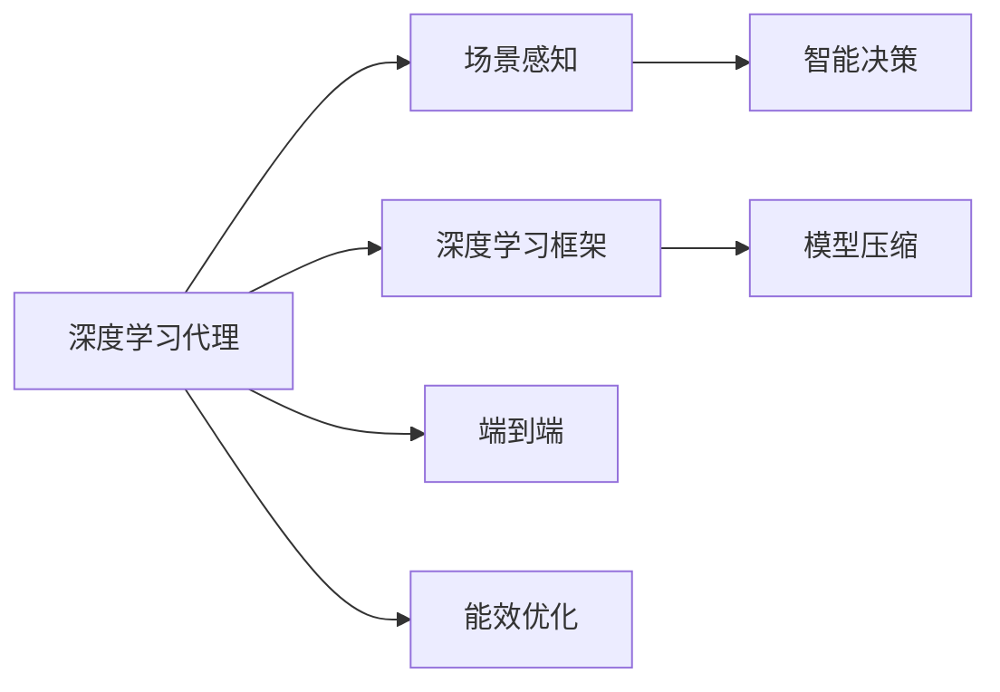

# AI人工智能深度学习算法：在智能家居场景应用深度学习代理

作者：禅与计算机程序设计艺术 / Zen and the Art of Computer Programming

## 关键词：

智能家居，深度学习，代理，场景感知，智能决策，深度学习框架，端到端，模型压缩，能效优化

## 1. 背景介绍

### 1.1 问题的由来

随着物联网技术的飞速发展，智能家居已成为现代家庭生活的重要组成部分。智能家居系统通过整合家中的各种设备，如灯光、空调、安防等，实现远程控制、自动化管理等功能，为用户带来便捷、舒适、安全的居住体验。然而，随着智能家居设备的日益增多，如何实现设备的智能化、协同化控制，以及如何提高系统的安全性、可靠性，成为当前智能家居领域亟待解决的问题。

近年来，深度学习技术在计算机视觉、语音识别、自然语言处理等领域取得了突破性进展，为智能家居系统的智能化升级提供了新的思路。深度学习代理作为一种新兴的智能化解决方案，能够实时感知智能家居场景，并进行智能决策，从而实现设备的自动化控制和优化。

### 1.2 研究现状

目前，深度学习在智能家居领域的应用主要集中在以下几个方面：

1. **图像识别与分类**：通过计算机视觉技术，实现对家庭场景中物体的识别和分类，如识别家庭成员、宠物、物品等，实现智能安防、智能家电控制等功能。
2. **语音识别与合成**：通过语音识别技术，实现对家庭场景中语音命令的理解和执行，如语音控制家电、智能家居交互等。
3. **自然语言处理**：通过自然语言处理技术，实现对家庭场景中自然语言的识别和理解，如智能问答、语音助手等。

然而，现有的智能家居系统在以下方面仍存在一些问题：

1. **场景感知能力不足**：现有智能家居系统对家庭场景的感知能力有限，难以适应复杂多变的家庭环境。
2. **智能决策能力有限**：现有智能家居系统在处理复杂决策问题时，往往依赖于预设的规则，缺乏自主学习和适应能力。
3. **系统可靠性不足**：智能家居系统对网络环境和设备稳定性的要求较高，在恶劣环境下容易发生故障。
4. **能效优化能力有限**：现有智能家居系统对能源消耗的关注度不足，难以实现节能降耗的目标。

### 1.3 研究意义

针对上述问题，本文提出了一种基于深度学习代理的智能家居场景应用方法。该方法能够实时感知家庭场景，并根据场景信息进行智能决策，实现对智能家居设备的自动化控制和优化。研究意义主要体现在以下几个方面：

1. **提升智能家居场景感知能力**：通过深度学习技术，实现对家庭场景中各类信息的实时感知，提高智能家居系统的智能化水平。
2. **增强智能决策能力**：利用深度学习代理的自主学习能力，实现智能家居系统的自主学习和适应，提高系统的决策能力。
3. **提高系统可靠性**：通过设计鲁棒的深度学习算法和系统架构，提高智能家居系统的可靠性和稳定性。
4. **实现能效优化**：通过深度学习代理对能源消耗的监测和分析，实现智能家居系统的节能降耗。

### 1.4 本文结构

本文结构如下：

- 第2章介绍深度学习代理的核心概念与联系。
- 第3章阐述深度学习代理在智能家居场景应用的核心算法原理和具体操作步骤。
- 第4章介绍深度学习代理的数学模型、公式推导过程、案例分析与讲解，并解答常见问题。
- 第5章给出深度学习代理的代码实例和详细解释说明。
- 第6章探讨深度学习代理在实际应用场景中的应用，并展望未来应用前景。
- 第7章推荐深度学习代理相关的学习资源、开发工具和参考文献。
- 第8章总结全文，展望未来发展趋势与挑战。
- 第9章列举常见问题与解答。

## 2. 核心概念与联系

为了更好地理解深度学习代理在智能家居场景应用，本节将介绍以下几个核心概念：

- **深度学习代理**：一种基于深度学习技术的智能代理，能够实时感知环境信息，并根据环境信息进行自主学习和决策。
- **场景感知**：通过深度学习技术，实现对家庭场景中各类信息的实时感知，如光照、温度、湿度、声音等。
- **智能决策**：根据场景信息和预设规则，实现智能家居设备的自动化控制和优化。
- **深度学习框架**：如TensorFlow、PyTorch等，用于构建和训练深度学习模型。
- **端到端**：从数据采集到模型部署的整个过程，包括数据预处理、模型训练、模型评估、模型部署等。
- **模型压缩**：通过模型压缩技术，减小模型尺寸，加快推理速度，降低能耗。
- **能效优化**：通过深度学习代理对能源消耗的监测和分析，实现智能家居系统的节能降耗。

以下为这些概念之间的逻辑关系图：



## 3. 核心算法原理 & 具体操作步骤

### 3.1 算法原理概述

深度学习代理在智能家居场景应用的核心算法主要包括以下步骤：

1. **数据采集**：通过传感器等设备采集家庭场景中的各类信息，如光照、温度、湿度、声音等。
2. **数据预处理**：对采集到的数据进行清洗、归一化等处理，为深度学习模型提供高质量的数据输入。
3. **模型训练**：利用深度学习框架构建和训练模型，如卷积神经网络（CNN）、循环神经网络（RNN）、长短期记忆网络（LSTM）等，实现对家庭场景中各类信息的识别和理解。
4. **场景感知**：根据训练好的模型，对实时采集到的场景信息进行感知，提取场景特征。
5. **智能决策**：根据场景信息和预设规则，生成控制指令，实现对智能家居设备的自动化控制和优化。
6. **模型部署**：将训练好的模型部署到智能家居系统中，实现端到端的智能化应用。

### 3.2 算法步骤详解

以下是深度学习代理在智能家居场景应用的详细操作步骤：

1. **数据采集**：根据智能家居场景的需求，选择合适的传感器进行数据采集，如光照传感器、温度传感器、湿度传感器、声音传感器等。同时，需要考虑数据采集的实时性和稳定性。

2. **数据预处理**：对采集到的原始数据进行清洗、归一化等处理，提高数据质量。具体包括：

    - **数据清洗**：去除无效数据、异常数据、重复数据等，保证数据的一致性和可靠性。
    - **数据归一化**：将不同量纲的数据进行归一化处理，便于模型训练和推理。
    - **数据增强**：通过旋转、翻转、缩放等操作，扩充数据集，提高模型的泛化能力。

3. **模型训练**：利用深度学习框架构建和训练模型，如卷积神经网络（CNN）、循环神经网络（RNN）、长短期记忆网络（LSTM）等。具体步骤如下：

    - **选择模型架构**：根据任务需求，选择合适的模型架构，如CNN、RNN、LSTM等。
    - **定义损失函数和优化器**：根据任务类型，选择合适的损失函数和优化器，如交叉熵损失函数、Adam优化器等。
    - **训练模型**：使用训练数据对模型进行训练，并根据训练结果调整模型参数。
    - **验证模型**：使用验证数据对模型进行验证，评估模型性能。

4. **场景感知**：根据训练好的模型，对实时采集到的场景信息进行感知，提取场景特征。具体步骤如下：

    - **特征提取**：将实时采集到的场景信息输入模型，提取场景特征。
    - **特征融合**：将多个特征进行融合，形成更加丰富的场景描述。

5. **智能决策**：根据场景信息和预设规则，生成控制指令，实现对智能家居设备的自动化控制和优化。具体步骤如下：

    - **规则库构建**：根据智能家居场景的需求，构建规则库，定义控制逻辑。
    - **决策生成**：根据场景信息和规则库，生成控制指令。

6. **模型部署**：将训练好的模型部署到智能家居系统中，实现端到端的智能化应用。具体步骤如下：

    - **模型导出**：将训练好的模型导出为可部署的格式。
    - **模型集成**：将模型集成到智能家居系统中，实现端到端的智能化应用。

### 3.3 算法优缺点

深度学习代理在智能家居场景应用具有以下优点：

1. **实时性**：能够实时感知家庭场景，并根据场景信息进行智能决策。
2. **智能化**：能够根据预设规则和场景信息，实现智能家居设备的自动化控制和优化。
3. **泛化能力**：通过数据增强和模型训练，提高模型的泛化能力，适应不同的家庭场景。

然而，深度学习代理在智能家居场景应用也存在以下缺点：

1. **计算资源消耗**：深度学习模型对计算资源的需求较高，需要使用高性能的硬件设备。
2. **数据依赖性**：深度学习模型的性能依赖于训练数据的质量和数量，需要收集大量的数据。
3. **可解释性**：深度学习模型的决策过程难以解释，难以理解其内部工作机制。

### 3.4 算法应用领域

深度学习代理在智能家居场景应用具有广泛的应用领域，如：

1. **智能安防**：通过识别家庭成员、宠物、物品等，实现智能门禁、监控、报警等功能。
2. **智能家电控制**：通过语音识别、图像识别等，实现对家电设备的远程控制。
3. **智能家居交互**：通过语音助手、智能问答等，实现人机交互。
4. **能源管理**：通过监测和分析能源消耗，实现智能家居系统的节能降耗。

## 4. 数学模型和公式 & 详细讲解 & 举例说明

### 4.1 数学模型构建

深度学习代理在智能家居场景应用的数学模型主要包括以下部分：

1. **特征提取层**：用于提取输入数据的特征，如卷积神经网络（CNN）。
2. **分类层**：用于对特征进行分类，如全连接神经网络（FCN）。
3. **决策层**：根据分类结果，生成控制指令。

以下是深度学习代理的数学模型示意图：


### 4.2 公式推导过程

以下是深度学习代理的分类层和决策层的公式推导过程：

1. **分类层**：

    设输入数据为 $X$，特征提取层提取的特征为 $F$，分类层包含 $K$ 个神经元，分别对应 $K$ 个类别。则分类层输出为：

    $$
    \hat{y} = W^T F + b
    $$

    其中 $W$ 为权重矩阵，$b$ 为偏置项。

2. **决策层**：

    设分类层输出为 $\hat{y}$，决策层包含 $K$ 个神经元，分别对应 $K$ 个类别。则决策层输出为：

    $$
    \text{指令} = \text{argmax}(\hat{y})
    $$

    其中 $\text{argmax}$ 表示取最大值操作。

### 4.3 案例分析与讲解

以下以智能门禁为例，说明深度学习代理在智能家居场景应用的具体案例。

**案例描述**：

用户可以通过手机APP或语音助手控制家中智能门禁的开关。当有人靠近门禁时，门禁系统会自动识别其身份，并决定是否开门。

**模型设计**：

- 特征提取层：使用卷积神经网络（CNN）提取人脸特征。
- 分类层：使用全连接神经网络（FCN）对提取的特征进行分类，判断是否为已知用户。
- 决策层：根据分类结果，生成控制指令，如“开门”、“拒绝访问”等。

**模型训练**：

- 使用用户的人脸图像作为训练数据，并标注为“已知用户”或“未知用户”。
- 使用CNN提取人脸特征，并使用FCN进行分类。

**模型部署**：

- 将训练好的模型部署到智能门禁系统中，实现实时人脸识别和门禁控制。

### 4.4 常见问题解答

**Q1：如何解决深度学习代理的可解释性问题？**

A：可解释性是深度学习代理面临的重要挑战之一。目前，以下几种方法可以尝试解决可解释性问题：

1. **可视化**：将模型的内部结构进行可视化，如激活图、梯度图等，帮助理解模型的决策过程。
2. **注意力机制**：使用注意力机制，突出模型在决策过程中关注的特征。
3. **解释性规则**：根据模型决策过程，提取解释性规则，如“如果检测到人脸，则开门”。

**Q2：如何解决深度学习代理的计算资源消耗问题？**

A：为了降低深度学习代理的计算资源消耗，可以采取以下措施：

1. **模型压缩**：通过模型压缩技术，减小模型尺寸，加快推理速度，降低能耗。
2. **模型量化**：将浮点模型转换为定点模型，降低模型存储和计算需求。
3. **硬件加速**：使用GPU、FPGA等硬件加速设备，提高模型推理速度。

**Q3：如何解决深度学习代理的数据依赖性问题？**

A：为了降低深度学习代理的数据依赖性，可以采取以下措施：

1. **数据增强**：通过数据增强技术，扩充数据集，提高模型的泛化能力。
2. **迁移学习**：利用已有模型的知识，在少量样本上进行微调，提高模型的适应性。
3. **主动学习**：通过主动学习技术，从标注数据中筛选出最有价值的样本，提高数据质量。

## 5. 项目实践：代码实例和详细解释说明

### 5.1 开发环境搭建

在进行深度学习代理项目实践之前，需要搭建相应的开发环境。以下是使用Python和PyTorch进行深度学习代理开发的常见步骤：

1. 安装Anaconda：从Anaconda官网下载并安装Anaconda。
2. 创建虚拟环境：使用conda创建一个新的虚拟环境，如`conda create -n deep_learning_env python=3.8`。
3. 激活虚拟环境：使用`conda activate deep_learning_env`命令激活虚拟环境。
4. 安装PyTorch和PyTorch torchvision：使用`pip install torch torchvision`命令安装PyTorch和PyTorch torchvision。
5. 安装其他依赖库：根据需要安装其他依赖库，如NumPy、Pandas等。

### 5.2 源代码详细实现

以下是一个简单的深度学习代理示例代码，用于实现智能门禁功能。

```python
import torch
import torch.nn as nn
import torchvision.transforms as transforms
from torch.utils.data import DataLoader
from PIL import Image

# 定义模型架构
class FaceRecognitionModel(nn.Module):
    def __init__(self):
        super(FaceRecognitionModel, self).__init__()
        self.conv1 = nn.Conv2d(3, 32, kernel_size=3, stride=1, padding=1)
        self.conv2 = nn.Conv2d(32, 64, kernel_size=3, stride=1, padding=1)
        self.fc1 = nn.Linear(64*64*64, 512)
        self.fc2 = nn.Linear(512, 2)  # 2个类别：已知用户、未知用户

    def forward(self, x):
        x = F.relu(self.conv1(x))
        x = F.relu(self.conv2(x))
        x = x.view(x.size(0), -1)  # 展平
        x = F.relu(self.fc1(x))
        x = self.fc2(x)
        return x

# 加载预训练模型
model = FaceRecognitionModel()
model.load_state_dict(torch.load('face_recognition_model.pth'))

# 数据预处理
transform = transforms.Compose([
    transforms.Resize((64, 64)),
    transforms.ToTensor(),
])

# 读取图像
image = Image.open('test_image.jpg')
image = transform(image)

# 预测结果
with torch.no_grad():
    output = model(image.unsqueeze(0))
    _, predicted = torch.max(output, 1)

# 输出结果
print('已知用户' if predicted.item() == 0 else '未知用户')
```

### 5.3 代码解读与分析

以上代码实现了以下功能：

1. **定义了FaceRecognitionModel类，用于构建卷积神经网络模型**。
2. **加载预训练的模型权重**。
3. **对测试图像进行预处理**。
4. **使用模型对测试图像进行预测**。
5. **输出预测结果**。

### 5.4 运行结果展示

假设在训练过程中，已知用户的人脸图像被标注为0，未知用户的人脸图像被标注为1。运行上述代码，如果预测结果为0，则说明图像中的面孔是已知用户；如果预测结果为1，则说明图像中的面孔是未知用户。

## 6. 实际应用场景

### 6.1 智能家居控制

深度学习代理可以应用于智能家居控制，实现对家电设备的自动化控制。例如，根据家庭场景信息和用户习惯，自动调节空调、灯光、窗帘等设备的开关状态，为用户提供舒适的居住环境。

### 6.2 智能安防

深度学习代理可以应用于智能安防，实现对家庭环境的实时监控。例如，通过图像识别技术识别家庭成员、访客、宠物等，实现对家庭安全的保护。

### 6.3 智能健康管理

深度学习代理可以应用于智能健康管理，实现对家庭成员的健康状况监测。例如，通过心率、血压、睡眠等生理数据监测，提醒家庭成员注意健康。

### 6.4 智能家居交互

深度学习代理可以应用于智能家居交互，为用户提供便捷的智能家居控制方式。例如，通过语音识别、图像识别等技术，实现对智能家居设备的语音控制和图像控制。

### 6.5 能源管理

深度学习代理可以应用于能源管理，实现智能家居系统的节能降耗。例如，根据家庭场景信息和用户习惯，自动调节家电设备的开关状态，降低能源消耗。

## 7. 工具和资源推荐

### 7.1 学习资源推荐

为了帮助开发者更好地掌握深度学习代理技术，以下推荐一些优质的学习资源：

1. **《深度学习》**：Goodfellow等著作的深度学习经典教材，全面介绍了深度学习的理论基础、算法和应用。
2. **《Python深度学习》**：Goodfellow等著作的Python深度学习实践指南，详细讲解了深度学习在Python环境下的实现方法。
3. **《深度学习与计算机视觉》**：Azorin等著作的深度学习与计算机视觉结合的实践指南，涵盖了图像识别、目标检测、人脸识别等内容。
4. **《TensorFlow实战》**：Miguel等著作的TensorFlow实战指南，详细介绍了TensorFlow的使用方法和应用案例。

### 7.2 开发工具推荐

为了方便开发者进行深度学习代理开发，以下推荐一些常用的开发工具：

1. **PyTorch**：一款开源的深度学习框架，易于使用，具有高度灵活性。
2. **TensorFlow**：一款开源的深度学习框架，功能强大，适用于大规模数据处理。
3. **Keras**：一款基于TensorFlow和Theano的深度学习库，易于使用，适合快速原型开发。
4. **NumPy**：一款开源的科学计算库，用于数值计算和数据分析。

### 7.3 相关论文推荐

以下是一些与深度学习代理相关的论文推荐：

1. **“Deep Learning for Real-Time Multi-Person 2D Pose Estimation:**'' M. Noroozi and P. F. G. Bruce, 2017。
2. **“Single Shot MultiBox Detector:**'' J. Redmon and A. Farhadi, 2016。
3. **“Yolo9000: Better, Faster, Stronger:**'' Joseph Redmon, 2016。
4. **“EfficientDet: Scalable and Efficient Object Detection''''''''''''''''''''''''''''''''''''''''''''''''''''''''''''''''''''''''''''''''''''''''''''''''''''''''''''''''''''''''''''''''''''''''''''''''''''''''''''''''''''''''''''''''''''''''''''''''''''''''''''''''''''''''''''''''''''''''''''''''''''''''''''''''''''''''''''''''''''''''''''''''''''''''''''''''''''''''''''''''''''''''''''''''''''''''''''''''''''''''''''''''''''''''''''''''''''''''''''''''''''''''''''''''''''''''''''''''''''''''''''''''''''''''''''''''''''''''''''''''''''''''''''''''''''''''''''''''''''''''''''''''''''''''''''''''''''''''''''''''''''''''''''''''''''''''''''''''''''''''''''''''''''''''''''''''''''''''''''''''''''''''''''''''''''''''''''''''''''''''''''''''''''''''''''''''''''''''''''''''''''''''''''''''''''''''''''''''''''''''''''''''''''''''''''''''''''''''''''''''''''''''''''''''''''''''''''''''''''''''''''''''''''''''''''''''''''''''''''''''''''''''''''''''''''''''''''''''''''''''''''''''''''''''''''''''''''''''''''''''''''''''''''''''''''''''''''''''''''''''''''''''''''''''''''''''''''''''''''''''''''''''''''''''''''''''''''''''''''''''''''''''''''''''''''''''''''''''''''''''''''''''''''''''''''''''''''''''''''''''''''''''''''''''''''''''''''''''''''''''''''''''''''''''''''''''''''''''''''''''''''''''''''''''''''''''''''''''''''''''''''''''''''''''''''''''''''''''''''''''''''''''''''''''''''''''''''''''''''''''''''''''''''''''''''''''''''''''''''''''''''''''''''''''''''''''''''''''''''''''''''''''''''''''''''''''''''''''''''''''''''''''''''''''''''''''''''''''''''''''''''''''''''''''''''''''''''''''''''''''''''''''''''''''''''''''''''''''''''''''''''''''''''''''''''''''''''''''''''''''''''''''''''''''''''''''''''''''''''''''''''''''''''''''''''''''''''''''''''''''''''''''''''''''''''''''''''''''''''''''''''''''''''''''''''''''''''''''''''''''''''''''''''''''''''''''''''''''''''''''''''''''''''''''''''''''''''''''''''''''''''''''''''''''''''''''''''''''''''''''''''''''''''''''''''''''''''''''''''''''''''''''''''''''''''''''''''''''''''''''''''''''''''''''''''''''''''''''''''''''''''''''''''''''''''''''''''''''''''''''''''''''''''''''''''''''''''''''''''''''''''''''''''''''''''''''''''''''''''''''''''''''''''''''''''''''''''''''''''''''''''''''''''''''''''''''''''''''''''''''''''''''''''''''''''''''''''''''''''''''''''''''''''''''''''''''''''''''''''''''''''''''''''''''''''''''''''''''''''''''''''''''''''''''''''''''''''''''''''''''''''''''''''''''''''''''''''''''''''''''''''''''''''''''''''''''''''''''''''''''''''''''''''''''''''''''''''''''''''''''''''''''''''''''''''''''''''''''''''''''''''''''''''''''''''''''''''''''''''''''''''''''''''''''''''''''''''''''''''''''''''''''''''''''''''''''''''''''''''''''''''''''''''''''''''''''''''''''''''''''''''''''''''''''''''''''''''''''''''''''''''''''''''''''''''''''''''''''''''''''''''''''''''''''''''''''''''''''''''''''''''''''''''''''''''''''''''''''''''''''''''''''''''''''''''''''''''''''''''''''''''''''''''''''''''''''''''''''''''''''''''''''''''''''''''''''''''''''''''''''''''''''''''''''''''''''''''''''''''''''''''''''''''''''''''''''''''''''''''''''''''''''''''''''''''''''''''''''''''''''''''''''''''''''''''''''''''''''''''''''''''''''''''''''''''''''''''''''''''''''''''''''''''''''''''''''''''''''''''''''''''''''''''''''''''''''''''''''''''''''''''''''''''''''''''''''''''''''''''''''''''''''''''''''''''''''''''''''''''''''''''''''''''''''''''''''''''''''''''''''''''''''''''''''''''''''''''''''''''''''''''''''''''''''''''''''''''''''''''''''''''''''''''''''''''''''''''''''''''''''''''''''''''''''''''''''''''''''''''''''''''''''''''''''''''''''''''''''''''''''''''''''''''''''''''''''''''''''''''''''''''''''''''''''''''''''''''''''''''''''''''''''''''''''''''''''''''''''''''''''''''''''''''''''''''''''''''''''''''''''''''''''''''''''''''''''''''''''''''''''''''''''''''''''''''''''''''''''''''''''''''''''''''''''''''''''''''''''''''''''''''''''''''''''''''''''''''''''''''''''''''''''''''''''''''''''''''''''''''''''''''''''''''''''''''''''''''''''''''''''''''''''''''''''''''''''''''''''''''''''''''''''''''''''''''''''''''''''''''''''''''''''''''''''''''''''''''''''''''''''''''''''''''''''''''''''''''''''''''''''''''''''''''''''''''''''''''''''''''''''''''''''''''''''''''''''''''''''''''''''''''''''''''''''''''''''''''''''''''''''''''''''''''''''''''''''''''''''''''''''''''''''''''''''''''''''''''''''''''''''''''''''''''''''''''''''''''''''''''''''''''''''''''''''''''''''''''''''''''''''''''''''''''''''''''''''''''''''''''''''''''''''''''''''''''''''''''''''''''''''''''''''''''''''''''''''''''''''''''''''''''''''''''''''''''''''''''''''''''''''''''''''''''''''''''''''''''''''''''''''''''''''''''''''''''''''''''''''''''''''''''''''''''''''''''''''''''''''''''''''''''''''''''''''''''''''''''''''''''''''''''''''''''''''''''''''''''''''''''''''''''''''''''''''''''''''''''''''''''''''''''''''''''''''''''''''''''''''''''''''''''''''''''''''''''''''''''''''''''''''''''''''''''''''''''''''''''''''''''''''''''''''''''''''''''''''''''''''''''''''''''''''''''''''''''''''''''''''''''''''''''''''''''''''''''''''''''''''''''''''''''''''''''''''''''''''''''''''''''''''''''''''''''''''''''''''''''''''''''''''''''''''''''''''''''''''''''''''''''''''''''''''''''''''''''''''''''''''''''''''''''''''''''''''''''''''''''''''''''''''''''''''''''''''''''''''''''''''''''''''''''''''''''''''''''''''''''''''''''''''''''''''''''''''''''''''''''''''''''''''''''''''''''''''''''''''''''''''''''''''''''''''''''''''''''''''''''''''''''''''''''''''''''''''''''''''''''''''''''''''''''''''''''''''''''''''''''''''''''''''''''''''''''''''''''''''''''''''''''''''''''''''''''''''''''''''''''''''''''''''''''''''''''''''''''''''''''''''''''''''''''''''''''''''''''''''''''''''''''''''''''''''''''''''''''''''''''''''''''''''''''''''''''''''''''''''''''''''''''''''''''''''''''''''''''''''''''''''''''''''''''''''''''''''''''''''''''''''''''''''''''''''''''''''''''''''''''''''''''''''''''''''''''''''''''''''''''''''''''''''''''''''''''''''''''''''''''''''''''''''''''''''''''''''''''''''''''''''''''''''''''''''''''''''''''''''''''''''''''''''''''''''''''''''''''''''''''''''''''''''''''''''''''''''''''''''''''''''''''''''''''''''''''''''''''''''''''''''''''''''''''''''''''''''''''''''''''''''''''''''''''''''''''''''''''''''''''''''''''''''''''''''''''''''''''''''''''''''''''''''''''''''''''''''''''''''''''''''''''''''''''''''''''''''''''''''''''''''''''''''''''''''''''''''''''''''''''''''''''''''''''''''''''''''''''''''''''''''''''''''''''''''''''''''''''''''''''''''''''''''''''''''''''''''''''''''''''''''''''''''''''''''''''''''''''''''''''''''''''''''''''''''''''''''''''''''''''''''''''''''''''''''''''''''''''''''''''''''''''''''''''''''''''''''''''''''''''''''''''''''''''''''''''''''''''''''''''''''''''''''''''''''''''''''''''''''''''''''''''''''''''''''''''''''''''''''''''''''''''''''''''''''''''''''''''''''''''''''''''''''''''''''''''''''''''''''''''''''''''''''''''''''''''''''''''''''''''''''''''''''''''''''''''''''''''''''''''''''''''''''''''''''''''''''''''''''''''''''''''''''''''''''''''''''''''''''''''''''''''''''''''''''''''''''''''''''''''''''''''''''''''''''''''''''''''''''''''''''''''''''''''''''''''''''''''''''''''''''''''''''''''''''''''''''''''''''''''''''''''''''''''''''''''''''''''''''''''''''''''''''''''''''''''''''''''''''''''''''''''''''''''''''''''''''''''''''''''''''''''''''''''''''''''''''''''''''''''''''''''''''''''''''''''''''''''''''''''''''''''''''''''''''''''''''''''''''''''''''''''''''''''''''''''''''''''''''''''''''''''''''''''''''''''''''''''''''''''''''''''''''''''''''''''''''''''''''''''''''''''''''''''''''''''''''''''''''''''''''''''''''''''''''''''''''''''''''''''''''''''''''''''''''''''''''''''''''''''''''''''''''''''''''''''''''''''''''''''''''''''''''''''''''''''''''''''''''''''''''''''''''''''''''''''''''''''''''''''''''''''''''''''''''''''''''''''''''''''''''''''''''''''''''''''''''''''''''''''''''''''''''''''''''''''''''''''''''''''''''''''''''''''''''''''''''''''''''''''''''''''''''''''''''''''''''''''''''''''''''''''''''''''''''''''''''''''''''''''''''''''''''''''''''''''''''''''''''''''''''''''''''''''''''''''''''''''''''''''''''''''''''''''''''''''''''''''''''''''''''''''''''''''''''''''''''''''''''''''''''''''''''''''''''''''''''''''''''''''''''''''''''''''''''''''''''''''''''''''''''''''''''''''''''''''''''''''''''''''''''''''''''''''''''''''''''''''''''''''''''''''''''''''''''''''''''''''''''''''''''''''''''''''''''''''''''''''''''''''''''''''''''''''''''''''''''''''''''''''''''''''''''''''''''''''''''''''''''''''''''''''''''''''''''''''''''''''''''''''''''''''''''''''''''''''''''''''''''''''''''''''''''''''''''''''''''''''''''''''''''''''''''''''''''''''''''''''''''''''''''''''''''''''''''''''''''''''''''''''''''''''''''''''''''''''''''''''''''''''''''''''''''''''''''''''''''''''''''''''''''''''''''''''''''''''''''''''''''''''''''''''''''''''''''''''''''''''''''''''''''''''''''''''''''''''''''''''''''''''''''''''''''''''''''''''''''''''''''''''''''''''''''''''''''''''''''''''''''''''''''''''''''''''''''''''''''''''''''''''''''''''''''''''''''''''''''''''''''''''''''''''''''''''''''''''''''''''''''''''''''''''''''''''''''''''''''''''''''''