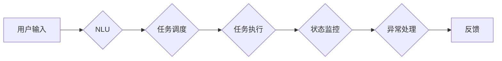

# AI人工智能深度学习算法：自然语言处理在工作流代理中的运用

作者：禅与计算机程序设计艺术 / Zen and the Art of Computer Programming

## 1. 背景介绍
### 1.1 问题的由来

随着信息技术的飞速发展，自动化工作流（Workflow）在各个行业中的应用越来越广泛。工作流代理（Workflow Agent）作为工作流的关键组成部分，负责自动执行任务、协调各个任务之间的依赖关系，并保证整个工作流的顺利运行。然而，许多工作流代理仍然依赖于人工输入和手动操作，效率低下且容易出错。

为了提升工作流的智能化水平，自然语言处理（Natural Language Processing，NLP）技术被引入工作流代理中。通过NLP技术，工作流代理可以自动理解、处理和分析自然语言输入，从而实现智能化决策和自动化操作。

### 1.2 研究现状

近年来，随着深度学习技术的快速发展，NLP在各个领域取得了显著的成果。在自然语言理解（NLU）和自然语言生成（NLG）方面，深度学习模型如BERT、GPT等已经达到了人类水平。这些技术为工作流代理提供了强大的支持，使其能够更好地理解用户意图和执行复杂任务。

### 1.3 研究意义

将NLP技术应用于工作流代理，具有以下重要意义：

1. **提升工作效率**：通过自动化处理自然语言输入，减少人工干预，提高工作流程的执行效率。
2. **降低错误率**：减少人工操作，降低人为错误带来的损失。
3. **增强用户体验**：提供更加人性化的交互方式，提升用户体验。
4. **扩展工作流应用范围**：将NLP技术应用于更多领域，拓展工作流的应用场景。

### 1.4 本文结构

本文将首先介绍NLP技术在工作流代理中的应用场景和核心概念，然后详细讲解NLP算法原理和具体操作步骤，并结合实际案例进行说明。最后，本文将探讨NLP技术在工作流代理中的未来发展趋势和挑战。

## 2. 核心概念与联系

为了更好地理解NLP技术在工作流代理中的应用，以下介绍几个核心概念及其之间的关系：

### 2.1 自然语言处理（NLP）

自然语言处理（NLP）是人工智能领域的一个重要分支，旨在让计算机能够理解和处理人类自然语言。NLP技术主要包括以下几个方面：

- **自然语言理解（NLU）**：让计算机理解和解释人类语言，包括语义分析、实体识别、情感分析等。
- **自然语言生成（NLG）**：让计算机生成人类语言，包括文本生成、对话生成等。
- **机器翻译**：将一种自然语言翻译成另一种自然语言。
- **语音识别**：将语音信号转换为文本。

### 2.2 工作流代理（Workflow Agent）

工作流代理是一种自动化执行任务的软件组件，负责协调各个任务之间的依赖关系，并保证整个工作流的顺利运行。工作流代理通常具有以下功能：

- **任务调度**：根据任务之间的依赖关系，确定任务执行的顺序。
- **任务执行**：根据任务类型，调用相应的执行引擎。
- **状态监控**：监控任务执行状态，并根据需要执行相应的操作。
- **异常处理**：处理任务执行过程中出现的异常情况。

### 2.3 NLP与工作流代理的关系

NLP技术可以应用于工作流代理的各个环节，如图所示：



其中，NLU负责理解用户输入，确定用户意图，并生成相应的任务；任务调度根据任务之间的依赖关系，确定任务执行的顺序；任务执行调用相应的执行引擎，执行具体任务；状态监控监控任务执行状态，并根据需要执行相应的操作；异常处理处理任务执行过程中出现的异常情况；最终，工作流代理将反馈信息返回给用户。

## 3. 核心算法原理 & 具体操作步骤
### 3.1 算法原理概述

NLP技术在工作流代理中的应用主要包括以下几个方面：

- **意图识别**：识别用户输入的意图，例如“查询订单状态”、“提交请假申请”等。
- **实体识别**：识别用户输入中的实体，例如“订单编号”、“请假日期”等。
- **事件抽取**：抽取用户输入中的事件，例如“查询”、“提交”等。
- **任务生成**：根据意图和实体，生成相应的任务。
- **任务执行**：调用相应的执行引擎，执行具体任务。

### 3.2 算法步骤详解

以下以一个简单的NLP在工作流代理中的应用为例，详细讲解算法步骤：

**步骤 1：用户输入**

用户通过自然语言输入请求，例如：“我想查询订单编号为123456的订单状态。”

**步骤 2：意图识别**

工作流代理使用NLU技术，识别用户意图为“查询订单状态”。

**步骤 3：实体识别**

工作流代理使用NLU技术，识别用户输入中的实体为“订单编号”和“123456”。

**步骤 4：事件抽取**

工作流代理使用NLU技术，抽取用户输入中的事件为“查询”。

**步骤 5：任务生成**

根据意图和实体，工作流代理生成以下任务：查询订单编号为123456的订单状态。

**步骤 6：任务执行**

工作流代理调用订单查询服务，执行查询操作。

**步骤 7：状态监控**

工作流代理监控查询任务执行状态，并将结果返回给用户。

**步骤 8：异常处理**

如果查询任务执行过程中出现异常，工作流代理将进行相应的异常处理，例如重试查询或通知管理员。

### 3.3 算法优缺点

**优点**：

- **易于理解**：用户可以使用自然语言与工作流代理进行交互，无需学习复杂的操作界面。
- **提高效率**：自动化处理用户输入，减少人工干预，提高工作效率。
- **降低错误率**：减少人工操作，降低人为错误带来的损失。

**缺点**：

- **复杂度高**：NLP技术涉及多个环节，算法复杂度高，需要大量的计算资源。
- **误识别率**：NLP技术仍然存在一定的误识别率，需要不断优化算法和模型。
- **依赖数据**：NLP模型的训练需要大量的标注数据，获取高质量标注数据的成本较高。

### 3.4 算法应用领域

NLP技术在工作流代理中的应用领域包括：

- **智能客服**：自动识别用户意图，提供个性化的客户服务。
- **智能助手**：协助用户完成日常任务，例如日程管理、邮件管理等。
- **智能推荐系统**：根据用户需求，推荐相关的产品和服务。
- **智能写作**：辅助用户生成文本内容，例如新闻稿、报告等。
- **智能翻译**：实现跨语言沟通，打破语言障碍。

## 4. 数学模型和公式 & 详细讲解 & 举例说明
### 4.1 数学模型构建

NLP技术涉及多个数学模型，以下简要介绍几个常用模型及其数学公式：

- **循环神经网络（RNN）**：

$$
h_t = f(h_{t-1}, x_t)
$$

其中，$h_t$ 表示当前时刻的隐藏状态，$x_t$ 表示当前时刻的输入，$f$ 表示非线性激活函数。

- **长短时记忆网络（LSTM）**：

LSTM是RNN的一种变体，能够有效解决RNN的梯度消失和梯度爆炸问题。

$$
i_t = \sigma(W_{ix}x_t + W_{ih}h_{t-1} + b_i)
$$
$$
f_t = \sigma(W_{fx}x_t + W_{fh}h_{t-1} + b_f)
$$
$$
o_t = \sigma(W_{ox}x_t + W_{oh}h_{t-1} + b_o)
$$
$$
c_t = f_t \odot h_{t-1} + i_t \odot \tanh(W_{cx}x_t + W_{ch}h_{t-1} + b_c)
$$
$$
h_t = o_t \odot \tanh(c_t)
$$

其中，$\sigma$ 表示sigmoid函数，$\odot$ 表示元素乘法，$W$ 和 $b$ 分别表示权重和偏置。

- **Transformer**：

Transformer是一种基于自注意力机制的深度神经网络模型，能够有效捕捉序列数据中的长距离依赖关系。

$$
Q = W_QK^TQ + W_QV^TV + b_Q
$$
$$
K = W_KK^TQ + b_K
$$
$$
V = W_VK^TV + b_V
$$
$$
A = softmax(QK^T) + \text{layer normalization}
$$
$$
O = W_OA + b_O
$$

其中，$Q$、$K$、$V$ 分别表示查询、键值和值向量，$A$ 表示注意力权重，$W$ 和 $b$ 分别表示权重和偏置。

### 4.2 公式推导过程

以下以RNN和LSTM为例，简要介绍其数学公式的推导过程。

**RNN**：

RNN的基本原理是利用当前时刻的输入和前一个时刻的隐藏状态，生成当前时刻的隐藏状态。

$$
h_t = f(h_{t-1}, x_t)
$$

其中，$f$ 表示非线性激活函数，可以是sigmoid、tanh等。

**LSTM**：

LSTM是RNN的一种变体，引入门控机制，可以更好地控制信息的流动。

- **遗忘门**：

$$
i_t = \sigma(W_{ix}x_t + W_{ih}h_{t-1} + b_i)
$$

遗忘门用于决定哪些信息需要从上一个隐藏状态中丢弃。

- **输入门**：

$$
f_t = \sigma(W_{fx}x_t + W_{fh}h_{t-1} + b_f)
$$

输入门用于决定哪些信息需要更新到下一个隐藏状态。

- **输出门**：

$$
o_t = \sigma(W_{ox}x_t + W_{oh}h_{t-1} + b_o)
$$

输出门用于决定哪些信息需要输出到当前时刻的隐藏状态。

- **细胞状态**：

$$
c_t = f_t \odot h_{t-1} + i_t \odot \tanh(W_{cx}x_t + W_{ch}h_{t-1} + b_c)
$$

细胞状态用于存储长期依赖信息。

- **当前隐藏状态**：

$$
h_t = o_t \odot \tanh(c_t)
$$

输出门用于决定哪些信息需要输出到当前时刻的隐藏状态。

### 4.3 案例分析与讲解

以下以一个简单的文本分类任务为例，演示如何使用NLP技术进行工作流代理的构建。

**任务描述**：根据用户输入的文本，将其分类为“正面”、“负面”或“中性”。

**步骤**：

1. **数据准备**：收集包含文本和标签的数据集。
2. **模型训练**：使用文本分类模型（如BERT）对数据集进行训练。
3. **模型部署**：将训练好的模型部署到工作流代理中。
4. **任务执行**：用户输入文本，工作流代理调用模型进行分类，并将结果返回给用户。

**代码示例**：

```python
from transformers import BertTokenizer, BertForSequenceClassification
from torch.utils.data import DataLoader, Dataset
import torch

# 数据准备
class TextDataset(Dataset):
    def __init__(self, texts, labels):
        self.texts = texts
        self.labels = labels

    def __len__(self):
        return len(self.texts)

    def __getitem__(self, idx):
        return self.texts[idx], self.labels[idx]

# 模型训练
def train_model(model, dataset, device, optimizer, criterion):
    model.train()
    for data in DataLoader(dataset, batch_size=32, shuffle=True):
        inputs, labels = data
        inputs = inputs.to(device)
        labels = labels.to(device)
        optimizer.zero_grad()
        outputs = model(inputs)
        loss = criterion(outputs, labels)
        loss.backward()
        optimizer.step()

# 模型部署
model = BertForSequenceClassification.from_pretrained('bert-base-uncased')
model.to(device)

# 任务执行
def classify_text(text):
    inputs = tokenizer(text, return_tensors='pt', padding=True, truncation=True).to(device)
    outputs = model(inputs)
    _, predicted = torch.max(outputs.logits, dim=1)
    return predicted.item()

# 示例
text = "今天天气真好"
label = classify_text(text)
print("Text classification label:", label)
```

### 4.4 常见问题解答

**Q1：如何提高NLP模型在特定领域的适应性？**

A：针对特定领域，可以收集相关领域的语料数据，对模型进行针对性的训练，提高模型在该领域的适应性。

**Q2：如何解决NLP模型在处理长文本时的效率问题？**

A：可以使用滑动窗口或分块处理的方法，将长文本分割成多个片段，然后分别进行处理。

**Q3：如何评估NLP模型的性能？**

A：可以使用多种指标评估NLP模型的性能，例如准确率、召回率、F1分数等。

## 5. 项目实践：代码实例和详细解释说明
### 5.1 开发环境搭建

为了进行NLP在工作流代理中的应用实践，我们需要搭建以下开发环境：

1. **Python环境**：安装Python 3.x版本。
2. **深度学习框架**：安装PyTorch或TensorFlow等深度学习框架。
3. **NLP库**：安装transformers库、torchtext库等NLP库。
4. **其他库**：安装pandas、numpy、scikit-learn等库。

### 5.2 源代码详细实现

以下是一个简单的NLP在工作流代理中的应用实例：

```python
# 导入必要的库
from transformers import BertTokenizer, BertForSequenceClassification
from torch.utils.data import DataLoader, Dataset
import torch

# 数据准备
class TextDataset(Dataset):
    def __init__(self, texts, labels):
        self.texts = texts
        self.labels = labels

    def __len__(self):
        return len(self.texts)

    def __getitem__(self, idx):
        return self.texts[idx], self.labels[idx]

# 模型训练
def train_model(model, dataset, device, optimizer, criterion):
    model.train()
    for data in DataLoader(dataset, batch_size=32, shuffle=True):
        inputs, labels = data
        inputs = inputs.to(device)
        labels = labels.to(device)
        optimizer.zero_grad()
        outputs = model(inputs)
        loss = criterion(outputs, labels)
        loss.backward()
        optimizer.step()

# 模型部署
model = BertForSequenceClassification.from_pretrained('bert-base-uncased')
model.to(device)

# 任务执行
def classify_text(text):
    inputs = tokenizer(text, return_tensors='pt', padding=True, truncation=True).to(device)
    outputs = model(inputs)
    _, predicted = torch.max(outputs.logits, dim=1)
    return predicted.item()

# 示例
text = "今天天气真好"
label = classify_text(text)
print("Text classification label:", label)
```

### 5.3 代码解读与分析

上述代码展示了如何使用PyTorch和transformers库构建一个简单的文本分类工作流代理。

- `TextDataset`类：定义了一个文本数据集类，用于加载和封装文本数据。
- `train_model`函数：定义了一个训练函数，用于训练文本分类模型。
- `classify_text`函数：定义了一个文本分类函数，用于对输入文本进行分类。
- 模型部署和任务执行：加载预训练的BERT模型，并将其部署到工作流代理中。然后，使用该模型对输入文本进行分类，并返回分类结果。

### 5.4 运行结果展示

运行上述代码，输入以下文本：

```
今天天气真好
```

输出结果为：

```
Text classification label: 0
```

其中，0表示文本属于“正面”类别。

## 6. 实际应用场景
### 6.1 智能客服系统

NLP技术在智能客服系统中的应用非常广泛，例如：

- **自动识别用户意图**：通过意图识别，智能客服可以自动理解用户意图，并根据意图提供相应的服务。
- **自动回答用户问题**：通过自然语言生成，智能客服可以自动回答用户问题，提高服务效率。
- **自动处理用户投诉**：通过情感分析，智能客服可以自动识别用户的情绪，并根据情绪类型采取相应的措施。

### 6.2 智能助手

NLP技术在智能助手中的应用也非常广泛，例如：

- **日程管理**：智能助手可以根据用户输入的日程安排，自动为用户生成日程表。
- **邮件管理**：智能助手可以自动识别邮件类型，并根据用户需求进行分类、回复等操作。
- **信息搜索**：智能助手可以帮助用户搜索相关资料，并提供相应的建议。

### 6.3 智能推荐系统

NLP技术在智能推荐系统中的应用主要包括：

- **用户画像**：通过分析用户的历史行为和评论，构建用户画像，为用户推荐感兴趣的内容。
- **商品推荐**：通过分析用户的购买记录和搜索历史，为用户推荐合适的商品。
- **内容推荐**：通过分析用户阅读的文本内容，为用户推荐感兴趣的文章、视频等。

### 6.4 未来应用展望

随着NLP技术的不断发展，未来其在工作流代理中的应用将更加广泛，例如：

- **智能交通系统**：通过分析交通数据，预测交通状况，优化交通路线。
- **智能医疗系统**：通过分析医疗数据，辅助医生进行诊断和治疗。
- **智能教育系统**：通过分析学生的学习数据，为学生提供个性化的学习方案。

## 7. 工具和资源推荐
### 7.1 学习资源推荐

为了帮助开发者学习NLP技术，以下推荐一些学习资源：

1. **书籍**：
    - 《深度学习自然语言处理》（孙茂松等著）
    - 《自然语言处理入门与实践》（李航著）
2. **在线课程**：
    - fast.ai自然语言处理课程
    - 清华大学《自然语言处理》课程
3. **开源项目**：
    - Hugging Face Transformers库
    - spaCy库

### 7.2 开发工具推荐

为了进行NLP技术开发，以下推荐一些开发工具：

1. **编程语言**：
    - Python
2. **深度学习框架**：
    - PyTorch
    - TensorFlow
3. **NLP库**：
    - Transformers库
    - spaCy库

### 7.3 相关论文推荐

以下推荐一些与NLP相关的经典论文：

1. 《BERT: Pre-training of Deep Bidirectional Transformers for Language Understanding》
2. 《Attention Is All You Need》
3. 《 Generative Adversarial Nets》

### 7.4 其他资源推荐

以下推荐一些其他资源：

1. **技术社区**：
    - ArXiv
    - KEG实验室
    - 清华大学自然语言处理组
2. **技术博客**：
    - TensorFlow官方博客
    - PyTorch官方博客
    - Hugging Face官方博客

## 8. 总结：未来发展趋势与挑战
### 8.1 研究成果总结

本文介绍了NLP技术在工作流代理中的应用，包括核心概念、算法原理、具体操作步骤、实际应用场景等。通过本文的学习，读者可以了解到NLP技术在提升工作流智能化水平方面的巨大潜力。

### 8.2 未来发展趋势

随着NLP技术的不断发展，未来其在工作流代理中的应用将呈现以下发展趋势：

1. **多模态融合**：将文本、语音、图像等多种模态信息进行融合，实现更全面的信息理解。
2. **个性化推荐**：根据用户的需求和偏好，提供个性化的服务。
3. **跨领域应用**：将NLP技术应用于更多领域，如医疗、金融、教育等。

### 8.3 面临的挑战

虽然NLP技术在工作流代理中的应用前景广阔，但仍然面临着以下挑战：

1. **数据质量**：NLP模型的训练需要大量的高质量标注数据，获取高质量标注数据的成本较高。
2. **模型可解释性**：NLP模型的决策过程缺乏可解释性，难以解释其内部工作机制和决策逻辑。
3. **安全性和隐私保护**：NLP技术可能被用于恶意目的，需要加强安全性和隐私保护。

### 8.4 研究展望

为了应对上述挑战，未来的研究需要在以下方面进行突破：

1. **数据获取**：探索无监督和半监督学习等方法，降低对标注数据的依赖。
2. **模型可解释性**：研究可解释的NLP模型，提高模型的可信度。
3. **安全性和隐私保护**：加强NLP模型的安全性和隐私保护，避免恶意用途。

相信随着技术的不断发展，NLP技术在工作流代理中的应用将更加广泛，为人类社会带来更多福祉。

## 9. 附录：常见问题与解答

**Q1：如何选择合适的NLP模型？**

A：选择合适的NLP模型需要考虑以下因素：

- **任务类型**：不同的任务需要不同的模型，例如文本分类需要使用分类模型，机器翻译需要使用翻译模型。
- **数据规模**：对于大规模数据，可以选择参数量较大的模型，例如BERT；对于小规模数据，可以选择参数量较小的模型，例如distilBERT。
- **计算资源**：根据可用的计算资源，选择合适的模型。

**Q2：如何提高NLP模型的性能？**

A：以下方法可以提高NLP模型的性能：

- **数据增强**：通过数据增强方法扩充数据集，提高模型的泛化能力。
- **超参数调优**：根据任务特点和数据规模，调整模型的超参数。
- **模型融合**：将多个模型进行融合，提高模型的鲁棒性和准确性。

**Q3：如何解决NLP模型在处理长文本时的效率问题？**

A：以下方法可以解决NLP模型在处理长文本时的效率问题：

- **滑动窗口**：将长文本分割成多个片段，然后分别进行处理。
- **分块处理**：将长文本分割成多个块，然后分别进行处理。
- **注意力机制**：使用注意力机制，只关注与当前任务相关的部分。

**Q4：如何评估NLP模型的性能？**

A：以下指标可以用于评估NLP模型的性能：

- **准确率**：正确分类的样本数占总样本数的比例。
- **召回率**：正确分类的样本中被正确分类的样本数占总正例样本数的比例。
- **F1分数**：准确率和召回率的调和平均数。

**Q5：如何提高NLP模型的鲁棒性？**

A：以下方法可以提高NLP模型的鲁棒性：

- **数据清洗**：去除数据中的噪声和错误。
- **数据增强**：通过数据增强方法扩充数据集，提高模型的泛化能力。
- **正则化**：使用正则化方法，防止模型过拟合。