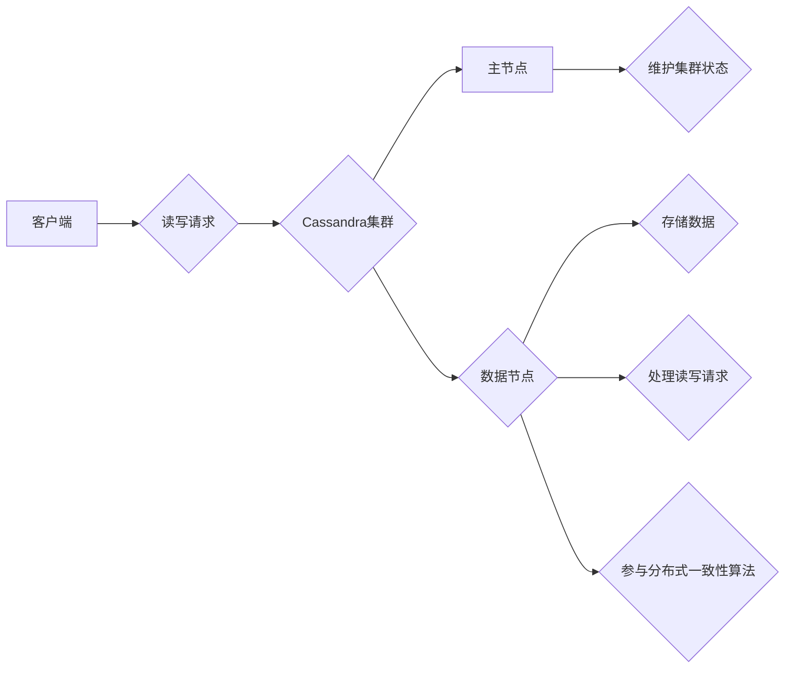

# Cassandra原理与代码实例讲解

作者：禅与计算机程序设计艺术 / Zen and the Art of Computer Programming

## 1. 背景介绍

### 1.1 问题的由来

随着互联网技术的快速发展，数据量呈爆炸式增长，对分布式数据库系统提出了更高的要求。传统的数据库系统在处理大规模分布式数据时，往往存在扩展性差、数据一致性问题。Cassandra应运而生，它是一款分布式NoSQL数据库，具有高性能、高可用性和可扩展性等特点，被广泛应用于互联网、金融、物联网等领域。

### 1.2 研究现状

Cassandra自2008年由Facebook开源以来，已经发展成为一个成熟的分布式数据库系统。随着社区的不断发展，Cassandra在性能、功能和稳定性方面都取得了显著的进步。目前，Cassandra已成为分布式数据库领域的领军者之一。

### 1.3 研究意义

Cassandra作为一种高性能、高可用性的分布式数据库，对于解决大规模分布式数据存储和查询问题具有重要意义。本文将深入探讨Cassandra的原理，并通过代码实例讲解其具体应用，帮助读者更好地理解和掌握Cassandra。

### 1.4 本文结构

本文将分为以下章节：

- 第2章：介绍Cassandra的核心概念与联系。
- 第3章：讲解Cassandra的核心算法原理和具体操作步骤。
- 第4章：分析Cassandra的数学模型和公式，并结合实例进行讲解。
- 第5章：给出Cassandra的代码实例，并进行详细解释说明。
- 第6章：探讨Cassandra的实际应用场景和未来应用展望。
- 第7章：推荐Cassandra相关的学习资源、开发工具和参考文献。
- 第8章：总结Cassandra的未来发展趋势与挑战。
- 第9章：附录，提供常见问题与解答。

## 2. 核心概念与联系

Cassandra的核心概念包括：

- **集群（Cluster）**：Cassandra由多个节点组成，每个节点都是一个独立的服务器，共同构成了一个集群。
- **数据中心（Data Center）**：一个数据中心可以包含多个集群，用于提高数据的安全性和可靠性。
- **分区（Partition）**：Cassandra使用分区机制将数据分散存储到集群中的各个节点上，提高数据读写性能。
- **主节点（Master）**：主节点负责维护集群状态，如节点的加入和离开、分区的分配等。
- **数据节点（Node）**：数据节点负责存储数据，处理读写请求，并参与分布式一致性算法。
- **副本（Replica）**：为了保证数据的高可用性，Cassandra会对数据进行复制，每个分区的数据至少有两个副本。
- **一致性模型（Consistency Model）**：Cassandra支持多种一致性模型，如强一致性、最终一致性等。
- **索引（Index）**：Cassandra支持对列族进行索引，便于查询和数据分析。

Cassandra的逻辑架构如下所示：



## 3. 核心算法原理 & 具体操作步骤

### 3.1 算法原理概述

Cassandra的核心算法原理主要包括：

- **一致性算法**：Cassandra采用Paxos算法实现一致性，保证分布式系统中数据的一致性。
- **数据复制**：Cassandra采用一致性哈希算法进行数据复制，保证数据的高可用性。
- **分区策略**：Cassandra采用动态分区策略，自动将数据分散存储到不同的节点上。
- **压缩和存储**：Cassandra支持多种数据压缩和存储格式，提高存储效率和性能。

### 3.2 算法步骤详解

**一致性算法（Paxos）**：

1. 选定提案者（Proposer）。
2. 提案者提出一个提案（Proposal）。
3. 提案者向多数节点发送提案请求（Prepare）。
4. 多数节点同意提案，并向提案者发送承诺（Accept）。
5. 提案者向多数节点发送提交请求（Commit）。
6. 多数节点提交提案。

**数据复制（一致性哈希）**：

1. 选择一个哈希函数，将数据映射到一个哈希环上。
2. 将哈希环分成多个分区（Partition）。
3. 将每个分区的数据复制到多个节点上。

**分区策略**：

1. 选择一个分区键（Partition Key）。
2. 根据分区键计算哈希值，确定数据所属的分区。
3. 将数据存储到该分区的节点上。

**压缩和存储**：

1. 选择合适的压缩算法，如Snappy、Zlib等。
2. 对数据进行压缩。
3. 将压缩后的数据存储到磁盘上。

### 3.3 算法优缺点

**优点**：

- 高性能：Cassandra采用分布式架构，可以充分利用集群的计算和存储资源，提高数据处理速度。
- 高可用性：Cassandra支持数据复制和故障转移，保证数据的安全性和可靠性。
- 可扩展性：Cassandra支持动态添加和移除节点，方便集群的扩展和升级。
- 支持多种数据模型：Cassandra支持宽列存储、CQL等数据模型，适用于多种应用场景。

**缺点**：

- 事务处理能力较弱：Cassandra不支持多行事务，对于需要严格事务保证的应用场景，可能需要考虑其他数据库系统。
- 数据迁移困难：Cassandra的数据迁移相对复杂，需要考虑数据一致性、分区键等因素。

### 3.4 算法应用领域

Cassandra适用于以下应用场景：

- 大规模数据存储：Cassandra可以存储海量数据，适用于大数据应用。
- 高并发读写：Cassandra支持高并发读写，适用于高并发场景。
- 分布式系统：Cassandra支持分布式部署，适用于分布式系统架构。
- 实时分析：Cassandra支持实时查询，适用于实时分析场景。

## 4. 数学模型和公式 & 详细讲解 & 举例说明

### 4.1 数学模型构建

Cassandra的数学模型主要包括：

- **一致性模型**：Cassandra支持多种一致性模型，如强一致性、最终一致性等。以下是强一致性的数学模型：

  $$L(\sigma) = R(\sigma)$$

  其中，$L(\sigma)$ 表示可感知到的最大延迟，$R(\sigma)$ 表示读写请求的响应时间。

- **一致性哈希**：一致性哈希的数学模型如下：

  $$H(k) \mod 2^{k}$$

  其中，$H(k)$ 表示哈希函数，$k$ 表示哈希环的长度。

### 4.2 公式推导过程

**强一致性**：

强一致性的目标是保证分布式系统中的所有节点同时看到相同的值。为此，Cassandra采用了Paxos算法，确保在所有副本上达成一致。

**一致性哈希**：

一致性哈希通过哈希函数将数据映射到一个哈希环上，将哈希环划分为多个分区，将每个分区存储到不同的节点上。一致性哈希的关键是避免分区漂移（Partition Drift）现象，即当节点加入或离开时，数据分布的剧烈变化。

### 4.3 案例分析与讲解

以下是一个简单的Cassandra数据模型示例：

```python
create keyspace example with replication = {'class' : 'SimpleStrategy', 'replication_factor' : 3};

create table example.users (
    id uuid primary key,
    name text,
    email text,
    age int
);
```

在这个示例中，我们创建了一个名为`example`的键空间，并定义了一个名为`users`的表，包含`id`、`name`、`email`和`age`四个字段。

### 4.4 常见问题解答

**Q1：Cassandra支持哪些一致性模型？**

A：Cassandra支持以下一致性模型：

- 强一致性
- 最终一致性
- 部分一致性

**Q2：Cassandra如何实现数据复制？**

A：Cassandra采用一致性哈希算法进行数据复制，将数据映射到一个哈希环上，将哈希环划分为多个分区，将每个分区存储到多个节点上。

**Q3：Cassandra如何实现分区？**

A：Cassandra采用分区键对数据进行分区，将数据分散存储到不同的节点上，提高数据读写性能。

## 5. 项目实践：代码实例和详细解释说明

### 5.1 开发环境搭建

以下是使用Python进行Cassandra开发的步骤：

1. 安装Python环境：安装Python 3.x版本，并添加到系统环境变量中。
2. 安装Cassandra驱动：使用pip安装Cassandra驱动库，如`cassandra-driver`。

```bash
pip install cassandra-driver
```

3. 安装数据库：从Cassandra官网下载并安装Cassandra数据库。

### 5.2 源代码详细实现

以下是一个使用Python操作Cassandra的示例代码：

```python
from cassandra.cluster import Cluster
from cassandra.auth import PlainTextAuthProvider

# 创建连接
auth_provider = PlainTextAuthProvider(username='cassandra', password='cassandra')
cluster = Cluster(['127.0.0.1'], auth_provider=auth_provider)
session = cluster.connect()

# 创建键空间
session.execute("""
    CREATE KEYSPACE example WITH replication = {'class' : 'SimpleStrategy', 'replication_factor' : 3};
""")

# 创建表
session.execute("""
    CREATE TABLE example.users (
        id uuid PRIMARY KEY,
        name text,
        email text,
        age int
    );
""")

# 插入数据
session.execute("""
    INSERT INTO example.users (id, name, email, age) VALUES (uuid(), 'Alice', 'alice@example.com', 30);
""")

# 查询数据
rows = session.execute("""
    SELECT * FROM example.users WHERE name = 'Alice';
""")

for row in rows:
    print(row)

# 删除数据
session.execute("""
    DELETE FROM example.users WHERE id = uuid();
""")

# 关闭连接
cluster.shutdown()
```

### 5.3 代码解读与分析

以上代码演示了如何使用Python操作Cassandra数据库：

1. 导入Cassandra驱动库。
2. 创建连接，指定数据库服务器地址和认证信息。
3. 创建键空间，并设置副本策略。
4. 创建表，并定义字段类型。
5. 插入数据，将用户信息插入到`users`表中。
6. 查询数据，根据用户名查询Alice的用户信息。
7. 删除数据，根据用户ID删除Alice的用户信息。
8. 关闭连接。

### 5.4 运行结果展示

运行以上代码，将在Cassandra数据库中创建一个名为`example`的键空间和一个名为`users`的表，并在表中插入一条Alice的用户信息。然后，根据用户名查询Alice的用户信息，并打印到控制台。最后，根据用户ID删除Alice的用户信息。

## 6. 实际应用场景

Cassandra在实际应用场景中具有广泛的应用，以下是一些典型的应用场景：

- **日志存储**：Cassandra适用于存储和分析大规模日志数据，如Web日志、网络日志等。
- **时间序列数据**：Cassandra适用于存储和分析时间序列数据，如服务器性能数据、物联网数据等。
- **电子商务**：Cassandra适用于存储电子商务平台的海量商品信息、用户数据等。
- **实时分析**：Cassandra适用于实时分析场景，如实时推荐、实时监控等。

## 7. 工具和资源推荐

### 7.1 学习资源推荐

以下是一些学习Cassandra的资源：

- 《Cassandra权威指南》
- 《Cassandra深度解析》
- Cassandra官方文档
- Cassandra官方博客
- Cassandra社区论坛

### 7.2 开发工具推荐

以下是一些Cassandra开发工具：

- DataStax DevCenter
- DBeaver
- Apache Zeppelin

### 7.3 相关论文推荐

以下是一些与Cassandra相关的论文：

- “The Google File System”
- “Bigtable: A Distributed Storage System for Structured Data”
- “The Chubby lock service for loosely-coupled distributed systems”

### 7.4 其他资源推荐

以下是一些其他与Cassandra相关的资源：

- Apache Cassandra官网
- DataStax官网
- Cassandra社区论坛
- Cassandra Meetup

## 8. 总结：未来发展趋势与挑战

### 8.1 研究成果总结

本文对Cassandra的原理和应用进行了全面介绍，帮助读者深入了解Cassandra的核心概念、算法原理、应用场景等。通过代码实例，展示了如何使用Python操作Cassandra数据库。

### 8.2 未来发展趋势

Cassandra在未来将呈现以下发展趋势：

- **性能优化**：持续提升Cassandra的性能，包括读写性能、存储性能、网络性能等。
- **功能增强**：扩展Cassandra的功能，如支持多租户、支持事务等。
- **生态拓展**：丰富Cassandra的生态系统，包括工具、插件、教程等。

### 8.3 面临的挑战

Cassandra在未来将面临以下挑战：

- **性能瓶颈**：随着数据规模的不断扩大，Cassandra的性能瓶颈可能逐渐显现，需要持续优化。
- **功能限制**：Cassandra在某些功能上可能存在限制，如不支持多行事务等。
- **生态系统建设**：需要持续完善Cassandra的生态系统，提升用户体验。

### 8.4 研究展望

Cassandra作为一种高性能、高可用的分布式数据库，在分布式存储领域具有广阔的应用前景。未来，Cassandra将不断优化性能、增强功能，成为更多企业解决分布式存储挑战的首选方案。

## 9. 附录：常见问题与解答

**Q1：Cassandra与MongoDB的区别是什么？**

A：Cassandra和MongoDB都是NoSQL数据库，但它们在架构、功能和应用场景等方面存在一些差异：

- **架构**：Cassandra是分布式数据库，MongoDB是文档数据库。
- **功能**：Cassandra支持强一致性，MongoDB支持最终一致性。
- **应用场景**：Cassandra适用于大规模数据存储、高并发读写场景，MongoDB适用于中小规模数据存储、灵活的数据模型。

**Q2：Cassandra如何保证数据一致性？**

A：Cassandra采用Paxos算法保证数据一致性，确保在所有副本上达成一致。

**Q3：Cassandra如何实现数据分片？**

A：Cassandra采用一致性哈希算法进行数据分片，将数据分散存储到不同的节点上。

**Q4：Cassandra如何处理节点故障？**

A：Cassandra支持节点自动故障转移，当节点故障时，其他节点会接管其数据和工作负载。

**Q5：Cassandra如何进行数据备份和恢复？**

A：Cassandra支持数据备份和恢复，可以使用Cassandra自带的工具进行备份和恢复。

作者：禅与计算机程序设计艺术 / Zen and the Art of Computer Programming