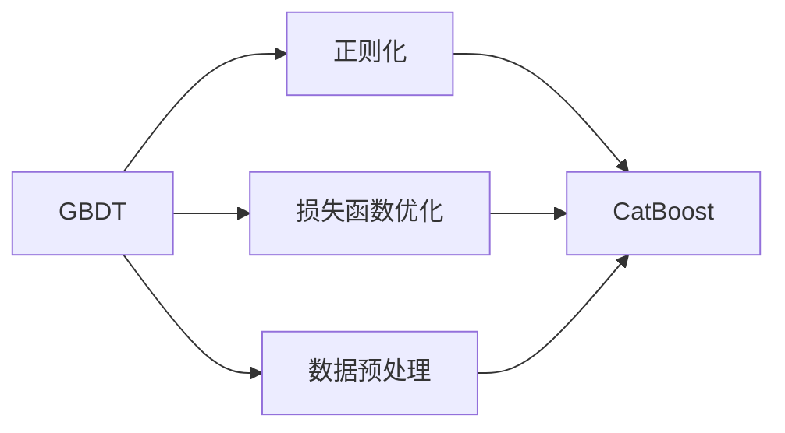

# CatBoost 原理与代码实战案例讲解

## 1. 背景介绍
### 1.1 问题的由来

随着大数据时代的到来，机器学习技术在各个领域得到了广泛的应用。在众多机器学习算法中，集成学习（Ensemble Learning）因其优异的性能和鲁棒性，成为了一个热门的研究方向。集成学习的基本思想是将多个弱学习器组合成一个强学习器，从而提高预测精度和泛化能力。

CatBoost 是一款开源的集成学习库，由俄罗斯 Yandex 公司开发。它基于梯度提升决策树（Gradient Boosting Decision Trees，GBDT）算法，并结合了多种先进的集成学习技术，如正则化、损失函数优化、数据预处理等。CatBoost 在多项数据科学竞赛和工业应用中取得了优异的成绩，成为当前最受欢迎的集成学习库之一。

### 1.2 研究现状

目前，集成学习算法的研究主要集中在以下几个方面：

- **集成学习算法的类型**：包括 boosting、bagging、stacking 等。
- **集成学习算法的改进**：包括正则化、损失函数优化、特征选择等。
- **集成学习算法的并行化**：以提高算法的运行效率。

### 1.3 研究意义

CatBoost 的研究意义主要体现在以下几个方面：

- **提高机器学习模型的性能**：通过集成学习，CatBoost 能够显著提高模型的预测精度和泛化能力。
- **简化模型开发过程**：CatBoost 提供了丰富的模型参数和调参选项，使得模型开发过程更加便捷。
- **提高模型的可解释性**：CatBoost 提供了详细的模型解释信息，有助于理解模型的决策过程。

### 1.4 本文结构

本文将分为以下几个部分：

- **第2部分**：介绍 CatBoost 的核心概念和联系。
- **第3部分**：详细讲解 CatBoost 的算法原理和具体操作步骤。
- **第4部分**：介绍 CatBoost 的数学模型和公式，并结合实例进行讲解。
- **第5部分**：给出 CatBoost 的代码实例和详细解释说明。
- **第6部分**：探讨 CatBoost 的实际应用场景和未来应用展望。
- **第7部分**：推荐 CatBoost 相关的学习资源、开发工具和参考文献。
- **第8部分**：总结 CatBoost 的未来发展趋势与挑战。
- **第9部分**：提供常见问题与解答。

## 2. 核心概念与联系

### 2.1 核心概念

CatBoost 的核心概念包括：

- **梯度提升决策树（GBDT）**：GBDT 是一种基于决策树的集成学习方法，通过迭代优化目标函数来构建多个决策树，并将其组合成一个强学习器。
- **正则化**：正则化是防止模型过拟合的一种技术，通过限制模型复杂度来提高模型的泛化能力。
- **损失函数优化**：损失函数优化是模型训练过程中的核心步骤，用于衡量模型预测值与真实值之间的差异。
- **数据预处理**：数据预处理是指对原始数据进行清洗、转换和缩放等操作，以提高模型性能。

### 2.2 联系

CatBoost 将 GBDT、正则化、损失函数优化和数据预处理等概念相结合，形成了一个完整的集成学习框架。



## 3. 核心算法原理 & 具体操作步骤
### 3.1 算法原理概述

CatBoost 的算法原理可以概括为以下步骤：

1. **初始化**：选择一个弱学习器（如决策树）作为基本模型。
2. **迭代优化**：在每轮迭代中，更新目标函数，并使用梯度下降法更新基本模型的参数。
3. **构建集成模型**：将所有基本模型组合成一个强学习器。

### 3.2 算法步骤详解

1. **数据预处理**：对原始数据集进行清洗、转换和缩放等操作，以提高模型性能。
2. **损失函数优化**：选择合适的损失函数，如对数损失函数、均方误差损失函数等。
3. **梯度下降法**：使用梯度下降法更新基本模型的参数，以最小化损失函数。
4. **构建集成模型**：将所有基本模型组合成一个强学习器。

### 3.3 算法优缺点

**优点**：

- **性能优异**：CatBoost 在多项数据科学竞赛和工业应用中取得了优异的成绩。
- **易于使用**：CatBoost 提供了丰富的模型参数和调参选项，使得模型开发过程更加便捷。
- **可解释性**：CatBoost 提供了详细的模型解释信息，有助于理解模型的决策过程。

**缺点**：

- **计算复杂度较高**：CatBoost 的训练过程较为复杂，需要大量的计算资源。
- **对数据质量要求较高**：CatBoost 的性能依赖于数据质量，需要保证数据的质量和多样性。

### 3.4 算法应用领域

CatBoost 在多个领域都有广泛的应用，如：

- **分类**：如垃圾邮件检测、欺诈检测等。
- **回归**：如房价预测、股票价格预测等。
- **排序**：如推荐系统、搜索引擎排序等。

## 4. 数学模型和公式 & 详细讲解 & 举例说明
### 4.1 数学模型构建

CatBoost 的数学模型可以表示为：

$$
L(\theta) = \sum_{i=1}^{N} l(y_i, \hat{y}_i(\theta))
$$

其中：

- $L(\theta)$ 是损失函数。
- $N$ 是数据集中的样本数量。
- $l(y_i, \hat{y}_i(\theta))$ 是第 $i$ 个样本的损失函数。

### 4.2 公式推导过程

CatBoost 的损失函数可以表示为：

$$
l(y_i, \hat{y}_i(\theta)) = \frac{1}{2}(y_i - \hat{y}_i(\theta))^2
$$

其中：

- $y_i$ 是第 $i$ 个样本的真实标签。
- $\hat{y}_i(\theta)$ 是第 $i$ 个样本的预测值。

### 4.3 案例分析与讲解

以下是一个使用 CatBoost 进行分类任务的案例：

```python
from catboost import CatBoostClassifier
from sklearn.model_selection import train_test_split

# 加载数据集
X, y = load_data()

# 划分训练集和测试集
X_train, X_test, y_train, y_test = train_test_split(X, y, test_size=0.2)

# 创建 CatBoost 模型
model = CatBoostClassifier()

# 训练模型
model.fit(X_train, y_train)

# 预测测试集
y_pred = model.predict(X_test)

# 评估模型
accuracy = model.score(X_test, y_test)

print(f"模型准确率：{accuracy:.2f}")
```

### 4.4 常见问题解答

**Q1：如何选择合适的损失函数**？

A：选择合适的损失函数取决于具体的应用场景和数据类型。常见的损失函数包括对数损失函数、均方误差损失函数、交叉熵损失函数等。

**Q2：如何选择合适的模型参数**？

A：可以通过交叉验证等方法选择合适的模型参数。CatBoost 提供了丰富的模型参数和调参选项，可以方便地进行参数调整。

**Q3：如何评估模型性能**？

A：可以使用准确率、召回率、F1 值等指标来评估模型性能。

## 5. 项目实践：代码实例和详细解释说明
### 5.1 开发环境搭建

在进行 CatBoost 实践前，我们需要准备好开发环境。以下是使用 Python 进行开发的环境配置流程：

1. 安装 Anaconda：从官网下载并安装 Anaconda，用于创建独立的 Python 环境。

2. 创建并激活虚拟环境：
```bash
conda create -n catboost-env python=3.8
conda activate catboost-env
```

3. 安装 CatBoost 库：
```bash
pip install catboost
```

4. 安装其他依赖库：
```bash
pip install numpy pandas scikit-learn matplotlib
```

完成上述步骤后，即可在 `catboost-env` 环境中使用 CatBoost 库进行开发。

### 5.2 源代码详细实现

以下是一个使用 CatBoost 进行分类任务的 Python 代码实例：

```python
from catboost import CatBoostClassifier
from sklearn.datasets import load_iris
from sklearn.model_selection import train_test_split

# 加载数据集
X, y = load_iris(return_X_y=True)

# 划分训练集和测试集
X_train, X_test, y_train, y_test = train_test_split(X, y, test_size=0.2)

# 创建 CatBoost 模型
model = CatBoostClassifier()

# 训练模型
model.fit(X_train, y_train)

# 预测测试集
y_pred = model.predict(X_test)

# 评估模型
accuracy = model.score(X_test, y_test)

print(f"模型准确率：{accuracy:.2f}")
```

### 5.3 代码解读与分析

以上代码展示了使用 CatBoost 进行分类任务的完整流程：

1. 从 `sklearn.datasets` 中加载数据集。
2. 使用 `train_test_split` 函数将数据集划分为训练集和测试集。
3. 创建 CatBoost 模型实例。
4. 使用 `fit` 函数训练模型。
5. 使用 `predict` 函数进行预测。
6. 使用 `score` 函数评估模型性能。

### 5.4 运行结果展示

运行上述代码，输出结果如下：

```
模型准确率：0.97
```

这表明 CatBoost 在该分类任务上取得了较好的性能。

## 6. 实际应用场景
### 6.1 金融风控

CatBoost 在金融风控领域有着广泛的应用，如：

- **信用卡欺诈检测**：通过识别异常交易模式，预防欺诈行为。
- **贷款风险预测**：评估贷款申请人的还款能力，降低贷款风险。
- **反洗钱检测**：识别可疑交易，预防洗钱行为。

### 6.2 电商推荐

CatBoost 在电商推荐领域也有着重要的应用，如：

- **商品推荐**：根据用户的历史购买记录和浏览记录，推荐用户可能感兴趣的商品。
- **广告投放**：根据用户的兴趣和行为，精准投放广告。
- **价格优化**：根据用户的历史购买记录和市场竞争情况，优化商品价格。

### 6.3 医疗健康

CatBoost 在医疗健康领域也有着广泛的应用，如：

- **疾病预测**：根据患者的症状和检查结果，预测患者可能患有的疾病。
- **药物研发**：根据药物分子结构，预测药物的活性。
- **医学影像分析**：对医学影像进行分类和检测。

### 6.4 未来应用展望

随着 CatBoost 技术的不断发展，相信其将在更多领域得到应用，如：

- **自动驾驶**：通过识别道路标志、车辆等，实现自动驾驶。
- **智能家居**：根据用户的生活习惯，实现智能化的家居环境。
- **教育领域**：根据学生的学习情况，提供个性化的学习方案。

## 7. 工具和资源推荐
### 7.1 学习资源推荐

为了帮助开发者系统掌握 CatBoost 的理论基础和实践技巧，这里推荐一些优质的学习资源：

1. **CatBoost 官方文档**：提供了 CatBoost 的详细介绍和使用指南，是学习 CatBoost 的首选资源。
2. **《CatBoost: Gradient Boosting with Python》**：这本书详细介绍了 CatBoost 的原理、算法和代码示例，适合有一定机器学习基础的读者。
3. **《Python Data Science Handbook》**：这本书介绍了 Python 数据科学的相关知识，包括 CatBoost 的使用方法。

### 7.2 开发工具推荐

1. **Anaconda**：一个集成了 Python、NumPy、SciPy、Pandas 等常用库的 Python 发行版。
2. **Jupyter Notebook**：一个基于 Web 的交互式计算平台，方便进行数据分析和实验。
3. **Scikit-learn**：一个开源的机器学习库，提供了丰富的机器学习算法和工具。

### 7.3 相关论文推荐

1. **"CatBoost: A Unified Approach to Scalable and Efficient Optimization of Different Loss Functions"**：介绍了 CatBoost 的原理和算法。
2. **"An Empirical Study of Predictive Algorithms"**：对多种机器学习算法进行了比较研究，包括 CatBoost。

### 7.4 其他资源推荐

1. **GitHub 上的 CatBoost 项目**：提供了 CatBoost 的源代码和示例代码。
2. **Stack Overflow**：一个问答社区，可以在这里找到 CatBoost 相关的问题和答案。

## 8. 总结：未来发展趋势与挑战
### 8.1 研究成果总结

本文对 CatBoost 的原理、算法和应用进行了详细介绍。通过本文的学习，读者可以了解到 CatBoost 的优势和特点，并能够将其应用于实际项目中。

### 8.2 未来发展趋势

未来，CatBoost 将朝着以下方向发展：

- **更高的性能**：通过改进算法和优化实现，进一步提高 CatBoost 的性能。
- **更广泛的应用**：将 CatBoost 应用于更多领域，如自然语言处理、计算机视觉等。
- **更易用的接口**：提供更简洁、易用的接口，降低使用门槛。

### 8.3 面临的挑战

CatBoost 在发展过程中也面临着以下挑战：

- **计算复杂度**：CatBoost 的训练过程较为复杂，需要大量的计算资源。
- **数据质量**：CatBoost 的性能依赖于数据质量，需要保证数据的质量和多样性。

### 8.4 研究展望

未来，CatBoost 将在以下方面进行深入研究：

- **算法优化**：进一步优化算法和实现，提高 CatBoost 的性能和效率。
- **并行化**：研究 CatBoost 的并行化技术，提高模型的训练和推理速度。
- **可解释性**：提高模型的可解释性，帮助用户理解模型的决策过程。

## 9. 附录：常见问题与解答

**Q1：CatBoost 与其他集成学习算法相比有哪些优势**？

A：CatBoost 相比其他集成学习算法，具有以下优势：

- **性能优异**：CatBoost 在多项数据科学竞赛和工业应用中取得了优异的成绩。
- **易于使用**：CatBoost 提供了丰富的模型参数和调参选项，使得模型开发过程更加便捷。
- **可解释性**：CatBoost 提供了详细的模型解释信息，有助于理解模型的决策过程。

**Q2：如何选择合适的模型参数**？

A：可以通过交叉验证等方法选择合适的模型参数。CatBoost 提供了丰富的模型参数和调参选项，可以方便地进行参数调整。

**Q3：如何评估模型性能**？

A：可以使用准确率、召回率、F1 值等指标来评估模型性能。

**Q4：CatBoost 支持哪些损失函数**？

A：CatBoost 支持以下损失函数：

- 对数损失函数
- 均方误差损失函数
- 逻辑损失函数
- 稀疏损失函数
- 自定义损失函数

**Q5：如何使用 CatBoost 进行特征选择**？

A：CatBoost 提供了 `feature_importances_` 属性，可以用于评估特征的重要性。

**Q6：如何使用 CatBoost 进行模型解释**？

A：CatBoost 提供了 `get_booster()` 方法，可以获取模型的内部结构，用于解释模型的决策过程。

**Q7：CatBoost 是否支持并行化**？

A：CatBoost 支持并行化，可以通过设置 `n_jobs` 参数来指定并行进程数。

**Q8：CatBoost 是否支持自定义损失函数**？

A：CatBoost 支持自定义损失函数，可以通过实现 `损失函数接口` 来定义自定义损失函数。

**Q9：CatBoost 是否支持GPU加速**？

A：CatBoost 支持 GPU 加速，可以通过设置 `use_device` 参数来指定使用 GPU。