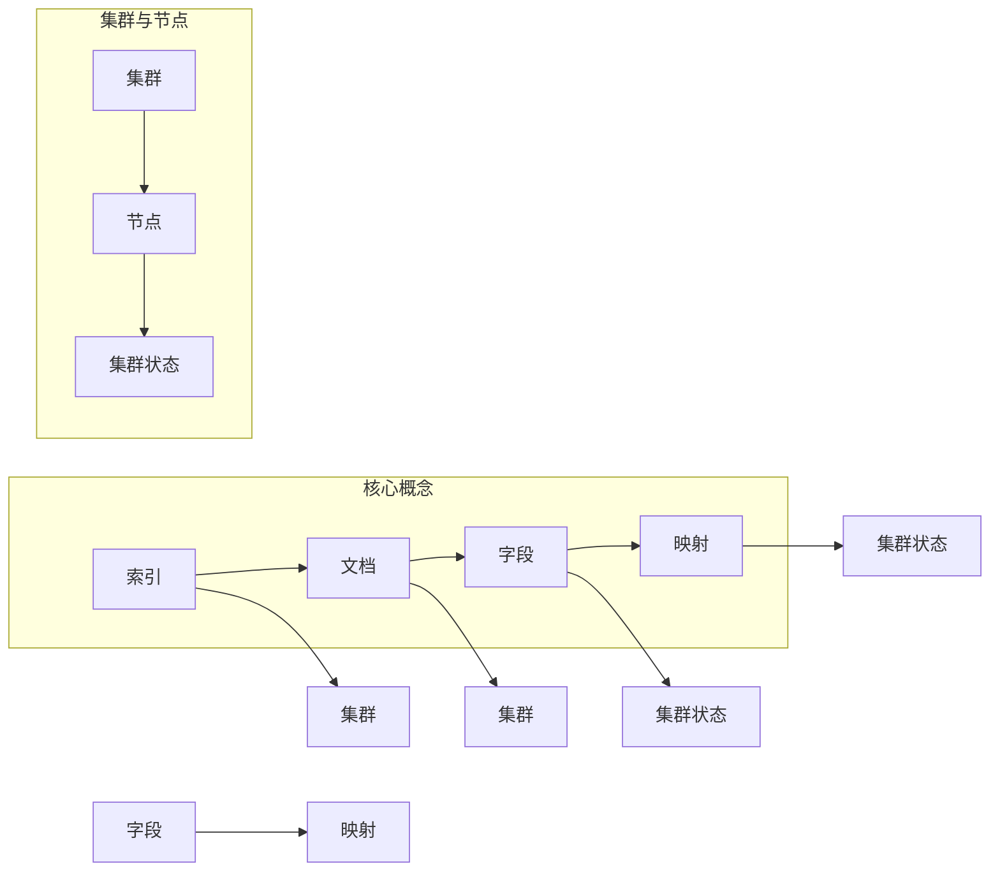

# ElasticSearch 原理与代码实例讲解

作者：禅与计算机程序设计艺术 / Zen and the Art of Computer Programming

## 1. 背景介绍
### 1.1 问题的由来

随着互联网的飞速发展，数据量呈爆炸式增长，如何高效地存储、检索和分析海量数据成为了企业面临的巨大挑战。传统的数据库技术，如关系型数据库，在处理大规模数据时往往存在性能瓶颈。为了解决这一问题，Elasticsearch应运而生。它是一款基于Lucene搜索引擎的开源分布式全文搜索引擎，能够对海量数据进行高效存储、检索和分析。

### 1.2 研究现状

Elasticsearch自2004年开源以来，已经发展成为全球最受欢迎的搜索引擎之一。它拥有庞大的社区和丰富的生态圈，支持多种编程语言进行开发，广泛应用于电商、金融、医疗、教育等多个领域。

### 1.3 研究意义

Elasticsearch具有以下重要意义：

1. 高效的全文搜索：Elasticsearch能够对海量文本数据进行快速检索，支持模糊匹配、高亮显示、分页等操作，极大地提高了数据检索效率。
2. 分布式架构：Elasticsearch采用分布式架构，支持水平扩展，能够轻松应对海量数据和高并发访问。
3. 丰富的功能：Elasticsearch不仅支持全文搜索，还支持数据分析、实时监控、数据可视化等功能，满足多样化的业务需求。
4. 易于使用：Elasticsearch提供RESTful API，支持多种编程语言进行开发，用户可以轻松上手。

### 1.4 本文结构

本文将围绕Elasticsearch展开，详细介绍其原理、架构、操作步骤、代码实例以及实际应用场景。具体内容如下：

- 第2章：介绍Elasticsearch的核心概念与联系。
- 第3章：阐述Elasticsearch的核心算法原理和具体操作步骤。
- 第4章：讲解Elasticsearch的数学模型和公式，并结合实例进行分析。
- 第5章：通过代码实例和详细解释说明Elasticsearch的实践操作。
- 第6章：探讨Elasticsearch的实际应用场景和未来发展趋势。
- 第7章：推荐Elasticsearch相关的学习资源、开发工具和参考文献。
- 第8章：总结Elasticsearch的未来发展趋势和挑战。
- 第9章：提供常见问题与解答。

## 2. 核心概念与联系

### 2.1 核心概念

以下是Elasticsearch的关键概念：

1. 索引(Index)：索引是存储数据的容器，类似于关系数据库中的表。
2. 文档(Document)：文档是存储在索引中的数据记录，类似于关系数据库中的行。
3. 字段(Field)：字段是文档中的属性，类似于关系数据库中的列。
4. 映射(Mapping)：映射定义了索引中字段的类型和属性。
5. 集群(Cluster)：集群是多个节点组成的分布式系统，负责存储和检索数据。
6. 节点(Node)：节点是集群中的单个计算单元，负责存储和检索数据。
7. 集群状态(Cluster State)：集群状态记录了集群的元数据信息，如节点信息、索引信息等。

### 2.2 关联关系

以下是Elasticsearch核心概念的关联关系：



## 3. 核心算法原理 & 具体操作步骤
### 3.1 算法原理概述

Elasticsearch基于Lucene搜索引擎，其核心算法原理如下：

1. 索引构建：Elasticsearch将文档转换为倒排索引，将文档内容映射到对应的词元，并记录词元对应的文档列表。
2. 检索：根据查询条件，Elasticsearch在倒排索引中检索词元，获取包含该词元的文档列表，并计算文档的相关性分数。
3. 排序和分页：根据文档的相关性分数对文档进行排序，并返回指定数量的文档。
4. 分析：Elasticsearch支持多种分析器，如标准分析器、中文分析器等，用于处理不同语言的文本数据。

### 3.2 算法步骤详解

以下是Elasticsearch索引和检索的基本步骤：

#### 索引步骤

1. 创建索引：使用PUT请求创建一个新的索引，并定义索引的映射。
2. 添加文档：使用POST请求将文档添加到索引中，并指定文档的ID。
3. 更新文档：使用POST请求更新文档的某些字段。
4. 删除文档：使用DELETE请求删除指定的文档。

#### 检索步骤

1. 构建查询：根据需要构建查询语句，包括查询类型、查询条件和排序规则。
2. 发送查询：使用GET请求发送查询语句，获取查询结果。
3. 处理查询结果：解析查询结果，提取所需信息。

### 3.3 算法优缺点

#### 优点

1. 高效的全文搜索：Elasticsearch基于Lucene搜索引擎，具有高效的全文搜索能力。
2. 分布式架构：Elasticsearch采用分布式架构，支持水平扩展，能够应对海量数据和高并发访问。
3. 丰富的功能：Elasticsearch支持多种功能，如数据分析、实时监控、数据可视化等。
4. 易于使用：Elasticsearch提供RESTful API，支持多种编程语言进行开发。

#### 缺点

1. 学习成本：Elasticsearch的架构和功能相对复杂，学习成本较高。
2. 性能瓶颈：在处理大数据量时，Elasticsearch的性能可能会受到内存和磁盘I/O的限制。
3. 扩展性有限：Elasticsearch的集群规模有一定限制，无法无限扩展。

### 3.4 算法应用领域

Elasticsearch在以下领域具有广泛的应用：

1. 搜索引擎：构建高效的全文搜索引擎，如电商搜索、企业搜索等。
2. 数据分析：对海量数据进行实时分析和挖掘，如日志分析、用户行为分析等。
3. 实时监控：对系统、网络等进行实时监控，及时发现异常情况。
4. 数据可视化：将数据分析结果以图表的形式展示，便于用户理解。

## 4. 数学模型和公式 & 详细讲解 & 举例说明
### 4.1 数学模型构建

Elasticsearch的数学模型主要包括以下几个方面：

1. 向量空间模型：将文本数据转换为向量表示，用于计算文档相似度。
2. 余弦相似度：计算文档之间的相似度。
3. BM25：一种基于概率模型的检索算法。

### 4.2 公式推导过程

以下以向量空间模型为例，介绍其公式推导过程：

1. 将文本数据转换为向量表示：

$$
\vec{d_i} = \sum_{j=1}^n w_j \times t_j^i
$$

其中，$w_j$ 表示第 $j$ 个词元的权重，$t_j^i$ 表示第 $i$ 个文档中第 $j$ 个词元的词频。

2. 计算文档之间的相似度：

$$
\text{similarity}(\vec{d_i}, \vec{d_j}) = \frac{\vec{d_i} \cdot \vec{d_j}}{\|\vec{d_i}\| \times \|\vec{d_j}\|}
$$

其中，$\|\vec{d_i}\|$ 和 $\|\vec{d_j}\|$ 分别表示向量 $\vec{d_i}$ 和 $\vec{d_j}$ 的模。

3. BM25算法公式：

$$
\text{BM25}(f_j, N, k_1, b, df) = \frac{k_1 + 1}{k_1 + (1 - b) \times \frac{df}{f_j + 0.5 \times df}} + \frac{1}{\alpha}
$$

其中，$f_j$ 表示词元 $j$ 在文档 $d$ 中的词频，$N$ 表示文档总数，$k_1$、$b$、$\alpha$ 为超参数。

### 4.3 案例分析与讲解

以下以一个简单的Elasticsearch查询案例进行分析：

1. 创建索引：

```json
PUT /my_index
{
  "mappings": {
    "properties": {
      "title": {
        "type": "text"
      },
      "content": {
        "type": "text"
      }
    }
  }
}
```

2. 添加文档：

```json
PUT /my_index/_doc/1
{
  "title": "Elasticsearch 简介",
  "content": "Elasticsearch 是一款基于 Lucene 的开源分布式全文搜索引擎。"
}

PUT /my_index/_doc/2
{
  "title": "Elasticsearch 优势",
  "content": "Elasticsearch 具有高效、可扩展、易于使用等优势。"
}
```

3. 查询文档：

```json
GET /my_index/_search
{
  "query": {
    "match": {
      "content": "Elasticsearch"
    }
  }
}
```

查询结果：

```json
{
  "hits": {
    "total": 2,
    "hits": [
      {
        "_index": "my_index",
        "_type": "_doc",
        "_id": "1",
        "_score": 0.26140354,
        "_source": {
          "title": "Elasticsearch 简介",
          "content": "Elasticsearch 是一款基于 Lucene 的开源分布式全文搜索引擎。"
        }
      },
      {
        "_index": "my_index",
        "_type": "_doc",
        "_id": "2",
        "_score": 0.26140354,
        "_source": {
          "title": "Elasticsearch 优势",
          "content": "Elasticsearch 具有高效、可扩展、易于使用等优势。"
        }
      }
    ]
  }
}
```

可以看出，Elasticsearch能够根据查询条件在索引中检索文档，并返回匹配的文档列表和评分。

### 4.4 常见问题解答

**Q1：如何优化Elasticsearch的性能？**

A：优化Elasticsearch性能可以从以下几个方面入手：

1. 选择合适的索引策略：合理配置索引的映射和分片数量，以适应数据量和查询需求。
2. 使用合适的分析器：根据数据类型选择合适的分析器，提高搜索效率。
3. 使用合适的字段数据类型：合理选择字段的类型，提高搜索速度。
4. 使用缓存：开启查询缓存、字段缓存等，减少数据库访问。

**Q2：如何实现Elasticsearch的高可用性？**

A：实现Elasticsearch高可用性可以通过以下方法：

1. 集群模式：使用多个节点组成集群，实现数据的冗余和故障转移。
2. 自动扩展：根据数据量自动添加节点，实现弹性伸缩。
3. 故障转移：当主节点故障时，自动选举新的主节点，保证集群的正常运行。

## 5. 项目实践：代码实例和详细解释说明
### 5.1 开发环境搭建

以下是使用Python开发Elasticsearch项目的环境搭建步骤：

1. 安装Elasticsearch：从Elasticsearch官网下载并安装Elasticsearch。

2. 安装elasticsearch-py：使用pip安装elasticsearch-py库，用于连接Elasticsearch。

```bash
pip install elasticsearch
```

### 5.2 源代码详细实现

以下是一个简单的Elasticsearch项目实例：

```python
from elasticsearch import Elasticsearch

# 创建Elasticsearch客户端实例
es = Elasticsearch()

# 创建索引
if not es.indices.exists(index='my_index'):
    es.indices.create(index='my_index', body={
        "mappings": {
            "properties": {
                "title": {
                    "type": "text"
                },
                "content": {
                    "type": "text"
                }
            }
        }
    })

# 添加文档
doc = {
    "title": "Elasticsearch 简介",
    "content": "Elasticsearch 是一款基于 Lucene 的开源分布式全文搜索引擎。"
}
es.index(index='my_index', id=1, body=doc)

# 查询文档
query = {
    "query": {
        "match": {
            "content": "Elasticsearch"
        }
    }
}
result = es.search(index='my_index', body=query)
print(result)
```

### 5.3 代码解读与分析

以上代码首先创建了一个Elasticsearch客户端实例，然后创建了一个名为`my_index`的索引，并定义了索引的映射。接着，添加了一个包含标题和内容的文档，并使用查询语句检索包含关键词`Elasticsearch`的文档。

### 5.4 运行结果展示

运行以上代码后，Elasticsearch将创建索引`my_index`，并添加一个文档。查询结果将显示包含关键词`Elasticsearch`的文档列表。

## 6. 实际应用场景
### 6.1 搜索引擎

Elasticsearch是最常用的搜索引擎之一，被广泛应用于各种搜索引擎的构建，如电商搜索、企业搜索、社区搜索等。

### 6.2 数据分析

Elasticsearch可以用于对海量数据进行实时分析和挖掘，如日志分析、用户行为分析、市场分析等。

### 6.3 实时监控

Elasticsearch可以用于对系统、网络等进行实时监控，及时发现异常情况，如服务器负载过高、网络带宽不足等。

### 6.4 数据可视化

Elasticsearch支持多种可视化工具，如Kibana、Grafana等，可以将数据分析结果以图表的形式展示，便于用户理解。

## 7. 工具和资源推荐
### 7.1 学习资源推荐

以下是一些学习Elasticsearch的推荐资源：

1. 《Elasticsearch：The Definitive Guide》
2. Elasticsearch官方文档：https://www.elastic.co/guide/en/elasticsearch/reference/current/index.html
3. Elasticsearch中文社区：http://elasticsearch.cn/
4. Elasticsearch入门教程：https://www.cnblogs.com/kangxuehui/p/9317957.html

### 7.2 开发工具推荐

以下是一些Elasticsearch开发工具：

1. Kibana：Elasticsearch的可视化平台，用于数据分析、可视化等。
2. Logstash：Elasticsearch的数据采集工具，用于从各种数据源采集数据。
3. Beats：Elasticsearch的数据收集工具，用于收集系统、日志等数据。
4. Elasticsearch-head：Elasticsearch的Web管理工具，用于查看和管理Elasticsearch集群。

### 7.3 相关论文推荐

以下是一些关于Elasticsearch的相关论文：

1. "Elasticsearch: The Definitive Guide" by Ellen Kuehn
2. "Elasticsearch: The Definitive Guide, Second Edition" by Ramin Nakisa
3. "Elasticsearch: The Definitive Guide, Third Edition" by Michael Nitschinger and Ramin Nakisa

### 7.4 其他资源推荐

以下是一些其他Elasticsearch相关资源：

1. Elasticsearch GitHub官网：https://github.com/elastic/elasticsearch
2. Elasticsearch博客：https://www.elastic.co/cn/blog
3. Elasticsearch论坛：https://discuss.elastic.co/

## 8. 总结：未来发展趋势与挑战
### 8.1 研究成果总结

本文全面介绍了Elasticsearch的原理、架构、操作步骤、代码实例以及实际应用场景。通过本文的学习，读者可以了解Elasticsearch的核心概念、算法原理、使用方法以及在实际项目中的应用。

### 8.2 未来发展趋势

以下是Elasticsearch的未来发展趋势：

1. 人工智能与Elasticsearch的融合：Elasticsearch将与其他人工智能技术（如机器学习、自然语言处理等）深度融合，提供更智能的数据分析、检索和可视化功能。
2. 云原生Elasticsearch：随着云计算的快速发展，云原生Elasticsearch将越来越受欢迎，为用户提供更便捷、高效的服务。
3. 纵向扩展与弹性伸缩：Elasticsearch将支持更加灵活的纵向扩展和弹性伸缩，更好地应对数据量和访问量的增长。
4. 开源与商业产品的融合：Elasticsearch将继续保持开源精神，同时不断完善商业产品，满足更多用户的需求。

### 8.3 面临的挑战

以下是Elasticsearch面临的挑战：

1. 内存和磁盘I/O瓶颈：在处理大规模数据时，Elasticsearch可能会遇到内存和磁盘I/O瓶颈。
2. 安全性问题：随着Elasticsearch的应用越来越广泛，安全问题逐渐凸显，需要加强对数据安全和隐私保护的研究。
3. 可解释性不足：Elasticsearch的算法原理较为复杂，可解释性不足，需要进一步研究和改进。

### 8.4 研究展望

未来，Elasticsearch将在以下方面进行深入研究：

1. 优化算法：针对内存和磁盘I/O瓶颈，优化算法，提高Elasticsearch的处理能力。
2. 安全性研究：加强数据安全和隐私保护，提高Elasticsearch的安全性。
3. 可解释性研究：提高Elasticsearch的可解释性，便于用户理解和使用。
4. 人工智能与Elasticsearch的融合：将人工智能技术融入Elasticsearch，实现更智能的数据分析、检索和可视化功能。

相信在未来的发展中，Elasticsearch将继续保持其在搜索引擎领域的领先地位，为用户带来更加高效、便捷的数据处理和分析解决方案。

## 9. 附录：常见问题与解答

**Q1：Elasticsearch与关系型数据库的区别是什么？**

A：Elasticsearch和关系型数据库在以下方面存在区别：

1. 数据类型：Elasticsearch支持多种数据类型，如文本、数字、日期等；关系型数据库主要支持关系型数据。

2. 查询语言：Elasticsearch使用JSON格式的查询语言，支持全文搜索、聚合分析等功能；关系型数据库使用SQL语言，主要用于数据操作和查询。

3. 扩展性：Elasticsearch采用分布式架构，支持水平扩展；关系型数据库采用垂直扩展，扩展性有限。

**Q2：如何提高Elasticsearch的搜索性能？**

A：提高Elasticsearch搜索性能可以从以下几个方面入手：

1. 选择合适的索引策略：合理配置索引的映射和分片数量，以适应数据量和查询需求。

2. 使用合适的分析器：根据数据类型选择合适的分析器，提高搜索效率。

3. 使用合适的字段数据类型：合理选择字段的类型，提高搜索速度。

4. 使用缓存：开启查询缓存、字段缓存等，减少数据库访问。

**Q3：如何实现Elasticsearch的高可用性？**

A：实现Elasticsearch高可用性可以通过以下方法：

1. 集群模式：使用多个节点组成集群，实现数据的冗余和故障转移。

2. 自动扩展：根据数据量自动添加节点，实现弹性伸缩。

3. 故障转移：当主节点故障时，自动选举新的主节点，保证集群的正常运行。

**Q4：Elasticsearch的优缺点是什么？**

A：Elasticsearch的优点包括：

1. 高效的全文搜索
2. 分布式架构
3. 丰富的功能
4. 易于使用

Elasticsearch的缺点包括：

1. 学习成本
2. 性能瓶颈
3. 扩展性有限

**Q5：如何使用Elasticsearch进行数据分析？**

A：使用Elasticsearch进行数据分析可以按照以下步骤进行：

1. 将数据导入Elasticsearch索引。

2. 使用Kibana等可视化工具对数据进行可视化分析。

3. 使用Elasticsearch的聚合功能对数据进行统计分析。

4. 将分析结果导出或分享。

---

作者：禅与计算机程序设计艺术 / Zen and the Art of Computer Programming