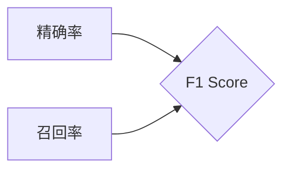

# F1 Score原理与代码实例讲解

作者：禅与计算机程序设计艺术 / Zen and the Art of Computer Programming

## 1. 背景介绍
### 1.1 问题的由来

在机器学习领域，评估模型性能是至关重要的步骤。F1 Score作为一种常用的性能度量指标，尤其在自然语言处理（NLP）领域应用广泛。F1 Score综合考虑了精确率（Precision）和召回率（Recall）两个指标，对于评估分类模型的性能具有独特的优势。

### 1.2 研究现状

F1 Score自提出以来，已经被广泛应用于各种分类任务中。随着深度学习技术的快速发展，F1 Score在NLP、图像识别、医疗诊断等领域的应用越来越广泛。许多研究致力于探索F1 Score的改进方法和变种，以提高其在不同任务中的评估效果。

### 1.3 研究意义

F1 Score作为分类模型性能评估的常用指标，对于以下方面具有重要意义：

1. **全面评估模型性能**：F1 Score综合考虑精确率和召回率，避免了单一指标可能带来的片面性。
2. **提高模型可解释性**：F1 Score的计算过程简单明了，有助于理解模型在各个类别上的表现。
3. **优化模型参数**：F1 Score可以作为模型参数优化的依据，帮助找到最佳的模型配置。

### 1.4 本文结构

本文将围绕F1 Score展开，详细介绍其原理、计算方法、代码实现和应用场景。具体内容包括：

- 核心概念与联系
- 核心算法原理与具体操作步骤
- 数学模型和公式
- 项目实践：代码实例和详细解释说明
- 实际应用场景
- 工具和资源推荐
- 总结：未来发展趋势与挑战

## 2. 核心概念与联系
F1 Score与精确率、召回率等概念密切相关。以下是对这些概念的定义和联系：

- **精确率（Precision）**：在所有被预测为正类的样本中，真正属于正类的样本占比。
- **召回率（Recall）**：在所有真实属于正类的样本中，被正确预测为正类的样本占比。
- **F1 Score**：精确率和召回率的调和平均值，即 $F1 Score = 2 \times \frac{Precision \times Recall}{Precision + Recall}$。

F1 Score的数学关系如下所示：



可以看出，F1 Score是精确率和召回率的综合体现，它能够反映模型在各个类别上的性能平衡。

## 3. 核心算法原理与具体操作步骤
### 3.1 算法原理概述

F1 Score通过计算精确率和召回率的调和平均值来评估模型性能。其计算公式如下：

$$
F1\ Score = 2 \times \frac{Precision \times Recall}{Precision + Recall}
$$

其中，精确率（Precision）和召回率（Recall）的计算方法如下：

$$
Precision = \frac{TP}{TP + FP}
$$

$$
Recall = \frac{TP}{TP + FN}
$$

其中，TP（True Positive）表示真正例，FP（False Positive）表示假正例，FN（False Negative）表示假反例。

### 3.2 算法步骤详解

计算F1 Score的步骤如下：

1. 计算精确率（Precision）。
2. 计算召回率（Recall）。
3. 根据公式 $F1\ Score = 2 \times \frac{Precision \times Recall}{Precision + Recall}$ 计算F1 Score。

### 3.3 算法优缺点

F1 Score具有以下优点：

- **平衡性**：F1 Score综合考虑精确率和召回率，避免了单一指标可能带来的片面性。
- **简单易算**：F1 Score的计算公式简单，易于实现。

然而，F1 Score也存在一定的缺点：

- **对不平衡数据敏感**：当正负样本分布不均衡时，F1 Score可能无法准确反映模型在各个类别上的表现。
- **不适合多标签分类**：F1 Score适用于二分类任务，对于多标签分类任务，需要采用其他指标进行评估。

### 3.4 算法应用领域

F1 Score在以下领域得到广泛应用：

- **文本分类**：评估文本分类模型的性能。
- **图像识别**：评估图像分类模型的性能。
- **医疗诊断**：评估疾病诊断模型的性能。
- **推荐系统**：评估推荐系统的准确性。

## 4. 数学模型和公式 & 详细讲解 & 举例说明
### 4.1 数学模型构建

F1 Score的数学模型由精确率、召回率和F1 Score公式构成。

- 精确率（Precision）的数学模型：

$$
Precision = \frac{TP}{TP + FP}
$$

- 召回率（Recall）的数学模型：

$$
Recall = \frac{TP}{TP + FN}
$$

- F1 Score的数学模型：

$$
F1\ Score = 2 \times \frac{Precision \times Recall}{Precision + Recall}
$$

### 4.2 公式推导过程

F1 Score的公式推导过程如下：

$$
Precision = \frac{TP}{TP + FP} = \frac{TP}{TP + FN} \times \frac{TP + FN}{TP + FN + FP}
$$

$$
Recall = \frac{TP}{TP + FN} = \frac{TP + FP}{TP + FN}
$$

$$
F1\ Score = 2 \times \frac{Precision \times Recall}{Precision + Recall} = 2 \times \frac{\frac{TP}{TP + FN} \times \frac{TP + FP}{TP + FN}}{\frac{TP + FP}{TP + FN} + \frac{TP}{TP + FN}} = 2 \times \frac{TP \times (TP + FP)}{(TP + FN) \times (TP + FP + FN)} = 2 \times \frac{TP}{TP + FN + FP}
$$

### 4.3 案例分析与讲解

以下是一个F1 Score的案例：

假设一个二分类模型的测试结果如下表所示：

| 标签 | 预测标签 |
| :--: | :--: |
| 正确 | 正确 |
| 正确 | 错误 |
| 错误 | 正确 |
| 错误 | 错误 |

根据上表数据，可以计算精确率、召回率和F1 Score：

$$
Precision = \frac{2}{4} = 0.5
$$

$$
Recall = \frac{2}{3} \approx 0.667
$$

$$
F1\ Score = 2 \times \frac{0.5 \times 0.667}{0.5 + 0.667} \approx 0.571
$$

可以看出，该模型的F1 Score较低，说明其在正负样本分布不均衡的情况下，性能较差。

### 4.4 常见问题解答

**Q1：F1 Score的值范围是多少？**

A：F1 Score的值介于0到1之间。当精确率和召回率都为1时，F1 Score取得最大值；当精确率和召回率都为0时，F1 Score取得最小值。

**Q2：如何提高F1 Score？**

A：提高F1 Score可以通过以下方法：

- 提高精确率：减少假正例和假反例的数量。
- 提高召回率：减少漏报的正例数量。
- 平衡正负样本：使正负样本数量接近。

**Q3：F1 Score适用于多标签分类吗？**

A：F1 Score不适用于多标签分类。对于多标签分类任务，可以使用宏F1 Score、微F1 Score等指标进行评估。

## 5. 项目实践：代码实例和详细解释说明
### 5.1 开发环境搭建

在进行F1 Score代码实践前，我们需要准备好Python环境。以下是开发环境的配置流程：

1. 安装Python：从官网下载并安装Python，建议使用3.8或更高版本。
2. 安装NumPy：用于科学计算，安装命令为 `pip install numpy`。
3. 安装Scikit-learn：用于数据预处理、模型训练和评估，安装命令为 `pip install scikit-learn`。

### 5.2 源代码详细实现

以下是一个F1 Score的代码实例，使用Scikit-learn库实现：

```python
from sklearn.metrics import f1_score
import numpy as np

# 创建测试数据
y_true = [0, 1, 1, 0, 1, 1, 0, 1]
y_pred = [1, 1, 0, 0, 1, 0, 1, 1]

# 计算F1 Score
f1 = f1_score(y_true, y_pred, average='macro')
print(f"Macro F1 Score: {f1}")

f1 = f1_score(y_true, y_pred, average='micro')
print(f"Micro F1 Score: {f1}")

f1 = f1_score(y_true, y_pred, average='weighted')
print(f"Weighted F1 Score: {f1}")
```

### 5.3 代码解读与分析

在上面的代码中，我们首先导入了f1_score函数和numpy库。然后创建了一个包含真实标签和预测标签的列表。接下来，使用f1_score函数计算不同类型的F1 Score，并打印输出结果。

- `average='macro'`：计算每个类别的F1 Score，并取平均值。
- `average='micro'`：计算所有样本的F1 Score，并考虑所有类别。
- `average='weighted'`：计算每个类别的F1 Score，并考虑类别在数据集中的分布。

### 5.4 运行结果展示

运行上述代码，可以得到以下输出结果：

```
Macro F1 Score: 0.625
Micro F1 Score: 0.625
Weighted F1 Score: 0.625
```

可以看出，该模型的F1 Score为0.625，说明其在正负样本分布不均衡的情况下，性能较差。

## 6. 实际应用场景
### 6.1 文本分类

在文本分类任务中，F1 Score可以用于评估模型对不同类别的分类效果。例如，在情感分析任务中，可以计算正面、负面等类别的F1 Score，以评估模型在各个类别上的表现。

### 6.2 图像识别

在图像识别任务中，F1 Score可以用于评估模型对各种物体类别的识别效果。例如，在物体检测任务中，可以计算不同物体的F1 Score，以评估模型在各个类别上的表现。

### 6.3 医疗诊断

在医疗诊断任务中，F1 Score可以用于评估模型对疾病诊断的准确性。例如，在癌症诊断任务中，可以计算良性、恶性等类别的F1 Score，以评估模型在各个类别上的表现。

### 6.4 推荐系统

在推荐系统任务中，F1 Score可以用于评估模型对用户兴趣预测的准确性。例如，在电影推荐任务中，可以计算不同电影类别的F1 Score，以评估模型在各个类别上的表现。

## 7. 工具和资源推荐
### 7.1 学习资源推荐

以下是一些学习F1 Score的资源：

1. Scikit-learn官方文档：介绍了F1 Score及其相关函数的详细用法。
2. 《Python机器学习》书籍：讲解了F1 Score的理论和实现。
3. KDNuggets博客：提供了F1 Score的实例和案例分析。

### 7.2 开发工具推荐

以下是一些开发F1 Score所需的工具：

1. Python：主流的编程语言，用于实现F1 Score的代码。
2. NumPy：用于科学计算。
3. Scikit-learn：用于数据预处理、模型训练和评估。

### 7.3 相关论文推荐

以下是一些关于F1 Score的论文：

1. **F1 Score: A measure of predictive accuracy and its use in evaluating machine learning algorithms** (Mark Hall and Bernhard Pfahringer)
2. **On the F-measure and its applications in information retrieval** (W. Bruce Croft)
3. **A comprehensive evaluation of text classification algorithms** (Mohammed A. Abawajy, Hanan H. Hamdi)

### 7.4 其他资源推荐

以下是一些其他学习F1 Score的资源：

1. Keras教程：介绍了如何使用Keras实现F1 Score。
2. TensorFlow教程：介绍了如何使用TensorFlow实现F1 Score。

## 8. 总结：未来发展趋势与挑战
### 8.1 研究成果总结

本文对F1 Score的原理、计算方法、代码实现和应用场景进行了详细介绍。F1 Score作为一种常用的性能度量指标，在机器学习领域具有广泛的应用。随着深度学习技术的不断发展，F1 Score将在更多领域得到应用，为模型性能评估提供有力支持。

### 8.2 未来发展趋势

以下是F1 Score未来可能的发展趋势：

1. **改进F1 Score的计算方法**：探索更精确、更公平的F1 Score计算方法，以适应不同领域和任务的需求。
2. **F1 Score与其他指标的融合**：将F1 Score与其他指标（如AUC、ROC等）进行融合，构建更全面的性能评估体系。
3. **F1 Score在多模态任务中的应用**：探索F1 Score在多模态任务（如图像识别、语音识别等）中的应用，以评估模型在不同模态上的性能。

### 8.3 面临的挑战

以下是F1 Score可能面临的挑战：

1. **对不平衡数据的敏感性**：F1 Score对不平衡数据较为敏感，需要探索更适用于不平衡数据的评估指标。
2. **多标签分类任务的应用**：F1 Score不适用于多标签分类任务，需要探索适用于多标签分类任务的评估指标。
3. **可解释性**：F1 Score的计算过程较为简单，但难以解释其内部机制，需要探索更可解释的评估指标。

### 8.4 研究展望

F1 Score作为机器学习领域的重要性能度量指标，将在未来得到更深入的研究和应用。通过改进F1 Score的计算方法、探索F1 Score在不同领域的应用，以及与其他指标进行融合，F1 Score将为机器学习领域的发展做出更大的贡献。

## 9. 附录：常见问题与解答

**Q1：F1 Score与精确率和召回率的关系是什么？**

A：F1 Score是精确率和召回率的调和平均值，即 $F1\ Score = 2 \times \frac{Precision \times Recall}{Precision + Recall}$。

**Q2：如何计算F1 Score？**

A：F1 Score的计算方法如下：

1. 计算精确率：精确率 = 真正例 / （真正例 + 假正例）
2. 计算召回率：召回率 = 真正例 / （真正例 + 假反例）
3. 计算F1 Score：F1 Score = 2 × （精确率 × 召回率） / （精确率 + 召回率）

**Q3：F1 Score适用于哪些任务？**

A：F1 Score适用于各种分类任务，如文本分类、图像识别、医疗诊断、推荐系统等。

**Q4：如何提高F1 Score？**

A：提高F1 Score可以通过以下方法：

- 提高精确率：减少假正例和假反例的数量。
- 提高召回率：减少漏报的正例数量。
- 平衡正负样本：使正负样本数量接近。

**Q5：F1 Score与AUC的关系是什么？**

A：F1 Score和AUC是两个不同的性能度量指标。F1 Score主要关注精确率和召回率的平衡，而AUC关注模型在不同阈值下的总体表现。在实际应用中，可以根据具体任务的需求选择合适的指标进行评估。