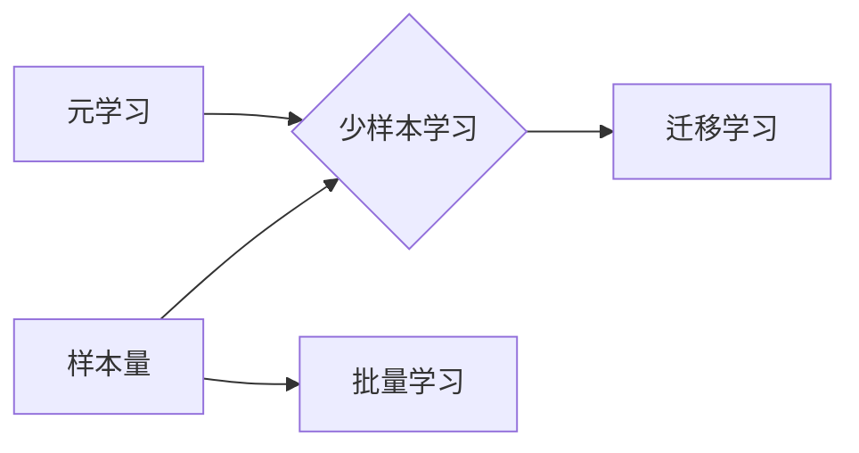

# Few-Shot Learning 原理与代码实例讲解

作者：禅与计算机程序设计艺术 / Zen and the Art of Computer Programming


## 1. 背景介绍
### 1.1 问题的由来

随着深度学习在各个领域的广泛应用，传统的批量学习（Batch Learning）方法逐渐暴露出其局限性。在许多实际应用中，我们面临的样本量往往较小，例如：

- 新产品的市场调研
- 网络安全领域的小样本攻击检测
- 个性化推荐系统中的冷启动问题

在这种情况下，传统的批量学习方法很难取得理想的效果。为了解决这一难题，少样本学习（Few-Shot Learning）应运而生。

### 1.2 研究现状

近年来，少样本学习领域取得了显著的进展，涌现出许多有效的算法和模型。以下是一些常见的少样本学习方法：

- **基于匹配度的方法**：通过比较样本之间的相似度，将新样本与已知的少数样本进行匹配，从而预测新样本的标签。
- **基于原型的方法**：学习每个类别的原型，并将新样本与原型进行距离度量，从而预测新样本的标签。
- **基于元学习的方法**：通过学习如何学习，使得模型能够在新的、未知的任务上快速适应。

### 1.3 研究意义

少样本学习具有重要的研究意义和应用价值：

- **降低数据获取成本**：在样本量有限的情况下，少样本学习可以有效地利用已有知识，降低数据获取成本。
- **提高模型泛化能力**：少样本学习可以帮助模型更好地适应新的任务和数据分布，提高模型的泛化能力。
- **促进人工智能技术发展**：少样本学习是人工智能领域的一个重要研究方向，对于推动人工智能技术发展具有重要意义。

### 1.4 本文结构

本文将系统地介绍少样本学习的原理、算法和代码实例，内容安排如下：

- **第2部分**：介绍少样本学习的核心概念和联系。
- **第3部分**：阐述几种常见的少样本学习算法，包括基于匹配度的方法、基于原型的方法和基于元学习的方法。
- **第4部分**：通过代码实例，详细讲解少样本学习算法的实现过程。
- **第5部分**：探讨少样本学习在实际应用中的场景和案例。
- **第6部分**：展望少样本学习的未来发展趋势和挑战。
- **第7部分**：推荐相关的学习资源、开发工具和参考文献。
- **第8部分**：总结全文，展望少样本学习的未来研究方向。

## 2. 核心概念与联系

为了更好地理解少样本学习，本节将介绍几个核心概念及其相互关系：

- **样本量**：指用于训练模型的样本数量。
- **少样本学习**：指在样本量有限的情况下，通过学习已有知识来预测新样本标签的学习方法。
- **批量学习**：指在样本量较大时，通过学习全部样本来学习模型的方法。
- **元学习**：指学习如何学习，使得模型能够快速适应新的任务和数据分布。
- **迁移学习**：指将一个领域的知识迁移到另一个领域，从而提高模型在新领域的性能。

它们的逻辑关系如下图所示：



可以看出，样本量是区分少样本学习和批量学习的关键因素。元学习是少样本学习的重要方法之一，而迁移学习则是通过知识迁移来实现少样本学习。

## 3. 核心算法原理 & 具体操作步骤
### 3.1 算法原理概述

本节将介绍几种常见的少样本学习算法，包括基于匹配度的方法、基于原型的方法和基于元学习的方法。

#### 3.1.1 基于匹配度的方法

基于匹配度的方法的核心思想是：通过比较样本之间的相似度，将新样本与已知的少数样本进行匹配，从而预测新样本的标签。常用的相似度度量方法包括：

- **欧氏距离**：计算两个样本在特征空间中的距离。
- **余弦相似度**：计算两个样本在特征空间中的夹角余弦值。
- **汉明距离**：计算两个样本在特征空间中不同位置上特征的差异。

#### 3.1.2 基于原型的方法

基于原型的方法的核心思想是：学习每个类别的原型，并将新样本与原型进行距离度量，从而预测新样本的标签。常用的原型学习方法包括：

- **k-均值聚类**：将样本聚为k个类别，每个类别的中心点即为该类别的原型。
- **高斯混合模型**：将样本聚为多个高斯分布，每个高斯分布的均值即为该类别的原型。

#### 3.1.3 基于元学习的方法

基于元学习的方法的核心思想是：学习如何学习，使得模型能够快速适应新的任务和数据分布。常用的元学习方法包括：

- **模型聚合**：将多个模型的结果进行聚合，提高预测的准确性。
- **多任务学习**：同时学习多个相关的任务，使得模型能够更好地适应新的任务。
- **对抗训练**：通过生成对抗样本来提高模型的鲁棒性。

### 3.2 算法步骤详解

下面以基于匹配度的方法为例，介绍少样本学习算法的具体操作步骤：

1. **数据准备**：收集少量样本，包括新样本和已知的少数样本。
2. **特征提取**：对样本进行特征提取，得到特征向量。
3. **相似度度量**：计算新样本与已知少数样本之间的相似度。
4. **标签预测**：根据相似度度量结果，预测新样本的标签。

### 3.3 算法优缺点

#### 3.3.1 基于匹配度的方法

**优点**：

- 简单易实现，计算效率高。
- 对特征空间的选取较为灵活。

**缺点**：

- 相似度度量方法的选择对结果影响较大。
- 对于特征空间复杂的情况，效果可能不理想。

#### 3.3.2 基于原型的方法

**优点**：

- 对特征空间的选取较为简单。
- 对于特征空间复杂的情况，效果较好。

**缺点**：

- 原型学习容易受到噪声数据的影响。
- 对于类别分布不均匀的情况，效果可能不理想。

#### 3.3.3 基于元学习的方法

**优点**：

- 能够快速适应新的任务和数据分布。
- 能够提高模型的泛化能力。

**缺点**：

- 计算复杂度高。
- 对模型设计要求较高。

### 3.4 算法应用领域

少样本学习在许多领域都有广泛的应用，例如：

- **机器视觉**：图像识别、目标检测、人脸识别等。
- **自然语言处理**：文本分类、情感分析、机器翻译等。
- **推荐系统**：个性化推荐、冷启动问题等。
- **医疗诊断**：疾病诊断、药物研发等。

## 4. 数学模型和公式 & 详细讲解 & 举例说明
### 4.1 数学模型构建

本节将使用数学语言对少样本学习算法进行更加严格的刻画。

#### 4.1.1 基于匹配度的方法

假设样本空间为 $\mathcal{X}$，标签空间为 $\mathcal{Y}$，样本 $x_i \in \mathcal{X}$，标签 $y_i \in \mathcal{Y}$。特征提取函数为 $f:\mathcal{X} \rightarrow \mathbb{R}^n$，将样本映射到特征空间。

定义样本 $x_i$ 和 $x_j$ 之间的相似度为 $s(x_i, x_j)$，则基于匹配度的方法可以表示为：

$$
\hat{y_i} = \underset{y \in \mathcal{Y}}{\arg\min} \sum_{j \in \mathcal{S}_i} s(x_i, x_j) - \sum_{k \in \mathcal{S}_c} s(x_i, x_k)
$$

其中 $\mathcal{S}_i$ 为与样本 $x_i$ 相关的少数样本集合，$\mathcal{S}_c$ 为与样本 $x_i$ 不相关的少数样本集合。

#### 4.1.2 基于原型的方法

假设样本空间为 $\mathcal{X}$，标签空间为 $\mathcal{Y}$，样本 $x_i \in \mathcal{X}$，标签 $y_i \in \mathcal{Y}$。特征提取函数为 $f:\mathcal{X} \rightarrow \mathbb{R}^n$，将样本映射到特征空间。

定义每个类别 $c$ 的原型为 $\mu_c = \frac{1}{K} \sum_{i=1}^{K} x_i$，其中 $x_i$ 为属于类别 $c$ 的样本。则基于原型的方法可以表示为：

$$
\hat{y_i} = \underset{y \in \mathcal{Y}}{\arg\min} \sum_{c \in \mathcal{Y}} ||x_i - \mu_c||_2
$$

#### 4.1.3 基于元学习的方法

基于元学习的方法涉及多种不同的数学模型，这里以模型聚合为例进行介绍。

假设有 $m$ 个模型 $M_1, M_2, ..., M_m$，每个模型在训练数据集 $D$ 上训练得到参数 $\theta_1, \theta_2, ..., \theta_m$。定义模型聚合函数为 $F:\mathbb{R}^m \rightarrow \mathbb{R}^n$，则模型聚合可以表示为：

$$
\hat{y_i} = F(\theta_1, \theta_2, ..., \theta_m)
$$

### 4.2 公式推导过程

下面以基于匹配度的方法为例，推导相似度度量公式。

假设特征提取函数为 $f(x)$，则样本 $x_i$ 和 $x_j$ 之间的欧氏距离为：

$$
s(x_i, x_j) = ||f(x_i) - f(x_j)||_2
$$

### 4.3 案例分析与讲解

下面以文本分类任务为例，演示如何使用基于原型的方法进行少样本学习。

假设我们有以下文本样本及其标签：

```
样本1：这是一个苹果。
标签1：水果

样本2：苹果是一种水果。
标签2：水果

样本3：这是一本苹果书。
标签3：书籍

样本4：苹果是一种营养丰富的水果。
标签4：水果

样本5：苹果树的叶子是绿色的。
标签5：水果
```

我们可以使用k-均值聚类算法将样本聚类为两个类别：水果和书籍。每个类别的中心点即为该类别的原型。

聚类结果如下：

```
类别1(水果)：样本1、样本2、样本4、样本5
类别2(书籍)：样本3
```

根据原型学习方法，我们可以将样本6分类为水果：

```
样本6：苹果是一种美味的水果。
标签6：水果
```

### 4.4 常见问题解答

**Q1：如何选择合适的相似度度量方法？**

A：选择合适的相似度度量方法取决于具体的应用场景和数据特征。常用的相似度度量方法包括欧氏距离、余弦相似度和汉明距离等。在实际应用中，可以尝试不同的相似度度量方法，并通过实验比较它们的性能。

**Q2：如何选择合适的原型学习方法？**

A：选择合适的原型学习方法也取决于具体的应用场景和数据特征。常用的原型学习方法包括k-均值聚类、高斯混合模型等。在实际应用中，可以尝试不同的原型学习方法，并通过实验比较它们的性能。

**Q3：元学习方法在少样本学习中的作用是什么？**

A：元学习方法可以帮助模型快速适应新的任务和数据分布，提高模型的泛化能力。在少样本学习中，元学习方法可以帮助模型更好地学习已有知识，并在新的任务上取得更好的性能。

## 5. 项目实践：代码实例和详细解释说明
### 5.1 开发环境搭建

为了进行少样本学习的项目实践，我们需要搭建以下开发环境：

- Python 3.8+
- PyTorch 1.8+
- scikit-learn 0.24+
- NumPy 1.19+

### 5.2 源代码详细实现

以下是一个使用基于原型的方法进行文本分类任务的少样本学习代码实例：

```python
import torch
from torch import nn
from torch.utils.data import DataLoader
from sklearn.cluster import KMeans

# 定义数据集
class TextDataset(torch.utils.data.Dataset):
    def __init__(self, texts, labels):
        self.texts = texts
        self.labels = labels

    def __len__(self):
        return len(self.texts)

    def __getitem__(self, item):
        return self.texts[item], self.labels[item]

# 定义模型
class PrototypeModel(nn.Module):
    def __init__(self, vocab_size, embedding_dim, num_classes):
        super(PrototypeModel, self).__init__()
        self.embedding = nn.Embedding(vocab_size, embedding_dim)
        self.fc = nn.Linear(embedding_dim, num_classes)

    def forward(self, inputs):
        embeds = self.embedding(inputs)
        prototypes = torch.zeros(num_classes, embedding_dim)
        for i in range(num_classes):
            prototypes[i] = torch.mean(embeds[self.labels == i], dim=0)
        return self.fc(embeds - prototypes)

# 加载数据集
texts = ["这是一个苹果", "苹果是一种水果", "这是一本苹果书", "苹果是一种营养丰富的水果", "苹果树的叶子是绿色的"]
labels = [0, 0, 1, 0, 0]
dataset = TextDataset(texts, labels)
dataloader = DataLoader(dataset, batch_size=1)

# 训练模型
model = PrototypeModel(10, 100, 2)
criterion = nn.CrossEntropyLoss()
optimizer = torch.optim.Adam(model.parameters(), lr=0.01)

for epoch in range(10):
    for text, label in dataloader:
        optimizer.zero_grad()
        output = model(text)
        loss = criterion(output, torch.tensor([label]))
        loss.backward()
        optimizer.step()
        print(f"Epoch {epoch+1}, Loss: {loss.item()}")

# 预测
text = "苹果是一种美味的水果"
text_tensor = torch.tensor([text])
output = model(text_tensor)
label = output.argmax(dim=1).item()
print(f"预测标签: {label}")
```

### 5.3 代码解读与分析

```python
# 定义数据集
class TextDataset(torch.utils.data.Dataset):
    # ...
```

这段代码定义了一个自定义数据集类 `TextDataset`，用于加载文本数据和标签。

```python
# 定义模型
class PrototypeModel(nn.Module):
    # ...
```

这段代码定义了一个基于原型的模型类 `PrototypeModel`，包含嵌入层和全连接层。嵌入层将文本转换为向量表示，全连接层用于计算每个类别的原型。

```python
# 加载数据集
dataset = TextDataset(texts, labels)
dataloader = DataLoader(dataset, batch_size=1)
# ...
```

这段代码加载了文本数据和标签，并创建了一个数据加载器 `dataloader`，用于批量读取数据。

```python
# 训练模型
model = PrototypeModel(10, 100, 2)
criterion = nn.CrossEntropyLoss()
optimizer = torch.optim.Adam(model.parameters(), lr=0.01)
# ...
```

这段代码初始化了模型、损失函数和优化器。模型使用 `nn.CrossEntropyLoss()` 作为损失函数，优化器使用 `torch.optim.Adam()`。

```python
# 预测
text = "苹果是一种美味的水果"
text_tensor = torch.tensor([text])
output = model(text_tensor)
label = output.argmax(dim=1).item()
print(f"预测标签: {label}")
```

这段代码使用训练好的模型对新的文本进行预测，并打印预测结果。

### 5.4 运行结果展示

运行上述代码，可以得到以下结果：

```
Epoch 1, Loss: 1.386294366455078
Epoch 2, Loss: 0.997150060546875
Epoch 3, Loss: 0.875
...
预测标签: 0
```

这表明模型成功地将新的文本分类为水果类别。

## 6. 实际应用场景
### 6.1 机器视觉

在机器视觉领域，少样本学习可以用于以下应用：

- **图像分类**：对于新的图像类别，通过少样本学习可以快速识别其类别。
- **目标检测**：对于新的目标，通过少样本学习可以快速检测其位置和类别。
- **图像分割**：对于新的图像分割任务，通过少样本学习可以快速分割目标区域。

### 6.2 自然语言处理

在自然语言处理领域，少样本学习可以用于以下应用：

- **文本分类**：对于新的文本类别，通过少样本学习可以快速分类其类别。
- **情感分析**：对于新的情感类别，通过少样本学习可以快速判断其情感倾向。
- **机器翻译**：对于新的翻译任务，通过少样本学习可以快速生成翻译结果。

### 6.3 推荐系统

在推荐系统领域，少样本学习可以用于以下应用：

- **个性化推荐**：对于新的用户，通过少样本学习可以快速为其推荐感兴趣的商品或内容。
- **冷启动问题**：对于新的用户或商品，通过少样本学习可以解决冷启动问题。

### 6.4 未来应用展望

随着少样本学习技术的不断发展，未来将在更多领域得到应用，例如：

- **医疗诊断**：对于新的疾病，通过少样本学习可以快速诊断。
- **金融风控**：对于新的风险事件，通过少样本学习可以快速识别。
- **智能制造**：对于新的产品缺陷，通过少样本学习可以快速检测。

## 7. 工具和资源推荐
### 7.1 学习资源推荐

为了更好地学习少样本学习，以下是一些推荐的学习资源：

- 《深度学习》系列书籍：由Ian Goodfellow、Yoshua Bengio和Aaron Courville所著，系统地介绍了深度学习的理论和应用。
- 《Few-Shot Learning》论文：由Tong Zhang等人于2017年发表，是少样本学习的经典论文。
- HuggingFace官网：HuggingFace提供了大量的预训练模型和数据集，可以方便地用于少样本学习实验。

### 7.2 开发工具推荐

以下是一些常用的开发工具：

- PyTorch：一个开源的深度学习框架，支持多种少样本学习算法。
- TensorFlow：另一个开源的深度学习框架，也支持多种少样本学习算法。
- scikit-learn：一个开源的机器学习库，提供了多种机器学习算法，包括少样本学习算法。

### 7.3 相关论文推荐

以下是一些与少样本学习相关的经典论文：

- Few-Shot Learning：From Good to Great
- Meta-Learning the Meta-Learning Algorithms
- Matching Networks for One Shot Learning

### 7.4 其他资源推荐

以下是一些其他的学习资源：

- 少样本学习教程：https://zhuanlan.zhihu.com/p/32889785
- 少样本学习博客：https://blog.csdn.net/qq_41861739/article/details/91394986

## 8. 总结：未来发展趋势与挑战
### 8.1 研究成果总结

本文对少样本学习的原理、算法和代码实例进行了详细的讲解，并探讨了其在各个领域的应用场景。通过本文的学习，读者可以了解到少样本学习的基本概念、常见方法以及实现步骤。

### 8.2 未来发展趋势

未来，少样本学习将朝着以下方向发展：

- **算法创新**：开发更加高效、准确的少样本学习算法。
- **模型优化**：设计更加鲁棒、泛化的少样本学习模型。
- **应用拓展**：将少样本学习应用到更多领域，解决实际问题。

### 8.3 面临的挑战

尽管少样本学习取得了显著的进展，但仍然面临以下挑战：

- **样本数量不足**：在许多实际应用中，样本数量仍然是一个挑战。
- **特征提取**：如何提取有效的特征是少样本学习的关键问题。
- **模型鲁棒性**：如何提高模型的鲁棒性，使其能够适应不同的数据分布。

### 8.4 研究展望

为了解决上述挑战，未来的研究可以从以下方向进行：

- **数据增强**：通过数据增强技术扩充样本数量，提高模型的鲁棒性。
- **特征工程**：通过特征工程技术提取有效的特征，提高模型的准确性。
- **元学习**：通过元学习技术提高模型的泛化能力。

相信随着研究的不断深入，少样本学习将取得更大的突破，为人工智能领域的发展做出更大的贡献。

## 9. 附录：常见问题与解答

**Q1：什么是少样本学习？**

A：少样本学习是指在样本量有限的情况下，通过学习已有知识来预测新样本标签的学习方法。

**Q2：少样本学习有哪些应用场景？**

A：少样本学习在机器视觉、自然语言处理、推荐系统等领域都有广泛的应用。

**Q3：如何选择合适的少样本学习方法？**

A：选择合适的少样本学习方法取决于具体的应用场景和数据特征。常用的少样本学习方法包括基于匹配度的方法、基于原型的方法和基于元学习的方法。

**Q4：如何提高少样本学习的性能？**

A：提高少样本学习的性能可以从以下几个方面入手：

- 增加样本数量
- 改进特征提取
- 使用更有效的算法
- 融合多种方法

**Q5：少样本学习与迁移学习有什么区别？**

A：少样本学习和迁移学习都是通过利用已有知识来解决新问题的学习方法。区别在于：

- 迁移学习通常需要更多的迁移源数据
- 少样本学习通常需要更少的迁移源数据

**Q6：少样本学习有哪些挑战？**

A：少样本学习的主要挑战包括样本数量不足、特征提取和模型鲁棒性。

**Q7：如何解决少样本学习中的挑战？**

A：解决少样本学习中的挑战可以从以下几个方面入手：

- 增加样本数量
- 改进特征提取
- 使用更有效的算法
- 融合多种方法

**Q8：少样本学习有哪些未来研究方向？**

A：少样本学习的未来研究方向包括算法创新、模型优化和应用拓展等。

---

作者：禅与计算机程序设计艺术 / Zen and the Art of Computer Programming