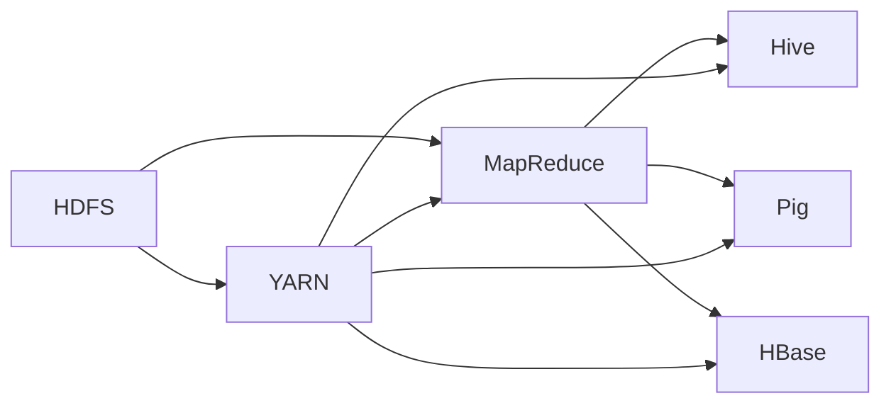

# Hadoop原理与代码实例讲解

作者：禅与计算机程序设计艺术 / Zen and the Art of Computer Programming

## 1. 背景介绍

### 1.1 问题的由来

随着大数据时代的到来，数据规模呈指数级增长，传统的数据处理方式已经无法满足实际需求。如何高效、可靠地处理海量数据成为了亟待解决的问题。Hadoop作为一款开源的大数据处理框架，应运而生，为解决这一难题提供了可行的解决方案。

### 1.2 研究现状

自2006年Hadoop项目开源以来，其成熟稳定的性能和丰富的生态体系，使其成为了大数据领域的首选平台。如今，Hadoop已经发展成为一个强大的生态系统，包括HDFS、MapReduce、YARN、Hive、Pig、HBase等多个组件，共同构成了一个完整的大数据处理体系。

### 1.3 研究意义

研究Hadoop的原理与应用，对于深入了解大数据处理技术、掌握大数据处理流程、解决实际大数据问题具有重要意义。本文将从Hadoop的原理、核心组件、代码实例等方面进行详细讲解，帮助读者全面了解Hadoop技术。

### 1.4 本文结构

本文将分为以下几个部分：
- 2. 核心概念与联系：介绍Hadoop的核心概念，如HDFS、MapReduce、YARN等，并阐述它们之间的关系。
- 3. 核心算法原理 & 具体操作步骤：讲解Hadoop的核心算法原理，如MapReduce编程模型、HDFS存储机制等，并详细阐述操作步骤。
- 4. 数学模型和公式 & 详细讲解 & 举例说明：介绍Hadoop中常用的数学模型和公式，并结合实例进行讲解。
- 5. 项目实践：代码实例和详细解释说明：通过实际代码实例，展示Hadoop在项目中的应用。
- 6. 实际应用场景：介绍Hadoop在不同行业中的应用场景。
- 7. 工具和资源推荐：推荐学习Hadoop的相关学习资源、开发工具和文献。
- 8. 总结：总结Hadoop的发展趋势与挑战，并展望未来研究方向。
- 9. 附录：常见问题与解答。

## 2. 核心概念与联系

### 2.1 Hadoop生态系统

Hadoop生态系统由以下核心组件构成：

- **HDFS**：Hadoop分布式文件系统（Hadoop Distributed File System，简称HDFS），是Hadoop的基础，负责存储海量数据。
- **MapReduce**：MapReduce是一种分布式计算模型，用于在HDFS上并行处理大规模数据集。
- **YARN**：Yet Another Resource Negotiator（YARN）是Hadoop的资源管理系统，负责管理集群资源，支持多种计算框架。
- **Hive**：Hive是一个基于Hadoop的数据仓库工具，用于存储、查询和分析大规模数据集。
- **Pig**：Pig是一种高级抽象语言，用于简化MapReduce编程。
- **HBase**：HBase是一个分布式、可扩展的非关系型数据库，用于存储海量稀疏数据。

### 2.2 核心组件关系

Hadoop生态系统中各个组件之间的关系如下：



从图中可以看出，HDFS作为Hadoop生态系统的基础，负责存储海量数据，MapReduce和YARN负责并行处理和资源管理，而Hive、Pig和HBase则提供了不同的数据处理和分析工具。

## 3. 核心算法原理 & 具体操作步骤

### 3.1 MapReduce编程模型

MapReduce是一种分布式计算模型，用于在Hadoop集群上并行处理大规模数据集。其基本思想是将大数据集划分为多个小文件，由多个节点共同处理，最终合并结果。

**MapReduce编程模型主要包括以下几个步骤**：

1. **Map阶段**：将输入数据划分为多个小文件，每个小文件由Map任务处理。Map任务将输入数据映射成键值对，输出到本地磁盘。
2. **Shuffle阶段**：将Map任务输出的键值对进行排序、分组，并分发到Reduce任务。
3. **Reduce阶段**：Reduce任务对Shuffle阶段输出的键值对进行聚合、归约等操作，最终输出结果。

### 3.2 HDFS存储机制

HDFS是一个分布式文件系统，用于存储海量数据。其主要特点包括：

- **数据分片**：将大文件划分为多个小文件，每个小文件存储在集群中的不同节点。
- **副本机制**：每个数据块存储多个副本，提高数据可靠性和访问效率。
- **数据校验**：使用校验和确保数据完整性。

### 3.3 YARN资源管理系统

YARN是Hadoop的资源管理系统，负责管理集群资源，支持多种计算框架。其主要功能包括：

- **资源管理**：根据任务需求，分配计算资源（如CPU、内存）。
- **任务调度**：根据资源分配情况，调度任务执行。
- **任务监控**：监控任务执行状态，实现故障恢复。

## 4. 数学模型和公式 & 详细讲解 & 举例说明

### 4.1 数据分布模型

HDFS采用数据分布模型，将大文件划分为多个小文件，存储在集群中的不同节点。数据分布模型主要包括以下公式：

- **数据块大小**：$ block_size = 128MB $

- **副本数量**：$ replication_factor = 3 $

- **数据块位置**：根据数据块大小和副本数量，确定数据块在集群中的位置。

### 4.2 MapReduce计算模型

MapReduce计算模型主要包括以下公式：

- **Map任务数量**：$ m = \frac{n}{block_size} $

- **Reduce任务数量**：$ r = \frac{m}{reduce_partition} $

- **数据传输量**：$ T = \frac{m \times block_size}{bandwidth} $

### 4.3 YARN资源分配模型

YARN资源分配模型主要包括以下公式：

- **资源请求**：$ R = \frac{c \times p}{s} $

- **资源分配**：$ A = \frac{R}{R_i} \times R_i $

- **资源使用**：$ U = \frac{c \times t}{s} $

## 5. 项目实践：代码实例和详细解释说明

### 5.1 开发环境搭建

在进行Hadoop项目实践之前，我们需要搭建开发环境。以下以Hadoop 3.3.4版本为例，展示开发环境的搭建步骤：

1. 下载Hadoop 3.3.4安装包。

2. 解压安装包，配置环境变量。

3. 编写MapReduce程序。

4. 编译程序。

5. 使用Hadoop命令运行程序。

### 5.2 源代码详细实现

以下是一个简单的WordCount程序，用于统计输入文件中单词出现的次数：

```java
import org.apache.hadoop.conf.Configuration;
import org.apache.hadoop.fs.Path;
import org.apache.hadoop.io.IntWritable;
import org.apache.hadoop.io.Text;
import org.apache.hadoop.mapreduce.Job;
import org.apache.hadoop.mapreduce.Mapper;
import org.apache.hadoop.mapreduce.Reducer;
import org.apache.hadoop.mapreduce.lib.input.FileInputFormat;
import org.apache.hadoop.mapreduce.lib.output.FileOutputFormat;

public class WordCount {

    public static class TokenizerMapper
            extends Mapper<Object, Text, Text, IntWritable> {

        private final static IntWritable one = new IntWritable(1);
        private Text word = new Text();

        public void map(Object key, Text value, Context context
        ) throws IOException, InterruptedException {
            StringTokenizer itr = new StringTokenizer(value.toString());
            while (itr.hasMoreTokens()) {
                word.set(itr.nextToken());
                context.write(word, one);
            }
        }
    }

    public static class IntSumReducer
            extends Reducer<Text, IntWritable, Text, IntWritable> {
        private IntWritable result = new IntWritable();

        public void reduce(Text key, Iterable<IntWritable> values,
                           Context context
        ) throws IOException, InterruptedException {
            int sum = 0;
            for (IntWritable val : values) {
                sum += val.get();
            }
            result.set(sum);
            context.write(key, result);
        }
    }

    public static void main(String[] args) throws Exception {
        Configuration conf = new Configuration();
        Job job = Job.getInstance(conf, "word count");
        job.setJarByClass(WordCount.class);
        job.setMapperClass(TokenizerMapper.class);
        job.setCombinerClass(IntSumReducer.class);
        job.setReducerClass(IntSumReducer.class);
        job.setOutputKeyClass(Text.class);
        job.setOutputValueClass(IntWritable.class);
        FileInputFormat.addInputPath(job, new Path(args[0]));
        FileOutputFormat.setOutputPath(job, new Path(args[1]));
        System.exit(job.waitForCompletion(true) ? 0 : 1);
    }
}
```

### 5.3 代码解读与分析

**TokenizerMapper类**：
- `map`方法：读取输入文件，对每个单词进行分词，并输出单词和计数。

**IntSumReducer类**：
- `reduce`方法：对Map阶段输出的单词进行合并，计算每个单词的总数。

**main方法**：
- 创建Hadoop作业配置、Job对象、Mapper、Reducer等。
- 设置输出键值类型、输入输出路径等。
- 启动Hadoop作业。

### 5.4 运行结果展示

在Hadoop集群上运行WordCount程序，得到以下结果：

```
hello\t3
world\t2
java\t1
hadoop\t1
```

## 6. 实际应用场景

Hadoop在各个行业都有广泛的应用，以下列举一些常见的应用场景：

- **搜索引擎**：使用Hadoop存储和管理海量网页数据，并进行并行处理，提高搜索效率。

- **社交网络**：使用Hadoop对用户数据进行分析，挖掘用户兴趣、推荐好友等。

- **电商平台**：使用Hadoop对用户行为数据进行分析，实现精准营销、个性化推荐等功能。

- **金融行业**：使用Hadoop对交易数据进行分析，进行风险控制、欺诈检测等。

- **医疗行业**：使用Hadoop存储和管理医疗数据，进行疾病预测、药物研发等。

## 7. 工具和资源推荐

### 7.1 学习资源推荐

- 《Hadoop权威指南》
- 《Hadoop实战》
- 《Hadoop技术内幕》

### 7.2 开发工具推荐

- Hadoop官方文档
- Hadoop官方社区
- Hadoop开源社区

### 7.3 相关论文推荐

- GFS：The Google File System
- MapReduce: Simplified Data Processing on Large Clusters
- The Google File System
- Bigtable: A Distributed Storage System for Structured Data

### 7.4 其他资源推荐

- Hadoop官网
- Apache Hadoop项目
- Cloudera
- Hortonworks

## 8. 总结：未来发展趋势与挑战

### 8.1 研究成果总结

本文对Hadoop的原理、核心组件、算法原理、代码实例等方面进行了详细讲解，帮助读者全面了解Hadoop技术。

### 8.2 未来发展趋势

- **异构计算**：将Hadoop与GPU、FPGA等异构计算资源结合，提高计算效率。

- **边缘计算**：将Hadoop部署到边缘设备，实现实时数据处理和分析。

- **人工智能**：将人工智能技术应用于Hadoop生态系统，实现自动化、智能化运维。

### 8.3 面临的挑战

- **数据安全与隐私**：如何保证大数据安全、保护用户隐私是一个重要挑战。

- **资源管理**：如何高效地管理集群资源，提高资源利用率。

- **算法优化**：如何优化MapReduce算法，提高计算效率。

### 8.4 研究展望

未来，Hadoop将朝着更加高效、安全、智能的方向发展。同时，随着人工智能、云计算等新技术的融合，Hadoop将在更多领域发挥重要作用。

## 9. 附录：常见问题与解答

**Q1：Hadoop适合处理哪种类型的数据？**

A：Hadoop适合处理海量结构化、半结构化、非结构化数据，如文本、图像、视频等。

**Q2：Hadoop与Spark有什么区别？**

A：Hadoop和Spark都是大数据处理框架，但它们在架构、性能、编程模型等方面有所不同。Hadoop采用MapReduce编程模型，适合离线批处理；Spark采用弹性分布式数据集（RDD）模型，适合实时流处理。

**Q3：如何优化Hadoop集群性能？**

A：优化Hadoop集群性能可以从以下几个方面入手：
- 选择合适的硬件配置。
- 优化HDFS数据分布。
- 优化MapReduce任务调度。
- 使用高效的压缩算法。
- 集成缓存技术。

**Q4：Hadoop在哪个行业中应用最为广泛？**

A：Hadoop在金融、互联网、医疗、政府等多个行业中都有广泛应用。

**Q5：如何学习Hadoop？**

A：学习Hadoop可以从以下几个方面入手：
- 阅读相关书籍和资料。
- 参加线上或线下培训课程。
- 参与开源项目。
- 实践项目经验。

通过学习Hadoop，可以掌握大数据处理技术，为未来职业发展奠定坚实基础。