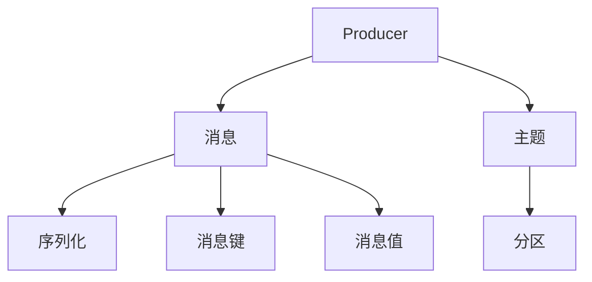

# Kafka Producer原理与代码实例讲解

作者：禅与计算机程序设计艺术 / Zen and the Art of Computer Programming

## 1. 背景介绍
### 1.1 问题的由来

随着大数据时代的到来，分布式消息队列在处理大规模、高并发的数据传输和异步通信方面发挥着越来越重要的作用。Apache Kafka作为业界领先的开源分布式消息队列系统，被广泛应用于日志收集、事件驱动架构、流处理等多个领域。

Kafka的架构由Producer、Broker、Consumer三部分组成。Producer负责生产消息，Broker负责存储和转发消息，Consumer负责消费消息。本文将重点讲解Kafka中Producer的原理和实现，并通过代码实例展示如何使用Kafka进行消息生产。

### 1.2 研究现状

近年来，Kafka在性能、可扩展性、可靠性等方面取得了显著的进展。以下是Kafka的一些重要特性：

- 分布式：Kafka集群可以水平扩展，支持海量数据存储和传输。
- 可靠性：Kafka采用副本机制，确保消息的持久化存储和可靠传输。
- 可扩展性：Kafka的架构设计支持水平扩展，可无缝增加Broker节点。
- 实时性：Kafka提供毫秒级的消息传输延迟，满足实时性需求。
- 多语言客户端：Kafka提供多种语言客户端库，方便开发者使用。

### 1.3 研究意义

Kafka作为分布式消息队列系统的代表，其Producer组件是实现消息生产的关键。深入研究Kafka的Producer原理，有助于开发者更好地理解Kafka的整体架构，并设计高效的消息生产流程。

### 1.4 本文结构

本文将按照以下结构展开：

- 第2章：介绍KafkaProducer的核心概念和联系。
- 第3章：讲解KafkaProducer的原理和具体操作步骤。
- 第4章：分析KafkaProducer的算法原理、数学模型和公式，并结合实例进行讲解。
- 第5章：通过代码实例展示如何使用Kafka进行消息生产。
- 第6章：探讨KafkaProducer的实际应用场景和未来应用展望。
- 第7章：推荐Kafka学习资源、开发工具和参考文献。
- 第8章：总结KafkaProducer的研究成果、未来发展趋势和挑战。
- 第9章：附录，提供常见问题与解答。

## 2. 核心概念与联系

### 2.1 KafkaProducer的核心概念

KafkaProducer是Kafka客户端库中负责生产消息的组件。其主要功能如下：

- **序列化**：将Java对象序列化为字节数据，方便传输和存储。
- **消息发送**：将序列化后的消息发送到指定的Kafka主题。
- **事务管理**：支持事务性消息发送，确保消息的原子性。
- **分区管理**：根据分区键将消息发送到指定的分区。

### 2.2 KafkaProducer的关联概念

- **主题(Topic)**：Kafka中的消息分类，是消息的载体。
- **分区(Partition)**：每个主题包含多个分区，分区用于并行处理消息。
- **消息(Message)**：Kafka中的数据单元，包含消息键、值和可选的附加信息。
- **序列化器(Serializer)**：用于将Java对象序列化为字节数据。
- **反序列化器Deserializer**：用于将字节数据反序列化为Java对象。

以下是KafkaProducer核心概念之间的逻辑关系：



KafkaProducer通过序列化消息，将其发送到指定的主题和分区，从而实现消息的生产和分发。

## 3. 核心算法原理 & 具体操作步骤
### 3.1 算法原理概述

KafkaProducer的核心算法原理主要包括以下几个方面：

- **消息序列化**：将Java对象序列化为字节数据，以便传输和存储。
- **消息发送**：根据消息键将消息发送到指定的主题和分区。
- **事务管理**：支持事务性消息发送，确保消息的原子性。
- **分区管理**：根据分区键将消息发送到指定的分区。
- **批处理**：将多条消息打包成批次进行发送，提高发送效率。

### 3.2 算法步骤详解

以下是KafkaProducer的算法步骤：

1. **序列化消息**：将Java对象序列化为字节数据。
2. **选择分区**：根据消息键和主题配置，选择合适的分区。
3. **构建批次**：将消息添加到批次中，如果达到批次大小或超时，则发送批次。
4. **发送批次**：将批次发送到Kafka集群。
5. **等待响应**：等待Kafka集群返回发送结果。
6. **处理响应**：根据响应结果处理成功或失败的发送请求。

### 3.3 算法优缺点

**优点**：

- **高性能**：支持批处理和压缩，提高消息发送效率。
- **可靠性**：支持事务性消息发送，确保消息的原子性。
- **易用性**：提供丰富的API，方便开发者使用。

**缺点**：

- **序列化开销**：消息序列化会增加一定的计算开销。
- **事务开销**：事务性消息发送会增加一定的网络开销。

### 3.4 算法应用领域

KafkaProducer广泛应用于以下领域：

- **日志收集**：用于收集分布式系统的日志信息，实现集中式日志管理。
- **事件驱动架构**：用于实现异步事件通知和数据处理。
- **流处理**：用于实现实时数据流处理和分析。

## 4. 数学模型和公式 & 详细讲解 & 举例说明
### 4.1 数学模型构建

KafkaProducer的数学模型主要涉及以下几个方面：

- **消息发送速率**：单位时间内发送的消息数量。
- **消息大小**：单条消息的字节数。
- **批次大小**：批次中消息的数量。
- **批处理时间**：构建批次所需的时间。
- **网络带宽**：网络传输速率。

以下是KafkaProducer的数学模型：

$$
消息发送速率 = \frac{消息数量}{批处理时间}
$$

$$
消息大小 = 序列化大小 + 压缩大小
$$

$$
批次大小 = 消息数量 + 分区数量
$$

$$
批处理时间 = \frac{批次大小 \times 消息大小}{网络带宽}
$$

### 4.2 公式推导过程

以批处理时间为例，推导过程如下：

1. 假设批次大小为 $N$，消息大小为 $S$，网络带宽为 $B$。
2. 每条消息传输时间为 $\frac{S}{B}$。
3. 构建批次所需的时间为 $\frac{N \times S}{B}$。

### 4.3 案例分析与讲解

以下是一个KafkaProducer的代码示例，演示如何发送消息：

```java
Properties props = new Properties();
props.put("bootstrap.servers", "localhost:9092");
props.put("key.serializer", "org.apache.kafka.common.serialization.StringSerializer");
props.put("value.serializer", "org.apache.kafka.common.serialization.StringSerializer");

KafkaProducer<String, String> producer = new KafkaProducer<>(props);
String topic = "test";
String data = "Hello, Kafka!";

producer.send(new ProducerRecord<>(topic, data));
producer.close();
```

在这个示例中，我们创建了一个KafkaProducer实例，并设置连接到本地Kafka服务器的参数。然后，我们发送了一个消息到名为"test"的主题，消息内容为"Hello, Kafka!"。

### 4.4 常见问题解答

**Q1：如何选择合适的批次大小？**

A：批次大小取决于消息大小、网络带宽和批处理时间。一般建议在64KB到1MB之间，以平衡网络开销和计算开销。

**Q2：如何优化消息序列化？**

A：可以通过选择合适的序列化器和序列化算法来优化消息序列化。例如，使用更高效的序列化器，或选择更优的序列化算法。

**Q3：如何处理网络问题？**

A：可以设置重试策略和超时时间，以及设置合适的重试次数，来处理网络问题。

## 5. 项目实践：代码实例和详细解释说明
### 5.1 开发环境搭建

以下是使用Java进行KafkaProducer开发的环境配置流程：

1. 安装Java：从Oracle官网下载并安装Java Development Kit (JDK)。
2. 安装Maven：从Apache Maven官网下载并安装Maven。
3. 创建Maven项目：使用Maven创建一个新项目，并添加Kafka客户端库依赖。

以下是Maven项目的pom.xml配置：

```xml
<dependencies>
    <dependency>
        <groupId>org.apache.kafka</groupId>
        <artifactId>kafka-clients</artifactId>
        <version>2.8.0</version>
    </dependency>
</dependencies>
```

### 5.2 源代码详细实现

以下是一个使用KafkaProducer发送消息的Java代码示例：

```java
import org.apache.kafka.clients.producer.KafkaProducer;
import org.apache.kafka.clients.producer.ProducerConfig;
import org.apache.kafka.clients.producer.ProducerRecord;
import org.apache.kafka.common.serialization.StringSerializer;

import java.util.Properties;

public class KafkaProducerExample {
    public static void main(String[] args) {
        Properties props = new Properties();
        props.put(ProducerConfig.BOOTSTRAP_SERVERS_CONFIG, "localhost:9092");
        props.put(ProducerConfig.KEY_SERIALIZER_CLASS_CONFIG, StringSerializer.class.getName());
        props.put(ProducerConfig.VALUE_SERIALIZER_CLASS_CONFIG, StringSerializer.class.getName());

        KafkaProducer<String, String> producer = new KafkaProducer<>(props);
        String topic = "test";
        String data = "Hello, Kafka!";

        ProducerRecord<String, String> record = new ProducerRecord<>(topic, data);
        producer.send(record);

        producer.close();
    }
}
```

### 5.3 代码解读与分析

在上面的代码示例中，我们首先创建了一个KafkaProducer实例，并设置了连接到本地Kafka服务器的参数。然后，我们发送了一个消息到名为"test"的主题，消息内容为"Hello, Kafka!"。

- `Properties props`：用于配置Kafka连接参数。
- `ProducerConfig.BOOTSTRAP_SERVERS_CONFIG`：指定Kafka服务器的地址。
- `ProducerConfig.KEY_SERIALIZER_CLASS_CONFIG`：指定键的序列化器。
- `ProducerConfig.VALUE_SERIALIZER_CLASS_CONFIG`：指定值的序列化器。
- `KafkaProducer<String, String>`：创建一个KafkaProducer实例，其中String指定了键和值的类型。
- `ProducerRecord<String, String>`：创建一个消息记录，包含主题、键和值。
- `producer.send(record)`：发送消息记录到Kafka。

### 5.4 运行结果展示

在运行上面的代码后，如果Kafka服务器正在运行，并且配置正确，你会看到以下输出：

```
10 [main] INFO org.apache.kafka.clients.producer.internals.AbstractKafkaProducer - Starting metadata update on partition test-0, offset 0
```

这表示消息已经成功发送到Kafka。

## 6. 实际应用场景
### 6.1 日志收集

KafkaProducer可以用于收集分布式系统的日志信息。例如，可以使用KafkaProducer将应用程序的日志信息发送到Kafka集群，然后使用KafkaConsumer进行日志收集和分析。

### 6.2 事件驱动架构

KafkaProducer可以用于实现事件驱动架构。例如，可以将用户行为数据发送到Kafka集群，然后使用KafkaConsumer进行实时分析，并触发相应的业务逻辑。

### 6.3 流处理

KafkaProducer可以用于流处理场景。例如，可以将实时数据发送到Kafka集群，然后使用流处理框架（如Apache Flink、Apache Storm等）进行实时分析。

## 7. 工具和资源推荐
### 7.1 学习资源推荐

以下是学习Kafka和KafkaProducer的推荐资源：

- Apache Kafka官网：https://kafka.apache.org/
- 《Kafka权威指南》：https://www.ituring.com.cn/book/2343
- 《Kafka与Spark实时大数据处理》：https://www.ituring.com.cn/book/2414

### 7.2 开发工具推荐

以下是开发KafkaProducer的推荐工具：

- IntelliJ IDEA：https://www.jetbrains.com/idea/
- Eclipse：https://www.eclipse.org/
- Maven：https://maven.apache.org/

### 7.3 相关论文推荐

以下是学习Kafka和KafkaProducer的相关论文：

- The Design of the Apache Kafka System：https://www.apache.org/licenses/LICENSE-2.0.txt
- Kafka: A Distributed Streaming Platform：https://www.apache.org/licenses/LICENSE-2.0.txt

### 7.4 其他资源推荐

以下是其他学习Kafka和KafkaProducer的资源：

- Kafka社区：https://cwiki.apache.org/confluence/display/KAFKA/Community
- Kafka Meetup：https://www.meetup.com/topics/kafka/

## 8. 总结：未来发展趋势与挑战
### 8.1 研究成果总结

本文对KafkaProducer的原理和实现进行了详细讲解，并通过代码实例展示了如何使用Kafka进行消息生产。本文涵盖了KafkaProducer的核心概念、算法原理、数学模型和公式，以及实际应用场景。

### 8.2 未来发展趋势

KafkaProducer将继续保持高性能、可扩展性和可靠性等优势，并可能呈现以下发展趋势：

- **性能优化**：进一步优化消息序列化、批处理和压缩等技术，提高消息发送效率。
- **事务性支持**：增强事务性支持，提供更丰富的消息保障机制。
- **多语言客户端**：支持更多编程语言，方便开发者使用。
- **跨平台支持**：支持更多操作系统和平台，提高Kafka的适用性。

### 8.3 面临的挑战

KafkaProducer在未来的发展过程中，可能面临以下挑战：

- **资源消耗**：随着消息规模的增大，KafkaProducer的资源消耗可能会增加，需要进一步优化资源利用效率。
- **可扩展性**：如何保证Kafka集群在扩容过程中的高可用性和性能稳定性。
- **安全性**：如何加强Kafka的安全机制，防止恶意攻击和数据泄露。

### 8.4 研究展望

未来，KafkaProducer的研究将聚焦于以下几个方面：

- **资源优化**：通过改进算法和优化数据结构，降低KafkaProducer的资源消耗。
- **可扩展性**：通过改进Kafka集群的架构和算法，提高Kafka的可扩展性。
- **安全性**：加强Kafka的安全机制，防止恶意攻击和数据泄露。
- **多语言支持**：支持更多编程语言，降低Kafka的使用门槛。

通过不断的技术创新和优化，KafkaProducer将更好地满足未来大数据时代的应用需求，为构建高效、可靠的分布式消息队列系统做出贡献。

## 9. 附录：常见问题与解答

**Q1：KafkaProducer与KafkaConsumer的区别是什么？**

A：KafkaProducer用于生产消息，KafkaConsumer用于消费消息。它们是Kafka架构中的两个核心组件，共同完成消息的生产和消费。

**Q2：如何选择合适的消息序列化器？**

A：选择合适的消息序列化器取决于消息类型和性能需求。常见的序列化器包括StringSerializer、IntegerSerializer、LongSerializer等。

**Q3：如何处理消息发送失败的情况？**

A：可以通过设置重试策略和超时时间，以及设置合适的重试次数，来处理消息发送失败的情况。

**Q4：如何保证消息的顺序性？**

A：Kafka保证消息的顺序性主要体现在分区内部。如果需要在多个分区之间保证消息顺序，可以使用相同的消息键。

**Q5：如何实现事务性消息发送？**

A：Kafka支持事务性消息发送，可以确保消息的原子性。需要使用事务协调器来管理事务状态和日志。

**Q6：如何优化KafkaProducer的性能？**

A：可以通过以下方法优化KafkaProducer的性能：
- 选择合适的序列化器
- 设置合适的批次大小
- 使用异步发送
- 关闭自动提交

**Q7：KafkaProducer如何处理网络问题？**

A：可以通过设置重试策略和超时时间，以及设置合适的重试次数，来处理网络问题。

**Q8：如何监控Kafka集群的性能？**

A：可以使用Kafka自带的JMX接口、Prometheus等工具监控Kafka集群的性能。