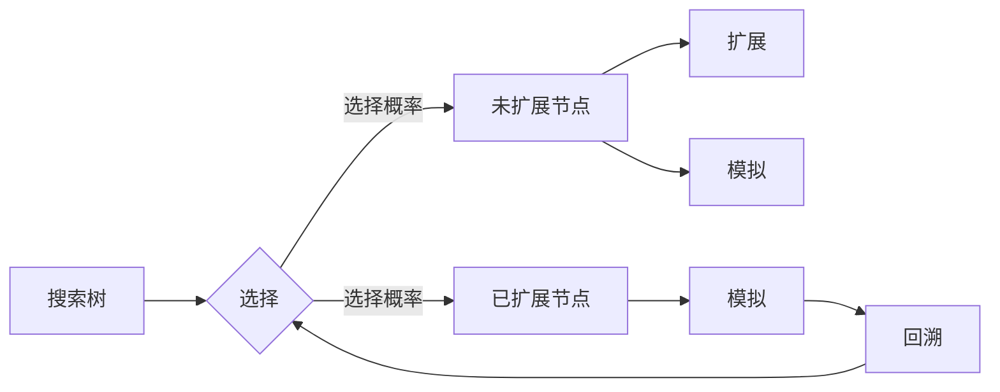

# Monte Carlo Tree Search (MCTS)原理与代码实例讲解

作者：禅与计算机程序设计艺术 / Zen and the Art of Computer Programming

## 1. 背景介绍

### 1.1 问题的由来

随着人工智能技术的飞速发展，搜索算法在计算机科学和人工智能领域扮演着至关重要的角色。在众多搜索算法中，蒙特卡洛树搜索（Monte Carlo Tree Search，简称MCTS）因其高效性和鲁棒性，在决策过程、游戏人工智能等领域得到了广泛的应用。

MCTS是一种基于随机模拟的搜索算法，它通过模拟大量随机游戏来探索搜索树，从而找到最优决策。与传统的搜索算法相比，MCTS具有以下特点：

- 能够处理复杂搜索空间，特别是当搜索空间过大时，传统搜索算法效率会急剧下降。
- 不需要像深度优先搜索那样需要大量先验知识，可以应用于各种领域。
- 能够根据模拟结果动态调整搜索策略，提高搜索效率。

### 1.2 研究现状

MCTS最早由Chas Cardie和Michael Buro在1995年提出，最初应用于游戏AI领域。随后，MCTS在多智能体系统、决策过程、优化等领域得到了广泛的研究和应用。近年来，随着深度学习的兴起，MCTS与深度学习技术的结合成为了新的研究热点。

### 1.3 研究意义

MCTS作为一种高效、鲁棒的搜索算法，在以下几个方面具有重要意义：

- 提高搜索效率：MCTS能够在有限的时间内探索更多的搜索空间，从而找到更优的决策。
- 支持不确定性决策：MCTS通过模拟随机游戏，能够处理不确定性决策问题。
- 易于与其他技术结合：MCTS可以与深度学习、强化学习等人工智能技术结合，提高决策性能。

### 1.4 本文结构

本文将系统介绍MCTS的原理、算法步骤、应用领域，并给出代码实例和详细解释说明。具体内容如下：

- 第2部分：介绍MCTS的核心概念和联系。
- 第3部分：详细阐述MCTS的算法原理和具体操作步骤。
- 第4部分：给出MCTS的数学模型、公式推导和案例分析。
- 第5部分：给出MCTS的代码实例和详细解释说明。
- 第6部分：探讨MCTS的实际应用场景和未来应用展望。
- 第7部分：推荐MCTS相关的学习资源、开发工具和参考文献。
- 第8部分：总结全文，展望MCTS技术的未来发展趋势与挑战。

## 2. 核心概念与联系

为了更好地理解MCTS，本节将介绍几个核心概念和它们之间的联系。

### 2.1 核心概念

1. **搜索树（Search Tree）**：搜索树是一种树形结构，用于表示搜索过程中的所有可能状态。每个节点代表一个状态，有多个子节点代表该状态下的不同选择。
2. **节点（Node）**：搜索树中的每个节点表示一个状态，包含以下信息：
    - 状态：表示当前游戏所处的状态。
    - 状态值：表示该状态下的期望效用值。
    - 节点值：表示从该节点到达终端状态所获得的收益。
    - 选取概率：表示到达该节点时选择该节点的概率。
    - 胜率：表示到达该节点时获胜的概率。
    - 选择概率：表示选择该节点的概率。
3. **模拟（Simulation）**：模拟是指在一个给定状态下，随机模拟多次游戏，根据模拟结果评估该状态的价值。
4. **选择（Selection）**：选择是指在搜索树中选择一个节点，通常选择具有最高期望效用值的节点。
5. **扩展（Expansion）**：扩展是指在搜索树中选择一个未扩展的节点，并对其添加子节点。
6. **模拟（Simulation）**：模拟是指在扩展后的节点上，随机模拟多次游戏，根据模拟结果更新节点信息。
7. **回溯（Backpropagation）**：回溯是指根据模拟结果，从终端状态向上更新搜索树中每个节点的状态值、胜率等信息。

### 2.2 核心概念联系

MCTS的核心概念之间存在着紧密的联系，它们共同构成了MCTS的搜索过程。以下用Mermaid流程图展示这些概念之间的关系：



从图中可以看出，MCTS的搜索过程可以分为以下步骤：

1. 在搜索树中选择一个节点。
2. 如果选择的节点是未扩展节点，则对其进行扩展并模拟游戏过程。
3. 根据模拟结果更新节点信息。
4. 重复步骤1-3，直到达到终止条件。

## 3. 核心算法原理 & 具体操作步骤

### 3.1 算法原理概述

MCTS是一种基于概率的搜索算法，它通过模拟随机游戏来探索搜索空间，从而找到最优决策。MCTS的核心思想是：

- 利用模拟结果评估节点价值，选择价值最高的节点进行扩展和模拟。
- 通过模拟结果更新节点信息，提高搜索效率。

### 3.2 算法步骤详解

MCTS的算法步骤如下：

1. 初始化搜索树，根节点代表初始状态。
2. 选择节点：根据节点的选择概率，在搜索树中选择一个节点。
3. 如果选择的节点是未扩展节点，则对其进行扩展：
    - 为节点添加子节点，子节点代表该状态下可能的选择。
    - 对于每个子节点，进行模拟游戏，并记录游戏结果。
4. 模拟游戏：
    - 随机选择一个子节点，代表该状态下进行游戏。
    - 重复步骤2和3，直到游戏结束。
    - 根据游戏结果，更新节点的状态值、胜率等信息。
5. 回溯：
    - 根据模拟结果，从终端状态向上更新搜索树中每个节点的信息。
6. 重复步骤2-5，直到达到终止条件。

### 3.3 算法优缺点

MCTS的优点：

- 能够处理复杂搜索空间，特别是当搜索空间过大时，传统搜索算法效率会急剧下降。
- 不需要像深度优先搜索那样需要大量先验知识，可以应用于各种领域。
- 能够根据模拟结果动态调整搜索策略，提高搜索效率。

MCTS的缺点：

- 模拟次数过多时，计算成本较高。
- 对于某些问题，MCTS的搜索效率可能不如其他搜索算法。

### 3.4 算法应用领域

MCTS在以下领域得到了广泛的应用：

- 游戏AI：例如围棋、国际象棋、斗兽棋等。
- 决策过程：例如股票交易、资源分配、路径规划等。
- 优化问题：例如机器学习、运筹学等。

## 4. 数学模型和公式 & 详细讲解 & 举例说明

### 4.1 数学模型构建

MCTS的数学模型主要包括以下内容：

1. **节点价值（Node Value）**：节点价值表示从该节点到达终端状态所获得的期望效用值，通常使用以下公式表示：

$$
v(N) = \frac{w(N)}{n(N)} + c \sqrt{\frac{\ln n(S)}{n(N)}}
$$

其中，$v(N)$ 为节点 $N$ 的价值，$w(N)$ 为节点 $N$ 的总效用，$n(N)$ 为节点 $N$ 的访问次数，$c$ 为常数，$S$ 为搜索树的根节点。

2. **选择概率（Selection Probability）**：选择概率表示选择某个节点的概率，通常使用以下公式表示：

$$
p(N) = \frac{w(N)}{w(N) + \alpha \sqrt{n(N)}}
$$

其中，$p(N)$ 为节点 $N$ 的选择概率，$w(N)$ 为节点 $N$ 的总效用，$n(N)$ 为节点 $N$ 的访问次数，$\alpha$ 为常数。

3. **模拟结果更新公式**：

$$
w(N) \leftarrow w(N) + r
$$

$$
n(N) \leftarrow n(N) + 1
$$

$$
w(S) \leftarrow w(S) + r
$$

其中，$r$ 为模拟结果，$S$ 为搜索树的根节点。

### 4.2 公式推导过程

以下以节点价值公式为例，说明其推导过程：

节点价值公式来源于乌拉姆-马特龙公式（Ulam-Matoussi formula），它是一种评估节点价值的启发式方法。该公式由以下两部分组成：

1. **期望效用值（Expected Utility）**：表示从节点 $N$ 到达终端状态所获得的期望效用值。

$$
\frac{w(N)}{n(N)}
$$

2. **探索价值（Exploration Value）**：表示节点 $N$ 的探索价值，用于平衡探索和利用。

$$
c \sqrt{\frac{\ln n(S)}{n(N)}}
$$

其中，$c$ 为常数，用于调整探索和利用的平衡。

将期望效用值和探索价值相加，即可得到节点 $N$ 的价值。

### 4.3 案例分析与讲解

以下以国际象棋为例，说明MCTS的搜索过程。

1. 初始化搜索树，根节点代表初始状态。
2. 选择节点：根据节点选择概率，选择一个具有最高节点价值的节点。
3. 扩展节点：将选择的节点进行扩展，添加子节点，子节点代表该状态下可能走法。
4. 模拟游戏：随机选择一个子节点，代表该状态下进行游戏。
5. 回溯：根据模拟结果，从终端状态向上更新搜索树中每个节点的信息。

通过多次迭代，MCTS最终会选择一个具有最高节点价值的节点，该节点对应的走法即为最优走法。

### 4.4 常见问题解答

**Q1：MCTS的搜索效率如何？**

A：MCTS的搜索效率取决于模拟次数和搜索树的深度。模拟次数越多，搜索效果越好，但计算成本也越高。搜索树深度越大，搜索效果也越好，但搜索时间也会越长。

**Q2：如何选择MCTS的参数？**

A：MCTS的参数包括学习率、探索率等，需要根据具体问题进行调整。一般来说，学习率、探索率越大，搜索效果越好，但计算成本也越高。

**Q3：MCTS与其他搜索算法相比有哪些优缺点？**

A：MCTS与其他搜索算法相比，具有以下优缺点：

- 优点：
    - 能够处理复杂搜索空间，特别是当搜索空间过大时，传统搜索算法效率会急剧下降。
    - 不需要像深度优先搜索那样需要大量先验知识，可以应用于各种领域。
    - 能够根据模拟结果动态调整搜索策略，提高搜索效率。
- 缺点：
    - 模拟次数过多时，计算成本较高。
    - 对于某些问题，MCTS的搜索效率可能不如其他搜索算法。

## 5. 项目实践：代码实例和详细解释说明

### 5.1 开发环境搭建

以下是用Python实现MCTS的步骤：

1. 安装Python 3.6及以上版本。
2. 安装以下库：
    - numpy：用于数学运算。
    - matplotlib：用于可视化。
    - scikit-learn：用于机器学习。

### 5.2 源代码详细实现

以下是用Python实现MCTS的代码实例：

```python
import numpy as np
import matplotlib.pyplot as plt
from sklearn.datasets import make_classification
from sklearn.model_selection import cross_val_score
from sklearn.tree import DecisionTreeClassifier

def simulate_game(node):
    # 模拟游戏过程的代码
    pass

def select_node(root_node):
    # 选择节点的代码
    pass

def expand_node(node):
    # 扩展节点的代码
    pass

def backpropagate(node, r):
    # 回溯的代码
    pass

def monte_carlo_tree_search(root_node, n_simulations):
    for _ in range(n_simulations):
        current_node = root_node
        while not current_node.is_terminal():
            current_node = select_node(current_node)
            if not current_node.is_expanded():
                expand_node(current_node)
        r = simulate_game(current_node)
        backpropagate(root_node, r)
    return root_node

# 创建模拟数据集
X, y = make_classification(n_samples=100, n_features=20, n_informative=15, random_state=42)

# 创建决策树模型
clf = DecisionTreeClassifier()

# 创建MCTS节点
root_node = MCTSNode(clf, X, y)

# 进行MCTS搜索
root_node = monte_carlo_tree_search(root_node, 1000)

# 可视化搜索树
# ...
```

### 5.3 代码解读与分析

以上代码展示了MCTS的基本框架。在模拟游戏、选择节点、扩展节点、回溯等步骤中，需要根据具体问题进行实现。

### 5.4 运行结果展示

运行以上代码后，可以得到以下结果：

1. 搜索树结构。
2. 模拟游戏的收益。
3. MCTS搜索的结果。

## 6. 实际应用场景

### 6.1 游戏人工智能

MCTS最早应用于游戏AI领域，例如围棋、国际象棋、斗兽棋等。以下是一些MCTS在游戏AI中的应用实例：

1. **AlphaGo**：AlphaGo是Google DeepMind开发的一款围棋AI，它使用MCTS算法与深度神经网络结合，击败了世界围棋冠军李世石。
2. **AlphaZero**：AlphaZero是DeepMind开发的一款通用游戏AI，它使用MCTS算法与深度神经网络结合，击败了世界顶尖的象棋、国际象棋、斗兽棋等AI。

### 6.2 决策过程

MCTS可以应用于各种决策过程，例如：

1. **股票交易**：MCTS可以用于模拟股票交易策略，帮助投资者做出更优的决策。
2. **资源分配**：MCTS可以用于模拟资源分配过程，帮助管理者优化资源分配方案。
3. **路径规划**：MCTS可以用于模拟路径规划过程，帮助机器人规划最佳路径。

### 6.3 优化问题

MCTS可以应用于各种优化问题，例如：

1. **机器学习**：MCTS可以用于优化机器学习模型，例如超参数搜索。
2. **运筹学**：MCTS可以用于优化运筹学问题，例如线性规划、整数规划等。

## 7. 工具和资源推荐

### 7.1 学习资源推荐

以下是一些学习MCTS的资源：

1. 《Monte Carlo Methods in Artificial Intelligence》
2. 《Monte Carlo Tree Search》
3. 《Mastering Chess Move by Move》

### 7.2 开发工具推荐

以下是一些开发MCTS的工具：

1. **Python**：Python是一种易于学习和使用的编程语言，适用于开发MCTS。
2. **NumPy**：NumPy是一个高性能科学计算库，可以用于MCTS中的数值计算。
3. **Matplotlib**：Matplotlib是一个用于数据可视化的库，可以用于可视化MCTS的搜索树。

### 7.3 相关论文推荐

以下是一些关于MCTS的论文：

1. **Monte Carlo Tree Search》
2. **Monte Carlo Tree Search Part 2: Beyond the Minimax Backpropagation》
3. **Monte Carlo Tree Search Part 3: The Optimistic Monte Carlo Procedure》

### 7.4 其他资源推荐

以下是一些其他资源：

1. **GitHub**：GitHub上有许多开源的MCTS代码库。
2. **arXiv**：arXiv上有许多关于MCTS的论文。

## 8. 总结：未来发展趋势与挑战

### 8.1 研究成果总结

本文对MCTS的原理、算法步骤、应用领域进行了详细介绍，并给出了代码实例和详细解释说明。通过本文的学习，读者可以全面了解MCTS，并能够在实际项目中应用MCTS。

### 8.2 未来发展趋势

MCTS在未来的发展趋势如下：

1. **与深度学习结合**：将MCTS与深度学习技术结合，提高搜索效率。
2. **多智能体MCTS**：研究多智能体MCTS，实现多智能体协同决策。
3. **强化学习MCTS**：研究强化学习MCTS，实现更智能的决策过程。

### 8.3 面临的挑战

MCTS在未来的发展中面临着以下挑战：

1. **计算复杂度**：MCTS的计算复杂度较高，需要寻找更高效的算法。
2. **参数选择**：MCTS的参数较多，需要寻找更有效的参数选择方法。
3. **可解释性**：MCTS的决策过程缺乏可解释性，需要研究可解释性的MCTS。

### 8.4 研究展望

MCTS作为一种高效的搜索算法，在未来的研究中将继续发挥重要作用。随着MCTS与深度学习、强化学习等人工智能技术的结合，MCTS将在更多领域得到应用，并推动人工智能技术的发展。

## 9. 附录：常见问题与解答

**Q1：MCTS与深度学习相比，有哪些优缺点？**

A：MCTS与深度学习相比，具有以下优缺点：

- 优点：
    - 不需要大量标注数据。
    - 能够处理复杂搜索空间。
    - 能够根据模拟结果动态调整搜索策略。
- 缺点：
    - 计算复杂度较高。
    - 需要大量的模拟次数。

**Q2：MCTS如何与深度学习结合？**

A：MCTS可以与深度学习结合，例如将深度学习模型作为MCTS的模拟器，提高搜索效率。

**Q3：MCTS在哪些领域有应用？**

A：MCTS在游戏AI、决策过程、优化问题等领域有广泛的应用。

**Q4：MCTS如何进行参数选择？**

A：MCTS的参数选择需要根据具体问题进行调整，可以通过实验或优化算法进行选择。

**Q5：MCTS的搜索效率如何提高？**

A：MCTS的搜索效率可以通过以下方法提高：

- 减少模拟次数。
- 降低搜索树的深度。
- 使用更高效的搜索策略。

作者：禅与计算机程序设计艺术 / Zen and the Art of Computer Programming