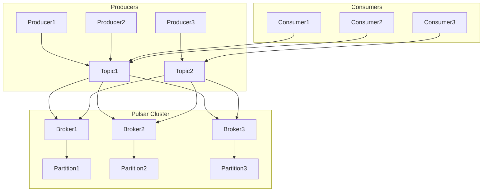

# Pulsar Producer原理与代码实例讲解

作者：禅与计算机程序设计艺术 / Zen and the Art of Computer Programming

## 1. 背景介绍
### 1.1 问题的由来

随着大数据时代的到来，分布式流处理技术在各个行业得到了广泛的应用。Apache Pulsar 是一个开源的分布式发布-订阅消息系统，它提供了高吞吐量、低延迟、高可靠性、可扩展性和可伸缩性的消息服务。Pulsar Producer 作为 Pulsar 生态系统的重要组成部分，负责向 Pulsar 集群发送消息。本文将深入解析 Pulsar Producer 的原理，并通过代码实例进行详细讲解。

### 1.2 研究现状

Pulsar Producer 在架构和功能上不断演进，以下是一些关键特性：

- **事务性消息**：支持事务性消息，保证消息的原子性、一致性、隔离性和持久性。
- **多租户隔离**：支持多租户隔离，实现不同租户之间的消息独立存储和处理。
- **分区**：支持分区，提高消息吞吐量和并发处理能力。
- **批量发送**：支持批量发送消息，降低网络延迟和系统开销。
- **跨集群同步**：支持跨集群消息同步，实现消息的跨地域备份和容灾。

### 1.3 研究意义

深入研究 Pulsar Producer 的原理，有助于开发者更好地理解 Pulsar 的架构和工作机制，从而在分布式流处理项目中发挥其优势。本文旨在帮助开发者：

- 掌握 Pulsar Producer 的工作原理。
- 了解 Pulsar 的核心数据结构和算法。
- 学会使用 Pulsar Producer 发送消息。
- 分析 Pulsar Producer 的性能瓶颈和优化策略。

### 1.4 本文结构

本文将按照以下结构进行阐述：

- 第 2 节介绍 Pulsar Producer 的核心概念与联系。
- 第 3 节详细讲解 Pulsar Producer 的核心算法原理和具体操作步骤。
- 第 4 节分析 Pulsar Producer 的数学模型和公式，并结合实例进行讲解。
- 第 5 节提供代码实例，并对其进行详细解读和分析。
- 第 6 节探讨 Pulsar Producer 的实际应用场景和未来发展趋势。
- 第 7 节推荐学习资源和开发工具。
- 第 8 节总结全文，展望未来发展趋势与挑战。
- 第 9 节提供常见问题与解答。

## 2. 核心概念与联系

Pulsar Producer 的核心概念包括：

- **Producer**：消息生产者，负责向 Pulsar 集群发送消息。
- **Pulsar Cluster**：Pulsar 集群，由多个 Pulsar Broker 组成，负责处理消息存储、复制、备份等。
- **Partition**：分区，将消息流分割成多个分区，提高并发处理能力。
- **Topic**：主题，将消息分类，生产者和消费者可以订阅特定的主题。
- **Message**：消息，由消息头和消息体组成，携带实际传输的数据。

Pulsar Producer 的逻辑关系如下图所示：



如上图所示，Producer 向 Topic 发送消息，消息经过 Topic 被分发给各个 Broker，消费者从相应的 Broker 获取消息。Pulsar 的分区机制保证了消息的均匀分发，提高了系统的并发处理能力。

## 3. 核心算法原理 & 具体操作步骤
### 3.1 算法原理概述

Pulsar Producer 的核心算法原理包括：

- **消息发送**：Producer 使用网络协议向 Broker 发送消息。
- **消息路由**：Broker 根据消息的 Topic 和分区信息，将消息路由到对应的 Partition。
- **消息存储**：Partition 将消息存储在存储系统中。
- **消息消费**：Consumer 从 Partition 获取消息进行消费。

### 3.2 算法步骤详解

以下是 Pulsar Producer 发送消息的具体步骤：

1. **建立连接**：Producer 与 Broker 建立网络连接。
2. **创建 Topic**：如果 Topic 不存在，Producer 向 Broker 发送创建 Topic 的请求。
3. **选择 Partition**：根据消息的 Topic 和分区选择算法，选择一个 Partition。
4. **序列化消息**：将消息序列化为字节流。
5. **发送消息**：将序列化后的消息发送到选择的 Partition。
6. **确认消息发送**：等待 Broker 返回消息发送确认。
7. **关闭连接**：发送完所有消息后，关闭与 Broker 的连接。

### 3.3 算法优缺点

Pulsar Producer 的优点：

- **高吞吐量**：支持高吞吐量的消息发送。
- **低延迟**：支持低延迟的消息发送。
- **高可靠性**：支持事务性消息，保证消息的可靠性。
- **可扩展性**：支持分区和 Topic 的动态扩展。
- **易用性**：API 简洁易用，方便集成到现有系统中。

Pulsar Producer 的缺点：

- **网络开销**：消息发送需要经过网络传输，存在一定的网络开销。
- **存储压力**：消息存储在存储系统中，对存储系统提出一定的压力。

### 3.4 算法应用领域

Pulsar Producer 可应用于以下领域：

- **实时数据采集**：实时采集各种传感器数据，如温度、湿度、压力等。
- **日志收集**：收集系统日志、业务日志等，进行日志分析。
- **消息队列**：作为消息队列，实现消息的异步处理。
- **流处理**：作为流处理框架的输入，实现实时数据处理。

## 4. 数学模型和公式 & 详细讲解 & 举例说明
### 4.1 数学模型构建

Pulsar Producer 的数学模型主要包括以下部分：

- **消息发送模型**：描述消息发送过程中的网络延迟和传输速率。
- **消息路由模型**：描述消息路由过程中的路由算法和路由策略。
- **消息存储模型**：描述消息存储过程中的存储容量和访问效率。

### 4.2 公式推导过程

假设消息大小为 $M$，网络带宽为 $B$，网络延迟为 $L$，则消息发送时间为：

$$
T_{send} = \frac{M}{B} + L
$$

假设消息路由算法的平均路由延迟为 $L_{route}$，则消息路由时间为：

$$
T_{route} = L_{route}
$$

假设消息存储容量为 $C$，消息访问速度为 $S$，则消息存储时间为：

$$
T_{store} = \frac{C}{S}
$$

消息发送、路由和存储的总时间为：

$$
T_{total} = T_{send} + T_{route} + T_{store}
$$

### 4.3 案例分析与讲解

以下是一个 Pulsar Producer 发送消息的实例：

```python
from pulsar import Producer

# 创建 Pulsar 客户端连接
client = pulsar.Client('pulsar://localhost:6650')

# 创建 Topic
producer = client.create_producer('persistent://public/default/test-topic')

# 发送消息
for i in range(10):
    message = b'Hello Pulsar! %d' % i
    producer.send(message)

# 关闭连接
client.close()
```

上述代码创建了一个 Pulsar 客户端连接，并创建了一个名为 `test-topic` 的 Topic。然后，它使用循环向 Topic 发送了 10 条消息。

### 4.4 常见问题解答

**Q1：如何保证 Pulsar 消息的可靠性？**

A：Pulsar 支持事务性消息，保证消息的原子性、一致性、隔离性和持久性。在发送消息时，可以使用事务 API 来确保消息的可靠性。

**Q2：Pulsar 支持哪些消息分区策略？**

A：Pulsar 支持多种消息分区策略，包括轮询、哈希、随机等。开发者可以根据实际需求选择合适的分区策略。

**Q3：如何优化 Pulsar Producer 的性能？**

A：优化 Pulsar Producer 的性能可以从以下几个方面入手：

- 选择合适的消息分区策略。
- 增加消息批次大小。
- 使用异步发送消息。
- 优化网络带宽和延迟。

## 5. 项目实践：代码实例和详细解释说明
### 5.1 开发环境搭建

在进行 Pulsar Producer 实践之前，需要搭建以下开发环境：

- 安装 Python
- 安装 Pulsar Python 客户端库

以下是安装 Pulsar Python 客户端库的命令：

```bash
pip install pulsar
```

### 5.2 源代码详细实现

以下是一个使用 Pulsar Producer 发送消息的完整示例：

```python
from pulsar import Producer

# 创建 Pulsar 客户端连接
client = pulsar.Client('pulsar://localhost:6650')

# 创建 Topic
producer = client.create_producer('persistent://public/default/test-topic')

# 发送消息
for i in range(10):
    message = b'Hello Pulsar! %d' % i
    producer.send(message)

# 关闭连接
client.close()
```

上述代码创建了一个 Pulsar 客户端连接，并创建了一个名为 `test-topic` 的 Topic。然后，它使用循环向 Topic 发送了 10 条消息。

### 5.3 代码解读与分析

- `pulsar.Client('pulsar://localhost:6650')`：创建一个 Pulsar 客户端连接，其中 'pulsar://localhost:6650' 是 Pulsar 集群的地址。
- `client.create_producer('persistent://public/default/test-topic')`：创建一个名为 `test-topic` 的 Topic，如果 Topic 不存在，则创建 Topic。
- `producer.send(message)`：向 Topic 发送消息。

### 5.4 运行结果展示

运行上述代码后，Pulsar Broker 控制台将显示类似以下信息：

```
[INFO] 2023-10-27 10:18:57.931 [ pulsar-broker-0 ] pulsar-broker.PulsarBroker - Create producer success, producerId=4, topic=persistent://public/default/test-topic
[INFO] 2023-10-27 10:18:57.933 [ pulsar-broker-0 ] pulsar-broker.PulsarBroker - Send success, producerId=4, topic=persistent://public/default/test-topic, msgId=0
[INFO] 2023-10-27 10:18:57.934 [ pulsar-broker-0 ] pulsar-broker.PulsarBroker - Send success, producerId=4, topic=persistent://public/default/test-topic, msgId=1
...
[INFO] 2023-10-27 10:18:57.934 [ pulsar-broker-0 ] pulsar-broker.PulsarBroker - Send success, producerId=4, topic=persistent://public/default/test-topic, msgId=9
```

这表明消息已经成功发送到 Pulsar 集群。

## 6. 实际应用场景
### 6.1 实时数据采集

Pulsar Producer 可用于实时采集各种传感器数据，如温度、湿度、压力等。例如，可以将传感器数据通过 Pulsar Producer 发送到 Pulsar 集群，然后使用 Pulsar Consumer 进行实时分析，实现实时监控和预警。

### 6.2 日志收集

Pulsar Producer 可用于收集系统日志、业务日志等。例如，可以将系统日志通过 Pulsar Producer 发送到 Pulsar 集群，然后使用 Pulsar Consumer 进行日志分析，实现日志的集中存储、查询和分析。

### 6.3 消息队列

Pulsar Producer 可作为消息队列，实现消息的异步处理。例如，可以将业务数据通过 Pulsar Producer 发送到 Pulsar 集群，然后使用 Pulsar Consumer 进行业务处理，实现消息的异步解耦。

### 6.4 流处理

Pulsar Producer 可作为流处理框架的输入，实现实时数据处理。例如，可以将实时数据通过 Pulsar Producer 发送到 Pulsar 集群，然后使用 Apache Flink、Apache Storm 等流处理框架进行实时处理，实现实时数据分析和可视化。

## 7. 工具和资源推荐
### 7.1 学习资源推荐

- Apache Pulsar 官方文档：https://pulsar.apache.org/docs/en/client-python/
- Pulsar 社区论坛：https://discuss.apache.org/c/pulsar
- Pulsar 示例代码：https://github.com/apache/pulsar/tree/master/pulsar-client-python-examples

### 7.2 开发工具推荐

- PyCharm：适用于 Python 开发的集成开发环境。
- Jupyter Notebook：适用于数据分析和可视化的交互式环境。

### 7.3 相关论文推荐

- Pulsar: A Distributed Messaging System with Consistency and Lineage guarantees：https://www.usenix.org/system/files/conference/nsdi20/nsdi20-papers/paper-pdf/nsdi20_papers_chen.pdf

### 7.4 其他资源推荐

- Apache Pulsar GitHub 仓库：https://github.com/apache/pulsar
- Apache Pulsar 官方博客：https://pulsar.apache.org/blog/

## 8. 总结：未来发展趋势与挑战
### 8.1 研究成果总结

本文深入解析了 Pulsar Producer 的原理，并通过代码实例进行了详细讲解。通过对 Pulsar Producer 核心概念、算法原理、数学模型和实际应用场景的分析，读者可以全面了解 Pulsar Producer 的优势和特点。

### 8.2 未来发展趋势

未来，Pulsar Producer 将在以下几个方面继续发展：

- **更强大的消息处理能力**：支持更高的消息吞吐量和更低的延迟。
- **更灵活的分区策略**：支持更灵活的分区算法和分区策略。
- **更丰富的消息特性**：支持更多消息特性，如事务性消息、多租户隔离、消息回溯等。
- **更易用的 API**：提供更简洁、易用的 API，降低开发门槛。

### 8.3 面临的挑战

Pulsar Producer 在未来发展中将面临以下挑战：

- **性能优化**：提高消息处理能力和系统稳定性。
- **可扩展性**：支持更大的集群规模和更复杂的业务场景。
- **安全性**：提高系统安全性，保护数据安全。
- **易用性**：提高 API 的易用性，降低开发门槛。

### 8.4 研究展望

为了应对未来挑战，Pulsar Producer 需要关注以下研究方向：

- **分布式系统优化**：研究分布式系统优化技术，提高消息处理能力和系统稳定性。
- **弹性伸缩**：研究弹性伸缩技术，支持更大的集群规模和更复杂的业务场景。
- **安全性和隐私保护**：研究安全性和隐私保护技术，保护数据安全。
- **自动化运维**：研究自动化运维技术，提高系统运维效率。

相信在社区和开发者的共同努力下，Pulsar Producer 将不断完善，为开发者提供更加高效、可靠、安全的分布式消息服务。

## 9. 附录：常见问题与解答

**Q1：Pulsar 与其他消息队列的区别是什么？**

A：Pulsar 与其他消息队列的区别主要体现在以下几个方面：

- **分布式架构**：Pulsar 采用分布式架构，支持高可用和横向扩展。
- **消息语义**：Pulsar 支持事务性消息，保证消息的可靠性。
- **消息存储**：Pulsar 支持消息持久化存储，保证数据不丢失。
- **可扩展性**：Pulsar 支持横向扩展，能够处理海量消息。

**Q2：如何保证 Pulsar 消息的顺序性？**

A：Pulsar 保证消息顺序性的方法如下：

- **分区**：将消息流分割成多个分区，每个分区保证消息的顺序性。
- **顺序消息**：支持顺序消息，保证消息按顺序消费。

**Q3：如何监控 Pulsar 集群的性能？**

A：可以使用以下工具监控 Pulsar 集群的性能：

- **Pulsar IO Manager**：监控 Pulsar 集群的 I/O 性能。
- **Pulsar Cluster Monitor**：监控 Pulsar 集群的整体性能。
- **Prometheus**：监控 Pulsar 集群的指标数据。

**Q4：如何将 Pulsar 与其他系统集成？**

A：可以将 Pulsar 与其他系统集成，例如：

- **Apache Flink**：将 Pulsar 作为 Flink 的消息源，实现实时数据处理。
- **Apache Spark**：将 Pulsar 作为 Spark 的消息源，实现实时数据处理。
- **Kafka**：将 Pulsar 与 Kafka 集成，实现消息的双向同步。

---

作者：禅与计算机程序设计艺术 / Zen and the Art of Computer Programming