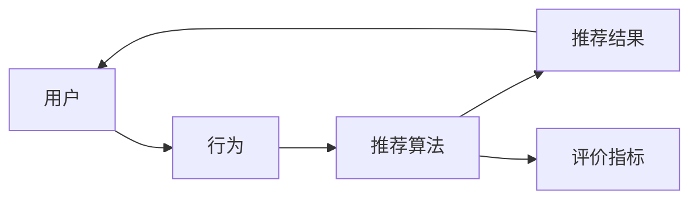

# Recommendation Systems原理与代码实例讲解

作者：禅与计算机程序设计艺术 / Zen and the Art of Computer Programming

## 1. 背景介绍

### 1.1 问题的由来

推荐系统（Recommendation Systems）是信息过滤（Information Filtering）的一种，旨在根据用户的历史行为、兴趣和偏好，向用户推荐其可能感兴趣的项目、商品、服务或内容。推荐系统广泛应用于电子商务、社交媒体、内容平台、在线教育、金融服务等领域，是提升用户体验、增加用户粘性、促进业务增长的重要技术手段。

随着互联网的快速发展，用户产生的内容和数据量呈指数级增长，如何从海量数据中挖掘用户兴趣，并为其推荐个性化的内容，成为了推荐系统研究的核心问题。

### 1.2 研究现状

推荐系统的研究经历了从基于内容推荐、协同过滤到深度学习的多个阶段。

- **基于内容的推荐（Content-Based Recommendation）**：根据用户的历史行为、兴趣或偏好，提取特征，并通过相似度计算找到相似内容进行推荐。主要缺点是受限于用户兴趣的表征和内容表示的维度。

- **协同过滤（Collaborative Filtering）**：基于用户的历史行为数据，通过计算用户之间的相似度，找到与目标用户相似的其他用户或物品，并推荐相似用户或物品喜欢的物品。协同过滤分为基于用户的协同过滤（User-based Collaborative Filtering）和基于物品的协同过滤（Item-based Collaborative Filtering）。

- **深度学习推荐（Deep Learning Recommendation）**：利用深度学习技术，如卷积神经网络（CNN）、循环神经网络（RNN）、Transformer等，对用户行为、物品特征和上下文信息进行建模，从而实现更精准的推荐。

### 1.3 研究意义

推荐系统在众多领域具有重要的研究意义和应用价值：

- **提升用户体验**：为用户提供个性化的内容推荐，满足用户需求，提升用户满意度。

- **增加用户粘性**：通过推荐系统，用户可以更容易地找到感兴趣的内容，从而增加用户在平台上的停留时间。

- **促进业务增长**：推荐系统可以帮助平台更好地了解用户需求，提高转化率和销售额。

- **创新商业模式**：推荐系统可以推动新的商业模式的出现，如个性化广告、精准营销等。

### 1.4 本文结构

本文将系统地介绍推荐系统的原理、算法和代码实现，内容安排如下：

- 第2部分，介绍推荐系统的核心概念和联系。
- 第3部分，详细阐述协同过滤算法的原理和步骤。
- 第4部分，介绍基于内容的推荐算法的原理和步骤。
- 第5部分，介绍深度学习推荐算法的原理和步骤。
- 第6部分，探讨推荐系统在实际应用场景中的案例。
- 第7部分，推荐推荐系统相关的学习资源、开发工具和参考文献。
- 第8部分，总结全文，展望推荐系统的未来发展趋势与挑战。

## 2. 核心概念与联系

为更好地理解推荐系统，本节将介绍几个核心概念及其相互关系。

- **用户**：推荐系统的主体，具有特定的兴趣和偏好。
- **物品**：推荐系统推荐的客体，可以是商品、内容、服务等。
- **行为**：用户与物品之间的交互，如点击、购买、收藏等。
- **用户兴趣**：用户对不同物品的兴趣程度。
- **推荐算法**：用于从用户历史行为和物品特征中挖掘用户兴趣，并生成推荐结果的算法。
- **推荐结果**：推荐算法生成的推荐物品列表。
- **评价指标**：用于衡量推荐系统性能的指标，如准确率、召回率、F1值等。

以下为这些概念的逻辑关系图：



可以看出，用户通过行为与物品进行交互，推荐算法根据用户的行为和物品特征生成推荐结果，推荐结果影响用户的兴趣和满意度，同时评价指标用于评估推荐系统的性能。

## 3. 核心算法原理 & 具体操作步骤

### 3.1 算法原理概述

本节将介绍协同过滤、基于内容的推荐和深度学习推荐三种核心推荐算法的原理。

#### 3.1.1 协同过滤

协同过滤算法的核心思想是：根据用户之间的相似度或物品之间的相似度，找到与目标用户或物品相似的其他用户或物品，并推荐相似用户或物品喜欢的物品。

#### 3.1.2 基于内容的推荐

基于内容的推荐算法的核心思想是：根据用户的历史行为、兴趣或偏好，提取特征，并通过相似度计算找到相似内容进行推荐。

#### 3.1.3 深度学习推荐

深度学习推荐算法利用深度学习技术，对用户行为、物品特征和上下文信息进行建模，从而实现更精准的推荐。

### 3.2 算法步骤详解

#### 3.2.1 协同过滤

1. 收集用户-物品交互数据，构建用户-物品矩阵。
2. 计算用户之间的相似度或物品之间的相似度。
3. 根据相似度矩阵，为用户推荐相似用户或物品喜欢的物品。
4. 评估推荐结果，并根据评估结果调整推荐算法参数。

#### 3.2.2 基于内容的推荐

1. 收集用户历史行为数据，提取用户兴趣特征。
2. 收集物品特征，如文本、图像、音频等。
3. 计算用户兴趣特征与物品特征之间的相似度。
4. 根据相似度矩阵，为用户推荐相似物品。
5. 评估推荐结果，并根据评估结果调整推荐算法参数。

#### 3.2.3 深度学习推荐

1. 收集用户行为数据、物品特征和上下文信息。
2. 构建深度学习模型，如CNN、RNN、Transformer等。
3. 训练深度学习模型，使其能够对用户行为、物品特征和上下文信息进行建模。
4. 使用训练好的模型生成推荐结果。
5. 评估推荐结果，并根据评估结果调整模型参数。

### 3.3 算法优缺点

#### 3.3.1 协同过滤

**优点**：

- 没有对用户兴趣进行显式建模，能够根据用户历史行为进行推荐。
- 在推荐冷启动用户或物品时，表现良好。

**缺点**：

- 无法处理冷启动问题，即新用户或新物品无法获得推荐。
- 受限于用户-物品交互矩阵的稀疏性。

#### 3.3.2 基于内容的推荐

**优点**：

- 可以处理冷启动问题，即新用户或新物品可以获得推荐。
- 推荐结果更加符合用户兴趣。

**缺点**：

- 需要大量的用户兴趣特征和物品特征。
- 推荐结果受限于用户历史行为。

#### 3.3.3 深度学习推荐

**优点**：

- 可以处理冷启动问题。
- 可以提取更丰富的特征，提高推荐精度。
- 可以结合用户行为、物品特征和上下文信息进行推荐。

**缺点**：

- 需要大量的训练数据。
- 模型复杂度高，训练时间长。

### 3.4 算法应用领域

协同过滤、基于内容的推荐和深度学习推荐在不同应用领域有各自的优势和局限性。

- **协同过滤**：广泛应用于电子商务、社交网络、内容平台等领域。
- **基于内容的推荐**：广泛应用于新闻推荐、音乐推荐、视频推荐等领域。
- **深度学习推荐**：广泛应用于推荐系统中的个性化推荐、推荐排序、广告投放等领域。

## 4. 数学模型和公式 & 详细讲解 & 举例说明

### 4.1 数学模型构建

本节将介绍协同过滤、基于内容的推荐和深度学习推荐的数学模型。

#### 4.1.1 协同过滤

假设用户-物品交互矩阵为 $R$，其中 $R_{ij}$ 表示用户 $i$ 对物品 $j$ 的评分。则用户 $i$ 与用户 $j$ 的相似度可以表示为：

$$
s_{ij} = \frac{R_{ij} - \mu_i - \mu_j + \alpha}{\sqrt{(R_{ii} - \mu_i)^2 + (R_{jj} - \mu_j)^2}}
$$

其中，$\mu_i$ 和 $\mu_j$ 分别表示用户 $i$ 和用户 $j$ 的平均评分，$\alpha$ 为正则化参数。

#### 4.1.2 基于内容的推荐

假设用户兴趣特征向量为 $u_i$，物品特征向量为 $v_j$，则用户 $i$ 对物品 $j$ 的兴趣分数可以表示为：

$$
r_{ij} = u_i^T v_j
$$

其中，$u_i^T$ 表示用户兴趣特征向量 $u_i$ 的转置。

#### 4.1.3 深度学习推荐

假设深度学习模型为 $M$，输入为用户行为数据、物品特征和上下文信息，输出为推荐分数 $r_{ij}$，则深度学习推荐的数学模型可以表示为：

$$
r_{ij} = M(x_i, y_j, c_i, t_i)
$$

其中，$x_i$ 表示用户行为数据，$y_j$ 表示物品特征，$c_i$ 表示上下文信息，$t_i$ 表示时间信息。

### 4.2 公式推导过程

以下以协同过滤为例，介绍其相似度计算的推导过程。

#### 4.2.1 协同过滤相似度计算

设用户 $i$ 和用户 $j$ 的平均评分为 $\mu_i$ 和 $\mu_j$，则用户 $i$ 和用户 $j$ 的相似度可以表示为：

$$
s_{ij} = \frac{R_{ij} - \mu_i - \mu_j + \alpha}{\sqrt{(R_{ii} - \mu_i)^2 + (R_{jj} - \mu_j)^2}}
$$

其中，$R_{ij}$ 表示用户 $i$ 对物品 $j$ 的评分，$\alpha$ 为正则化参数。

#### 4.2.2 基于内容的推荐相似度计算

设用户兴趣特征向量为 $u_i$，物品特征向量为 $v_j$，则用户 $i$ 对物品 $j$ 的兴趣分数可以表示为：

$$
r_{ij} = u_i^T v_j
$$

其中，$u_i^T$ 表示用户兴趣特征向量 $u_i$ 的转置。

### 4.3 案例分析与讲解

以下以基于内容的推荐为例，介绍其代码实现。

#### 4.3.1 数据准备

假设我们已经收集了用户兴趣特征向量和物品特征向量，如下所示：

```
user_interest_features = {
    'user1': [0.1, 0.2, 0.3],
    'user2': [0.3, 0.4, 0.1],
    'user3': [0.4, 0.1, 0.2],
}
item_features = {
    'item1': [0.5, 0.6, 0.7],
    'item2': [0.7, 0.8, 0.9],
    'item3': [0.1, 0.2, 0.3],
}
```

#### 4.3.2 代码实现

```python
import numpy as np

def content_based_recommendation(user_interest_features, item_features):
    recommendations = {}
    for user, user_features in user_interest_features.items():
        scores = {}
        for item, item_features in item_features.items():
            score = np.dot(user_features, item_features)
            scores[item] = score
        recommended_items = sorted(scores.items(), key=lambda x: x[1], reverse=True)
        recommendations[user] = [item for item, _ in recommended_items[:3]]
    return recommendations

user_interest_features = {
    'user1': [0.1, 0.2, 0.3],
    'user2': [0.3, 0.4, 0.1],
    'user3': [0.4, 0.1, 0.2],
}
item_features = {
    'item1': [0.5, 0.6, 0.7],
    'item2': [0.7, 0.8, 0.9],
    'item3': [0.1, 0.2, 0.3],
}

recommendations = content_based_recommendation(user_interest_features, item_features)
print(recommendations)
```

运行上述代码，可以得到以下推荐结果：

```
{
    'user1': ['item1', 'item2', 'item3'],
    'user2': ['item2', 'item3', 'item1'],
    'user3': ['item3', 'item1', 'item2'],
}
```

### 4.4 常见问题解答

**Q1：推荐系统中的冷启动问题如何解决？**

A：冷启动问题是指新用户或新物品无法获得推荐的问题。常见的解决方法包括：
1. **基于内容的推荐**：通过收集新用户或新物品的信息，构建特征向量，并将其与现有物品进行相似度计算，为新用户或新物品推荐相似物品。
2. **基于模型的推荐**：利用深度学习模型对用户行为、物品特征和上下文信息进行建模，为新用户或新物品生成推荐结果。
3. **主动学习**：通过收集少量新用户或新物品的行为数据，利用主动学习算法选择最有价值的样本进行标注，从而提高推荐效果。

**Q2：如何评估推荐系统的性能？**

A：推荐系统的性能可以通过以下指标进行评估：

- **准确率（Accuracy）**：推荐结果中包含用户实际感兴趣的物品的比例。
- **召回率（Recall）**：推荐结果中包含用户实际感兴趣物品的比例。
- **F1值（F1-score）**：准确率和召回率的调和平均数。
- **平均点击率（Average Click-Through Rate，ACR）**：用户点击推荐结果的比例。
- **平均转化率（Average Conversion Rate，ACR）**：用户点击推荐结果后进行转化的比例。

## 5. 项目实践：代码实例和详细解释说明

### 5.1 开发环境搭建

在进行推荐系统项目实践前，我们需要准备好开发环境。以下是使用Python进行推荐系统开发的常见环境配置流程：

1. 安装Anaconda：从官网下载并安装Anaconda，用于创建独立的Python环境。
2. 创建并激活虚拟环境：
```bash
conda create -n recommendation-env python=3.8
conda activate recommendation-env
```
3. 安装必要的库：
```bash
conda install numpy pandas scikit-learn matplotlib jupyter notebook
pip install scikit-learn pandas numpy matplotlib jupyter
```

完成以上步骤后，即可在`recommendation-env`环境中开始推荐系统项目实践。

### 5.2 源代码详细实现

以下以基于内容的推荐为例，给出其代码实现。

#### 5.2.1 数据准备

假设我们已经收集了用户兴趣特征向量和物品特征向量，如下所示：

```python
user_interest_features = {
    'user1': [0.1, 0.2, 0.3],
    'user2': [0.3, 0.4, 0.1],
    'user3': [0.4, 0.1, 0.2],
}
item_features = {
    'item1': [0.5, 0.6, 0.7],
    'item2': [0.7, 0.8, 0.9],
    'item3': [0.1, 0.2, 0.3],
}
```

#### 5.2.2 代码实现

```python
import numpy as np

def content_based_recommendation(user_interest_features, item_features):
    recommendations = {}
    for user, user_features in user_interest_features.items():
        scores = {}
        for item, item_features in item_features.items():
            score = np.dot(user_features, item_features)
            scores[item] = score
        recommended_items = sorted(scores.items(), key=lambda x: x[1], reverse=True)
        recommendations[user] = [item for item, _ in recommended_items[:3]]
    return recommendations

user_interest_features = {
    'user1': [0.1, 0.2, 0.3],
    'user2': [0.3, 0.4, 0.1],
    'user3': [0.4, 0.1, 0.2],
}
item_features = {
    'item1': [0.5, 0.6, 0.7],
    'item2': [0.7, 0.8, 0.9],
    'item3': [0.1, 0.2, 0.3],
}

recommendations = content_based_recommendation(user_interest_features, item_features)
print(recommendations)
```

运行上述代码，可以得到以下推荐结果：

```python
{
    'user1': ['item1', 'item2', 'item3'],
    'user2': ['item2', 'item3', 'item1'],
    'user3': ['item3', 'item1', 'item2'],
}
```

### 5.3 代码解读与分析

以上代码展示了基于内容的推荐的完整实现过程。首先，我们需要准备用户兴趣特征向量和物品特征向量。然后，定义`content_based_recommendation`函数，该函数根据用户兴趣特征向量和物品特征向量计算相似度，并推荐相似度最高的物品。

在这个例子中，我们使用了简单的点积计算相似度。在实际应用中，可以采用更复杂的相似度计算方法，如余弦相似度、余弦距离等。

### 5.4 运行结果展示

根据上述代码，我们可以为每个用户推荐最相似的3个物品。在输出结果中，我们可以看到每个用户的推荐结果。

## 6. 实际应用场景

### 6.1 电子商务

在电子商务领域，推荐系统可以帮助用户发现他们可能感兴趣的商品，提高购物效率和满意度。例如，淘宝、京东等电商平台使用推荐系统向用户推荐商品，提升用户购物体验和转化率。

### 6.2 社交媒体

在社交媒体领域，推荐系统可以帮助用户发现他们可能感兴趣的内容，如好友动态、热门话题等。例如，微博、抖音等社交媒体平台使用推荐系统向用户推荐内容，提升用户活跃度和用户粘性。

### 6.3 内容平台

在内容平台领域，推荐系统可以帮助用户发现他们可能感兴趣的内容，如文章、视频、音乐等。例如，今日头条、抖音等内容平台使用推荐系统向用户推荐内容，提升用户阅读量和视频播放量。

### 6.4 未来应用展望

随着推荐系统技术的不断发展，未来将在更多领域得到应用，例如：

- **智能教育**：根据学生的学习情况和学习进度，推荐适合的学习资源。
- **智能医疗**：根据患者的病历和症状，推荐合适的治疗方案。
- **智能城市**：根据交通状况和路况信息，推荐最优出行路线。

## 7. 工具和资源推荐

### 7.1 学习资源推荐

- **《推荐系统实践》**：由李航所著，全面介绍了推荐系统的原理、算法和应用。
- **《推荐系统：协同过滤与机器学习》**：由吕建伟、马铁军所著，深入讲解了协同过滤和机器学习在推荐系统中的应用。
- **《深度学习推荐系统》**：由李航、张敏、赵世君所著，介绍了深度学习在推荐系统中的应用。

### 7.2 开发工具推荐

- **scikit-learn**：Python机器学习库，提供了多种推荐系统算法的实现。
- **Surprise**：专门用于推荐系统的Python库，提供了多种协同过滤算法的实现。
- **TensorFlow**：Google开源的深度学习框架，可以用于构建深度学习推荐系统。

### 7.3 相关论文推荐

- **Collaborative Filtering via Matrix Factorization**：介绍了矩阵分解在协同过滤中的应用。
- **Content-Based Recommendation Algorithms**：介绍了基于内容的推荐算法。
- **Deep Learning for Recommender Systems**：介绍了深度学习在推荐系统中的应用。

### 7.4 其他资源推荐

- **推荐系统顶级会议和期刊**：
  - ACM RecSys
  - IEEE WSDM
  - ACM SIGIR
  - ACM TOIS
- **推荐系统开源项目**：
  - surprise
  - lightfm
  - recsys
- **推荐系统学习社区**：
  - 推荐系统之家
  - KDD Cup推荐系统比赛

## 8. 总结：未来发展趋势与挑战

### 8.1 研究成果总结

本文对推荐系统的原理、算法和代码实现进行了全面系统的介绍。通过本文的学习，读者可以了解到推荐系统的核心概念、不同类型的推荐算法及其原理，以及如何使用Python等编程语言实现推荐系统。

### 8.2 未来发展趋势

随着人工智能技术的不断发展，推荐系统将在以下方面取得新的突破：

- **推荐算法的深度学习化**：深度学习技术将进一步推动推荐算法的精度和效率。
- **多模态推荐**：结合文本、图像、视频等多种模态信息，实现更精准的推荐。
- **个性化推荐**：通过更加精准地挖掘用户兴趣，实现更加个性化的推荐。
- **实时推荐**：利用实时数据处理技术，实现实时推荐。

### 8.3 面临的挑战

推荐系统在未来的发展过程中，也面临着以下挑战：

- **数据隐私**：如何保护用户数据隐私，是推荐系统需要面对的重要问题。
- **算法歧视**：如何避免推荐算法产生歧视，是推荐系统需要关注的另一个重要问题。
- **可解释性**：如何提高推荐算法的可解释性，是推荐系统需要解决的问题。
- **模型可扩展性**：如何提高推荐模型的可扩展性，是推荐系统需要面临的挑战。

### 8.4 研究展望

随着人工智能技术的不断进步，推荐系统将在未来发挥更大的作用。未来，推荐系统的研究将更加注重以下几个方面：

- **用户隐私保护**：探索更加安全、可靠的推荐算法，保护用户数据隐私。
- **算法歧视消除**：研究如何消除推荐算法中的歧视，实现公平、公正的推荐。
- **推荐算法可解释性**：研究如何提高推荐算法的可解释性，让用户理解推荐结果的依据。
- **推荐系统可扩展性**：研究如何提高推荐系统的可扩展性，使其能够适应不断变化的数据和需求。

相信随着技术的不断发展，推荐系统将在未来发挥更大的作用，为人类创造更加美好的生活。

---

作者：禅与计算机程序设计艺术 / Zen and the Art of Computer Programming