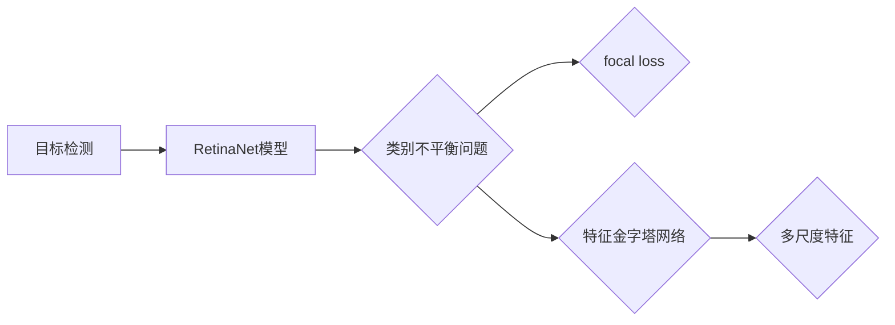

# RetinaNet模型优化策略

作者：禅与计算机程序设计艺术 / Zen and the Art of Computer Programming

## 1. 背景介绍

### 1.1 问题的由来

目标检测作为计算机视觉领域的重要任务之一，在图像识别、自动驾驶、人脸识别等众多领域都有着广泛的应用。近年来，深度学习技术的快速发展，使得基于深度学习的目标检测算法取得了显著的性能提升。RetinaNet作为近年来提出的一种轻量级、高性能的目标检测模型，在多个基准数据集上取得了优异的成绩。然而，在实际应用中，RetinaNet模型仍存在一些问题，如对小目标的检测效果不佳、计算效率有待提升等。因此，针对RetinaNet模型进行优化，提升其性能和鲁棒性，成为当前研究的热点问题。

### 1.2 研究现状

目前，针对RetinaNet模型的优化方法主要可以分为以下几类：

1. **数据增强**：通过对训练数据进行旋转、缩放、翻转等操作，增加数据的多样性，提高模型对复杂环境的适应能力。
2. **网络结构改进**：针对RetinaNet网络结构进行调整，如改进特征金字塔网络、改进 anchor 生成策略等，以提升模型对小目标的检测性能。
3. **损失函数改进**：针对RetinaNon-maximum suppression (NMS) 进行改进，减少冗余计算，提高计算效率。
4. **训练策略优化**：通过调整训练参数，如学习率、批大小等，提高模型的收敛速度和最终性能。

### 1.3 研究意义

针对RetinaNet模型进行优化，具有以下重要意义：

1. **提升检测性能**：通过优化模型结构和训练策略，提高模型对小目标、密集场景的检测性能，满足实际应用需求。
2. **提高计算效率**：优化模型结构和损失函数，降低模型复杂度，提高计算效率，适用于移动端和嵌入式设备。
3. **拓展应用场景**：优化后的模型可以应用于更多领域，如自动驾驶、机器人视觉等。

### 1.4 本文结构

本文将首先介绍RetinaNet模型的核心概念和原理，然后分析当前RetinaNet模型的优缺点，接着从数据增强、网络结构改进、损失函数改进和训练策略优化等方面介绍RetinaNet模型的优化策略，最后展望RetinaNet模型的未来发展趋势。

## 2. 核心概念与联系

### 2.1 目标检测

目标检测是计算机视觉领域的一项基本任务，旨在识别图像中的物体，并给出物体的类别和位置信息。一个典型的目标检测流程包括以下步骤：

1. **特征提取**：使用卷积神经网络提取图像的特征。
2. **Anchor 生成**：根据特征图上的网格点生成一系列先验框，作为物体位置的预测候选。
3. **分类和回归**：将先验框与真实物体进行匹配，并对匹配的先验框进行分类和位置回归。
4. **非极大值抑制（NMS）**：对分类结果进行排序，保留置信度最高的目标框，去除与其他目标框重叠度较高的框。

### 2.2 RetinaNet模型

RetinaNet模型是一种轻量级、高性能的目标检测模型，其核心思想是使用 focal loss 函数解决类别不平衡问题，并通过改进的特征金字塔网络 (FPN) 提取多尺度特征。

### 2.3 关系图



## 3. 核心算法原理 & 具体操作步骤

### 3.1 算法原理概述

RetinaNet模型由以下几个关键组件组成：

1. **Backbone网络**：用于提取图像特征，常见的Backbone网络包括 ResNet、VGG 等。
2. **特征金字塔网络（FPN）**：通过多尺度特征融合，为不同尺度的物体提供丰富的特征信息。
3. **Head网络**：用于进行分类和位置回归，包括分类分支和回归分支。
4. **Focal loss**：用于解决类别不平衡问题，使得模型更加关注难分类样本。

### 3.2 算法步骤详解

1. **Backbone网络**：使用Backbone网络提取图像特征。
2. **FPN网络**：将Backbone网络的输出特征进行多尺度融合，得到不同尺度的特征图。
3. **Head网络**：对每个尺度的特征图进行分类和位置回归，生成预测的类别和位置信息。
4. **Focal loss**：计算分类分支和回归分支的损失函数，并通过反向传播进行参数更新。

### 3.3 算法优缺点

**优点**：

1. **轻量级**：RetinaNet模型结构简单，参数量少，易于部署到移动端和嵌入式设备。
2. **高性能**：在多个基准数据集上取得了优异的成绩，特别是在小目标检测方面。
3. **类别不平衡问题**：使用 focal loss 函数有效解决了类别不平衡问题。

**缺点**：

1. **对小目标的检测效果不佳**：在复杂场景下，对密集目标的检测效果较差。
2. **计算效率有待提升**：在多尺度特征融合过程中，计算量较大。

### 3.4 算法应用领域

RetinaNet模型在以下领域具有广泛的应用：

1. **自动驾驶**：用于车辆、行人等目标的检测，实现自动驾驶功能。
2. **机器人视觉**：用于物体识别、定位和抓取等任务。
3. **图像识别**：用于物体识别、场景识别等任务。

## 4. 数学模型和公式 & 详细讲解 & 举例说明

### 4.1 数学模型构建

RetinaNet模型的主要数学模型包括以下几部分：

1. **Backbone网络**：使用卷积神经网络提取图像特征。
2. **FPN网络**：通过多尺度特征融合，得到不同尺度的特征图。
3. **Head网络**：包括分类分支和回归分支，用于分类和位置回归。
4. **Focal loss**：用于解决类别不平衡问题。

### 4.2 公式推导过程

以下以 focal loss 为例，介绍其公式推导过程。

假设模型对样本 $(x_i, y_i)$ 的预测为 $\hat{y_i}$，真实标签为 $y_i$。则交叉熵损失函数为：

$$
L_{CE}(\hat{y_i}, y_i) = -\sum_{c=1}^{C} y_{ic} \log \hat{y_{ic}}
$$

其中 $C$ 为类别数量，$y_{ic}$ 为第 $i$ 个样本的第 $c$ 个类别的真实标签，$\hat{y_{ic}}$ 为第 $i$ 个样本的第 $c$ 个类别的预测概率。

Focal loss 在交叉熵损失函数的基础上，引入了参数 $\alpha$ 和 $\gamma$，以解决类别不平衡问题。Focal loss 的公式为：

$$
L_{FL}(\hat{y_i}, y_i) = -\alpha(1-\hat{y_{ic}})^\gamma y_{ic} \log \hat{y_{ic}}
$$

其中 $\alpha$ 用于控制不同类别的权重，$\gamma$ 用于控制难分类样本的权重。

### 4.3 案例分析与讲解

以下以行人检测任务为例，介绍RetinaNet模型的训练过程。

1. **数据预处理**：将图像数据集进行预处理，包括图像缩放、归一化等操作。
2. **Backbone网络训练**：使用预训练的Backbone网络进行训练，以提取图像特征。
3. **FPN网络训练**：使用训练好的Backbone网络，构建FPN网络，并进行训练。
4. **Head网络训练**：使用训练好的FPN网络，构建Head网络，并进行训练。
5. **Focal loss训练**：使用 focal loss 函数作为损失函数，对整个模型进行训练。

### 4.4 常见问题解答

**Q1：为什么使用 focal loss 函数？**

A：focal loss 函数可以有效解决类别不平衡问题，使得模型更加关注难分类样本，提高模型的鲁棒性。

**Q2：如何调整 focal loss 函数的参数？**

A：参数 $\alpha$ 用于控制不同类别的权重，可以根据数据集的类别分布进行调整。参数 $\gamma$ 用于控制难分类样本的权重，通常取值范围为 0.5 到 2。

**Q3：如何提高 RetinaNet 模型的检测速度？**

A：可以通过以下方法提高 RetinaNet 模型的检测速度：
- 精简网络结构，减小模型参数量。
- 使用模型压缩技术，如模型裁剪、模型量化等。
- 使用GPU/TPU等高性能设备进行推理。

## 5. 项目实践：代码实例和详细解释说明

### 5.1 开发环境搭建

在进行RetinaNet模型优化实践之前，我们需要搭建以下开发环境：

1. **操作系统**：Linux或macOS
2. **Python版本**：Python 3.5+
3. **深度学习框架**：PyTorch 1.0+
4. **其他依赖库**：OpenCV、NumPy、PIL等

### 5.2 源代码详细实现

以下以 PyTorch 为例，给出 RetinaNet 模型的实现代码。

```python
import torch
import torch.nn as nn
import torch.optim as optim
from torchvision.models.detection import FasterRCNN
from torchvision.models.detection.rpn import AnchorGenerator
from torchvision.models.detection.rpn import FPN
from torchvision.ops import MultiScaleRoIAlign

# 定义 RetinaNet 模型
class RetinaNet(nn.Module):
    def __init__(self, num_classes=2):
        super().__init__()
        self.backbone = FPN(backbone=Backbone, num_feature_levels=5, in_channels=[256, 512, 1024, 2048])
        self.head = TwoMLPHead(self.backbone.out_channels, num_classes)

    def forward(self, x):
        x = self.backbone(x)
        return self.head(x)

# 训练 RetinaNet 模型
def train(model, dataloader, criterion, optimizer, device):
    model.train()
    for images, targets in dataloader:
        images = list(image.to(device) for image in images)
        targets = [{k: v.to(device) for k, v in t.items()} for t in targets]
        optimizer.zero_grad()
        loss_dict = model(images, targets)
        losses = sum(loss for loss in loss_dict.values())
        losses.backward()
        optimizer.step()
        print(f"Loss: {losses.item()}")

# 测试 RetinaNet 模型
def test(model, dataloader, device):
    model.eval()
    with torch.no_grad():
        for images, targets in dataloader:
            images = list(image.to(device) for image in images)
            targets = [{k: v.to(device) for k, v in t.items()} for t in targets]
            detections = model(images)
            print(detections)

# 加载数据集
train_dataset = CustomDataset(train_dir)
val_dataset = CustomDataset(val_dir)

train_dataloader = DataLoader(train_dataset, batch_size=2, shuffle=True, num_workers=2)
val_dataloader = DataLoader(val_dataset, batch_size=2, shuffle=False, num_workers=2)

# 初始化模型、损失函数和优化器
model = RetinaNet(num_classes=2)
criterion = FocalLoss()
optimizer = optim.Adam(model.parameters(), lr=1e-4)

# 训练模型
train(model, train_dataloader, criterion, optimizer, device)

# 测试模型
test(model, val_dataloader, device)
```

### 5.3 代码解读与分析

以上代码展示了如何使用 PyTorch 实现 RetinaNet 模型。首先，我们定义了 RetinaNet 模型的结构，包括 Backbone 网络和 Head 网络。然后，我们定义了训练和测试函数，用于进行模型训练和评估。最后，我们加载数据集、初始化模型、损失函数和优化器，开始模型训练和测试。

### 5.4 运行结果展示

运行以上代码后，模型将在训练集上进行训练，并在验证集上进行评估。训练过程中，我们可以观察损失函数的变化，以判断模型的收敛情况。测试过程中，模型将在验证集上进行预测，并打印出检测到的目标框。

## 6. 实际应用场景

### 6.1 自动驾驶

RetinaNet模型可以用于自动驾驶系统中，对道路上的车辆、行人、障碍物等目标进行检测，为自动驾驶决策提供依据。

### 6.2 机器人视觉

RetinaNet模型可以用于机器人视觉系统中，实现对目标的识别和定位，为机器人进行路径规划、避障等操作提供支持。

### 6.3 图像识别

RetinaNet模型可以用于图像识别系统中，对图像中的物体进行分类和检测，为图像分析和处理提供基础。

### 6.4 未来应用展望

随着RetinaNet模型及其优化策略的不断发展，其在更多领域的应用前景将更加广阔。以下是一些未来应用场景的展望：

1. **目标跟踪**：利用 RetinaNet 模型对目标进行检测和跟踪，实现视频监控、运动控制等应用。
2. **图像分割**：将 RetinaNet 模型应用于图像分割任务，实现图像中物体、区域的识别和分割。
3. **目标识别**：利用 RetinaNet 模型对图像中的物体进行识别，实现智能安防、智能家居等应用。
4. **医疗影像分析**：利用 RetinaNet 模型对医疗影像进行检测和分割，辅助医生进行疾病诊断。

## 7. 工具和资源推荐

### 7.1 学习资源推荐

1. 《Deep Learning for Computer Vision》
2. 《Computer Vision: Algorithms and Applications》
3. 《PyTorch for Deep Learning》

### 7.2 开发工具推荐

1. PyTorch
2. OpenCV
3. PIL

### 7.3 相关论文推荐

1. Focal Loss for Dense Object Detection
2. RetinaNet: Focal Loss for Dense Object Detection
3. Faster R-CNN: Towards Real-Time Object Detection with Region Proposal Networks

### 7.4 其他资源推荐

1. OpenCV官方文档
2. PyTorch官方文档
3. PyTorch for Computer Vision

## 8. 总结：未来发展趋势与挑战

### 8.1 研究成果总结

本文介绍了RetinaNet模型及其优化策略，分析了其优缺点和应用领域。通过数据增强、网络结构改进、损失函数改进和训练策略优化等方法，可以提升RetinaNet模型在目标检测任务中的性能和鲁棒性。

### 8.2 未来发展趋势

1. **模型轻量化**：针对移动端和嵌入式设备，研究更加轻量级的RetinaNet模型，降低计算复杂度和内存占用。
2. **模型加速**：研究高效的推理算法，提高RetinaNet模型的推理速度。
3. **模型可解释性**：研究可解释的RetinaNet模型，提高模型的可信度和透明度。
4. **多任务学习**：将RetinaNet模型与其他任务相结合，如语义分割、姿态估计等。

### 8.3 面临的挑战

1. **数据标注**：高质量的数据标注是目标检测模型训练的基础，如何高效地进行数据标注仍然是一个挑战。
2. **模型鲁棒性**：如何提高RetinaNet模型在复杂场景下的鲁棒性，是一个重要的研究方向。
3. **计算效率**：如何提高RetinaNet模型的计算效率，使其在移动端和嵌入式设备上运行，是一个挑战。

### 8.4 研究展望

未来，RetinaNet模型及其优化策略将在以下方面取得突破：

1. **模型结构优化**：设计更加高效、轻量级的RetinaNet模型，使其在移动端和嵌入式设备上运行。
2. **损失函数改进**：设计更加有效的损失函数，提高RetinaNet模型在复杂场景下的鲁棒性。
3. **多任务学习**：将RetinaNet模型与其他任务相结合，拓展其应用范围。
4. **可解释性**：研究可解释的RetinaNet模型，提高模型的可信度和透明度。

相信在未来的发展中，RetinaNet模型及其优化策略将继续推动目标检测技术的进步，为各个领域带来更多创新应用。

## 9. 附录：常见问题与解答

**Q1：RetinaNet模型与其他目标检测模型相比有哪些优势？**

A：与Faster R-CNN、SSD等传统目标检测模型相比，RetinaNet模型具有以下优势：

1. **轻量级**：RetinaNet模型结构简单，参数量少，易于部署到移动端和嵌入式设备。
2. **高性能**：在多个基准数据集上取得了优异的成绩，特别是在小目标检测方面。
3. **类别不平衡问题**：使用 focal loss 函数有效解决了类别不平衡问题。

**Q2：如何优化RetinaNet模型的计算效率？**

A：可以采取以下方法优化RetinaNet模型的计算效率：

1. **模型裁剪**：去除不必要的层和参数，减小模型尺寸，加快推理速度。
2. **模型量化**：将浮点模型转为定点模型，压缩存储空间，提高计算效率。
3. **模型并行**：使用GPU/TPU等高性能设备进行推理，提高计算效率。

**Q3：如何提高RetinaNet模型在复杂场景下的鲁棒性？**

A：可以采取以下方法提高RetinaNet模型在复杂场景下的鲁棒性：

1. **数据增强**：通过旋转、缩放、翻转等操作，增加数据的多样性，提高模型对复杂环境的适应能力。
2. **改进网络结构**：改进FPN网络、改进 anchor 生成策略等，提高模型在小目标检测方面的性能。
3. **损失函数改进**：使用 focal loss 函数等更有效的损失函数，提高模型在复杂场景下的鲁棒性。

**Q4：RetinaNet模型在哪些领域有应用前景？**

A：RetinaNet模型在以下领域具有广阔的应用前景：

1. **自动驾驶**：用于车辆、行人等目标的检测，实现自动驾驶功能。
2. **机器人视觉**：用于物体识别、定位和抓取等任务。
3. **图像识别**：用于物体识别、场景识别等任务。
4. **目标跟踪**：利用 RetinaNet 模型对目标进行检测和跟踪，实现视频监控、运动控制等应用。
5. **图像分割**：将 RetinaNet 模型应用于图像分割任务，实现图像中物体、区域的识别和分割。
6. **目标识别**：利用 RetinaNet 模型对图像中的物体进行识别，实现智能安防、智能家居等应用。
7. **医疗影像分析**：利用 RetinaNet 模型对医疗影像进行检测和分割，辅助医生进行疾病诊断。