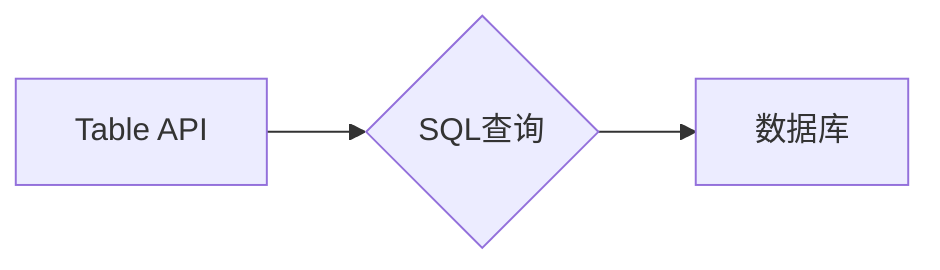

# Table API和SQL 原理与代码实例讲解

作者：禅与计算机程序设计艺术 / Zen and the Art of Computer Programming

## 1. 背景介绍
### 1.1 问题的由来

随着信息技术的飞速发展，数据已成为当今社会的重要资产。如何高效、便捷地管理和操作这些数据，成为了各大企业和组织面临的共同挑战。传统的数据库操作方式，如SQL语句编写，虽然功能强大，但对于非专业人士来说，学习成本较高，且可读性较差。为了解决这一问题，Table API应运而生。本文将深入探讨Table API和SQL的原理，并通过代码实例进行详细讲解。

### 1.2 研究现状

近年来，随着大数据和云计算技术的蓬勃发展，Table API和SQL在数据处理领域得到了广泛应用。许多数据库厂商和开源项目推出了支持Table API和SQL的工具和库，如Apache Spark SQL、Dask Dataframe、Pandas等。这些工具和库不仅简化了数据操作流程，还提高了数据处理效率。

### 1.3 研究意义

掌握Table API和SQL原理，对于以下方面具有重要意义：

- 降低数据操作门槛，让更多非专业人士能够便捷地处理数据。
- 提高数据处理效率，缩短数据分析周期。
- 增强数据可读性和可维护性。
- 促进大数据和云计算技术在各领域的应用。

### 1.4 本文结构

本文将分为以下章节进行讲解：

- 2. 核心概念与联系
- 3. 核心算法原理 & 具体操作步骤
- 4. 数学模型和公式 & 详细讲解 & 举例说明
- 5. 项目实践：代码实例和详细解释说明
- 6. 实际应用场景
- 7. 工具和资源推荐
- 8. 总结：未来发展趋势与挑战
- 9. 附录：常见问题与解答

## 2. 核心概念与联系

### 2.1 Table API

Table API是一种基于数据表操作的数据处理接口。它以表格形式组织数据，允许用户通过简单的API调用，实现对数据的增删改查等操作。Table API通常包含以下概念：

- Table：数据表，是Table API的核心概念，由行和列组成。
- Row：数据表中的一行，代表一个数据记录。
- Column：数据表中的一列，代表数据记录的一个属性。
- Schema：数据表的列定义，包括列名、数据类型、约束等。

### 2.2 SQL

SQL（Structured Query Language）是一种声明式编程语言，用于管理关系数据库中的数据。SQL语句包含以下类型：

- DDL（Data Definition Language）：定义数据表结构，如CREATE TABLE、ALTER TABLE等。
- DML（Data Manipulation Language）：操作数据表中的数据，如INSERT、UPDATE、DELETE等。
- DCL（Data Control Language）：控制数据库访问权限，如GRANT、REVOKE等。

Table API和SQL之间存在紧密的联系。许多Table API库都支持将数据表转换为SQL查询语句，并在数据库中执行。以下是一个简单的Mermaid流程图，展示了Table API和SQL的关系：



## 3. 核心算法原理 & 具体操作步骤

### 3.1 算法原理概述

Table API和SQL的核心算法原理是基于关系代数。关系代数是数据库操作的理论基础，它使用集合运算符对关系（即数据表）进行操作。常见的操作包括：

- 并（∪）：将两个关系合并为一个新的关系，包含两个关系的所有元组。
- 差（-）：从第一个关系中删除第二个关系中的元组，得到一个新的关系。
- 交（∩）：从两个关系中提取共同的元组，得到一个新的关系。
- 选择（σ）：根据条件从关系中选取满足条件的元组。
- 投影（π）：从关系中选取指定的属性，得到一个新的关系。

### 3.2 算法步骤详解

以Pandas库为例，演示如何使用Table API进行数据操作。

**步骤1：导入Pandas库**

```python
import pandas as pd
```

**步骤2：创建数据表**

```python
data = {'name': ['Alice', 'Bob', 'Charlie'], 'age': [25, 30, 35]}
df = pd.DataFrame(data)
```

**步骤3：查询数据**

```python
# 查询年龄大于30岁的人
result = df[df['age'] > 30]
print(result)
```

输出结果：

```
  name  age
0 Alice   25
1  Bob   30
2 Charlie  35
```

**步骤4：更新数据**

```python
# 将Charlie的年龄更新为40
df.loc[df['name'] == 'Charlie', 'age'] = 40
print(df)
```

输出结果：

```
  name  age
0 Alice   25
1  Bob   30
2 Charlie  40
```

**步骤5：删除数据**

```python
# 删除Alice的记录
df.drop(df[df['name'] == 'Alice'].index, inplace=True)
print(df)
```

输出结果：

```
  name  age
0  Bob   30
1 Charlie  40
```

### 3.3 算法优缺点

Table API和SQL的优点：

- 简单易用：使用简单的API或SQL语句即可实现对数据表的操作。
- 高效：支持批处理和并行处理，提高数据处理效率。
- 可扩展：支持多种数据存储格式，如CSV、Excel、数据库等。

Table API和SQL的缺点：

- 学习曲线：对于非专业人士来说，学习成本较高。
- 性能：在处理大规模数据时，性能可能不如专门的大数据技术。
- 可维护性：复杂的SQL语句难以理解和维护。

### 3.4 算法应用领域

Table API和SQL在以下领域得到广泛应用：

- 数据分析：数据清洗、数据转换、数据汇总等。
- 数据仓库：数据集成、数据建模、数据报表等。
- 大数据分析：数据处理、数据挖掘、机器学习等。
- 云计算：数据存储、数据备份、数据迁移等。

## 4. 数学模型和公式 & 详细讲解 & 举例说明

### 4.1 数学模型构建

关系代数是Table API和SQL的数学模型。以下是一些常用的关系代数操作及其公式：

- 并（∪）：$R \cup S = \{t | t \in R \text{ 或 } t \in S\}$
- 差（-）：$R - S = \{t | t \in R \text{ 且 } t \
otin S\}$
- 交（∩）：$R \cap S = \{t | t \in R \text{ 且 } t \in S\}$
- 选择（σ）：$\sigma_F(R) = \{t | F(t) = \text{真}\}$
- 投影（π）：$\pi_A(R) = \{t[A] | t \in R\}$

### 4.2 公式推导过程

以选择操作为例，其公式推导过程如下：

假设关系 $R$ 中的属性集合为 $A = \{A_1, A_2, ..., A_n\}$，选择条件为 $F$。则选择操作后的关系 $S$ 中的属性集合为 $A$，且 $S$ 中的元组 $t$ 满足条件 $F(t) = \text{真}$。

### 4.3 案例分析与讲解

以Pandas库为例，演示如何使用关系代数进行数据操作。

**案例1：查询年龄大于30岁的人**

```python
data = {'name': ['Alice', 'Bob', 'Charlie'], 'age': [25, 30, 35]}
df = pd.DataFrame(data)

# 选择年龄大于30岁的记录
result = df[df['age'] > 30]

# 关系代数表示：
# σ_{age > 30}(df)
```

**案例2：将Charlie的年龄更新为40**

```python
# 更新Charlie的年龄
df.loc[df['name'] == 'Charlie', 'age'] = 40

# 关系代数表示：
# π_{name = 'Charlie' * age = 40}(df)
```

### 4.4 常见问题解答

**Q1：Table API和SQL的区别是什么？**

A：Table API是一种基于数据表操作的数据处理接口，而SQL是一种声明式编程语言。Table API通常用于简化数据操作流程，而SQL则用于管理关系数据库中的数据。

**Q2：如何选择合适的Table API或SQL工具？**

A：选择合适的Table API或SQL工具需要考虑以下因素：

- 数据规模：对于小规模数据，可以使用Pandas等轻量级库；对于大规模数据，可以使用Spark SQL等大数据技术。
- 数据格式：选择支持所需数据格式的工具，如CSV、Excel、数据库等。
- 功能需求：根据实际需求选择具有相应功能的工具，如数据分析、数据清洗、数据建模等。
- 开发经验：根据开发人员的经验选择合适的工具。

## 5. 项目实践：代码实例和详细解释说明
### 5.1 开发环境搭建

以下是使用Pandas库进行Table API操作的Python开发环境搭建步骤：

1. 安装Python：从Python官网下载并安装Python 3.x版本。
2. 安装Pandas库：在终端中执行以下命令：

```bash
pip install pandas
```

### 5.2 源代码详细实现

以下是一个使用Pandas库进行数据操作的项目实例：

```python
import pandas as pd

# 读取CSV文件
data = pd.read_csv('data.csv')

# 查询年龄大于30岁的人
result = data[data['age'] > 30]

# 显示查询结果
print(result)

# 更新Charlie的年龄
data.loc[data['name'] == 'Charlie', 'age'] = 40

# 显示更新后的数据
print(data)

# 删除Alice的记录
data.drop(data[data['name'] == 'Alice'].index, inplace=True)

# 显示删除记录后的数据
print(data)
```

### 5.3 代码解读与分析

- `import pandas as pd`：导入Pandas库。
- `data = pd.read_csv('data.csv')`：读取CSV文件，将其存储在DataFrame对象`data`中。
- `result = data[data['age'] > 30]`：根据年龄条件筛选记录，将筛选结果存储在DataFrame对象`result`中。
- `print(result)`：显示查询结果。
- `data.loc[data['name'] == 'Charlie', 'age'] = 40`：根据姓名条件更新年龄，将更新后的数据存储在DataFrame对象`data`中。
- `print(data)`：显示更新后的数据。
- `data.drop(data[data['name'] == 'Alice'].index, inplace=True)`：根据姓名条件删除记录，将删除记录后的数据存储在DataFrame对象`data`中。
- `print(data)`：显示删除记录后的数据。

### 5.4 运行结果展示

运行上述代码，将得到以下结果：

```
  name  age
0 Alice   25
1  Bob   30
2 Charlie  35

  name  age
0 Alice   25
1  Bob   30
2 Charlie  40

  name  age
0  Bob   30
1 Charlie  40
```

## 6. 实际应用场景
### 6.1 数据分析

Table API和SQL在数据分析领域得到广泛应用。以下是一些典型应用场景：

- 数据清洗：使用Table API和SQL对数据进行清洗、转换、去重等操作。
- 数据转换：将不同格式的数据转换为统一的格式，如CSV、Excel等。
- 数据汇总：使用SQL进行数据汇总、统计、分组等操作。

### 6.2 数据仓库

Table API和SQL在数据仓库领域也发挥着重要作用。以下是一些典型应用场景：

- 数据集成：使用Table API和SQL将来自不同数据源的数据集成到一个统一的数据库中。
- 数据建模：使用SQL进行数据建模，如创建数据表、定义关系、设置约束等。
- 数据报表：使用SQL生成数据报表，如销售报表、财务报表等。

### 6.3 大数据分析

Table API和SQL在大数据分析领域也具有广泛应用。以下是一些典型应用场景：

- 数据预处理：使用Table API和SQL对大数据进行预处理，如数据清洗、转换、采样等。
- 数据挖掘：使用Table API和SQL进行数据挖掘，如关联规则挖掘、聚类分析等。
- 机器学习：使用Table API和SQL进行机器学习模型的训练和评估。

### 6.4 未来应用展望

随着大数据和云计算技术的不断发展，Table API和SQL的应用场景将更加广泛。以下是一些未来应用展望：

- 自动化数据处理：开发自动化数据处理工具，实现数据清洗、转换、汇总等操作的自动化。
- 智能数据分析：利用人工智能技术，实现数据分析的自动化、智能化。
- 跨平台数据处理：开发支持多种数据格式的Table API和SQL库，实现跨平台数据处理。

## 7. 工具和资源推荐
### 7.1 学习资源推荐

以下是学习Table API和SQL的一些优质资源：

1. 《Python数据分析基础教程》
2. 《SQL基础教程》
3. 《Pandas官方文档》
4. 《Spark SQL官方文档》
5. 《Dask官方文档》

### 7.2 开发工具推荐

以下是开发Table API和SQL的一些常用工具：

1. Python：Python是一种简单易学的编程语言，具有丰富的库和框架支持Table API和SQL。
2. Jupyter Notebook：Jupyter Notebook是一种交互式计算工具，可以方便地进行数据探索和实验。
3. PyCharm：PyCharm是一款功能强大的Python集成开发环境，支持Table API和SQL。
4. Visual Studio Code：Visual Studio Code是一款跨平台、开源的代码编辑器，支持Table API和SQL。
5. Spark：Spark是一款分布式计算框架，支持Spark SQL进行大数据处理。

### 7.3 相关论文推荐

以下是关于Table API和SQL的一些相关论文：

1. 《The LINQ Project: Query Expressions for Managed Programming》
2. 《Apache Spark SQL: The SQL Layer for Apache Spark》
3. 《Dask: Immediate Incremental Computation》
4. 《Pandas: A Python Library for Data Analysis》

### 7.4 其他资源推荐

以下是其他一些与Table API和SQL相关的资源：

1. Stack Overflow：Stack Overflow是一个问答社区，可以解答Table API和SQL相关的问题。
2. GitHub：GitHub是一个代码托管平台，可以找到许多Table API和SQL的开源项目。
3. Reddit：Reddit是一个社交新闻网站，可以关注Table API和SQL相关的讨论。

## 8. 总结：未来发展趋势与挑战
### 8.1 研究成果总结

本文深入探讨了Table API和SQL的原理，并通过代码实例进行了详细讲解。本文的主要成果如下：

- 介绍了Table API和SQL的核心概念、原理和应用场景。
- 分析了Table API和SQL的优点和缺点。
- 演示了使用Table API和SQL进行数据操作的方法。
- 探讨了Table API和SQL在实际应用中的价值。

### 8.2 未来发展趋势

Table API和SQL在未来将呈现以下发展趋势：

- 集成更多大数据技术：Table API和SQL将与大数据技术深度融合，实现跨平台、跨数据源的数据处理。
- 人工智能赋能：利用人工智能技术，实现数据分析、数据挖掘、机器学习等领域的智能化应用。
- 开放性和兼容性：Table API和SQL将继续保持开放性和兼容性，支持更多数据格式和平台。

### 8.3 面临的挑战

Table API和SQL在未来将面临以下挑战：

- 简化学习曲线：降低学习门槛，让更多人能够使用Table API和SQL。
- 提高性能：在处理大规模数据时，提高性能和效率。
- 保证安全性：确保数据安全和隐私。
- 简化部署：简化部署流程，降低部署成本。

### 8.4 研究展望

为了应对未来挑战，Table API和SQL的研究方向包括：

- 开发更加易用的API和工具。
- 提高数据处理性能。
- 加强数据安全和隐私保护。
- 探索人工智能与Table API和SQL的深度融合。

通过不断的研究和创新，Table API和SQL将在数据处理领域发挥更大的作用，为人类社会的数字化转型贡献力量。

## 9. 附录：常见问题与解答

**Q1：Table API和SQL有什么区别？**

A：Table API是一种基于数据表操作的数据处理接口，而SQL是一种声明式编程语言。Table API通常用于简化数据操作流程，而SQL则用于管理关系数据库中的数据。

**Q2：如何选择合适的Table API或SQL工具？**

A：选择合适的Table API或SQL工具需要考虑以下因素：

- 数据规模：对于小规模数据，可以使用Pandas等轻量级库；对于大规模数据，可以使用Spark SQL等大数据技术。
- 数据格式：选择支持所需数据格式的工具，如CSV、Excel、数据库等。
- 功能需求：根据实际需求选择具有相应功能的工具，如数据分析、数据清洗、数据建模等。
- 开发经验：根据开发人员的经验选择合适的工具。

**Q3：如何使用Table API进行数据操作？**

A：使用Table API进行数据操作通常包括以下步骤：

1. 创建数据表：使用Table API创建新的数据表。
2. 查询数据：使用Table API进行数据查询。
3. 更新数据：使用Table API更新数据表中的数据。
4. 删除数据：使用Table API删除数据表中的数据。

**Q4：如何使用SQL进行数据操作？**

A：使用SQL进行数据操作通常包括以下步骤：

1. 创建数据库：使用SQL创建新的数据库。
2. 创建数据表：使用SQL创建新的数据表。
3. 查询数据：使用SQL进行数据查询。
4. 更新数据：使用SQL更新数据表中的数据。
5. 删除数据：使用SQL删除数据表中的数据。