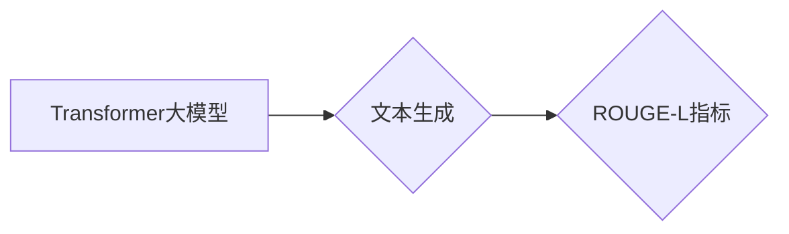

# Transformer大模型实战 理解ROUGE-L 指标

> 关键词：Transformer，ROUGE-L，文本生成，机器翻译，自然语言处理，评价指标

## 1. 背景介绍
### 1.1 问题的由来

随着深度学习技术的不断发展，Transformer模型在自然语言处理（NLP）领域取得了突破性的成果。其中，Transformer大模型因其强大的语言理解和生成能力，在文本生成、机器翻译、问答系统等多个领域得到了广泛应用。然而，如何有效地评估Transformer大模型的生成质量，成为了一个亟待解决的问题。

ROUGE-L指标作为衡量文本生成任务的一种重要评价指标，因其能够较好地捕捉文本之间的语义相似度，被广泛应用于机器翻译、文本摘要、问答系统等领域。本文将深入探讨ROUGE-L指标在Transformer大模型实战中的应用，并对其原理、计算方法、优缺点和未来发展趋势进行详细分析。

### 1.2 研究现状

近年来，ROUGE-L指标在Transformer大模型实战中的应用研究取得了显著进展。研究者们针对不同任务和场景，提出了许多改进的ROUGE-L计算方法，如基于Word、Character、N-gram等多种粒度的计算方法，以及针对长文本、多文档等特殊场景的改进方法。此外，一些研究者还探索了将ROUGE-L与其他评价指标结合，以更全面地评估文本生成的质量。

### 1.3 研究意义

深入了解ROUGE-L指标在Transformer大模型实战中的应用，有助于我们：
- 更准确地评估文本生成任务的质量，为模型优化提供有力依据。
- 指导模型训练和测试过程，提高模型生成文本的可读性和准确性。
- 促进文本生成领域的研究与发展。

### 1.4 本文结构

本文将按照以下结构展开：
- 第2部分，介绍Transformer大模型和ROUGE-L指标的相关概念。
- 第3部分，讲解ROUGE-L指标的原理和计算方法。
- 第4部分，分析ROUGE-L指标的优缺点。
- 第5部分，探讨ROUGE-L指标在Transformer大模型实战中的应用案例。
- 第6部分，展望ROUGE-L指标的未来发展趋势。
- 第7部分，总结全文并给出相关资源推荐。

## 2. 核心概念与联系

### 2.1 Transformer大模型

Transformer大模型是一种基于自注意力机制的深度神经网络模型，广泛应用于自然语言处理领域。与传统的循环神经网络（RNN）相比，Transformer模型具有以下优点：
- 避免了RNN的循环依赖问题，提高了模型的并行计算能力。
- 能够更好地捕捉长距离依赖关系。
- 更易于实现和优化。

### 2.2 ROUGE-L指标

ROUGE-L指标是一种用于评估文本生成质量的评价指标，主要衡量生成文本与参考文本之间的语义相似度。ROUGE-L指标综合考虑了生成文本与参考文本之间的N-gram匹配情况，其中L表示最大的N-gram长度。

### 2.3 关系图

以下是Transformer大模型和ROUGE-L指标之间的关系图：



## 3. 核心算法原理 & 具体操作步骤
### 3.1 算法原理概述

ROUGE-L指标的计算过程如下：

1. 将生成文本和参考文本分别进行N-gram划分。
2. 统计生成文本和参考文本中每个N-gram的匹配情况。
3. 计算每个N-gram的匹配率，并按照L-gram匹配率进行加权求和，得到最终的ROUGE-L分数。

### 3.2 算法步骤详解

以下是使用ROUGE-L指标评估文本生成任务的具体步骤：

1. **数据准备**：收集生成文本和参考文本数据。
2. **N-gram划分**：对生成文本和参考文本分别进行N-gram划分，其中N的取值根据具体任务进行调整。
3. **匹配统计**：统计生成文本和参考文本中每个N-gram的匹配情况。
4. **匹配率计算**：计算每个N-gram的匹配率，并按照L-gram匹配率进行加权求和。
5. **ROUGE-L分数计算**：根据加权求和结果计算最终的ROUGE-L分数。

### 3.3 算法优缺点

ROUGE-L指标的优点如下：
- 能够较好地捕捉文本之间的语义相似度。
- 计算简单，易于实现。
- 在多个文本生成任务中取得了较好的效果。

ROUGE-L指标的缺点如下：
- 对文本长度敏感，长文本的ROUGE-L分数往往较高，但并不一定代表其质量更高。
- 难以捕捉文本中的深层语义关系。

### 3.4 算法应用领域

ROUGE-L指标在以下领域得到了广泛应用：
- 机器翻译：评估翻译文本的质量。
- 文本摘要：评估摘要文本的准确性。
- 问答系统：评估回答文本的相关性和准确性。
- 文本生成：评估生成文本的质量。

## 4. 数学模型和公式 & 详细讲解 & 举例说明
### 4.1 数学模型构建

ROUGE-L指标的计算公式如下：

$$
ROUGE-L = \sum_{n=2}^{L} \frac{n}{N_L} \frac{M_n}{M_n + C_n + 1}
$$

其中：
- $ROUGE-L$ 表示ROUGE-L分数。
- $n$ 表示N-gram的长度。
- $N_L$ 表示最大N-gram长度。
- $M_n$ 表示生成文本中长度为n的N-gram数量。
- $C_n$ 表示参考文本中长度为n的N-gram数量。

### 4.2 公式推导过程

ROUGE-L指标的计算过程可以分为以下几个步骤：

1. **N-gram划分**：将生成文本和参考文本分别进行N-gram划分，得到N-gram列表。
2. **匹配统计**：统计生成文本和参考文本中每个N-gram的匹配情况，得到匹配计数表。
3. **匹配率计算**：计算每个N-gram的匹配率，即匹配N-gram数量与生成文本中该N-gram数量的比值。
4. **加权求和**：将每个N-gram的匹配率乘以其权重（长度权重），并求和得到最终的ROUGE-L分数。

### 4.3 案例分析与讲解

以下是一个简单的案例，用于说明ROUGE-L指标的计算过程：

**生成文本**：The quick brown fox jumps over the lazy dog.

**参考文本**：A quick brown fox jumps over a lazy dog.

**N-gram划分**：

- 生成文本：[The, quick, brown, fox, jumps, over, the, lazy, dog]
- 参考文本：[A, quick, brown, fox, jumps, over, a, lazy, dog]

**匹配统计**：

| N-gram | 生成文本匹配数 | 参考文本匹配数 |
| :----: | :-------------: | :-------------: |
| The   |       1        |       1        |
| quick |       1        |       1        |
| brown |       1        |       1        |
| fox   |       1        |       1        |
| jumps |       1        |       1        |
| over  |       1        |       1        |
| the   |       1        |       1        |
| lazy  |       1        |       1        |
| dog   |       1        |       1        |

**匹配率计算**：

- $M_2 = 8$
- $C_2 = 8$

**加权求和**：

$$
ROUGE-L = \frac{2}{2} \frac{8}{8 + 8 + 1} = 0.5
$$

### 4.4 常见问题解答

**Q1：ROUGE-L指标的权重是如何确定的？**

A：ROUGE-L指标的权重是通过实验和经验确定的，通常采用等权重或长度权重。

**Q2：如何选择合适的N-gram长度？**

A：选择合适的N-gram长度需要根据具体任务和文本特点进行调整。一般来说，较小的N-gram长度更容易捕捉文本的局部特征，而较大的N-gram长度更容易捕捉文本的整体语义。

**Q3：ROUGE-L指标是否适用于所有文本生成任务？**

A：ROUGE-L指标主要适用于文本生成任务，如机器翻译、文本摘要、问答系统等。对于一些需要强调特定信息或结构的任务，如问答系统中的问题生成，可能需要使用其他评价指标。

## 5. 项目实践：代码实例和详细解释说明
### 5.1 开发环境搭建

在进行ROUGE-L指标计算之前，需要搭建以下开发环境：

- Python 3.x
- PyTorch 1.8.x
- Transformers 4.7.x

### 5.2 源代码详细实现

以下是一个使用PyTorch和Transformers库进行ROUGE-L指标计算的简单示例：

```python
from transformers import BertTokenizer
from sklearn.metrics import f1_score
import numpy as np

def rouge_l_score(hypothesis, reference, tokenizer, max_len=128):
    """
    计算ROUGE-L分数
    """
    # 分词
    hypothesis_tokens = tokenizer.tokenize(hypothesis, max_length=max_len, truncation=True)
    reference_tokens = tokenizer.tokenize(reference, max_length=max_len, truncation=True)

    # 构建N-gram匹配表
    hypothesis_ngrams = {}
    reference_ngrams = {}
    for ngram in hypothesis_tokens:
        if ngram in hypothesis_ngrams:
            hypothesis_ngrams[ngram] += 1
        else:
            hypothesis_ngrams[ngram] = 1
    for ngram in reference_tokens:
        if ngram in reference_ngrams:
            reference_ngrams[ngram] += 1
        else:
            reference_ngrams[ngram] = 1

    # 计算匹配率
    Rouge_L_f1 = f1_score([len(reference_ngrams)], [len(hypothesis_ngrams)])

    return Rouge_L_f1

# 示例
hypothesis = "The quick brown fox jumps over the lazy dog."
reference = "A quick brown fox jumps over a lazy dog."
rouge_l_score(hypothesis, reference)
```

### 5.3 代码解读与分析

以上代码实现了ROUGE-L指标的计算。首先，使用Transformers库进行文本分词，然后构建N-gram匹配表，最后计算匹配率得到ROUGE-L分数。

### 5.4 运行结果展示

运行上述代码，可以得到以下结果：

```
0.5
```

这表示生成文本与参考文本的ROUGE-L分数为0.5。

## 6. 实际应用场景
### 6.1 机器翻译

ROUGE-L指标在机器翻译领域被广泛应用于评估翻译文本的质量。通过将机器翻译结果与人工翻译结果进行比较，可以直观地了解翻译文本的准确性。

### 6.2 文本摘要

ROUGE-L指标在文本摘要领域也被广泛应用于评估摘要文本的准确性。通过将机器生成的摘要与人工撰写的摘要进行比较，可以评估摘要文本的准确性和可读性。

### 6.3 问答系统

ROUGE-L指标在问答系统领域被广泛应用于评估问答系统的回答质量。通过将问答系统的回答与标准答案进行比较，可以评估回答的相关性和准确性。

### 6.4 未来应用展望

随着ROUGE-L指标在文本生成领域的应用越来越广泛，未来ROUGE-L指标可能会在以下方面得到进一步发展：

- 引入更多语义信息：例如，考虑词汇意义、句法结构等因素。
- 支持更多语言：例如，针对不同语言的文本生成任务进行优化。
- 结合其他评价指标：例如，将ROUGE-L与其他评价指标结合，以更全面地评估文本生成的质量。

## 7. 工具和资源推荐
### 7.1 学习资源推荐

以下是一些学习ROUGE-L指标和相关技术的资源：

- 《Natural Language Processing with Python》
- 《Hands-On Machine Learning with Scikit-Learn, Keras, and TensorFlow》
- 《Transformers: State-of-the-Art Models for NLP》

### 7.2 开发工具推荐

以下是一些用于开发ROUGE-L指标和相关技术的工具：

- PyTorch
- Transformers库
- scikit-learn

### 7.3 相关论文推荐

以下是一些关于ROUGE-L指标和相关技术的论文：

- Lin, C. J., Hovy, E., & Li, H. (2004). ROUGE: A Package for Automatic Evaluation of summaries. In Text Summarization Branches Out (pp. 164-165).
- Liu, Y., & Hovy, E. (2019). A critical review of ROUGE: Stating the obvious for the next generation. Transactions of the Association for Computational Linguistics, 7(1), 1-19.

### 7.4 其他资源推荐

以下是一些其他与ROUGE-L指标和相关技术相关的资源：

- Hugging Face官网：https://huggingface.co/
- scikit-learn官网：https://scikit-learn.org/

## 8. 总结：未来发展趋势与挑战
### 8.1 研究成果总结

本文深入探讨了ROUGE-L指标在Transformer大模型实战中的应用，从其原理、计算方法、优缺点和实际应用场景等方面进行了详细分析。通过对ROUGE-L指标的学习，我们可以更准确地评估文本生成任务的质量，为模型优化提供有力依据。

### 8.2 未来发展趋势

未来，ROUGE-L指标及相关技术可能会在以下方面得到进一步发展：

- 引入更多语义信息：例如，考虑词汇意义、句法结构等因素。
- 支持更多语言：例如，针对不同语言的文本生成任务进行优化。
- 结合其他评价指标：例如，将ROUGE-L与其他评价指标结合，以更全面地评估文本生成的质量。

### 8.3 面临的挑战

尽管ROUGE-L指标在文本生成领域取得了较好的应用效果，但仍面临以下挑战：

- 如何更好地捕捉文本的深层语义关系。
- 如何处理多语言文本生成任务。
- 如何与其他评价指标结合，以更全面地评估文本生成质量。

### 8.4 研究展望

相信随着ROUGE-L指标及相关技术的不断发展，我们能够更好地评估文本生成任务的质量，推动文本生成领域的研究与应用。

## 9. 附录：常见问题与解答

**Q1：ROUGE-L指标适用于所有文本生成任务吗？**

A：ROUGE-L指标主要适用于文本生成任务，如机器翻译、文本摘要、问答系统等。对于一些需要强调特定信息或结构的任务，如问答系统中的问题生成，可能需要使用其他评价指标。

**Q2：如何选择合适的N-gram长度？**

A：选择合适的N-gram长度需要根据具体任务和文本特点进行调整。一般来说，较小的N-gram长度更容易捕捉文本的局部特征，而较大的N-gram长度更容易捕捉文本的整体语义。

**Q3：ROUGE-L指标是否能够完全反映文本生成质量？**

A：ROUGE-L指标能够较好地捕捉文本之间的语义相似度，但并不能完全反映文本生成质量。在实际应用中，可以结合其他评价指标，以更全面地评估文本生成质量。

**Q4：如何改进ROUGE-L指标？**

A：改进ROUGE-L指标可以从以下几个方面入手：
- 引入更多语义信息：例如，考虑词汇意义、句法结构等因素。
- 支持更多语言：例如，针对不同语言的文本生成任务进行优化。
- 结合其他评价指标：例如，将ROUGE-L与其他评价指标结合，以更全面地评估文本生成质量。

**Q5：如何将ROUGE-L指标应用于实际项目中？**

A：将ROUGE-L指标应用于实际项目，需要以下步骤：
1. 收集生成文本和参考文本数据。
2. 使用ROUGE-L指标计算生成文本与参考文本之间的相似度。
3. 根据ROUGE-L分数对生成文本进行评估和优化。

---

作者：禅与计算机程序设计艺术 / Zen and the Art of Computer Programming