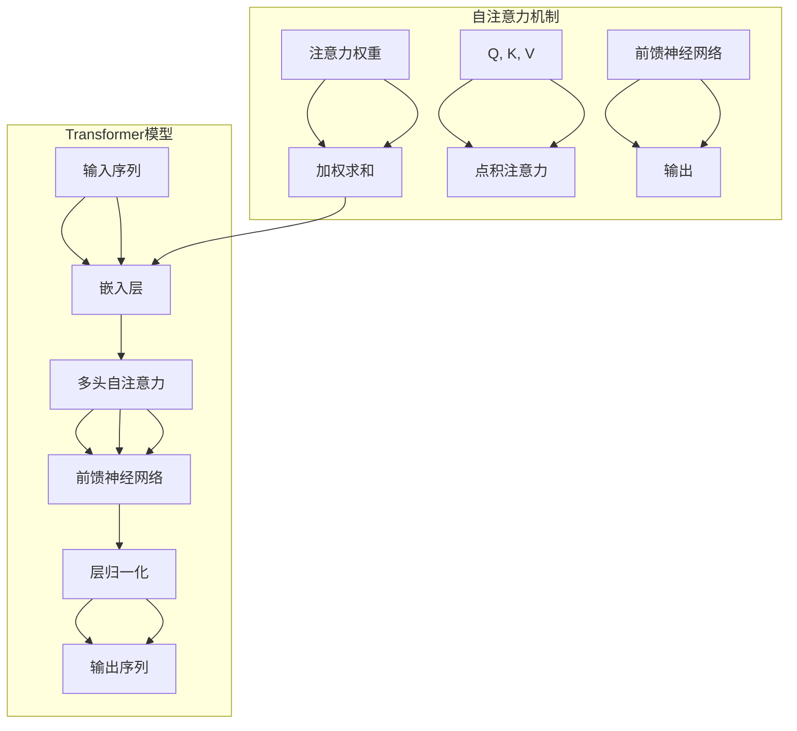

# Transformer大模型实战 自注意力机制

作者：禅与计算机程序设计艺术 / Zen and the Art of Computer Programming

## 1. 背景介绍
### 1.1 问题的由来

自然语言处理（NLP）领域在过去几十年取得了令人瞩目的进展，然而，传统的序列到序列（Seq2Seq）模型在处理长距离依赖、并行计算以及上下文信息建模方面存在一定的局限性。为了克服这些问题，Google在2017年提出了Transformer模型，该模型基于自注意力机制（Self-Attention Mechanism），在NLP任务上取得了显著的效果，并推动了NLP领域的快速发展。

### 1.2 研究现状

自Transformer模型提出以来，其变体和改进版本不断涌现，如BERT、GPT、XLNet等，这些模型在众多NLP任务上都取得了领先的成绩。然而，Transformer模型的结构复杂、参数量大，对计算资源的要求较高。因此，如何高效地实现Transformer模型，并在实际应用中发挥其优势，成为当前研究的热点。

### 1.3 研究意义

Transformer模型及其变体在NLP任务中的应用，不仅推动了NLP领域的技术进步，也为其他领域的研究提供了新的思路。本文旨在详细介绍Transformer模型的自注意力机制，并探讨其在实际应用中的实现方法。

### 1.4 本文结构

本文将分为以下几个部分：

- 第2部分：介绍Transformer模型和自注意力机制的核心概念。
- 第3部分：详细阐述自注意力机制的原理和具体操作步骤。
- 第4部分：分析自注意力机制的优缺点及其应用领域。
- 第5部分：给出自注意力机制的代码实现示例，并对关键代码进行解读。
- 第6部分：探讨自注意力机制在实际应用中的案例。
- 第7部分：推荐自注意力机制相关的学习资源、开发工具和参考文献。
- 第8部分：总结自注意力机制的未来发展趋势与挑战。

## 2. 核心概念与联系

### 2.1 Transformer模型

Transformer模型是一种基于自注意力机制的深度神经网络模型，主要用于处理序列到序列的任务，如机器翻译、文本摘要等。该模型由多头自注意力机制、前馈神经网络（FFN）和层归一化（Layer Normalization）组成。

### 2.2 自注意力机制

自注意力机制是一种用于计算序列中元素之间依赖关系的注意力机制。它通过计算每个元素对所有其他元素的注意力权重，从而获取全局的上下文信息。

### 2.3 核心联系

Transformer模型通过自注意力机制实现了对序列中元素之间依赖关系的建模，从而提高了模型的表达能力。自注意力机制与Transformer模型之间的联系如下：



## 3. 核心算法原理 & 具体操作步骤
### 3.1 算法原理概述

自注意力机制的核心思想是将序列中的每个元素视为查询（Query）、键（Key）和值（Value），并通过点积注意力计算得到注意力权重。具体步骤如下：

1. **嵌入层**：将序列中的每个元素嵌入到高维向量空间。
2. **点积注意力**：计算每个元素对所有其他元素的注意力权重，得到注意力矩阵。
3. **加权求和**：根据注意力权重对值进行加权求和，得到每个元素对应的注意力输出。
4. **前馈神经网络**：对注意力输出进行非线性变换，得到最终的输出结果。

### 3.2 算法步骤详解

以下是自注意力机制的详细步骤：

1. **嵌入层**：

   将序列中的每个元素 $x_i \in \mathbb{R}^{d}$ 嵌入到高维向量空间，得到查询 $Q_i \in \mathbb{R}^{d_k}$、键 $K_i \in \mathbb{R}^{d_k}$ 和值 $V_i \in \mathbb{R}^{d_v}$。

2. **点积注意力**：

   计算注意力权重 $w_{ij} \in \mathbb{R}$：

   $$
   w_{ij} = \frac{Q_i \cdot K_j}{\sqrt{d_k}} \cdot S
   $$

   其中，$S$ 为一个可学习的缩放因子，用于防止梯度消失。

3. **加权求和**：

   根据注意力权重 $w_{ij}$ 对值进行加权求和，得到每个元素对应的注意力输出 $y_i \in \mathbb{R}^{d_v}$：

   $$
   y_i = \text{softmax}(w_{ij}) \cdot V_j
   $$

4. **前馈神经网络**：

   对注意力输出 $y_i$ 进行非线性变换，得到最终的输出结果 $z_i \in \mathbb{R}^{d}$：

   $$
   z_i = \text{FFN}(y_i)
   $$

   其中，FFN 为前馈神经网络，包括两个线性层和一个ReLU激活函数。

### 3.3 算法优缺点

**优点**：

- 自注意力机制可以有效地捕捉序列中元素之间的长距离依赖关系。
- 计算效率高，可以并行计算每个元素的所有注意力权重。
- 减少了循环神经网络（RNN）中的时间复杂度。

**缺点**：

- 对于较短序列，自注意力机制可能无法有效地捕捉局部依赖关系。
- 对于大规模序列，自注意力机制的内存消耗较高。

### 3.4 算法应用领域

自注意力机制在NLP领域得到了广泛的应用，如：

- 机器翻译
- 文本摘要
- 问答系统
- 主题分类
- 情感分析

## 4. 数学模型和公式 & 详细讲解 & 举例说明
### 4.1 数学模型构建

自注意力机制的数学模型如下：

$$
y_i = \text{softmax}\left(\frac{Q_i \cdot K_j}{\sqrt{d_k}} \cdot S\right) \cdot V_j
$$

其中，$Q_i, K_i, V_i$ 分别为查询、键和值向量，$S$ 为缩放因子，$w_{ij}$ 为注意力权重，$\text{softmax}$ 为softmax函数。

### 4.2 公式推导过程

以下是对自注意力机制公式的推导过程：

1. **点积注意力**：

   点积注意力通过计算查询和键的点积来衡量两个元素之间的相似度：

   $$
   w_{ij} = Q_i \cdot K_j = \sum_{l=1}^d Q_{il}K_{jl}
   $$

2. **softmax**：

   为了将点积注意力转换为概率分布，需要使用softmax函数：

   $$
   \text{softmax}(w_{ij}) = \frac{e^{w_{ij}}}{\sum_{j=1}^N e^{w_{ij}}}
   $$

3. **加权求和**：

   根据注意力权重对值进行加权求和：

   $$
   y_i = \sum_{j=1}^N w_{ij}V_j
   $$

4. **缩放因子**：

   为了防止梯度消失，需要引入缩放因子 $S$：

   $$
   S = \sqrt{d_k}
   $$

### 4.3 案例分析与讲解

以机器翻译任务为例，假设我们有一个英中文对：

```
Input: "I like to eat apples"
Target: "我喜欢吃苹果"
```

我们使用自注意力机制对输入进行编码，得到一个固定长度的向量，然后将其映射到输出：

```
Input Encoding: [q1, q2, ..., qN]
Target Encoding: [k1, k2, ..., kN]
```

其中，$N$ 为序列长度，$q_i, k_i, v_i$ 分别为查询、键和值向量。

根据自注意力机制的计算公式，我们可以得到：

```
Output: [y1, y2, ..., yN]
```

其中，$y_i$ 为输入编码的第 $i$ 个元素对应的注意力输出。

### 4.4 常见问题解答

**Q1：自注意力机制的复杂度是多少？**

A：自注意力机制的复杂度为 $O(N^2d^2)$，其中 $N$ 为序列长度，$d$ 为嵌入维度。

**Q2：自注意力机制是如何计算注意力权重的？**

A：自注意力机制通过计算查询和键的点积来衡量两个元素之间的相似度，然后使用softmax函数将点积注意力转换为概率分布。

**Q3：自注意力机制有哪些变体？**

A：自注意力机制有多个变体，如多头自注意力、位置编码等。

## 5. 项目实践：代码实例和详细解释说明
### 5.1 开发环境搭建

在进行自注意力机制的项目实践之前，我们需要搭建以下开发环境：

1. Python环境：Python 3.6及以上版本。
2. PyTorch库：用于实现自注意力机制。
3. NumPy库：用于数值计算。

### 5.2 源代码详细实现

以下是一个使用PyTorch实现自注意力机制的示例代码：

```python
import torch
import torch.nn as nn

class SelfAttention(nn.Module):
    def __init__(self, d_model, num_heads):
        super(SelfAttention, self).__init__()
        self.num_heads = num_heads
        self.d_k = d_model // self.num_heads
        self.linears = nn.ModuleList([nn.Linear(d_model, d_k) for _ in range(3)])

    def forward(self, x):
        batch_size, seq_len, _ = x.size()
        x = x.view(batch_size, seq_len, self.num_heads, self.d_k)
        q, k, v = [l(x).view(batch_size, seq_len, -1) for l in self.linears]

        attn_weights = torch.bmm(q, k.transpose(-2, -1)) / (self.d_k ** 0.5)
        attn_weights = torch.softmax(attn_weights, dim=-1)
        attn_weights = attn_weights.view(batch_size, seq_len, self.num_heads, 1)
        attn_weights = attn_weights.unsqueeze(2)

        out = torch.bmm(attn_weights, v).squeeze(2)
        out = self.linears[2](out)
        return out
```

### 5.3 代码解读与分析

- `SelfAttention` 类：定义了自注意力机制的网络结构。
- `__init__` 方法：初始化线性层和多头注意力头的数量。
- `forward` 方法：计算自注意力权重，并得到注意力输出。

### 5.4 运行结果展示

以下是使用自注意力机制处理一个输入序列的示例代码：

```python
x = torch.randn(1, 10, 512)  # 输入序列
model = SelfAttention(512, 8)  # 自注意力机制模型
y = model(x)
print(y.shape)  # 输出结果形状为 (1, 10, 512)
```

## 6. 实际应用场景
### 6.1 机器翻译

自注意力机制在机器翻译任务中得到了广泛的应用。例如，BERT模型在机器翻译任务上取得了显著的性能提升。

### 6.2 文本摘要

自注意力机制可以帮助模型更好地理解输入文本的语义，从而生成更加精炼的摘要。

### 6.3 问答系统

自注意力机制可以用于问答系统中的问题理解，提高模型的准确率。

### 6.4 未来应用展望

自注意力机制在NLP领域具有广泛的应用前景，未来可能会在以下领域得到更多的应用：

- 文本生成
- 语音识别
- 视觉识别
- 多模态任务

## 7. 工具和资源推荐
### 7.1 学习资源推荐

1. 《Transformer: Attention is All You Need》
2. 《Attention Is All You Need》原论文
3. Hugging Face Transformers库文档
4. CS224N《深度学习自然语言处理》课程

### 7.2 开发工具推荐

1. PyTorch
2. TensorFlow
3. Hugging Face Transformers库

### 7.3 相关论文推荐

1. 《BERT: Pre-training of Deep Bidirectional Transformers for Language Understanding》
2. 《Generative Pre-trained Transformer for Language Modeling》
3. 《XLNet: General Language Modeling with Beyond-the-Text Context》

### 7.4 其他资源推荐

1. arXiv论文预印本
2. NLP社区论坛
3. NLP相关书籍

## 8. 总结：未来发展趋势与挑战
### 8.1 研究成果总结

自注意力机制作为一种强大的序列建模工具，在NLP领域取得了显著的成果。本文详细介绍了自注意力机制的原理、实现方法和应用场景，并探讨了其在未来发展趋势和挑战。

### 8.2 未来发展趋势

1. 多模态自注意力机制
2. 自注意力机制的轻量化
3. 自注意力机制在其他领域的应用

### 8.3 面临的挑战

1. 计算复杂度
2. 参数量
3. 模型可解释性

### 8.4 研究展望

自注意力机制作为一种重要的序列建模工具，将在NLP领域以及其他领域发挥越来越重要的作用。未来，我们需要继续探索自注意力机制的优化方法，提高其计算效率、降低其参数量，并解决可解释性问题，使其在更多场景中得到应用。

## 9. 附录：常见问题与解答

**Q1：什么是自注意力机制？**

A：自注意力机制是一种用于计算序列中元素之间依赖关系的注意力机制，它通过计算每个元素对所有其他元素的注意力权重，从而获取全局的上下文信息。

**Q2：自注意力机制的优势是什么？**

A：自注意力机制可以有效地捕捉序列中元素之间的长距离依赖关系，计算效率高，可以并行计算每个元素的所有注意力权重。

**Q3：自注意力机制有哪些变体？**

A：自注意力机制有多个变体，如多头自注意力、位置编码等。

**Q4：自注意力机制在哪些NLP任务中得到了应用？**

A：自注意力机制在NLP领域得到了广泛的应用，如机器翻译、文本摘要、问答系统、主题分类、情感分析等。

**Q5：如何优化自注意力机制的效率？**

A：可以通过以下方法优化自注意力机制的效率：
1. 使用轻量化模型结构
2. 使用低精度计算
3. 使用并行计算

作者：禅与计算机程序设计艺术 / Zen and the Art of Computer Programming