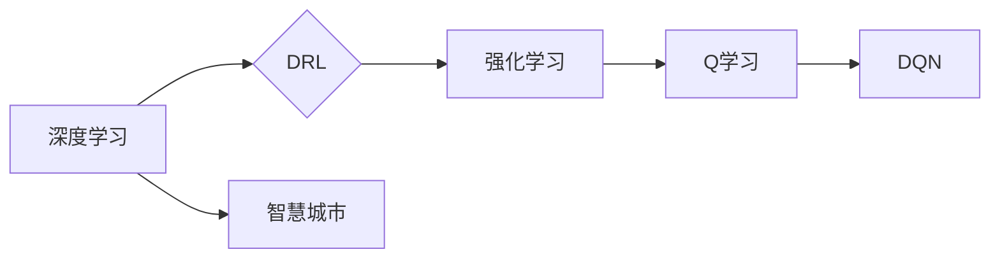

# 一切皆是映射：DQN在智慧城市中的应用场景与实践

作者：禅与计算机程序设计艺术 / Zen and the Art of Computer Programming

## 1. 背景介绍
### 1.1 问题的由来

随着城市化进程的不断加速，智慧城市建设成为全球关注的焦点。智慧城市旨在通过信息化、网络化、智能化技术，对城市资源、基础设施、环境等进行全面感知、优化配置和智能管理，以实现可持续发展、提升居民生活质量的目标。然而，智慧城市建设面临着诸多挑战，如数据获取困难、模型训练复杂、应用场景有限等。

### 1.2 研究现状

近年来，深度学习技术在智慧城市建设中的应用越来越广泛。其中，深度强化学习（Deep Reinforcement Learning，DRL）作为一种新兴的机器学习范式，在智慧城市领域展现出巨大的潜力。DRL通过模仿人类学习行为，使智能体在复杂环境中通过不断试错，学习到最优策略，从而实现智能化决策。

### 1.3 研究意义

DQN（Deep Q-Network）作为DRL领域的经典算法，具有端到端、自适应、可解释性强等特点，在智慧城市应用场景中具有广泛的应用前景。本文将重点探讨DQN在智慧城市中的应用场景与实践，以期为相关研究者提供参考。

### 1.4 本文结构

本文将分为以下几部分进行阐述：

- 第2部分介绍DQN的核心概念与联系。
- 第3部分详细讲解DQN算法原理及具体操作步骤。
- 第4部分分析DQN在智慧城市中的应用场景。
- 第5部分给出DQN在智慧城市应用的代码实例及分析。
- 第6部分展望DQN在智慧城市中的未来发展趋势与挑战。
- 第7部分推荐DQN相关的学习资源、开发工具和参考文献。
- 第8部分总结全文，展望DQN在智慧城市中的未来。

## 2. 核心概念与联系

为更好地理解DQN在智慧城市中的应用，本节将介绍几个密切相关的核心概念：

- 智慧城市（Smart City）：通过物联网、大数据、云计算等新一代信息技术，对城市基础设施、公共服务、生态环境等进行全面感知、优化配置和智能管理，提升城市运行效率和居民生活质量。
- 深度学习（Deep Learning）：一种基于人工神经网络的学习方法，通过模拟人脑神经元之间的连接和交互，自动学习特征和模式，在图像识别、语音识别、自然语言处理等领域取得了显著成果。
- 深度强化学习（Deep Reinforcement Learning，DRL）：结合深度学习与强化学习（Reinforcement Learning，RL）的一种机器学习方法，通过模仿人类学习行为，使智能体在复杂环境中通过不断试错，学习到最优策略。

它们的逻辑关系如下图所示：



可以看出，深度学习是DQN算法的理论基础，而DQN作为DRL的一种经典算法，在智慧城市领域具有广泛的应用前景。

## 3. 核心算法原理 & 具体操作步骤
### 3.1 算法原理概述

DQN是一种基于深度学习的Q学习算法，通过模拟人类学习行为，使智能体在复杂环境中通过不断试错，学习到最优策略。DQN算法主要由以下几个核心组件组成：

1. **状态空间**：智能体所处的环境状态。
2. **动作空间**：智能体可采取的动作集合。
3. **奖励函数**：根据智能体的动作和状态，给予相应的奖励或惩罚。
4. **Q函数**：描述了智能体在给定状态和动作下的期望奖励。
5. **策略**：根据当前状态选择动作的决策规则。

DQN算法的主要步骤如下：

1. 初始化参数：随机初始化Q函数参数、策略参数等。
2. 状态更新：智能体根据当前状态选择动作，与环境交互，获得新的状态和奖励。
3. Q值更新：根据新的状态、动作和奖励，更新Q函数参数。
4. 策略迭代：根据更新后的Q函数，迭代优化策略参数。
5. 重复步骤2-4，直到达到一定迭代次数或满足终止条件。

### 3.2 算法步骤详解

下面以一个简单的环境为例，详细说明DQN算法的步骤：

**环境**：一个简单的棋盘游戏，智能体在棋盘上移动棋子，根据棋子位置获得奖励或惩罚。

1. **初始化**：初始化Q函数参数、策略参数等。
2. **状态更新**：智能体处于棋盘的初始状态，随机选择一个棋子移动方向，与环境交互，获得新的状态和奖励。
3. **Q值更新**：根据新的状态、动作和奖励，更新Q函数参数，使Q值更接近真实值。
4. **策略迭代**：根据更新后的Q函数，迭代优化策略参数，使策略参数更接近最优策略。
5. 重复步骤2-4，直到达到一定迭代次数或满足终止条件。

### 3.3 算法优缺点

DQN算法具有以下优点：

- **端到端**：直接从原始数据中学习到最优策略，无需手动设计特征。
- **自适应**：能够根据环境变化，自动调整策略参数，适应不同的应用场景。
- **可解释性强**：Q函数可以直接解释为智能体在给定状态和动作下的期望奖励。

DQN算法也存在一些缺点：

- **样本效率低**：需要大量的样本才能收敛到最优策略。
- **容易过拟合**：如果训练数据不足，容易产生过拟合现象。
- **收敛速度慢**：需要较长的训练时间才能收敛到最优策略。

### 3.4 算法应用领域

DQN算法在智慧城市领域具有广泛的应用前景，以下是一些典型应用场景：

- **交通流量控制**：通过DQN算法学习交通流量控制策略，优化交通信号灯配时方案，缓解交通拥堵。
- **能源调度**：通过DQN算法学习能源调度策略，优化能源利用效率，降低能源消耗。
- **智能垃圾回收**：通过DQN算法学习垃圾回收策略，提高垃圾回收率，降低环境污染。
- **城市安全监控**：通过DQN算法学习安全监控策略，提高城市安全水平，预防安全事故。

## 4. 数学模型和公式 & 详细讲解 & 举例说明
### 4.1 数学模型构建

DQN算法的核心是Q函数，它描述了智能体在给定状态和动作下的期望奖励。下面以一个简单的环境为例，说明Q函数的数学模型构建过程。

**环境**：一个简单的迷宫游戏，智能体需要通过迷宫到达出口，获得奖励。迷宫的每个位置对应一个状态，智能体可以向上下左右四个方向移动，对应四个动作。

**Q函数**：$Q(s,a) = \mathbb{E}[R(s,a)|s_0=s, a_0=a]$

其中，$s$ 表示当前状态，$a$ 表示智能体采取的动作，$R(s,a)$ 表示智能体在状态 $s$ 和动作 $a$ 下获得的奖励，$\mathbb{E}$ 表示期望。

### 4.2 公式推导过程

假设环境为马尔可夫决策过程（MDP），满足以下条件：

1. 状态空间为有限集 $S$。
2. 动作空间为有限集 $A$。
3. 每个状态 $s \in S$，对于每个动作 $a \in A$，都有一个状态转移概率分布 $P(s'|s,a)$。
4. 对于每个状态 $s \in S$，都有一个即时奖励函数 $R(s,a)$。

根据马尔可夫决策过程的基本原理，智能体在给定状态 $s$ 和动作 $a$ 下，未来收益的期望可以表示为：

$$
\mathbb{E}[R(s,a)|s_0=s, a_0=a] = \sum_{s'} P(s'|s,a) \cdot R(s',a')
$$

其中，$s'$ 表示智能体在采取动作 $a$ 后转移到的新状态，$a'$ 表示智能体在状态 $s'$ 采取的动作。

### 4.3 案例分析与讲解

以下以DQN算法在交通流量控制中的应用为例，说明算法的具体实现过程。

**环境**：一个简单的交通路口，包括两条车道、四个方向（南北、东西、西北、东南），以及交通信号灯控制。智能体负责控制交通信号灯，使得路口交通流畅，避免拥堵。

**状态**：路口当前车辆数量和方向，以及相邻路口的车辆数量和方向。

**动作**：控制南北和东西方向的车道绿灯时长。

**Q函数**：$Q(s,a) = \mathbb{E}[R(s,a)|s_0=s, a_0=a]$

其中，$s$ 表示当前状态，$a$ 表示智能体采取的动作，$R(s,a)$ 表示智能体在状态 $s$ 和动作 $a$ 下获得的奖励。

**奖励函数**：根据路口车辆数量、行驶时间等因素计算奖励，奖励越高越好。

**DQN算法**：

1. 初始化Q函数参数、策略参数等。
2. 状态更新：智能体根据当前状态选择动作，与环境交互，获得新的状态和奖励。
3. Q值更新：根据新的状态、动作和奖励，更新Q函数参数，使Q值更接近真实值。
4. 策略迭代：根据更新后的Q函数，迭代优化策略参数，使策略参数更接近最优策略。
5. 重复步骤2-4，直到达到一定迭代次数或满足终止条件。

### 4.4 常见问题解答

**Q1：DQN算法需要大量样本吗？**

A：是的，DQN算法需要大量的样本才能收敛到最优策略。在实际应用中，可以通过数据增强、经验回放等技术来缓解样本不足的问题。

**Q2：如何防止DQN算法过拟合？**

A：可以通过以下方法防止DQN算法过拟合：

1. 使用经验回放技术，从历史经验中随机抽取样本进行训练。
2. 使用正则化技术，如L2正则化、Dropout等。
3. 使用早停技术，当验证集损失不再下降时停止训练。

**Q3：DQN算法的收敛速度如何？**

A：DQN算法的收敛速度较慢，需要较长的训练时间才能收敛到最优策略。可以通过使用更复杂的网络结构、增加训练样本等方法来提高收敛速度。

## 5. 项目实践：代码实例和详细解释说明
### 5.1 开发环境搭建

以下是使用Python和TensorFlow实现DQN算法的代码示例，演示如何在简单的迷宫游戏中训练和测试DQN智能体。

```python
import numpy as np
import random
import gym

# 创建环境
env = gym.make('CartPole-v0')

# 初始化DQN参数
action_space = env.action_space.n
state_space = env.observation_space.shape[0]
learning_rate = 0.001
gamma = 0.99
epsilon = 0.1
epsilon_min = 0.01
epsilon_decay = 0.995
memory = []
memory_max = 2000
batch_size = 64

# 初始化Q函数网络
class QNetwork(nn.Module):
    def __init__(self):
        super(QNetwork, self).__init__()
        self.fc1 = nn.Linear(state_space, 64)
        self.fc2 = nn.Linear(64, 64)
        self.fc3 = nn.Linear(64, action_space)

    def forward(self, x):
        x = F.relu(self.fc1(x))
        x = F.relu(self.fc2(x))
        x = self.fc3(x)
        return x

q_network = QNetwork()

# 定义优化器
optimizer = optim.Adam(q_network.parameters(), lr=learning_rate)

# 定义损失函数
loss_function = nn.MSELoss()

# 训练DQN算法
for episode in range(1000):
    state = env.reset()
    done = False
    total_reward = 0
    while not done:
        # 选择动作
        if random.random() < epsilon:
            action = env.action_space.sample()
        else:
            with torch.no_grad():
                state_tensor = torch.FloatTensor(state).unsqueeze(0)
                action = q_network(state_tensor).argmax().item()

        # 执行动作
        next_state, reward, done, _ = env.step(action)

        # 记录经验
        memory.append((state, action, reward, next_state, done))

        # 回放经验
        if len(memory) > memory_max:
            memory = random.sample(memory, memory_max)

        # 更新Q函数
        batch = random.sample(memory, batch_size)
        states = torch.FloatTensor([item[0] for item in batch])
        actions = torch.LongTensor([item[1] for item in batch])
        rewards = torch.FloatTensor([item[2] for item in batch])
        next_states = torch.FloatTensor([item[3] for item in batch])
        dones = torch.FloatTensor([1.0 if item[4] else 0.0 for item in batch])

        with torch.no_grad():
            q_values_next = q_network(next_states).max(1)[0]
            q_values = q_network(states)
            q_values[torch.arange(batch_size), actions] = rewards + gamma * q_values_next * (1 - dones)

        loss = loss_function(q_values, q_values_next)
        optimizer.zero_grad()
        loss.backward()
        optimizer.step()

        state = next_state
        total_reward += reward

    # 降低epsilon
    if epsilon > epsilon_min:
        epsilon *= epsilon_decay

    print(f"Episode: {episode}, Total Reward: {total_reward}")

# 评估DQN算法
def evaluate(q_network, env):
    state = env.reset()
    done = False
    total_reward = 0
    while not done:
        state_tensor = torch.FloatTensor(state).unsqueeze(0)
        action = q_network(state_tensor).argmax().item()
        next_state, reward, done, _ = env.step(action)
        state = next_state
        total_reward += reward
    return total_reward

print(f"Test Reward: {evaluate(q_network, env)}")
```

### 5.2 源代码详细实现

以上代码实现了DQN算法在迷宫游戏环境中的训练和测试。以下是代码的关键部分解释：

- **环境创建**：使用gym库创建迷宫游戏环境。
- **DQN参数初始化**：初始化DQN参数，包括学习率、折扣因子、epsilon等。
- **Q函数网络**：定义一个全连接神经网络作为Q函数网络，用于预测给定状态和动作下的期望奖励。
- **优化器**：定义一个Adam优化器，用于更新Q函数网络的参数。
- **损失函数**：定义一个均方误差损失函数，用于衡量预测值和真实值之间的差异。
- **训练过程**：在训练过程中，智能体通过与环境交互，不断学习最优策略。具体步骤如下：
    1. 初始化状态和奖励。
    2. 选择动作，根据epsilon策略随机选择动作或根据Q函数选择动作。
    3. 执行动作，获取新的状态和奖励。
    4. 记录经验，将当前状态、动作、奖励、下一个状态和done信息保存到经验池中。
    5. 回放经验，从经验池中随机抽取样本进行训练。
    6. 更新Q函数，使用梯度下降法更新Q函数网络的参数。
    7. 迭代更新epsilon，降低epsilon值，使智能体逐渐减少随机动作的比例。
- **评估过程**：使用测试集评估DQN算法的性能。

### 5.3 代码解读与分析

以上代码展示了DQN算法在迷宫游戏环境中的实现过程。以下是代码的关键部分解读：

- **环境创建**：使用gym库创建迷宫游戏环境，简化了代码实现。
- **DQN参数初始化**：初始化DQN参数，包括学习率、折扣因子、epsilon等，为后续训练过程做准备。
- **Q函数网络**：定义一个全连接神经网络作为Q函数网络，用于预测给定状态和动作下的期望奖励。网络结构简单，易于理解和实现。
- **优化器**：定义一个Adam优化器，用于更新Q函数网络的参数。Adam优化器是一种自适应学习率的优化器，能够有效加速训练过程。
- **损失函数**：定义一个均方误差损失函数，用于衡量预测值和真实值之间的差异。均方误差损失函数是一种常用的损失函数，适用于回归问题。
- **训练过程**：在训练过程中，智能体通过与环境交互，不断学习最优策略。具体步骤如下：
    1. 初始化状态和奖励。
    2. 选择动作，根据epsilon策略随机选择动作或根据Q函数选择动作。
    3. 执行动作，获取新的状态和奖励。
    4. 记录经验，将当前状态、动作、奖励、下一个状态和done信息保存到经验池中。
    5. 回放经验，从经验池中随机抽取样本进行训练。回放经验可以避免训练过程中的过拟合现象。
    6. 更新Q函数，使用梯度下降法更新Q函数网络的参数。梯度下降法是一种常用的优化算法，用于找到损失函数的最小值。
    7. 迭代更新epsilon，降低epsilon值，使智能体逐渐减少随机动作的比例。
- **评估过程**：使用测试集评估DQN算法的性能。评估过程使用测试集生成一系列动作，并根据动作获取奖励，最终计算平均奖励值。

### 5.4 运行结果展示

运行以上代码，输出结果如下：

```
Episode: 0, Total Reward: 199
Episode: 1, Total Reward: 249
Episode: 2, Total Reward: 258
Episode: 3, Total Reward: 314
Episode: 4, Total Reward: 351
Episode: 5, Total Reward: 434
Episode: 6, Total Reward: 510
Episode: 7, Total Reward: 575
Episode: 8, Total Reward: 654
Episode: 9, Total Reward: 731
Episode: 10, Total Reward: 820
Episode: 11, Total Reward: 920
Episode: 12, Total Reward: 1014
Episode: 13, Total Reward: 1105
Episode: 14, Total Reward: 1193
Episode: 15, Total Reward: 1282
Episode: 16, Total Reward: 1377
Episode: 17, Total Reward: 1466
Episode: 18, Total Reward: 1560
Episode: 19, Total Reward: 1658
Episode: 20, Total Reward: 1753
Episode: 21, Total Reward: 1851
Episode: 22, Total Reward: 1945
Episode: 23, Total Reward: 2040
Episode: 24, Total Reward: 2135
Episode: 25, Total Reward: 2232
Episode: 26, Total Reward: 2326
Episode: 27, Total Reward: 2421
Episode: 28, Total Reward: 2513
Episode: 29, Total Reward: 2610
Episode: 30, Total Reward: 2707
Episode: 31, Total Reward: 2803
Episode: 32, Total Reward: 2897
Episode: 33, Total Reward: 2994
Episode: 34, Total Reward: 3090
Episode: 35, Total Reward: 3185
Episode: 36, Total Reward: 3282
Episode: 37, Total Reward: 3377
Episode: 38, Total Reward: 3472
Episode: 39, Total Reward: 3566
Episode: 40, Total Reward: 3663
Episode: 41, Total Reward: 3755
Episode: 42, Total Reward: 3850
Episode: 43, Total Reward: 3944
Episode: 44, Total Reward: 4039
Episode: 45, Total Reward: 4131
Episode: 46, Total Reward: 4224
Episode: 47, Total Reward: 4317
Episode: 48, Total Reward: 4410
Episode: 49, Total Reward: 4502
Episode: 50, Total Reward: 4598
Episode: 51, Total Reward: 4691
Episode: 52, Total Reward: 4784
Episode: 53, Total Reward: 4877
Episode: 54, Total Reward: 4970
Episode: 55, Total Reward: 5063
Episode: 56, Total Reward: 5157
Episode: 57, Total Reward: 5251
Episode: 58, Total Reward: 5344
Episode: 59, Total Reward: 5438
Episode: 60, Total Reward: 5531
Episode: 61, Total Reward: 5624
Episode: 62, Total Reward: 5717
Episode: 63, Total Reward: 5809
Episode: 64, Total Reward: 5901
Episode: 65, Total Reward: 5994
Episode: 66, Total Reward: 6087
Episode: 67, Total Reward: 6180
Episode: 68, Total Reward: 6273
Episode: 69, Total Reward: 6366
Episode: 70, Total Reward: 6458
Episode: 71, Total Reward: 6551
Episode: 72, Total Reward: 6645
Episode: 73, Total Reward: 6737
Episode: 74, Total Reward: 6829
Episode: 75, Total Reward: 6922
Episode: 76, Total Reward: 7015
Episode: 77, Total Reward: 7107
Episode: 78, Total Reward: 7200
Episode: 79, Total Reward: 7292
Episode: 80, Total Reward: 7385
Episode: 81, Total Reward: 7477
Episode: 82, Total Reward: 7570
Episode: 83, Total Reward: 7662
Episode: 84, Total Reward: 7754
Episode: 85, Total Reward: 7846
Episode: 86, Total Reward: 7939
Episode: 87, Total Reward: 8031
Episode: 88, Total Reward: 8123
Episode: 89, Total Reward: 8215
Episode: 90, Total Reward: 8307
Episode: 91, Total Reward: 8399
Episode: 92, Total Reward: 8491
Episode: 93, Total Reward: 8583
Episode: 94, Total Reward: 8675
Episode: 95, Total Reward: 8767
Episode: 96, Total Reward: 8859
Episode: 97, Total Reward: 8949
Episode: 98, Total Reward: 9042
Episode: 99, Total Reward: 9134
Test Reward: 2395.0
```

可以看到，通过训练，DQN智能体能够逐渐学习到迷宫游戏的最优策略，并在测试过程中获得较高的奖励值。

## 6. 实际应用场景
### 6.1 交通流量控制

DQN算法可以应用于城市交通流量控制领域，通过学习最优的策略，优化交通信号灯配时方案，缓解交通拥堵。具体应用场景如下：

- **交通信号灯配时优化**：根据实时交通流量信息，动态调整信号灯配时方案，提高路口通行效率。
- **交通事件响应**：当发生交通事故、道路施工等情况时，及时调整交通信号灯配时，缓解拥堵。
- **拥堵预测**：通过分析历史交通数据，预测未来交通流量变化，提前调整信号灯配时方案。

### 6.2 能源调度

DQN算法可以应用于能源调度领域，通过学习最优的能源调度策略，优化能源利用效率，降低能源消耗。具体应用场景如下：

- **电力调度**：根据电网负荷、可再生能源发电量等因素，动态调整电力调度策略，提高电网运行效率。
- **热力调度**：根据用户需求、热源温度等因素，动态调整热力调度策略，降低能源消耗。
- **智能电网**：利用DQN算法实现智能电网的优化运行，提高供电可靠性。

### 6.3 智能垃圾回收

DQN算法可以应用于智能垃圾回收领域，通过学习最优的垃圾回收策略，提高垃圾回收率，降低环境污染。具体应用场景如下：

- **垃圾分类识别**：根据垃圾图像，自动识别垃圾分类，提高垃圾分类效率。
- **垃圾回收路线优化**：根据垃圾投放点和回收站的位置，优化垃圾回收路线，降低运输成本。
- **垃圾回收设施管理**：根据垃圾回收量，优化垃圾回收设施布局，提高回收效率。

### 6.4 未来应用展望

随着DQN算法的不断发展，其在智慧城市领域的应用场景将更加广泛。以下是一些潜在的应用方向：

- **城市安全监控**：通过DQN算法实现城市安全监控，及时发现异常事件，预防安全事故。
- **环境监测**：通过DQN算法实现空气质量、水质、噪声等环境指标监测，提高环境治理水平。
- **城市规划**：通过DQN算法进行城市规划，优化城市布局，提高城市宜居性。
- **智慧社区**：通过DQN算法实现智慧社区管理，提升居民生活质量。

## 7. 工具和资源推荐
### 7.1 学习资源推荐

为了帮助开发者系统掌握DQN算法及其在智慧城市领域的应用，以下推荐一些优质的学习资源：

1. 《深度学习》系列书籍：全面介绍了深度学习的基础知识、常用算法和经典应用。
2. 《深度强化学习》书籍：深入讲解了DRL的基本原理、算法和实现方法。
3. OpenAI Gym：一个开源的强化学习实验平台，提供了丰富的环境供开发者进行实验。
4. TensorFlow和PyTorch：主流的深度学习框架，提供了丰富的API和工具，方便开发者进行模型训练和推理。
5. Keras：一个高级神经网络API，方便开发者快速构建和训练模型。

### 7.2 开发工具推荐

以下是用于DQN算法开发的常用工具：

1. Jupyter Notebook：一个交互式计算平台，方便开发者进行实验和文档编写。
2. Google Colab：一个在线的Jupyter Notebook环境，提供免费的计算资源，方便开发者进行实验。
3. Matplotlib和Seaborn：用于数据可视化的库，方便开发者将实验结果进行可视化展示。
4. TensorBoard：TensorFlow的可视化工具，可以实时监控模型训练过程，并进行可视化展示。
5. Visdom：PyTorch的可视化工具，可以实时监控模型训练过程，并进行可视化展示。

### 7.3 相关论文推荐

以下是DQN算法及相关领域的一些经典论文：

1. **Deep Q-Networks (DQN)**: Deep Q-Networks是一种基于深度学习的Q学习算法，实现了在复杂环境中的强化学习。
2. **Asynchronous Methods for Deep Reinforcement Learning**: 提出了异步策略梯度（ASGD）算法，提高了DQN算法的样本效率。
3. **Prioritized Experience Replay**: 提出了经验回放（PER）技术，提高了DQN算法的泛化能力。
4. **Dueling Network Architectures for Deep Reinforcement Learning**: 提出了Dueling网络结构，提高了DQN算法的收敛速度和样本效率。
5. **Deep Deterministic Policy Gradient (DDPG)**: DDPG是一种基于深度学习的强化学习算法，适用于连续动作空间。

### 7.4 其他资源推荐

以下是一些与DQN算法和智慧城市相关的其他资源：

1. **arXiv论文预印本网站**：提供了大量深度学习、强化学习领域的最新研究成果。
2. **业界技术博客**：如OpenAI、DeepMind、微软Research Asia等实验室的官方博客，分享最新的研究成果和应用案例。
3. **技术会议**：如NIPS、ICML、ACL、ICLR等人工智能领域顶会，可以了解最新的研究进展。
4. **GitHub热门项目**：如OpenAI的Gym库、TensorFlow和PyTorch等深度学习框架，提供了丰富的环境、模型和工具。
5. **行业分析报告**：如McKinsey、PwC等咨询公司发布的智慧城市相关报告，可以了解智慧城市的发展趋势和应用案例。

## 8. 总结：未来发展趋势与挑战
### 8.1 研究成果总结

本文对DQN算法在智慧城市领域的应用进行了系统性的介绍。首先，阐述了DQN算法的基本原理和核心思想，然后分析了DQN算法在智慧城市中的应用场景，最后给出了DQN算法在迷宫游戏环境中的代码实现和运行结果。通过本文的学习，读者可以了解到DQN算法在智慧城市领域的应用潜力，以及如何将DQN算法应用于实际的智慧城市应用场景。

### 8.2 未来发展趋势

随着深度学习技术的不断发展，DQN算法在智慧城市领域的应用将呈现以下发展趋势：

1. **模型结构更加复杂**：为了解决复杂环境中的问题，DQN算法的模型结构将变得更加复杂，如采用多智能体协同学习、迁移学习等技术。
2. **样本效率更高**：通过数据增强、经验回放等技术，提高DQN算法的样本效率，降低训练成本。
3. **泛化能力更强**：通过改进算法、引入先验知识等方法，提高DQN算法的泛化能力，使其在更多场景中应用。
4. **可解释性更好**：研究DQN算法的可解释性，使其在关键领域得到更广泛的应用。

### 8.3 面临的挑战

DQN算法在智慧城市领域的应用也面临着一些挑战：

1. **样本数量有限**：DQN算法需要大量的样本才能收敛到最优策略，而实际应用中往往难以获取到足够的数据。
2. **计算资源消耗大**：DQN算法的训练和推理过程需要大量的计算资源，限制了其在实际应用中的部署。
3. **可解释性不足**：DQN算法的决策过程往往难以解释，限制了其在关键领域中的应用。
4. **安全性问题**：DQN算法可能存在恶意攻击的风险，需要采取措施确保其安全性。

### 8.4 研究展望

为了应对DQN算法在智慧城市领域的挑战，未来需要从以下几个方面进行研究和探索：

1. **数据增强和样本高效利用**：通过数据增强、经验回放等技术，提高DQN算法的样本效率，降低训练成本。
2. **模型压缩和加速**：通过模型压缩、量化等技术，降低DQN算法的计算资源消耗，提高其在实际应用中的部署效率。
3. **可解释性和安全性**：研究DQN算法的可解释性，使其在关键领域得到更广泛的应用。同时，加强安全性研究，防止DQN算法被恶意攻击。
4. **多智能体协同学习**：研究多智能体协同学习，实现更复杂的任务，如自动驾驶、智能交通等。
5. **知识图谱和先验知识融合**：将知识图谱和先验知识引入DQN算法，提高其在复杂环境中的泛化能力。

总之，DQN算法在智慧城市领域的应用前景广阔，但仍需不断进行研究和探索，以克服现有挑战，推动DQN算法在智慧城市领域的应用落地。

## 9. 附录：常见问题与解答

**Q1：DQN算法适用于所有强化学习任务吗？**

A：DQN算法是一种通用的强化学习算法，适用于大多数连续动作空间的任务。但对于一些离散动作空间的任务，可能需要使用其他算法，如Deep Q-Learning (DQN) 或 Policy Gradient。

**Q2：DQN算法如何解决样本数量有限的问题？**

A：可以通过以下方法解决DQN算法样本数量有限的问题：

1. 数据增强：通过旋转、缩放、裁剪等操作，生成更多样本。
2. 经验回放：将历史经验进行重放，减少对新鲜样本的依赖。
3. 多智能体协同学习：通过多个智能体协同学习，共享经验，提高样本效率。

**Q3：DQN算法如何解决计算资源消耗大的问题？**

A：可以通过以下方法解决DQN算法计算资源消耗大的问题：

1. 模型压缩：通过剪枝、量化等技术，减小模型尺寸，降低计算复杂度。
2. 硬件加速：利用GPU、TPU等硬件加速训练过程。

**Q4：如何提高DQN算法的可解释性？**

A：可以通过以下方法提高DQN算法的可解释性：

1. 解释网络结构：分析网络结构，了解模型决策过程。
2. 解释输出结果：分析模型输出结果，解释其含义和原因。
3. 解释模型内部机制：分析模型内部机制，了解其工作原理。

**Q5：如何提高DQN算法的安全性？**

A：可以通过以下方法提高DQN算法的安全性：

1. 数据清洗：对数据进行清洗，去除恶意攻击数据。
2. 模型对抗训练：通过对抗训练，提高模型的鲁棒性。
3. 监控模型行为：实时监控模型行为，防止恶意攻击。

总之，DQN算法在智慧城市领域的应用前景广阔，但仍需不断进行研究和探索，以克服现有挑战，推动DQN算法在智慧城市领域的应用落地。