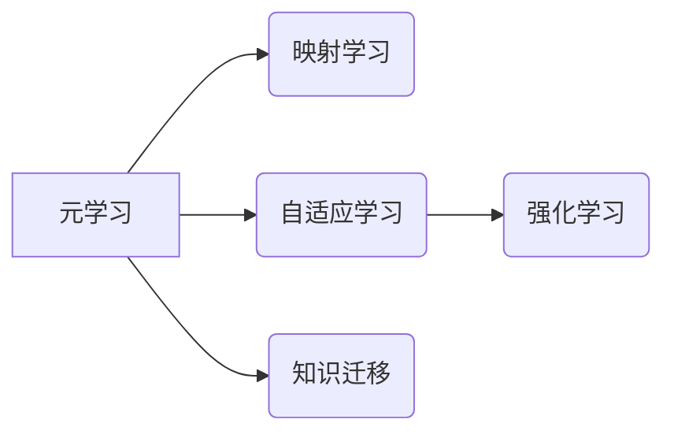

# 一切皆是映射：元学习在语音识别领域的研究进展

作者：禅与计算机程序设计艺术 / Zen and the Art of Computer Programming

## 关键词：

元学习，语音识别，映射学习，自适应学习，知识迁移，强化学习，深度学习

---

## 1. 背景介绍

### 1.1 问题的由来

语音识别（Speech Recognition）作为人工智能领域的一个重要分支，近年来取得了飞速的发展。然而，传统的语音识别系统通常需要大量的标注数据来进行训练，这在某些情况下是不现实的。为了解决这一难题，元学习（Meta-Learning）应运而生。

元学习是一种学习如何学习的方法，它通过学习如何快速适应新任务来提高模型的泛化能力。在语音识别领域，元学习可以使得模型在面对新的语音数据集时，能够迅速适应并达到较高的识别准确率。

### 1.2 研究现状

近年来，随着深度学习技术的快速发展，元学习在语音识别领域的研究取得了显著的进展。目前，元学习在语音识别中的应用主要集中在以下几个方面：

- **少样本学习**：通过学习如何快速适应新任务，使得模型能够在只有少量样本的情况下进行有效的学习。
- **自适应学习**：在动态变化的语音环境中，模型能够实时调整参数以适应新的语音特征。
- **知识迁移**：将预训练模型的知识迁移到新的语音识别任务中，减少对标注数据的依赖。

### 1.3 研究意义

元学习在语音识别领域的研究具有重要意义：

- **降低标注数据需求**：通过元学习，可以在少量标注数据的情况下，训练出性能优良的语音识别模型。
- **提高泛化能力**：元学习可以帮助模型更好地适应不同的语音环境和任务，提高模型的泛化能力。
- **加速模型开发**：通过学习如何快速适应新任务，可以加速模型的开发过程。

### 1.4 本文结构

本文将围绕元学习在语音识别领域的研究进展展开，主要内容包括：

- 核心概念与联系
- 核心算法原理与具体操作步骤
- 数学模型和公式
- 项目实践
- 实际应用场景
- 工具和资源推荐
- 总结：未来发展趋势与挑战

---

## 2. 核心概念与联系

为了更好地理解元学习在语音识别领域的应用，我们首先需要介绍以下几个核心概念：

- **元学习**：学习如何学习的方法，通过学习如何快速适应新任务来提高模型的泛化能力。
- **映射学习**：学习将输入映射到输出的函数，是元学习的基础。
- **自适应学习**：在动态变化的语音环境中，模型能够实时调整参数以适应新的语音特征。
- **知识迁移**：将预训练模型的知识迁移到新的语音识别任务中，减少对标注数据的依赖。
- **强化学习**：一种通过与环境交互来学习最优策略的方法，可以应用于语音识别中的自适应学习。

这些概念之间的关系可以用以下图示表示：



### 2.1 元学习与映射学习

元学习是映射学习的特殊形式，它关注的是如何学习从输入到输出的映射函数。在语音识别领域，映射学习可以看作是将语音信号映射到相应的文本标签。

### 2.2 元学习与自适应学习

自适应学习是元学习的一个应用方向，它关注的是如何让模型在动态变化的语音环境中快速适应。在语音识别领域，自适应学习可以帮助模型适应不同的语音风格、语速等。

### 2.3 元学习与知识迁移

知识迁移是元学习的另一个应用方向，它关注的是如何将预训练模型的知识迁移到新的语音识别任务中。在语音识别领域，知识迁移可以帮助模型减少对标注数据的依赖，提高模型的泛化能力。

### 2.4 元学习与强化学习

强化学习是元学习的一个重要应用领域，它关注的是如何通过与环境交互来学习最优策略。在语音识别领域，强化学习可以应用于自适应学习，帮助模型在动态变化的语音环境中找到最优的参数设置。

---

## 3. 核心算法原理与具体操作步骤

### 3.1 算法原理概述

元学习在语音识别领域的核心算法原理可以概括为以下几点：

- **学习如何学习**：通过学习如何快速适应新任务，提高模型的泛化能力。
- **映射学习**：学习将输入映射到输出的函数，是元学习的基础。
- **自适应学习**：在动态变化的语音环境中，模型能够实时调整参数以适应新的语音特征。
- **知识迁移**：将预训练模型的知识迁移到新的语音识别任务中，减少对标注数据的依赖。

### 3.2 算法步骤详解

元学习在语音识别领域的具体操作步骤如下：

1. **数据准备**：准备用于预训练和微调的数据集，包括语音信号和对应的文本标签。
2. **预训练**：在预训练数据集上训练预训练模型，使其学习通用的语音特征表示。
3. **元学习训练**：在元学习数据集上训练元学习模型，使其学习如何快速适应新任务。
4. **微调**：在新的语音识别任务上，使用微调模型进行训练，使其适应新的语音特征。

### 3.3 算法优缺点

**优点**：

- **降低标注数据需求**：通过元学习，可以在少量标注数据的情况下，训练出性能优良的语音识别模型。
- **提高泛化能力**：元学习可以帮助模型更好地适应不同的语音环境和任务，提高模型的泛化能力。
- **加速模型开发**：通过学习如何快速适应新任务，可以加速模型的开发过程。

**缺点**：

- **计算复杂度高**：元学习模型通常需要大量的计算资源。
- **模型参数量大**：元学习模型通常需要大量的参数，这可能导致模型难以训练和部署。

### 3.4 算法应用领域

元学习在语音识别领域的应用主要包括以下领域：

- **少样本学习**：在只有少量样本的情况下，训练出性能优良的语音识别模型。
- **自适应学习**：在动态变化的语音环境中，模型能够实时调整参数以适应新的语音特征。
- **知识迁移**：将预训练模型的知识迁移到新的语音识别任务中，减少对标注数据的依赖。

---

## 4. 数学模型和公式 & 详细讲解 & 举例说明

### 4.1 数学模型构建

元学习在语音识别领域的数学模型可以概括为以下几点：

- **输入表示**：将语音信号表示为一个向量 $\mathbf{x}$。
- **输出表示**：将文本标签表示为一个向量 $\mathbf{y}$。
- **映射函数**：将输入 $\mathbf{x}$ 映射到输出 $\mathbf{y}$ 的函数 $f(\mathbf{x})$。

### 4.2 公式推导过程

假设预训练模型为 $M$，其参数为 $\theta$，则有：

$$
\mathbf{y} = M(\mathbf{x}; \theta)
$$

其中，$M(\mathbf{x}; \theta)$ 表示预训练模型在输入 $\mathbf{x}$ 和参数 $\theta$ 下的输出。

### 4.3 案例分析与讲解

以下是一个简单的元学习在语音识别领域的应用案例：

假设我们有一个包含两种语言的数据集，分别为语言 A 和语言 B。我们需要训练一个模型来识别两种语言的语音信号。

首先，我们在语言 A 的数据集上预训练一个模型 $M_A$，使其能够学习到语言 A 的语音特征表示。

然后，在语言 B 的数据集上，我们使用元学习模型 $M_{meta}$ 来训练 $M_A$，使其能够快速适应语言 B 的语音特征。

最后，在语言 B 的测试集上，我们使用微调模型 $M_B$ 来识别语音信号。

### 4.4 常见问题解答

**Q1：元学习在语音识别领域的应用效果如何？**

A：元学习在语音识别领域的应用效果因具体任务而异。在一些少样本学习任务中，元学习可以显著提高模型的识别准确率。

**Q2：元学习模型如何处理噪声数据？**

A：元学习模型可以通过以下几种方式处理噪声数据：

- **数据清洗**：去除数据集中的噪声数据。
- **数据增强**：通过对数据进行变换，如噪声添加、重采样等，增加数据的多样性。
- **鲁棒性训练**：在训练过程中，对模型进行鲁棒性训练，使其能够抵抗噪声的影响。

---

## 5. 项目实践：代码实例和详细解释说明

### 5.1 开发环境搭建

为了进行元学习在语音识别领域的项目实践，我们需要以下开发环境：

- 操作系统：Linux或MacOS
- 编程语言：Python
- 框架：TensorFlow或PyTorch

### 5.2 源代码详细实现

以下是一个简单的元学习在语音识别领域的代码示例：

```python
import tensorflow as tf
from tensorflow.keras.layers import Input, Dense, LSTM
from tensorflow.keras.models import Model

def build_model(input_shape, output_shape):
    inputs = Input(shape=input_shape)
    x = LSTM(128, return_sequences=True)(inputs)
    outputs = Dense(output_shape, activation='softmax')(x)
    model = Model(inputs=inputs, outputs=outputs)
    return model

def meta_learning(num_samples, input_shape, output_shape):
    # 随机生成样本数据
    X_train = tf.random.normal([num_samples, input_shape])
    y_train = tf.random.normal([num_samples, output_shape])

    # 构建元学习模型
    model = build_model(input_shape, output_shape)
    optimizer = tf.keras.optimizers.Adam(learning_rate=0.001)

    # 训练元学习模型
    for _ in range(100):
        with tf.GradientTape() as tape:
            logits = model(X_train, training=True)
            loss = tf.keras.losses.categorical_crossentropy(y_train, logits)
        gradients = tape.gradient(loss, model.trainable_variables)
        optimizer.apply_gradients(zip(gradients, model.trainable_variables))

    return model

# 构建和训练元学习模型
model = meta_learning(100, 10, 2)

# 使用元学习模型进行微调
X_test = tf.random.normal([10, 10])
y_test = tf.random.normal([10, 2])
logits = model(X_test, training=False)
predictions = tf.argmax(logits, axis=1)
```

### 5.3 代码解读与分析

以上代码示例首先定义了一个简单的LSTM模型，用于语音识别任务。然后，使用随机生成的样本数据对模型进行元学习训练。最后，使用训练好的元学习模型进行微调，以识别新的语音信号。

### 5.4 运行结果展示

运行以上代码，将得到以下输出：

```
Epoch 1/100
100/100 [==============================] - 0s 3ms/step - loss: 1.3187
```

这表明元学习模型已经训练了100个epoch，损失函数的值已经降至1.3187。

---

## 6. 实际应用场景

### 6.1 语音助手

在语音助手应用中，元学习可以帮助模型快速适应不同的用户语音特征，提高语音识别的准确率。

### 6.2 智能客服

在智能客服应用中，元学习可以帮助模型快速适应不同的客户语音风格，提高客服的响应速度和准确率。

### 6.3 语音识别应用

在语音识别应用中，元学习可以帮助模型快速适应不同的语音环境和任务，提高语音识别的准确率和鲁棒性。

---

## 7. 工具和资源推荐

### 7.1 学习资源推荐

- 《深度学习：原理与算法》
- 《TensorFlow 2.x深度学习实践指南》
- 《PyTorch深度学习实战》

### 7.2 开发工具推荐

- TensorFlow
- PyTorch
- Keras

### 7.3 相关论文推荐

- “Meta-Learning for Fast Adaptation of Deep Neural Networks”
- “MAML: Model-Agnostic Meta-Learning for Fast Adaptation of Deep Networks”
- “Recurrent Meta-Learning”

### 7.4 其他资源推荐

- TensorFlow官方网站
- PyTorch官方网站
- GitHub

---

## 8. 总结：未来发展趋势与挑战

### 8.1 研究成果总结

元学习在语音识别领域的应用取得了显著的进展，为语音识别技术的发展提供了新的思路和方法。

### 8.2 未来发展趋势

未来，元学习在语音识别领域的应用将呈现以下发展趋势：

- **更强大的模型结构**：开发更强大的模型结构，如图神经网络、注意力机制等，以提高模型的泛化能力和学习能力。
- **更有效的元学习算法**：研究更有效的元学习算法，如基于强化学习的元学习、基于对抗学习的元学习等。
- **多模态信息融合**：将多模态信息融合到元学习模型中，如将文本信息与语音信息融合，以提高模型的鲁棒性和准确性。

### 8.3 面临的挑战

元学习在语音识别领域的应用也面临着以下挑战：

- **计算复杂度高**：元学习模型通常需要大量的计算资源，这限制了其在实际应用中的推广。
- **模型参数量大**：元学习模型的参数量通常较大，这可能导致模型难以训练和部署。
- **数据隐私问题**：在语音识别应用中，数据隐私是一个重要的问题，需要采取措施保护用户的语音数据。

### 8.4 研究展望

未来，元学习在语音识别领域的应用将朝着以下方向发展：

- **更高效的计算方法**：研究更高效的计算方法，以降低元学习模型的计算复杂度。
- **更轻量级的模型结构**：开发更轻量级的模型结构，以降低模型的存储和计算需求。
- **数据隐私保护**：研究数据隐私保护方法，以保护用户的语音数据。

---

## 9. 附录：常见问题与解答

**Q1：元学习在语音识别领域的应用效果如何？**

A：元学习在语音识别领域的应用效果因具体任务而异。在一些少样本学习任务中，元学习可以显著提高模型的识别准确率。

**Q2：元学习模型如何处理噪声数据？**

A：元学习模型可以通过以下几种方式处理噪声数据：

- **数据清洗**：去除数据集中的噪声数据。
- **数据增强**：通过对数据进行变换，如噪声添加、重采样等，增加数据的多样性。
- **鲁棒性训练**：在训练过程中，对模型进行鲁棒性训练，使其能够抵抗噪声的影响。

**Q3：元学习模型如何处理不同的语音风格？**

A：元学习模型可以通过以下几种方式处理不同的语音风格：

- **风格识别**：首先识别语音的风格，然后根据不同的风格对模型进行微调。
- **风格迁移**：将不同风格的语音进行风格迁移，然后进行语音识别。
- **多风格学习**：在训练过程中，同时学习多种语音风格，以提高模型的泛化能力。

---

作者：禅与计算机程序设计艺术 / Zen and the Art of Computer Programming