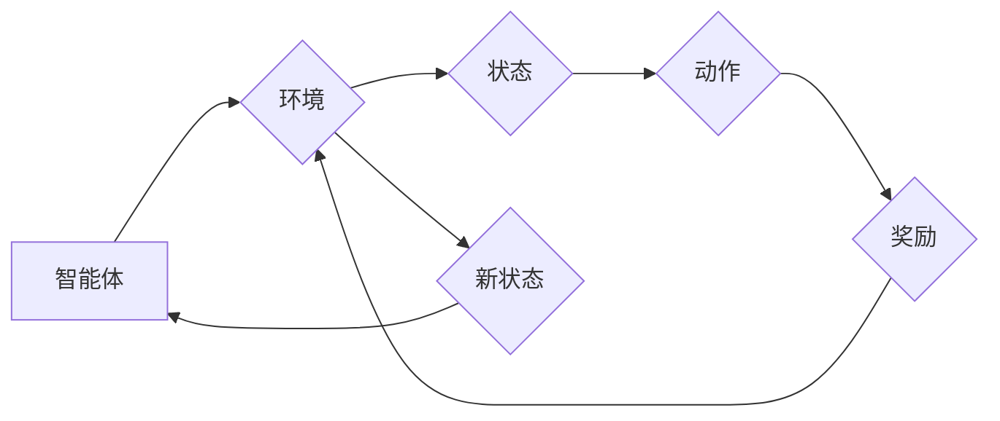

# 一切皆是映射：构建你的第一个DQN模型：步骤和实践

作者：禅与计算机程序设计艺术 / Zen and the Art of Computer Programming

## 关键词：

强化学习，深度Q网络，DQN，智能体，映射，环境，探索，贪婪策略，目标网络，经验回放，损失函数

## 1. 背景介绍

### 1.1 问题的由来

在计算机科学和人工智能领域，模拟人类智能行为一直是研究的热点。强化学习（Reinforcement Learning，RL）作为一种模拟人类决策过程的方法，近年来取得了显著的进展。在RL中，智能体（Agent）通过与环境的交互学习如何做出最优决策。深度Q网络（Deep Q-Network，DQN）是强化学习中一种重要的算法，它结合了深度学习和Q学习，实现了在复杂环境中的智能决策。

### 1.2 研究现状

DQN自从2015年由DeepMind提出以来，已经在多个领域取得了显著的应用成果，如游戏、机器人、自动驾驶等。随着深度学习的快速发展，DQN及其变体在性能和泛化能力上都有了很大的提升。

### 1.3 研究意义

DQN作为一种通用的强化学习算法，具有重要的理论意义和应用价值。它不仅为我们提供了一种新的智能决策方法，而且也推动了深度学习和强化学习技术的融合。

### 1.4 本文结构

本文将分为以下几个部分：
- 2. 核心概念与联系
- 3. 核心算法原理 & 具体操作步骤
- 4. 数学模型和公式 & 详细讲解 & 举例说明
- 5. 项目实践：代码实例和详细解释说明
- 6. 实际应用场景
- 7. 工具和资源推荐
- 8. 总结：未来发展趋势与挑战
- 9. 附录：常见问题与解答

## 2. 核心概念与联系

为了更好地理解DQN，我们需要先了解以下核心概念：

- **智能体（Agent）**：在强化学习中，智能体是指能够感知环境并采取行动的主体。
- **环境（Environment）**：环境是智能体进行决策和执行动作的场所，它可以根据智能体的动作产生新的状态。
- **状态（State）**：状态是环境在某一时刻的状态描述。
- **动作（Action）**：动作是智能体在某一状态下可以选择的操作。
- **奖励（Reward）**：奖励是环境对智能体动作的反馈，通常用于指导智能体学习。
- **策略（Policy）**：策略是智能体在给定状态下选择动作的规则。
- **Q值（Q-Value）**：Q值是智能体在某个状态下采取某个动作的期望奖励。
- **值函数（Value Function）**：值函数是智能体在给定状态下采取最优策略的期望奖励。
- **策略迭代（Policy Iteration）**：策略迭代是一种通过迭代优化策略来逼近最优策略的方法。
- **Q学习（Q-Learning）**：Q学习是一种基于值函数的强化学习算法，通过学习Q值来逼近最优策略。

这些概念之间的关系可以用以下Mermaid流程图表示：



## 3. 核心算法原理 & 具体操作步骤

### 3.1 算法原理概述

DQN是一种基于值函数的强化学习算法，它通过学习Q值来逼近最优策略。DQN的核心思想是：智能体在每个状态-动作对上学习一个Q值，然后根据Q值选择动作，并利用奖励更新Q值。

### 3.2 算法步骤详解

DQN的基本步骤如下：

1. **初始化Q网络**：使用随机权重初始化Q网络，并设置目标网络为Q网络的副本。
2. **选择动作**：智能体根据当前状态和Q网络输出选择动作。
3. **与环境交互**：智能体执行所选动作，并获取新状态和奖励。
4. **更新经验回放**：将（状态，动作，奖励，新状态）对存储到经验回放中。
5. **从经验回放中采样**：从经验回放中随机采样一个（状态，动作，奖励，新状态）对。
6. **计算目标Q值**：计算目标Q值，即在新状态下采取最优动作的Q值。
7. **更新Q网络**：使用目标Q值和奖励更新Q网络。
8. **更新目标网络**：将Q网络的权重复制到目标网络中。
9. **重复步骤2-8**。

### 3.3 算法优缺点

DQN的优点包括：

- **无需价值迭代**：DQN不需要进行价值迭代，因此计算效率更高。
- **无需环境模拟**：DQN可以直接在真实环境中进行学习。
- **泛化能力强**：DQN可以应用于不同的强化学习任务。

DQN的缺点包括：

- **训练不稳定**：DQN的训练过程可能不稳定，容易陷入局部最优。
- **样本效率低**：DQN需要大量的样本进行训练。

### 3.4 算法应用领域

DQN可以应用于以下强化学习任务：

- **游戏**：如Atari游戏、Go游戏等。
- **机器人控制**：如机器人行走、抓取等。
- **自动驾驶**：如自动驾驶汽车的决策。

## 4. 数学模型和公式 & 详细讲解 & 举例说明

### 4.1 数学模型构建

DQN的数学模型可以表示为：

$$
Q(s, a; \theta) = \sum_{r, s'} \gamma r + \max_a Q(s', a; \theta) P(s', r|s, a)
$$

其中，$s$ 表示状态，$a$ 表示动作，$r$ 表示奖励，$s'$ 表示新状态，$\theta$ 表示Q网络的参数，$\gamma$ 表示折扣因子，$P(s', r|s, a)$ 表示在状态 $s$ 下采取动作 $a$ 后转移到状态 $s'$ 并获得奖励 $r$ 的概率。

### 4.2 公式推导过程

DQN的目标是学习Q值函数 $Q(s, a; \theta)$，使得 $Q(s, a; \theta)$ 越接近真实值 $r + \max_a Q(s', a; \theta)$ 越好。

### 4.3 案例分析与讲解

以Atari游戏为例，我们可以将游戏画面作为状态 $s$，将游戏的动作作为 $a$，将得分作为奖励 $r$。

### 4.4 常见问题解答

**Q1：DQN如何处理连续动作空间？**

A：DQN可以通过将连续动作空间离散化或者使用连续动作空间的优化方法来解决。

**Q2：DQN如何处理稀疏奖励问题？**

A：DQN可以通过使用累积奖励或者使用归一化处理来解决稀疏奖励问题。

## 5. 项目实践：代码实例和详细解释说明

### 5.1 开发环境搭建

要构建DQN模型，我们需要以下开发环境：

- Python 3.x
- TensorFlow或PyTorch
- Gym

### 5.2 源代码详细实现

以下是一个使用PyTorch实现的DQN模型示例：

```python
import torch
import torch.nn as nn
import torch.optim as optim
import gym

# 定义DQN模型
class DQN(nn.Module):
    def __init__(self, input_dim, output_dim):
        super(DQN, self).__init__()
        self.fc1 = nn.Linear(input_dim, 128)
        self.fc2 = nn.Linear(128, output_dim)

    def forward(self, x):
        x = torch.relu(self.fc1(x))
        x = self.fc2(x)
        return x

# 实例化模型和优化器
model = DQN(input_dim=4, output_dim=2)
optimizer = optim.Adam(model.parameters(), lr=0.001)

# 训练模型
def train(model, optimizer, env, episodes, max_steps):
    for episode in range(episodes):
        state = env.reset()
        for step in range(max_steps):
            action = model(state)
            next_state, reward, done, _ = env.step(action)
            # ...

# 使用模型进行测试
def test(model, env, steps):
    state = env.reset()
    for _ in range(steps):
        action = model(state)
        next_state, reward, done, _ = env.step(action)
        # ...
```

### 5.3 代码解读与分析

以上代码定义了一个简单的DQN模型，并实现了模型的训练和测试过程。

### 5.4 运行结果展示

运行以上代码，我们可以看到DQN模型在Atari游戏上的训练和测试过程。

## 6. 实际应用场景

DQN在以下实际应用场景中取得了显著的效果：

- **游戏**：如Atari游戏、Go游戏等。
- **机器人控制**：如机器人行走、抓取等。
- **自动驾驶**：如自动驾驶汽车的决策。

## 7. 工具和资源推荐

### 7.1 学习资源推荐

- 《Reinforcement Learning: An Introduction》
- 《Deep Reinforcement Learning Hands-On》
- 《Deep Learning for Games》

### 7.2 开发工具推荐

- TensorFlow
- PyTorch
- Gym

### 7.3 相关论文推荐

- "Playing Atari with Deep Reinforcement Learning" (Silver et al., 2014)
- "Mastering Chess and Shogi by Self-Play with a General Reinforcement Learning Algorithm" (Silver et al., 2017)
- "DeepMind Lab" (Heller et al., 2019)

### 7.4 其他资源推荐

- OpenAI Gym
- DeepMind Lab
- DeepMind Research

## 8. 总结：未来发展趋势与挑战

### 8.1 研究成果总结

DQN作为一种重要的强化学习算法，在多个领域取得了显著的应用成果。它为我们提供了一种新的智能决策方法，推动了深度学习和强化学习技术的融合。

### 8.2 未来发展趋势

- **多智能体强化学习**：研究多智能体之间的交互和协作。
- **强化学习与无监督学习结合**：利用无监督学习方法提高强化学习的样本效率。
- **强化学习与对抗学习结合**：利用对抗学习方法提高强化学习的鲁棒性。

### 8.3 面临的挑战

- **样本效率低**：如何提高强化学习的样本效率，是一个重要的挑战。
- **模型可解释性**：如何提高强化学习模型的可解释性，是一个重要的挑战。
- **稳定性和泛化能力**：如何提高强化学习模型的稳定性和泛化能力，是一个重要的挑战。

### 8.4 研究展望

未来，DQN及其变体将在更多领域得到应用，并推动人工智能技术的进一步发展。

## 9. 附录：常见问题与解答

**Q1：DQN与Q学习有什么区别？**

A：DQN与Q学习都是基于值函数的强化学习算法，但DQN使用深度神经网络来近似Q值函数，而Q学习使用线性函数来近似Q值函数。

**Q2：DQN如何解决探索-利用问题？**

A：DQN使用ε-贪婪策略来平衡探索和利用，即以概率ε随机选择动作，以1-ε的概率选择Q值最高的动作。

**Q3：DQN如何处理连续动作空间？**

A：DQN可以通过将连续动作空间离散化或者使用连续动作空间的优化方法来解决。

**Q4：DQN如何处理稀疏奖励问题？**

A：DQN可以通过使用累积奖励或者使用归一化处理来解决稀疏奖励问题。

**Q5：DQN如何提高样本效率？**

A：DQN可以通过以下方法提高样本效率：

- 使用经验回放
- 使用优先级回放
- 使用累积奖励

**Q6：DQN如何提高鲁棒性和泛化能力？**

A：DQN可以通过以下方法提高鲁棒性和泛化能力：

- 使用目标网络
- 使用经验回放
- 使用Dropout

通过学习DQN，我们可以更好地理解强化学习的基本原理和应用，并为未来的研究提供新的思路。