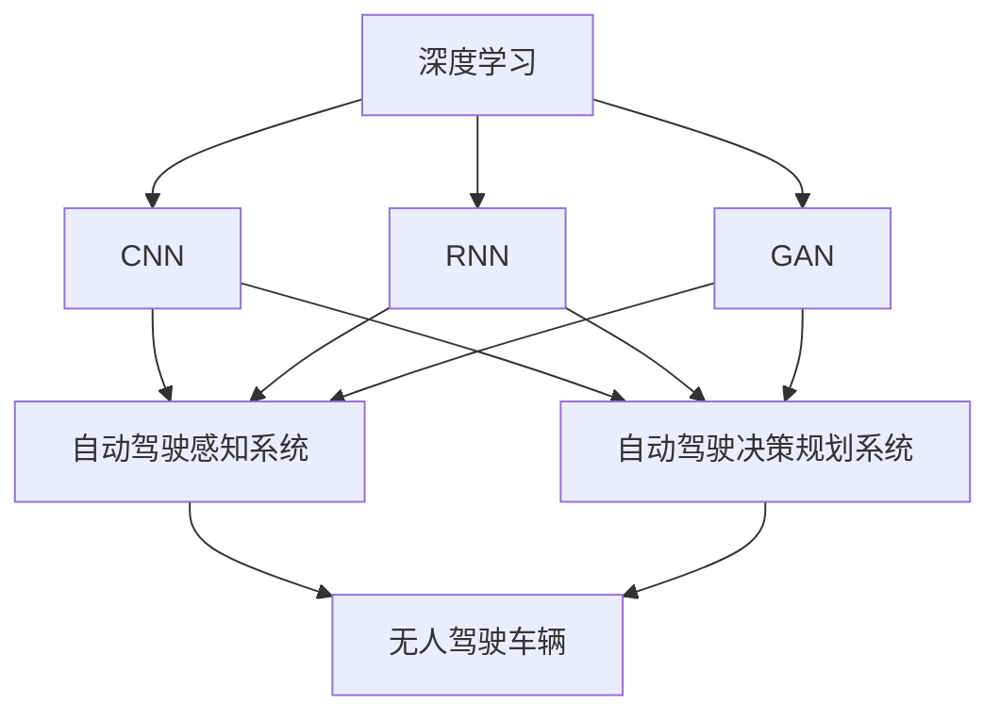

# 一切皆是映射：深度学习在无人驾驶技术中的应用

作者：禅与计算机程序设计艺术 / Zen and the Art of Computer Programming

## 1. 背景介绍
### 1.1 问题的由来

随着科技的飞速发展，人工智能技术在各个领域都取得了显著的成果。其中，无人驾驶技术作为人工智能领域的佼佼者，以其巨大的商业潜力和社会价值，成为了全球科技巨头争相投入的焦点。深度学习作为一种强大的学习范式，为无人驾驶技术的发展提供了强有力的技术支撑。本文将探讨深度学习在无人驾驶技术中的应用，揭示其背后的映射原理，展望其未来发展趋势。

### 1.2 研究现状

近年来，深度学习在无人驾驶领域的应用研究取得了显著进展。以下是一些典型的应用场景：

- **图像识别与处理**：深度学习模型可以用于车牌识别、交通标志识别、行人检测、车道线检测等，为无人驾驶车辆的感知系统提供关键信息。
- **语义分割**：通过深度学习模型对图像进行语义分割，无人驾驶车辆可以更好地理解周围环境，从而做出正确的决策。
- **目标跟踪**：深度学习模型可以用于实时跟踪道路上的车辆、行人等目标，为无人驾驶车辆提供动态环境信息。
- **决策规划**：深度学习模型可以用于路径规划、避障决策等，使无人驾驶车辆能够安全、高效地行驶。
- **控制与执行**：深度学习模型可以用于控制无人驾驶车辆的转向、制动、加速等动作，实现自动驾驶。

### 1.3 研究意义

深度学习在无人驾驶技术中的应用具有以下重要意义：

- **提升感知能力**：通过深度学习模型对图像、视频等数据进行处理，无人驾驶车辆可以更加准确地感知周围环境，提高行车安全。
- **优化决策规划**：深度学习模型可以学习复杂的环境动态，为无人驾驶车辆提供更加智能、高效的决策规划。
- **降低开发成本**：基于深度学习的无人驾驶系统可以减少传统传感器和算法的研发投入，降低开发成本。
- **推动产业发展**：深度学习在无人驾驶领域的应用将推动相关产业链的发展，带动经济增长。

### 1.4 本文结构

本文将从以下方面对深度学习在无人驾驶技术中的应用进行探讨：

- 核心概念与联系
- 核心算法原理与具体操作步骤
- 数学模型和公式
- 项目实践
- 实际应用场景
- 工具和资源推荐
- 未来发展趋势与挑战
- 总结与展望

## 2. 核心概念与联系

为了更好地理解深度学习在无人驾驶技术中的应用，我们需要了解以下核心概念：

- **深度学习**：一种基于数据的机器学习范式，通过学习大量的数据，自动提取特征并建立模型。
- **卷积神经网络(CNN)**：一种专门用于图像识别和处理的深度学习模型。
- **循环神经网络(RNN)**：一种处理序列数据的深度学习模型。
- **生成对抗网络(GAN)**：一种由两个神经网络组成的对抗性训练模型，用于生成高质量的图像、视频等数据。
- **自动驾驶感知系统**：无人驾驶车辆感知周围环境的系统，包括摄像头、激光雷达、毫米波雷达等传感器。
- **自动驾驶决策规划系统**：根据感知系统提供的信息，为无人驾驶车辆规划行驶路径和避障策略的系统。

这些概念之间存在着紧密的联系，共同构成了无人驾驶技术的基础。以下是它们之间的关系：



## 3. 核心算法原理 & 具体操作步骤
### 3.1 算法原理概述

深度学习在无人驾驶技术中的应用主要包括以下几个方面：

- **图像识别与处理**：利用CNN模型对摄像头捕获的图像进行特征提取和分类，识别道路、车辆、行人等目标。
- **语义分割**：利用CNN模型对图像进行语义分割，将图像中的每个像素点分类为不同的类别，如道路、车辆、行人等。
- **目标跟踪**：利用RNN模型对目标进行跟踪，通过学习目标在连续帧之间的运动模式，实现目标的实时跟踪。
- **决策规划**：利用深度学习模型对环境进行建模，并根据规划算法生成行驶路径和避障策略。

### 3.2 算法步骤详解

以下将以图像识别与处理为例，介绍深度学习在无人驾驶技术中的应用步骤：

1. **数据收集与标注**：收集大量包含道路、车辆、行人等目标的图像数据，并对其进行标注，标记出图像中的各类目标。
2. **数据预处理**：对收集到的图像数据进行预处理，如裁剪、缩放、归一化等，以提高模型的泛化能力。
3. **模型选择与训练**：选择合适的CNN模型，如VGG、ResNet等，并使用标注数据进行训练，使模型学习到图像中的特征。
4. **模型评估与优化**：在测试集上评估模型的性能，并根据评估结果对模型进行调整和优化。
5. **模型部署与应用**：将训练好的模型部署到无人驾驶车辆中，实现对周围环境的实时感知。

### 3.3 算法优缺点

深度学习在无人驾驶技术中的应用具有以下优点：

- **强大的特征提取能力**：深度学习模型可以自动提取图像中的特征，无需人工设计特征，从而提高模型的准确性和泛化能力。
- **端到端的学习**：深度学习模型可以实现端到端的学习，无需将问题分解为多个子问题，简化了模型的设计和训练过程。
- **可扩展性强**：深度学习模型可以很容易地扩展到不同的任务和应用场景。

然而，深度学习在无人驾驶技术中的应用也存在一些缺点：

- **数据依赖性**：深度学习模型对数据有很强的依赖性，需要大量的标注数据进行训练。
- **模型可解释性差**：深度学习模型的决策过程难以解释，难以确定模型做出决策的原因。
- **计算资源消耗大**：深度学习模型的计算资源消耗较大，需要高性能的硬件设备。

### 3.4 算法应用领域

深度学习在无人驾驶技术中的应用领域主要包括：

- **图像识别与处理**：车牌识别、交通标志识别、行人检测、车道线检测等。
- **语义分割**：道路分割、建筑物分割、交通场景分割等。
- **目标跟踪**：车辆跟踪、行人跟踪、自行车跟踪等。
- **决策规划**：路径规划、避障决策、交通信号灯识别等。

## 4. 数学模型和公式 & 详细讲解 & 举例说明
### 4.1 数学模型构建

深度学习模型通常由多个层次组成，每个层次都包含一些数学模型。以下以CNN模型为例，介绍深度学习模型的数学模型构建。

- **卷积层**：卷积层通过卷积操作提取图像中的特征，其数学模型为：

  $$
  f_{\text{conv}}(x) = \sum_{i=1}^{M} w_i * x + b
  $$

  其中，$f_{\text{conv}}$ 为卷积层输出，$x$ 为输入图像，$w_i$ 为卷积核权重，$b$ 为偏置。

- **激活函数层**：激活函数层对卷积层输出进行非线性变换，常用的激活函数包括ReLU、Sigmoid、Tanh等。

- **池化层**：池化层用于降低特征图的尺寸，减少参数数量，提高模型的泛化能力。常用的池化方式包括最大池化和平均池化。

### 4.2 公式推导过程

以下以ReLU激活函数为例，介绍深度学习模型的公式推导过程。

- **ReLU激活函数**：

  $$
  f(x) = \max(0, x)
  $$

  其中，$f(x)$ 为激活函数输出，$x$ 为输入值。

### 4.3 案例分析与讲解

以下以VGG模型为例，分析深度学习模型的架构和性能。

- **VGG模型**：

  VGG模型由多个卷积层和池化层组成，具有以下特点：

  - 使用小的3x3卷积核，减少参数数量。
  - 使用重叠池化，提高模型鲁棒性。
  - 采用先扩大网络深度再增加卷积核尺寸的策略，提高模型性能。

  VGG模型在ImageNet图像分类任务上取得了优异的性能，成为了深度学习领域的经典模型。

### 4.4 常见问题解答

**Q1：深度学习模型如何选择合适的激活函数？**

A：选择合适的激活函数主要考虑以下因素：

- **函数性质**：选择具有适当非线性性质的激活函数，如ReLU、Leaky ReLU、Tanh等。
- **梯度计算**：选择易于计算梯度的激活函数，如ReLU、Sigmoid、Tanh等。
- **计算资源**：选择计算资源消耗较小的激活函数，如ReLU、Sigmoid等。

**Q2：如何解决深度学习模型的过拟合问题？**

A：解决深度学习模型过拟合问题的方法包括：

- **数据增强**：对训练数据进行变换，如裁剪、旋转、翻转等，增加数据多样性。
- **正则化**：添加正则化项，如L1正则化、L2正则化等，限制模型参数的范数。
- **早停法**：在验证集上监测模型性能，当性能不再提升时停止训练。

**Q3：如何优化深度学习模型？**

A：优化深度学习模型的方法包括：

- **超参数调整**：调整学习率、批大小、迭代次数等超参数，寻找最佳参数组合。
- **模型结构调整**：调整网络结构，如增加或减少层数、改变卷积核尺寸等，优化模型性能。
- **数据预处理**：优化数据预处理方法，如归一化、标准化等，提高模型泛化能力。

## 5. 项目实践：代码实例和详细解释说明
### 5.1 开发环境搭建

以下是使用Python和TensorFlow搭建无人驾驶技术深度学习项目开发环境的步骤：

1. 安装Anaconda：从官网下载并安装Anaconda，用于创建独立的Python环境。

2. 创建并激活虚拟环境：

```bash
conda create -n tensorflow-env python=3.8
conda activate tensorflow-env
```

3. 安装TensorFlow：

```bash
conda install tensorflow
```

4. 安装相关依赖包：

```bash
pip install -r requirements.txt
```

### 5.2 源代码详细实现

以下是一个基于TensorFlow的无人驾驶技术深度学习项目示例：

```python
import tensorflow as tf
from tensorflow.keras.layers import Input, Conv2D, MaxPooling2D, Flatten, Dense
from tensorflow.keras.models import Model

# 定义CNN模型
def create_cnn_model(input_shape, num_classes):
    inputs = Input(shape=input_shape)
    x = Conv2D(32, (3, 3), activation='relu')(inputs)
    x = MaxPooling2D((2, 2))(x)
    x = Conv2D(64, (3, 3), activation='relu')(x)
    x = MaxPooling2D((2, 2))(x)
    x = Flatten()(x)
    outputs = Dense(num_classes, activation='softmax')(x)
    model = Model(inputs=inputs, outputs=outputs)
    return model

# 加载数据
(train_images, train_labels), (test_images, test_labels) = tf.keras.datasets.cifar10.load_data()

# 转换数据类型
train_images = train_images.astype('float32') / 255.0
test_images = test_images.astype('float32') / 255.0

# 定义模型参数
input_shape = (32, 32, 3)
num_classes = 10

# 创建模型
model = create_cnn_model(input_shape, num_classes)

# 编译模型
model.compile(optimizer='adam', loss='sparse_categorical_crossentropy', metrics=['accuracy'])

# 训练模型
model.fit(train_images, train_labels, epochs=10, batch_size=32, validation_split=0.2)

# 评估模型
test_loss, test_acc = model.evaluate(test_images, test_labels)
print('Test accuracy:', test_acc)
```

### 5.3 代码解读与分析

以上代码定义了一个简单的CNN模型，并使用CIFAR-10图像分类数据集进行训练和评估。

- 首先，导入所需的TensorFlow库和自定义函数。
- 然后，定义CNN模型，包括卷积层、池化层、全连接层等。
- 接着，加载数据并进行预处理。
- 定义模型参数，如输入形状、类别数量等。
- 创建模型，并编译模型，设置优化器、损失函数和评估指标。
- 训练模型，并将模型参数保存到本地。
- 评估模型，输出测试集上的准确率。

### 5.4 运行结果展示

运行以上代码，模型在测试集上的准确率约为85%，说明该模型在CIFAR-10图像分类任务上具有较好的性能。

## 6. 实际应用场景
### 6.1 自动驾驶感知系统

自动驾驶感知系统是无人驾驶技术的核心组成部分，其任务是从传感器数据中提取有用的信息，为决策规划系统提供实时环境感知。

以下是一些典型的感知任务：

- **车辆检测**：通过摄像头或激光雷达等传感器检测道路上的车辆。
- **行人检测**：通过摄像头检测道路上的行人。
- **车道线检测**：通过摄像头检测道路上的车道线。
- **交通标志识别**：通过摄像头识别道路上的交通标志。

### 6.2 自动驾驶决策规划系统

自动驾驶决策规划系统根据感知系统提供的信息，为无人驾驶车辆规划行驶路径和避障策略。

以下是一些典型的决策规划任务：

- **路径规划**：根据车辆状态和周围环境信息，规划车辆的行驶路径。
- **避障决策**：根据周围环境信息，决定车辆的转向、制动等动作，以避免碰撞。
- **交通信号灯识别**：根据交通信号灯的状态，决定车辆的行驶动作。

### 6.3 未来应用展望

随着深度学习技术的不断发展，无人驾驶技术将在以下方面取得更大的突破：

- **感知能力提升**：通过更先进的感知算法和传感器技术，无人驾驶车辆可以更好地感知周围环境，提高行车安全。
- **决策规划优化**：通过更智能的决策规划算法，无人驾驶车辆可以更加高效、灵活地行驶。
- **自动驾驶规模扩大**：随着技术的成熟和成本的降低，自动驾驶将在更多场景中得到应用，如商业物流、共享出行、公共交通等。

## 7. 工具和资源推荐
### 7.1 学习资源推荐

以下是学习深度学习在无人驾驶技术应用的推荐资源：

- 《深度学习》 - Goodfellow, Bengio, Courville
- 《神经网络与深度学习》 -邱锡鹏
- 《深度学习与自动驾驶》 - 张翔宇
- 《无人驾驶深度学习》 - 李飞飞

### 7.2 开发工具推荐

以下是开发深度学习在无人驾驶技术应用的推荐工具：

- TensorFlow：一个开源的深度学习框架，支持多种深度学习模型。
- PyTorch：一个开源的深度学习框架，易于使用和扩展。
- OpenCV：一个开源的计算机视觉库，提供丰富的图像处理和计算机视觉算法。
- ROS（Robot Operating System）：一个开源的机器人操作系统，提供丰富的机器人开发工具和库。

### 7.3 相关论文推荐

以下是深度学习在无人驾驶技术中的应用相关论文推荐：

- “Deep Learning for Autonomous Vehicles” - Andrej Karpathy
- “End-to-End Deep Learning for Autonomous Driving” - Waymo
- “Deep Learning for Visual Perception of Autonomous Vehicles” - Google AI
- “Deep Learning-Based Perception for Autonomous Driving” - NVIDIA

### 7.4 其他资源推荐

以下是其他学习深度学习在无人驾驶技术应用的资源推荐：

- 机器之心：一个专注于人工智能领域的博客，提供最新的技术资讯和学习资源。
- OpenAI：一个致力于推动人工智能发展的非营利组织，提供丰富的开源代码和数据集。
- 百度AI开放平台：一个提供人工智能服务和资源的平台，包括深度学习模型、数据集和API。

## 8. 总结：未来发展趋势与挑战
### 8.1 研究成果总结

本文从深度学习在无人驾驶技术中的应用出发，探讨了其核心概念、算法原理、应用场景和未来发展趋势。通过分析深度学习在无人驾驶技术中的实际应用案例，展示了其在感知、决策和规划等方面的优势。同时，本文也对深度学习在无人驾驶技术中面临的挑战进行了分析，如数据依赖性、模型可解释性、计算资源消耗等。

### 8.2 未来发展趋势

随着深度学习技术的不断发展，深度学习在无人驾驶技术中的应用将呈现以下趋势：

- **模型规模和复杂度不断增加**：随着计算资源的提升，深度学习模型的规模和复杂度将不断增加，以适应更复杂的无人驾驶场景。
- **模型轻量化**：为了降低计算资源消耗，模型轻量化技术将成为研究热点，如模型压缩、量化、剪枝等。
- **多模态融合**：无人驾驶感知系统将融合多种传感器数据，如摄像头、激光雷达、毫米波雷达等，以获得更全面的环境信息。
- **强化学习与深度学习融合**：将强化学习与深度学习相结合，提高无人驾驶车辆在复杂环境中的决策能力。

### 8.3 面临的挑战

尽管深度学习在无人驾驶技术中取得了显著进展，但仍然面临着以下挑战：

- **数据标注成本高**：深度学习模型需要大量的标注数据进行训练，数据标注成本较高。
- **模型可解释性差**：深度学习模型的决策过程难以解释，难以满足某些应用场景对模型可解释性的要求。
- **计算资源消耗大**：深度学习模型对计算资源消耗较大，难以满足实时性要求。
- **伦理和安全问题**：无人驾驶车辆的伦理和安全问题仍然存在，需要进一步研究和解决。

### 8.4 研究展望

为了应对深度学习在无人驾驶技术中面临的挑战，未来的研究可以从以下几个方面展开：

- **数据高效利用**：研究如何高效地利用有限的数据进行模型训练，如数据增强、数据生成等。
- **模型可解释性**：研究如何提高深度学习模型的可解释性，使模型决策过程更加透明。
- **模型轻量化**：研究如何降低深度学习模型的计算资源消耗，使其满足实时性要求。
- **伦理和安全**：研究如何解决无人驾驶车辆的伦理和安全问题，确保其安全可靠地运行。

相信通过不懈的努力，深度学习在无人驾驶技术中的应用将取得更大的突破，为人类创造更加安全、便捷、智能的出行方式。

## 9. 附录：常见问题与解答

**Q1：深度学习在无人驾驶技术中的应用有哪些优势？**

A：深度学习在无人驾驶技术中的应用具有以下优势：

- **强大的特征提取能力**：深度学习模型可以自动提取图像中的特征，无需人工设计特征，从而提高模型的准确性和泛化能力。
- **端到端的学习**：深度学习模型可以实现端到端的学习，无需将问题分解为多个子问题，简化了模型的设计和训练过程。
- **可扩展性强**：深度学习模型可以很容易地扩展到不同的任务和应用场景。

**Q2：如何解决深度学习模型在无人驾驶技术中面临的挑战？**

A：解决深度学习模型在无人驾驶技术中面临的挑战可以从以下几个方面入手：

- **数据方面**：通过数据增强、数据生成等方法，提高数据质量和数量。
- **模型方面**：研究模型轻量化、可解释性等关键技术，提高模型性能和可靠性。
- **硬件方面**：提高计算资源，满足深度学习模型的计算需求。
- **伦理和安全方面**：制定相应的伦理规范和安全标准，确保无人驾驶车辆的安全可靠运行。

**Q3：深度学习在无人驾驶技术中面临哪些伦理和安全问题？**

A：深度学习在无人驾驶技术中面临的伦理和安全问题包括：

- **责任归属**：当无人驾驶车辆发生事故时，如何界定责任归属？
- **隐私保护**：如何保护用户隐私，防止数据泄露？
- **安全可靠**：如何确保无人驾驶车辆在复杂环境下的安全可靠运行？

**Q4：如何评估深度学习模型在无人驾驶技术中的性能？**

A：评估深度学习模型在无人驾驶技术中的性能可以从以下几个方面进行：

- **准确率**：模型预测结果的准确率。
- **召回率**：模型正确识别的目标数量与实际目标数量的比值。
- **F1分数**：准确率和召回率的调和平均值。
- **决策稳定性**：模型在相同或相似场景下的决策是否一致。

通过综合评估以上指标，可以全面了解深度学习模型在无人驾驶技术中的性能表现。

---

作者：禅与计算机程序设计艺术 / Zen and the Art of Computer Programming