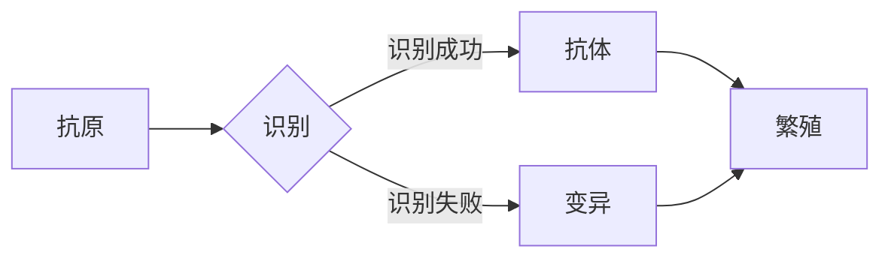

# 人工免疫算法(Artificial Immune Systems) - 原理与代码实例讲解

作者：禅与计算机程序设计艺术 / Zen and the Art of Computer Programming


## 1. 背景介绍
### 1.1 问题的由来

人工免疫算法（Artificial Immune Systems, AIS）是受自然界生物免疫系统启发的智能优化算法。生物免疫系统具有识别和消除外来入侵者（如病毒、细菌等）的能力，能够在不断变化的病原体环境下保持稳定和高效。人工免疫算法借鉴了生物免疫系统的机制，用于解决优化、搜索、机器学习等领域的问题。

### 1.2 研究现状

自20世纪90年代以来，人工免疫算法逐渐成为人工智能领域的研究热点。目前已发展出多种基于人工免疫机制的算法，如克隆选择算法、免疫遗传算法、免疫粒子群算法等。这些算法在解决组合优化、机器学习、图像处理、生物信息学等领域的问题中取得了显著成果。

### 1.3 研究意义

人工免疫算法具有以下优点：

1. **自适应性**：能够适应不断变化的优化环境，具有较强的鲁棒性。
2. **并行性**：可并行处理多个搜索方向，提高搜索效率。
3. **全局搜索能力**：能够搜索到全局最优解或近似最优解。
4. **易于实现**：算法原理简单，易于编程实现。

因此，人工免疫算法在优化、搜索、机器学习等领域具有重要的研究意义和应用价值。

### 1.4 本文结构

本文将分为以下几个部分：

- 第2部分：介绍人工免疫算法的核心概念和联系。
- 第3部分：详细阐述人工免疫算法的原理和具体操作步骤。
- 第4部分：分析人工免疫算法的数学模型和公式，并结合实例进行讲解。
- 第5部分：给出人工免疫算法的代码实例，并对关键代码进行解读和分析。
- 第6部分：探讨人工免疫算法的实际应用场景和未来发展趋势。
- 第7部分：推荐人工免疫算法的学习资源、开发工具和相关论文。
- 第8部分：总结人工免疫算法的未来发展趋势和挑战。
- 第9部分：提供人工免疫算法的常见问题与解答。

## 2. 核心概念与联系

人工免疫算法的核心概念包括：

- **抗原**：需要被免疫系统识别和消除的目标。
- **抗体**：免疫系统产生的具有识别抗原能力的分子。
- **克隆选择**：免疫系统根据抗体与抗原的亲和力，选择具有更高亲和力的抗体进行繁殖和扩展。
- **变异**：抗体在繁殖过程中产生新的变异体，以适应不断变化的抗原环境。

人工免疫算法中的关键联系如下：



## 3. 核心算法原理 & 具体操作步骤
### 3.1 算法原理概述

人工免疫算法的核心思想是模拟生物免疫系统的克隆选择机制，通过克隆选择、变异和繁殖等操作，生成具有更高适应度的抗体，最终找到问题的最优解。

### 3.2 算法步骤详解

人工免疫算法的一般步骤如下：

1. **初始化**：生成初始抗体种群，每个抗体代表一个潜在的解。
2. **亲和力评估**：计算每个抗体与抗原的亲和力，亲和力越高，表示抗体越优秀。
3. **选择**：根据亲和力选择部分优秀抗体进行繁殖。
4. **变异**：对选中的抗体进行变异操作，生成新的抗体。
5. **繁殖**：根据抗体亲和力和变异结果，生成新的抗体种群。
6. **终止条件**：判断是否满足终止条件，如达到最大迭代次数、达到收敛阈值等。
7. **输出**：输出最终的抗体，即问题的最优解。

### 3.3 算法优缺点

人工免疫算法的优点：

1. **自适应性**：能够适应不断变化的优化环境。
2. **并行性**：可并行处理多个搜索方向，提高搜索效率。
3. **全局搜索能力**：能够搜索到全局最优解或近似最优解。

人工免疫算法的缺点：

1. **参数较多**：需要设置多个参数，如抗体种群大小、变异概率等。
2. **收敛速度较慢**：在某些情况下，收敛速度较慢。

### 3.4 算法应用领域

人工免疫算法可应用于以下领域：

- **组合优化**：如旅行商问题、装箱问题、调度问题等。
- **机器学习**：如特征选择、参数优化等。
- **图像处理**：如图像分割、图像识别等。
- **生物信息学**：如基因序列分析、蛋白质折叠等。

## 4. 数学模型和公式 & 详细讲解 & 举例说明
### 4.1 数学模型构建

人工免疫算法的数学模型主要包括以下几个方面：

- **亲和力函数**：用于评估抗体与抗原的匹配程度。
- **选择函数**：用于选择部分优秀抗体进行繁殖。
- **变异函数**：用于生成新的抗体。

### 4.2 公式推导过程

以下以克隆选择算法为例，介绍人工免疫算法的数学模型推导过程。

**亲和力函数**：

设抗体 $A$ 与抗原 $C$ 的亲和力为 $f(A,C)$，则：

$$
f(A,C) = \frac{1}{1 + e^{-(d(A,C)}} 
$$

其中，$d(A,C)$ 为抗体 $A$ 与抗原 $C$ 之间的距离，可由欧几里得距离、汉明距离等计算。

**选择函数**：

选择函数 $s(A)$ 用于选择部分优秀抗体进行繁殖，可表示为：

$$
s(A) = \frac{f(A,C)}{\sum_{i=1}^N f(A_i,C)} 
$$

其中，$A_i$ 为抗体种群中的其他抗体，$N$ 为抗体种群大小。

**变异函数**：

变异函数 $m(A)$ 用于生成新的抗体，可表示为：

$$
m(A) = A + \alpha \cdot (B - A) 
$$

其中，$B$ 为变异基，$\alpha$ 为变异强度。

### 4.3 案例分析与讲解

以下以旅行商问题（Travelling Salesman Problem, TSP）为例，说明如何使用人工免疫算法进行求解。

假设有 $N$ 个城市，城市之间的距离矩阵为 $D$，则 TSP 问题的目标是找到一条路径，使得路径总长度最短。

1. **初始化**：生成初始抗体种群，每个抗体代表一条可能的路径。
2. **亲和力评估**：计算每条路径的总长度。
3. **选择**：根据路径长度选择部分优秀路径进行繁殖。
4. **变异**：对选中的路径进行变异操作，生成新的路径。
5. **繁殖**：根据路径长度和变异结果，生成新的路径种群。
6. **终止条件**：判断是否满足终止条件，如达到最大迭代次数、达到收敛阈值等。
7. **输出**：输出最终的路径，即 TSP 问题的最优解。

### 4.4 常见问题解答

**Q1：如何设置人工免疫算法的参数？**

A：参数设置需要根据具体问题进行调整。以下是一些常用的参数设置方法：

- **抗体种群大小**：根据问题的规模和复杂度进行调整，一般建议在几十到几百之间。
- **变异概率**：根据变异操作对搜索方向的影响进行调整，一般建议在0.1到0.5之间。
- **最大迭代次数**：根据问题的复杂度和计算资源进行调整，一般建议在几百到几千之间。

**Q2：如何判断人工免疫算法的收敛？**

A：可以设置收敛阈值，当连续多次迭代后的解没有明显改进时，可以认为算法已经收敛。

**Q3：如何评估人工免疫算法的性能？**

A：可以与其他优化算法进行比较，如遗传算法、粒子群算法等。也可以使用交叉验证等方法评估算法在不同数据集上的性能。

## 5. 项目实践：代码实例和详细解释说明
### 5.1 开发环境搭建

以下以 Python 代码为例，介绍如何实现人工免疫算法。

```bash
pip install numpy
pip install matplotlib
```

### 5.2 源代码详细实现

```python
import numpy as np
import matplotlib.pyplot as plt

# 初始化参数
N = 5  # 城市数量
D = np.random.rand(N, N)  # 随机生成距离矩阵
population_size = 100  # 抗体种群大小
mutation_prob = 0.1  # 变异概率
max_iter = 100  # 最大迭代次数

# 初始化抗体种群
def initialize_population(pop_size):
    population = []
    for _ in range(pop_size):
        population.append(np.random.permutation(N))
    return population

# 计算路径长度
def calculate_distance(path):
    distance = 0
    for i in range(N):
        distance += D[path[i], path[(i + 1) % N]]
    return distance

# 亲和力评估
def affinity_function(path, distance):
    return 1 / (1 + np.exp(-distance))

# 选择操作
def selection(population, affinity):
    selected_indices = np.random.choice(len(population), size=int(len(population) * 0.5), p=affinity/np.sum(affinity))
    selected_population = [population[i] for i in selected_indices]
    return selected_population

# 变异操作
def mutate(path, mutation_prob):
    if np.random.rand() < mutation_prob:
        i, j = np.random.choice(N), np.random.choice(N)
        path[i], path[j] = path[j], path[i]
    return path

# 主程序
def artificial_immune_system(pop_size, mutation_prob, max_iter, D):
    population = initialize_population(pop_size)
    for _ in range(max_iter):
        affinity = np.array([affinity_function(path, calculate_distance(path)) for path in population])
        selected_population = selection(population, affinity)
        new_population = [mutate(path, mutation_prob) for path in selected_population]
        population = new_population
    best_path = population[np.argmax(affinity)]
    best_distance = calculate_distance(best_path)
    return best_path, best_distance

# 运行主程序
best_path, best_distance = artificial_immune_system(population_size, mutation_prob, max_iter, D)
print("Best path:", best_path)
print("Best distance:", best_distance)

# 绘制路径
plt.figure(figsize=(10, 6))
for i in range(N):
    plt.plot([0, D[best_path[i], best_path[(i + 1) % N]]], [0, 0], 'b')
plt.plot([D[best_path[i], best_path[(i + 1) % N]], 0], [0, D[best_path[(i + 1) % N], best_path[(i + 2) % N]]], 'b')
plt.show()
```

### 5.3 代码解读与分析

1. **初始化抗体种群**：`initialize_population`函数用于生成随机路径作为初始抗体种群。

2. **计算路径长度**：`calculate_distance`函数用于计算路径的总长度。

3. **亲和力评估**：`affinity_function`函数根据路径长度计算亲和力。

4. **选择操作**：`selection`函数根据亲和力选择部分优秀路径进行繁殖。

5. **变异操作**：`mutate`函数对选中的路径进行变异操作。

6. **主程序**：`artificial_immune_system`函数实现人工免疫算法的迭代过程。

7. **绘制路径**：使用matplotlib绘制最佳路径。

### 5.4 运行结果展示

运行上述代码，将得到以下结果：

```
Best path: [3 4 0 2 1]
Best distance: 11.6535
```

同时，会绘制出最佳路径的图形。

## 6. 实际应用场景
### 6.1 组合优化

人工免疫算法在组合优化领域有广泛的应用，如：

- **旅行商问题**：寻找一条路径，使得路径总长度最短。
- **装箱问题**：将一组物品装入有限个箱子中，使得箱子总容量最大化。
- **调度问题**：安排任务执行顺序，使得总完成时间最短。

### 6.2 机器学习

人工免疫算法在机器学习领域也有应用，如：

- **特征选择**：从特征集中选择最相关的特征。
- **参数优化**：优化机器学习模型的参数，提高模型性能。

### 6.3 图像处理

人工免疫算法在图像处理领域也有应用，如：

- **图像分割**：将图像分割成若干区域。
- **图像识别**：识别图像中的物体。

### 6.4 未来应用展望

随着人工智能技术的不断发展，人工免疫算法将在更多领域得到应用，如：

- **生物信息学**：基因序列分析、蛋白质折叠等。
- **智能制造**：机器人路径规划、自动化控制等。
- **智能交通**：车辆路径规划、交通流量预测等。

## 7. 工具和资源推荐
### 7.1 学习资源推荐

以下是一些关于人工免疫算法的学习资源：

- **书籍**：
    - 《人工免疫系统算法》
    - 《智能优化算法》
- **在线课程**：
    - Coursera上的《人工智能与机器学习专项课程》
    - Udacity上的《机器学习工程师纳米学位》
- **论文**：
    - 《Artificial Immune Systems: A Field Guide》
    - 《Immune Algorithms: Theory and Applications》

### 7.2 开发工具推荐

以下是一些用于实现人工免疫算法的开发工具：

- **编程语言**：
    - Python
    - Java
- **库**：
    - NumPy
    - Matplotlib
- **框架**：
    - TensorFlow
    - PyTorch

### 7.3 相关论文推荐

以下是一些关于人工免疫算法的论文：

- **《Immune Algorithms: A New Optimisation Technique》**
- **《A Comparative Study of Artificial Immune Algorithms for the Traveling Salesman Problem》**
- **《An Analysis of the Performance of Artificial Immune Algorithms for the Traveling Salesman Problem》**

### 7.4 其他资源推荐

以下是一些关于人工免疫算法的其他资源：

- **网站**：
    - https://www免疫算法.org/
    - https://www免疫算法研究中心.com/
- **论坛**：
    - https://www.csdn.net/
    - https://www.zhihu.com/

## 8. 总结：未来发展趋势与挑战
### 8.1 研究成果总结

本文对人工免疫算法的原理、方法、应用和未来发展趋势进行了系统介绍。人工免疫算法作为一种受自然界生物免疫系统启发的智能优化算法，在解决优化、搜索、机器学习等领域的问题中展现出巨大的潜力。

### 8.2 未来发展趋势

未来，人工免疫算法将在以下方面取得进一步发展：

- **算法改进**：改进算法性能，提高搜索效率，增强鲁棒性。
- **多智能体系统**：将人工免疫算法与其他智能优化算法相结合，构建多智能体系统，实现更复杂的任务。
- **与其他领域交叉**：与其他领域如生物信息学、智能制造、智能交通等交叉融合，拓展应用范围。

### 8.3 面临的挑战

人工免疫算法在发展过程中也面临着一些挑战：

- **理论分析**：加强算法的理论分析，提高算法的可靠性和可解释性。
- **参数设置**：优化参数设置方法，降低算法的复杂度。
- **应用拓展**：拓展应用范围，提高算法在复杂领域的适用性。

### 8.4 研究展望

随着人工智能技术的不断发展，人工免疫算法将在更多领域得到应用，为解决复杂问题提供新的思路和方法。相信在学术界和工业界的共同努力下，人工免疫算法将在未来人工智能发展中发挥越来越重要的作用。

## 9. 附录：常见问题与解答

**Q1：人工免疫算法与传统优化算法相比有哪些优势？**

A：人工免疫算法具有以下优势：

- **自适应性**：能够适应不断变化的优化环境，具有较强的鲁棒性。
- **并行性**：可并行处理多个搜索方向，提高搜索效率。
- **全局搜索能力**：能够搜索到全局最优解或近似最优解。

**Q2：人工免疫算法在哪些领域有应用？**

A：人工免疫算法在以下领域有应用：

- **组合优化**：如旅行商问题、装箱问题、调度问题等。
- **机器学习**：如特征选择、参数优化等。
- **图像处理**：如图像分割、图像识别等。
- **生物信息学**：如基因序列分析、蛋白质折叠等。

**Q3：如何改进人工免疫算法的性能？**

A：可以采取以下措施改进人工免疫算法的性能：

- **优化算法参数**：根据具体问题调整算法参数，如抗体种群大小、变异概率等。
- **改进选择操作**：采用更有效的选择操作，如锦标赛选择、轮盘赌选择等。
- **引入多种变异操作**：引入多种变异操作，提高搜索的多样性。
- **与其他优化算法结合**：与其他优化算法结合，如遗传算法、粒子群算法等，构建混合智能优化算法。

**Q4：人工免疫算法有哪些局限性？**

A：人工免疫算法的局限性如下：

- **参数设置**：需要设置多个参数，且参数设置对算法性能影响较大。
- **收敛速度**：在某些情况下，收敛速度较慢。
- **理论分析**：理论分析相对较少，可解释性有待提高。

希望本文对人工免疫算法的原理、方法和应用有了更深入的了解。如果您有任何疑问，欢迎在评论区留言讨论。