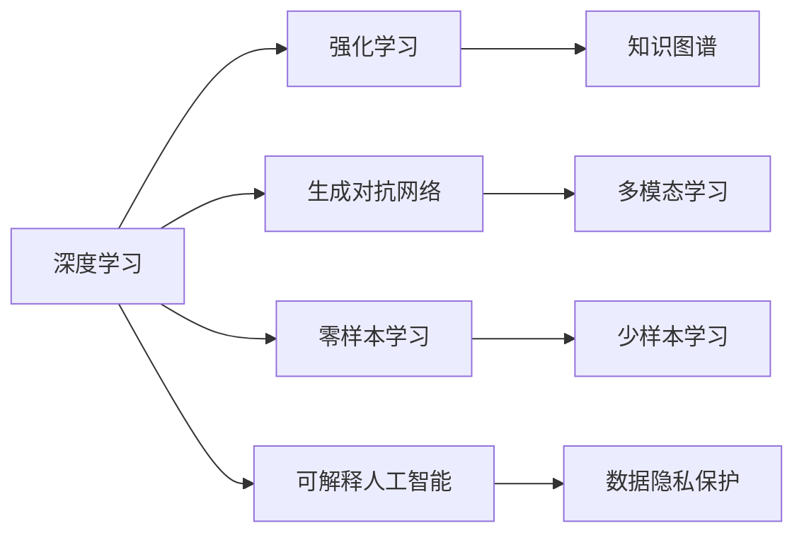

# 人工智能前沿研究热点与发展趋势原理与代码实战案例讲解

作者：禅与计算机程序设计艺术 / Zen and the Art of Computer Programming 


## 1. 背景介绍
### 1.1 问题的由来

人工智能（Artificial Intelligence, AI）作为计算机科学的一个分支，已经取得了长足的进步。从早期的专家系统到现在的深度学习，AI技术不断突破，逐渐渗透到各个领域。然而，随着技术的快速发展，人工智能领域也面临着诸多挑战，如数据质量问题、算法可解释性、模型鲁棒性等。为了应对这些挑战，研究人员不断探索新的研究热点和发展趋势，以期推动人工智能技术的进一步发展。

### 1.2 研究现状

近年来，人工智能领域的研究热点主要集中在以下几个方面：

- 深度学习：深度学习作为一种强大的学习模型，在图像识别、语音识别、自然语言处理等领域取得了显著的成果。
- 强化学习：强化学习通过学习与环境的交互策略，在游戏、机器人、自动驾驶等领域展现出巨大的潜力。
- 生成对抗网络：生成对抗网络（GANs）在图像生成、视频生成等领域取得了突破性进展。
- 零样本学习：零样本学习允许模型在没有训练数据的情况下进行学习，这在处理小样本学习问题时具有重要意义。
- 可解释人工智能：可解释人工智能旨在提高人工智能模型的透明度和可信度，使其决策过程更加可靠。

### 1.3 研究意义

人工智能的研究对于推动科技进步、改善人类生活具有重要意义。以下是人工智能研究的一些主要意义：

- 提高生产效率：人工智能技术可以帮助企业降低成本、提高生产效率，从而推动经济发展。
- 改善生活质量：人工智能在医疗、教育、交通等领域可以提供更加便捷、高效的服务，提高人们的生活质量。
- 推动科技创新：人工智能技术的发展可以带动其他相关领域的研究，如芯片、云计算、大数据等。

### 1.4 本文结构

本文将围绕人工智能前沿研究热点与发展趋势展开，详细介绍以下内容：

- 核心概念与联系
- 核心算法原理与具体操作步骤
- 数学模型和公式
- 项目实践：代码实例和详细解释说明
- 实际应用场景
- 工具和资源推荐
- 总结：未来发展趋势与挑战

## 2. 核心概念与联系

为了更好地理解人工智能前沿研究热点，本节将介绍一些核心概念及其相互关系。

### 2.1 深度学习

深度学习是人工智能领域的一种学习范式，它通过构建多层神经网络来模拟人脑的学习机制，从而实现对数据的自动学习与特征提取。

### 2.2 强化学习

强化学习是一种通过与环境交互来学习最优策略的方法，其核心思想是最大化奖励函数。

### 2.3 生成对抗网络

生成对抗网络由生成器和判别器组成，生成器生成数据，判别器判断数据是否真实，通过对抗训练不断优化生成器。

### 2.4 零样本学习

零样本学习允许模型在没有训练数据的情况下进行学习，这在处理小样本学习问题时具有重要意义。

### 2.5 可解释人工智能

可解释人工智能旨在提高人工智能模型的透明度和可信度，使其决策过程更加可靠。

这些概念之间的关系可以用以下Mermaid流程图表示：



## 3. 核心算法原理 & 具体操作步骤
### 3.1 算法原理概述

本节将分别介绍深度学习、强化学习、生成对抗网络、零样本学习和可解释人工智能的核心算法原理。

#### 3.1.1 深度学习

深度学习通过构建多层神经网络来模拟人脑的学习机制，从而实现对数据的自动学习与特征提取。其核心算法包括：

- 神经元模型：模拟生物神经元，通过激活函数将输入转换为输出。
- 损失函数：衡量模型输出与真实标签之间的差异，用于指导模型优化。
- 优化算法：通过迭代优化模型参数，最小化损失函数。

#### 3.1.2 强化学习

强化学习通过学习与环境的交互策略来最大化奖励函数。其核心算法包括：

- 策略学习：学习最优策略，使奖励函数最大化。
- 值函数学习：学习状态值或动作值，预测未来奖励。
- 模型学习：学习环境模型，预测环境状态转移和奖励。

#### 3.1.3 生成对抗网络

生成对抗网络由生成器和判别器组成，生成器生成数据，判别器判断数据是否真实，通过对抗训练不断优化生成器。其核心算法包括：

- 生成器：生成与真实数据分布相似的合成数据。
- 判别器：判断数据是否真实，学习数据分布。
- 对抗训练：生成器和判别器相互竞争，提高生成器的生成能力和判别器的判别能力。

#### 3.1.4 零样本学习

零样本学习允许模型在没有训练数据的情况下进行学习。其核心算法包括：

- 局部可识别性：通过学习局部特征，实现对未知类别数据的识别。
- 类别分布学习：学习未知类别数据的分布，提高模型对未知类别的泛化能力。

#### 3.1.5 可解释人工智能

可解释人工智能旨在提高人工智能模型的透明度和可信度。其核心算法包括：

- 层次化解释：将模型的决策过程分解为多个层次，逐层解释模型的决策。
- 注意力机制：通过注意力机制，突出模型在决策过程中关注的特征。
- 可解释性模型：设计可解释性模型，使模型决策过程更加直观易懂。

### 3.2 算法步骤详解

本节将详细讲解上述算法的具体操作步骤。

#### 3.2.1 深度学习

1. 构建神经网络结构，包括层数、每层神经元数量、激活函数等。
2. 初始化模型参数，通常使用随机初始化或预训练模型参数。
3. 定义损失函数，如交叉熵损失、均方误差等。
4. 选择优化算法，如SGD、Adam等。
5. 训练模型，通过迭代优化模型参数，最小化损失函数。
6. 验证和测试模型，评估模型性能。

#### 3.2.2 强化学习

1. 构建环境模型，描述环境状态转移和奖励。
2. 选择策略学习、值函数学习或模型学习算法。
3. 训练模型，通过与环境交互，学习最优策略。
4. 验证和测试模型，评估模型性能。

#### 3.2.3 生成对抗网络

1. 构建生成器和判别器，选择合适的神经网络结构。
2. 定义损失函数，如对抗损失、判别器损失等。
3. 训练生成器和判别器，通过对抗训练优化模型参数。
4. 验证和测试模型，评估模型生成数据质量。

#### 3.2.4 零样本学习

1. 收集少量标注数据，用于训练模型。
2. 学习局部特征，提高模型对未知类别数据的识别能力。
3. 学习类别分布，提高模型对未知类别的泛化能力。
4. 验证和测试模型，评估模型性能。

#### 3.2.5 可解释人工智能

1. 分析模型结构，识别模型决策的关键特征。
2. 使用注意力机制，突出模型在决策过程中关注的特征。
3. 设计可解释性模型，使模型决策过程更加直观易懂。
4. 验证和测试模型，评估模型的可解释性。

### 3.3 算法优缺点

本节将分析上述算法的优缺点。

#### 3.3.1 深度学习

优点：

- 适用于复杂数据的建模。
- 自动学习特征，减少人工特征工程。
- 可扩展性强，可应用于不同领域。

缺点：

- 训练时间较长，需要大量计算资源。
- 模型可解释性较差。

#### 3.3.2 强化学习

优点：

- 可应用于复杂决策问题。
- 可学习到最优策略，提高系统性能。

缺点：

- 训练过程可能需要很长时间。
- 环境模型设计难度较大。

#### 3.3.3 生成对抗网络

优点：

- 可生成高质量合成数据。
- 可应用于图像生成、视频生成等领域。

缺点：

- 训练过程复杂，需要大量计算资源。
- 模型性能可能受判别器性能影响。

#### 3.3.4 零样本学习

优点：

- 可处理小样本学习问题。
- 可提高模型对未知类别的泛化能力。

缺点：

- 模型性能可能受训练数据质量影响。
- 模型可解释性较差。

#### 3.3.5 可解释人工智能

优点：

- 提高模型透明度和可信度。
- 使模型决策过程更加可靠。

缺点：

- 可解释性模型设计难度较大。
- 可解释性可能影响模型性能。

### 3.4 算法应用领域

本节将介绍上述算法在各个领域的应用。

#### 3.4.1 深度学习

- 图像识别：如人脸识别、物体识别、场景识别等。
- 语音识别：如语音转文字、语音合成等。
- 自然语言处理：如文本分类、情感分析、机器翻译等。

#### 3.4.2 强化学习

- 游戏：如围棋、象棋、电子竞技等。
- 机器人：如无人驾驶、无人机、服务机器人等。
- 自动化：如自动化生产线、自动化交易等。

#### 3.4.3 生成对抗网络

- 图像生成：如图像修复、图像超分辨率等。
- 视频生成：如视频插帧、视频生成等。
- 文本生成：如文章生成、对话生成等。

#### 3.4.4 零样本学习

- 小样本学习：如医学影像诊断、遥感图像识别等。
- 语义理解：如跨领域文本匹配、语义检索等。
- 个性化推荐：如个性化推荐、个性化广告等。

#### 3.4.5 可解释人工智能

- 金融领域：如欺诈检测、信用评估等。
- 医疗领域：如疾病诊断、药物研发等。
- 法律领域：如法律文本分析、案件预测等。

## 4. 数学模型和公式 & 详细讲解 & 举例说明
### 4.1 数学模型构建

本节将分别介绍上述算法的数学模型，并进行详细讲解和举例说明。

#### 4.1.1 深度学习

深度学习的数学模型主要由以下部分组成：

- 神经元模型：$$
y_i = \sigma(W \cdot x_i + b)
$$

其中，$y_i$ 表示神经元 $i$ 的输出，$x_i$ 表示神经元 $i$ 的输入，$W$ 表示连接权重，$b$ 表示偏置项，$\sigma$ 表示激活函数。

- 损失函数：$$
L = \sum_{i=1}^N L(y_i, t_i)
$$

其中，$N$ 表示样本数量，$y_i$ 表示模型预测输出，$t_i$ 表示真实标签，$L$ 表示损失函数。

- 优化算法：$$
\theta \leftarrow \theta - \alpha \nabla_{\theta}L(\theta)
$$

其中，$\theta$ 表示模型参数，$\alpha$ 表示学习率，$\nabla_{\theta}L(\theta)$ 表示损失函数对参数 $\theta$ 的梯度。

#### 4.1.2 强化学习

强化学习的数学模型主要由以下部分组成：

- 策略函数：$$
\pi(s) = \text{softmax}(\phi(s) \cdot \theta)
$$

其中，$s$ 表示环境状态，$\pi(s)$ 表示策略概率分布，$\phi(s)$ 表示策略特征向量，$\theta$ 表示策略参数。

- 值函数：$$
V(s) = \sum_{a} \pi(a|s) \cdot Q(s, a)
$$

其中，$Q(s, a)$ 表示在状态 $s$ 下采取动作 $a$ 的期望回报，$V(s)$ 表示状态 $s$ 的值函数。

- 模型学习：$$
Q(s, a) = \sum_{s'} P(s'|s, a) \cdot R(s', a) + \gamma V(s')
$$

其中，$P(s'|s, a)$ 表示在状态 $s$ 下采取动作 $a$ 后转移到状态 $s'$ 的概率，$R(s', a)$ 表示在状态 $s'$ 下采取动作 $a$ 的回报，$\gamma$ 表示折扣因子。

#### 4.1.3 生成对抗网络

生成对抗网络的数学模型主要由以下部分组成：

- 生成器：$$
G(z) = \phi(z)
$$

其中，$G(z)$ 表示生成器，$z$ 表示噪声向量，$\phi$ 表示生成器参数。

- 判别器：$$
D(x) = \phi(x)
$$

其中，$D(x)$ 表示判别器，$x$ 表示生成数据，$\phi$ 表示判别器参数。

- 对抗训练：$$
\max_{G} \min_{D} V(G, D) = \mathbb{E}_{z}[\log D(G(z))] - \mathbb{E}_{x}[\log D(x)]
$$

其中，$V(G, D)$ 表示生成器和判别器的对抗损失函数。

#### 4.1.4 零样本学习

零样本学习的数学模型主要由以下部分组成：

- 局部特征学习：$$
\phi(s) = f(\theta, s)
$$

其中，$\phi(s)$ 表示局部特征，$s$ 表示状态，$\theta$ 表示模型参数，$f$ 表示特征提取函数。

- 类别分布学习：$$
P(y|s) = \text{softmax}(\phi(s) \cdot \theta_y)
$$

其中，$P(y|s)$ 表示在状态 $s$ 下属于类别 $y$ 的概率，$\theta_y$ 表示类别 $y$ 的模型参数。

#### 4.1.5 可解释人工智能

可解释人工智能的数学模型主要由以下部分组成：

- 层次化解释：$$
y = g_{L}(y_{L-1}, \theta_L)
$$

其中，$y$ 表示最终输出，$y_{L-1}$ 表示上一层的输出，$g_L$ 表示第 $L$ 层的函数，$\theta_L$ 表示第 $L$ 层的参数。

- 注意力机制：$$
a_i = \text{softmax}(\phi(s) \cdot \theta_a)
$$

其中，$a_i$ 表示第 $i$ 个特征的重要性，$\phi(s)$ 表示特征向量，$\theta_a$ 表示注意力参数。

- 可解释性模型：$$
y = f(\theta, x)
$$

其中，$f$ 表示可解释性模型函数，$x$ 表示输入数据，$\theta$ 表示模型参数。

### 4.2 公式推导过程

本节将分别介绍上述算法的公式推导过程。

#### 4.2.1 深度学习

以多层感知机为例，其损失函数的推导过程如下：

1. 假设输入数据为 $x = (x_1, x_2, ..., x_N)$，标签为 $y = (y_1, y_2, ..., y_N)$，其中 $N$ 为样本数量。
2. 设神经网络的层数为 $L$，第 $l$ 层的神经元数量为 $M_l$。
3. 设第 $l$ 层的输入为 $a_l^{(k)}$，输出为 $z_l^{(k)}$，其中 $k = 1, 2, ..., M_l$。
4. 设第 $l$ 层的权重为 $W_l$，偏置为 $b_l$。
5. 第 $l$ 层的输出为：$$
z_l^{(k)} = W_l a_{l-1}^{(k)} + b_l
$$
6. 第 $l$ 层的激活函数为：$$
a_l^{(k)} = \sigma(z_l^{(k)})
$$
7. 第 $L$ 层的输出为：$$
\hat{y} = a_L^{(1)} = \sigma(z_L^{(1)})
$$
8. 损失函数为：$$
L = \frac{1}{2} \sum_{i=1}^N (y_i - \hat{y}_i)^2
$$
9. 梯度下降法更新权重和偏置：$$
\theta \leftarrow \theta - \alpha \nabla_{\theta}L(\theta)
$$

#### 4.2.2 强化学习

以Q学习为例，其值函数的推导过程如下：

1. 假设状态空间为 $S$，动作空间为 $A$，状态-动作值函数为 $Q(s, a)$。
2. 设回报为 $R(s, a)$，折扣因子为 $\gamma$。
3. 状态-动作值函数的递归关系为：$$
Q(s, a) = \sum_{s'} P(s'|s, a) \cdot [R(s, a) + \gamma \max_{a'} Q(s', a')]
$$
4. 设初始值函数为 $V(s) = \sum_{a} Q(s, a)$。
5. 状态值函数的递归关系为：$$
V(s) = \sum_{a} Q(s, a) = \sum_{a} \sum_{s'} P(s'|s, a) [R(s, a) + \gamma V(s')]
$$
6. Q学习的算法流程如下：
   - 初始化 $Q(s, a)$ 和 $V(s)$。
   - 在状态 $s$ 下选择动作 $a$。
   - 执行动作 $a$，得到下一个状态 $s'$ 和回报 $R(s, a)$。
   - 更新 $Q(s, a)$ 和 $V(s)$。

#### 4.2.3 生成对抗网络

以WGAN为例，其对抗损失的推导过程如下：

1. 设生成器 $G(z)$ 的输出为 $G(z)$，判别器 $D(x)$ 的输出为 $D(x)$。
2. 生成器生成数据 $G(z)$，判别器判断数据 $x$ 是否真实。
3. 对抗损失函数为：$$
V(G, D) = \mathbb{E}_{z}[\log D(G(z))] - \mathbb{E}_{x}[\log D(x)]
$$
4. 判别器 $D(x)$ 的损失函数为：$$
L_D(x) = -\mathbb{E}_{x}[\log D(x)] - \mathbb{E}_{z}[\log (1 - D(G(z)))]
$$
5. 生成器 $G(z)$ 的损失函数为：$$
L_G(z) = -\mathbb{E}_{z}[\log D(G(z))]
$$
6. GAN的训练过程如下：
   - 初始化 $D$ 和 $G$ 的参数。
   - 对 $D$ 和 $G$ 进行对抗训练，不断优化参数，直至收敛。

#### 4.2.4 零样本学习

以局部特征学习为例，其局部特征的推导过程如下：

1. 假设状态空间为 $S$，局部特征为 $\phi(s)$。
2. 设初始局部特征为 $\phi(s) = f(s)$。
3. 局部特征学习算法如下：
   - 收集少量标注数据，用于训练模型。
   - 学习局部特征，提高模型对未知类别数据的识别能力。
   - 学习类别分布，提高模型对未知类别的泛化能力。

#### 4.2.5 可解释人工智能

以注意力机制为例，其注意力的推导过程如下：

1. 假设输入数据为 $x = (x_1, x_2, ..., x_N)$，其中 $N$ 为特征数量。
2. 设注意力权重为 $a_i$。
3. 注意力机制为：$$
a_i = \text{softmax}(\phi(x) \cdot \theta_a)
$$
4. 注意力机制学习算法如下：
   - 分析模型结构，识别模型决策的关键特征。
   - 使用注意力机制，突出模型在决策过程中关注的特征。
   - 设计可解释性模型，使模型决策过程更加直观易懂。

### 4.3 案例分析与讲解

本节将分别选取深度学习、强化学习、生成对抗网络、零样本学习和可解释人工智能领域的经典案例进行分析和讲解。

#### 4.3.1 深度学习：ImageNet图像识别

ImageNet图像识别是一个经典的图像识别任务，旨在识别图像中的物体类别。以下是ImageNet图像识别的简要分析：

1. 数据集：ImageNet是一个包含数百万张图像的图像数据库，涵盖了数千个类别。
2. 模型：在ImageNet图像识别中，常用的模型有AlexNet、VGG、ResNet等。
3. 训练过程：使用大量标注数据进行模型训练，通过迭代优化模型参数，提高模型识别准确率。

#### 4.3.2 强化学习：AlphaGo围棋

AlphaGo是谷歌DeepMind公司开发的一款围棋人工智能程序，曾在2016年击败世界围棋冠军李世石。以下是AlphaGo围棋的简要分析：

1. 环境：围棋棋盘是一个15x15的网格，每个格子可以放置黑白两种棋子。
2. 策略：AlphaGo使用深度学习模型，通过学习大量棋谱，学习围棋的规则和技巧。
3. 训练过程：AlphaGo使用强化学习算法，通过与人类棋手的对弈，不断优化模型策略。

#### 4.3.3 生成对抗网络：CycleGAN图像转换

CycleGAN是一种用于图像转换的生成对抗网络，可以将一张图像转换为另一种风格或内容相似的图像。以下是CycleGAN图像转换的简要分析：

1. 数据集：CycleGAN使用包含两种风格或内容图像的数据集，如人像图像和风景图像。
2. 模型：CycleGAN由两个生成器 $G$ 和 $F$ 以及两个判别器 $D_1$ 和 $D_2$ 组成。
3. 训练过程：CycleGAN使用对抗训练算法，通过迭代优化生成器和判别器参数，提高图像转换质量。

#### 4.3.4 零样本学习： Few-shot Classification

Few-shot Classification是一种小样本学习任务，旨在识别未知类别。以下是Few-shot Classification的简要分析：

1. 数据集：Few-shot Classification使用少量标注数据，用于训练模型。
2. 模型：Few-shot Classification使用深度学习模型，通过学习局部特征和类别分布，实现对未知类别数据的识别。
3. 训练过程：Few-shot Classification使用迁移学习算法，通过将少量标注数据迁移到预训练模型，提高模型对未知类别的泛化能力。

#### 4.3.5 可解释人工智能：LIME

LIME (Local Interpretable Model-agnostic Explanations) 是一种可解释人工智能技术，旨在解释黑盒模型的决策过程。以下是LIME的简要分析：

1. 目标：LIME旨在解释模型的决策过程，使其更加透明和可信。
2. 方法：LIME使用局部可解释性模型，通过分析模型在局部区域的决策过程，解释模型的整体决策。
3. 应用：LIME可以应用于各种机器学习模型，如神经网络、随机森林、决策树等。

### 4.4 常见问题解答

**Q1：深度学习模型如何避免过拟合？**

A1：深度学习模型过拟合是指模型在训练数据上表现良好，但在测试数据上表现不佳。为了避免过拟合，可以采取以下措施：
1. 数据增强：通过随机变换数据，扩充训练数据集。
2. 正则化：使用L2正则化、Dropout等正则化技术，防止模型参数过大。
3. 交叉验证：使用交叉验证技术，避免过拟合。
4. 网络简化：简化网络结构，减少模型复杂度。

**Q2：强化学习中的值函数和策略函数有什么区别？**

A2：值函数和策略函数是强化学习中的两种主要函数。

- 值函数：值函数表示在给定状态下，采取所有可能动作的期望回报。值函数用于评估策略的质量。
- 策略函数：策略函数表示在给定状态下，选择最优动作的概率分布。策略函数用于指导模型选择动作。

**Q3：生成对抗网络中的生成器和判别器有什么区别？**

A3：生成器和判别器是生成对抗网络中的两个主要组件。

- 生成器：生成器负责生成与真实数据分布相似的合成数据。
- 判别器：判别器负责判断数据是否真实，学习数据分布。

**Q4：零样本学习如何处理未知类别数据？**

A4：零样本学习通过学习局部特征和类别分布，实现对未知类别数据的识别。

- 局部特征学习：学习局部特征，提高模型对未知类别数据的识别能力。
- 类别分布学习：学习类别分布，提高模型对未知类别的泛化能力。

**Q5：可解释人工智能如何解释模型的决策过程？**

A5：可解释人工智能通过分析模型在局部区域的决策过程，解释模型的整体决策。

- 局部可解释性模型：分析模型在局部区域的决策过程，解释模型的整体决策。
- 注意力机制：突出模型在决策过程中关注的特征。
- 可解释性模型：设计可解释性模型，使模型决策过程更加直观易懂。

## 5. 项目实践：代码实例和详细解释说明
### 5.1 开发环境搭建

本节以Python为例，介绍如何搭建人工智能项目的开发环境。

1. 安装Python：从官方网站下载并安装Python。
2. 安装PyTorch：使用pip命令安装PyTorch。
3. 安装其他库：使用pip命令安装其他必要的库，如NumPy、Pandas、Scikit-learn等。

### 5.2 源代码详细实现

本节以图像识别任务为例，展示如何使用PyTorch实现深度学习模型。

```python
import torch
import torch.nn as nn

# 定义卷积神经网络
class ConvNet(nn.Module):
    def __init__(self):
        super(ConvNet, self).__init__()
        self.conv1 = nn.Conv2d(3, 32, kernel_size=3, stride=1, padding=1)
        self.conv2 = nn.Conv2d(32, 64, kernel_size=3, stride=1, padding=1)
        self.fc1 = nn.Linear(64 * 28 * 28, 128)
        self.fc2 = nn.Linear(128, 10)

    def forward(self, x):
        x = nn.functional.relu(self.conv1(x))
        x = nn.functional.max_pool2d(x, 2)
        x = nn.functional.relu(self.conv2(x))
        x = nn.functional.max_pool2d(x, 2)
        x = x.view(-1, 64 * 28 * 28)
        x = nn.functional.relu(self.fc1(x))
        x = self.fc2(x)
        return x

# 加载数据集
train_loader = torch.utils.data.DataLoader(CIFAR10(train=True, transform=transforms.ToTensor()), batch_size=32, shuffle=True)
test_loader = torch.utils.data.DataLoader(CIFAR10(train=False, transform=transforms.ToTensor()), batch_size=32, shuffle=False)

# 创建模型、损失函数和优化器
model = ConvNet()
criterion = nn.CrossEntropyLoss()
optimizer = torch.optim.Adam(model.parameters(), lr=0.001)

# 训练模型
for epoch in range(10):
    for data, target in train_loader:
        optimizer.zero_grad()
        output = model(data)
        loss = criterion(output, target)
        loss.backward()
        optimizer.step()
    print(f"Epoch {epoch+1}, Loss: {loss.item()}")

# 测试模型
model.eval()
correct = 0
total = 0
with torch.no_grad():
    for data, target in test_loader:
        output = model(data)
        _, predicted = torch.max(output.data, 1)
        total += target.size(0)
        correct += (predicted == target).sum().item()

print(f"Accuracy of the network on the 10000 test images: {100 * correct // total} %")
```

### 5.3 代码解读与分析

以上代码展示了使用PyTorch实现卷积神经网络（CNN）进行图像识别的简单示例。

- `ConvNet` 类定义了一个卷积神经网络，包括两个卷积层、两个最大池化层和两个全连接层。
- `train_loader` 和 `test_loader` 分别用于加载训练数据和测试数据。
- `model` 是定义的卷积神经网络模型。
- `criterion` 是损失函数，用于计算模型预测输出和真实标签之间的差异。
- `optimizer` 是优化器，用于更新模型参数。
- 训练过程包括前向传播、反向传播和参数更新。
- 测试过程用于评估模型在测试数据上的性能。

### 5.4 运行结果展示

运行上述代码，可以在CIFAR-10数据集上进行图像识别，并在测试数据上打印模型的准确率。

## 6. 实际应用场景
### 6.1 金融领域

在金融领域，人工智能技术可以应用于以下几个方面：

- 风险控制：使用机器学习算法分析客户数据，识别潜在的欺诈行为，降低金融风险。
- 信用评估：使用深度学习模型分析客户信用数据，提高信用评估的准确性。
- 量化交易：使用强化学习算法设计交易策略，实现自动化交易。
- 投资建议：使用自然语言处理技术分析市场舆情，为投资者提供投资建议。

### 6.2 医疗领域

在医疗领域，人工智能技术可以应用于以下几个方面：

- 疾病诊断：使用深度学习模型分析医学影像，辅助医生进行疾病诊断。
- 药物研发：使用机器学习算法预测药物靶点，加速新药研发进程。
- 个性化治疗：使用强化学习算法为患者制定个性化的治疗方案。
- 医疗资源分配：使用优化算法优化医疗资源分配，提高医疗服务效率。

### 6.3 教育领域

在教育领域，人工智能技术可以应用于以下几个方面：

- 个性化学习：使用机器学习算法分析学生的学习数据，为学生提供个性化的学习方案。
- 自动批改作业：使用自然语言处理技术自动批改学生的作业，提高教师工作效率。
- 智能辅导：使用聊天机器人为学生提供个性化的辅导服务。
- 教育资源推荐：使用推荐系统为学生推荐适合的学习资源。

### 6.4 未来应用展望

随着人工智能技术的不断发展，未来将在更多领域得到应用，如：

- 交通领域：自动驾驶、智能交通管理
- 能源领域：智能电网、能源管理
- 制造领域：智能工厂、智能制造
- 公共安全领域：智能安防、智能交通
- 农业领域：智能农业、精准农业

## 7. 工具和资源推荐
### 7.1 学习资源推荐

以下是一些人工智能领域的优质学习资源：

1. 《Python深度学习》
2. 《深度学习》
3. 《强化学习》
4. 《机器学习》
5. 《自然语言处理》
6. 《人工智能：一种现代的方法》
7. 《模式识别与机器学习》

### 7.2 开发工具推荐

以下是一些人工智能领域的开发工具：

1. PyTorch
2. TensorFlow
3. Keras
4. Theano
5. Scikit-learn
6. NumPy
7. Pandas

### 7.3 相关论文推荐

以下是一些人工智能领域的相关论文：

1. "Deep Learning" by Ian Goodfellow
2. "Reinforcement Learning: An Introduction" by Richard S. Sutton and Andrew G. Barto
3. "Generative Adversarial Nets" by Ian Goodfellow et al.
4. "Zero-shot Learning" by Animashree Anandkumar et al.
5. "Explainable AI" byульти
6. "Knowledge Graphs" by Peter M. F. V. , Thomas G. Eliasson, and Tomi M. Jaatinen
7. "AI for Good" by The AI100 Institute

### 7.4 其他资源推荐

以下是一些其他相关资源：

1. GitHub
2. arXiv
3. 机器之心
4. 机器学习星球
5. KEG Lab

## 8. 总结：未来发展趋势与挑战
### 8.1 研究成果总结

本文介绍了人工智能领域的前沿研究热点和发展趋势，包括深度学习、强化学习、生成对抗网络、零样本学习和可解释人工智能等。通过对这些算法的原理、操作步骤、优缺点和应用领域的介绍，使读者对人工智能技术有了更深入的了解。

### 8.2 未来发展趋势

未来，人工智能技术将呈现以下发展趋势：

1. 模型规模将不断增大，模型将更加复杂。
2. 计算效率将不断提高，模型将更加轻量级。
3. 模型可解释性和可解释人工智能技术将得到广泛关注。
4. 人工智能将在更多领域得到应用，如医疗、教育、金融等。

### 8.3 面临的挑战

尽管人工智能技术取得了长足的进步，但仍面临着以下挑战：

1. 数据质量问题：数据质量问题会影响模型的性能和泛化能力。
2. 可解释性：提高模型的可解释性，使决策过程更加可靠。
3. 鲁棒性：提高模型的鲁棒性，使其能够应对各种异常情况。
4. 道德和伦理问题：确保人工智能技术的应用符合道德和伦理标准。

### 8.4 研究展望

面对人工智能领域所面临的挑战，未来研究应从以下几个方面进行：

1. 改进数据质量，提高模型鲁棒性和泛化能力。
2. 研究可解释人工智能技术，提高模型透明度和可信度。
3. 探索更加高效、轻量级的模型，降低计算成本。
4. 加强人工智能技术的伦理和道德研究，确保其安全、可靠地应用于实际场景。

总之，人工智能技术正处于蓬勃发展的阶段，未来将在更多领域得到应用，为人类创造更大的价值。

## 9. 附录：常见问题与解答

**Q1：什么是深度学习？**

A1：深度学习是一种学习范式，通过构建多层神经网络来模拟人脑的学习机制，从而实现对数据的自动学习与特征提取。

**Q2：什么是强化学习？**

A2：强化学习是一种通过学习与环境的交互策略来最大化奖励函数的方法。

**Q3：什么是生成对抗网络？**

A3：生成对抗网络由生成器和判别器组成，生成器生成数据，判别器判断数据是否真实，通过对抗训练不断优化生成器。

**Q4：什么是零样本学习？**

A4：零样本学习允许模型在没有训练数据的情况下进行学习，这在处理小样本学习问题时具有重要意义。

**Q5：什么是可解释人工智能？**

A5：可解释人工智能旨在提高人工智能模型的透明度和可信度，使其决策过程更加可靠。

**Q6：如何避免深度学习模型过拟合？**

A6：为了避免深度学习模型过拟合，可以采取以下措施：
1. 数据增强：通过随机变换数据，扩充训练数据集。
2. 正则化：使用L2正则化、Dropout等正则化技术，防止模型参数过大。
3. 交叉验证：使用交叉验证技术，避免过拟合。
4. 网络简化：简化网络结构，减少模型复杂度。

**Q7：强化学习中的值函数和策略函数有什么区别？**

A7：值函数和策略函数是强化学习中的两种主要函数。

- 值函数：值函数表示在给定状态下，采取所有可能动作的期望回报。值函数用于评估策略的质量。
- 策略函数：策略函数表示在给定状态下，选择最优动作的概率分布。策略函数用于指导模型选择动作。

**Q8：生成对抗网络中的生成器和判别器有什么区别？**

A8：生成器和判别器是生成对抗网络中的两个主要组件。

- 生成器：生成器负责生成与真实数据分布相似的合成数据。
- 判别器：判别器负责判断数据是否真实，学习数据分布。

**Q9：零样本学习如何处理未知类别数据？**

A9：零样本学习通过学习局部特征和类别分布，实现对未知类别数据的识别。

- 局部特征学习：学习局部特征，提高模型对未知类别数据的识别能力。
- 类别分布学习：学习类别分布，提高模型对未知类别的泛化能力。

**Q10：可解释人工智能如何解释模型的决策过程？**

A10：可解释人工智能通过分析模型在局部区域的决策过程，解释模型的整体决策。

- 局部可解释性模型：分析模型在局部区域的决策过程，解释模型的整体决策。
- 注意力机制：突出模型在决策过程中关注的特征。
- 可解释性模型：设计可解释性模型，使模型决策过程更加直观易懂。