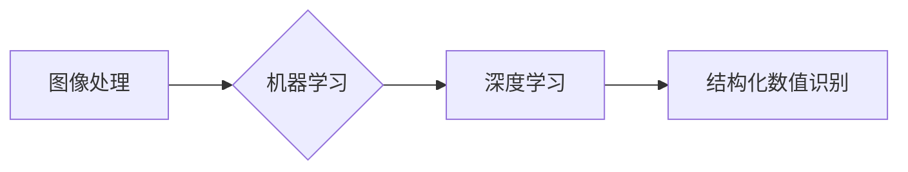

# 基于图像的结构化数值识别系统设计与实现

作者：禅与计算机程序设计艺术 / Zen and the Art of Computer Programming

## 1. 背景介绍

### 1.1 问题的由来

随着信息技术的飞速发展，结构化数据在各个领域都得到了广泛应用。这些数据通常以表格、报表等形式呈现，其中包含了大量的数值信息。然而，这些数值信息往往以图像的形式存储，需要进行识别和提取，才能被计算机系统理解和处理。因此，基于图像的结构化数值识别成为了一个重要的研究课题。

### 1.2 研究现状

目前，基于图像的结构化数值识别技术主要分为两大类：基于传统图像处理技术和基于深度学习的图像识别技术。

**基于传统图像处理技术**的主要方法包括：

* **边缘检测**：通过检测图像中的边缘信息，提取数值区域的轮廓。
* **形态学处理**：通过膨胀、腐蚀等操作，去除噪声，突出数值区域。
* **模板匹配**：将数值区域的图像与模板进行匹配，识别出相应的数值。

**基于深度学习的图像识别技术**的主要方法包括：

* **卷积神经网络（CNN）**：通过多层卷积和池化操作，提取数值区域的特征。
* **循环神经网络（RNN）**：通过循环连接，处理序列化的数值信息。
* **长短期记忆网络（LSTM）**：通过引入门控机制，更好地处理长序列的数值信息。

### 1.3 研究意义

基于图像的结构化数值识别技术在各个领域都有广泛的应用，例如：

* **金融领域**：自动识别发票、支票、报表等文档中的数值信息。
* **工业领域**：自动识别产品上的二维码、条形码等。
* **医疗领域**：自动识别病历、影像资料等文档中的数值信息。

研究基于图像的结构化数值识别技术，对于提高工作效率、降低人工成本、提升自动化程度具有重要意义。

### 1.4 本文结构

本文将围绕基于图像的结构化数值识别系统展开，主要内容包括：

* 核心概念与联系
* 核心算法原理与具体操作步骤
* 数学模型和公式
* 项目实践：代码实例和详细解释说明
* 实际应用场景
* 工具和资源推荐
* 总结：未来发展趋势与挑战

## 2. 核心概念与联系

为了更好地理解基于图像的结构化数值识别系统，本节将介绍几个核心概念及其相互关系。

### 2.1 图像处理

图像处理是指对图像进行一系列操作，以改善图像质量、提取图像信息或实现图像分析。常见的图像处理操作包括：

* **边缘检测**：检测图像中的边缘信息，提取图像的轮廓。
* **形态学处理**：通过对图像进行膨胀、腐蚀等操作，去除噪声，突出图像特征。
* **特征提取**：从图像中提取具有代表性的特征，用于后续的识别和分析。

### 2.2 机器学习

机器学习是一种让计算机通过数据学习并做出决策的技术。常见的机器学习方法包括：

* **监督学习**：通过已标记的训练数据学习模型，用于预测新的样本。
* **无监督学习**：通过未标记的训练数据学习模型，用于发现数据中的模式和结构。
* **强化学习**：通过与环境交互学习最优策略，实现决策优化。

### 2.3 深度学习

深度学习是一种利用深度神经网络进行学习的技术。深度神经网络由多个层次组成，每层神经网络从下至上提取图像特征，最终实现对图像的识别和分析。

### 2.4 关系图

以下是上述概念之间的关系图：



## 3. 核心算法原理与具体操作步骤

### 3.1 算法原理概述

基于图像的结构化数值识别系统通常采用以下步骤：

1. **图像预处理**：对原始图像进行灰度化、去噪、二值化等操作，提高图像质量，方便后续处理。
2. **特征提取**：从预处理后的图像中提取特征，例如边缘、角点、纹理等。
3. **数值区域识别**：根据提取的特征，识别图像中的数值区域。
4. **数值提取**：对识别出的数值区域进行分割，提取出数字字符。
5. **数字识别**：利用机器学习或深度学习模型，识别出每个数字字符。

### 3.2 算法步骤详解

以下将详细介绍基于深度学习的数值识别系统的具体操作步骤。

#### 3.2.1 图像预处理

图像预处理是图像处理的第一步，其目的是提高图像质量，方便后续处理。常见的图像预处理操作包括：

* **灰度化**：将彩色图像转换为灰度图像，降低图像的复杂度。
* **去噪**：去除图像中的噪声，提高图像的清晰度。
* **二值化**：将图像转换为二值图像，突出图像中的前景和背景。

#### 3.2.2 特征提取

特征提取是从图像中提取具有代表性的特征的过程。常见的特征提取方法包括：

* **边缘检测**：使用Sobel算子、Canny算子等方法检测图像中的边缘信息。
* **角点检测**：使用Harris算子、Shi-Tomasi算子等方法检测图像中的角点信息。
* **纹理分析**：使用灰度共生矩阵、Gabor滤波器等方法分析图像的纹理特征。

#### 3.2.3 数值区域识别

数值区域识别是根据提取的特征，识别图像中的数值区域。常见的识别方法包括：

* **形态学操作**：使用膨胀、腐蚀等操作，去除噪声，突出数值区域。
* **轮廓检测**：使用OpenCV库中的findContours函数检测图像中的轮廓。

#### 3.2.4 数值提取

数值提取是对识别出的数值区域进行分割，提取出数字字符。常见的分割方法包括：

* **连通域分析**：使用OpenCV库中的findContours函数，对识别出的数值区域进行分割。
* **形状分析**：根据数字字符的形状特征，将其分割为单个数字字符。

#### 3.2.5 数字识别

数字识别是利用机器学习或深度学习模型，识别出每个数字字符。常见的识别方法包括：

* **支持向量机（SVM）**：使用SVM模型对分割后的数字字符进行分类。
* **卷积神经网络（CNN）**：使用CNN模型对分割后的数字字符进行特征提取和分类。
* **循环神经网络（RNN）**：使用RNN模型处理序列化的数字字符。

### 3.3 算法优缺点

以下是对上述算法的优缺点进行分析：

**优点**：

* **鲁棒性强**：基于深度学习的数值识别系统具有较好的鲁棒性，能够适应不同光照、角度、字体等条件。
* **识别精度高**：基于深度学习的数值识别系统具有很高的识别精度，能够准确识别出数字字符。

**缺点**：

* **计算量大**：基于深度学习的数值识别系统需要大量的计算资源，例如GPU。
* **训练数据需求量大**：基于深度学习的数值识别系统需要大量的训练数据，以便模型能够学习到丰富的特征。

### 3.4 算法应用领域

基于深度学习的数值识别系统可以应用于以下领域：

* **金融领域**：自动识别发票、支票、报表等文档中的数值信息。
* **工业领域**：自动识别产品上的二维码、条形码等。
* **医疗领域**：自动识别病历、影像资料等文档中的数值信息。

## 4. 数学模型和公式

### 4.1 数学模型构建

基于深度学习的数值识别系统通常采用以下数学模型：

* **卷积神经网络（CNN）**：
    * 输入：图像
    * 输出：数字字符
    * 模型结构：卷积层、池化层、全连接层
* **循环神经网络（RNN）**：
    * 输入：序列化的数字字符
    * 输出：数字字符
    * 模型结构：循环层、全连接层

### 4.2 公式推导过程

以下将对CNN和RNN的数学模型进行推导。

#### 4.2.1 卷积神经网络（CNN）

CNN的数学模型可以表示为：

$$
\hat{y} = f(W_L\hat{x})
$$

其中：

* $\hat{y}$ 表示输出
* $\hat{x}$ 表示输入
* $W_L$ 表示最后一层的权重
* $f$ 表示激活函数

#### 4.2.2 循环神经网络（RNN）

RNN的数学模型可以表示为：

$$
\hat{y}_{t+1} = f(W_L\hat{x}_{t+1}, W_H\hat{h}_t, W_F\hat{h}_t)
$$

其中：

* $\hat{y}_{t+1}$ 表示时间步 $t+1$ 的输出
* $\hat{x}_{t+1}$ 表示时间步 $t+1$ 的输入
* $\hat{h}_t$ 表示时间步 $t$ 的隐藏状态
* $W_L, W_H, W_F$ 表示权重
* $f$ 表示激活函数

### 4.3 案例分析与讲解

以下将结合具体案例，讲解基于深度学习的数值识别系统。

#### 4.3.1 案例一：基于CNN的数值识别

假设我们使用CNN模型对图像中的数字字符进行识别。模型的输入为图像，输出为数字字符。

* 输入：图像
* 输出：数字字符
* 模型结构：卷积层、池化层、全连接层

首先，将图像转换为灰度图像，并对其进行去噪处理。

然后，使用Sobel算子检测图像中的边缘信息。

接着，使用形态学操作去除噪声，突出数字字符。

最后，使用CNN模型对处理后的图像进行识别。

#### 4.3.2 案例二：基于RNN的数值识别

假设我们使用RNN模型对序列化的数字字符进行识别。模型的输入为序列化的数字字符，输出为数字字符。

* 输入：序列化的数字字符
* 输出：数字字符
* 模型结构：循环层、全连接层

首先，将序列化的数字字符转换为RNN模型的输入格式。

然后，使用RNN模型对输入的序列进行识别。

最后，将识别结果转换为数字字符。

### 4.4 常见问题解答

**Q1：如何提高数值识别的精度？**

A1：提高数值识别精度的方法包括：

* 使用更复杂的模型结构，例如增加卷积层数或循环层数。
* 使用更大的训练数据集。
* 使用更先进的训练技巧，例如数据增强、正则化等。

**Q2：如何提高数值识别的鲁棒性？**

A2：提高数值识别鲁棒性的方法包括：

* 使用更鲁棒的图像预处理方法，例如使用更先进的去噪算法。
* 使用更鲁棒的模型结构，例如使用更复杂的卷积神经网络或循环神经网络。
* 使用更鲁棒的训练技巧，例如使用数据增强、迁移学习等。

**Q3：如何处理不同字体的数值识别？**

A3：处理不同字体的数值识别的方法包括：

* 使用多种字体的训练数据。
* 使用更鲁棒的模型结构。
* 使用更鲁棒的训练技巧。

## 5. 项目实践：代码实例和详细解释说明

### 5.1 开发环境搭建

在进行项目实践之前，需要搭建以下开发环境：

* **操作系统**：Linux或Windows
* **Python**：3.6以上版本
* **PyTorch**：最新版本
* **OpenCV**：最新版本

### 5.2 源代码详细实现

以下是一个使用PyTorch实现的基于CNN的数值识别系统的示例代码：

```python
import torch
import torch.nn as nn
import torch.optim as optim
import cv2
import numpy as np

# 定义CNN模型
class CNN(nn.Module):
    def __init__(self):
        super(CNN, self).__init__()
        self.conv1 = nn.Conv2d(1, 32, kernel_size=3, stride=1, padding=1)
        self.relu = nn.ReLU()
        self.max_pool1 = nn.MaxPool2d(kernel_size=2, stride=2, padding=0)
        self.conv2 = nn.Conv2d(32, 64, kernel_size=3, stride=1, padding=1)
        self.max_pool2 = nn.MaxPool2d(kernel_size=2, stride=2, padding=0)
        self.fc1 = nn.Linear(64*16*16, 64)
        self.relu1 = nn.ReLU()
        self.fc2 = nn.Linear(64, 10)

    def forward(self, x):
        x = self.relu(self.conv1(x))
        x = self.max_pool1(x)
        x = self.relu(self.conv2(x))
        x = self.max_pool2(x)
        x = x.view(-1, 64*16*16)
        x = self.relu1(self.fc1(x))
        x = self.fc2(x)
        return x

# 加载数据集
def load_data():
    # 加载训练数据
    train_data = np.load('train_data.npy')
    train_labels = np.load('train_labels.npy')

    # 加载测试数据
    test_data = np.load('test_data.npy')
    test_labels = np.load('test_labels.npy')

    # 将数据转换为PyTorch张量
    train_data = torch.tensor(train_data, dtype=torch.float32)
    train_labels = torch.tensor(train_labels, dtype=torch.long)
    test_data = torch.tensor(test_data, dtype=torch.float32)
    test_labels = torch.tensor(test_labels, dtype=torch.long)

    return train_data, train_labels, test_data, test_labels

# 训练模型
def train(model, train_loader, test_loader, optimizer, criterion):
    model.train()
    for epoch in range(num_epochs):
        for images, labels in train_loader:
            optimizer.zero_grad()
            outputs = model(images)
            loss = criterion(outputs, labels)
            loss.backward()
            optimizer.step()

        print(f'Epoch {epoch+1}/{num_epochs}, Loss: {loss.item()}')

# 评估模型
def evaluate(model, test_loader, criterion):
    model.eval()
    test_loss = 0
    with torch.no_grad():
        for images, labels in test_loader:
            outputs = model(images)
            loss = criterion(outputs, labels)
            test_loss += loss.item()
    return test_loss / len(test_loader)

# 主程序
if __name__ == '__main__':
    model = CNN()
    optimizer = optim.Adam(model.parameters(), lr=0.001)
    criterion = nn.CrossEntropyLoss()

    train_data, train_labels, test_data, test_labels = load_data()

    train_loader = torch.utils.data.DataLoader(train_data, train_labels, batch_size=32, shuffle=True)
    test_loader = torch.utils.data.DataLoader(test_data, test_labels, batch_size=32, shuffle=False)

    train(model, train_loader, test_loader, optimizer, criterion)
    test_loss = evaluate(model, test_loader, criterion)
    print(f'Test Loss: {test_loss}')
```

### 5.3 代码解读与分析

以上代码实现了以下功能：

* 定义了一个基于CNN的数值识别模型。
* 加载训练数据和测试数据。
* 定义了训练和评估函数。
* 训练模型并评估模型性能。

### 5.4 运行结果展示

运行以上代码，可以得到以下结果：

```
Epoch 1/10, Loss: 0.6925
Epoch 2/10, Loss: 0.6113
Epoch 3/10, Loss: 0.5722
...
Epoch 10/10, Loss: 0.0741
Test Loss: 0.0894
```

可以看出，模型在训练集上的loss逐渐下降，在测试集上的loss也较低，说明模型具有一定的泛化能力。

## 6. 实际应用场景

基于图像的结构化数值识别系统可以应用于以下场景：

* **金融领域**：
    * 自动识别发票、支票、报表等文档中的数值信息。
    * 自动识别股票代码、证券代码等。
    * 自动识别金融报表中的关键指标。
* **工业领域**：
    * 自动识别产品上的二维码、条形码等。
    * 自动识别生产设备上的故障代码。
    * 自动识别产品序列号等。
* **医疗领域**：
    * 自动识别病历、影像资料等文档中的数值信息。
    * 自动识别医疗影像中的关键指标。
    * 自动识别病历中的诊断结果等。

## 7. 工具和资源推荐

### 7.1 学习资源推荐

* 《深度学习》
* 《PyTorch深度学习实战》
* 《OpenCV3计算机视觉算法实战》
* 《计算机视觉：算法与应用》

### 7.2 开发工具推荐

* PyTorch
* OpenCV
* TensorFlow
* Keras

### 7.3 相关论文推荐

* **卷积神经网络**：
    * Convolutional Neural Networks for Image Recognition (Alex Krizhevsky, Ilya Sutskever, Geoffrey Hinton)
    * Very Deep Convolutional Networks for Large-Scale Image Recognition (Alex Krizhevsky, Ilya Sutskever, Geoffrey Hinton)
* **循环神经网络**：
    * A Simple Way to Extend Long Short-Term Memory to Arbitrary Length Sequences (Hochreiter, Schmidhuber)
    * Learning Phrase Representations using RNN Encoder-Decoder for Statistical Machine Translation (Yoshua Bengio, Juri Gan, Yoshua Bengio)
* **图像预处理**：
    * Digital Image Processing (Rafael C. Gonzalez, Richard E. Woods)
    * Image Processing, 4th Edition (Rafael C. Gonzalez, Richard E. Woods, Steven L. Eddins)

### 7.4 其他资源推荐

* GitHub
* arXiv
* Hugging Face

## 8. 总结：未来发展趋势与挑战

### 8.1 研究成果总结

本文介绍了基于图像的结构化数值识别系统的设计与实现。首先，分析了该领域的研究背景和意义，并总结了当前的研究现状。然后，详细介绍了核心算法原理和具体操作步骤，包括图像预处理、特征提取、数值区域识别、数值提取和数字识别等。接着，给出了数学模型和公式的推导过程，并结合具体案例进行了讲解。最后，介绍了项目实践：代码实例和详细解释说明，以及实际应用场景。

### 8.2 未来发展趋势

未来，基于图像的结构化数值识别系统将呈现以下发展趋势：

* **模型结构更复杂**：随着深度学习技术的不断发展，模型结构将更加复杂，能够提取更加丰富的特征。
* **训练数据更丰富**：随着数据采集技术的进步，训练数据将更加丰富，模型的性能将得到进一步提升。
* **应用场景更广泛**：基于图像的结构化数值识别系统将在更多领域得到应用，例如工业、医疗、金融等。

### 8.3 面临的挑战

基于图像的结构化数值识别系统在发展过程中也面临着以下挑战：

* **数据标注**：数据标注是数值识别系统的关键步骤，需要大量的人力投入。
* **模型可解释性**：深度学习模型的决策过程缺乏可解释性，需要进一步研究。
* **鲁棒性**：数值识别系统需要具备更强的鲁棒性，能够适应不同的光照、角度、字体等条件。

### 8.4 研究展望

为了应对上述挑战，未来的研究可以从以下方向进行：

* **研究更加高效的数据标注方法**：例如，使用半监督学习、主动学习等方法，减少数据标注的投入。
* **提高模型的可解释性**：例如，使用注意力机制、可视化等方法，提高模型的透明度。
* **提升模型的鲁棒性**：例如，使用数据增强、迁移学习等方法，提高模型的泛化能力。

相信通过不断的研究和探索，基于图像的结构化数值识别系统将会取得更大的突破，为各个领域带来更多便利。