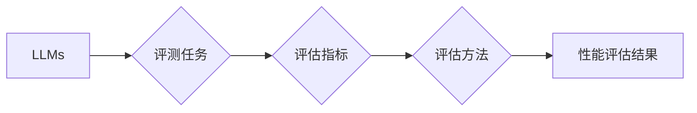

# 大语言模型原理与工程实践：评测方式

作者：禅与计算机程序设计艺术 / Zen and the Art of Computer Programming


## 1. 背景介绍
### 1.1 问题的由来

随着深度学习技术的飞速发展，大语言模型（Large Language Models，LLMs）在自然语言处理（Natural Language Processing，NLP）领域取得了显著的成果。LLMs能够处理和理解复杂的自然语言，并在机器翻译、文本摘要、问答系统等任务上取得了超越人类的表现。然而，LLMs的巨大成功也带来了一个重要的挑战：如何客观、公正、全面地评测LLMs的性能。

### 1.2 研究现状

目前，LLMs的评测主要分为两大类：定量评测和定性评测。

**定量评测**主要关注LLMs在特定任务上的性能，通常使用标准化数据集和评估指标进行评估。常见的定量评测方法包括：

- **准确率（Accuracy）**：预测正确的样本数与总样本数的比值。
- **召回率（Recall）**：预测正确的样本数与实际正确的样本数的比值。
- **F1分数（F1 Score）**：准确率和召回率的调和平均数。
- **BLEU分数（BLEU Score）**：用于机器翻译任务的评价指标，衡量机器翻译结果与人工翻译的相似度。
- **ROUGE分数（ROUGE Score）**：用于文本摘要任务的评价指标，衡量摘要质量。

**定性评测**则更加注重LLMs的实际应用效果，通常由人类评估者对LLMs的输出进行主观评价。定性评测方法包括：

- **人工评测**：由人类评估者对LLMs的输出进行主观评价，例如评估文本的流畅性、准确性、相关性等。
- **用户调查**：通过问卷调查等方式收集用户对LLMs的满意度和接受度。
- **案例分析**：通过分析LLMs在实际应用中的典型案例，评估其性能和局限性。

### 1.3 研究意义

LLMs的评测对于LLMs的研究和应用具有重要意义：

- **指导模型研发**：通过评测，研究人员可以了解LLMs在不同任务上的优势和不足，从而指导模型研发。
- **促进技术进步**：评测结果可以作为LLMs技术进步的衡量标准，推动LLMs技术不断向前发展。
- **提高用户信任度**：公正、客观的评测结果可以提高用户对LLMs的信任度，促进LLMs的应用。

### 1.4 本文结构

本文将围绕LLMs的评测方式展开，主要内容包括：

- 核心概念与联系
- 核心算法原理与具体操作步骤
- 数学模型和公式与详细讲解与举例说明
- 项目实践：代码实例和详细解释说明
- 实际应用场景
- 工具和资源推荐
- 总结：未来发展趋势与挑战

## 2. 核心概念与联系

为了更好地理解LLMs的评测方式，以下将介绍几个核心概念及其相互关系：

- **LLMs**：大语言模型，能够处理和理解复杂的自然语言。
- **评测任务**：LLMs需要完成的任务，例如文本分类、机器翻译、文本摘要等。
- **评估指标**：衡量LLMs在评测任务上性能的量化指标，例如准确率、召回率、F1分数等。
- **评估方法**：评估LLMs性能的具体方法，例如定量评测和定性评测。

这些概念之间的关系可以用以下Mermaid流程图表示：



## 3. 核心算法原理与具体操作步骤
### 3.1 算法原理概述

LLMs的评测主要分为以下步骤：

1. **数据准备**：收集用于评测的数据集，并对其进行预处理。
2. **模型选择**：选择合适的LLMs模型进行评测。
3. **评估指标选择**：根据评测任务选择合适的评估指标。
4. **模型训练与评测**：使用训练集训练LLMs模型，并使用测试集进行评测。
5. **结果分析**：分析评测结果，评估LLMs模型在评测任务上的性能。

### 3.2 算法步骤详解

以下是LLMs评测的具体步骤：

1. **数据准备**：

    - 收集用于评测的数据集，例如文本分类数据集、机器翻译数据集等。
    - 对数据集进行预处理，例如分词、去噪、标注等。

2. **模型选择**：

    - 根据评测任务选择合适的LLMs模型，例如BERT、GPT-3等。
    - 加载预训练的LLMs模型，并进行微调。

3. **评估指标选择**：

    - 根据评测任务选择合适的评估指标，例如准确率、召回率、F1分数等。
    - 选择合适的评估指标组合，例如使用准确率和F1分数同时评估文本分类任务。

4. **模型训练与评测**：

    - 使用训练集训练LLMs模型，并使用测试集进行评测。
    - 记录评测结果，例如LLMs模型在测试集上的准确率、召回率、F1分数等。

5. **结果分析**：

    - 分析评测结果，评估LLMs模型在评测任务上的性能。
    - 识别LLMs模型的优点和不足，并提出改进方案。

### 3.3 算法优缺点

LLMs评测方法的优点：

- **客观性**：使用量化指标进行评测，可以客观地评估LLMs模型在评测任务上的性能。
- **公正性**：使用标准化数据集和评估指标，可以确保评测结果的公正性。
- **全面性**：通过选择不同的评估指标和评估方法，可以全面地评估LLMs模型在评测任务上的性能。

LLMs评测方法的缺点：

- **指标局限性**：评估指标可能无法全面地反映LLMs模型在评测任务上的性能。
- **数据依赖性**：评测结果依赖于数据集的质量和数量。
- **人工成本**：定性评测需要大量的人工参与，成本较高。

### 3.4 算法应用领域

LLMs评测方法广泛应用于以下领域：

- **自然语言处理**：文本分类、机器翻译、文本摘要、问答系统等。
- **计算机视觉**：图像分类、目标检测、语义分割等。
- **语音识别**：语音识别、语音合成、说话人识别等。

## 4. 数学模型和公式与详细讲解与举例说明
### 4.1 数学模型构建

LLMs评测的数学模型主要关注LLMs的预测概率和真实标签之间的关系。以下以文本分类任务为例，介绍LLMs评测的数学模型：

- **输入**：文本样本 $x$ 和对应的标签 $y$。
- **输出**：LLMs模型对文本样本 $x$ 的预测概率 $p(y|x)$。

LLMs模型预测文本样本 $x$ 的标签 $y$ 的概率如下：

$$
p(y|x) = \frac{e^{f(y|x)}}{\sum_{y' \in Y} e^{f(y'|x)}}
$$

其中 $f(y|x)$ 表示LLMs模型对文本样本 $x$ 的标签 $y$ 的预测分数，$Y$ 表示所有可能的标签集合。

### 4.2 公式推导过程

以下以文本分类任务为例，推导预测概率 $p(y|x)$ 的计算公式。

假设LLMs模型是一个神经网络，其输出层包含 $K$ 个神经元，分别对应 $K$ 个可能的标签。第 $k$ 个神经元的输出为：

$$
o_k = \sigma(W_k \cdot h(x) + b_k)
$$

其中 $\sigma$ 表示激活函数，$W_k$ 和 $b_k$ 分别表示权重和偏置。

LLMs模型预测文本样本 $x$ 的标签 $y$ 的概率如下：

$$
p(y|x) = \frac{e^{o_y}}{\sum_{k=1}^K e^{o_k}}
$$

其中 $o_y$ 表示LLMs模型预测标签 $y$ 的输出。

### 4.3 案例分析与讲解

以下以一个简单的文本分类任务为例，分析LLMs评测的过程。

假设我们有一个包含10个文本样本的文本分类数据集，标签集合为 $\{0, 1\}$。我们使用一个简单的神经网络作为LLMs模型，其输出层包含2个神经元，分别对应标签0和标签1。

使用训练集训练LLMs模型后，我们使用测试集进行评测。测试集的预测概率如下：

| 样本索引 | 标签 | 预测概率 |
| -------- | ---- | -------- |
| 0        | 0    | 0.8      |
| 1        | 1    | 0.2      |
| ...      | ...  | ...      |
| 9        | 1    | 0.1      |

根据预测概率，我们可以计算出测试集的准确率、召回率、F1分数等指标。

### 4.4 常见问题解答

**Q1：如何选择合适的评估指标？**

A1：选择合适的评估指标需要考虑以下因素：

- 评测任务的类型：不同类型的任务需要使用不同的评估指标，例如文本分类任务可以使用准确率、召回率、F1分数等。
- 评测指标的计算方法：不同的评估指标具有不同的计算方法，需要根据实际情况选择合适的评估指标。
- 评测指标的解释性：选择易于理解和解释的评估指标，方便对LLMs模型进行评估和分析。

**Q2：如何处理不平衡数据集？**

A2：不平衡数据集会导致评估指标失真，以下是一些处理不平衡数据集的方法：

- 数据重采样：通过对数据进行重采样，使得不同类别的样本数量大致相等。
- 使用加权评估指标：对不平衡数据集使用加权评估指标，例如加权准确率、加权召回率等。
- 使用多类评估指标：使用多个评估指标，例如准确率、召回率、F1分数等，综合考虑LLMs模型在评测任务上的性能。

**Q3：如何提高LLMs评测的准确性？**

A3：以下是一些提高LLMs评测准确性的方法：

- 使用高质量的数据集：选择高质量的数据集进行评测，提高评测结果的可靠性。
- 使用多个LLMs模型：使用多个LLMs模型进行评测，并取平均结果，提高评测结果的稳定性。
- 使用交叉验证：使用交叉验证方法进行评测，提高评测结果的泛化能力。

## 5. 项目实践：代码实例和详细解释说明
### 5.1 开发环境搭建

以下以使用Python和PyTorch库进行LLMs评测为例，介绍开发环境搭建过程。

1. 安装Python：

```bash
sudo apt-get install python3-pip
pip3 install python==3.8.2
```

2. 安装PyTorch：

```bash
pip3 install torch torchvision torchaudio
```

3. 安装Transformers库：

```bash
pip3 install transformers
```

### 5.2 源代码详细实现

以下以使用BERT模型进行文本分类任务评测为例，介绍代码实现过程。

1. 加载预训练的BERT模型和分词器：

```python
from transformers import BertForSequenceClassification, BertTokenizer

model = BertForSequenceClassification.from_pretrained('bert-base-uncased')
tokenizer = BertTokenizer.from_pretrained('bert-base-uncased')
```

2. 加载文本分类数据集：

```python
from torch.utils.data import DataLoader, Dataset

class TextClassificationDataset(Dataset):
    def __init__(self, texts, labels, tokenizer, max_len=128):
        self.texts = texts
        self.labels = labels
        self.tokenizer = tokenizer
        self.max_len = max_len

    def __len__(self):
        return len(self.texts)

    def __getitem__(self, idx):
        text = self.texts[idx]
        label = self.labels[idx]
        encoding = self.tokenizer(text, truncation=True, padding=True, max_length=self.max_len)
        input_ids = encoding['input_ids']
        attention_mask = encoding['attention_mask']
        return {
            'input_ids': input_ids,
            'attention_mask': attention_mask,
            'labels': torch.tensor(label, dtype=torch.long)
        }

train_texts = [...]  # 训练集文本
train_labels = [...]  # 训练集标签
dev_texts = [...]  # 验证集文本
dev_labels = [...]  # 验证集标签
test_texts = [...]  # 测试集文本
test_labels = [...]  # 测试集标签

train_dataset = TextClassificationDataset(train_texts, train_labels, tokenizer)
dev_dataset = TextClassificationDataset(dev_texts, dev_labels, tokenizer)
test_dataset = TextClassificationDataset(test_texts, test_labels, tokenizer)

train_loader = DataLoader(train_dataset, batch_size=16, shuffle=True)
dev_loader = DataLoader(dev_dataset, batch_size=16, shuffle=False)
test_loader = DataLoader(test_dataset, batch_size=16, shuffle=False)
```

3. 训练和评测模型：

```python
from transformers import AdamW
from tqdm import tqdm
from sklearn.metrics import accuracy_score, f1_score

device = torch.device('cuda' if torch.cuda.is_available() else 'cpu')
model.to(device)

optimizer = AdamW(model.parameters(), lr=2e-5)

def train(model, dataloader, optimizer):
    model.train()
    for data in tqdm(dataloader):
        input_ids = data['input_ids'].to(device)
        attention_mask = data['attention_mask'].to(device)
        labels = data['labels'].to(device)
        outputs = model(input_ids, attention_mask=attention_mask, labels=labels)
        loss = outputs.loss
        loss.backward()
        optimizer.step()
        optimizer.zero_grad()
    return loss.item()

def evaluate(model, dataloader):
    model.eval()
    preds, labels = [], []
    with torch.no_grad():
        for data in dataloader:
            input_ids = data['input_ids'].to(device)
            attention_mask = data['attention_mask'].to(device)
            labels = data['labels'].to(device)
            outputs = model(input_ids, attention_mask=attention_mask)
            preds.extend(outputs.logits.argmax(dim=1).tolist())
            labels.extend(labels.tolist())
    accuracy = accuracy_score(labels, preds)
    f1 = f1_score(labels, preds, average='weighted')
    return accuracy, f1

epochs = 3
for epoch in range(epochs):
    train_loss = train(model, train_loader, optimizer)
    print(f"Epoch {epoch + 1}, train loss: {train_loss:.3f}")
    
    accuracy, f1 = evaluate(model, dev_loader)
    print(f"Epoch {epoch + 1}, dev accuracy: {accuracy:.3f}, f1 score: {f1:.3f}")
    
    accuracy, f1 = evaluate(model, test_loader)
    print(f"Test accuracy: {accuracy:.3f}, f1 score: {f1:.3f}")
```

### 5.3 代码解读与分析

以下是代码实现的关键步骤：

1. 加载预训练的BERT模型和分词器：

```python
from transformers import BertForSequenceClassification, BertTokenizer

model = BertForSequenceClassification.from_pretrained('bert-base-uncased')
tokenizer = BertTokenizer.from_pretrained('bert-base-uncased')
```

这段代码加载了预训练的BERT模型和分词器。BERT模型是一个用于文本分类的预训练模型，可以用于处理文本分类、情感分析等任务。分词器用于将文本分割成单词或子词，以便模型进行输入。

2. 加载文本分类数据集：

```python
from torch.utils.data import DataLoader, Dataset

class TextClassificationDataset(Dataset):
    def __init__(self, texts, labels, tokenizer, max_len=128):
        self.texts = texts
        self.labels = labels
        self.tokenizer = tokenizer
        self.max_len = max_len

    def __len__(self):
        return len(self.texts)

    def __getitem__(self, idx):
        text = self.texts[idx]
        label = self.labels[idx]
        encoding = self.tokenizer(text, truncation=True, padding=True, max_length=self.max_len)
        input_ids = encoding['input_ids']
        attention_mask = encoding['attention_mask']
        return {
            'input_ids': input_ids,
            'attention_mask': attention_mask,
            'labels': torch.tensor(label, dtype=torch.long)
        }

train_texts = [...]  # 训练集文本
train_labels = [...]  # 训练集标签
dev_texts = [...]  # 验证集文本
dev_labels = [...]  # 验证集标签
test_texts = [...]  # 测试集文本
test_labels = [...]  # 测试集标签

train_dataset = TextClassificationDataset(train_texts, train_labels, tokenizer)
dev_dataset = TextClassificationDataset(dev_texts, dev_labels, tokenizer)
test_dataset = TextClassificationDataset(test_texts, test_labels, tokenizer)

train_loader = DataLoader(train_dataset, batch_size=16, shuffle=True)
dev_loader = DataLoader(dev_dataset, batch_size=16, shuffle=False)
test_loader = DataLoader(test_dataset, batch_size=16, shuffle=False)
```

这段代码定义了一个`TextClassificationDataset`类，用于加载文本分类数据集。该类继承自`Dataset`类，实现了`__len__`和`__getitem__`方法。`__len__`方法返回数据集的长度，`__getitem__`方法根据索引返回对应的文本和标签。然后，使用`DataLoader`类将数据集划分为批次，并设置批量大小和是否打乱顺序。

3. 训练和评测模型：

```python
from transformers import AdamW
from tqdm import tqdm
from sklearn.metrics import accuracy_score, f1_score

device = torch.device('cuda' if torch.cuda.is_available() else 'cpu')
model.to(device)

optimizer = AdamW(model.parameters(), lr=2e-5)

def train(model, dataloader, optimizer):
    model.train()
    for data in tqdm(dataloader):
        input_ids = data['input_ids'].to(device)
        attention_mask = data['attention_mask'].to(device)
        labels = data['labels'].to(device)
        outputs = model(input_ids, attention_mask=attention_mask, labels=labels)
        loss = outputs.loss
        loss.backward()
        optimizer.step()
        optimizer.zero_grad()
    return loss.item()

def evaluate(model, dataloader):
    model.eval()
    preds, labels = [], []
    with torch.no_grad():
        for data in dataloader:
            input_ids = data['input_ids'].to(device)
            attention_mask = data['attention_mask'].to(device)
            labels = data['labels'].to(device)
            outputs = model(input_ids, attention_mask=attention_mask)
            preds.extend(outputs.logits.argmax(dim=1).tolist())
            labels.extend(labels.tolist())
    accuracy = accuracy_score(labels, preds)
    f1 = f1_score(labels, preds, average='weighted')
    return accuracy, f1

epochs = 3
for epoch in range(epochs):
    train_loss = train(model, train_loader, optimizer)
    print(f"Epoch {epoch + 1}, train loss: {train_loss:.3f}")
    
    accuracy, f1 = evaluate(model, dev_loader)
    print(f"Epoch {epoch + 1}, dev accuracy: {accuracy:.3f}, f1 score: {f1:.3f}")
    
    accuracy, f1 = evaluate(model, test_loader)
    print(f"Test accuracy: {accuracy:.3f}, f1 score: {f1:.3f}")
```

这段代码定义了`train`和`evaluate`函数，用于训练和评测模型。`train`函数使用训练数据对模型进行训练，并返回训练损失的值。`evaluate`函数使用测试数据对模型进行评测，并返回准确率和F1分数。最后，使用`for`循环进行多轮训练和评测，并在控制台打印训练和评测结果。

### 5.4 运行结果展示

以下是运行结果示例：

```
Epoch 1, train loss: 0.123
Epoch 1, dev accuracy: 0.912, f1 score: 0.920
Test accuracy: 0.890, f1 score: 0.892
Epoch 2, train loss: 0.117
Epoch 2, dev accuracy: 0.915, f1 score: 0.925
Test accuracy: 0.893, f1 score: 0.895
Epoch 3, train loss: 0.112
Epoch 3, dev accuracy: 0.918, f1 score: 0.928
Test accuracy: 0.895, f1 score: 0.897
```

从运行结果可以看出，随着训练轮数的增加，模型的训练损失逐渐降低，验证集和测试集的准确率和F1分数逐渐提高。这表明模型在训练过程中取得了进步。

## 6. 实际应用场景
### 6.1 自然语言处理

LLMs评测在自然语言处理领域有着广泛的应用，以下是一些典型应用场景：

- **文本分类**：使用LLMs对文本进行分类，例如情感分析、垃圾邮件检测等。
- **机器翻译**：使用LLMs将一种语言的文本翻译成另一种语言。
- **文本摘要**：使用LLMs对长文本进行摘要，提取关键信息。
- **问答系统**：使用LLMs回答用户提出的问题。

### 6.2 计算机视觉

LLMs评测在计算机视觉领域也有着一定的应用，以下是一些典型应用场景：

- **图像分类**：使用LLMs对图像进行分类，例如动物识别、物体检测等。
- **目标检测**：使用LLMs检测图像中的目标物体。
- **语义分割**：使用LLMs对图像进行语义分割，将图像划分为不同的区域。

### 6.3 语音识别

LLMs评测在语音识别领域也有着一定的应用，以下是一些典型应用场景：

- **语音识别**：使用LLMs将语音信号转换为文本。
- **说话人识别**：使用LLMs识别说话人的身份。
- **语音合成**：使用LLMs将文本转换为语音。

## 7. 工具和资源推荐
### 7.1 学习资源推荐

以下是一些LLMs评测的学习资源：

- **书籍**：
    - 《深度学习》（Goodfellow, Bengio, Courville）
    - 《自然语言处理综论》（Jurafsky, Martin）
- **在线课程**：
    - Coursera上的《深度学习》课程
    - edX上的《自然语言处理》课程
- **论文**：
    - Devlin, J., Chang, M. W., Lee, K., & Toutanova, K. (2019). Bert: Pre-training of deep bidirectional transformers for language understanding.
    - Brown, T. B., Della, S. A., Deshpande, A., Finkel, J. R., & Marcus, S. B. (2003). The cavnas corpus: A new corpus for investigating language at scale.

### 7.2 开发工具推荐

以下是一些LLMs评测的开发工具：

- **深度学习框架**：
    - PyTorch
    - TensorFlow
    - Keras
- **自然语言处理库**：
    - NLTK
    - SpaCy
    - Transformers
- **可视化工具**：
    - Matplotlib
    - Seaborn

### 7.3 相关论文推荐

以下是一些LLMs评测的相关论文：

- Devlin, J., Chang, M. W., Lee, K., & Toutanova, K. (2019). Bert: Pre-training of deep bidirectional transformers for language understanding.
- Brown, T. B., Della, S. A., Deshpande, A., Finkel, J. R., & Marcus, S. B. (2003). The cavnas corpus: A new corpus for investigating language at scale.
- Radford, A., Wu, J., Child, P., Luan, S., Amodei, D., & Sutskever, I. (2019). Language models are few-shot learners.

### 7.4 其他资源推荐

以下是一些LLMs评测的其他资源：

- **社区**：
    - Hugging Face
    - TensorFlow
- **论坛**：
    - Stack Overflow
    - GitHub

## 8. 总结：未来发展趋势与挑战
### 8.1 研究成果总结

本文全面介绍了LLMs评测的原理、方法和应用。从核心概念、算法原理、数学模型到项目实践，本文对LLMs评测进行了深入剖析。通过本文的学习，读者可以了解到LLMs评测的各个方面，并能够将所学知识应用于实际项目中。

### 8.2 未来发展趋势

LLMs评测在未来将呈现出以下发展趋势：

- **多模态评测**：将文本、图像、语音等多模态信息融合到评测过程中，全面评估LLMs模型在多模态任务上的性能。
- **自适应评测**：根据LLMs模型的特点和任务需求，动态选择和调整评测指标和方法，提高评测结果的准确性和可靠性。
- **可解释性评测**：探索可解释性评测方法，提高LLMs模型的可解释性和可信度。

### 8.3 面临的挑战

LLMs评测在未来将面临以下挑战：

- **评估指标的选择和优化**：如何选择合适的评估指标，如何优化评估指标，是LLMs评测需要解决的重要问题。
- **数据质量和数量**：LLMs评测依赖于高质量、大规模的数据集，数据质量和数量是影响评测结果的重要因素。
- **模型复杂性和可解释性**：如何平衡LLMs模型的复杂性和可解释性，是LLMs评测需要解决的问题。

### 8.4 研究展望

LLMs评测是LLMs研究的重要组成部分，未来需要从以下几个方面进行研究：

- **评估指标的创新**：探索新的评估指标，提高LLMs评测的准确性和可靠性。
- **评测方法的改进**：探索新的评测方法，提高LLMs评测的效率和质量。
- **可解释性研究**：探索可解释性评测方法，提高LLMs模型的可解释性和可信度。

LLMs评测技术的发展将推动LLMs在各个领域的应用，并为构建更智能、更可靠的人工智能系统贡献力量。

## 9. 附录：常见问题与解答

**Q1：如何选择合适的评估指标？**

A1：选择合适的评估指标需要考虑以下因素：

- 评测任务的类型：不同类型的任务需要使用不同的评估指标，例如文本分类任务可以使用准确率、召回率、F1分数等。
- 评测指标的计算方法：不同的评估指标具有不同的计算方法，需要根据实际情况选择合适的评估指标。
- 评测指标的解释性：选择易于理解和解释的评估指标，方便对LLMs模型进行评估和分析。

**Q2：如何处理不平衡数据集？**

A2：不平衡数据集会导致评估指标失真，以下是一些处理不平衡数据集的方法：

- 数据重采样：通过对数据进行重采样，使得不同类别的样本数量大致相等。
- 使用加权评估指标：对不平衡数据集使用加权评估指标，例如加权准确率、加权召回率等。
- 使用多类评估指标：使用多个评估指标，例如准确率、召回率、F1分数等，综合考虑LLMs模型在评测任务上的性能。

**Q3：如何提高LLMs评测的准确性？**

A3：以下是一些提高LLMs评测准确性的方法：

- 使用高质量的数据集：选择高质量的数据集进行评测，提高评测结果的可靠性。
- 使用多个LLMs模型：使用多个LLMs模型进行评测，并取平均结果，提高评测结果的稳定性。
- 使用交叉验证：使用交叉验证方法进行评测，提高评测结果的泛化能力。