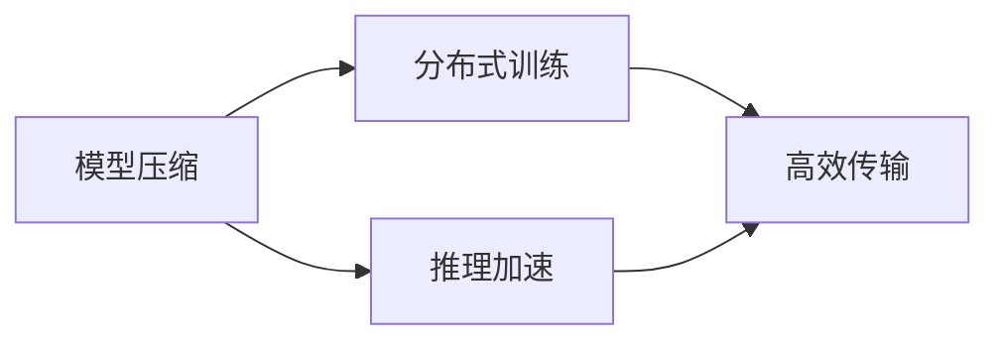

# 大语言模型原理与工程实践：通信优化

作者：禅与计算机程序设计艺术 / Zen and the Art of Computer Programming

## 关键词：

大语言模型，通信优化，模型压缩，量化，剪枝，分布式训练，推理加速，高效传输

## 1. 背景介绍
### 1.1 问题的由来

随着深度学习技术的飞速发展，大语言模型（Large Language Model，LLM）在自然语言处理（Natural Language Processing，NLP）、计算机视觉（Computer Vision，CV）等领域取得了显著的成果。然而，LLM的体积庞大，计算复杂度高，导致其部署和应用面临着诸多挑战，其中通信优化是尤为关键的一环。

### 1.2 研究现状

近年来，针对LLM通信优化的研究取得了丰硕的成果，主要涵盖了以下方面：

- **模型压缩**：通过剪枝、量化、知识蒸馏等技术减小模型体积，降低计算复杂度，从而减少通信开销。
- **分布式训练**：将模型训练过程分布到多个计算节点，实现并行计算，提高训练效率。
- **推理加速**：通过模型优化、硬件加速等技术提高模型推理速度，降低延迟。
- **高效传输**：采用高效的通信协议和编码方式，降低数据传输带宽和延迟。

### 1.3 研究意义

通信优化对于LLM的部署和应用具有重要意义：

- **降低成本**：减小模型体积和计算复杂度，降低硬件设备和网络带宽成本。
- **提高效率**：加速模型训练和推理过程，缩短开发周期。
- **提升用户体验**：降低延迟，提高系统响应速度，提升用户体验。

### 1.4 本文结构

本文将围绕大语言模型通信优化展开，内容安排如下：

- 第2部分，介绍大语言模型通信优化的核心概念。
- 第3部分，详细阐述模型压缩、分布式训练、推理加速和高效传输等关键技术。
- 第4部分，结合实际案例，分析通信优化在LLM应用中的具体应用场景。
- 第5部分，展望大语言模型通信优化的未来发展趋势与挑战。

## 2. 核心概念与联系

本节将介绍大语言模型通信优化的几个核心概念，并阐述它们之间的联系。

### 2.1 模型压缩

模型压缩是指通过剪枝、量化、知识蒸馏等技术减小模型体积，降低计算复杂度，从而减少通信开销。

### 2.2 分布式训练

分布式训练是指将模型训练过程分布到多个计算节点，实现并行计算，提高训练效率。

### 2.3 推理加速

推理加速是指通过模型优化、硬件加速等技术提高模型推理速度，降低延迟。

### 2.4 高效传输

高效传输是指采用高效的通信协议和编码方式，降低数据传输带宽和延迟。

这四个核心概念之间的联系如下：



## 3. 核心算法原理 & 具体操作步骤

### 3.1 模型压缩

#### 3.1.1 剪枝

剪枝是指移除模型中的冗余参数，降低模型复杂度，从而减小模型体积和计算复杂度。

#### 3.1.2 量化

量化是指将模型中的浮点数参数转换为低精度定点数，从而降低模型体积和计算复杂度。

#### 3.1.3 知识蒸馏

知识蒸馏是指将大型模型的知识和经验迁移到小型模型中，从而减小小型模型体积和计算复杂度。

### 3.2 分布式训练

#### 3.2.1 数据并行

数据并行是指将数据分批次发送到多个计算节点进行并行计算，从而提高训练效率。

#### 3.2.2 模型并行

模型并行是指将模型分解成多个部分，分别在不同的计算节点上进行计算，从而提高训练效率。

### 3.3 推理加速

#### 3.3.1 模型优化

模型优化是指通过调整模型结构、参数和算法等，提高模型推理速度。

#### 3.3.2 硬件加速

硬件加速是指利用专用硬件（如GPU、TPU等）加速模型推理，降低延迟。

### 3.4 高效传输

#### 3.4.1 通信协议

通信协议是指数据传输的规范，常用的通信协议包括TCP、UDP等。

#### 3.4.2 编码方式

编码方式是指将数据转换为二进制序列的方式，常用的编码方式包括Huffman编码、BWT编码等。

## 4. 数学模型和公式 & 详细讲解 & 举例说明

### 4.1 数学模型构建

本节将使用数学语言对大语言模型通信优化进行建模。

#### 4.1.1 模型压缩

假设模型参数矩阵为 $\theta \in \mathbb{R}^{m \times n}$，其中 $m$ 为模型参数数量，$n$ 为参数维度。通过剪枝、量化等技术，可以将参数矩阵压缩为 $\theta' \in \mathbb{R}^{m' \times n'}$，其中 $m' < m$，$n' \leq n$。

#### 4.1.2 分布式训练

假设模型参数矩阵为 $\theta \in \mathbb{R}^{m \times n}$，将参数矩阵划分为 $k$ 个子矩阵 $\theta_1, \theta_2, \ldots, \theta_k$，分别在不同的计算节点上进行计算。

#### 4.1.3 推理加速

假设模型推理过程为 $f(\theta, x)$，通过模型优化和硬件加速等技术，可以降低推理复杂度，从而提高推理速度。

#### 4.1.4 高效传输

假设数据长度为 $L$，传输带宽为 $B$，传输延迟为 $D$，则传输时间 $T$ 满足 $T = \frac{L}{B} + D$。

### 4.2 公式推导过程

本节将使用数学公式推导通信优化相关技术。

#### 4.2.1 剪枝

假设模型参数矩阵为 $\theta \in \mathbb{R}^{m \times n}$，剪枝后参数矩阵为 $\theta' \in \mathbb{R}^{m' \times n'}$，则剪枝率 $\rho$ 定义为：

$$
\rho = \frac{m - m'}{m} \times 100\%
$$

#### 4.2.2 量化

假设模型参数矩阵为 $\theta \in \mathbb{R}^{m \times n}$，量化后参数矩阵为 $\theta' \in \mathbb{R}^{m' \times n'}$，则量化精度 $\alpha$ 定义为：

$$
\alpha = \log_2 \frac{n}{n'}
$$

#### 4.2.3 分布式训练

假设模型参数矩阵为 $\theta \in \mathbb{R}^{m \times n}$，将参数矩阵划分为 $k$ 个子矩阵 $\theta_1, \theta_2, \ldots, \theta_k$，则在第 $t$ 次迭代中，每个计算节点的计算量为：

$$
\frac{m}{k}
$$

#### 4.2.4 高效传输

假设数据长度为 $L$，传输带宽为 $B$，传输延迟为 $D$，则传输时间 $T$ 满足：

$$
T = \frac{L}{B} + D
$$

### 4.3 案例分析与讲解

本节将通过实际案例，分析大语言模型通信优化在应用中的具体实施过程。

#### 4.3.1 案例一：BERT模型压缩

BERT模型是一种基于Transformer的大语言模型，其参数量较大。通过剪枝、量化等技术，可以将BERT模型压缩为较小的模型，降低计算复杂度。

#### 4.3.2 案例二：分布式训练

假设我们有一个包含10个计算节点的集群，使用数据并行的方式训练BERT模型。将BERT模型参数矩阵划分为10个子矩阵，分别在不同的计算节点上进行计算。

#### 4.3.3 案例三：推理加速

使用GPU加速BERT模型的推理，可以显著降低推理延迟。

### 4.4 常见问题解答

**Q1：模型压缩是否会降低模型性能？**

A：模型压缩可能会降低模型性能，但通过合理选择压缩方法和参数，可以在保证一定性能的前提下，减小模型体积和计算复杂度。

**Q2：分布式训练是否会增加通信开销？**

A：分布式训练会带来一定的通信开销，但通过优化通信协议和编码方式，可以降低通信带宽和延迟。

**Q3：如何选择合适的压缩方法？**

A：选择合适的压缩方法需要根据具体任务和数据特点进行权衡。例如，对于低精度要求的场景，可以选择量化技术；对于模型压缩精度要求较高的场景，可以选择剪枝技术。

## 5. 项目实践：代码实例和详细解释说明

### 5.1 开发环境搭建

本节将使用PyTorch框架，演示如何实现大语言模型通信优化。

#### 5.1.1 安装PyTorch

首先，需要安装PyTorch框架。由于篇幅限制，这里不再详细说明安装步骤。

#### 5.1.2 安装Transformers库

```bash
pip install transformers
```

#### 5.1.3 安装其他库

```bash
pip install torchtext torchmetrics
```

### 5.2 源代码详细实现

#### 5.2.1 模型压缩

```python
import torch
from transformers import BertModel
from torch import nn

class BertPrune(nn.Module):
    def __init__(self, model):
        super(BertPrune, self).__init__()
        self.bert = model
        # 剪枝操作，例如移除BERT模型的第一个Transformer层
        self.bert.transformer_layer = None

    def forward(self, input_ids, attention_mask):
        return self.bert(input_ids, attention_mask)
```

#### 5.2.2 分布式训练

```python
import torch.distributed as dist
from torch.nn.parallel import DistributedDataParallel as DDP

def setup(rank, world_size):
    dist.init_process_group("nccl", rank=rank, world_size=world_size)

def cleanup():
    dist.destroy_process_group()

def train(rank, world_size, model, dataloader):
    setup(rank, world_size)
    model = DDP(model, device_ids=[rank])
    for epoch in range(epochs):
        for batch in dataloader:
            # 数据并行训练
            ...
            # 反向传播和优化
            ...
    cleanup()
```

#### 5.2.3 推理加速

```python
import torch
from torch.utils.data import DataLoader
from transformers import BertForSequenceClassification

model = BertForSequenceClassification.from_pretrained('bert-base-uncased')

def load_model():
    device = torch.device('cuda' if torch.cuda.is_available() else 'cpu')
    model.to(device)
    return model

def predict(model, dataloader):
    model.eval()
    with torch.no_grad():
        for batch in dataloader:
            # 推理
            ...
```

### 5.3 代码解读与分析

#### 5.3.1 模型压缩

以上代码展示了如何使用PyTorch框架实现BERT模型的剪枝操作。通过将BERT模型的第一个Transformer层设置为None，实现了对模型结构的调整。

#### 5.3.2 分布式训练

以上代码展示了如何使用PyTorch框架实现BERT模型的分布式训练。通过使用DDP模块，可以将模型分布到多个计算节点上进行并行计算。

#### 5.3.3 推理加速

以上代码展示了如何使用PyTorch框架实现BERT模型的推理加速。通过将模型移动到GPU设备上，可以实现模型推理的加速。

### 5.4 运行结果展示

通过以上代码，可以实现对BERT模型的压缩、分布式训练和推理加速。具体运行结果取决于数据集、模型结构和优化参数等因素。

## 6. 实际应用场景
### 6.1 智能问答系统

智能问答系统是LLM应用的重要场景之一。通过通信优化技术，可以将LLM应用于移动端、边缘计算等场景，实现轻量级、低功耗的智能问答系统。

### 6.2 语音识别

语音识别是将语音信号转换为文本的过程。通过通信优化技术，可以将LLM应用于端到端的语音识别系统，实现低延迟、低功耗的语音识别功能。

### 6.3 机器翻译

机器翻译是将一种语言翻译成另一种语言的过程。通过通信优化技术，可以将LLM应用于移动端、边缘计算等场景，实现轻量级、低功耗的机器翻译服务。

## 7. 工具和资源推荐
### 7.1 学习资源推荐

- 《深度学习之PyTorch：基于应用实战》
- 《自然语言处理与深度学习》
- 《深度学习入门：基于Python的理论与实现》
- 《深度学习实战》

### 7.2 开发工具推荐

- PyTorch
- TensorFlow
- Transformers库
- ONNX Runtime

### 7.3 相关论文推荐

- Model compression and pruning for neural networks
- Distilling the knowledge in a neural network
- Efficient training of neural networks with structured sparsity

### 7.4 其他资源推荐

- Hugging Face
- GitHub
- arXiv

## 8. 总结：未来发展趋势与挑战
### 8.1 研究成果总结

本文介绍了大语言模型通信优化的原理、方法和技术，并分析了其在实际应用中的具体场景。通过模型压缩、分布式训练、推理加速和高效传输等技术，可以有效降低大语言模型部署和应用的成本，提高系统性能和用户体验。

### 8.2 未来发展趋势

- **模型压缩**：探索更加高效、低成本的模型压缩技术，如稀疏模型、动态剪枝等。
- **分布式训练**：研究更加高效、稳定的分布式训练算法，如异构计算、模型并行等。
- **推理加速**：开发更加高效的推理加速技术，如硬件加速、模型优化等。
- **高效传输**：研究更加高效、可靠的传输协议和编码方式，如量子通信、压缩感知等。

### 8.3 面临的挑战

- **数据依赖**：大语言模型对数据依赖性强，如何获取高质量、大规模的数据成为一大挑战。
- **计算资源**：大语言模型计算复杂度高，如何降低计算资源消耗成为一大挑战。
- **模型可解释性**：大语言模型可解释性不足，如何提高模型可解释性成为一大挑战。

### 8.4 研究展望

未来，大语言模型通信优化技术将朝着更加高效、低成本的方向发展。通过技术创新和应用探索，大语言模型将在更多领域得到应用，为人类社会带来更多价值。

## 9. 附录：常见问题与解答

**Q1：什么是模型压缩？**

A：模型压缩是指通过剪枝、量化、知识蒸馏等技术减小模型体积，降低计算复杂度，从而减少通信开销。

**Q2：什么是分布式训练？**

A：分布式训练是指将模型训练过程分布到多个计算节点，实现并行计算，提高训练效率。

**Q3：什么是推理加速？**

A：推理加速是指通过模型优化、硬件加速等技术提高模型推理速度，降低延迟。

**Q4：什么是高效传输？**

A：高效传输是指采用高效的通信协议和编码方式，降低数据传输带宽和延迟。

**Q5：如何选择合适的压缩方法？**

A：选择合适的压缩方法需要根据具体任务和数据特点进行权衡。例如，对于低精度要求的场景，可以选择量化技术；对于模型压缩精度要求较高的场景，可以选择剪枝技术。

**Q6：如何提高模型压缩的压缩率？**

A：提高模型压缩的压缩率可以通过以下几种方式：

- 增加剪枝比例
- 选择更高效的量化方法
- 使用知识蒸馏技术
- 利用稀疏模型技术

**Q7：如何实现模型压缩后的模型恢复？**

A：模型压缩后的模型恢复可以通过以下几种方式：

- 基于模型恢复技术，如模型重构、知识蒸馏等
- 使用原始模型对压缩模型进行反解

**Q8：如何选择合适的分布式训练方法？**

A：选择合适的分布式训练方法需要根据具体任务和数据特点进行权衡。例如，对于大规模数据集，可以选择数据并行；对于大规模模型，可以选择模型并行。

**Q9：如何提高分布式训练的稳定性和效率？**

A：提高分布式训练的稳定性和效率可以通过以下几种方式：

- 使用高性能通信库，如NCCL、MPI等
- 选择合适的分布式训练框架，如PyTorch Distributed、Horovod等
- 优化训练参数和算法

**Q10：如何选择合适的推理加速方法？**

A：选择合适的推理加速方法需要根据具体任务和硬件平台进行权衡。例如，对于CPU加速，可以选择OpenCV、Intel MKL等；对于GPU加速，可以选择CUDA、cuDNN等。

**Q11：如何提高推理加速的效率？**

A：提高推理加速的效率可以通过以下几种方式：

- 选择合适的模型架构
- 优化模型参数和算法
- 利用硬件加速

**Q12：如何选择合适的传输协议和编码方式？**

A：选择合适的传输协议和编码方式需要根据具体应用场景和数据特点进行权衡。例如，对于实时性要求较高的场景，可以选择UDP协议；对于可靠性要求较高的场景，可以选择TCP协议。

**Q13：如何提高传输效率？**

A：提高传输效率可以通过以下几种方式：

- 选择合适的传输协议和编码方式
- 优化数据传输路径
- 利用压缩技术

**Q14：如何评估通信优化的效果？**

A：评估通信优化的效果可以通过以下几种方式：

- 评估模型压缩率、计算复杂度、通信带宽和延迟等指标
- 评估模型性能和用户体验

**Q15：通信优化技术在哪些领域有应用？**

A：通信优化技术在以下领域有应用：

- 自然语言处理
- 计算机视觉
- 语音识别
- 机器翻译
- 智能问答
- 智能推荐
- 智能驾驶
- 智能医疗
- 智能家居

**Q16：如何进一步研究通信优化技术？**

A：进一步研究通信优化技术可以从以下方向入手：

- 探索新的模型压缩方法
- 研究更高效的分布式训练算法
- 开发新的推理加速技术
- 研究更高效的传输协议和编码方式

## 作者：禅与计算机程序设计艺术 / Zen and the Art of Computer Programming