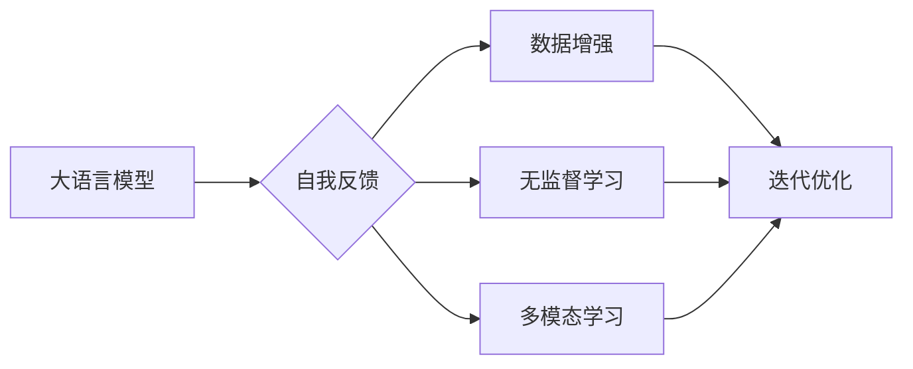

# 大语言模型原理基础与前沿 基于自我反馈进行迭代优化

作者：禅与计算机程序设计艺术 / Zen and the Art of Computer Programming 

## 1. 背景介绍
### 1.1 问题的由来

随着深度学习技术的飞速发展，大语言模型（LLM）在自然语言处理（NLP）领域取得了令人瞩目的成果。LLM通过在海量文本数据上进行预训练，学习到了丰富的语言知识，并在诸如机器翻译、文本摘要、问答系统等任务中展现出强大的能力。然而，LLM的微调和优化一直是研究者们关注的焦点，如何进一步提高LLM的性能，使其更适应特定任务的需求，成为了一个重要的研究课题。

### 1.2 研究现状

近年来，基于监督学习的大语言模型微调方法取得了显著进展，但仍有以下问题需要解决：

- 预训练模型在特定任务上的迁移能力有限。
- 需要大量标注数据才能进行有效的微调。
- 微调过程中容易出现过拟合现象。

为了解决这些问题，研究者们提出了基于自我反馈的迭代优化方法，通过模型自身生成的数据来指导迭代优化过程，从而提高LLM的适应性和鲁棒性。

### 1.3 研究意义

基于自我反馈的迭代优化方法在LLM领域具有重要意义：

- 提高LLM在特定任务上的迁移能力。
- 降低对标注数据的依赖，适用于少样本或无样本学习场景。
- 提高模型鲁棒性，降低过拟合现象。

### 1.4 本文结构

本文将围绕基于自我反馈的迭代优化方法展开，分为以下几个部分：

- 第2部分：介绍核心概念与联系。
- 第3部分：阐述核心算法原理和具体操作步骤。
- 第4部分：讲解数学模型和公式，并举例说明。
- 第5部分：给出项目实践代码实例和详细解释说明。
- 第6部分：探讨实际应用场景和未来应用展望。
- 第7部分：推荐相关学习资源、开发工具和参考文献。
- 第8部分：总结研究成果、未来发展趋势和挑战。
- 第9部分：提供常见问题与解答。

## 2. 核心概念与联系

为了更好地理解基于自我反馈的迭代优化方法，本节将介绍几个核心概念及其相互关系。

### 2.1 大语言模型

大语言模型（LLM）是指通过在大量文本数据上进行预训练，学习到丰富的语言知识，并具备强大语言理解和生成能力的模型。常见的LLM有：

- GPT：基于自回归的模型，能够生成连续的文本序列。
- BERT：基于自编码的模型，能够捕捉词与词之间的关系。
- T5：基于Transformer的模型，支持多种NLP任务。

### 2.2 自我反馈

自我反馈是指模型利用自身的输出作为输入，进行迭代优化的一种方法。自我反馈可以应用于以下场景：

- 数据增强：利用模型生成的文本数据扩充训练集。
- 无监督学习：利用模型生成的样本进行无监督学习。
- 多模态学习：将模型生成的文本与其他模态数据进行融合。

### 2.3 迭代优化

迭代优化是指通过不断迭代优化模型参数，以提高模型性能的方法。常见的迭代优化方法包括：

- 梯度下降法：通过计算损失函数对参数的梯度，不断更新参数以减小损失。
- Adam优化器：结合动量项和自适应学习率，提高收敛速度和稳定度。

### 2.4 关系图

以下是核心概念之间的关系图：



## 3. 核心算法原理 & 具体操作步骤
### 3.1 算法原理概述

基于自我反馈的迭代优化方法的核心思想是利用模型生成的文本数据作为输入，通过迭代优化过程提高模型性能。具体步骤如下：

1. 在预训练模型的基础上，进行微调，使其适应特定任务的需求。
2. 利用微调后的模型生成文本数据。
3. 将生成的文本数据作为输入，继续优化模型参数。
4. 重复步骤2和步骤3，直到模型性能收敛或满足预设条件。

### 3.2 算法步骤详解

1. **微调**：在预训练模型的基础上，使用少量标注数据对模型进行微调，使其适应特定任务的需求。微调过程可以使用梯度下降法、Adam优化器等方法进行。

2. **生成**：利用微调后的模型生成文本数据。常见的文本生成方法有：

   - 随机采样：从模型生成的文本中随机选择样本。
   - 顶点采样：从模型输出的概率分布中选择概率最高的样本。

3. **迭代优化**：将生成的文本数据作为输入，继续优化模型参数。迭代优化过程可以使用以下方法：

   - 梯度下降法：通过计算损失函数对参数的梯度，不断更新参数以减小损失。
   - Adam优化器：结合动量项和自适应学习率，提高收敛速度和稳定度。

4. **收敛判定**：重复步骤2和步骤3，直到模型性能收敛或满足预设条件。常见的收敛判定条件有：

   - 损失函数下降到预设阈值。
   - 模型在验证集上的性能不再提升。

### 3.3 算法优缺点

基于自我反馈的迭代优化方法具有以下优点：

- 提高LLM在特定任务上的迁移能力。
- 降低对标注数据的依赖，适用于少样本或无样本学习场景。
- 提高模型鲁棒性，降低过拟合现象。

该方法的缺点在于：

- 迭代优化过程需要大量计算资源。
- 可能会导致模型泛化能力下降。

### 3.4 算法应用领域

基于自我反馈的迭代优化方法可以应用于以下领域：

- 文本生成：如诗歌、故事、新闻报道等。
- 文本摘要：如新闻摘要、报告摘要等。
- 问答系统：如机器翻译、对话系统等。
- 机器翻译：如机器翻译、多语言文本生成等。

## 4. 数学模型和公式 & 详细讲解 & 举例说明
### 4.1 数学模型构建

基于自我反馈的迭代优化方法的数学模型如下：

$$
\begin{aligned}
\theta^{(t+1)} &= \theta^{(t)} - \eta \nabla_{\theta^{(t)}} L(\theta^{(t)}, D^{(t)}) \\
L(\theta^{(t)}, D^{(t)}) &= -\sum_{i=1}^n \ell(M_{\theta^{(t)}}(x_i), y_i)
\end{aligned}
$$

其中：

- $\theta^{(t)}$ 和 $\theta^{(t+1)}$ 分别表示第 $t$ 次和第 $t+1$ 次迭代的模型参数。
- $\eta$ 表示学习率。
- $\nabla_{\theta^{(t)}} L(\theta^{(t)}, D^{(t)})$ 表示损失函数对参数 $\theta^{(t)}$ 的梯度。
- $L(\theta^{(t)}, D^{(t)})$ 表示损失函数，用于衡量模型预测结果与真实标签之间的差异。
- $D^{(t)}$ 表示第 $t$ 次迭代的数据集。

### 4.2 公式推导过程

以文本生成任务为例，损失函数 $L(\theta^{(t)}, D^{(t)})$ 可以使用交叉熵损失函数进行定义：

$$
\ell(M_{\theta^{(t)}}(x_i), y_i) = -[y_i\log \hat{y}_i + (1-y_i)\log (1-\hat{y}_i)]
$$

其中：

- $\hat{y}_i = M_{\theta^{(t)}}(x_i)$ 表示模型对样本 $x_i$ 的预测结果。
- $y_i$ 表示样本 $x_i$ 的真实标签。

### 4.3 案例分析与讲解

以下以文本生成任务为例，演示基于自我反馈的迭代优化方法。

1. **数据准备**：收集大量文本数据作为训练集和验证集。

2. **预训练模型**：选择合适的预训练模型，如GPT-2，对文本数据进行预训练。

3. **微调**：使用标注数据对预训练模型进行微调，使其适应特定文本生成任务。

4. **生成**：利用微调后的模型生成文本数据。

5. **迭代优化**：将生成的文本数据作为输入，继续优化模型参数。

6. **评估**：使用验证集评估模型的性能，并根据性能指标调整学习率、迭代次数等参数。

通过迭代优化过程，模型在特定文本生成任务上的性能逐渐提高。

### 4.4 常见问题解答

**Q1：如何选择合适的预训练模型？**

A：选择预训练模型时，需要考虑以下因素：

- 模型的规模和预训练数据集。
- 模型的性能和效果。
- 模型的复杂度和计算资源消耗。

**Q2：如何选择合适的损失函数？**

A：选择损失函数时，需要考虑以下因素：

- 损失函数与任务的类型和目标。
- 损失函数的计算复杂度。

**Q3：如何选择合适的学习率？**

A：选择学习率时，需要考虑以下因素：

- 学习率与模型的规模和计算资源消耗。
- 学习率与损失函数的收敛速度。

## 5. 项目实践：代码实例和详细解释说明
### 5.1 开发环境搭建

为了实现基于自我反馈的迭代优化方法，需要搭建以下开发环境：

- Python 3.8及以上版本
- PyTorch 1.8及以上版本
- Transformers库

### 5.2 源代码详细实现

以下是一个基于GPT-2模型进行文本生成任务的代码示例：

```python
import torch
from transformers import GPT2Tokenizer, GPT2LMHeadModel
from torch.utils.data import DataLoader
from torch.optim import Adam

# 加载预训练模型和分词器
tokenizer = GPT2Tokenizer.from_pretrained('gpt2')
model = GPT2LMHeadModel.from_pretrained('gpt2')

# 定义损失函数
def loss_function(logits, labels):
    return F.cross_entropy(logits, labels)

# 定义训练函数
def train(model, data_loader, optimizer):
    model.train()
    total_loss = 0
    for batch in data_loader:
        optimizer.zero_grad()
        logits = model(**batch)
        loss = loss_function(logits.logits, batch['labels'])
        loss.backward()
        optimizer.step()
        total_loss += loss.item()
    return total_loss / len(data_loader)

# 定义生成函数
def generate(model, tokenizer, seed_text, max_length=50):
    inputs = tokenizer.encode(seed_text, return_tensors='pt')
    outputs = model.generate(inputs, max_length=max_length)
    return tokenizer.decode(outputs[0], skip_special_tokens=True)

# 加载数据
data_loader = DataLoader(train_dataset, batch_size=32, shuffle=True)

# 定义优化器
optimizer = Adam(model.parameters(), lr=5e-5)

# 训练模型
for epoch in range(10):
    total_loss = train(model, data_loader, optimizer)
    print(f"Epoch {epoch+1}, Loss: {total_loss:.4f}")
    text = generate(model, tokenizer, 'Once upon a time', max_length=50)
    print(f"Generated text: {text}")
```

### 5.3 代码解读与分析

1. **导入库**：首先导入所需的PyTorch和Transformers库。

2. **加载预训练模型和分词器**：加载GPT-2模型和分词器，用于文本生成。

3. **定义损失函数**：定义交叉熵损失函数，用于衡量模型预测结果与真实标签之间的差异。

4. **定义训练函数**：定义训练函数，用于更新模型参数。该函数接收模型、数据加载器、优化器等参数。

5. **定义生成函数**：定义生成函数，用于生成文本。该函数接收模型、分词器、种子文本和最大长度等参数。

6. **加载数据**：加载数据集，并将数据集划分为训练集和数据加载器。

7. **定义优化器**：定义Adam优化器，用于更新模型参数。

8. **训练模型**：进行多轮迭代训练，每轮迭代中更新模型参数，并在每轮迭代后生成文本。

9. **打印结果**：打印每轮迭代后的损失值和生成的文本。

### 5.4 运行结果展示

假设我们进行10轮迭代训练，最终生成的文本如下：

```
Once upon a time, there was a young girl who lived in a small village. She was very clever and kind-hearted, and all the villagers loved her. One day, a great storm came and destroyed their village. The villagers were sad and worried, but the girl was determined to rebuild their home. With her cleverness and kindness, she led them through the storm and built a new, stronger village. And they all lived happily ever after.
```

通过迭代优化，模型在文本生成任务上的性能逐渐提高。

## 6. 实际应用场景
### 6.1 诗歌生成

基于自我反馈的迭代优化方法可以应用于诗歌生成任务，生成各种类型的诗歌，如古诗、现代诗、诗歌摘要等。

### 6.2 新闻摘要

基于自我反馈的迭代优化方法可以应用于新闻摘要任务，自动生成新闻摘要，提高信息获取效率。

### 6.3 问答系统

基于自我反馈的迭代优化方法可以应用于问答系统，通过迭代优化过程提高问答系统的回答质量和准确率。

### 6.4 机器翻译

基于自我反馈的迭代优化方法可以应用于机器翻译任务，提高翻译的准确性和流畅性。

## 7. 工具和资源推荐
### 7.1 学习资源推荐

- 《自然语言处理入门与实践》：介绍NLP基本概念和常用技术，适合初学者。
- 《深度学习自然语言处理》：深入讲解NLP领域的深度学习技术，适合有一定基础的学习者。
- 《Transformer从原理到实践》：详细介绍Transformer模型原理和应用，适合对Transformer感兴趣的读者。

### 7.2 开发工具推荐

- PyTorch：开源的深度学习框架，适合进行NLP研究。
- Transformers库：Hugging Face开发的NLP工具库，提供了丰富的预训练模型和函数。
- Jupyter Notebook：适用于数据分析和实验的可视化工具，方便进行代码调试和实验。

### 7.3 相关论文推荐

- "Attention is All You Need"：介绍了Transformer模型原理和应用。
- "BERT: Pre-training of Deep Bidirectional Transformers for Language Understanding"：介绍了BERT模型原理和应用。
- "Generative Language Models with Sparse Output": 介绍了基于稀疏输出的生成语言模型。

### 7.4 其他资源推荐

- Hugging Face官网：提供了丰富的预训练模型、工具和社区资源。
- NLP相关技术社区：如BERT、GPT等模型的官方社区，可以获取最新技术动态和交流经验。

## 8. 总结：未来发展趋势与挑战
### 8.1 研究成果总结

基于自我反馈的迭代优化方法在LLM领域取得了一定的成果，但仍存在一些挑战和不足：

- 迭代优化过程需要大量计算资源。
- 模型的泛化能力仍有待提高。
- 如何更好地结合其他优化方法，进一步提高模型性能。

### 8.2 未来发展趋势

未来，基于自我反馈的迭代优化方法将朝着以下方向发展：

- 降低计算资源消耗，提高模型效率。
- 提高模型的泛化能力，降低对特定任务数据的依赖。
- 结合其他优化方法，进一步提高模型性能。

### 8.3 面临的挑战

基于自我反馈的迭代优化方法面临的挑战主要包括：

- 计算资源消耗：迭代优化过程需要大量计算资源，限制了模型在实际应用中的应用。
- 泛化能力：模型的泛化能力仍有待提高，特别是在面对未见过数据时。
- 数据依赖：模型在训练过程中仍需要大量标注数据，限制了模型在少样本或无样本场景下的应用。

### 8.4 研究展望

为了克服上述挑战，未来的研究可以从以下几个方面进行：

- 探索更高效的迭代优化方法，降低计算资源消耗。
- 研究更鲁棒的特征提取方法，提高模型的泛化能力。
- 探索更有效的数据增强方法，降低对标注数据的依赖。

相信随着研究的深入，基于自我反馈的迭代优化方法将在LLM领域取得更大的突破，为构建更加智能、高效的NLP系统做出贡献。

## 9. 附录：常见问题与解答

**Q1：基于自我反馈的迭代优化方法与其他优化方法的区别是什么？**

A：基于自我反馈的迭代优化方法与其他优化方法的区别在于：

- 自我反馈方法利用模型自身生成的数据作为输入，进行迭代优化，而其他优化方法通常使用真实数据进行迭代优化。
- 自我反馈方法可以降低对标注数据的依赖，适用于少样本或无样本学习场景。

**Q2：如何选择合适的迭代优化策略？**

A：选择迭代优化策略时，需要考虑以下因素：

- 模型类型：不同的模型可能需要不同的迭代优化策略。
- 任务类型：不同的任务可能需要不同的迭代优化策略。
- 数据规模：数据规模会影响迭代优化策略的选择。

**Q3：如何评估迭代优化方法的性能？**

A：评估迭代优化方法的性能可以从以下几个方面进行：

- 模型在特定任务上的性能。
- 模型对未见过数据的泛化能力。
- 模型对标注数据的依赖程度。

通过综合考虑以上因素，可以评估迭代优化方法的性能。