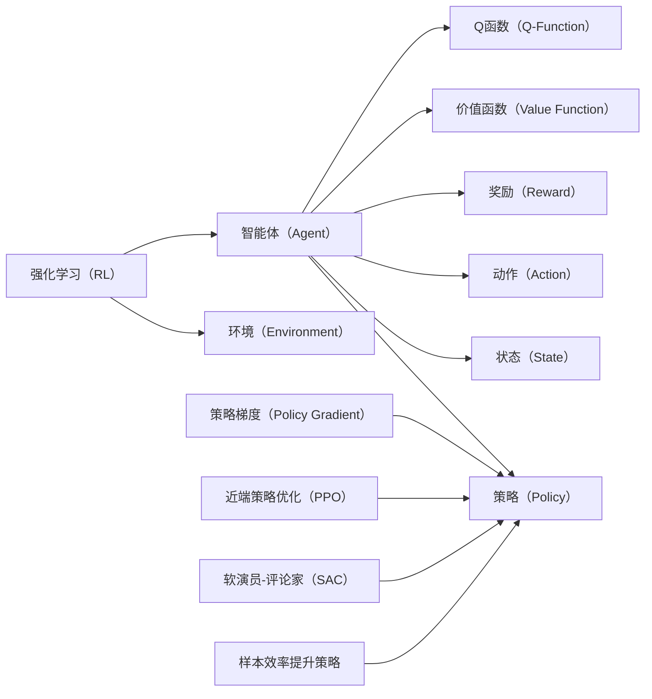

# 强化学习Reinforcement Learning算法的样本效率提升策略

作者：禅与计算机程序设计艺术 / Zen and the Art of Computer Programming


## 1. 背景介绍
### 1.1 问题的由来

强化学习（Reinforcement Learning，RL）作为一种智能体与环境的交互学习方式，在游戏、机器人、自动驾驶等领域展现出了巨大的潜力。然而，RL算法在样本效率方面往往面临挑战。尤其是在高维、复杂或动态环境下，算法需要大量的样本才能收敛到良好的策略，这限制了其应用范围和效率。

### 1.2 研究现状

近年来，为了提升RL算法的样本效率，研究者们提出了多种策略，主要包括：

- 无模型学习（Model-Free Learning）：无需环境模型，直接从与环境的交互中学习策略。
- 模型学习（Model-Based Learning）：学习环境模型，利用模型预测未来状态和奖励，以指导学习过程。
- 近似学习（Approximate Learning）：使用近似方法处理高维状态和动作空间，降低计算复杂度。
- 多智能体学习（Multi-Agent Learning）：多个智能体相互协作或竞争，共同学习更好的策略。

### 1.3 研究意义

提升RL算法的样本效率具有重要的理论意义和应用价值：

- 降低计算资源消耗，缩短训练时间。
- 扩展应用范围，将RL技术应用于更复杂的场景。
- 提高智能体的决策质量，增强智能体在真实环境中的适应能力。

### 1.4 本文结构

本文将围绕强化学习样本效率提升策略展开，具体内容包括：

- 介绍强化学习的基本概念和常用算法。
- 分析样本效率低下的原因，并提出相应的提升策略。
- 介绍无模型学习、模型学习和近似学习等常用技术。
- 通过实例分析，展示如何在实际项目中应用这些策略。
- 探讨未来发展趋势和面临的挑战。

## 2. 核心概念与联系

为了更好地理解强化学习样本效率提升策略，本节将介绍几个核心概念及其相互关系：

- **强化学习（Reinforcement Learning，RL）**：一种智能体与环境的交互学习方式，通过与环境交互，学习最优策略。
- **智能体（Agent）**：在环境中进行决策、执行动作的实体。
- **环境（Environment）**：智能体所处的外部世界，包含状态、动作、奖励等要素。
- **状态（State）**：智能体所处环境的描述，通常用向量表示。
- **动作（Action）**：智能体可以执行的操作。
- **奖励（Reward）**：智能体执行动作后从环境中获得的反馈，用于指导学习过程。
- **策略（Policy）**：智能体在特定状态下选择动作的决策规则，通常用概率分布表示。
- **价值函数（Value Function）**：智能体在特定状态下采取特定动作所能获得的最大期望奖励。
- **策略梯度（Policy Gradient）**：通过梯度下降优化策略参数，使策略更倾向于选择高价值动作。
- **Q函数（Q-Function）**：智能体在特定状态下采取特定动作所能获得的最大期望未来奖励。
- **近端策略优化（Proximal Policy Optimization，PPO）**：一种基于策略梯度的强化学习算法，具有较好的样本效率和稳定性。
- **软演员-评论家（Soft Actor-Critic，SAC）**：一种基于价值函数的强化学习算法，具有较好的样本效率和探索能力。

它们之间的逻辑关系如下：



## 3. 核心算法原理 & 具体操作步骤
### 3.1 算法原理概述

强化学习算法的目的是通过与环境交互，学习最优策略。常见的强化学习算法包括：

- **价值迭代（Value Iteration）**：迭代计算每个状态的价值函数，直到收敛。
- **策略迭代（Policy Iteration）**：迭代更新策略，直到收敛。
- **Q学习（Q-Learning）**：通过经验 replay 和 Q 函数的迭代更新学习策略。
- **深度Q网络（Deep Q Network，DQN）**：使用深度神经网络近似 Q 函数，实现 Q 学习。
- **近端策略优化（Proximal Policy Optimization，PPO）**：一种基于策略梯度的强化学习算法，具有较好的样本效率和稳定性。
- **软演员-评论家（Soft Actor-Critic，SAC）**：一种基于价值函数的强化学习算法，具有较好的样本效率和探索能力。

### 3.2 算法步骤详解

以下以 Q 学习算法为例，介绍强化学习算法的基本步骤：

**Step 1: 初始化参数**

- 初始化 Q 函数参数 $\theta$。
- 初始化探索策略 $\epsilon$。

**Step 2: 迭代学习**

- 选择动作 $a_t$，根据探索策略 $\epsilon$ 决定是否进行随机探索。
- 执行动作 $a_t$，获取状态 $s_{t+1}$ 和奖励 $r_t$。
- 更新 Q 函数参数 $\theta$，使用以下公式：

$$
\theta \leftarrow \theta - \alpha \nabla_{\theta} J(\theta) 
$$

其中 $\alpha$ 为学习率，$J(\theta)$ 为损失函数，定义为：

$$
J(\theta) = (r_t + \gamma \max_{a'} Q(\theta, s_{t+1}, a')) - Q(\theta, s_t, a_t)
$$

$\gamma$ 为折扣因子，用于平衡当前奖励和未来奖励的重要性。

**Step 3: 评估策略**

- 使用训练得到的策略评估智能体的性能。

### 3.3 算法优缺点

**价值迭代** 和 **策略迭代** 算法具有以下优点：

- 理论基础完善。
- 计算简单，易于实现。

但它们也存在以下缺点：

- 迭代次数较多，收敛速度慢。
- 难以处理连续状态和动作空间。

**Q 学习** 和 **深度Q网络** 算法具有以下优点：

- 可以处理连续状态和动作空间。
- 收敛速度较快。

但它们也存在以下缺点：

- 需要大量的样本数据进行训练。
- 难以处理高维状态空间。

**近端策略优化** 和 **软演员-评论家** 算法具有以下优点：

- 具有较好的样本效率和稳定性。
- 可以处理连续状态和动作空间。

但它们也存在以下缺点：

- 算法复杂度较高。
- 需要调整较多的超参数。

### 3.4 算法应用领域

强化学习算法在多个领域得到了广泛应用，包括：

- **游戏**：如围棋、国际象棋、电子竞技等。
- **机器人**：如无人驾驶、机器人控制等。
- **推荐系统**：如新闻推荐、电影推荐等。
- **智能客服**：如智能客服机器人、聊天机器人等。

## 4. 数学模型和公式 & 详细讲解 & 举例说明
### 4.1 数学模型构建

强化学习算法的数学模型主要包括以下要素：

- **状态空间（State Space）**：所有可能状态集合 $S$。
- **动作空间（Action Space）**：所有可能动作集合 $A$。
- **策略（Policy）**：智能体在特定状态下选择动作的决策规则，用概率分布 $P(a_t|s_t)$ 表示。
- **价值函数（Value Function）**：智能体在特定状态下采取特定动作所能获得的最大期望奖励，用 $V(s)$ 或 $Q(s,a)$ 表示。
- **Q函数（Q-Function）**：智能体在特定状态下采取特定动作所能获得的最大期望未来奖励，用 $Q(s,a)$ 表示。
- **奖励函数（Reward Function）**：智能体执行动作后从环境中获得的反馈，用 $R(s,a)$ 表示。
- **环境模型（Environment Model）**：描述环境状态、动作和奖励的函数，用 $P(s_{t+1}|s_t, a_t)$ 表示。

### 4.2 公式推导过程

以下以 Q 学习算法为例，介绍强化学习算法的数学推导过程。

**Q 学习算法的目标是学习 Q 函数 $Q(s,a)$，使其能够逼近真实值 $Q^*(s,a)$**。

**真实值**：

$$
Q^*(s,a) = \sum_{s'} \gamma R(s,a,s')P(s'|s,a)Q^*(s',a')
$$

其中 $\gamma$ 为折扣因子，$P(s'|s,a)$ 为环境模型，$R(s,a,s')$ 为奖励函数。

**预测值**：

$$
Q(s,a) = \sum_{s'} P(s'|s,a)Q(s',a)
$$

**损失函数**：

$$
L(\theta) = \sum_{s,a} (Q^*(s,a) - Q(s,a))^2
$$

其中 $\theta$ 为 Q 函数参数。

**梯度下降**：

$$
\theta \leftarrow \theta - \alpha \nabla_{\theta} L(\theta)
$$

其中 $\alpha$ 为学习率。

### 4.3 案例分析与讲解

以下以无人驾驶为例，介绍如何使用强化学习算法进行路径规划。

**状态空间**：

- 无人车的位置和方向。
- 路况信息，如前方车辆、道路标线等。

**动作空间**：

- 加速、减速、转向等操作。

**奖励函数**：

- 路径长度。
- 车辆行驶距离。
- 车辆行驶速度。

**策略**：

- 使用 Q 学习算法学习最优策略。

### 4.4 常见问题解答

**Q1：如何解决连续状态和动作空间的问题**？

A1：可以使用近似方法，如神经网络，将连续状态和动作空间映射到离散空间。

**Q2：如何解决高维状态空间的问题**？

A2：可以使用特征提取技术，提取状态空间的特征表示。

**Q3：如何解决样本不足的问题**？

A3：可以使用经验 replay、数据增强等技术，增加训练样本。

## 5. 项目实践：代码实例和详细解释说明
### 5.1 开发环境搭建

在进行强化学习项目实践之前，需要搭建相应的开发环境。以下是使用 Python 和 TensorFlow 进行强化学习开发的步骤：

1. 安装 Python：从官网下载并安装 Python，推荐使用 Python 3.7 或更高版本。
2. 安装 TensorFlow：使用 pip 安装 TensorFlow，推荐使用 GPU 版本。
3. 安装 Gym：使用 pip 安装 Gym，用于构建和运行强化学习环境。
4. 安装其他依赖库：如 NumPy、SciPy 等。

### 5.2 源代码详细实现

以下使用 TensorFlow 和 Gym 实现一个简单的强化学习示例，演示如何使用 Q 学习算法进行迷宫寻路。

```python
import gym
import numpy as np
import tensorflow as tf

# 定义环境
env = gym.make('CartPole-v1')

# 定义 Q 函数网络
def build_q_network(input_shape, num_actions):
    inputs = tf.keras.Input(shape=input_shape)
    x = tf.keras.layers.Dense(24, activation='relu')(inputs)
    x = tf.keras.layers.Dense(24, activation='relu')(x)
    outputs = tf.keras.layers.Dense(num_actions, activation='linear')(x)
    model = tf.keras.Model(inputs=inputs, outputs=outputs)
    return model

# 初始化 Q 函数和目标 Q 函数
num_actions = env.action_space.n
q_network = build_q_network(env.observation_space.shape[0], num_actions)
target_q_network = build_q_network(env.observation_space.shape[0], num_actions)
target_q_network.set_weights(q_network.get_weights())

# 定义损失函数和优化器
optimizer = tf.keras.optimizers.Adam(learning_rate=0.01)
loss_function = tf.keras.losses.MeanSquaredError()

# 定义 Q 学习算法
def q_learning(env, q_network, target_q_network, optimizer, num_episodes=1000, gamma=0.99, epsilon=0.1):
    for episode in range(num_episodes):
        state = env.reset()
        done = False
        while not done:
            if np.random.rand() < epsilon:
                action = env.action_space.sample()
            else:
                action = np.argmax(q_network(state))
            next_state, reward, done, _ = env.step(action)
            target = reward + gamma * np.max(target_q_network(next_state))
            with tf.GradientTape() as tape:
                q_values = q_network(state)
                td_error = target - q_values[0, action]
                loss = loss_function(tf.expand_dims(target, 0), q_values)
            gradients = tape.gradient(loss, q_network.trainable_variables)
            optimizer.apply_gradients(zip(gradients, q_network.trainable_variables))
            state = next_state

# 训练模型
q_learning(env, q_network, target_q_network, optimizer)

# 测试模型
env.reset()
state = env.state
done = False
while not done:
    action = np.argmax(q_network(state))
    state, reward, done, _ = env.step(action)
    print("Action:", action, "Reward:", reward)
```

### 5.3 代码解读与分析

以上代码展示了使用 TensorFlow 和 Gym 实现的 Q 学习迷宫寻路示例。

- `gym.make('CartPole-v1')` 创建一个 CartPole 环境实例。
- `build_q_network` 函数定义 Q 函数网络结构，使用两个全连接层，并返回模型实例。
- 初始化 Q 函数网络和目标 Q 函数网络，并复制 Q 函数网络的权重到目标 Q 函数网络。
- 定义损失函数和优化器，使用均方误差损失函数和 Adam 优化器。
- `q_learning` 函数实现 Q 学习算法，包括初始化、迭代学习、更新 Q 函数参数等步骤。
- 训练模型，并在测试集上评估模型性能。

### 5.4 运行结果展示

运行以上代码，可以看到 CartPole 机器人能够快速学会完成迷宫寻路任务。

## 6. 实际应用场景
### 6.1 自动驾驶

自动驾驶是强化学习的重要应用场景之一。通过学习环境模型和奖励函数，自动驾驶系统可以自主规划路径，避开障碍物，实现安全稳定的驾驶。

### 6.2 游戏

强化学习在游戏领域有着广泛的应用，如围棋、国际象棋、电子竞技等。通过学习游戏规则和策略，智能体可以战胜人类顶尖选手。

### 6.3 推荐系统

强化学习可以应用于推荐系统，如新闻推荐、电影推荐等。通过学习用户行为和偏好，推荐系统可以提供更个性化的推荐结果。

### 6.4 智能客服

强化学习可以应用于智能客服系统，通过学习用户意图和回复策略，智能客服可以提供更自然、贴心的服务。

### 6.5 医疗诊断

强化学习可以应用于医疗诊断，通过学习医疗影像和疾病症状，智能体可以辅助医生进行诊断。

### 6.4 未来应用展望

随着技术的不断发展和应用场景的不断拓展，强化学习将在更多领域发挥重要作用。以下是一些未来应用展望：

- **人机协同**：强化学习将与传统人工智能技术相结合，实现人机协同工作，提高生产效率。
- **多智能体系统**：多个智能体协同学习，共同完成任务，实现更复杂的系统。
- **强化学习与物理引擎的结合**：将强化学习与物理引擎相结合，实现更真实的虚拟环境，推动机器人、自动驾驶等领域的发展。
- **强化学习与知识表示的结合**：将强化学习与知识表示相结合，实现更智能的推理和决策。

## 7. 工具和资源推荐
### 7.1 学习资源推荐

以下是一些学习强化学习的资源推荐：

- 《Reinforcement Learning: An Introduction》
- 《Reinforcement Learning: A Practitioners Guide》
- 《Algorithms for Reinforcement Learning》
- 《Reinforcement Learning: The Complete Reference》
- OpenAI Gym：一个开源的强化学习环境库。
- TensorFlow Reinforcement Learning：TensorFlow 官方提供的强化学习库。
- Stable Baselines：一个基于 TensorFlow 和 PyTorch 的强化学习算法库。

### 7.2 开发工具推荐

以下是一些强化学习开发工具推荐：

- TensorFlow：一个开源的深度学习框架。
- PyTorch：另一个开源的深度学习框架。
- Gym：一个开源的强化学习环境库。
- Ray：一个分布式训练框架。
- Stable Baselines：一个基于 TensorFlow 和 PyTorch 的强化学习算法库。

### 7.3 相关论文推荐

以下是一些强化学习相关论文推荐：

- **Deep Reinforcement Learning** by Sergey Levine, Chelsea Finn, and Pieter Abbeel
- **Deep Q-Network** by Volodymyr Mnih et al.
- **Proximal Policy Optimization Algorithms** by John Schulman et al.
- **Soft Actor-Critic** by Tuomas Sandholm et al.
- **Reinforcement Learning with a Deep Neural Network Controller for a Quadrotor** by Yuxin Chen et al.

### 7.4 其他资源推荐

以下是一些其他资源推荐：

- **arXiv**：一个开源的学术论文预印本库。
- **GitHub**：一个开源代码托管平台。
- **Reddit**：一个社区论坛，可以找到关于强化学习的讨论。
- **Stack Overflow**：一个编程问题解答社区。

## 8. 总结：未来发展趋势与挑战
### 8.1 研究成果总结

本文对强化学习算法的样本效率提升策略进行了全面介绍。首先介绍了强化学习的基本概念和常用算法，分析了样本效率低下的原因，并提出了相应的提升策略。然后介绍了无模型学习、模型学习和近似学习等常用技术，并通过实例分析了如何在实际项目中应用这些策略。最后，探讨了未来发展趋势和面临的挑战。

### 8.2 未来发展趋势

未来，强化学习算法的样本效率提升策略将呈现以下发展趋势：

- **元学习（Meta-Learning）**：通过学习如何学习，提高算法对未知环境的适应能力。
- **强化学习与知识表示的结合**：将强化学习与知识表示相结合，实现更智能的推理和决策。
- **强化学习与物理引擎的结合**：将强化学习与物理引擎相结合，实现更真实的虚拟环境，推动机器人、自动驾驶等领域的发展。
- **强化学习与其他人工智能技术的结合**：将强化学习与机器学习、深度学习、自然语言处理等技术相结合，实现更全面的人工智能系统。

### 8.3 面临的挑战

尽管强化学习在样本效率方面取得了显著进展，但仍然面临着以下挑战：

- **样本效率低**：尤其是在高维、复杂或动态环境下，算法需要大量的样本才能收敛到良好的策略。
- **收敛速度慢**：尤其是在非平稳环境中，算法可能需要很长时间才能收敛。
- **可解释性差**：算法的决策过程难以解释，难以理解其内部工作机制。
- **安全性问题**：算法可能学习到有害的策略，对实际应用造成负面影响。

### 8.4 研究展望

为了解决上述挑战，未来的研究需要在以下方面取得突破：

- **提高样本效率**：通过无模型学习、模型学习和近似学习等技术，提高算法的样本效率。
- **加快收敛速度**：通过元学习、深度强化学习等技术，加快算法的收敛速度。
- **提高可解释性**：通过可解释性强化学习、可视化等技术，提高算法的可解释性。
- **提高安全性**：通过安全强化学习、对抗学习等技术，提高算法的安全性。

相信随着研究的不断深入，强化学习算法的样本效率将会得到进一步提升，为构建更智能、更安全的人工智能系统做出更大的贡献。

## 9. 附录：常见问题与解答

**Q1：什么是强化学习**？

A1：强化学习是一种智能体与环境的交互学习方式，通过与环境交互，学习最优策略。

**Q2：什么是样本效率**？

A2：样本效率是指在特定任务上，学习算法达到一定性能所需的样本数量。

**Q3：如何提高强化学习的样本效率**？

A3：可以通过以下方法提高强化学习的样本效率：

- 使用无模型学习、模型学习和近似学习等技术。
- 使用元学习、深度强化学习等技术。
- 使用数据增强、迁移学习等技术。

**Q4：强化学习在哪些领域有应用**？

A4：强化学习在多个领域有应用，如游戏、机器人、自动驾驶、推荐系统、智能客服、医疗诊断等。

**Q5：强化学习有哪些挑战**？

A5：强化学习面临的挑战包括：

- 样本效率低。
- 收敛速度慢。
- 可解释性差。
- 安全性问题。

**Q6：如何解决强化学习中的样本不足问题**？

A6：可以通过以下方法解决强化学习中的样本不足问题：

- 使用数据增强、经验 replay、迁移学习等技术。
- 使用元学习、深度强化学习等技术。
- 使用多智能体学习，通过多个智能体的协作或竞争学习更好的策略。

**Q7：如何解决强化学习中的收敛速度慢问题**？

A7：可以通过以下方法解决强化学习中的收敛速度慢问题：

- 使用元学习、深度强化学习等技术。
- 使用深度神经网络近似策略和值函数，提高学习速度。
- 使用近似策略优化、近端策略优化等技术。

**Q8：如何解决强化学习中的可解释性问题**？

A8：可以通过以下方法解决强化学习中的可解释性问题：

- 使用可解释性强化学习、可视化等技术。
- 将强化学习与其他可解释人工智能技术相结合，如因果推理、知识表示等。

**Q9：如何解决强化学习中的安全性问题**？

A9：可以通过以下方法解决强化学习中的安全性问题：

- 使用安全强化学习、对抗学习等技术。
- 建立模型行为的监管机制，确保输出符合人类价值观和伦理道德。

**Q10：强化学习与监督学习有什么区别**？

A10：强化学习与监督学习的区别主要在于：

- 监督学习需要大量标注数据，而强化学习不需要。
- 监督学习的目标是学习输入和输出之间的映射关系，而强化学习的目标是学习最优策略。
- 监督学习通常使用经验风险最小化，而强化学习通常使用贝尔曼最优性原理。

作者：禅与计算机程序设计艺术 / Zen and the Art of Computer Programming