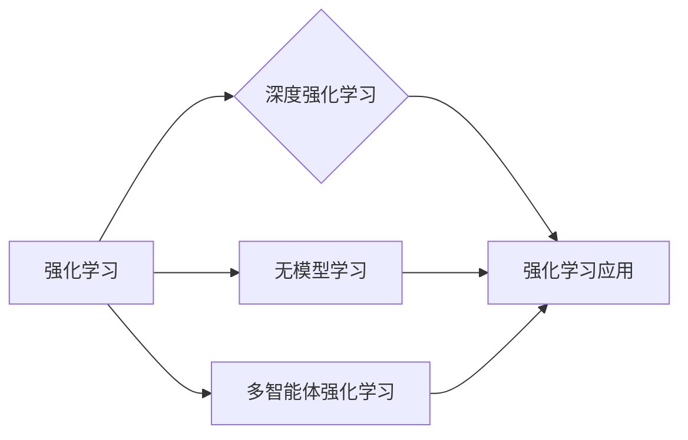

# 强化学习：未来发展动向预测

> 关键词：强化学习，未来趋势，深度强化学习，无模型学习，多智能体强化学习，强化学习应用

## 1. 背景介绍
### 1.1 问题的由来

自20世纪50年代以来，人工智能领域不断涌现出各种算法和技术。其中，强化学习（Reinforcement Learning，RL）作为一种重要的机器学习方法，因其能够使智能体在动态环境中自主学习并作出决策而备受关注。近年来，随着深度学习技术的快速发展，深度强化学习（Deep Reinforcement Learning，DRL）取得了显著的成果，并在游戏、机器人、自动驾驶等领域取得了突破性的进展。

然而，随着研究的不断深入，强化学习仍面临着诸多挑战，如样本效率低下、探索-利用权衡、稀疏奖励等。如何进一步提高强化学习的样本效率、鲁棒性和可解释性，成为当前研究的热点问题。

### 1.2 研究现状

目前，强化学习的研究主要集中在以下几个方面：

- 深度强化学习：利用深度神经网络进行特征提取和价值评估，提高学习效率。
- 无模型学习：摆脱对环境模型依赖，直接学习状态-动作价值函数或策略。
- 多智能体强化学习：研究多个智能体之间相互协作、竞争的策略，以实现共同目标。
- 强化学习应用：探索强化学习在各个领域的应用，如游戏、机器人、自动驾驶等。

### 1.3 研究意义

强化学习作为一种重要的机器学习方法，在以下几个方面具有重要意义：

- 自动化决策：使智能体能够在动态环境中自动作出决策，提高自动化水平。
- 数据效率：减少对大量标注数据的依赖，降低数据获取成本。
- 智能控制：应用于机器人、自动驾驶等领域，提高智能化水平。

### 1.4 本文结构

本文将围绕强化学习未来的发展趋势展开讨论，主要包括以下内容：

- 核心概念与联系
- 核心算法原理与具体操作步骤
- 数学模型和公式
- 项目实践
- 实际应用场景
- 工具和资源推荐
- 总结：未来发展趋势与挑战

## 2. 核心概念与联系

为了更好地理解强化学习未来的发展趋势，本节将介绍几个关键概念：

- 强化学习（Reinforcement Learning，RL）：一种使智能体在动态环境中通过与环境的交互学习最优策略的方法。
- 深度强化学习（Deep Reinforcement Learning，DRL）：利用深度神经网络进行特征提取和价值评估的强化学习方法。
- 无模型学习（Model-Free Learning）：不依赖于环境模型，直接学习状态-动作价值函数或策略的强化学习方法。
- 多智能体强化学习（Multi-Agent Reinforcement Learning，MARL）：研究多个智能体之间相互协作、竞争的策略，以实现共同目标的强化学习方法。
- 强化学习应用（Reinforcement Learning Applications）：将强化学习应用于各个领域，如游戏、机器人、自动驾驶等。

这些概念之间的关系如下所示：



## 3. 核心算法原理 & 具体操作步骤
### 3.1 算法原理概述

强化学习的基本原理是：智能体通过与环境交互，不断学习最优策略，以实现目标最大化。其核心包括以下要素：

- 状态（State）：智能体所处的环境状态。
- 动作（Action）：智能体可以采取的动作集合。
- 奖励（Reward）：智能体采取某个动作后，环境给予的奖励信号。
- 策略（Policy）：智能体在特定状态下采取动作的概率分布。
- 环境模型（Environment Model）：描述环境状态转移和奖励生成的概率分布。

强化学习的目标是找到最优策略，使得智能体在长期运行中获得的奖励总和最大化。常用的策略优化方法包括：

- 值函数逼近：通过学习状态-动作价值函数，估计在特定状态下采取某个动作的价值。
- 策略梯度方法：直接优化策略函数，以最大化长期奖励。

### 3.2 算法步骤详解

强化学习的基本步骤如下：

1. 初始化参数：初始化智能体参数，包括状态-动作价值函数、策略参数等。
2. 状态转移：智能体根据当前策略选择动作，与环境进行交互，并获取新的状态和奖励。
3. 更新参数：根据收集到的数据，更新状态-动作价值函数或策略参数。
4. 重复步骤2和3，直到达到某个终止条件。

### 3.3 算法优缺点

强化学习具有以下优点：

- 自动化决策：智能体能够根据环境状态自动作出决策，无需人工干预。
- 数据效率：减少对大量标注数据的依赖，降低数据获取成本。
- 智能控制：应用于机器人、自动驾驶等领域，提高智能化水平。

然而，强化学习也存在一些缺点：

- 样本效率低下：需要大量样本才能收敛到最优策略。
- 探索-利用权衡：在探索未知动作和利用已知动作之间取得平衡。
- 稀疏奖励：某些任务中，奖励信号非常稀疏，难以驱动智能体学习。

### 3.4 算法应用领域

强化学习在以下领域具有广泛的应用：

- 游戏：如棋类游戏、电子游戏等。
- 机器人：如机器人路径规划、抓取等。
- 自动驾驶：如车辆控制、路径规划等。
- 供应链管理：如库存管理、配送路径优化等。

## 4. 数学模型和公式 & 详细讲解 & 举例说明
### 4.1 数学模型构建

强化学习的数学模型主要包括以下内容：

- 状态-动作价值函数 $V(s)$：在状态 $s$ 下采取动作 $a$ 的价值。
- 策略 $\pi(a|s)$：在状态 $s$ 下采取动作 $a$ 的概率。
- 环境模型 $P(s'|s, a)$：在状态 $s$ 下采取动作 $a$ 后，转移到状态 $s'$ 的概率。

### 4.2 公式推导过程

以下以Q学习算法为例，介绍强化学习的数学推导过程。

Q学习算法是一种基于值函数逼近的强化学习方法，其目标是学习状态-动作价值函数 $Q(s, a)$。

假设智能体在状态 $s$ 下采取动作 $a$，获得奖励 $r$，转移到状态 $s'$。则Q学习算法的目标是：

$$
Q(s, a) = \mathbb{E}_{s'}[r + \gamma \max_{a'} Q(s', a') | s, a]
$$

其中 $\gamma$ 为折扣因子，$\mathbb{E}_{s'}$ 表示在状态 $s'$ 下采取动作 $a'$ 的期望。

### 4.3 案例分析与讲解

以下以机器人路径规划为例，介绍强化学习的应用。

假设机器人需要在二维空间内从起点 $s_0$ 移动到终点 $s_f$。机器人可以采取的动作包括向左、向右、向上、向下移动。环境模型描述了机器人移动到相邻状态的概率，奖励函数描述了机器人到达终点时的奖励。

通过Q学习算法，机器人可以学习到从起点到终点的最优路径。

### 4.4 常见问题解答

**Q1：如何提高强化学习的样本效率？**

A: 提高强化学习的样本效率可以从以下几个方面入手：
1. 使用无模型学习，直接学习状态-动作价值函数或策略，避免对环境模型依赖。
2. 采用经验回放技术，将之前的经验进行重放，减少样本冗余。
3. 使用近端策略优化（Proximal Policy Optimization，PPO）等算法，提高学习效率。

**Q2：如何解决探索-利用权衡问题？**

A: 解决探索-利用权衡问题可以采用以下方法：
1. 使用ε-greedy策略，在采取贪婪策略和随机策略之间进行平衡。
2. 使用UCB（Upper Confidence Bound）算法，根据置信区间选择动作，平衡探索和利用。
3. 使用多智能体强化学习，多个智能体相互协作，提高样本效率。

**Q3：如何解决稀疏奖励问题？**

A: 解决稀疏奖励问题可以采用以下方法：
1. 使用累积奖励（Reward Shaping）技术，将稀疏奖励转换为更密集的奖励。
2. 使用优势函数（Advantage Function）技术，通过比较不同动作的优势，提高学习效率。
3. 使用强化学习与深度学习结合，利用深度神经网络对稀疏奖励进行建模。

## 5. 项目实践：代码实例和详细解释说明
### 5.1 开发环境搭建

以下以Python为例，介绍强化学习的开发环境搭建。

1. 安装Python：从官网下载并安装Python 3.7及以上版本。
2. 安装PyTorch：使用pip安装PyTorch。

### 5.2 源代码详细实现

以下以Q学习算法为例，介绍强化学习的代码实现。

```python
import random
import numpy as np
import torch
import torch.nn as nn
import torch.optim as optim

class QNetwork(nn.Module):
    def __init__(self, input_size, output_size):
        super(QNetwork, self).__init__()
        self.fc = nn.Linear(input_size, output_size)

    def forward(self, x):
        return self.fc(x)

def q_learning(env, q_network, optimizer, episodes=1000, discount_factor=0.99):
    for episode in range(episodes):
        state = env.reset()
        done = False
        total_reward = 0
        while not done:
            with torch.no_grad():
                q_values = q_network(state)
            action = np.argmax(q_values.data.numpy())
            next_state, reward, done, _ = env.step(action)
            total_reward += reward
            q_values[0, action] = reward + discount_factor * torch.max(q_network(next_state))
            optimizer.zero_grad()
            q_values.backward()
            optimizer.step()
        print(f"Episode {episode}, Total Reward: {total_reward}")

if __name__ == "__main__":
    input_size = 4
    output_size = 4
    q_network = QNetwork(input_size, output_size)
    optimizer = optim.Adam(q_network.parameters(), lr=0.01)
    env = gym.make("CartPole-v1")
    q_learning(env, q_network, optimizer)
```

### 5.3 代码解读与分析

以上代码实现了Q学习算法，主要包括以下部分：

- `QNetwork`类：定义了Q值网络，使用PyTorch构建神经网络。
- `q_learning`函数：实现Q学习算法，包括初始化参数、环境交互、Q值更新等步骤。
- `if __name__ == "__main__":`部分：定义输入输出大小，加载Q值网络和优化器，创建环境，并运行Q学习算法。

### 5.4 运行结果展示

运行上述代码，可以得到CartPole游戏的最优策略，使机器人能够在环境中稳定运行。

## 6. 实际应用场景
### 6.1 游戏

强化学习在游戏领域取得了显著的成果，如AlphaGo、AlphaStar等。这些模型通过学习在游戏中的策略，实现了在各个领域的突破。

### 6.2 机器人

强化学习在机器人领域具有广泛的应用，如路径规划、抓取、移动等。通过学习与环境交互的策略，机器人可以完成各种复杂的任务。

### 6.3 自动驾驶

强化学习在自动驾驶领域具有巨大的应用潜力，如车辆控制、路径规划、交通信号识别等。通过学习在复杂交通环境下的策略，自动驾驶汽车可以实现安全、高效的驾驶。

### 6.4 供应链管理

强化学习可以应用于供应链管理领域，如库存管理、配送路径优化等。通过学习最优策略，提高供应链的效率和灵活性。

## 7. 工具和资源推荐
### 7.1 学习资源推荐

以下是一些关于强化学习的学习资源：

- 《Reinforcement Learning: An Introduction》
- 《Deep Reinforcement Learning》
- 《Algorithms for Reinforcement Learning》

### 7.2 开发工具推荐

以下是一些用于强化学习开发的工具：

- PyTorch：一个开源的机器学习库，支持强化学习。
- TensorFlow：另一个开源的机器学习库，支持强化学习。
- OpenAI Gym：一个开源的强化学习框架，提供了丰富的环境。
- Stable Baselines：一个基于PyTorch的强化学习库，提供了多种强化学习算法的实现。

### 7.3 相关论文推荐

以下是一些关于强化学习的相关论文：

- “Deep Reinforcement Learning” by David Silver
- “Playing Atari with Deep Reinforcement Learning” by Volodymyr Mnih et al.
- “Human-Level Control through Deep Reinforcement Learning” by Volodymyr Mnih et al.
- “Algorithms for Reinforcement Learning” by Csaba Szepesvári

### 7.4 其他资源推荐

以下是一些其他关于强化学习的资源：

- 强化学习课程：https://www.coursera.org/learn/reinforcement-learning
- 强化学习社区：https://github.com/DLR-RM/reinforcement-learning
- 强化学习论文集：https://arxiv.org/search?query=强化学习

## 8. 总结：未来发展趋势与挑战
### 8.1 研究成果总结

本文对强化学习未来的发展趋势进行了预测，主要包括以下内容：

- 深度强化学习：利用深度神经网络进行特征提取和价值评估，提高学习效率。
- 无模型学习：摆脱对环境模型依赖，直接学习状态-动作价值函数或策略。
- 多智能体强化学习：研究多个智能体之间相互协作、竞争的策略，以实现共同目标。
- 强化学习应用：探索强化学习在各个领域的应用，如游戏、机器人、自动驾驶等。

### 8.2 未来发展趋势

强化学习未来的发展趋势主要体现在以下几个方面：

- 深度强化学习：进一步探索深度神经网络结构，提高模型的表达能力。
- 无模型学习：摆脱对环境模型依赖，提高样本效率。
- 多智能体强化学习：研究多个智能体之间的协同、竞争策略，实现更加复杂的目标。
- 强化学习应用：将强化学习应用于更多领域，推动人工智能技术的进步。

### 8.3 面临的挑战

尽管强化学习取得了显著的成果，但仍面临着以下挑战：

- 样本效率：如何提高样本效率，降低数据获取成本。
- 探索-利用权衡：在探索未知动作和利用已知动作之间取得平衡。
- 可解释性：如何提高模型的可解释性，使决策过程更加透明。
- 安全性：如何确保强化学习系统的安全性，避免潜在风险。

### 8.4 研究展望

针对上述挑战，未来的研究可以从以下几个方面进行：

- 探索高效的算法，提高样本效率。
- 研究可解释的强化学习算法，提高决策过程的透明度。
- 开发安全的强化学习系统，避免潜在风险。
- 推动强化学习在各个领域的应用，推动人工智能技术的发展。

总之，强化学习作为一种重要的机器学习方法，具有广阔的应用前景。通过不断探索和突破，强化学习将在未来的人工智能领域发挥更加重要的作用。

## 9. 附录：常见问题与解答

**Q1：强化学习与监督学习和无监督学习有什么区别？**

A：强化学习、监督学习和无监督学习是三种不同的机器学习方法，它们的主要区别如下：

- 强化学习：通过与环境交互，学习最优策略，实现目标最大化。
- 监督学习：通过标注数据进行学习，学习输入和输出之间的关系。
- 无监督学习：通过未标注数据进行学习，学习数据的分布和特征。

**Q2：如何解决强化学习中的稀疏奖励问题？**

A：解决稀疏奖励问题可以采用以下方法：

- 累积奖励（Reward Shaping）：将稀疏奖励转换为更密集的奖励。
- 优势函数（Advantage Function）：通过比较不同动作的优势，提高学习效率。
- 深度学习：利用深度神经网络对稀疏奖励进行建模。

**Q3：如何提高强化学习的样本效率？**

A：提高强化学习的样本效率可以采用以下方法：

- 经验回放（Experience Replay）：将之前的经验进行重放，减少样本冗余。
- 近端策略优化（Proximal Policy Optimization，PPO）：提高学习效率。
- 多智能体强化学习：多个智能体相互协作，提高样本效率。

**Q4：如何保证强化学习系统的安全性？**

A：保证强化学习系统的安全性可以采用以下方法：

- 监控和审计：实时监控系统行为，发现潜在风险。
- 安全约束：在策略优化过程中加入安全约束，避免危险动作。
- 人类在环（Human-in-the-loop）：在关键决策环节引入人类干预，提高系统安全性。

作者：禅与计算机程序设计艺术 / Zen and the Art of Computer Programming