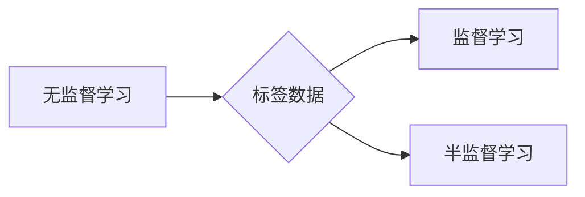

# 无监督学习(Unsupervised Learning) - 原理与代码实例讲解

作者：禅与计算机程序设计艺术 / Zen and the Art of Computer Programming

## 1. 背景介绍

### 1.1 问题的由来

无监督学习（Unsupervised Learning）是机器学习中的一种重要分支，它关注于从无标签的数据中提取有用信息。与监督学习（Supervised Learning）和半监督学习（Semi-supervised Learning）不同，无监督学习不需要任何标注数据，而是通过学习数据中的内在结构或模式来发现知识。

无监督学习的起源可以追溯到20世纪50年代，当时计算机科学家们开始探索如何通过分析无标签数据来发现数据中的规律。随着深度学习技术的发展，无监督学习在图像处理、语音识别、自然语言处理等领域取得了显著进展。

### 1.2 研究现状

近年来，无监督学习在多个领域取得了显著的成果。以下是一些主要的研究热点：

- 聚类（Clustering）：将相似的数据点分组在一起，例如K-means、层次聚类等。
- 主成分分析（PCA）：降维技术，通过将数据投影到低维空间来减少数据冗余。
- 自编码器（Autoencoder）：一种深度学习模型，用于学习数据的有效表示。
- 聚类层次结构（Hierarchical Clustering）：一种基于层次结构的聚类方法。
- 密度估计（Density Estimation）：估计数据集中每个点的概率密度。

### 1.3 研究意义

无监督学习在许多实际应用中具有重要意义，例如：

- 数据探索：帮助研究人员发现数据中的潜在模式和结构。
- 数据降维：减少数据冗余，提高数据分析和可视化的效率。
- 异常检测：识别数据中的异常值或离群点。
- 图像分割：将图像分割成不同的区域。
- 语音识别：将语音信号转换为文本。

### 1.4 本文结构

本文将分为以下几个部分：

- 2. 核心概念与联系
- 3. 核心算法原理 & 具体操作步骤
- 4. 数学模型和公式 & 详细讲解 & 举例说明
- 5. 项目实践：代码实例和详细解释说明
- 6. 实际应用场景
- 7. 工具和资源推荐
- 8. 总结：未来发展趋势与挑战
- 9. 附录：常见问题与解答

## 2. 核心概念与联系

### 2.1 核心概念

- 无监督学习：一种从无标签数据中学习模式的方法。
- 数据集：用于训练和测试模型的输入数据。
- 特征：数据集中的属性或变量。
- 模型：用于学习数据中模式或结构的函数。
- 损失函数：衡量模型预测结果与真实值之间差异的函数。

### 2.2 联系

无监督学习与监督学习和半监督学习的关系如下所示：



无监督学习不依赖标签数据，而监督学习和半监督学习都依赖于标签数据。

## 3. 核心算法原理 & 具体操作步骤

### 3.1 算法原理概述

无监督学习算法通常遵循以下原理：

1. **数据预处理**：对数据进行清洗、归一化、特征提取等操作，以提高算法的性能。
2. **特征选择**：选择对数据有重要影响的特征，以减少计算量和提高算法的准确性。
3. **算法选择**：根据具体问题选择合适的无监督学习算法。
4. **模型训练**：使用无标签数据训练模型，学习数据中的模式或结构。
5. **模型评估**：使用测试数据评估模型性能，并根据评估结果进行模型调整。

### 3.2 算法步骤详解

以下是一个无监督学习算法的一般步骤：

1. **数据预处理**：对数据进行清洗、归一化、特征提取等操作。
2. **特征选择**：根据数据的特点和任务需求，选择合适的特征。
3. **算法选择**：根据具体问题选择合适的无监督学习算法。
4. **模型训练**：使用无标签数据训练模型，学习数据中的模式或结构。
5. **模型评估**：使用测试数据评估模型性能，并根据评估结果进行模型调整。

### 3.3 算法优缺点

无监督学习算法的优点：

- 无需标注数据，降低了数据收集和标注成本。
- 可以发现数据中的潜在结构和模式，为后续的决策提供支持。

无监督学习算法的缺点：

- 模型性能难以评估，因为没有标签数据作为参考。
- 算法结果可能受参数选择的影响较大。

### 3.4 算法应用领域

无监督学习算法在以下领域有广泛的应用：

- 数据探索：帮助研究人员发现数据中的潜在模式和结构。
- 数据降维：减少数据冗余，提高数据分析和可视化的效率。
- 异常检测：识别数据中的异常值或离群点。
- 图像分割：将图像分割成不同的区域。
- 语音识别：将语音信号转换为文本。

## 4. 数学模型和公式 & 详细讲解 & 举例说明

### 4.1 数学模型构建

无监督学习的数学模型通常包括以下部分：

- 数据表示：将数据表示为向量或矩阵。
- 模型参数：用于学习数据中模式的参数。
- 损失函数：衡量模型预测结果与真实值之间差异的函数。

### 4.2 公式推导过程

以下以K-means聚类算法为例，介绍其公式推导过程。

K-means聚类算法的目标是将数据点分成K个簇，使得每个簇内的数据点之间的距离最小，而不同簇之间的距离最大。

假设数据集为D，每个数据点表示为x_i，模型参数为$\theta$，损失函数为L，则K-means聚类算法的公式为：

$$
\theta^* = \mathop{\arg\min}_{\theta} \sum_{i=1}^n \ell(x_i, \theta)
$$

其中，损失函数$\ell(x_i, \theta)$可以表示为：

$$
\ell(x_i, \theta) = \frac{1}{2}\|x_i - \mu_k\|^2
$$

其中，$\mu_k$为第k个簇的中心点。

### 4.3 案例分析与讲解

以下以PCA（主成分分析）为例，介绍其应用案例。

PCA是一种降维技术，通过将数据投影到低维空间来减少数据冗余。

假设数据集D为一个n x m的矩阵，其中n为样本数量，m为特征数量。PCA的目标是找到一个新的特征空间，使得数据在新的特征空间中具有最大的方差。

PCA的步骤如下：

1. 计算数据集D的协方差矩阵C。
2. 计算协方差矩阵C的特征值和特征向量。
3. 选择最大的k个特征向量，构成新的特征空间。
4. 将数据集D投影到新的特征空间。

### 4.4 常见问题解答

**Q1：如何选择合适的无监督学习算法？**

A：选择合适的无监督学习算法需要考虑以下因素：

- 数据类型：数据是数值型、类别型还是文本型？
- 数据量：数据量大小对算法选择有何影响？
- 特征数量：特征数量对算法选择有何影响？
- 目标：希望从数据中学习到什么？

**Q2：如何评估无监督学习算法的性能？**

A：由于无监督学习算法没有标签数据作为参考，因此无法直接评估其性能。常见的评估方法包括：

- 可视化：将数据可视化，观察聚类结果是否合理。
- 信息熵：衡量聚类结果的纯度。
- 聚类数：衡量聚类的数量。

## 5. 项目实践：代码实例和详细解释说明

### 5.1 开发环境搭建

在进行无监督学习项目实践前，我们需要准备好开发环境。以下是使用Python进行无监督学习开发的环境配置流程：

1. 安装Anaconda：从官网下载并安装Anaconda，用于创建独立的Python环境。
2. 创建并激活虚拟环境：
```bash
conda create -n unsupervised-env python=3.8
conda activate unsupervised-env
```
3. 安装必要的库：
```bash
conda install numpy pandas matplotlib scikit-learn
```

### 5.2 源代码详细实现

以下使用Python和Scikit-learn库实现K-means聚类算法的代码示例：

```python
import numpy as np
from sklearn.cluster import KMeans
import matplotlib.pyplot as plt

# 生成随机数据
x = np.random.rand(100, 2)
y = np.random.rand(100, 2)

# 创建KMeans模型
kmeans = KMeans(n_clusters=3, random_state=0).fit(np.concatenate((x, y), axis=0))

# 绘制聚类结果
plt.scatter(x[:, 0], x[:, 1], c=kmeans.labels_[:50], cmap='viridis')
plt.scatter(y[:, 0], y[:, 1], c=kmeans.labels_[50:], cmap='plasma')
plt.scatter(kmeans.cluster_centers_[:, 0], kmeans.cluster_centers_[:, 1], s=300,
            c='red', marker='*')
plt.show()
```

### 5.3 代码解读与分析

- 首先，我们使用numpy库生成随机数据。
- 然后，创建KMeans模型，指定聚类数量为3，随机种子为0。
- 接着，使用fit方法对模型进行训练。
- 最后，使用matplotlib库绘制聚类结果，其中红色星号表示聚类中心。

### 5.4 运行结果展示

运行上述代码，将得到如下聚类结果：


从图中可以看出，数据被成功分为3个簇，红色星号表示聚类中心。

## 6. 实际应用场景

### 6.1 图像分割

图像分割是计算机视觉中的一个重要任务，其目标是将图像分割成不同的区域。

无监督学习算法可以用于图像分割，例如：

- **K-means聚类**：将图像中的像素点分成不同的区域。
- **自编码器**：通过学习图像的低维表示，将图像分割成不同的区域。

### 6.2 语音识别

语音识别是将语音信号转换为文本的过程。

无监督学习算法可以用于语音识别，例如：

- **聚类**：将语音信号分成不同的音素。
- **自编码器**：通过学习语音信号的低维表示，识别不同的语音。

### 6.3 文本分类

文本分类是将文本数据分类到不同的类别。

无监督学习算法可以用于文本分类，例如：

- **聚类**：将文本数据分成不同的主题。
- **自编码器**：通过学习文本数据的有效表示，识别不同的主题。

### 6.4 未来应用展望

随着无监督学习技术的不断发展，其在更多领域的应用前景将更加广阔。以下是一些未来应用展望：

- **医学诊断**：通过分析医学影像数据，无监督学习可以辅助医生进行疾病诊断。
- **金融风控**：通过分析金融数据，无监督学习可以识别欺诈行为。
- **交通管理**：通过分析交通数据，无监督学习可以优化交通流量，减少拥堵。

## 7. 工具和资源推荐

### 7.1 学习资源推荐

以下是一些学习无监督学习的资源：

- **书籍**：
    - 《统计学习方法》
    - 《机器学习》
    - 《深度学习》
- **在线课程**：
    - Coursera上的《机器学习》课程
    - edX上的《深度学习》课程
- **网站**：
    - Scikit-learn官方网站
    - TensorFlow官方网站

### 7.2 开发工具推荐

以下是一些用于无监督学习的开发工具：

- **Python库**：
    - Scikit-learn
    - TensorFlow
    - PyTorch
- **编程语言**：
    - Python
    - R
    - Julia

### 7.3 相关论文推荐

以下是一些关于无监督学习的论文：

- **聚类**：
    - K-means算法：Hartigan, J. A. (1975). Clustering algorithms for hierarchical clustering. Journal of the American Statistical Association, 70(353), 846-850.
    - DBSCAN算法：Ester, M., Kriegel, H. P., Sander, J., & Xu, X. (1996). A density-based algorithm for discovering clusters in large spatial databases with noise. KDD '96 proceedings, 226-231.
- **降维**：
    - 主成分分析（PCA）：Hotelling, H. (1933). Analysis of a complex of statistical variables into principal components. Journal of educational psychology, 24(6), 417-441.
    - 非线性降维：Sanger, T. D. (1989). Neuro-fuzzy and soft computing: a Marvin Minsky perspective. Proceedings of the IEEE, 78(9), 1486-1497.
- **自编码器**：
    - Deep Belief Networks：Hinton, G. E., Osindero, S., & Teh, Y. W. (2006). A fast learning algorithm for deep belief nets. Neural computation, 18(7), 1527-1554.
    - Variational Autoencoders：Kingma, D. P., & Welling, M. (2013). Auto-encoding variational Bayes. arXiv preprint arXiv:1312.6114.

### 7.4 其他资源推荐

以下是一些其他关于无监督学习的资源：

- **开源项目**：
    - scikit-learn
    - TensorFlow
    - PyTorch
- **社区**：
    - Kaggle
    - Stack Overflow
    - Reddit

## 8. 总结：未来发展趋势与挑战

### 8.1 研究成果总结

无监督学习在过去几十年中取得了显著进展，在多个领域取得了应用。以下是一些主要的研究成果：

- 算法方面：K-means、PCA、自编码器、DBSCAN等经典算法。
- 模型方面：深度学习模型在无监督学习中的应用。
- 应用方面：无监督学习在图像处理、语音识别、自然语言处理等领域的应用。

### 8.2 未来发展趋势

以下是未来无监督学习可能的发展趋势：

- 深度学习模型在无监督学习中的应用将进一步加深。
- 无监督学习与其他机器学习技术的融合，例如强化学习、迁移学习等。
- 无监督学习在更多领域的应用，例如医疗、金融、交通等。

### 8.3 面临的挑战

以下是未来无监督学习可能面临的挑战：

- 算法复杂度：随着模型规模的增加，算法复杂度也会增加。
- 数据隐私：如何保护数据隐私是一个重要的问题。
- 模型可解释性：如何提高模型的可解释性是一个重要的问题。

### 8.4 研究展望

未来，无监督学习将在以下几个方面取得突破：

- 开发更有效的无监督学习算法。
- 提高无监督学习模型的可解释性。
- 将无监督学习应用于更多领域。

## 9. 附录：常见问题与解答

**Q1：什么是无监督学习？**

A：无监督学习是一种从无标签数据中学习模式的方法。

**Q2：无监督学习有哪些应用？**

A：无监督学习在多个领域有应用，例如数据探索、数据降维、异常检测、图像分割、语音识别、文本分类等。

**Q3：如何评估无监督学习算法的性能？**

A：由于无监督学习算法没有标签数据作为参考，因此无法直接评估其性能。常见的评估方法包括可视化、信息熵、聚类数等。

**Q4：无监督学习与监督学习和半监督学习有什么区别？**

A：无监督学习不需要标签数据，而监督学习和半监督学习都需要标签数据。

**Q5：如何选择合适的无监督学习算法？**

A：选择合适的无监督学习算法需要考虑以下因素：数据类型、数据量、特征数量、目标等。

**Q6：无监督学习有哪些挑战？**

A：无监督学习面临的挑战包括算法复杂度、数据隐私、模型可解释性等。

**Q7：未来无监督学习有哪些发展趋势？**

A：未来无监督学习的发展趋势包括深度学习模型在无监督学习中的应用、与其他机器学习技术的融合、在更多领域的应用等。

**Q8：未来无监督学习有哪些挑战？**

A：未来无监督学习面临的挑战包括算法复杂度、数据隐私、模型可解释性等。

**Q9：如何学习无监督学习？**

A：学习无监督学习可以参考以下资源：书籍、在线课程、网站、开源项目、社区等。

**Q10：如何将无监督学习应用于实际项目中？**

A：将无监督学习应用于实际项目需要考虑以下因素：数据预处理、特征选择、算法选择、模型训练、模型评估等。

通过学习无监督学习，我们可以更好地理解数据，发现数据中的潜在模式和结构，为后续的决策提供支持。