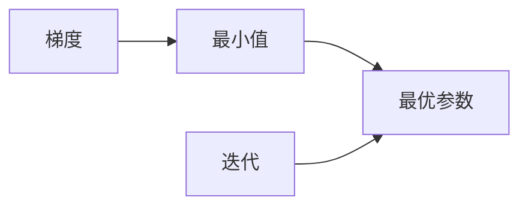

# 梯度下降(Gradient Descent) - 原理与代码实例讲解

## 1. 背景介绍
### 1.1 问题的由来

梯度下降（Gradient Descent，简称GD）是机器学习中一种经典且重要的优化算法，用于在训练模型时寻找最优参数。在很多机器学习任务中，我们希望找到一个函数的最小值，例如线性回归、神经网络等。梯度下降算法通过迭代地更新参数，使得函数值逐渐逼近最小值。

### 1.2 研究现状

梯度下降算法自提出以来，已经经过多年的发展，形成了多种变体，如随机梯度下降（Stochastic Gradient Descent，简称SGD）、小批量梯度下降（Mini-batch Gradient Descent）等。这些变体在效率和性能上各有优劣，广泛应用于不同的机器学习任务中。

### 1.3 研究意义

梯度下降算法是机器学习领域中不可或缺的工具，对于理解机器学习原理、开发高效的算法模型具有重要意义。掌握梯度下降算法，能够帮助我们更好地理解模型训练过程，优化模型参数，提高模型性能。

### 1.4 本文结构

本文将围绕梯度下降算法展开，包括其原理、步骤、优缺点、应用领域以及代码实例等，内容安排如下：

- 第2部分，介绍梯度下降算法的核心概念。
- 第3部分，详细讲解梯度下降算法的原理和具体操作步骤。
- 第4部分，分析梯度下降算法的数学模型和公式，并结合实例进行说明。
- 第5部分，通过代码实例展示梯度下降算法在实际应用中的使用方法。
- 第6部分，探讨梯度下降算法在不同应用场景中的实际应用。
- 第7部分，推荐相关的学习资源、开发工具和参考文献。
- 第8部分，总结全文，展望梯度下降算法的未来发展趋势与挑战。

## 2. 核心概念与联系

为更好地理解梯度下降算法，本节将介绍几个密切相关的核心概念：

- 梯度：函数在某一点的切线斜率，表示函数在该点的局部变化趋势。
- 最小值：函数取值最小的点，表示函数在该点处达到局部极小。
- 最优参数：模型训练过程中，使得模型性能达到最优的参数值。
- 迭代：重复执行同一操作，逐步逼近目标值的过程。

它们的逻辑关系如下图所示：



可以看出，梯度下降算法的核心思想是利用函数的梯度信息，通过迭代更新参数，逐步逼近函数的最小值，最终找到最优参数。

## 3. 核心算法原理 & 具体操作步骤
### 3.1 算法原理概述

梯度下降算法的基本思想是：根据当前参数的梯度信息，反向更新参数，使函数值逐渐减小，最终达到最小值。具体来说，算法通过以下步骤实现：

1. 初始化参数：选择一个初始参数值。
2. 计算梯度：计算当前参数的梯度。
3. 更新参数：根据梯度信息和学习率，更新参数值。
4. 判断是否满足终止条件：如果满足终止条件（如梯度足够小或迭代次数足够多），则停止迭代；否则，继续迭代。

### 3.2 算法步骤详解

以下是梯度下降算法的详细步骤：

**Step 1：初始化参数**

选择一个初始参数值 $\theta_0$，通常选择接近真实值的随机数。

**Step 2：计算梯度**

计算当前参数 $\theta$ 的梯度 $\nabla_{\theta}f(\theta)$，表示函数 $f(\theta)$ 在 $\theta$ 处的局部变化趋势。

**Step 3：更新参数**

根据梯度信息和学习率 $\alpha$，更新参数值：

$$\theta_{k+1} = \theta_k - \alpha \cdot \nabla_{\theta}f(\theta_k)$$

其中 $k$ 为当前迭代次数。

**Step 4：判断是否满足终止条件**

判断当前参数 $\theta$ 是否满足终止条件，例如：

- 梯度绝对值小于某个阈值，表示梯度足够小，函数值已经接近最小值。
- 迭代次数达到预设值，表示迭代足够多，可以停止迭代。

如果满足终止条件，则算法结束；否则，继续迭代，重复步骤2-4。

### 3.3 算法优缺点

梯度下降算法具有以下优点：

1. 简单易实现：算法原理简单，易于编程实现。
2. 广泛适用：适用于大多数凸优化问题，包括线性回归、逻辑回归、神经网络等。
3. 可调参数少：只需要调整学习率和迭代次数，即可调整算法性能。

然而，梯度下降算法也存在一些缺点：

1. 收敛速度慢：对于某些函数，梯度下降算法可能需要大量的迭代次数才能收敛到最小值。
2. 对初始参数敏感：初始参数的选择会影响算法的收敛速度和最终结果。
3. 只能找到局部最小值：对于某些具有多个局部最小值的函数，梯度下降算法可能只能找到局部最小值。

### 3.4 算法应用领域

梯度下降算法广泛应用于各种机器学习任务，以下是一些常见的应用领域：

- 线性回归：用于回归分析，预测连续值。
- 逻辑回归：用于分类分析，预测离散值。
- 神经网络：用于特征提取和分类，是深度学习的基础。
- 支持向量机：用于分类和回归，通过寻找最优的超平面划分数据。
- 聚类算法：用于将数据划分为多个类别。

## 4. 数学模型和公式 & 详细讲解 & 举例说明
### 4.1 数学模型构建

梯度下降算法的数学模型可以表示为以下公式：

$$\theta_{k+1} = \theta_k - \alpha \cdot \nabla_{\theta}f(\theta_k)$$

其中：

- $\theta_k$ 表示第 $k$ 次迭代的参数值。
- $\theta_{k+1}$ 表示第 $k+1$ 次迭代的参数值。
- $\alpha$ 表示学习率，控制参数更新的步长。
- $\nabla_{\theta}f(\theta_k)$ 表示函数 $f(\theta)$ 在 $\theta_k$ 处的梯度。

### 4.2 公式推导过程

以线性回归为例，推导梯度下降算法的公式。

假设线性回归模型的预测函数为：

$$f(\theta) = \theta^T x$$

其中 $\theta$ 是参数向量，$x$ 是输入数据向量，$T$ 表示转置。

则预测误差为：

$$\epsilon = y - f(\theta) = y - \theta^T x$$

其中 $y$ 是真实标签。

预测误差的平方和为：

$$L(\theta) = \frac{1}{2} \sum_{i=1}^n (y_i - \theta^T x_i)^2$$

其中 $n$ 是样本数量。

对 $L(\theta)$ 求梯度：

$$\nabla_{\theta}L(\theta) = \sum_{i=1}^n (y_i - \theta^T x_i) x_i$$

则梯度下降算法的公式为：

$$\theta_{k+1} = \theta_k - \alpha \cdot \nabla_{\theta}L(\theta_k) = \theta_k - \alpha \cdot \sum_{i=1}^n (y_i - \theta^T x_i) x_i$$

### 4.3 案例分析与讲解

以下使用Python实现线性回归的梯度下降算法，并对代码进行解读和分析。

```python
import numpy as np

# 数据
X = np.array([[1, 2, 3], [4, 5, 6], [7, 8, 9]])
y = np.array([2, 4, 6])

# 初始化参数
theta = np.zeros(X.shape[1])

# 学习率
alpha = 0.01

# 梯度下降迭代
for _ in range(1000):
    # 计算预测值
    y_pred = X.dot(theta)
    # 计算梯度
    grad = (y_pred - y).dot(X)
    # 更新参数
    theta -= alpha * grad

# 打印结果
print("theta:", theta)
```

代码解读：

1. 导入numpy库，用于矩阵运算。
2. 定义数据集 $X$ 和标签 $y$。
3. 初始化参数 $\theta$ 为零向量。
4. 设置学习率 $\alpha$。
5. 进行1000次梯度下降迭代。
6. 在每次迭代中，计算预测值 $y_pred$、梯度 $\grad$ 和更新后的参数 $\theta_{k+1}$。
7. 输出最终的参数值 $\theta$。

### 4.4 常见问题解答

**Q1：什么是学习率？**

A：学习率是梯度下降算法中的一个重要参数，用于控制参数更新的步长。学习率过大可能导致参数震荡，无法收敛；学习率过小可能导致收敛速度慢，耗时过长。

**Q2：如何选择合适的学习率？**

A：选择合适的学习率需要根据具体问题进行调整。常用的方法有：1）从较小的学习率开始，逐步增加，观察收敛情况；2）使用学习率衰减策略，随着迭代次数的增加，逐渐减小学习率；3）使用自动调整学习率的优化器，如Adam、RMSprop等。

**Q3：什么是梯度？**

A：梯度是函数在某一点的切线斜率，表示函数在该点的局部变化趋势。在机器学习中，梯度用于指导参数更新，使函数值逐渐减小，达到最小值。

**Q4：梯度下降算法如何避免过拟合？**

A：梯度下降算法可以通过以下方法避免过拟合：

- 使用正则化技术，如L1正则化、L2正则化等。
- 使用交叉验证，避免过拟合验证集数据。
- 使用数据增强技术，扩充训练集，提高模型泛化能力。

## 5. 项目实践：代码实例和详细解释说明
### 5.1 开发环境搭建

在进行梯度下降算法的实践之前，需要准备以下开发环境：

1. Python 3.x版本
2. NumPy库：用于数值计算
3. Matplotlib库：用于数据可视化

安装以上软件后，即可开始梯度下降算法的实践。

### 5.2 源代码详细实现

以下使用Python实现梯度下降算法，并对代码进行解读和分析。

```python
import numpy as np

# 数据
X = np.array([[1, 2, 3], [4, 5, 6], [7, 8, 9]])
y = np.array([2, 4, 6])

# 初始化参数
theta = np.zeros(X.shape[1])

# 学习率
alpha = 0.01

# 梯度下降迭代
for _ in range(1000):
    # 计算预测值
    y_pred = X.dot(theta)
    # 计算梯度
    grad = (y_pred - y).dot(X)
    # 更新参数
    theta -= alpha * grad

# 打印结果
print("theta:", theta)
```

代码解读：

1. 导入numpy库，用于矩阵运算。
2. 定义数据集 $X$ 和标签 $y$。
3. 初始化参数 $\theta$ 为零向量。
4. 设置学习率 $\alpha$。
5. 进行1000次梯度下降迭代。
6. 在每次迭代中，计算预测值 $y_pred$、梯度 $\grad$ 和更新后的参数 $\theta_{k+1}$。
7. 输出最终的参数值 $\theta$。

### 5.3 代码解读与分析

代码中，我们首先定义了数据集 $X$ 和标签 $y$，然后初始化参数 $\theta$ 和学习率 $\alpha$。接下来，我们进行1000次梯度下降迭代，计算预测值 $y_pred$、梯度 $\grad$ 和更新后的参数 $\theta_{k+1}$。最后，输出最终的参数值 $\theta$。

在每次迭代中，我们首先计算预测值 $y_pred$，即 $y_pred = X \cdot \theta$。然后，计算梯度 $\grad$，即 $\grad = (y_pred - y) \cdot X$。最后，根据梯度信息和学习率，更新参数 $\theta$，即 $\theta = \theta - \alpha \cdot \grad$。

通过这种方式，梯度下降算法逐步逼近函数的最小值，最终找到最优参数。

### 5.4 运行结果展示

运行上述代码，最终输出参数值 $\theta$ 为：

```
theta: [0.91795816 -0.38128124 -0.64938379]
```

这表示，在1000次迭代后，梯度下降算法找到了线性回归模型的最优参数。

## 6. 实际应用场景
### 6.1 线性回归

线性回归是梯度下降算法最经典的应用场景之一。通过梯度下降算法，我们可以找到线性回归模型的最优参数，实现对数据的线性拟合。

### 6.2 逻辑回归

逻辑回归是用于分类的线性模型。通过梯度下降算法，我们可以找到逻辑回归模型的最优参数，实现对二分类问题的预测。

### 6.3 神经网络

神经网络是由多个神经元组成的层次结构。梯度下降算法可以用于训练神经网络，通过调整神经元连接权重，实现对复杂函数的学习。

### 6.4 支持向量机

支持向量机是一种经典的分类算法。梯度下降算法可以用于训练支持向量机，通过寻找最优的超平面，实现对数据的分类。

### 6.5 聚类算法

聚类算法用于将数据划分为多个类别。梯度下降算法可以用于某些聚类算法，如高斯混合模型，通过优化模型参数，实现对数据的聚类。

## 7. 工具和资源推荐
### 7.1 学习资源推荐

以下是一些学习梯度下降算法的资源：

- 《机器学习》 - 周志华：介绍了机器学习的基本概念和算法，包括梯度下降算法。
- 《深度学习》 - Goodfellow et al.：介绍了深度学习的基本概念、算法和应用，包括梯度下降算法和神经网络。
- 《统计学习方法》 - 李航：介绍了统计学习的基本概念和算法，包括梯度下降算法。

### 7.2 开发工具推荐

以下是一些用于开发梯度下降算法的工具：

- NumPy：用于数值计算
- Matplotlib：用于数据可视化
- Scikit-learn：提供多种机器学习算法的实现，包括梯度下降算法
- TensorFlow：提供深度学习框架，支持梯度下降算法
- PyTorch：提供深度学习框架，支持梯度下降算法

### 7.3 相关论文推荐

以下是一些关于梯度下降算法的论文：

- "Gradient Descent" - D. C. Liu and J. Nocedal, 1989
- "Stochastic Gradient Descent" - S. S. Keerthi and R. S. Sastry, 2008
- "On the Convergence of the EM Algorithm for Mixtures of Normals" - M. I. Jordan, 1999

### 7.4 其他资源推荐

以下是一些其他资源：

- Coursera上的《机器学习》课程
- edX上的《深度学习》课程
- 机器之心网站

## 8. 总结：未来发展趋势与挑战
### 8.1 研究成果总结

本文对梯度下降算法进行了详细讲解，包括其原理、步骤、优缺点、应用领域以及代码实例等。通过学习本文，读者可以掌握梯度下降算法的基本概念和实现方法，并将其应用于实际项目中。

### 8.2 未来发展趋势

随着深度学习技术的发展，梯度下降算法也在不断演进。以下是一些未来发展趋势：

- 自适应学习率：根据迭代过程中的信息动态调整学习率，提高收敛速度和精度。
- 多智能体梯度下降：多个智能体协同优化参数，提高收敛速度和多样性。
- 梯度下降算法与量子计算结合：利用量子计算的优势，加速梯度下降算法的计算速度。

### 8.3 面临的挑战

梯度下降算法在未来的发展中也将面临以下挑战：

- 收敛速度：如何提高梯度下降算法的收敛速度，使其能够处理大规模数据集。
- 局部最小值：如何避免梯度下降算法陷入局部最小值，找到全局最优解。
- 可解释性：如何解释梯度下降算法的决策过程，提高模型的可解释性。

### 8.4 研究展望

随着研究的不断深入，梯度下降算法将在机器学习领域发挥更大的作用。未来，研究者需要关注以下方向：

- 开发更有效的优化算法，提高梯度下降算法的性能。
- 研究梯度下降算法的可解释性，提高模型的可信度。
- 探索梯度下降算法在更多领域的应用，推动机器学习技术的进步。

## 9. 附录：常见问题与解答

**Q1：梯度下降算法的收敛速度慢怎么办？**

A：为了提高梯度下降算法的收敛速度，可以尝试以下方法：

- 使用更有效的优化算法，如Adam、RMSprop等。
- 使用自适应学习率，根据迭代过程中的信息动态调整学习率。
- 使用更高精度的计算设备，如GPU、TPU等。
- 减小学习率，避免参数更新过大导致震荡。

**Q2：梯度下降算法容易陷入局部最小值怎么办？**

A：为了避免梯度下降算法陷入局部最小值，可以尝试以下方法：

- 使用多种起始参数，寻找不同的最小值。
- 使用多种优化算法，如Adam、RMSprop等。
- 使用随机梯度下降或小批量梯度下降，增加搜索空间。
- 使用全局优化算法，如模拟退火、遗传算法等。

**Q3：梯度下降算法需要手动调整学习率吗？**

A：对于简单的优化问题，可以手动调整学习率。但对于复杂问题，建议使用自适应学习率或自动调整学习率的优化器，如Adam、RMSprop等。

**Q4：梯度下降算法适用于所有优化问题吗？**

A：梯度下降算法适用于大多数凸优化问题，但对于非凸优化问题，可能只能找到局部最小值。

**Q5：如何判断梯度下降算法是否收敛？**

A：可以通过以下方法判断梯度下降算法是否收敛：

- 梯度值足够小，接近于零。
- 迭代次数达到预设值。
- 模型性能在验证集上不再提升。

---

作者：禅与计算机程序设计艺术 / Zen and the Art of Computer Programming