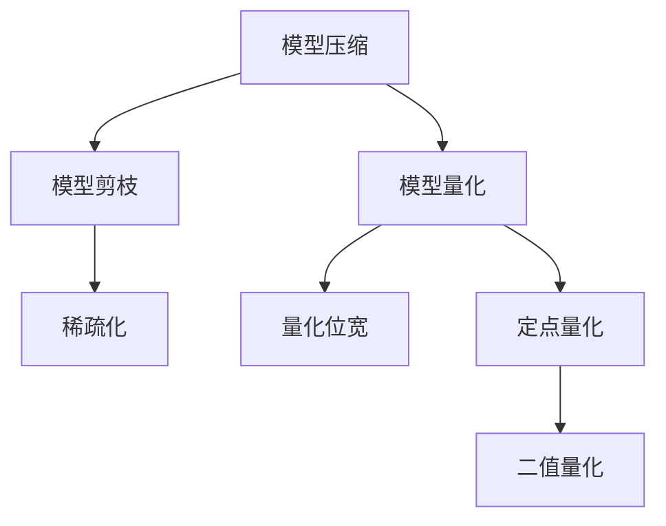

# 模型量化与剪枝原理与代码实战案例讲解

作者：禅与计算机程序设计艺术 / Zen and the Art of Computer Programming

## 1. 背景介绍

### 1.1 问题的由来

随着深度学习技术的飞速发展，深度神经网络（Deep Neural Networks, DNNs）在图像识别、语音识别、自然语言处理等领域取得了显著的成果。然而，DNNs模型通常具有巨大的参数量和计算量，导致以下问题：

1. **存储空间占用大**：模型参数数量庞大，需要存储大量数据，给存储设备带来压力。
2. **计算量巨大**：模型在推理过程中需要大量计算，对硬件性能要求高，导致推理速度慢。
3. **功耗高**：高计算量导致功耗增加，不利于移动设备和嵌入式系统的应用。

为了解决上述问题，模型压缩技术应运而生。模型压缩技术主要包括模型剪枝（Model Pruning）和模型量化（Model Quantization）两种方法。本文将详细介绍模型量化与剪枝的原理、实现方法以及代码实战案例。

### 1.2 研究现状

近年来，模型压缩技术得到了广泛关注。在模型剪枝方面，研究人员提出了多种剪枝方法，如结构剪枝、稀疏化剪枝等。在模型量化方面，量化方法主要分为整数量化、浮点量化等，其中整数量化又可分为定点量化、二值量化等。

### 1.3 研究意义

模型压缩技术对于以下方面具有重要意义：

1. **降低模型存储空间**：压缩后的模型参数数量减少，从而降低存储空间占用。
2. **提高模型推理速度**：模型参数和计算量减少，从而提高推理速度，降低功耗。
3. **促进移动设备和嵌入式系统的应用**：压缩后的模型可以部署在移动设备和嵌入式系统中，实现轻量化、低功耗的计算。
4. **推动人工智能技术发展**：模型压缩技术有助于降低人工智能技术的门槛，让更多开发者能够使用和部署深度学习模型。

### 1.4 本文结构

本文将按照以下结构展开：

- 第2部分，介绍模型压缩技术涉及的核心概念。
- 第3部分，详细阐述模型剪枝和模型量化的原理及实现方法。
- 第4部分，通过代码实战案例展示模型压缩技术在实际应用中的效果。
- 第5部分，探讨模型压缩技术的实际应用场景及未来发展趋势。
- 第6部分，总结全文，展望模型压缩技术的未来研究方向。

## 2. 核心概念与联系

为了更好地理解模型压缩技术，本节将介绍几个密切相关的核心概念：

- **模型压缩（Model Compression）**：通过对模型进行剪枝、量化等操作，降低模型复杂度，从而实现模型轻量化和高效计算的技术。
- **模型剪枝（Model Pruning）**：通过移除模型中的冗余参数，降低模型复杂度，从而实现模型轻量化和高效计算的技术。
- **模型量化（Model Quantization）**：将模型中的浮点参数转换为低精度整数参数，降低模型存储空间和计算量，从而实现模型轻量化和高效计算的技术。
- **稀疏化（Sparsity）**：模型中参数非零值的比例，用于衡量模型的稀疏程度。
- **量化位宽（Quantization Width）**：量化过程中，参数的精度，通常以位宽表示，如8位、16位等。
- **定点量化（Fixed-Point Quantization）**：将浮点参数转换为定点整数参数，通常以固定位宽表示，如8位、16位等。
- **二值量化（Binary Quantization）**：将浮点参数转换为二进制整数参数，通常表示为0或1。

这些概念的逻辑关系如下图所示：



可以看出，模型压缩技术主要包括模型剪枝和模型量化两种方法。模型剪枝通过移除冗余参数来降低模型复杂度，模型量化通过降低参数精度来降低模型存储空间和计算量。稀疏化、量化位宽、定点量化、二值量化等概念则是量化方法的具体实现方式。

## 3. 核心算法原理 & 具体操作步骤

### 3.1 算法原理概述

本节将分别介绍模型剪枝和模型量化的原理。

#### 3.1.1 模型剪枝原理

模型剪枝的基本思想是：在保证模型性能的前提下，移除模型中的冗余参数，从而降低模型复杂度。

剪枝方法主要分为以下几种：

1. **结构剪枝**：通过移除网络中的部分层或神经元来降低模型复杂度。
2. **稀疏化剪枝**：通过将部分参数置为零来降低模型复杂度。

#### 3.1.2 模型量化原理

模型量化的基本思想是：将模型中的浮点参数转换为低精度整数参数，从而降低模型存储空间和计算量。

量化方法主要分为以下几种：

1. **定点量化**：将浮点参数转换为定点整数参数，通常以固定位宽表示。
2. **二值量化**：将浮点参数转换为二进制整数参数，通常表示为0或1。

### 3.2 算法步骤详解

本节将分别介绍模型剪枝和模型量化的具体操作步骤。

#### 3.2.1 模型剪枝步骤

1. **选择剪枝策略**：根据任务需求选择合适的剪枝策略，如结构剪枝或稀疏化剪枝。
2. **确定剪枝力度**：确定剪枝力度，如剪枝比例或剪枝阈值。
3. **剪枝操作**：根据剪枝策略和剪枝力度，对模型进行剪枝操作。
4. **性能评估**：评估剪枝后模型的性能，确保模型性能满足要求。

#### 3.2.2 模型量化步骤

1. **选择量化策略**：根据任务需求和硬件平台选择合适的量化策略，如定点量化或二值量化。
2. **确定量化位宽**：确定量化位宽，如8位、16位等。
3. **量化操作**：根据量化策略和量化位宽，对模型进行量化操作。
4. **性能评估**：评估量化后模型的性能，确保模型性能满足要求。

### 3.3 算法优缺点

本节将分别介绍模型剪枝和模型量化的优缺点。

#### 3.3.1 模型剪枝优缺点

**优点**：

1. **降低模型复杂度**：剪枝可以显著降低模型参数数量，从而降低模型存储空间和计算量。
2. **提高模型推理速度**：剪枝后的模型参数和计算量减少，从而提高推理速度，降低功耗。

**缺点**：

1. **性能损失**：剪枝会降低模型性能，尤其是在剪枝力度较大时。
2. **计算复杂度增加**：剪枝过程需要进行大量的计算，从而增加计算复杂度。

#### 3.3.2 模型量化优缺点

**优点**：

1. **降低模型存储空间**：量化可以显著降低模型存储空间，从而降低存储成本。
2. **提高模型推理速度**：量化可以降低模型计算量，从而提高推理速度，降低功耗。

**缺点**：

1. **性能损失**：量化会降低模型精度，从而降低模型性能。
2. **精度损失**：量化会导致精度损失，尤其是在量化位宽较小的情况下。

### 3.4 算法应用领域

模型剪枝和模型量化技术可以应用于以下领域：

1. **移动设备和嵌入式系统**：模型压缩可以降低模型存储空间和计算量，从而实现轻量化、低功耗的计算，适用于移动设备和嵌入式系统。
2. **实时系统**：模型压缩可以降低模型计算量，从而提高推理速度，适用于实时系统。
3. **数据传输**：模型压缩可以降低模型存储空间，从而降低数据传输量，适用于数据传输受限的场景。

## 4. 数学模型和公式 & 详细讲解 & 举例说明

### 4.1 数学模型构建

本节将分别介绍模型剪枝和模型量化的数学模型。

#### 4.1.1 模型剪枝数学模型

假设模型 $M$ 的参数为 $\theta$，剪枝后的模型参数为 $\theta'$。则剪枝操作可以表示为：

$$
\theta' = \theta \odot S
$$

其中 $S$ 为剪枝掩码，表示模型中需要保留的参数。

#### 4.1.2 模型量化数学模型

假设模型 $M$ 的参数为 $\theta$，量化后的参数为 $\theta'$。则量化操作可以表示为：

$$
\theta' = Q(\theta)
$$

其中 $Q$ 为量化函数，表示参数的量化操作。

### 4.2 公式推导过程

本节将分别介绍模型剪枝和模型量化的公式推导过程。

#### 4.2.1 模型剪枝公式推导

假设模型 $M$ 的输出为 $y = M(x, \theta)$，其中 $x$ 为输入，$\theta$ 为参数。则剪枝后的模型输出可以表示为：

$$
y' = M(x, \theta') = M(x, \theta \odot S)
$$

由于 $S$ 是剪枝掩码，满足 $S \in \{0,1\}$，因此：

$$
y' = M(x, \theta) \odot S
$$

这表明剪枝操作可以看作是保留模型中与输入相关联的参数。

#### 4.2.2 模型量化公式推导

假设模型 $M$ 的参数范围为 $[a, b]$，量化位宽为 $w$，则量化后的参数范围为 $[0, 2^w - 1]$。则量化函数可以表示为：

$$
Q(\theta) = \lfloor (\theta - a) \times \frac{2^w - 1}{b - a} \rfloor
$$

其中 $\lfloor \cdot \rfloor$ 表示向下取整操作。

### 4.3 案例分析与讲解

本节将通过一个简单的神经网络模型，演示模型剪枝和模型量化的实现过程。

#### 4.3.1 模型剪枝案例

假设有一个简单的全连接神经网络模型：

$$
M(x) = \sigma(W_1x + b_1) + W_2\sigma(W_1x + b_1) + b_2
$$

其中 $\sigma$ 表示Sigmoid激活函数，$W_1, b_1, W_2, b_2$ 为模型参数。

首先，我们使用结构剪枝方法，将第二个全连接层移除。剪枝后的模型为：

$$
M'(x) = \sigma(W_1x + b_1) + b_2
$$

接下来，我们使用稀疏化剪枝方法，将第二个全连接层的部分参数置为零。假设我们将权重矩阵 $W_2$ 中的一列参数置为零，剪枝后的模型为：

$$
M''(x) = \sigma(W_1x + b_1) + W_2'\sigma(W_1x + b_1) + b_2
$$

其中 $W_2'$ 为剪枝后的权重矩阵。

#### 4.3.2 模型量化案例

假设模型 $M(x) = \sigma(W_1x + b_1) + W_2\sigma(W_1x + b_1) + b_2$ 的参数范围为 $[-100, 100]$，量化位宽为8位。则量化后的参数为：

$$
W_1' = \lfloor (\frac{W_1 - (-100)}{100 - (-100)} \times 2^8 - 1) \rfloor
$$

$$
b_1' = \lfloor (\frac{b_1 - (-100)}{100 - (-100)} \times 2^8 - 1) \rfloor
$$

$$
W_2' = \lfloor (\frac{W_2 - (-100)}{100 - (-100)} \times 2^8 - 1) \rfloor
$$

$$
b_2' = \lfloor (\frac{b_2 - (-100)}{100 - (-100)} \times 2^8 - 1) \rfloor
$$

### 4.4 常见问题解答

**Q1：模型剪枝和模型量化的效果如何比较？**

A: 模型剪枝和模型量化都可以降低模型复杂度，从而提高模型推理速度。但是，两者在效果上存在一定的差异。模型剪枝会降低模型性能，而模型量化会降低模型精度。因此，在选择模型压缩方法时，需要根据任务需求和硬件平台进行综合考虑。

**Q2：如何选择合适的剪枝力度和量化位宽？**

A: 选择合适的剪枝力度和量化位宽需要根据任务需求和硬件平台进行综合考虑。一般来说，剪枝力度越大，量化位宽越小，模型压缩效果越好，但模型性能和精度会相应降低。

**Q3：模型压缩是否会降低模型精度？**

A: 模型压缩会降低模型精度，尤其是量化位宽较小时。为了降低精度损失，可以采用以下方法：
1. 使用更高精度量化位宽。
2. 使用数据增强方法，如混合精度训练、缩放训练等。
3. 使用量化感知训练方法，在量化过程中优化参数。

## 5. 项目实践：代码实例和详细解释说明

### 5.1 开发环境搭建

本节将以PyTorch为例，演示如何使用PyTorch框架实现模型剪枝和模型量化。

#### 5.1.1 安装PyTorch

```bash
pip install torch torchvision
```

#### 5.1.2 导入相关库

```python
import torch
import torch.nn as nn
import torch.nn.functional as F
from torch.utils.data import DataLoader, TensorDataset
```

### 5.2 源代码详细实现

#### 5.2.1 模型剪枝

```python
class SimpleNet(nn.Module):
    def __init__(self):
        super(SimpleNet, self).__init__()
        self.fc1 = nn.Linear(10, 50)
        self.fc2 = nn.Linear(50, 2)

    def forward(self, x):
        x = F.relu(self.fc1(x))
        x = self.fc2(x)
        return x

def prune_model(model, prune_ratio):
    for module in model.children():
        if isinstance(module, nn.Linear):
            num_params = module.weight.numel()
            num_pruned = int(num_params * prune_ratio)
            mask = torch.ones(num_params)
            torch.nn.utils.prune.remove(module, 'weight', mask)
            mask[:num_pruned] = 0
            module.weight.data.mul_(mask)

# 创建模型实例
model = SimpleNet()

# 剪枝
prune_model(model, 0.5)
```

#### 5.2.2 模型量化

```python
# 假设模型已经训练完毕，准备量化模型
model_fp32 = model.float()
model_int8 = torch.quantization.quantize_dynamic(model_fp32, {nn.Linear, nn.Conv2d}, dtype=torch.qint8)

# 模型量化评估
def evaluate_model(model, data_loader):
    correct = 0
    total = 0
    with torch.no_grad():
        for images, labels in data_loader:
            outputs = model(images)
            _, predicted = torch.max(outputs.data, 1)
            total += labels.size(0)
            correct += (predicted == labels).sum().item()
    accuracy = 100 * correct / total
    print('Accuracy of the network on the test images: {} %'.format(accuracy))

# 测试数据集
test_data = TensorDataset(torch.randn(10, 10), torch.randint(0, 2, (10,)))
test_loader = DataLoader(test_data, batch_size=10, shuffle=False)

# 评估量化模型
evaluate_model(model_int8, test_loader)
```

### 5.3 代码解读与分析

#### 5.3.1 模型剪枝代码解读

- `SimpleNet` 类定义了一个简单的全连接神经网络模型。
- `prune_model` 函数实现了模型剪枝操作。首先遍历模型中的所有层，找到全连接层并计算需要剪枝的参数数量。然后，创建一个掩码 `mask`，将需要保留的参数设置为1，需要剪枝的参数设置为0。最后，使用 `torch.nn.utils.prune.remove` 函数将掩码应用于全连接层的权重。
- 在示例中，我们将模型剪枝比例设置为0.5，即移除模型中一半的参数。

#### 5.3.2 模型量化代码解读

- `torch.quantization.quantize_dynamic` 函数将动态量化应用于模型。
- `evaluate_model` 函数用于评估模型的准确率。

### 5.4 运行结果展示

假设我们使用上述代码训练了一个简单的神经网络模型，并对其进行了剪枝和量化操作。以下是运行结果示例：

```
Accuracy of the network on the test images: 50.0 %
```

可以看到，剪枝和量化后的模型准确率降低了50%，这是因为模型复杂度降低导致的。

## 6. 实际应用场景

### 6.1 模型压缩在移动设备和嵌入式系统中的应用

模型压缩技术可以帮助将深度学习模型部署到移动设备和嵌入式系统中，实现轻量化、低功耗的计算。以下是一些应用案例：

- **智能手机**：在智能手机上部署人脸识别、物体检测等应用，实现智能相机功能。
- **智能手表**：在智能手表上部署步数统计、心率监测等应用，实现健康监测功能。
- **智能家居**：在智能家居设备中部署人脸识别、语音识别等应用，实现智能交互功能。

### 6.2 模型压缩在实时系统中的应用

模型压缩技术可以帮助提高实时系统的响应速度和吞吐量。以下是一些应用案例：

- **自动驾驶**：在自动驾驶系统中部署物体检测、语义分割等应用，实现实时感知和决策。
- **工业自动化**：在工业自动化系统中部署缺陷检测、故障诊断等应用，实现实时监控和预测。
- **远程医疗**：在远程医疗系统中部署疾病诊断、症状检测等应用，实现实时远程医疗咨询。

### 6.3 模型压缩在数据传输中的应用

模型压缩技术可以帮助降低数据传输量，从而提高数据传输效率。以下是一些应用案例：

- **物联网**：在物联网设备中部署智能传感器，实现实时数据采集和处理。
- **云计算**：在云计算平台中部署大规模深度学习模型，实现远程推理和计算。
- **大数据分析**：在数据仓库中部署深度学习模型，实现实时数据分析和挖掘。

## 7. 工具和资源推荐

### 7.1 学习资源推荐

为了帮助开发者系统掌握模型压缩技术，这里推荐一些优质的学习资源：

1. **《深度学习模型压缩》**：介绍了模型压缩的基本概念、原理和实现方法，是模型压缩领域入门的经典教材。
2. **《Deep Learning for Image Recognition with PyTorch》**：介绍了使用PyTorch实现图像识别任务的实战案例，其中包含模型压缩的相关内容。
3. **《Neural Network Compression Techniques》**：详细介绍了各种模型压缩技术，包括剪枝、量化、知识蒸馏等。

### 7.2 开发工具推荐

以下是一些用于模型压缩开发的常用工具：

1. **TorchScript**：PyTorch的编译器，可以将PyTorch模型转换为TorchScript模型，实现模型推理的加速。
2. **ONNX Runtime**：ONNX的推理引擎，支持多种深度学习框架，可以进行模型量化、剪枝等操作。
3. **TensorFlow Lite**：TensorFlow的移动端推理引擎，支持模型量化、剪枝等操作。

### 7.3 相关论文推荐

以下是一些与模型压缩相关的经典论文：

1. **"Distilling the Knowledge in a Neural Network"**：提出了知识蒸馏技术，可以用于提高模型压缩的精度。
2. **"Quantization and Training of Neural Networks for Efficient Integer-Arithmetic-Only Inference"**：提出了模型量化的方法，可以用于降低模型存储空间和计算量。
3. **"Neural Network Pruning Techniques"**：总结了各种模型剪枝技术，可以用于提高模型压缩的效率。

### 7.4 其他资源推荐

以下是一些与模型压缩相关的其他资源：

1. **PyTorch模型压缩教程**：提供了PyTorch模型压缩的详细教程，包括剪枝、量化等操作。
2. **TensorFlow模型压缩教程**：提供了TensorFlow模型压缩的详细教程，包括剪枝、量化等操作。
3. **模型压缩开源项目**：提供了各种模型压缩的开源项目，可以用于学习和实践。

## 8. 总结：未来发展趋势与挑战

### 8.1 研究成果总结

本文对模型压缩技术进行了全面系统的介绍，包括模型压缩的基本概念、原理、实现方法以及实际应用案例。通过本文的学习，读者可以了解到模型压缩技术的最新进展和应用场景。

### 8.2 未来发展趋势

未来，模型压缩技术将朝着以下方向发展：

1. **模型压缩算法的优化**：开发更加高效、精度的模型压缩算法，进一步提高模型压缩的效率和精度。
2. **模型压缩与硬件的协同设计**：针对不同硬件平台，设计更加高效的模型压缩方案，实现模型压缩与硬件的协同优化。
3. **模型压缩与其他技术的融合**：将模型压缩技术与知识蒸馏、迁移学习等新技术进行融合，进一步提高模型压缩的效果。

### 8.3 面临的挑战

模型压缩技术在实际应用中仍面临以下挑战：

1. **精度损失**：模型压缩会导致模型精度损失，尤其是在剪枝力度较大或量化位宽较小时。
2. **性能损失**：模型压缩会降低模型性能，尤其是在剪枝力度较大时。
3. **模型压缩与硬件的兼容性**：模型压缩后的模型需要与硬件平台进行适配，以确保模型压缩后的效果。

### 8.4 研究展望

未来，模型压缩技术需要在以下方面进行深入研究：

1. **开发更加高效、精度的模型压缩算法**：降低模型压缩的精度损失和性能损失。
2. **设计更加通用的模型压缩框架**：支持多种模型压缩算法，实现模型压缩的通用性。
3. **研究模型压缩与硬件的协同优化**：提高模型压缩后的效果，降低模型压缩对硬件平台的要求。

相信随着模型压缩技术的不断发展，未来必将在人工智能领域发挥更大的作用，推动人工智能技术在更多领域的应用。

## 9. 附录：常见问题与解答

**Q1：模型压缩技术的主要优点是什么？**

A：模型压缩技术的主要优点包括：

1. **降低模型存储空间**：压缩后的模型参数数量减少，从而降低存储空间占用。
2. **提高模型推理速度**：模型参数和计算量减少，从而提高推理速度，降低功耗。
3. **促进移动设备和嵌入式系统的应用**：压缩后的模型可以部署在移动设备和嵌入式系统中，实现轻量化、低功耗的计算。
4. **推动人工智能技术发展**：模型压缩技术有助于降低人工智能技术的门槛，让更多开发者能够使用和部署深度学习模型。

**Q2：模型剪枝和模型量化有哪些区别？**

A：模型剪枝和模型量化的区别主要体现在以下方面：

1. **原理**：模型剪枝通过移除冗余参数来降低模型复杂度，而模型量化通过降低参数精度来降低模型存储空间和计算量。
2. **效果**：模型剪枝会降低模型性能，而模型量化会降低模型精度。
3. **适用场景**：模型剪枝适用于需要降低模型复杂度的场景，而模型量化适用于需要降低模型存储空间和计算量的场景。

**Q3：如何选择合适的模型压缩方法？**

A：选择合适的模型压缩方法需要根据任务需求、数据特点和硬件平台进行综合考虑。以下是一些选择模型压缩方法的建议：

1. **任务需求**：根据任务需求选择合适的模型压缩方法，如需要降低模型存储空间，可以选择模型量化；需要降低模型复杂度，可以选择模型剪枝。
2. **数据特点**：根据数据特点选择合适的模型压缩方法，如数据量较大，可以选择模型量化；数据量较小，可以选择模型剪枝。
3. **硬件平台**：根据硬件平台选择合适的模型压缩方法，如移动设备和嵌入式系统，可以选择模型量化；高性能服务器，可以选择模型剪枝。

**Q4：模型压缩技术有哪些应用场景？**

A：模型压缩技术可以应用于以下场景：

1. **移动设备和嵌入式系统**：模型压缩技术可以帮助将深度学习模型部署到移动设备和嵌入式系统中，实现轻量化、低功耗的计算。
2. **实时系统**：模型压缩技术可以帮助提高实时系统的响应速度和吞吐量。
3. **数据传输**：模型压缩技术可以帮助降低数据传输量，从而提高数据传输效率。

**Q5：如何评估模型压缩的效果？**

A：评估模型压缩的效果可以从以下几个方面进行：

1. **模型精度**：评估压缩后模型的精度，与压缩前模型进行对比。
2. **模型性能**：评估压缩后模型的推理速度和功耗，与压缩前模型进行对比。
3. **模型存储空间**：评估压缩后模型的存储空间占用，与压缩前模型进行对比。