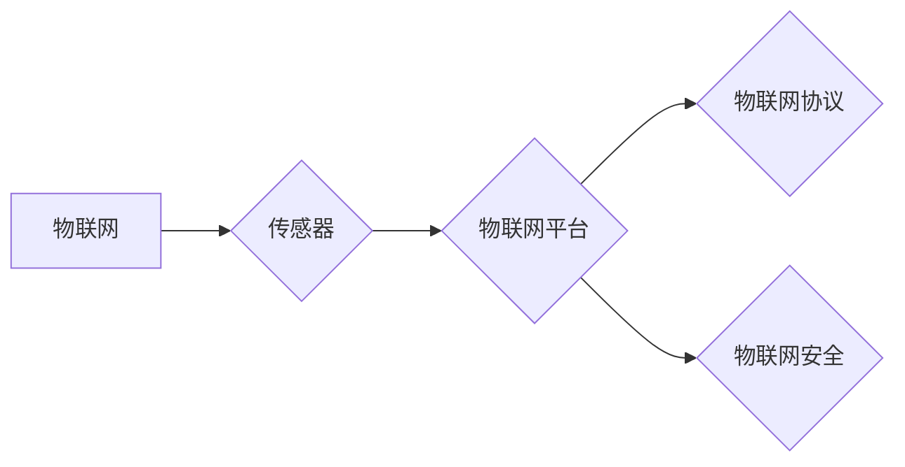

# 物联网(IoT)技术和各种传感器设备的集成：概要与基础

## 1. 背景介绍
### 1.1 问题的由来

随着信息技术的飞速发展，物联网（Internet of Things，IoT）已经成为全球性的技术趋势。物联网通过将各种物体连接到互联网，实现设备之间的信息交换和远程控制，为我们的生活、工业和城市建设带来了极大的便利。而传感器作为物联网的“感官器官”，负责收集环境信息，是物联网技术实现的关键。

然而，物联网系统中涉及到的传感器种类繁多，包括温度、湿度、压力、光照、声音、气味、位置等各种类型的传感器。如何对这些传感器进行有效的集成和管理，实现数据的高效传输和处理，是物联网技术发展过程中亟待解决的问题。

### 1.2 研究现状

目前，物联网传感器集成技术已经取得了长足的进步，主要表现在以下几个方面：

1. 传感器技术：各类新型传感器层出不穷，性能不断提升，逐渐满足不同场景的应用需求。
2. 物联网通信技术：从早期的有线通信、蓝牙、ZigBee，到现在的Wi-Fi、NFC、LoRa等，通信技术日趋成熟，满足不同距离、速率和功耗要求。
3. 云计算和大数据技术：为物联网数据存储、处理和分析提供了强大的技术支撑。
4. 物联网平台：提供设备管理、数据采集、处理、分析和可视化等功能，简化物联网应用开发。

### 1.3 研究意义

物联网传感器集成技术的研究具有以下意义：

1. 提高物联网系统的可靠性和稳定性，降低系统故障率。
2. 优化资源利用，降低能耗，提高系统性价比。
3. 提升数据处理和分析效率，为物联网应用提供更精准的数据支持。
4. 促进物联网技术的广泛应用，推动智慧城市建设、智能家居、工业自动化等领域的发展。

### 1.4 本文结构

本文将从以下几个方面对物联网传感器集成技术进行介绍：

- 核心概念与联系
- 核心算法原理与具体操作步骤
- 数学模型和公式
- 项目实践
- 实际应用场景
- 工具和资源推荐
- 总结：未来发展趋势与挑战

## 2. 核心概念与联系

### 2.1 物联网

物联网是指通过信息传感设备，将各种物体连接到互联网进行信息交换和通信，实现智能化识别、定位、追踪、监控和管理的技术。

### 2.2 传感器

传感器是一种能够感知和测量外界信息并将其转换为电信号或其他形式输出信号的装置。根据其感知信息类型的不同，可分为温度、湿度、压力、光照、声音、气味、位置等众多类型。

### 2.3 物联网平台

物联网平台是连接设备、数据和应用的服务平台，提供设备管理、数据采集、处理、分析和可视化等功能。

### 2.4 物联网协议

物联网协议是指用于设备之间通信的规则和标准，主要包括Wi-Fi、蓝牙、ZigBee、NFC、LoRa等。

### 2.5 物联网安全

物联网安全是指保护物联网设备、数据和应用免受攻击和泄露的一系列技术和措施。

这些核心概念之间存在着紧密的联系，共同构成了物联网传感器集成技术的理论基础。以下是它们的逻辑关系图：



## 3. 核心算法原理 & 具体操作步骤

### 3.1 算法原理概述

物联网传感器集成技术主要包括以下算法：

1. 数据采集算法：负责从传感器设备采集数据，并进行初步处理。
2. 数据传输算法：负责将采集到的数据传输到服务器或云平台。
3. 数据处理算法：负责对采集到的数据进行清洗、转换和分析。
4. 数据可视化算法：负责将处理后的数据以可视化的形式呈现。

### 3.2 算法步骤详解

1. **数据采集**：通过传感器设备收集环境信息，如温度、湿度、光照等。根据传感器类型和采集需求，选择合适的数据采集方法，如模拟信号采集、数字信号采集等。
2. **数据传输**：将采集到的数据通过无线或有线方式传输到服务器或云平台。常用的传输方式包括Wi-Fi、蓝牙、ZigBee、NFC、LoRa等。
3. **数据处理**：对采集到的数据进行清洗、去噪、转换等预处理，再进行特征提取、分类、聚类等分析。
4. **数据可视化**：将处理后的数据以图表、地图、曲线等形式呈现，便于用户直观地了解环境信息。

### 3.3 算法优缺点

1. **数据采集算法**：优点是能够快速、准确地采集数据；缺点是受传感器类型和性能限制，可能存在数据噪声和误差。
2. **数据传输算法**：优点是传输速度快、稳定性高；缺点是功耗较大，对无线信道质量要求较高。
3. **数据处理算法**：优点是能够提取出有价值的信息，为决策提供支持；缺点是算法复杂度较高，对计算资源要求较高。
4. **数据可视化算法**：优点是便于用户直观地了解数据；缺点是可视化效果受限于算法和工具。

### 3.4 算法应用领域

物联网传感器集成技术在以下领域有广泛的应用：

- 智能家居：实时监测家庭环境，如温度、湿度、光照等，实现智能家居设备的远程控制和能源管理。
- 智慧城市：监测城市环境、交通、安防等，提高城市管理效率和居民生活质量。
- 工业自动化：实时监测生产线上的各种参数，实现生产过程的自动化控制。
- 农业物联网：实时监测农作物生长环境，提高农业生产效率。

## 4. 数学模型和公式 & 详细讲解 & 举例说明

### 4.1 数学模型构建

物联网传感器集成技术涉及到的数学模型主要包括：

1. **传感器模型**：描述传感器输出与输入之间的关系，如线性模型、非线性模型等。
2. **数据传输模型**：描述数据在无线信道上的传播和衰减，如瑞利衰落模型、对数正态衰落模型等。
3. **数据处理模型**：描述数据预处理、特征提取、分类、聚类等操作，如SVM、K-means、决策树等。

### 4.2 公式推导过程

以下以线性传感器模型为例，介绍其公式推导过程：

假设传感器输出为 $y$，输入为 $x$，则线性传感器模型可表示为：

$$
y = ax + b
$$

其中 $a$ 为传感器的灵敏度，$b$ 为传感器偏移。

通过最小二乘法拟合传感器输出数据，可得：

$$
a = \frac{\sum_{i=1}^n(x_i - \bar{x})(y_i - \bar{y})}{\sum_{i=1}^n(x_i - \bar{x})^2}
$$

$$
b = \bar{y} - a\bar{x}
$$

其中 $\bar{x}$ 和 $\bar{y}$ 分别为输入和输出的均值。

### 4.3 案例分析与讲解

以下以智能家居场景为例，介绍物联网传感器集成技术的应用。

**场景**：用户希望实时监测家中温度、湿度、光照等环境参数，并通过手机APP远程控制空调、加湿器等设备。

**解决方案**：

1. **数据采集**：使用温度传感器、湿度传感器和光照传感器采集家中环境数据。
2. **数据传输**：通过Wi-Fi将传感器数据传输到云平台。
3. **数据处理**：对采集到的数据进行预处理，如滤波、去噪等，然后进行特征提取，如提取温度、湿度、光照的均值、方差等。
4. **数据可视化**：通过手机APP将处理后的数据以图表形式呈现。
5. **设备控制**：通过手机APP远程控制家中的空调、加湿器等设备，如设置温度、湿度、光照等参数。

### 4.4 常见问题解答

**Q1：如何选择合适的传感器？**

A：选择传感器时需要考虑以下因素：

- 传感器的测量范围、精度和分辨率是否满足需求
- 传感器的功耗、体积和成本是否在预算范围内
- 传感器的接口类型是否与系统兼容
- 传感器的抗干扰能力和可靠性

**Q2：如何保证数据传输的可靠性？**

A：为了保证数据传输的可靠性，可以采取以下措施：

- 选择合适的通信协议，如Wi-Fi、蓝牙、ZigBee等
- 采用数据加密技术，防止数据被非法窃取
- 设置数据传输的校验和，确保数据完整性
- 采用冗余传输技术，如重复发送、确认应答等

**Q3：如何处理大量传感器数据？**

A：对于大量传感器数据，可以采取以下措施：

- 对数据进行压缩和筛选，去除冗余信息
- 利用大数据技术进行数据存储和分析
- 采用分布式计算技术，提高数据处理速度

## 5. 项目实践：代码实例和详细解释说明

### 5.1 开发环境搭建

1. 安装Python环境
2. 安装必要的库，如PyTorch、TensorFlow、scikit-learn等
3. 准备开发工具，如Jupyter Notebook、PyCharm等

### 5.2 源代码详细实现

以下以Python语言为例，介绍物联网传感器集成技术的代码实现。

```python
# 导入必要的库
import requests
from sklearn.preprocessing import StandardScaler

# 传感器数据采集
def collect_data(sensor_id):
    url = f"http://sensor_server_ip:port/data?sensor_id={sensor_id}"
    response = requests.get(url)
    data = response.json()
    return data['value']

# 数据处理
def process_data(data):
    scaler = StandardScaler()
    processed_data = scaler.fit_transform([data])
    return processed_data

# 数据可视化
import matplotlib.pyplot as plt

def plot_data(data):
    plt.plot(data)
    plt.xlabel("Time")
    plt.ylabel("Value")
    plt.show()

# 主函数
if __name__ == "__main__":
    sensor_id = 1
    data = collect_data(sensor_id)
    processed_data = process_data(data)
    plot_data(processed_data)
```

### 5.3 代码解读与分析

- `collect_data`函数用于从传感器服务器获取数据。
- `process_data`函数用于对采集到的数据进行处理，例如数据标准化。
- `plot_data`函数用于将处理后的数据以图表形式展示。
- 主函数`__main__`用于实现数据的采集、处理和可视化。

### 5.4 运行结果展示

运行上述代码，将展示传感器采集到的数据图表。

## 6. 实际应用场景

### 6.1 智能家居

智能家居是物联网传感器集成技术的重要应用场景之一。通过集成温度、湿度、光照、声音、气味等传感器，实现家庭环境的智能控制和监测，提高生活品质。

### 6.2 智慧城市

智慧城市通过集成各类传感器，实时监测城市基础设施、交通、环境等，提高城市管理效率和居民生活质量。

### 6.3 工业自动化

工业自动化通过集成温度、湿度、压力、流量等传感器，实现生产过程的自动化控制，提高生产效率和产品质量。

### 6.4 农业物联网

农业物联网通过集成土壤、气候、病虫害等传感器，实现农业生产过程的智能化管理，提高农业生产效率和产量。

## 7. 工具和资源推荐

### 7.1 学习资源推荐

1. 《物联网技术基础》
2. 《物联网应用开发实战》
3. 《Python编程：从入门到实践》
4. 《机器学习实战》

### 7.2 开发工具推荐

1. Arduino：开源硬件平台，用于传感器采集和设备控制。
2. Raspberry Pi：低成本、低功耗的单板计算机，用于物联网系统开发。
3. Node-RED：用于物联网数据可视化和编程的工具。
4. ThingsBoard：开源物联网平台，提供设备管理、数据采集、处理和分析等功能。

### 7.3 相关论文推荐

1. "Internet of Things: A Survey"
2. "The Internet of Things: A Survey of Enabling Technologies, Protocols, and Applications"
3. "An Overview of the Internet of Things: Architecture, Enabling Technologies, Security, and Privacy, and Applications"
4. "A Survey of Security and Privacy in the Internet of Things"

### 7.4 其他资源推荐

1. 物联网技术社区
2. 物联网技术论坛
3. 物联网技术博客
4. 物联网技术标准

## 8. 总结：未来发展趋势与挑战

### 8.1 研究成果总结

本文对物联网传感器集成技术进行了全面的介绍，包括核心概念、算法原理、项目实践和实际应用场景。通过本文的学习，读者可以掌握物联网传感器集成技术的基本知识，并了解其发展趋势和应用前景。

### 8.2 未来发展趋势

1. 传感器技术将向小型化、低功耗、低成本方向发展。
2. 物联网通信技术将向高速、低时延、高可靠性方向发展。
3. 物联网平台将向开放、协同、智能化方向发展。
4. 物联网安全将得到更多关注，实现更加安全可靠的应用。

### 8.3 面临的挑战

1. 传感器数据的安全和隐私保护。
2. 数据存储和传输的高效性。
3. 模型复杂度和计算资源消耗。
4. 跨领域、跨平台、跨系统的协同。

### 8.4 研究展望

物联网传感器集成技术在未来将面临更多挑战和机遇。通过不断技术创新和产业协同，相信物联网技术将为人类社会带来更加美好的未来。

## 9. 附录：常见问题与解答

**Q1：什么是物联网？**

A：物联网是指通过信息传感设备，将各种物体连接到互联网进行信息交换和通信，实现智能化识别、定位、追踪、监控和管理的技术。

**Q2：什么是传感器？**

A：传感器是一种能够感知和测量外界信息并将其转换为电信号或其他形式输出信号的装置。

**Q3：物联网传感器集成技术有哪些应用场景？**

A：物联网传感器集成技术在智能家居、智慧城市、工业自动化、农业物联网等领域有广泛的应用。

**Q4：如何选择合适的传感器？**

A：选择传感器时需要考虑传感器的测量范围、精度、分辨率、功耗、体积、成本、接口类型、抗干扰能力和可靠性等因素。

**Q5：如何保证数据传输的可靠性？**

A：为了保证数据传输的可靠性，可以采取选择合适的通信协议、数据加密、数据校验、冗余传输等措施。

**Q6：如何处理大量传感器数据？**

A：对于大量传感器数据，可以采取数据压缩、筛选、存储、分析和可视化等措施。

**Q7：物联网传感器集成技术未来的发展趋势是什么？**

A：物联网传感器集成技术未来的发展趋势包括传感器技术小型化、低功耗、低成本，物联网通信技术高速、低时延、高可靠性，物联网平台开放、协同、智能化，以及物联网安全更加关注等方面。

**Q8：物联网传感器集成技术面临的挑战有哪些？**

A：物联网传感器集成技术面临的挑战包括数据安全和隐私保护、数据存储和传输的高效性、模型复杂度和计算资源消耗、跨领域、跨平台、跨系统的协同等方面。

**Q9：物联网传感器集成技术有哪些学习资源推荐？**

A：学习物联网传感器集成技术，可以参考以下资源：

- 《物联网技术基础》
- 《物联网应用开发实战》
- 《Python编程：从入门到实践》
- 《机器学习实战》

**Q10：物联网传感器集成技术有哪些开发工具推荐？**

A：物联网传感器集成技术常用的开发工具有：

- Arduino
- Raspberry Pi
- Node-RED
- ThingsBoard

作者：禅与计算机程序设计艺术 / Zen and the Art of Computer Programming