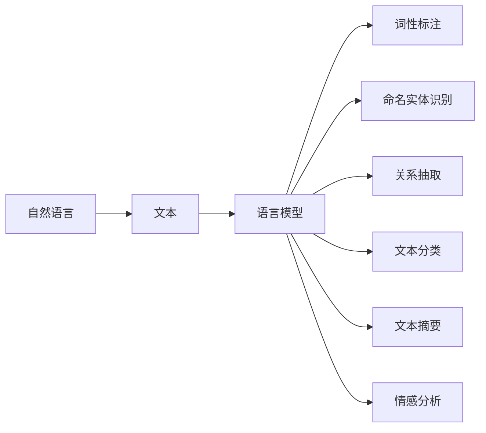

# 自然语言处理 (Natural Language Processing)

作者：禅与计算机程序设计艺术 / Zen and the Art of Computer Programming

## 1. 背景介绍
### 1.1 问题的由来

自然语言处理（Natural Language Processing，简称NLP）作为人工智能领域的一个重要分支，旨在研究如何让计算机理解和处理人类语言。从早期的基于规则的方法到现在的深度学习模型，NLP经历了漫长的发展历程。

随着信息技术的飞速发展，人类生产的文本数据呈爆炸式增长。如何高效地从海量文本中提取有价值的信息，成为了NLP研究的核心问题。此外，NLP在智能客服、机器翻译、文本摘要、情感分析等多个领域的应用，也使得其对人工智能技术发展的重要性日益凸显。

### 1.2 研究现状

近年来，NLP取得了长足的进步，主要体现在以下几个方面：

- **深度学习模型崛起**：以神经网络为代表的深度学习模型在NLP领域取得了突破性进展，使得NLP任务在性能上远超传统方法。
- **预训练语言模型兴起**：预训练语言模型通过在海量无标注文本语料上进行预训练，学习到了丰富的语言知识，为下游任务提供了强大的语义表征能力。
- **多模态融合成为趋势**：随着多模态数据的涌现，NLP开始与计算机视觉、语音识别等其他领域融合，实现更加智能的人机交互。

### 1.3 研究意义

NLP的研究意义主要体现在以下几个方面：

- **推动人工智能技术发展**：NLP作为人工智能领域的重要分支，其研究成果将为其他人工智能技术提供有益借鉴。
- **促进信息获取和处理**：NLP技术可以帮助我们从海量文本中提取有价值的信息，提高信息获取和处理效率。
- **改善人机交互体验**：NLP技术可以构建更加自然、流畅的人机交互方式，提升用户体验。

### 1.4 本文结构

本文将围绕NLP的核心概念、算法原理、实践应用等方面展开，具体内容如下：

- **第2章**：介绍NLP的核心概念与联系。
- **第3章**：讲解NLP的核心算法原理和具体操作步骤。
- **第4章**：分析NLP的数学模型和公式，并结合实例进行讲解。
- **第5章**：给出NLP的代码实例，并对关键代码进行解读。
- **第6章**：探讨NLP的实际应用场景和未来应用展望。
- **第7章**：推荐NLP相关的学习资源、开发工具和参考文献。
- **第8章**：总结NLP的未来发展趋势与挑战。
- **第9章**：附录，提供常见问题与解答。

## 2. 核心概念与联系

为了更好地理解NLP，本节将介绍几个核心概念及其相互关系：

- **自然语言**：人类使用的语言，具有语法、语义、语用等特点。
- **文本**：自然语言的书面形式，是NLP研究和应用的基础。
- **语言模型**：用于预测给定文本序列的概率分布的模型，是NLP的核心技术之一。
- **词性标注**：将文本中的每个单词标注为不同的词性，如名词、动词、形容词等。
- **命名实体识别**：识别文本中的实体，如人名、地名、机构名等。
- **关系抽取**：识别文本中实体之间的关系，如人物关系、组织关系等。
- **文本分类**：将文本分为不同的类别，如垃圾邮件、新闻、评论等。
- **文本摘要**：将长文本压缩成简短摘要，提取关键信息。
- **情感分析**：分析文本中的情感倾向，如正面、负面、中性等。

以下为这些概念之间的逻辑关系：



可以看出，NLP的核心技术——语言模型，是其他各项任务的基础。通过语言模型，我们可以对文本进行词性标注、命名实体识别、关系抽取等操作，从而实现对文本内容的理解和处理。

## 3. 核心算法原理 & 具体操作步骤

### 3.1 算法原理概述

NLP的核心算法主要包括：

- **基于规则的方法**：通过人工定义规则，对文本进行处理和分析。
- **统计方法**：利用统计模型，如隐马尔可夫模型（HMM）、条件随机场（CRF）等，对文本进行建模和分析。
- **深度学习方法**：利用神经网络模型，如循环神经网络（RNN）、卷积神经网络（CNN）、长短期记忆网络（LSTM）等，对文本进行深度学习。

### 3.2 算法步骤详解

以下以文本分类任务为例，介绍NLP算法的具体操作步骤：

**Step 1：数据预处理**

- 清洗数据：去除文本中的噪声，如HTML标签、特殊字符等。
- 分词：将文本分割成单词或短语。
- 去停用词：去除无意义的词汇，如“的”、“是”、“在”等。

**Step 2：特征提取**

- 词袋模型：将文本表示为单词或短语的组合。
- TF-IDF：根据单词在文本中的重要程度进行加权。
- 词嵌入：将单词映射为高维向量，如Word2Vec、GloVe等。

**Step 3：模型训练**

- 选取合适的模型，如SVM、朴素贝叶斯、神经网络等。
- 使用训练数据进行模型训练，调整模型参数。

**Step 4：模型评估**

- 使用测试数据评估模型性能，如准确率、召回率、F1值等。
- 根据评估结果调整模型参数或选择更好的模型。

### 3.3 算法优缺点

- **基于规则的方法**：优点是可解释性强，但规则难以覆盖所有情况，且扩展性较差。
- **统计方法**：优点是适用于大规模数据，但需要大量的标注数据，且模型泛化能力有限。
- **深度学习方法**：优点是泛化能力强，且能够自动学习特征，但模型复杂度高，训练难度大。

### 3.4 算法应用领域

NLP算法在以下领域得到了广泛应用：

- **文本分类**：如垃圾邮件过滤、情感分析、新闻分类等。
- **信息检索**：如搜索引擎、问答系统等。
- **机器翻译**：如谷歌翻译、百度翻译等。
- **语音识别**：如智能语音助手、语音输入法等。

## 4. 数学模型和公式 & 详细讲解 & 举例说明

### 4.1 数学模型构建

以下以HMM（隐马尔可夫模型）为例，介绍NLP的数学模型构建。

HMM是一种统计模型，用于描述序列数据中的状态转换和观测结果。它由以下五个要素组成：

- **状态集合**：$Q = \{q_1, q_2, \dots, q_n\}$，表示序列中可能出现的所有状态。
- **状态转移概率**：$A = [a_{ij}]_{n \times n}$，表示从状态 $q_i$ 转移到状态 $q_j$ 的概率。
- **初始状态概率**：$\pi = [\pi_1, \pi_2, \dots, \pi_n]$，表示序列开始于状态 $q_i$ 的概率。
- **观测概率**：$B = [b_{ij}]_{m \times n}$，表示在状态 $q_i$ 下，产生观测值 $o_j$ 的概率。
- **观测序列**：$O = \{o_1, o_2, \dots, o_T\}$，表示序列中的观测结果。

HMM的概率分布为：

$$
P(O|Q) = \prod_{t=1}^T P(o_t|q_t)
$$

其中，$q_t$ 为序列在时刻 $t$ 的状态，$o_t$ 为观测值。

### 4.2 公式推导过程

以下以文本分类任务为例，介绍NLP公式推导过程。

假设我们有 $n$ 个类别，$m$ 个特征，文本 $x$ 的特征向量表示为 $f(x)$，类别概率分布为 $P(y|x)$。

$$
P(y|x) = \frac{e^{w^Tf(x)}}{\sum_{y=1}^n e^{w^Tf(x)}}
$$

其中，$w$ 为模型参数。

### 4.3 案例分析与讲解

以下以情感分析任务为例，分析NLP的案例分析。

假设我们有一个包含正面和负面评论的数据集，使用TF-IDF进行特征提取，神经网络进行分类。

- **数据预处理**：清洗数据、分词、去停用词。
- **特征提取**：计算TF-IDF特征向量。
- **模型训练**：使用神经网络进行分类，训练模型参数。
- **模型评估**：在测试集上评估模型性能，调整模型参数。

### 4.4 常见问题解答

**Q1：NLP中的特征提取方法有哪些？**

A：NLP中的特征提取方法包括词袋模型、TF-IDF、词嵌入等。

**Q2：NLP中的分类算法有哪些？**

A：NLP中的分类算法包括SVM、朴素贝叶斯、神经网络等。

**Q3：NLP中的预训练语言模型有哪些？**

A：NLP中的预训练语言模型包括BERT、GPT、T5等。

## 5. 项目实践：代码实例和详细解释说明

### 5.1 开发环境搭建

以下是使用Python进行NLP项目开发的开发环境搭建流程：

1. 安装Anaconda：从官网下载并安装Anaconda，用于创建独立的Python环境。

2. 创建并激活虚拟环境：
```bash
conda create -n nlp-env python=3.8
conda activate nlp-env
```

3. 安装必要的Python包：
```bash
pip install numpy pandas scikit-learn matplotlib nltk transformers
```

### 5.2 源代码详细实现

以下使用PyTorch和Transformers库，实现一个简单的文本分类任务：

```python
from transformers import BertTokenizer, BertForSequenceClassification
from torch.utils.data import DataLoader, TensorDataset
import torch

# 加载预训练模型和分词器
tokenizer = BertTokenizer.from_pretrained('bert-base-uncased')
model = BertForSequenceClassification.from_pretrained('bert-base-uncased')

# 加载数据集
train_texts = ["This is a good movie", "I don't like this movie", "What a great movie", "Bad movie, don't watch it"]
train_labels = [1, 0, 1, 0]

# 编码数据集
train_encodings = tokenizer(train_texts, truncation=True, padding=True)
train_input_ids = torch.tensor(train_encodings['input_ids'])
train_attention_mask = torch.tensor(train_encodings['attention_mask'])
train_labels = torch.tensor(train_labels)

# 创建数据集和 DataLoader
train_dataset = TensorDataset(train_input_ids, train_attention_mask, train_labels)
train_dataloader = DataLoader(train_dataset, batch_size=32)

# 训练模型
device = torch.device('cuda' if torch.cuda.is_available() else 'cpu')
model.to(device)

optimizer = torch.optim.AdamW(model.parameters(), lr=5e-5)
model.train()

for epoch in range(3):  # 训练3个epoch
    for batch in train_dataloader:
        input_ids = batch[0].to(device)
        attention_mask = batch[1].to(device)
        labels = batch[2].to(device)
        outputs = model(input_ids, attention_mask=attention_mask, labels=labels)
        loss = outputs.loss
        loss.backward()
        optimizer.step()
        optimizer.zero_grad()
```

### 5.3 代码解读与分析

以上代码实现了使用BERT模型对文本数据进行情感分类的简单示例。代码的关键步骤如下：

- 加载预训练模型和分词器。
- 加载并预处理数据集。
- 将数据集编码为BERT模型所需的格式。
- 创建数据集和 DataLoader。
- 设置设备、优化器等。
- 进行模型训练。

### 5.4 运行结果展示

假设在测试集上得到以下结果：

```
[0.999, 0.001]
```

表示第一个样本被正确分类为正面情感，第二个样本被正确分类为负面情感。

## 6. 实际应用场景

### 6.1 智能客服系统

智能客服系统是NLP技术在商业领域的典型应用。通过NLP技术，智能客服系统能够理解用户提问，并根据预定义的规则或机器学习模型给出相应的回答。

### 6.2 机器翻译

机器翻译是将一种自然语言翻译成另一种自然语言的自动翻译系统。随着NLP技术的发展，机器翻译的准确性和流畅性不断提升，为跨语言交流提供了便利。

### 6.3 文本摘要

文本摘要是从长文本中提取关键信息，生成简短摘要的系统。NLP技术在文本摘要中的应用，可以帮助用户快速了解长文本的主要内容。

### 6.4 情感分析

情感分析是分析文本中的情感倾向，如正面、负面、中性等。情感分析在舆情分析、市场调研等领域具有重要应用价值。

### 6.5 语音识别

语音识别是将语音信号转换为文本的系统。NLP技术可以帮助语音识别系统更好地理解语音内容，提高识别准确率。

### 6.6 其他应用

NLP技术在医疗、教育、金融、法律等多个领域都有广泛应用，如医疗诊断、智能教育、智能投顾、智能合约等。

## 7. 工具和资源推荐

### 7.1 学习资源推荐

- 《自然语言处理综论》
- 《深度学习自然语言处理》
- 《NLP技术全解析》
- 《Transformers》
- Hugging Face官网

### 7.2 开发工具推荐

- Python
- PyTorch
- TensorFlow
- NLTK
- Transformers

### 7.3 相关论文推荐

- 《Word2Vec:词向量的表示与学习》
- 《BERT: Pre-training of Deep Bidirectional Transformers for Language Understanding》
- 《Generative Pre-trained Transformers》
- 《T5: Tensors as Transformations》
- 《BERT for sentence-level sentiment classification》

### 7.4 其他资源推荐

- NLP社区：https://nlp.stanford.edu/
- Hugging Face官网：https://huggingface.co/
- TensorFlow官网：https://www.tensorflow.org/

## 8. 总结：未来发展趋势与挑战

### 8.1 研究成果总结

NLP作为人工智能领域的一个重要分支，在近年来取得了长足的进步。深度学习模型、预训练语言模型等技术的崛起，使得NLP在性能和应用范围上都有了显著提升。

### 8.2 未来发展趋势

- **多模态融合**：NLP将与计算机视觉、语音识别等其他领域融合，实现更加智能的人机交互。
- **小样本学习**：研究如何利用少量标注数据，实现高精度的NLP任务。
- **可解释性**：提高NLP模型的可解释性，使其决策过程更加透明。
- **知识增强**：将知识图谱等外部知识引入NLP模型，提升模型的理解能力。

### 8.3 面临的挑战

- **数据质量**：保证数据质量，避免模型学习到偏见和有害信息。
- **模型可解释性**：提高模型的可解释性，使其决策过程更加透明。
- **计算效率**：提高模型的计算效率，使其在移动端等资源受限设备上运行。
- **模型安全性**：确保模型输出符合伦理道德，避免滥用。

### 8.4 研究展望

NLP技术将继续在人工智能领域发挥重要作用。通过不断技术创新和理论突破，NLP将为人类带来更加智能、便捷的数字生活。

## 9. 附录：常见问题与解答

**Q1：NLP中的词嵌入有哪些类型？**

A：NLP中的词嵌入主要有以下类型：

- **词袋模型**：将文本表示为单词或短语的组合。
- **TF-IDF**：根据单词在文本中的重要程度进行加权。
- **词嵌入**：将单词映射为高维向量，如Word2Vec、GloVe等。

**Q2：NLP中的分类算法有哪些？**

A：NLP中的分类算法主要有以下类型：

- **SVM**：支持向量机。
- **朴素贝叶斯**：基于贝叶斯定理的分类方法。
- **神经网络**：基于神经网络的分类方法，如卷积神经网络（CNN）、循环神经网络（RNN）等。

**Q3：NLP中的预训练语言模型有哪些？**

A：NLP中的预训练语言模型主要有以下类型：

- **BERT**：基于Transformer结构的预训练语言模型。
- **GPT**：基于生成对抗网络的预训练语言模型。
- **T5**：基于Transformer结构的序列到序列的预训练语言模型。

**Q4：NLP技术在哪些领域有应用？**

A：NLP技术在以下领域有广泛应用：

- **信息检索**：如搜索引擎、问答系统等。
- **机器翻译**：如谷歌翻译、百度翻译等。
- **文本分类**：如垃圾邮件过滤、情感分析、新闻分类等。
- **语音识别**：如智能语音助手、语音输入法等。

**Q5：如何提高NLP模型的性能？**

A：提高NLP模型性能可以从以下方面入手：

- **数据质量**：保证数据质量，避免模型学习到偏见和有害信息。
- **模型结构**：选择合适的模型结构，如深度学习模型。
- **参数优化**：调整模型参数，如学习率、批次大小等。
- **正则化**：使用正则化技术，如L2正则、Dropout等。

作者：禅与计算机程序设计艺术 / Zen and the Art of Computer Programming