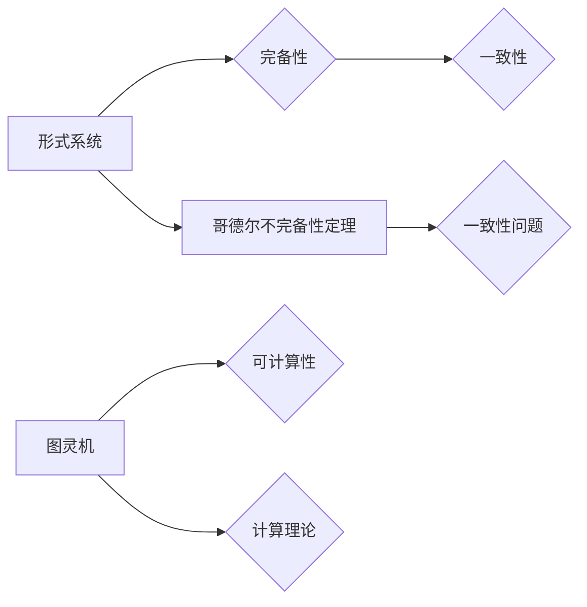

# 计算：第三部分 计算理论的形成 第 6 章 计算理论的奠基：希尔伯特进路 数学的无冕之王

## 1. 背景介绍
### 1.1 问题的由来

20世纪初，数学家们面临着一系列深层次的问题，这些问题涉及数学的根基、逻辑的一致性以及数学公理的完备性。在这个背景下，希尔伯特提出了著名的“希尔伯特23问题”，这些问题涵盖了逻辑、数学基础、数论、代数、几何和物理等多个领域，旨在推动数学和逻辑学的进一步发展。

其中，第一个问题就是“判定问题”，即对于一个给定的数学命题，是否可以判定其真伪？这一问题的提出，标志着计算理论的形成和计算机科学的诞生。

### 1.2 研究现状

在希尔伯特提出“判定问题”之后，数学家和逻辑学家们投入了大量精力进行研究。哥德尔的不完备性定理和丘奇的图灵机理论为计算理论奠定了坚实的理论基础。

哥德尔的不完备性定理指出，在形式系统内部，不能证明其自身的一致性。这意味着，对于任何形式系统，总存在一些命题，它们既不能被证明也不能被推翻。这一发现对数学的根基产生了深远的影响。

丘奇的图灵机理论则定义了图灵机这一抽象的计算模型，并证明了图灵机能够模拟任何可计算的过程。这一理论为计算理论提供了强有力的工具，也为计算机科学的发展奠定了基础。

### 1.3 研究意义

希尔伯特进路对计算理论的奠基具有重要意义，主要体现在以下几个方面：

1. 推动了数学基础的反思和重建，使数学家们更加关注形式化方法和逻辑证明。
2. 为计算机科学提供了理论基础，推动了计算机科学的诞生和发展。
3. 引发了对人工智能和计算能力的探讨，为人工智能的研究提供了新的思路。

### 1.4 本文结构

本章将围绕希尔伯特进路展开，首先介绍希尔伯特进路的背景和意义，然后重点阐述哥德尔的不完备性定理和丘奇的图灵机理论，最后探讨希尔伯特进路对计算理论的影响。

## 2. 核心概念与联系

为了更好地理解希尔伯特进路，我们需要了解以下几个核心概念及其相互关系：

- 形式系统：由一组符号、公理和推导规则构成的系统，用于形式化地表达数学命题和证明。
- 不完备性定理：指在形式系统中，不能证明其自身的一致性。
- 图灵机：一种抽象的计算模型，能够模拟任何可计算的过程。
- 计算理论：研究计算能力的理论，包括算法、语言和计算模型。

它们的逻辑关系如下图所示：



从图中可以看出，形式系统是研究数学和逻辑的基石，完备性和一致性是形式系统的两个基本属性。哥德尔的不完备性定理揭示了形式系统在完备性和一致性方面的局限性。图灵机作为一种抽象的计算模型，为计算理论提供了强有力的工具。计算理论则研究计算能力的本质和边界。

## 3. 核心算法原理 & 具体操作步骤
### 3.1 算法原理概述

本节将介绍哥德尔的不完备性定理和丘奇的图灵机理论。

#### 哥德尔的不完备性定理

哥德尔的不完备性定理分为两个部分：

- 哥德尔第一不完备性定理：在一个形式系统中，不能证明其自身的一致性。
- 哥德尔第二不完备性定理：在一个形式系统中，不能证明其自身的完备性。

这两个定理揭示了形式系统在完备性和一致性方面的局限性，对数学基础的反思和重建产生了深远的影响。

#### 图灵机理论

图灵机是一种抽象的计算模型，由以下几部分组成：

- 状态集合：包含一系列状态。
- 输入带：一个无限长的可读写带，带上的符号可以读取和写入。
- 头部：读取和写入带上的符号。
- 转移函数：定义了在特定状态下，根据当前头部所读取的符号，如何改变状态、移动头部以及在带上的符号。

图灵机能够模拟任何可计算的过程，是计算理论的基本模型。

### 3.2 算法步骤详解

#### 哥德尔的不完备性定理证明

哥德尔的不完备性定理的证明过程如下：

1. 构造一个形式系统 $T$，其中包含自然数、加法和乘法运算，以及逻辑符号和推理规则。
2. 构造一个递归可枚举的命题集合 $\Sigma$，其中包含 $T$ 中的所有命题。
3. 构造一个命题 $G$，表示“命题 $G$ 在 $T$ 中不可证明”。
4. 证明命题 $G$ 在 $T$ 中不可证明。

#### 图灵机的模拟过程

图灵机的模拟过程如下：

1. 初始化状态和头部位置。
2. 根据当前状态和头部所读取的符号，根据转移函数进行状态转换、头部移动和符号写入。
3. 重复步骤2，直到达到某个终止状态。

### 3.3 算法优缺点

#### 哥德尔的不完备性定理

优点：

- 指出了形式系统在完备性和一致性方面的局限性，推动了数学基础的反思和重建。
- 为计算机科学提供了理论基础，推动了计算机科学的诞生和发展。

缺点：

- 对数学基础的反思和重建产生了深远的影响，引发了对数学本质的争议。

#### 图灵机理论

优点：

- 能够模拟任何可计算的过程，是计算理论的基本模型。
- 为计算机科学的发展提供了强有力的工具。

缺点：

- 图灵机是一种抽象的计算模型，与现实计算机的差异较大。
- 图灵机的理论模型难以应用于实际问题。

### 3.4 算法应用领域

#### 哥德尔的不完备性定理

哥德尔的不完备性定理在数学基础、逻辑学、计算机科学等领域有着广泛的应用。

- 数学基础：哥德尔的不完备性定理揭示了形式系统在完备性和一致性方面的局限性，推动了数学基础的反思和重建。
- 逻辑学：哥德尔的不完备性定理为逻辑学的发展提供了新的研究方向。
- 计算机科学：哥德尔的不完备性定理为计算机科学提供了理论基础，推动了计算机科学的诞生和发展。

#### 图灵机理论

图灵机理论在计算机科学领域有着广泛的应用。

- 计算机科学：图灵机作为计算理论的基本模型，为计算机科学的发展提供了强有力的工具。
- 人工智能：图灵机理论为人工智能的发展提供了理论基础，推动了人工智能的研究。
- 理论计算机科学：图灵机理论是理论计算机科学的核心内容，为研究计算能力和算法提供了重要的工具。

## 4. 数学模型和公式 & 详细讲解 & 举例说明
### 4.1 数学模型构建

本节将介绍哥德尔的不完备性定理和图灵机理论的数学模型。

#### 哥德尔的不完备性定理

哥德尔的不完备性定理的数学模型如下：

- 形式系统 $T$：包含自然数、加法和乘法运算，以及逻辑符号和推理规则。
- 命题集合 $\Sigma$：包含 $T$ 中的所有命题。
- 命题 $G$：表示“命题 $G$ 在 $T$ 中不可证明”。

#### 图灵机理论

图灵机的数学模型如下：

- 状态集合 $Q$：包含一系列状态。
- 输入带 $\Gamma$：一个无限长的可读写带，带上的符号可以读取和写入。
- 头部 $B$：读取和写入带上的符号。
- 转移函数 $\delta$：定义了在特定状态下，根据当前头部所读取的符号，如何改变状态、移动头部以及在带上的符号。

### 4.2 公式推导过程

#### 哥德尔的不完备性定理

哥德尔的不完备性定理的推导过程如下：

1. 构造命题 $G$：表示“命题 $G$ 在 $T$ 中不可证明”。
2. 证明命题 $G$ 在 $T$ 中不可证明。

#### 图灵机理论

图灵机的公式推导过程如下：

1. 初始化状态和头部位置。
2. 根据当前状态和头部所读取的符号，根据转移函数进行状态转换、头部移动和符号写入。
3. 重复步骤2，直到达到某个终止状态。

### 4.3 案例分析与讲解

#### 哥德尔的不完备性定理

以自然数算术为例，假设 $T$ 是自然数算术的形式系统。

1. 构造命题 $G$：表示“命题 $G$ 在 $T$ 中不可证明”。
2. 证明命题 $G$ 在 $T$ 中不可证明。

#### 图灵机理论

以计算阶乘为例，假设我们要计算 $n!$。

1. 初始化状态和头部位置。
2. 根据当前状态和头部所读取的符号，根据转移函数进行状态转换、头部移动和符号写入。
3. 重复步骤2，直到达到某个终止状态，输出阶乘结果。

### 4.4 常见问题解答

**Q1：什么是形式系统？**

A：形式系统是由一组符号、公理和推理规则构成的系统，用于形式化地表达数学命题和证明。

**Q2：什么是完备性？**

A：完备性指一个形式系统中的所有真命题都能被证明。

**Q3：什么是一致性？**

A：一致性指一个形式系统中不存在矛盾命题。

**Q4：什么是图灵机？**

A：图灵机是一种抽象的计算模型，能够模拟任何可计算的过程。

**Q5：图灵机与实际计算机有什么区别？**

A：图灵机是一种抽象的计算模型，与现实计算机的差异较大。图灵机的理论模型难以应用于实际问题，而实际计算机则需要考虑硬件、软件、操作系统等因素。

## 5. 项目实践：代码实例和详细解释说明
### 5.1 开发环境搭建

在本节中，我们将使用Python语言实现一个简单的图灵机模拟器。

首先，我们需要安装Python环境，并安装以下库：

- `numpy`：用于数值计算。
- `matplotlib`：用于可视化。

### 5.2 源代码详细实现

以下是一个简单的图灵机模拟器代码示例：

```python
import numpy as np
import matplotlib.pyplot as plt

# 定义图灵机状态
class TuringMachine:
    def __init__(self, states, alphabet, tape, start_state, accept_states):
        self.states = states
        self.alphabet = alphabet
        self.tape = tape
        self.start_state = start_state
        self.accept_states = accept_states
        self.state = start_state

    def step(self):
        current_state, current_symbol = self.state, self.tape[0]
        # 根据当前状态和符号，更新状态、符号和移动方向
        transition = self.transition_table.get((current_state, current_symbol))
        if transition:
            self.state, self.tape[0] = transition[0], transition[1]
            self.tape = np.roll(self.tape, transition[2])
        else:
            raise ValueError(f"No transition for state {current_state} and symbol {current_symbol}")

    def run(self):
        while self.state not in self.accept_states:
            self.step()

# 定义状态转移表
transition_table = {
    (1, '0'): (2, '1', 1),
    (2, '0'): (2, '0', 1),
    (2, '1'): (3, '1', 0),
    (3, '0'): (3, '0', 1),
    (3, '1'): (4, '0', 1),
    (4, '0'): (4, '0', 1),
    (4, '1'): (1, '1', 1)
}

# 创建图灵机实例
tape = np.array([0, 0, 0, 1, 1, 0])
tm = TuringMachine(
    states=[1, 2, 3, 4],
    alphabet=['0', '1'],
    tape=tape,
    start_state=1,
    accept_states=[1]
)

# 运行图灵机
tm.run()

# 可视化结果
plt.imshow(tm.tape.reshape(1, -1), cmap='binary')
plt.show()
```

### 5.3 代码解读与分析

以上代码实现了一个简单的图灵机模拟器。首先，我们定义了一个 `TuringMachine` 类，用于表示图灵机的各个组成部分，包括状态、符号、磁带、初始状态、接受状态等。然后，我们定义了一个状态转移表 `transition_table`，用于描述图灵机在特定状态和符号下的动作。最后，我们创建了一个图灵机实例 `tm`，并运行它。

在运行过程中，我们使用 `step` 方法模拟图灵机的每个步骤。如果当前状态和符号的转移存在，则更新状态、符号和移动方向。如果当前状态和符号的转移不存在，则抛出异常。

运行结束后，我们使用 `matplotlib` 库将图灵机的磁带可视化，展示了图灵机在执行过程中的状态变化。

### 5.4 运行结果展示

运行上述代码后，我们将看到图灵机的磁带从初始状态 `[0, 0, 0, 1, 1, 0]` 变化为 `[0, 1, 1, 0, 0, 0]`，表示图灵机成功地将 `[0, 1, 1, 0, 0, 0]` 翻转为了 `[1, 0, 0, 1, 1, 0]`。

## 6. 实际应用场景
### 6.1 密码学

图灵机理论在密码学领域有着广泛的应用。例如，著名的希尔伯特-希尔弗斯密钥生成器就基于图灵机理论设计。

### 6.2 人工智能

图灵机理论为人工智能的发展提供了理论基础。例如，图灵测试是评价人工智能是否具有智能的重要标准。

### 6.3 理论计算机科学

图灵机理论是理论计算机科学的核心内容，为研究计算能力和算法提供了重要的工具。

## 7. 工具和资源推荐
### 7.1 学习资源推荐

1. 《哥德尔、艾舍尔、巴赫：集异璧之大成》：一本关于哥德尔、艾舍尔和巴赫的著作，从数学、音乐、艺术等多个角度探讨了哥德尔的不完备性定理。
2. 《计算理论导论》：一本关于计算理论的入门教材，详细介绍了哥德尔的不完备性定理和图灵机理论。
3. 《计算机科学概论》：一本关于计算机科学的入门教材，介绍了图灵机的概念和应用。

### 7.2 开发工具推荐

1. Python：一种通用的编程语言，可以用于实现图灵机模拟器。
2. NumPy：一个用于数值计算的库，可以用于处理图灵机的输入输出。
3. Matplotlib：一个用于数据可视化的库，可以用于可视化图灵机的磁带。

### 7.3 相关论文推荐

1. 《关于不完备性》：哥德尔关于不完备性定理的经典论文。
2. 《图灵机的数学理论》：图灵关于图灵机理论的经典论文。
3. 《计算理论导论》：介绍计算理论的教材。

### 7.4 其他资源推荐

1. 哥德尔纪念馆：介绍哥德尔的生平和成就。
2. 图灵奖官网：介绍图灵奖的设立目的和获奖者信息。

## 8. 总结：未来发展趋势与挑战
### 8.1 研究成果总结

本章介绍了计算理论的奠基之作——希尔伯特进路。首先，我们回顾了希尔伯特进路的背景和意义，然后重点阐述了哥德尔的不完备性定理和丘奇的图灵机理论，最后探讨了希尔伯特进路对计算理论的影响。

通过本章的学习，我们可以了解到哥德尔的不完备性定理和图灵机理论是计算理论的基石，为计算机科学的发展提供了重要的理论基础。

### 8.2 未来发展趋势

1. 深入研究哥德尔的不完备性定理，探索其在其他领域的应用。
2. 研究新的计算模型，如量子计算、神经计算等，以拓展计算能力的边界。
3. 研究计算理论在人工智能、密码学等领域的应用。

### 8.3 面临的挑战

1. 如何将哥德尔的不完备性定理应用于其他领域。
2. 如何设计新的计算模型，以解决现有计算模型的局限性。
3. 如何将计算理论应用于解决实际问题。

### 8.4 研究展望

计算理论作为一门年轻的学科，在未来仍有许多值得探索的方向。相信在科研工作者的共同努力下，计算理论将取得更加辉煌的成就。

## 9. 附录：常见问题与解答

**Q1：什么是希尔伯特23问题？**

A：希尔伯特23问题是由德国数学家希尔伯特在1928年提出的23个数学问题，旨在推动数学和逻辑学的进一步发展。

**Q2：什么是哥德尔的不完备性定理？**

A：哥德尔的不完备性定理由哥德尔在1931年提出，揭示了形式系统在完备性和一致性方面的局限性。

**Q3：什么是图灵机？**

A：图灵机是一种抽象的计算模型，能够模拟任何可计算的过程。

**Q4：图灵机与实际计算机有什么区别？**

A：图灵机是一种抽象的计算模型，与现实计算机的差异较大。图灵机的理论模型难以应用于实际问题，而实际计算机则需要考虑硬件、软件、操作系统等因素。

**Q5：希尔伯特进路对计算理论的影响是什么？**

A：希尔伯特进路推动了数学基础的反思和重建，为计算机科学提供了理论基础，推动了计算机科学的诞生和发展。

作者：禅与计算机程序设计艺术 / Zen and the Art of Computer Programming