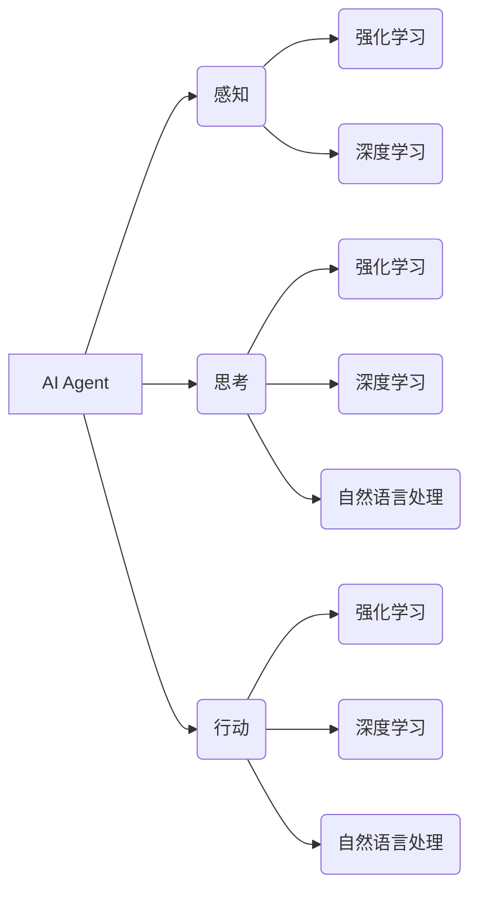

# AI Agent: AI的下一个风口 当前技术的局限性

作者：禅与计算机程序设计艺术 / Zen and the Art of Computer Programming

## 关键词：

AI Agent，人工智能，智能代理，机器学习，强化学习，深度学习，自然语言处理，图灵测试，通用人工智能，人机协同

## 1. 背景介绍

### 1.1 问题的由来

随着深度学习、强化学习等人工智能技术的快速发展，AI应用已经渗透到各个领域，为人类生活带来了前所未有的便利。然而，当前人工智能技术仍处于初级阶段，缺乏真正的“智能”，难以胜任复杂、动态的决策任务。AI Agent作为一种能够自主决策、适应环境、完成任务的智能体，被认为是AI领域的下一个风口。本文将探讨AI Agent的原理、技术挑战和未来发展趋势。

### 1.2 研究现状

近年来，AI Agent相关研究取得了显著进展，主要集中在以下几个方面：

- **强化学习**：通过与环境交互，学习最优策略，实现智能体在复杂环境中的决策。

- **深度学习**：利用神经网络模型，从海量数据中学习特征和规律，提高智能体的感知能力。

- **自然语言处理**：使智能体能够理解和生成自然语言，实现人机交互。

- **多智能体系统**：研究多个智能体之间的协同合作，解决复杂任务。

### 1.3 研究意义

AI Agent具有以下研究意义：

- **推动人工智能发展**：AI Agent作为人工智能领域的下一个风口，将推动相关技术的创新和发展。

- **解决复杂问题**：AI Agent能够在复杂、动态环境中进行自主决策，解决传统人工智能难以处理的难题。

- **提高生产效率**：AI Agent可应用于各行各业，提高生产效率，降低人力成本。

- **改善人类生活**：AI Agent可应用于教育、医疗、交通等领域，改善人类生活。

### 1.4 本文结构

本文将首先介绍AI Agent的核心概念与联系，然后阐述其原理和具体操作步骤，接着分析其应用场景和未来发展趋势，最后总结全文并展望未来。

## 2. 核心概念与联系

### 2.1 核心概念

- **AI Agent**：具有感知、思考、行动能力的智能体，能够在环境中自主决策，完成任务。

- **强化学习**：智能体通过与环境的交互，学习最优策略，实现目标。

- **深度学习**：利用神经网络模型，从数据中学习特征和规律。

- **自然语言处理**：使智能体理解和生成自然语言，实现人机交互。

### 2.2 联系

AI Agent的构建需要融合强化学习、深度学习和自然语言处理等技术，如图所示：



## 3. 核心算法原理 & 具体操作步骤

### 3.1 算法原理概述

AI Agent的核心算法主要分为以下几个步骤：

- **感知**：智能体从环境中获取信息，如图像、声音、文本等。

- **思考**：智能体根据感知到的信息，通过算法进行推理和决策。

- **行动**：智能体根据决策结果，采取行动改变环境。

- **评估**：评估智能体的行动效果，并反馈给学习算法。

### 3.2 算法步骤详解

#### 3.2.1 感知

智能体的感知模块负责从环境中获取信息。常见的感知方式包括：

- **图像识别**：使用卷积神经网络(CNN)从图像中提取特征。

- **语音识别**：使用循环神经网络(RNN)或Transformer从语音信号中提取特征。

- **自然语言理解**：使用深度学习模型从文本中提取语义信息。

#### 3.2.2 思考

智能体的思考模块负责根据感知到的信息进行推理和决策。常见的思考方式包括：

- **强化学习**：通过与环境交互，学习最优策略。

- **深度学习**：从数据中学习特征和规律。

- **自然语言处理**：理解和生成自然语言。

#### 3.2.3 行动

智能体的行动模块负责根据决策结果采取行动。常见的行动方式包括：

- **控制机器人**：控制机械臂、无人车等机器人执行任务。

- **操作设备**：控制无人机、智能家居等设备。

- **生成文本/语音**：生成自然语言文本或语音。

#### 3.2.4 评估

智能体的评估模块负责评估行动效果，并反馈给学习算法。常见的评估方式包括：

- **奖励函数**：根据行动效果计算奖励。

- **损失函数**：根据预期目标和实际结果计算损失。

### 3.3 算法优缺点

#### 3.3.1 优点

- **自主决策**：AI Agent能够自主决策，适应复杂环境。

- **多任务学习**：AI Agent能够同时处理多个任务。

- **自适应能力**：AI Agent能够根据环境变化调整策略。

#### 3.3.2 缺点

- **数据依赖**：AI Agent的训练需要大量数据。

- **计算复杂度**：AI Agent的计算复杂度较高。

- **可解释性**：AI Agent的决策过程难以解释。

### 3.4 算法应用领域

AI Agent在以下领域具有广泛的应用前景：

- **自动驾驶**：智能驾驶汽车、无人车等。

- **智能机器人**：家庭机器人、服务机器人等。

- **智能客服**：自动回答客户问题，提供个性化服务。

- **智能金融**：智能投顾、欺诈检测等。

- **智能医疗**：辅助诊断、药物研发等。

## 4. 数学模型和公式 & 详细讲解 & 举例说明

### 4.1 数学模型构建

AI Agent的数学模型主要包括以下部分：

- **感知模块**：使用卷积神经网络(CNN)或循环神经网络(RNN)等模型提取特征。

- **思考模块**：使用强化学习、深度学习或自然语言处理等模型进行推理和决策。

- **行动模块**：使用控制理论、优化算法等模型执行动作。

- **评估模块**：使用奖励函数、损失函数等模型评估行动效果。

### 4.2 公式推导过程

以下以Q学习为例，简要介绍公式推导过程。

#### Q学习

Q学习是一种强化学习算法，通过学习Q值函数，实现最优策略。

设状态空间为 $S$，动作空间为 $A$，奖励函数为 $R(s,a)$，则Q值函数定义为：

$$
Q(s,a) = \sum_{s'} \gamma^{|s'-s|} R(s,a) + \max_{a'} Q(s',a')
$$

其中，$\gamma$ 为折扣因子，$|s'-s|$ 为状态距离。

Q学习的目标是学习Q值函数，使得 $Q(s,a)$ 最大化。

### 4.3 案例分析与讲解

以自动驾驶为例，介绍AI Agent的应用。

#### 案例背景

自动驾驶汽车需要在复杂环境中进行决策，如变换车道、避让行人、超车等。

#### 案例分析

1. 感知模块：自动驾驶汽车通过摄像头、雷达、激光雷达等传感器获取周围环境信息，如道路、车辆、行人等。

2. 思考模块：智能体根据感知到的信息，使用深度学习模型进行推理，如识别道路、检测行人、预测车辆行驶轨迹等。

3. 行动模块：智能体根据推理结果，使用控制理论模型控制车辆行驶，如变换车道、避让行人、超车等。

4. 评估模块：智能体根据行驶结果，计算奖励，如行驶距离、行驶时间、安全度等。

### 4.4 常见问题解答

**Q1：如何解决AI Agent的数据依赖问题？**

A1：解决数据依赖问题可以从以下方面入手：

- **数据增强**：通过旋转、缩放、裁剪等方式扩充数据集。

- **主动学习**：根据模型的预测结果，选择最具有代表性的样本进行标注。

- **生成对抗网络**：利用生成对抗网络(GAN)生成模拟数据。

**Q2：如何提高AI Agent的计算效率？**

A2：提高AI Agent的计算效率可以从以下方面入手：

- **模型压缩**：使用模型压缩技术，如知识蒸馏、剪枝、量化等，减小模型尺寸。

- **并行计算**：利用多核处理器、GPU等硬件加速计算。

- **分布式训练**：将训练任务分布在多台机器上，提高训练速度。

## 5. 项目实践：代码实例和详细解释说明

### 5.1 开发环境搭建

以下是使用Python和PyTorch进行AI Agent开发的环境搭建步骤：

1. 安装Python和PyTorch。

2. 安装TensorFlow、Keras等深度学习框架。

3. 安装OpenCV、NumPy等工具包。

### 5.2 源代码详细实现

以下是一个简单的自动驾驶AI Agent的PyTorch代码实现示例：

```python
import torch
import torch.nn as nn
import torch.optim as optim

# 定义感知模块
class感知模块(nn.Module):
    def __init__(self):
        super(感知模块, self).__init__()
        self.conv1 = nn.Conv2d(3, 16, kernel_size=3, stride=1, padding=1)
        self.conv2 = nn.Conv2d(16, 32, kernel_size=3, stride=1, padding=1)
        self.fc1 = nn.Linear(32*64*64, 1024)

    def forward(self, x):
        x = F.relu(self.conv1(x))
        x = F.relu(self.conv2(x))
        x = x.view(-1, 32*64*64)
        x = F.relu(self.fc1(x))
        return x

# 定义思考模块
class思考模块(nn.Module):
    def __init__(self):
        super(思考模块, self).__init__()
        self.fc2 = nn.Linear(1024, 128)
        self.fc3 = nn.Linear(128, 64)
        self.fc4 = nn.Linear(64, 4)

    def forward(self, x):
        x = F.relu(self.fc2(x))
        x = F.relu(self.fc3(x))
        x = self.fc4(x)
        return x

# 定义行动模块
class行动模块(nn.Module):
    def __init__(self):
        super(行动模块, self).__init__()
        self.fc5 = nn.Linear(64, 2)

    def forward(self, x):
        x = self.fc5(x)
        return x

# 定义AI Agent
class AI_Agent(nn.Module):
    def __init__(self):
        super(AI_Agent, self).__init__()
        self.感知模块 = 感知模块()
        self.思考模块 = 思考模块()
        self.行动模块 = 行动模块()

    def forward(self, x):
        x = self.感知模块(x)
        x = self.思考模块(x)
        action = self.行动模块(x)
        return action

# 实例化模型
model = AI_Agent()

# 定义优化器
optimizer = optim.Adam(model.parameters(), lr=1e-3)

# 训练模型
# ...
```

### 5.3 代码解读与分析

上述代码定义了一个简单的自动驾驶AI Agent，包括感知模块、思考模块、行动模块和AI Agent本身。感知模块负责提取图像特征，思考模块负责根据特征进行推理和决策，行动模块负责生成行动指令，AI Agent则整合了这三个模块，实现自动驾驶功能。

### 5.4 运行结果展示

由于示例代码没有包含训练和测试部分，此处无法展示运行结果。在实际应用中，需要根据具体任务需求设计合适的训练和测试方案。

## 6. 实际应用场景

### 6.1 自动驾驶

自动驾驶是AI Agent最具代表性的应用场景之一。通过感知环境、进行决策和行动，自动驾驶汽车可以安全、高效地行驶在道路上。

### 6.2 智能机器人

智能机器人可以应用于家庭、工业、医疗等领域，如家庭服务机器人、工业自动化机器人、医疗辅助机器人等。

### 6.3 智能客服

智能客服可以自动回答客户问题，提供个性化服务，提高企业运营效率。

### 6.4 智能金融

智能金融可以应用于风险控制、投资顾问、智能投顾等领域，提高金融行业效率。

### 6.5 智能医疗

智能医疗可以应用于辅助诊断、药物研发、健康管理等领域，提高医疗服务质量。

## 7. 工具和资源推荐

### 7.1 学习资源推荐

- 《深度学习》
- 《强化学习》
- 《自然语言处理》
- 《人工智能：一种现代的方法》
- 《深度强化学习》

### 7.2 开发工具推荐

- Python
- PyTorch
- TensorFlow
- OpenCV
- Keras

### 7.3 相关论文推荐

- Q-Learning
- Policy Gradient
- Deep Q-Network
- Deep Deterministic Policy Gradient
- AlphaGo

### 7.4 其他资源推荐

- arXiv
- GitHub
- KEG Lab
- CUML Lab

## 8. 总结：未来发展趋势与挑战

### 8.1 研究成果总结

本文介绍了AI Agent的概念、原理、技术挑战和应用前景，并推荐了相关学习资源、开发工具和论文。AI Agent作为一种能够自主决策、适应环境、完成任务的智能体，被认为是AI领域的下一个风口。随着相关技术的不断发展，AI Agent将在更多领域发挥重要作用。

### 8.2 未来发展趋势

- **多模态感知**：融合视觉、听觉、触觉等多模态信息，提高智能体对环境的感知能力。

- **迁移学习**：将已学习到的知识迁移到新的任务，提高智能体的泛化能力。

- **强化学习与深度学习融合**：结合强化学习和深度学习优势，实现更加鲁棒的智能体。

- **人机协同**：与人类协作，实现人机共创。

### 8.3 面临的挑战

- **数据依赖**：AI Agent的训练需要大量数据。

- **计算复杂度**：AI Agent的计算复杂度较高。

- **可解释性**：AI Agent的决策过程难以解释。

- **伦理问题**：AI Agent的应用可能引发伦理问题。

### 8.4 研究展望

未来，AI Agent技术将在以下方面取得突破：

- **数据高效利用**：探索数据高效利用方法，降低数据依赖。

- **模型高效训练**：开发高效训练方法，降低计算复杂度。

- **可解释性研究**：提高AI Agent的可解释性，增强用户信任。

- **伦理法规制定**：制定相关伦理法规，确保AI Agent的安全可靠应用。

## 9. 附录：常见问题与解答

**Q1：什么是AI Agent？**

A1：AI Agent是一种具有感知、思考、行动能力的智能体，能够在环境中自主决策，完成任务。

**Q2：AI Agent的技术难点有哪些？**

A2：AI Agent的技术难点包括数据依赖、计算复杂度、可解释性、伦理问题等。

**Q3：AI Agent的应用领域有哪些？**

A3：AI Agent的应用领域包括自动驾驶、智能机器人、智能客服、智能金融、智能医疗等。

**Q4：如何解决AI Agent的数据依赖问题？**

A4：解决数据依赖问题可以从以下方面入手：数据增强、主动学习、生成对抗网络等。

**Q5：如何提高AI Agent的计算效率？**

A5：提高AI Agent的计算效率可以从以下方面入手：模型压缩、并行计算、分布式训练等。

**Q6：如何提高AI Agent的可解释性？**

A6：提高AI Agent的可解释性可以从以下方面入手：可视化、解释性神经网络、因果推理等。

**Q7：AI Agent的伦理问题有哪些？**

A7：AI Agent的伦理问题包括歧视、偏见、隐私、安全等。

**Q8：未来AI Agent的发展趋势是什么？**

A8：未来AI Agent的发展趋势包括多模态感知、迁移学习、强化学习与深度学习融合、人机协同等。