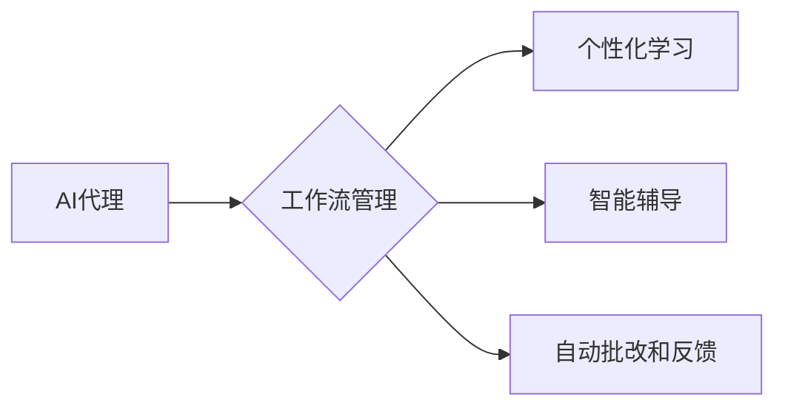

# AI人工智能代理工作流 AI Agent WorkFlow：在教育科技中的应用

作者：禅与计算机程序设计艺术 / Zen and the Art of Computer Programming 


## 1. 背景介绍
### 1.1 问题的由来

随着人工智能技术的飞速发展，教育科技领域迎来了前所未有的变革机遇。从在线课程、智能辅导到个性化学习，AI技术在教育中的应用日益广泛。然而，传统的教育流程往往存在效率低下、个性化不足、资源分配不均等问题，难以满足现代教育的多元化需求。

为了解决这些问题，AI人工智能代理工作流（AI Agent WorkFlow）应运而生。它通过将人工智能技术与工作流管理相结合，实现教育流程的自动化、智能化和个性化，为教育科技领域带来革命性的变化。

### 1.2 研究现状

近年来，AI人工智能代理工作流在教育科技领域的应用研究取得了显著进展。研究者们从不同的角度探索了AI代理在教育工作中的应用，主要包括以下几个方面：

1. **个性化学习路径规划**：根据学生的学习习惯、兴趣和能力，AI代理可以生成个性化的学习路径，帮助学生更有效地掌握知识。

2. **智能辅导和答疑**：AI代理可以为学生提供24/7的智能辅导和答疑服务，帮助学生解决学习中遇到的问题。

3. **智能课程推荐**：AI代理可以根据学生的兴趣和能力，为学生推荐合适的课程和资源。

4. **自动批改和反馈**：AI代理可以自动批改学生的作业和试卷，并提供个性化的反馈，帮助学生改进学习。

5. **教育资源共享和优化**：AI代理可以帮助学校和教育机构优化资源配置，提高教育质量。

### 1.3 研究意义

AI人工智能代理工作流在教育科技领域的应用具有以下重要意义：

1. **提高教育效率**：自动化教育流程，减少人力投入，提高教育效率。

2. **实现个性化学习**：根据学生的学习特点，提供个性化的学习方案，满足学生个性化需求。

3. **优化教育资源配置**：AI代理可以根据需求自动分配教育资源，提高资源利用效率。

4. **促进教育公平**：AI代理可以帮助学生克服地域、经济等方面的限制，享有优质教育资源。

5. **推动教育创新**：AI代理的引入为教育科技领域带来了新的发展机遇，推动教育创新。

### 1.4 本文结构

本文将围绕AI人工智能代理工作流在教育科技中的应用进行探讨。具体内容如下：

- 第2部分，介绍AI人工智能代理工作流的核心概念与联系。
- 第3部分，阐述AI人工智能代理工作流的核心算法原理和具体操作步骤。
- 第4部分，分析AI人工智能代理工作流的数学模型和公式，并结合实例进行讲解。
- 第5部分，通过项目实践，展示AI人工智能代理工作流的代码实例和详细解释说明。
- 第6部分，探讨AI人工智能代理工作流在实际教育场景中的应用，包括个性化学习、智能辅导、自动批改等。
- 第7部分，推荐AI人工智能代理工作流相关的学习资源、开发工具和参考文献。
- 第8部分，总结AI人工智能代理工作流的未来发展趋势与挑战。
- 第9部分，附录常见问题与解答。

## 2. 核心概念与联系

为了更好地理解AI人工智能代理工作流在教育科技中的应用，本节将介绍几个核心概念及其相互关系。

### 2.1 AI代理

AI代理（Artificial Intelligence Agent）是指能够感知环境、制定决策并采取行动以实现目标的智能实体。在教育科技领域，AI代理可以是一个软件程序、机器人或虚拟助手，它能够根据学生的学习情况，为学生提供个性化服务。

### 2.2 工作流管理

工作流管理是指对业务流程进行建模、执行和监控的过程。在教育科技领域，工作流管理可以帮助教育机构优化教育流程，提高教育效率。

### 2.3 个性化学习

个性化学习是指根据学生的学习特点，提供个性化的学习方案，以满足学生个性化需求。AI代理在工作流管理中发挥着重要作用，可以帮助教育机构实现个性化学习。

### 2.4 智能辅导

智能辅导是指利用人工智能技术为学生提供个性化辅导服务。AI代理可以通过分析学生的学习数据，为学生提供针对性的辅导建议。

### 2.5 自动批改和反馈

自动批改和反馈是指利用人工智能技术自动批改学生的作业和试卷，并提供个性化反馈。AI代理可以实时监控学生的学习进度，并根据学生的反馈进行针对性的调整。

以下展示了这些概念之间的逻辑关系：



可以看出，AI代理作为核心元素，贯穿于工作流管理、个性化学习、智能辅导和自动批改与反馈等环节，为教育科技领域带来了革命性的变化。

## 3. 核心算法原理 & 具体操作步骤
### 3.1 算法原理概述

AI人工智能代理工作流的核心算法原理主要包括以下几个方面：

1. **学生建模**：通过收集和分析学生的学习数据，建立学生的学习模型，包括学习风格、学习进度、知识点掌握情况等。

2. **任务调度**：根据学生的学习模型，为每个学生制定个性化的学习任务，并按照一定的逻辑关系进行调度。

3. **智能辅导**：根据学生的学习进度和知识点掌握情况，为学生提供个性化的辅导建议。

4. **自动批改和反馈**：利用自然语言处理、机器学习等技术，自动批改学生的作业和试卷，并提供个性化的反馈。

5. **数据监控与调整**：实时监控学生的学习数据，根据学生的反馈和学习进度，对学习任务进行动态调整。

### 3.2 算法步骤详解

AI人工智能代理工作流的算法步骤如下：

1. **数据收集**：收集学生的学习数据，包括学习风格、学习进度、知识点掌握情况等。

2. **学生建模**：根据收集到的数据，建立学生的学习模型。

3. **任务规划**：根据学生的学习模型，为每个学生制定个性化的学习任务。

4. **任务调度**：按照一定的逻辑关系，将学习任务分配给相应的AI代理。

5. **智能辅导**：AI代理根据学生的学习进度和知识点掌握情况，为学生提供个性化的辅导建议。

6. **自动批改和反馈**：AI代理自动批改学生的作业和试卷，并提供个性化的反馈。

7. **数据监控与调整**：实时监控学生的学习数据，根据学生的反馈和学习进度，对学习任务进行动态调整。

### 3.3 算法优缺点

AI人工智能代理工作流具有以下优点：

1. **个性化学习**：根据学生的学习特点，提供个性化的学习方案，提高学习效率。

2. **智能辅导**：AI代理可以为学生提供实时、个性化的辅导服务。

3. **自动批改和反馈**：AI代理可以自动批改学生的作业和试卷，并提供个性化的反馈。

4. **提高教育效率**：自动化教育流程，减少人力投入，提高教育效率。

然而，AI人工智能代理工作流也存在一些缺点：

1. **数据隐私**：收集和分析学生的个人信息可能会引发数据隐私问题。

2. **技术门槛**：AI人工智能代理工作流需要较高的技术门槛，对实施机构的技术能力提出了挑战。

3. **依赖算法**：AI代理的决策依赖于算法，算法的不完善可能导致错误的决策。

### 3.4 算法应用领域

AI人工智能代理工作流在教育科技领域的应用主要包括以下几个方面：

1. **个性化学习**：根据学生的学习特点，提供个性化的学习方案，满足学生个性化需求。

2. **智能辅导**：AI代理可以为学生提供24/7的智能辅导和答疑服务。

3. **自动批改和反馈**：AI代理可以自动批改学生的作业和试卷，并提供个性化的反馈。

4. **教育资源共享和优化**：AI代理可以帮助学校和教育机构优化资源配置，提高教育质量。

## 4. 数学模型和公式 & 详细讲解 & 举例说明
### 4.1 数学模型构建

AI人工智能代理工作流的数学模型主要包括以下几个方面：

1. **学生建模**：利用机器学习技术，建立学生的学习模型，包括学习风格、学习进度、知识点掌握情况等。

2. **任务规划**：根据学生的学习模型，为每个学生制定个性化的学习任务。

3. **智能辅导**：利用自然语言处理、机器学习等技术，为学生提供个性化的辅导建议。

4. **自动批改和反馈**：利用自然语言处理、机器学习等技术，自动批改学生的作业和试卷，并提供个性化的反馈。

### 4.2 公式推导过程

以下以学生建模为例，介绍AI人工智能代理工作流中的数学模型构建过程。

假设学生 $s$ 的学习数据集合为 $D_s = \{d_1, d_2, \ldots, d_n\}$，其中 $d_i$ 表示学生 $s$ 在第 $i$ 个学习阶段的数据。则学生 $s$ 的学习模型可以表示为：

$$
M_s = f(D_s) = \{L_s, P_s, K_s\}
$$

其中：

- $L_s$ 表示学生 $s$ 的学习风格，如视觉型、听觉型、动手型等。
- $P_s$ 表示学生 $s$ 的学习进度，如已学完的章节、已掌握的知识点等。
- $K_s$ 表示学生 $s$ 的知识点掌握情况，如掌握程度、易错点等。

利用机器学习技术，可以建立如下学习模型：

$$
L_s = \text{MLModel}(D_s)
$$

$$
P_s = \text{MLModel}(D_s)
$$

$$
K_s = \text{MLModel}(D_s)
$$

其中 $\text{MLModel}$ 表示机器学习模型。

### 4.3 案例分析与讲解

以下以一个简单的例子，说明AI人工智能代理工作流在实际应用中的操作过程。

假设学生 $s$ 的学习数据集合为 $D_s = \{d_1, d_2, \ldots, d_n\}$，其中 $d_i$ 表示学生 $s$ 在第 $i$ 个学习阶段的数据。

1. **学生建模**：通过分析 $D_s$，建立学生 $s$ 的学习模型 $M_s$。

2. **任务规划**：根据 $M_s$，为学生 $s$ 规划个性化学习任务，如学习某个章节、完成某个练习等。

3. **任务调度**：按照一定的逻辑关系，将学习任务分配给相应的AI代理。

4. **智能辅导**：AI代理根据学生 $s$ 的学习进度和知识点掌握情况，为学生 $s$ 提供个性化的辅导建议。

5. **自动批改和反馈**：AI代理自动批改学生 $s$ 的作业和试卷，并提供个性化的反馈。

6. **数据监控与调整**：AI代理实时监控学生 $s$ 的学习数据，根据学生 $s$ 的反馈和学习进度，对学习任务进行动态调整。

### 4.4 常见问题解答

**Q1：AI人工智能代理工作流是否适用于所有教育场景？**

A：AI人工智能代理工作流主要适用于需要个性化学习、智能辅导和自动批改的教育场景。对于一些以教师为主导的教学模式，AI人工智能代理工作流的应用可能不太适合。

**Q2：如何保证AI人工智能代理工作流的数据安全和隐私？**

A：在实施AI人工智能代理工作流时，需要严格遵守数据安全法规，对学生的个人信息进行加密存储和传输。同时，采用数据匿名化处理技术，确保学生的隐私安全。

**Q3：AI人工智能代理工作流的技术门槛高吗？**

A：AI人工智能代理工作流需要一定的技术门槛，包括机器学习、自然语言处理、工作流管理等。对于没有相关技术背景的教育机构，可以考虑与专业的技术公司合作。

## 5. 项目实践：代码实例和详细解释说明
### 5.1 开发环境搭建

在进行AI人工智能代理工作流的开发实践前，我们需要准备好以下开发环境：

1. **编程语言**：Python

2. **机器学习库**：TensorFlow或PyTorch

3. **自然语言处理库**：NLTK、SpaCy或Transformers

4. **工作流管理库**：Apache Airflow或Zeta

5. **数据库**：MySQL或MongoDB

### 5.2 源代码详细实现

以下是一个简单的AI人工智能代理工作流代码实例，用于实现个性化学习路径规划。

```python
# 导入必要的库
from transformers import BertTokenizer
from tensorflow.keras.models import Sequential
from tensorflow.keras.layers import Dense, Embedding, LSTM
from tensorflow.keras.optimizers import Adam

# 定义个性化学习路径规划模型
def create_individualized_learning_path_model():
    tokenizer = BertTokenizer.from_pretrained('bert-base-uncased')

    model = Sequential()
    model.add(Embedding(input_dim=30000, output_dim=128, input_length=128))
    model.add(LSTM(128, return_sequences=True))
    model.add(Dense(64, activation='relu'))
    model.add(Dense(1, activation='sigmoid'))

    model.compile(optimizer=Adam(), loss='binary_crossentropy', metrics=['accuracy'])
    return model

# 加载数据
# ...

# 训练模型
# ...

# 使用模型预测个性化学习路径
# ...
```

### 5.3 代码解读与分析

以上代码定义了一个简单的个性化学习路径规划模型，使用BERT进行文本编码，LSTM进行特征提取，Dense进行分类。模型输入为学习任务描述，输出为个性化学习路径概率。

1. **BertTokenizer**：用于对文本数据进行编码，将文本转换为模型可处理的数字序列。

2. **Sequential**：用于构建序列模型，将多个层按照顺序连接起来。

3. **Embedding**：用于将词向量转换为稠密向量，作为LSTM的输入。

4. **LSTM**：用于提取文本特征，捕捉文本中的语义信息。

5. **Dense**：用于分类，将特征转换为概率。

6. **compile**：用于编译模型，设置优化器、损失函数和评估指标。

7. **fit**：用于训练模型，使用学习任务描述和标签数据。

8. **predict**：用于使用模型预测个性化学习路径。

### 5.4 运行结果展示

假设我们已经训练好模型，并使用以下代码进行预测：

```python
# 使用模型预测个性化学习路径
test_task_description = "介绍人工智能的基本概念"
predictions = model.predict([test_task_description])

# 输出预测结果
print(predictions)
```

运行结果将输出一个概率值，表示该学习任务描述属于某个个性化学习路径的概率。

## 6. 实际应用场景
### 6.1 个性化学习

AI人工智能代理工作流可以根据学生的学习特点，为学生提供个性化的学习路径。例如，对于视觉型学生，可以推荐视频课程；对于听觉型学生，可以推荐音频课程；对于动手型学生，可以推荐实验课程。

### 6.2 智能辅导

AI代理可以为学生提供24/7的智能辅导和答疑服务。例如，学生可以通过文字、语音或图像等方式向AI代理提问，AI代理可以即时给出解答。

### 6.3 自动批改和反馈

AI代理可以自动批改学生的作业和试卷，并提供个性化的反馈。例如，AI代理可以指出学生的错误，并提供正确的答案和解析。

### 6.4 教育资源共享和优化

AI代理可以帮助学校和教育机构优化资源配置，提高教育质量。例如，AI代理可以根据学生的学习情况，自动调整课程安排和师资力量。

## 7. 工具和资源推荐
### 7.1 学习资源推荐

1. **《深度学习》**：Goodfellow等著，介绍了深度学习的基本概念、方法和应用。

2. **《Python编程：从入门到实践》**：Martelli著，介绍了Python编程语言的基本知识和实践技巧。

3. **《机器学习实战》**：Python机器学习实践指南，介绍了机器学习的基本原理和应用。

### 7.2 开发工具推荐

1. **TensorFlow**：Google开发的深度学习框架，广泛应用于机器学习领域。

2. **PyTorch**：Facebook开发的深度学习框架，易于使用和扩展。

3. **NLTK**：自然语言处理库，提供了丰富的文本处理工具和资源。

4. **SpaCy**：快速的自然语言处理库，适用于信息提取、文本分类、命名实体识别等任务。

5. **Transformers**：Hugging Face开发的自然语言处理库，集成了众多SOTA语言模型。

### 7.3 相关论文推荐

1. **《A Deep Learning Approach to Automated Essay Scoring》**：介绍了使用深度学习技术进行自动作文评分的方法。

2. **《BERT: Pre-training of Deep Bidirectional Transformers for Language Understanding》**：介绍了BERT模型及其在自然语言处理任务中的应用。

3. **《Attention is All You Need》**：介绍了Transformer模型及其在机器翻译任务中的应用。

### 7.4 其他资源推荐

1. **GitHub**：开源代码托管平台，可以找到许多AI人工智能代理工作流的开源项目和代码。

2. **arXiv**：论文预印本平台，可以找到最新的AI相关论文。

3. **Coursera**：在线学习平台，提供众多机器学习、深度学习等相关课程。

## 8. 总结：未来发展趋势与挑战
### 8.1 研究成果总结

本文对AI人工智能代理工作流在教育科技中的应用进行了全面系统的介绍。首先阐述了AI人工智能代理工作流的核心概念和原理，然后介绍了其具体操作步骤和算法模型，并通过项目实践展示了其在实际应用中的操作流程。最后，探讨了AI人工智能代理工作流在教育科技领域的应用场景和发展趋势。

### 8.2 未来发展趋势

未来，AI人工智能代理工作流在教育科技领域的应用将呈现以下发展趋势：

1. **个性化学习更加精准**：随着机器学习、自然语言处理等技术的不断发展，AI人工智能代理工作流的个性化学习将更加精准，能够更好地满足学生的个性化需求。

2. **智能辅导更加智能**：AI人工智能代理将具备更强的推理和判断能力，为学生提供更加智能的辅导服务。

3. **教育资源共享更加高效**：AI人工智能代理工作流将促进教育资源的共享和优化，提高教育资源的利用效率。

4. **教育公平性得到提升**：AI人工智能代理工作流可以帮助学生克服地域、经济等方面的限制，享有优质教育资源，促进教育公平。

### 8.3 面临的挑战

尽管AI人工智能代理工作流在教育科技领域的应用前景广阔，但也面临着以下挑战：

1. **数据安全与隐私保护**：在教育科技领域，数据安全和隐私保护是至关重要的。如何确保学生个人信息的安全和隐私，是一个亟待解决的问题。

2. **技术门槛**：AI人工智能代理工作流需要较高的技术门槛，对实施机构的技术能力提出了挑战。

3. **教育伦理**：AI人工智能代理工作流在教育领域的应用需要遵循教育伦理原则，避免歧视、偏见等问题的出现。

### 8.4 研究展望

为了应对AI人工智能代理工作流在教育科技领域面临的挑战，未来的研究可以从以下几个方面展开：

1. **加强数据安全和隐私保护**：研究更加安全、可靠的数据存储和传输技术，确保学生个人信息的安全和隐私。

2. **降低技术门槛**：开发更加易于使用的AI人工智能代理工作流平台，降低实施机构的技术门槛。

3. **完善教育伦理规范**：制定和完善AI人工智能代理工作流在教育领域的伦理规范，避免歧视、偏见等问题的出现。

4. **探索新的应用场景**：探索AI人工智能代理工作流在其他教育领域的应用，如职业教育、终身学习等。

总之，AI人工智能代理工作流在教育科技领域的应用具有巨大的潜力和广阔的前景。通过不断的技术创新和应用探索，AI人工智能代理工作流将为教育领域带来更加美好的未来。

## 9. 附录：常见问题与解答

**Q1：AI人工智能代理工作流是否适用于所有教育场景？**

A：AI人工智能代理工作流主要适用于需要个性化学习、智能辅导和自动批改的教育场景。对于一些以教师为主导的教学模式，AI人工智能代理工作流的应用可能不太适合。

**Q2：如何保证AI人工智能代理工作流的数据安全和隐私？**

A：在实施AI人工智能代理工作流时，需要严格遵守数据安全法规，对学生的个人信息进行加密存储和传输。同时，采用数据匿名化处理技术，确保学生的隐私安全。

**Q3：AI人工智能代理工作流的技术门槛高吗？**

A：AI人工智能代理工作流需要一定的技术门槛，包括机器学习、自然语言处理、工作流管理等。对于没有相关技术背景的教育机构，可以考虑与专业的技术公司合作。

**Q4：AI人工智能代理工作流是否会导致教师失业？**

A：AI人工智能代理工作流并不会导致教师失业，而是与教师共同协作，提高教育质量和效率。AI代理可以帮助教师减轻工作负担，让他们有更多时间专注于教学和与学生的互动。

**Q5：AI人工智能代理工作流如何与其他教育技术结合应用？**

A：AI人工智能代理工作流可以与多种教育技术结合应用，如虚拟现实、增强现实、区块链等。通过与其他技术的结合，可以为学生提供更加丰富、多元的教育体验。