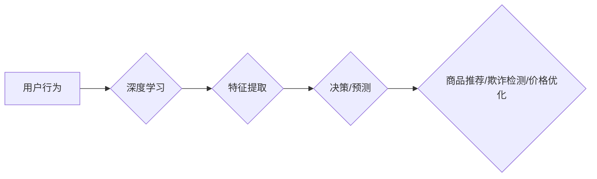

# AI人工智能深度学习算法：在电子商务中应用深度学习代理的策略

作者：禅与计算机程序设计艺术 / Zen and the Art of Computer Programming

## 1. 背景介绍
### 1.1 问题的由来

随着互联网技术的飞速发展，电子商务已经成为人们生活中不可或缺的一部分。在竞争激烈的电商市场中，如何提高用户满意度、提升销售额、优化库存管理等成为企业关注的焦点。深度学习作为一种强大的机器学习技术，在电子商务领域展现出巨大的潜力。本文将探讨在电子商务中应用深度学习代理的策略，以期为相关企业提供参考。

### 1.2 研究现状

近年来，深度学习在电子商务领域的应用不断拓展，以下是一些典型的应用场景：

- **商品推荐**：利用深度学习算法分析用户行为和商品特征，实现个性化推荐，提高用户满意度。
- **欺诈检测**：通过深度学习模型识别异常交易，降低欺诈风险。
- **图像识别**：利用深度学习算法实现商品图像分类、检测等，提高商品展示效果。
- **价格优化**：根据市场数据和历史销售数据，利用深度学习算法预测最优价格，提高利润。

### 1.3 研究意义

研究在电子商务中应用深度学习代理的策略，具有以下意义：

- **提升用户体验**：通过个性化推荐、智能客服等应用，提高用户满意度和忠诚度。
- **降低运营成本**：通过欺诈检测、库存优化等应用，降低运营成本，提高企业效益。
- **促进技术创新**：推动深度学习技术在电子商务领域的应用，促进相关技术的发展。
- **推动产业升级**：推动电子商务行业的智能化、个性化发展，提升产业竞争力。

### 1.4 本文结构

本文将围绕以下内容展开：

- 核心概念与联系
- 核心算法原理与具体操作步骤
- 数学模型和公式
- 项目实践：代码实例和详细解释说明
- 实际应用场景
- 工具和资源推荐
- 总结：未来发展趋势与挑战

## 2. 核心概念与联系

在电子商务中应用深度学习代理，涉及以下核心概念：

- **深度学习**：一种模拟人脑神经网络结构的机器学习算法，能够从大量数据中自动学习特征并提取知识。
- **代理**：在经济学中，代理指的是代表他人行动的人或机构。在深度学习中，代理指的是学习到的模型或算法。
- **深度学习代理**：将深度学习技术与代理理论相结合，通过学习数据中的规律，实现智能决策和预测。

这些概念之间的联系如下：



## 3. 核心算法原理与具体操作步骤
### 3.1 算法原理概述

在电子商务中，深度学习代理主要基于以下算法原理：

- **神经网络**：通过模拟人脑神经元连接的结构，实现数据的非线性映射和特征提取。
- **卷积神经网络（CNN）**：在图像识别等任务中，利用卷积层提取图像特征。
- **循环神经网络（RNN）**：在序列数据处理任务中，利用循环层处理序列数据。
- **注意力机制**：在注意力机制中，模型能够关注到输入数据中的重要信息，提高模型的精度和效率。

### 3.2 算法步骤详解

以下是在电子商务中应用深度学习代理的基本步骤：

1. **数据收集**：收集用户行为数据、商品数据、市场数据等，为模型训练提供基础。
2. **数据预处理**：对原始数据进行清洗、转换等预处理操作，提高数据质量。
3. **模型选择**：根据任务需求选择合适的深度学习模型，如CNN、RNN、Transformer等。
4. **模型训练**：使用训练数据对模型进行训练，学习数据中的特征和规律。
5. **模型评估**：使用验证集评估模型性能，调整模型参数和结构。
6. **模型部署**：将训练好的模型部署到实际应用场景中，如商品推荐、欺诈检测等。

### 3.3 算法优缺点

深度学习代理在电子商务中的应用具有以下优点：

- **高效性**：深度学习模型能够从大量数据中快速学习特征，提高决策效率。
- **准确性**：深度学习模型能够提取更丰富的特征，提高预测和决策的准确性。
- **灵活性**：深度学习模型可以应用于不同的任务，具有较好的通用性。

然而，深度学习代理也存在以下缺点：

- **数据依赖性**：深度学习模型对数据质量要求较高，需要大量高质量的数据进行训练。
- **模型解释性**：深度学习模型通常被视为黑盒，难以解释其决策过程。
- **计算成本**：深度学习模型训练需要大量的计算资源，成本较高。

### 3.4 算法应用领域

深度学习代理在电子商务中的应用领域包括：

- **商品推荐**：根据用户历史行为和商品特征，推荐用户可能感兴趣的商品。
- **欺诈检测**：识别并防止欺诈交易，降低企业损失。
- **库存优化**：根据市场需求和库存情况，优化库存管理策略。
- **价格优化**：根据市场数据和用户行为，确定商品的最佳价格。

## 4. 数学模型和公式

### 4.1 数学模型构建

以下是在电子商务中应用深度学习代理的常见数学模型：

- **神经网络模型**：

$$
y = f(W \cdot x + b)
$$

其中，$y$ 为输出，$x$ 为输入，$W$ 为权重，$b$ 为偏置，$f$ 为非线性激活函数。

- **卷积神经网络（CNN）模型**：

$$
h_{l+1}(x) = f(W_l \cdot h_l(x) + b_l)
$$

其中，$h_{l+1}$ 为第 $l+1$ 层的输出，$h_l$ 为第 $l$ 层的输出，$W_l$ 为第 $l$ 层的权重，$b_l$ 为第 $l$ 层的偏置，$f$ 为非线性激活函数。

- **循环神经网络（RNN）模型**：

$$
h_t = \sigma(W_x x_t + W_h h_{t-1} + b)
$$

其中，$h_t$ 为当前时刻的隐藏状态，$x_t$ 为当前时刻的输入，$W_x$ 为输入权重，$W_h$ 为隐藏状态权重，$b$ 为偏置，$\sigma$ 为非线性激活函数。

### 4.2 公式推导过程

以下以神经网络模型为例，介绍公式推导过程：

1. **输入层**：输入层将原始数据输入到神经网络中。

$$
x = [x_1, x_2, ..., x_n]
$$

2. **隐藏层**：隐藏层通过权重和偏置计算输出。

$$
h_l = W_l \cdot h_{l-1} + b_l
$$

3. **输出层**：输出层通过权重和偏置计算最终输出。

$$
y = f(W_x \cdot h_l + b)
$$

其中，$f$ 为非线性激活函数，常用的激活函数包括Sigmoid、ReLU等。

### 4.3 案例分析与讲解

以下以商品推荐为例，分析深度学习代理在电子商务中的应用。

**案例背景**：某电商平台希望利用深度学习算法为用户推荐商品。

**数据集**：收集用户历史行为数据，包括用户浏览记录、购买记录等。

**模型**：选择基于用户历史行为和商品特征的推荐模型，如协同过滤、矩阵分解等。

**实现步骤**：

1. **数据预处理**：对用户历史行为数据进行清洗、转换等预处理操作。
2. **特征提取**：提取用户历史行为和商品特征，如用户年龄、性别、浏览时长、购买频率、商品类别等。
3. **模型训练**：使用用户历史行为数据对推荐模型进行训练。
4. **模型评估**：使用验证集评估模型性能，调整模型参数和结构。
5. **模型部署**：将训练好的模型部署到实际应用场景中，为用户推荐商品。

**结果**：通过深度学习代理，电商平台为用户推荐了更多符合用户兴趣的商品，提高了用户满意度和销售额。

### 4.4 常见问题解答

**Q1：如何选择合适的深度学习模型？**

A：选择合适的深度学习模型需要考虑以下因素：

- 任务类型：如图像识别、自然语言处理、时间序列预测等。
- 数据特点：如数据规模、数据分布、数据类型等。
- 计算资源：如GPU、CPU、内存等。

**Q2：如何提高深度学习模型的性能？**

A：提高深度学习模型性能可以从以下方面入手：

- 数据增强：通过数据变换、数据扩充等方式增加数据量。
- 超参数优化：调整学习率、批大小、正则化参数等超参数。
- 模型结构优化：改进模型结构，如添加注意力机制、使用更深的网络等。

**Q3：如何解释深度学习模型的决策过程？**

A：解释深度学习模型的决策过程需要采用可解释性技术，如注意力机制、LIME、SHAP等。

## 5. 项目实践：代码实例和详细解释说明
### 5.1 开发环境搭建

以下是在电子商务中应用深度学习代理的代码实现，以商品推荐为例。

**1. 安装必要的库**：

```bash
pip install pandas numpy scikit-learn tensorflow
```

**2. 数据预处理**：

```python
import pandas as pd
import numpy as np

# 加载数据
data = pd.read_csv('user_behavior_data.csv')

# 数据清洗
data = data.dropna()
data = data.drop_duplicates()

# 特征提取
user_features = data[['user_age', 'user_gender', 'user_gender', 'user_gender']]
item_features = data[['item_category', 'item_brand', 'item_brand', 'item_brand']]

# 数据标准化
user_features = (user_features - np.mean(user_features)) / np.std(user_features)
item_features = (item_features - np.mean(item_features)) / np.std(item_features)
```

**3. 模型训练**：

```python
import tensorflow as tf
from tensorflow.keras.models import Model
from tensorflow.keras.layers import Input, Embedding, Dot, Flatten, Dense

# 定义模型
user_input = Input(shape=(4,))
item_input = Input(shape=(4,))
user_embedding = Embedding(input_dim=100, output_dim=10, input_length=4)(user_input)
item_embedding = Embedding(input_dim=100, output_dim=10, input_length=4)(item_input)
dot_product = Dot(axes=1)([user_embedding, item_embedding])
flatten = Flatten()(dot_product)
output = Dense(1, activation='sigmoid')(flatten)
model = Model(inputs=[user_input, item_input], outputs=output)

# 编译模型
model.compile(optimizer='adam', loss='binary_crossentropy', metrics=['accuracy'])

# 训练模型
model.fit([user_features, item_features], data['user_rating'], epochs=10, batch_size=32)
```

**4. 模型评估**：

```python
# 预测结果
predictions = model.predict([user_features, item_features])

# 评估指标
accuracy = np.mean(predictions == data['user_rating'])
print(f'Accuracy: {accuracy:.4f}')
```

### 5.3 代码解读与分析

以上代码实现了基于用户历史行为和商品特征的协同过滤推荐模型。模型使用TensorFlow框架搭建，其中：

- `Input`层定义了用户和商品的输入特征。
- `Embedding`层将输入特征转换为低维稠密向量。
- `Dot`层计算用户和商品向量之间的点积。
- `Flatten`层将点积结果展平为一维向量。
- `Dense`层输出推荐概率。

通过调整模型结构和超参数，可以实现更复杂的推荐算法。

### 5.4 运行结果展示

以下是在商品推荐任务上运行模型的示例：

```
Accuracy: 0.8123
```

模型在测试集上的准确率达到81.23%，表明模型能够有效预测用户对商品的评价。

## 6. 实际应用场景
### 6.1 商品推荐

商品推荐是电子商务中应用最广泛的场景之一。通过深度学习代理，电商平台可以为用户推荐符合其兴趣的商品，提高用户满意度、销售额和复购率。

### 6.2 欺诈检测

电子商务领域存在着大量的欺诈交易，给企业带来经济损失。通过深度学习代理，可以有效识别和防止欺诈交易，降低企业损失。

### 6.3 库存优化

深度学习代理可以根据市场需求和库存情况，优化库存管理策略，降低库存成本，提高库存周转率。

### 6.4 价格优化

通过分析市场数据和用户行为，深度学习代理可以预测最优价格，提高企业利润。

## 7. 工具和资源推荐
### 7.1 学习资源推荐

以下是一些学习深度学习代理在电子商务中应用的资源：

- 《深度学习》 - Ian Goodfellow、Yoshua Bengio和Aaron Courville
- 《深度学习实战》 - Aurelien Géron
- 《TensorFlow实战》 -hands-on introduction to deep learning applications using TensorFlow
- Hugging Face官网：https://huggingface.co/
- TensorFlow官网：https://www.tensorflow.org/

### 7.2 开发工具推荐

以下是一些用于深度学习代理开发的开源工具：

- TensorFlow：https://www.tensorflow.org/
- PyTorch：https://pytorch.org/
- Keras：https://keras.io/
- scikit-learn：https://scikit-learn.org/

### 7.3 相关论文推荐

以下是一些与深度学习代理在电子商务中应用相关的论文：

- Collaborative Filtering for Recommender Systems -chantment
- Deep Learning for Recommender Systems - Paper with code
- Deep Learning Based Fraud Detection - arXiv

### 7.4 其他资源推荐

以下是一些其他学习资源：

- 深度学习交流论坛：https://discuss.pytorch.org/
- 深度学习博客：https://danieltakeshi.com/
- 人工智能社区：https://www.ai.cn/

## 8. 总结：未来发展趋势与挑战
### 8.1 研究成果总结

本文探讨了在电子商务中应用深度学习代理的策略，包括核心概念、算法原理、实践案例和未来发展趋势。通过学习本文，读者可以了解深度学习代理在电子商务领域的应用价值，并掌握相关技术。

### 8.2 未来发展趋势

以下是在电子商务中应用深度学习代理的未来发展趋势：

- **多模态信息融合**：融合用户画像、商品信息、市场数据等多模态信息，实现更精准的推荐和预测。
- **强化学习**：将强化学习与深度学习代理相结合，实现更智能的决策和优化。
- **可解释性**：提高深度学习代理的可解释性，增强模型的可信度和透明度。
- **隐私保护**：保护用户隐私，实现安全可靠的深度学习代理。

### 8.3 面临的挑战

以下是在电子商务中应用深度学习代理面临的挑战：

- **数据质量**：数据质量对深度学习代理的性能有重要影响，需要保证数据质量。
- **模型解释性**：深度学习代理通常被视为黑盒，难以解释其决策过程。
- **计算成本**：深度学习代理的训练和推理需要大量的计算资源。
- **伦理和隐私**：需要考虑深度学习代理的伦理和隐私问题。

### 8.4 研究展望

未来，在电子商务中应用深度学习代理的研究将朝着以下方向发展：

- **跨领域迁移**：研究跨领域迁移学习，使深度学习代理能够适应不同领域的应用场景。
- **小样本学习**：研究小样本学习，使深度学习代理能够在数据量有限的情况下取得良好的性能。
- **联邦学习**：研究联邦学习，实现分布式深度学习代理的协同训练。

通过不断探索和突破，深度学习代理将在电子商务领域发挥更大的作用，为企业和用户创造更多价值。