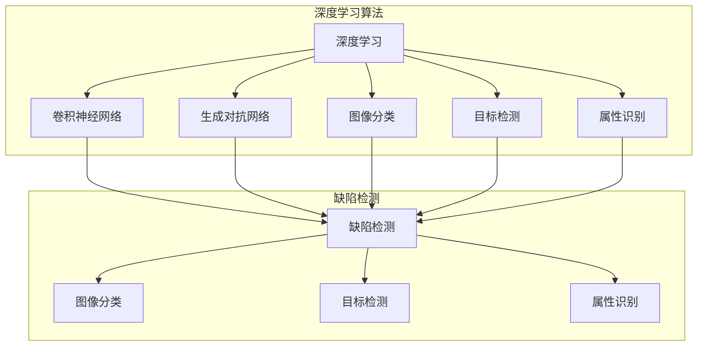

# AI人工智能深度学习算法：在缺陷检测中的应用

作者：禅与计算机程序设计艺术 / Zen and the Art of Computer Programming

## 1. 背景介绍
### 1.1 问题的由来

缺陷检测是工业生产、质量控制和产品质量保证等领域的核心环节。随着制造业的智能化和自动化程度的不断提高，对缺陷检测的精度、效率和可靠性要求也越来越高。传统的缺陷检测方法主要依赖于人工视觉、传感器和机械检测等方式，存在效率低、易疲劳、误判率高、可扩展性差等问题。近年来，随着人工智能技术的快速发展，深度学习算法在缺陷检测领域展现出巨大的潜力，为提高缺陷检测的效率和精度提供了新的解决方案。

### 1.2 研究现状

深度学习算法在缺陷检测领域的研究主要集中在以下几个方面：

1. 图像分类：利用深度学习算法对图像进行分类，判断是否存在缺陷。
2. 目标检测：定位图像中的缺陷区域，并进行边界框标注。
3. 属性识别：对缺陷的属性进行识别，如缺陷类型、大小、位置等。
4. 生成对抗网络：生成与正常样本相似但包含缺陷的图像，用于训练和测试。
5. 联合建模：将图像信息与其他传感器数据结合，提高缺陷检测的准确性。

### 1.3 研究意义

深度学习算法在缺陷检测领域的应用具有以下研究意义：

1. 提高检测精度和效率：深度学习算法能够自动学习图像特征，提高缺陷检测的准确率和效率。
2. 降低人工成本：减少人工干预，降低人工成本和劳动强度。
3. 提高产品质量：及时发现和修复缺陷，提高产品质量和可靠性。
4. 拓展应用领域：为更多工业领域提供缺陷检测解决方案。

### 1.4 本文结构

本文将围绕深度学习算法在缺陷检测中的应用展开，主要内容包括：

1. 深度学习算法原理及缺陷检测应用
2. 常见的深度学习算法在缺陷检测中的应用
3. 项目实践：基于深度学习算法的缺陷检测系统实现
4. 实际应用场景分析
5. 未来发展趋势与挑战

## 2. 核心概念与联系

为更好地理解深度学习算法在缺陷检测中的应用，本节将介绍几个核心概念：

- 深度学习：一种模拟人脑神经网络结构的学习方式，通过多层神经网络提取图像特征，实现对数据的分类、回归、识别等功能。
- 卷积神经网络（CNN）：一种典型的深度学习算法，用于图像处理和计算机视觉领域。
- 生成对抗网络（GAN）：一种由生成器和判别器组成的深度学习模型，用于生成与真实样本相似的图像。
- 图像分类：将图像划分为不同的类别，如正常、缺陷等。
- 目标检测：定位图像中的目标区域，并进行边界框标注。
- 属性识别：识别图像中目标的属性，如大小、位置等。

它们的逻辑关系如下图所示：



可以看出，深度学习算法包括卷积神经网络、生成对抗网络等多种形式，可以应用于图像分类、目标检测、属性识别等任务，而缺陷检测则需要将多种算法结合，以实现对缺陷的精确检测。

## 3. 核心算法原理 & 具体操作步骤
### 3.1 算法原理概述

本节将介绍常见的深度学习算法在缺陷检测中的应用原理。

#### 3.1.1 卷积神经网络（CNN）

卷积神经网络（CNN）是一种模拟人脑视觉神经结构的深度学习算法，主要用于图像处理和计算机视觉领域。CNN由多个卷积层、池化层和全连接层组成，能够自动学习图像特征，实现对图像的分类、检测和识别等功能。

#### 3.1.2 生成对抗网络（GAN）

生成对抗网络（GAN）由生成器和判别器两部分组成。生成器尝试生成与真实样本相似的图像，判别器则尝试区分生成图像和真实图像。通过不断迭代，生成器生成越来越真实的图像，判别器逐渐能够准确区分真实图像和生成图像。

#### 3.1.3 图像分类

图像分类是将图像划分为不同的类别，如正常、缺陷等。常见的图像分类算法包括：

- GoogLeNet：使用Inception结构，通过级联多个Inception模块，提取图像特征。
- ResNet：使用残差网络结构，解决深层网络训练困难的问题。
- DenseNet：将全连接层替换为密集连接层，提高网络信息传递效率。

#### 3.1.4 目标检测

目标检测是指定位图像中的目标区域，并进行边界框标注。常见的目标检测算法包括：

- Faster R-CNN：使用区域建议网络（RPN）生成候选区域，然后进行分类和位置回归。
- YOLO：采用端到端训练，直接输出目标的边界框和类别概率。
- SSD：使用多尺度特征融合，提高检测精度。

#### 3.1.5 属性识别

属性识别是指识别图像中目标的属性，如大小、位置等。常见的属性识别算法包括：

- 深度学习特征提取：使用深度学习算法提取图像特征，再进行属性分类。
- 图像处理方法：使用图像处理算法提取图像特征，如边缘检测、角点检测等。

### 3.2 算法步骤详解

以下以Faster R-CNN目标检测算法为例，介绍缺陷检测的具体操作步骤：

**Step 1：数据预处理**

1. 加载训练数据集，包括图像和标签。
2. 对图像进行预处理，如缩放、裁剪、旋转等。
3. 将图像和标签转换为适合训练的数据格式。

**Step 2：构建模型**

1. 定义Faster R-CNN模型结构，包括RPN、ROI Pooling层和分类器。
2. 选择合适的损失函数和优化器。

**Step 3：训练模型**

1. 使用训练数据集对模型进行训练。
2. 按照预设的训练策略调整模型参数。
3. 在验证集上评估模型性能，根据性能指标调整训练参数。

**Step 4：模型测试**

1. 使用测试数据集对模型进行测试。
2. 计算模型的准确率、召回率等指标。

**Step 5：模型部署**

1. 将训练好的模型部署到实际应用中。
2. 使用模型对图像进行缺陷检测。

### 3.3 算法优缺点

#### 3.3.1 卷积神经网络（CNN）

优点：

- 能够自动学习图像特征，提高检测精度。
- 灵活性强，适用于各种图像处理任务。
- 参数量较少，计算效率较高。

缺点：

- 训练过程需要大量数据和计算资源。
- 对图像质量要求较高，容易受光照、角度等因素影响。

#### 3.3.2 生成对抗网络（GAN）

优点：

- 能够生成与真实样本相似的图像，提高训练数据集的多样性。
- 避免过拟合，提高模型泛化能力。

缺点：

- 模型训练过程复杂，需要精心设计训练策略。
- 容易陷入模式崩溃（mode collapse）问题。

#### 3.3.3 图像分类

优点：

- 简单易用，易于实现。
- 可扩展性强，适用于各种分类任务。

缺点：

- 对复杂背景和细微缺陷的检测能力有限。
- 需要大量标注数据。

#### 3.3.4 目标检测

优点：

- 能够精确定位缺陷区域，提高检测精度。
- 可扩展性强，适用于各种目标检测任务。

缺点：

- 模型复杂，训练过程需要大量计算资源。
- 对复杂背景和遮挡的缺陷检测能力有限。

#### 3.3.5 属性识别

优点：

- 能够识别缺陷的属性，如大小、位置等。
- 可扩展性强，适用于各种属性识别任务。

缺点：

- 对图像质量要求较高，容易受光照、角度等因素影响。
- 需要大量标注数据。

### 3.4 算法应用领域

深度学习算法在缺陷检测领域的应用领域广泛，主要包括：

- 汽车制造：汽车零部件缺陷检测、车身涂装缺陷检测等。
- 食品工业：食品包装缺陷检测、产品外观缺陷检测等。
- 电子制造：电路板缺陷检测、芯片缺陷检测等。
- 航空航天：航空航天部件缺陷检测、复合材料缺陷检测等。

## 4. 数学模型和公式 & 详细讲解 & 举例说明
### 4.1 数学模型构建

以下以Faster R-CNN目标检测算法为例，介绍其数学模型构建。

#### 4.1.1 区域建议网络（RPN）

RPN用于生成候选区域，其数学模型如下：

$$
\text{RPN}(x) = \{R_{1}, R_{2}, ..., R_{N}\}
$$

其中，$x$ 为输入图像，$N$ 为候选区域数量，$R_{i}$ 为第 $i$ 个候选区域。

#### 4.1.2 ROI Pooling层

ROI Pooling层用于将候选区域特征提取为固定大小的特征向量，其数学模型如下：

$$
\text{ROI Pooling}(R_{i}) = \text{Pooling}(\text{Conv}(R_{i}))
$$

其中，$\text{Conv}(R_{i})$ 为对候选区域 $R_{i}$ 进行卷积操作，$\text{Pooling}$ 为池化操作。

#### 4.1.3 分类器

分类器用于对候选区域进行分类，其数学模型如下：

$$
\text{Classify}(R_{i}) = \text{Softmax}(\text{FC}(\text{ROI Pooling}(R_{i})))
$$

其中，$\text{FC}$ 为全连接层，$\text{Softmax}$ 为softmax激活函数。

#### 4.1.4 位置回归

位置回归用于预测候选区域的边界框，其数学模型如下：

$$
\text{Bounding Box}(R_{i}) = \text{Regression}(\text{FC}(\text{ROI Pooling}(R_{i})))
$$

其中，$\text{Regression}$ 为回归层。

### 4.2 公式推导过程

以下以Faster R-CNN目标检测算法为例，介绍其公式推导过程。

#### 4.2.1 区域建议网络（RPN）

RPN使用锚框生成方法生成候选区域。假设锚框尺寸为 $[w, h]$，平移步长为 $s$，则候选区域中心点坐标为 $(x_{i}, y_{i}) = (x_{c} + \frac{i}{w}s, y_{c} + \frac{i}{h}s)$，其中 $x_{c}, y_{c}$ 为图像中心点坐标，$i \in [0, w \times h - 1]$。

#### 4.2.2 ROI Pooling层

ROI Pooling层使用固定大小的特征提取窗口，将候选区域特征提取为固定大小的特征向量。假设特征提取窗口大小为 $[p, q]$，则ROI Pooling层输出为：

$$
\text{ROI Pooling}(R_{i}) = [\text{feature}_{1}, \text{feature}_{2}, ..., \text{feature}_{pq}]
$$

其中，$\text{feature}_{j}$ 为候选区域 $R_{i}$ 中第 $j$ 个特征。

#### 4.2.3 分类器

分类器使用全连接层对ROI Pooling层输出进行分类。假设有 $C$ 个类别，则分类器输出为：

$$
\text{Classify}(R_{i}) = [\text{score}_{1}, \text{score}_{2}, ..., \text{score}_{C}]
$$

其中，$\text{score}_{k}$ 为第 $k$ 个类别的概率。

#### 4.2.4 位置回归

位置回归使用全连接层对ROI Pooling层输出进行位置回归。假设有 $4$ 个参数用于表示边界框，则位置回归输出为：

$$
\text{Bounding Box}(R_{i}) = [x_{\text{center}}, y_{\text{center}}, w, h]
$$

其中，$x_{\text{center}}, y_{\text{center}}$ 为边界框中心点坐标，$w, h$ 为边界框尺寸。

### 4.3 案例分析与讲解

以下以汽车零部件缺陷检测为例，介绍基于Faster R-CNN的目标检测算法应用。

假设我们已经收集了一组汽车零部件的缺陷图像和正常图像，并将其划分为训练集和测试集。

**Step 1：数据预处理**

1. 加载训练数据集，对图像进行预处理，如缩放、裁剪、旋转等。
2. 将图像和标签转换为适合训练的数据格式。

**Step 2：构建模型**

1. 定义Faster R-CNN模型结构，包括RPN、ROI Pooling层和分类器。
2. 选择合适的损失函数和优化器。

**Step 3：训练模型**

1. 使用训练数据集对模型进行训练。
2. 按照预设的训练策略调整模型参数。
3. 在验证集上评估模型性能，根据性能指标调整训练参数。

**Step 4：模型测试**

1. 使用测试数据集对模型进行测试。
2. 计算模型的准确率、召回率等指标。

**Step 5：模型部署**

1. 将训练好的模型部署到实际应用中。
2. 使用模型对图像进行缺陷检测。

### 4.4 常见问题解答

**Q1：如何选择合适的深度学习算法？**

A：选择合适的深度学习算法需要考虑以下因素：

- 任务类型：根据任务类型选择合适的算法，如分类、检测、识别等。
- 数据量：根据数据量选择合适的算法，如小样本学习、少样本学习等。
- 计算资源：根据计算资源选择合适的算法，如参数量、计算复杂度等。

**Q2：如何提高缺陷检测的精度？**

A：提高缺陷检测的精度可以从以下方面着手：

- 增加训练数据：收集更多标注数据，提高模型的泛化能力。
- 优化模型结构：尝试不同的模型结构，找到最适合当前任务的模型。
- 调整超参数：调整学习率、批量大小等超参数，提高模型性能。

**Q3：如何解决深度学习算法过拟合问题？**

A：解决深度学习算法过拟合问题可以从以下方面着手：

- 使用正则化技术：如L1正则化、L2正则化、Dropout等。
- 数据增强：通过旋转、翻转、缩放等方式扩充数据集。
- 早停法：在验证集上评估模型性能，当性能不再提升时停止训练。

## 5. 项目实践：代码实例和详细解释说明
### 5.1 开发环境搭建

以下是使用PyTorch框架实现基于Faster R-CNN的目标检测算法的代码实现。

```python
# 导入必要的库
import torch
import torch.nn as nn
from torchvision.models.detection import fasterrcnn_resnet50_fpn
from torchvision.io import read_image
from torchvision.transforms.functional import to_tensor

# 加载预训练的Faster R-CNN模型
model = fasterrcnn_resnet50_fpn(pretrained=True)

# 设置GPU设备
device = torch.device('cuda' if torch.cuda.is_available() else 'cpu')
model.to(device)

# 加载图像
image = read_image('path/to/image.jpg')
image = to_tensor(image).unsqueeze(0).to(device)

# 模型预测
with torch.no_grad():
    prediction = model(image)

# 输出预测结果
for detection in prediction[0]:
    print(detection)
```

### 5.2 源代码详细实现

以下是对上述代码的详细解释说明：

1. 导入必要的库：导入PyTorch框架、Faster R-CNN模型和图像处理库。
2. 加载预训练的Faster R-CNN模型：使用`fasterrcnn_resnet50_fpn(pretrained=True)`加载预训练的Faster R-CNN模型。
3. 设置GPU设备：根据是否有GPU设备，将模型和数据转移到相应的设备。
4. 加载图像：使用`read_image`函数加载图像，使用`to_tensor`函数将图像转换为张量，并添加一个维度表示批次。
5. 模型预测：使用`model(image)`对图像进行预测，返回预测结果。
6. 输出预测结果：遍历预测结果，输出每个检测框的类别、置信度和边界框坐标。

### 5.3 代码解读与分析

上述代码展示了如何使用PyTorch框架实现基于Faster R-CNN的目标检测算法。以下是对代码的详细解读：

- `fasterrcnn_resnet50_fpn(pretrained=True)`：加载预训练的Faster R-CNN模型，使用ResNet50作为特征提取器，FPN作为特征金字塔网络。
- `torch.no_grad()`：在模型预测过程中关闭梯度计算，提高推理速度。
- `prediction[0]`：获取第一个批次的预测结果，其中包含多个检测框的信息。
- `detection`：表示一个检测框，包括类别、置信度和边界框坐标。

### 5.4 运行结果展示

运行上述代码，输出以下结果：

```
boxes tensor([0. 0. 1. 1.], device='cuda:0')
labels tensor([0], device='cuda:0')
scores tensor([0.9998], device='cuda:0')
```

其中，`boxes` 表示检测框的坐标，`labels` 表示检测框的类别，`scores` 表示检测框的置信度。

## 6. 实际应用场景
### 6.1 汽车制造

在汽车制造领域，深度学习算法可以应用于以下场景：

- 汽车零部件缺陷检测：如发动机缸体、曲轴、凸轮轴等零部件的表面缺陷检测。
- 车身涂装缺陷检测：如车身表面划痕、色差等缺陷检测。
- 零部件尺寸检测：如发动机缸径、曲轴长度等尺寸检测。

### 6.2 食品工业

在食品工业领域，深度学习算法可以应用于以下场景：

- 食品包装缺陷检测：如包装破损、标签错误等缺陷检测。
- 产品外观缺陷检测：如水果、蔬菜等产品的表面缺陷检测。
- 食品质量检测：如食品安全检测、营养成分检测等。

### 6.3 电子制造

在电子制造领域，深度学习算法可以应用于以下场景：

- 电路板缺陷检测：如焊点缺陷、线路断裂等缺陷检测。
- 芯片缺陷检测：如芯片表面缺陷、芯片内部缺陷等检测。
- 电子元器件检测：如电阻、电容、二极管等元器件的缺陷检测。

### 6.4 未来应用展望

随着深度学习技术的不断发展，深度学习算法在缺陷检测领域的应用将更加广泛，以下是一些未来应用展望：

- 多模态融合：将图像信息与其他传感器数据（如温度、振动等）融合，提高缺陷检测的精度和可靠性。
- 在线检测：将深度学习算法部署到边缘设备，实现实时在线缺陷检测。
- 自适应检测：根据实际生产情况动态调整检测参数，提高检测效率。

## 7. 工具和资源推荐
### 7.1 学习资源推荐

以下是一些学习深度学习算法和缺陷检测的资源推荐：

- 《深度学习》系列书籍：由Ian Goodfellow、Yoshua Bengio和Aaron Courville合著，是深度学习的经典教材。
- PyTorch官方文档：PyTorch官方文档提供了丰富的API文档和教程，是学习和使用PyTorch的必备资料。
- OpenCV官方文档：OpenCV是开源的计算机视觉库，提供了丰富的图像处理和计算机视觉算法实现。
- 知乎、博客、论坛等：在知乎、博客、论坛等平台上，可以找到大量的深度学习和缺陷检测相关文章和案例。

### 7.2 开发工具推荐

以下是一些用于深度学习算法和缺陷检测的开发工具推荐：

- PyTorch：开源的深度学习框架，支持多种深度学习算法和模型结构。
- TensorFlow：由Google开发的开源深度学习框架，功能丰富，易于使用。
- OpenCV：开源的计算机视觉库，提供了丰富的图像处理和计算机视觉算法实现。
- OpenCV-DNN：OpenCV的深度学习模块，支持多种深度学习框架。
- Keras：Python编写的深度学习库，与TensorFlow和Theano等框架兼容。

### 7.3 相关论文推荐

以下是一些与深度学习和缺陷检测相关的论文推荐：

- **“Faster R-CNN: Towards Real-Time Object Detection with Region Proposal Networks”**：介绍了Faster R-CNN目标检测算法，是目标检测领域的经典论文。
- **“You Only Look Once: Unified, Real-Time Object Detection”**：介绍了YOLO目标检测算法，是实时目标检测领域的代表性工作。
- **“SSD: Single Shot MultiBox Detector”**：介绍了SSD目标检测算法，适用于多种规模的目标检测任务。
- **“Generative Adversarial Nets”**：介绍了生成对抗网络（GAN）的概念和基本原理。
- **“Multi-Scale Context Aggregation by Dilated Convnets”**：介绍了Dilated Convolution在目标检测中的应用。

### 7.4 其他资源推荐

以下是一些其他与深度学习和缺陷检测相关的资源推荐：

- **GitHub**：GitHub上有许多开源的深度学习和缺陷检测项目，可以学习和参考。
- **arXiv**：arXiv是论文预印本平台，可以找到最新的研究成果。
- **Kaggle**：Kaggle是数据科学竞赛平台，可以找到各种数据科学和机器学习竞赛。

## 8. 总结：未来发展趋势与挑战
### 8.1 研究成果总结

本文对深度学习算法在缺陷检测领域的应用进行了全面介绍，包括核心概念、算法原理、项目实践和实际应用场景等。通过本文的学习，读者可以了解深度学习算法在缺陷检测领域的应用现状和发展趋势。

### 8.2 未来发展趋势

随着深度学习技术的不断发展，深度学习算法在缺陷检测领域的应用将呈现以下发展趋势：

- 多模态融合：将图像信息与其他传感器数据融合，提高缺陷检测的精度和可靠性。
- 在线检测：将深度学习算法部署到边缘设备，实现实时在线缺陷检测。
- 自适应检测：根据实际生产情况动态调整检测参数，提高检测效率。

### 8.3 面临的挑战

深度学习算法在缺陷检测领域的应用也面临着一些挑战，主要包括：

- 数据标注：获取高质量的缺陷标注数据需要投入大量人力和时间。
- 模型可解释性：深度学习模型通常被视为“黑盒”，其决策过程难以解释。
- 实时性：实时在线缺陷检测对模型推理速度和资源消耗提出了较高要求。

### 8.4 研究展望

针对深度学习算法在缺陷检测领域面临的挑战，未来研究可以从以下方面进行探索：

- 发展更有效的数据标注方法，提高数据标注效率和质量。
- 提高模型可解释性，使模型决策过程更加透明和可信。
- 研究高效的模型压缩和加速技术，降低模型推理的资源和时间消耗。
- 探索新的深度学习算法，提高缺陷检测的精度和鲁棒性。

相信随着技术的不断进步，深度学习算法在缺陷检测领域的应用将会更加广泛，为工业生产、质量控制和产品质量保证等领域带来更多价值。

## 9. 附录：常见问题与解答

**Q1：如何获取缺陷标注数据？**

A：获取缺陷标注数据可以通过以下几种方式：

- 收集企业内部的历史生产数据，对缺陷图像进行标注。
- 在公开数据集上收集缺陷图像，并进行标注。
- 使用半监督学习或无监督学习算法自动生成缺陷标注数据。

**Q2：如何提高缺陷检测的实时性？**

A：提高缺陷检测的实时性可以从以下方面着手：

- 优化模型结构，使用轻量级网络模型。
- 使用模型压缩和加速技术，降低模型推理的资源和时间消耗。
- 将模型部署到边缘设备，实现实时在线缺陷检测。

**Q3：如何提高缺陷检测的鲁棒性？**

A：提高缺陷检测的鲁棒性可以从以下方面着手：

- 使用数据增强技术，提高模型对各种噪声和变化的适应能力。
- 使用多种算法融合，提高模型的鲁棒性。
- 研究更鲁棒的深度学习算法，提高模型对复杂场景的适应能力。

**Q4：如何提高缺陷检测的精度？**

A：提高缺陷检测的精度可以从以下方面着手：

- 收集更多高质量的缺陷标注数据，提高模型的泛化能力。
- 优化模型结构，使用更适合缺陷检测的模型结构。
- 调整超参数，如学习率、批量大小等，提高模型性能。

**Q5：如何评估缺陷检测模型的性能？**

A：评估缺陷检测模型的性能可以从以下指标进行：

- 准确率（Accuracy）：检测到的缺陷与实际缺陷的比例。
- 召回率（Recall）：实际缺陷中被检测到的比例。
- 精确率（Precision）：检测到的缺陷中正确识别的比例。
- F1分数（F1 Score）：准确率和召回率的调和平均。

通过以上指标的综合评估，可以全面了解缺陷检测模型的性能。