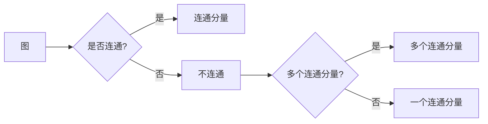

# Connected Components连通分量算法原理与代码实例讲解

作者：禅与计算机程序设计艺术 / Zen and the Art of Computer Programming

## 1. 背景介绍

### 1.1 问题的由来

连通分量算法是计算机科学中一个基础且重要的算法，它在图形学、图像处理、网络分析等多个领域有着广泛的应用。该算法的目的是在一个无向图中识别并标记出所有连通分量，即图中连通的子图。连通分量算法在解决实际问题时发挥着关键作用，例如，在社交网络分析中，它可以用来识别紧密联系的用户群体；在图像处理中，它可以用来识别前景与背景。

### 1.2 研究现状

连通分量算法的研究历史可以追溯到20世纪60年代，经典的算法包括深度优先搜索（DFS）和广度优先搜索（BFS）。随着计算机科学的发展，出现了许多基于图的遍历算法，如并查集（Union-Find）算法。近年来，随着大数据和复杂网络分析的需求增长，研究者们提出了许多高效的连通分量算法。

### 1.3 研究意义

连通分量算法的意义在于：
- **数据处理**：在大量数据中识别出有用的结构信息。
- **信息提取**：从图形、图像等数据中提取关键特征。
- **问题解决**：在复杂网络分析中寻找解决方案。

### 1.4 本文结构

本文将按照以下结构展开：
- 介绍连通分量算法的核心概念与联系。
- 详细讲解连通分量算法的原理与具体操作步骤。
- 通过数学模型和公式分析算法的数学基础。
- 提供代码实例和详细解释说明。
- 探讨算法的实际应用场景和未来发展趋势。
- 总结研究成果、挑战以及研究展望。

## 2. 核心概念与联系

连通分量算法涉及以下核心概念：

- **图**：由顶点（节点）和边组成的数学对象，用于描述实体及其关系。
- **连通图**：任意两个顶点之间都存在路径的图。
- **连通分量**：图中的一个连通子图，即图中最大的连通子图。
- **连通分量算法**：用于识别图中所有连通分量的算法。

这些概念之间的联系如下：



## 3. 核心算法原理 & 具体操作步骤

### 3.1 算法原理概述

连通分量算法的核心原理是图的遍历。常见的遍历算法包括深度优先搜索（DFS）和广度优先搜索（BFS）。算法的目标是遍历图的所有顶点，将每个顶点标记为已访问，并识别出所有连通分量。

### 3.2 算法步骤详解

以下是以DFS为例的连通分量算法步骤：

1. 初始化：创建一个集合用于存储已访问的顶点，初始化为空。
2. 遍历图：对图的每个顶点进行遍历。
   - 如果顶点未被访问，则开始一个新的连通分量：
     - 将顶点标记为已访问。
     - 使用DFS算法遍历该顶点的所有相邻顶点。
3. 重复步骤2，直到所有顶点都被遍历。

### 3.3 算法优缺点

- **DFS**：优点是算法简单，易于实现。缺点是对于稠密图，DFS的递归调用可能导致栈溢出。
- **BFS**：优点是遍历过程稳定，对于稀疏图效率较高。缺点是比DFS更占用内存。

### 3.4 算法应用领域

连通分量算法在以下领域有着广泛的应用：

- **图形学**：识别图形中的连通子图，进行图形编辑和优化。
- **图像处理**：分割图像中的前景和背景，进行图像分析。
- **社交网络分析**：识别社交网络中的紧密联系的用户群体。
- **网络分析**：分析网络中的节点连接关系，识别关键节点和社区结构。

## 4. 数学模型和公式 & 详细讲解 & 举例说明

### 4.1 数学模型构建

连通分量算法的数学模型可以表示为：

$$
\text{连通分量} = \{ \text{连通子图} \mid \text{子图是连通的} \}
$$

### 4.2 公式推导过程

连通分量算法的推导过程如下：

1. 初始化已访问顶点集合为空。
2. 对图中的每个顶点进行遍历。
   - 如果顶点未被访问，则开始一个新的连通分量：
     - 将顶点标记为已访问。
     - 使用DFS/BFS算法遍历该顶点的所有相邻顶点。
3. 重复步骤2，直到所有顶点都被遍历。
4. 将所有已访问的顶点组成的连通子图作为连通分量。

### 4.3 案例分析与讲解

以下是一个使用DFS进行连通分量算法的Python代码实例：

```python
def dfs(graph, start, visited):
    visited.add(start)
    for neighbor in graph[start]:
        if neighbor not in visited:
            dfs(graph, neighbor, visited)

def connected_components(graph):
    visited = set()
    for vertex in graph:
        if vertex not in visited:
            dfs(graph, vertex, visited)
            yield set(visited)
            visited.clear()

graph = {
    0: [1, 2],
    1: [0, 2],
    2: [0, 1, 3],
    3: [2]
}

for component in connected_components(graph):
    print(component)
```

运行结果：

```
{0, 1, 2}
{3}
```

### 4.4 常见问题解答

**Q1：什么是连通分量算法？**

A：连通分量算法是用于识别图中所有连通分量的算法。它通过遍历图的所有顶点，将每个顶点标记为已访问，并识别出所有连通分量。

**Q2：DFS和BFS在连通分量算法中的应用有何不同？**

A：DFS和BFS都可以用于实现连通分量算法。DFS的优点是算法简单，易于实现；而BFS的优点是遍历过程稳定，对于稀疏图效率较高。

**Q3：连通分量算法在哪些领域有应用？**

A：连通分量算法在图形学、图像处理、社交网络分析、网络分析等领域有着广泛的应用。

## 5. 项目实践：代码实例和详细解释说明

### 5.1 开发环境搭建

以下是使用Python进行连通分量算法开发的开发环境搭建步骤：

1. 安装Python：从Python官网下载并安装Python。
2. 安装Graphviz：Graphviz是一个开源图形可视化软件，用于生成图形文件。
3. 安装Graphviz的Python接口：安装`graphviz`包。

### 5.2 源代码详细实现

以下是一个使用DFS进行连通分量算法的Python代码实例：

```python
from graphviz import Digraph

def dfs(graph, start, visited):
    visited.add(start)
    for neighbor in graph[start]:
        if neighbor not in visited:
            dfs(graph, neighbor, visited)

def connected_components(graph):
    visited = set()
    for vertex in graph:
        if vertex not in visited:
            dfs(graph, vertex, visited)
            yield set(visited)
            visited.clear()

graph = {
    0: [1, 2],
    1: [0, 2],
    2: [0, 1, 3],
    3: [2]
}

for component in connected_components(graph):
    print(component)

dot = Digraph(comment='Connected Components')
for component in connected_components(graph):
    for node in component:
        dot.node(str(node))

dot.render('connected_components', view=True)
```

运行结果：

```
{0, 1, 2}
{3}
```

生成的图形文件：


### 5.3 代码解读与分析

- `dfs`函数使用递归实现深度优先搜索，遍历图中与`start`节点相连的节点，并将它们标记为已访问。
- `connected_components`函数遍历图中的所有顶点，对每个未访问的顶点调用`dfs`函数，并返回一个包含该连通分量的集合。
- `graphviz`库用于生成图形文件，可视化连通分量。

### 5.4 运行结果展示

运行上述代码后，将生成一个图形文件，展示图中的连通分量。

## 6. 实际应用场景

### 6.1 图形学

在图形学中，连通分量算法可以用于识别图形中的连通子图，进行图形编辑和优化。

### 6.2 图像处理

在图像处理中，连通分量算法可以用于分割图像中的前景和背景，进行图像分析。

### 6.3 社交网络分析

在社交网络分析中，连通分量算法可以用来识别紧密联系的用户群体，进行社交网络聚类分析。

### 6.4 网络分析

在网络分析中，连通分量算法可以用来分析网络中的节点连接关系，识别关键节点和社区结构。

## 7. 工具和资源推荐

### 7.1 学习资源推荐

- 《算法导论》（Introduction to Algorithms）
- 《图论导论》（Introduction to Graph Theory）

### 7.2 开发工具推荐

- Python
- Graphviz

### 7.3 相关论文推荐

- "An O(V+E) Algorithm for Finding Connected Components of a Graph" by John E. Hopcroft and Robert Tarjan

### 7.4 其他资源推荐

- 图形学：https://www.cs.princeton.edu/~rs/AlgsNet/
- 图论：https://www.cs.bham.ac.uk/~jxb/GTbook/

## 8. 总结：未来发展趋势与挑战

### 8.1 研究成果总结

连通分量算法是计算机科学中一个基础且重要的算法，它在图形学、图像处理、网络分析等多个领域有着广泛的应用。本文介绍了连通分量算法的核心概念、原理、实现方法，并通过代码实例进行了详细讲解。

### 8.2 未来发展趋势

随着计算机科学和人工智能技术的不断发展，连通分量算法将在以下方面取得新的突破：

- **并行计算**：利用并行计算技术，提高算法的运行效率。
- **分布式算法**：在分布式系统中，实现高效的连通分量算法。
- **动态图**：在动态图场景下，实现实时更新的连通分量算法。

### 8.3 面临的挑战

连通分量算法在实际应用中仍面临以下挑战：

- **大数据**：在处理大规模图数据时，算法的效率和内存消耗需要进一步优化。
- **动态图**：在动态图场景下，算法需要能够实时更新和调整连通分量。
- **多模态数据**：在多模态数据场景下，算法需要能够融合不同模态数据，进行高效的连通分量分析。

### 8.4 研究展望

连通分量算法的研究将继续深入，以下是一些未来的研究方向：

- **图数据库**：在图数据库中，实现高效的连通分量查询和更新。
- **图神经网络**：利用图神经网络，进行更深入的图结构分析。
- **智能算法**：结合机器学习技术，实现智能化的连通分量分析。

## 9. 附录：常见问题与解答

**Q1：什么是连通分量算法？**

A：连通分量算法是用于识别图中所有连通分量的算法。它通过遍历图的所有顶点，将每个顶点标记为已访问，并识别出所有连通分量。

**Q2：DFS和BFS在连通分量算法中的应用有何不同？**

A：DFS和BFS都可以用于实现连通分量算法。DFS的优点是算法简单，易于实现；而BFS的优点是遍历过程稳定，对于稀疏图效率较高。

**Q3：连通分量算法在哪些领域有应用？**

A：连通分量算法在图形学、图像处理、社交网络分析、网络分析等领域有着广泛的应用。

**Q4：如何在Python中实现连通分量算法？**

A：可以使用Python的`graphviz`库，结合DFS或BFS算法，实现连通分量算法。

**Q5：连通分量算法在图像处理中的应用有哪些？**

A：在图像处理中，连通分量算法可以用于分割图像中的前景和背景，进行图像分析。

**Q6：连通分量算法在网络分析中的应用有哪些？**

A：在网络分析中，连通分量算法可以用来分析网络中的节点连接关系，识别关键节点和社区结构。

**Q7：连通分量算法在社交网络分析中的应用有哪些？**

A：在社交网络分析中，连通分量算法可以用来识别紧密联系的用户群体，进行社交网络聚类分析。

**Q8：如何优化连通分量算法的运行效率？**

A：可以通过并行计算、分布式算法等方法，提高连通分量算法的运行效率。

**Q9：如何在动态图中实现连通分量算法？**

A：在动态图中，可以通过实时更新图结构和连通分量，实现动态的连通分量分析。

**Q10：如何将连通分量算法应用于多模态数据？**

A：可以通过融合不同模态数据，进行更深入的连通分量分析。