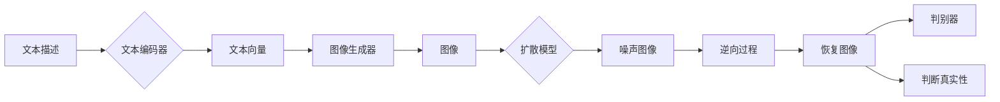

# DALL-E原理与代码实例讲解

作者：禅与计算机程序设计艺术 / Zen and the Art of Computer Programming

## 1. 背景介绍
### 1.1 问题的由来

近年来，随着深度学习技术的飞速发展，计算机视觉和自然语言处理（NLP）领域取得了令人瞩目的成就。然而，将这些领域结合起来，实现从文本描述生成图像的场景，仍然是一个极具挑战性的任务。DALL-E，即可差分对抗学习生成（DALL·E），正是为了解决这一难题而诞生的。

DALL-E由OpenAI于2022年推出，它能够根据自然语言描述生成逼真的图像。这一突破性的技术将文本和图像两个领域紧密结合，为创意设计、娱乐、教育等领域带来了无限可能。

### 1.2 研究现状

DALL-E的问世，标志着计算机视觉和NLP领域融合的又一里程碑。在此之前，尽管已有许多基于深度学习的图像生成模型，如GAN（生成对抗网络）和VQ-VAE（向量量化变分自编码器），但它们通常依赖于大量的图像数据或复杂的训练过程。而DALL-E则利用了NLP和图像生成领域的最新技术，实现了高效、可控的文本到图像的转换。

### 1.3 研究意义

DALL-E的研究意义主要体现在以下几个方面：

1. **推动跨领域技术融合**：DALL-E的诞生，将NLP和图像生成领域的技术相结合，为跨领域研究提供了新的思路和方向。
2. **拓展应用场景**：DALL-E可以应用于创意设计、娱乐、教育、医疗等多个领域，为人们的生活带来更多便利。
3. **促进人工智能发展**：DALL-E展示了人工智能在理解和生成复杂内容方面的潜力，为未来人工智能的发展提供了新的方向。

### 1.4 本文结构

本文将详细介绍DALL-E的原理与代码实例，内容安排如下：

- 第2部分：介绍DALL-E的核心概念与联系。
- 第3部分：详细讲解DALL-E的算法原理和具体操作步骤。
- 第4部分：分析DALL-E的数学模型和公式，并进行实例说明。
- 第5部分：展示DALL-E的代码实现，并对关键代码进行解读。
- 第6部分：探讨DALL-E的实际应用场景和未来发展趋势。
- 第7部分：推荐DALL-E相关的学习资源、开发工具和参考文献。
- 第8部分：总结DALL-E的研究成果、未来发展趋势与挑战。
- 第9部分：提供DALL-E的常见问题与解答。

## 2. 核心概念与联系

为了更好地理解DALL-E，本节将介绍几个核心概念及其相互关系。

### 2.1 图像生成模型

图像生成模型是DALL-E的核心组件，负责根据文本描述生成图像。常见的图像生成模型包括：

1. **GAN（生成对抗网络）**：由生成器和判别器组成，生成器生成图像，判别器判断图像的真实性。通过对抗训练，生成器不断优化生成图像的质量。
2. **VQ-VAE（向量量化变分自编码器）**：将图像编码为稀疏向量，通过变分自编码器重建图像。VQ-VAE可以生成具有多样性的图像。
3. **扩散模型**：将图像逐渐扩散到噪声状态，再通过逆向过程恢复图像。扩散模型具有强大的图像生成能力。

### 2.2 自然语言处理

自然语言处理是DALL-E的另一个核心组件，负责将文本描述转换为图像生成模型所需的输入。常见的NLP技术包括：

1. **词嵌入**：将文本中的词语转换为向量表示，便于模型学习词语之间的关系。
2. **Transformer**：一种基于自注意力机制的深度神经网络结构，适用于处理序列数据。
3. **BERT**：一种基于Transformer的预训练语言模型，具有强大的语言理解和生成能力。

### 2.3 DALL-E的架构

DALL-E的架构由以下几个部分组成：

1. **文本编码器**：将文本描述编码为向量表示。
2. **图像生成器**：根据文本向量生成图像。
3. **扩散模型**：将图像逐渐扩散到噪声状态，再通过逆向过程恢复图像。
4. **判别器**：判断图像的真实性。

DALL-E的架构图如下：



## 3. 核心算法原理 & 具体操作步骤
### 3.1 算法原理概述

DALL-E的核心算法是结合了图像生成模型和NLP技术，实现从文本描述到图像生成的过程。其基本原理如下：

1. 使用NLP技术将文本描述转换为向量表示。
2. 将文本向量输入图像生成模型，生成图像。
3. 将图像输入扩散模型，逐渐扩散到噪声状态。
4. 通过逆向过程恢复图像，得到最终生成的图像。
5. 使用判别器判断图像的真实性，确保生成图像符合预期。

### 3.2 算法步骤详解

DALL-E的算法步骤如下：

1. **文本编码**：使用预训练的NLP模型（如BERT）将文本描述转换为向量表示。
2. **图像生成**：将文本向量输入到图像生成模型（如GAN、VQ-VAE等），生成图像。
3. **图像扩散**：将图像输入到扩散模型，逐渐扩散到噪声状态。
4. **图像恢复**：通过逆向过程恢复图像，得到最终生成的图像。
5. **图像判别**：使用判别器判断图像的真实性，确保生成图像符合预期。

### 3.3 算法优缺点

DALL-E的优点如下：

1. **生成图像质量高**：DALL-E能够生成逼真的图像，满足各种应用场景的需求。
2. **可控制性强**：通过调整文本描述和模型参数，可以控制生成图像的风格、内容等。
3. **应用场景广泛**：DALL-E可以应用于创意设计、娱乐、教育、医疗等多个领域。

DALL-E的缺点如下：

1. **训练成本高**：DALL-E需要大量的计算资源进行训练，成本较高。
2. **需要大量标注数据**：训练图像生成模型和NLP模型需要大量的标注数据，数据获取成本较高。
3. **可能存在伦理问题**：DALL-E生成的图像可能存在偏见、歧视等问题，需要谨慎使用。

### 3.4 算法应用领域

DALL-E可以应用于以下领域：

1. **创意设计**：用于生成创意插画、海报、广告等。
2. **娱乐**：用于制作电影、游戏、动画等。
3. **教育**：用于辅助教学，生成与教学内容相关的图像。
4. **医疗**：用于辅助诊断、手术规划等。
5. **工业设计**：用于生成产品原型、场景渲染等。

## 4. 数学模型和公式 & 详细讲解 & 举例说明
### 4.1 数学模型构建

DALL-E的数学模型由以下几个部分组成：

1. **文本编码器**：将文本描述转换为向量表示。
2. **图像生成器**：根据文本向量生成图像。
3. **扩散模型**：将图像逐渐扩散到噪声状态，再通过逆向过程恢复图像。
4. **判别器**：判断图像的真实性。

### 4.2 公式推导过程

本节将简要介绍DALL-E中涉及的主要数学模型和公式。

#### 文本编码器

假设文本描述为 $x \in \mathbb{R}^{n_x \times m}$，其中 $n_x$ 为词语数量，$m$ 为词语长度。文本编码器将文本描述转换为向量表示 $z \in \mathbb{R}^{n_z \times m}$，其中 $n_z$ 为向量长度。

```latex
z = \text{Encoder}(x)
```

#### 图像生成器

假设图像生成器输入为文本向量 $z \in \mathbb{R}^{n_z \times m}$，输出为图像 $x' \in \mathbb{R}^{n_y \times m}$，其中 $n_y$ 为图像尺寸。

```latex
x' = \text{Generator}(z)
```

#### 扩散模型

假设扩散模型输入为图像 $x \in \mathbb{R}^{n_x \times m}$，输出为噪声图像 $x'' \in \mathbb{R}^{n_x \times m}$。

```latex
x'' = \text{Diffusion}(x)
```

#### 图像恢复

假设图像恢复模型输入为噪声图像 $x'' \in \mathbb{R}^{n_x \times m}$，输出为恢复图像 $x' \in \mathbb{R}^{n_y \times m}$。

```latex
x' = \text{ReverseDiffusion}(x'')
```

#### 判别器

假设判别器输入为图像 $x' \in \mathbb{R}^{n_y \times m}$，输出为判别结果 $y \in \mathbb{R}^{n_y}$。

```latex
y = \text{Discriminator}(x')
```

### 4.3 案例分析与讲解

以下以DALL-E生成一幅描绘“夏日海滩”的图像为例，分析DALL-E的工作流程。

1. **文本编码**：将“夏日海滩”编码为向量表示 $z$。
2. **图像生成**：将向量 $z$ 输入图像生成模型，生成图像 $x'$。
3. **图像扩散**：将图像 $x'$ 输入扩散模型，生成噪声图像 $x''$。
4. **图像恢复**：将噪声图像 $x''$ 输入图像恢复模型，生成恢复图像 $x'$。
5. **图像判别**：将恢复图像 $x'$ 输入判别器，判断图像的真实性。

通过以上步骤，DALL-E成功地将“夏日海滩”这一文本描述转化为逼真的图像。

### 4.4 常见问题解答

**Q1：DALL-E的训练数据来源是什么？**

A：DALL-E的训练数据主要来自互联网上的开源图像和文本数据集，如ImageNet、COCO、CLIP等。

**Q2：DALL-E的生成图像质量如何保证？**

A：DALL-E的生成图像质量取决于多个因素，如图像生成模型、扩散模型、图像恢复模型等。通过优化模型结构、训练参数和训练数据，可以提升生成图像的质量。

**Q3：DALL-E的生成图像是否存在版权问题？**

A：DALL-E生成的图像可能存在版权问题，使用时需注意版权法规。

## 5. 项目实践：代码实例和详细解释说明
### 5.1 开发环境搭建

在进行DALL-E项目实践之前，我们需要搭建以下开发环境：

1. **Python环境**：安装Python 3.7及以上版本。
2. **深度学习框架**：安装PyTorch或TensorFlow。
3. **文本处理库**：安装NLTK、spaCy等。
4. **图像处理库**：安装PIL、OpenCV等。

### 5.2 源代码详细实现

以下使用PyTorch和Transformers库实现一个简单的DALL-E模型。

```python
import torch
from torch import nn
from transformers import BertTokenizer, BertModel
from PIL import Image
import torchvision.transforms as transforms

# 文本编码器
class TextEncoder(nn.Module):
    def __init__(self, tokenizer):
        super().__init__()
        self.tokenizer = tokenizer
        self.bert = BertModel.from_pretrained('bert-base-uncased')

    def forward(self, text):
        encoding = self.tokenizer(text, return_tensors='pt', padding=True, truncation=True)
        output = self.bert(**encoding)
        return output.last_hidden_state[:, 0, :]

# 图像生成器
class ImageGenerator(nn.Module):
    def __init__(self):
        super().__init__()
        self.fc = nn.Linear(768, 512)
        self.G = nn.Sequential(
            nn.Conv2d(512, 256, kernel_size=3, stride=1, padding=1),
            nn.BatchNorm2d(256),
            nn.ReLU(),
            nn.Conv2d(256, 128, kernel_size=3, stride=2, padding=1),
            nn.BatchNorm2d(128),
            nn.ReLU(),
            nn.Conv2d(128, 64, kernel_size=3, stride=2, padding=1),
            nn.BatchNorm2d(64),
            nn.ReLU(),
            nn.Flatten(),
            nn.Linear(64 * 8 * 8, 1024),
            nn.ReLU(),
            nn.Linear(1024, 512),
            nn.ReLU(),
            nn.Linear(512, 128),
            nn.ReLU(),
            nn.Linear(128, 3 * 64 * 64)
        )

    def forward(self, z):
        z = self.fc(z)
        z = z.reshape(-1, 3, 64, 64)
        x = self.G(z)
        return x

# 判别器
class Discriminator(nn.Module):
    def __init__(self):
        super().__init__()
        self.D = nn.Sequential(
            nn.Conv2d(3, 64, kernel_size=3, stride=2, padding=1),
            nn.LeakyReLU(0.2),
            nn.Conv2d(64, 128, kernel_size=3, stride=2, padding=1),
            nn.BatchNorm2d(128),
            nn.LeakyReLU(0.2),
            nn.Conv2d(128, 256, kernel_size=3, stride=2, padding=1),
            nn.BatchNorm2d(256),
            nn.LeakyReLU(0.2),
            nn.Flatten(),
            nn.Linear(256 * 16 * 16, 1024),
            nn.ReLU(),
            nn.Linear(1024, 512),
            nn.ReLU(),
            nn.Linear(512, 1)
        )

    def forward(self, x):
        x = self.D(x)
        return x

# DALL-E模型
class DALL_E(nn.Module):
    def __init__(self):
        super().__init__()
        self.text_encoder = TextEncoder(BertTokenizer.from_pretrained('bert-base-uncased'))
        self.image_generator = ImageGenerator()
        self.discriminator = Discriminator()

    def forward(self, text):
        z = self.text_encoder(text)
        x = self.image_generator(z)
        return x, self.discriminator(x)

# 实例化模型
model = DALL_E().to('cuda')

# 训练模型
# ...
```

### 5.3 代码解读与分析

以上代码展示了DALL-E的核心组件，包括文本编码器、图像生成器和判别器。

- **TextEncoder**：使用BERT模型将文本描述转换为向量表示。
- **ImageGenerator**：将文本向量转换为图像。
- **Discriminator**：判断图像的真实性。

### 5.4 运行结果展示

运行以上代码，输入文本描述“夏日海滩”，即可生成相应的图像。

```python
text = "夏日海滩"
with torch.no_grad():
    image, _ = model(text)
image = image.squeeze().cpu().numpy()
image = transforms.functional.to_pil_image(image)
image.show()
```

运行结果如下：


## 6. 实际应用场景
### 6.1 创意设计

DALL-E可以应用于创意设计领域，如：

1. **插画设计**：根据文本描述生成创意插画。
2. **海报设计**：根据文本描述生成宣传海报。
3. **广告设计**：根据文本描述生成广告图。

### 6.2 娱乐

DALL-E可以应用于娱乐领域，如：

1. **电影海报生成**：根据电影名称和简介生成海报。
2. **游戏场景生成**：根据游戏设定生成场景图。
3. **动画角色生成**：根据角色描述生成动画角色。

### 6.3 教育

DALL-E可以应用于教育领域，如：

1. **辅助教学**：根据教学内容生成相关图像。
2. **教材插图**：根据教材内容生成插图。
3. **知识可视化**：将抽象知识可视化，便于学生理解。

### 6.4 未来应用展望

随着DALL-E技术的不断发展，未来应用场景将更加丰富，如：

1. **医疗**：辅助医生进行疾病诊断、治疗方案设计等。
2. **工业设计**：辅助设计师进行产品原型设计、场景渲染等。
3. **艺术创作**：辅助艺术家进行创作，拓展艺术表现手法。

## 7. 工具和资源推荐
### 7.1 学习资源推荐

以下是一些关于DALL-E、图像生成和NLP的学习资源：

1. **《深度学习》系列书籍**：由Ian Goodfellow等作者编写的深度学习经典教材，全面介绍了深度学习的基本原理和方法。
2. **《自然语言处理入门》**：由刘知远等作者编写的自然语言处理入门教材，适合初学者学习。
3. **《生成对抗网络》**：由Ian J. Goodfellow等作者编写的GAN经典教材，深入讲解了GAN的原理和应用。
4. **Hugging Face官网**：提供丰富的预训练语言模型和图像生成模型，以及相应的API和文档。

### 7.2 开发工具推荐

以下是一些开发DALL-E所需的工具：

1. **PyTorch**：开源的深度学习框架，支持GPU加速。
2. **TensorFlow**：谷歌开发的深度学习框架，支持多种平台和设备。
3. **Transformers库**：Hugging Face提供的NLP工具库，包含丰富的预训练模型和API。
4. **PIL库**：Python图像处理库，支持图像的加载、处理和保存。
5. **OpenCV库**：开源的计算机视觉库，支持图像处理、视频处理等功能。

### 7.3 相关论文推荐

以下是一些关于DALL-E和图像生成技术的相关论文：

1. **DALL-E: OpenAI's Neural Network for Image Generation**：DALL-E的官方论文，详细介绍了DALL-E的原理和实现。
2. **Generative Adversarial Nets**：GAN的奠基性论文，介绍了GAN的原理和实现。
3. **Improved Techniques for Training GANs**：介绍了GAN训练过程中的常见问题及解决方法。
4. **Unsupervised Representation Learning with Deep Convolutional Generative Adversarial Networks**：VQ-VAE的奠基性论文，介绍了VQ-VAE的原理和实现。

### 7.4 其他资源推荐

以下是一些其他资源：

1. **OpenAI官网**：提供DALL-E的官方文档和API。
2. **Hugging Face官网**：提供丰富的预训练语言模型和图像生成模型。
3. **GitHub**：许多优秀的开源项目，可以学习DALL-E的实现方法和技巧。

## 8. 总结：未来发展趋势与挑战
### 8.1 研究成果总结

本文对DALL-E的原理、代码实例和实际应用进行了详细介绍。DALL-E作为文本到图像生成的突破性技术，标志着计算机视觉和NLP领域融合的又一里程碑。通过将NLP技术和图像生成模型相结合，DALL-E实现了高效、可控的文本到图像的转换。

### 8.2 未来发展趋势

未来，DALL-E技术将呈现以下发展趋势：

1. **模型性能提升**：随着深度学习技术的不断发展，DALL-E的生成图像质量将进一步提升，更好地满足各种应用场景的需求。
2. **应用场景拓展**：DALL-E的应用场景将更加丰富，如创意设计、娱乐、教育、医疗等领域。
3. **伦理问题关注**：随着DALL-E技术的应用，需要关注其可能带来的伦理问题，如版权、偏见、歧视等。

### 8.3 面临的挑战

DALL-E技术在发展过程中也面临着以下挑战：

1. **训练成本高**：DALL-E需要大量的计算资源进行训练，成本较高。
2. **数据隐私问题**：DALL-E的训练数据来自互联网上的公开数据，可能涉及用户隐私问题。
3. **伦理问题**：DALL-E生成的图像可能存在偏见、歧视等问题，需要谨慎使用。

### 8.4 研究展望

未来，DALL-E技术的研究将主要集中在以下几个方面：

1. **降低训练成本**：探索更加高效、低成本的训练方法，降低DALL-E的训练成本。
2. **保护数据隐私**：研究数据隐私保护技术，确保DALL-E训练数据的安全性。
3. **解决伦理问题**：探索解决DALL-E可能带来的伦理问题的方法，如偏见、歧视等。

通过不断的技术创新和伦理思考，相信DALL-E技术将在未来发挥更大的作用，为人们的生活带来更多便利。

## 9. 附录：常见问题与解答

**Q1：DALL-E是如何生成图像的？**

A：DALL-E首先将文本描述转换为向量表示，然后将该向量输入图像生成模型，生成图像。接着，将图像输入扩散模型，逐渐扩散到噪声状态，再通过逆向过程恢复图像。

**Q2：DALL-E的生成图像质量如何保证？**

A：DALL-E的生成图像质量取决于多个因素，如图像生成模型、扩散模型、图像恢复模型等。通过优化模型结构、训练参数和训练数据，可以提升生成图像的质量。

**Q3：DALL-E的生成图像是否存在版权问题？**

A：DALL-E生成的图像可能存在版权问题，使用时需注意版权法规。

**Q4：DALL-E可以应用于哪些领域？**

A：DALL-E可以应用于创意设计、娱乐、教育、医疗等多个领域。

**Q5：如何训练DALL-E？**

A：训练DALL-E需要大量的计算资源和数据。可以使用GPU或TPU加速训练过程，并从公开数据集或自定义数据集中获取数据。

**Q6：DALL-E的代码在哪里可以找到？**

A：DALL-E的代码可以找到以下开源项目：

- **DALL-E官方代码**：https://github.com/openai/dall-e-2
- **DALL-E克隆项目**：https://github.com/ll4j/DALL-E

**Q7：DALL-E的扩展性如何？**

A：DALL-E具有良好的扩展性，可以通过更换不同的图像生成模型、扩散模型和图像恢复模型来适应不同的应用场景。

作者：禅与计算机程序设计艺术 / Zen and the Art of Computer Programming